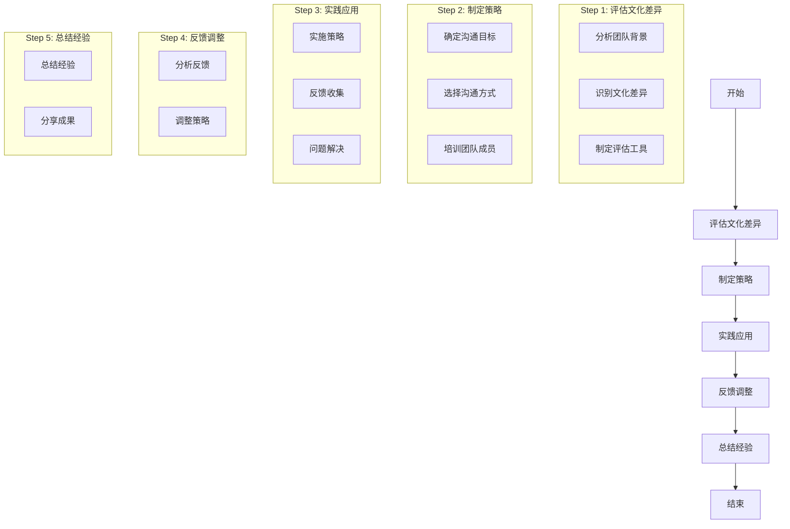
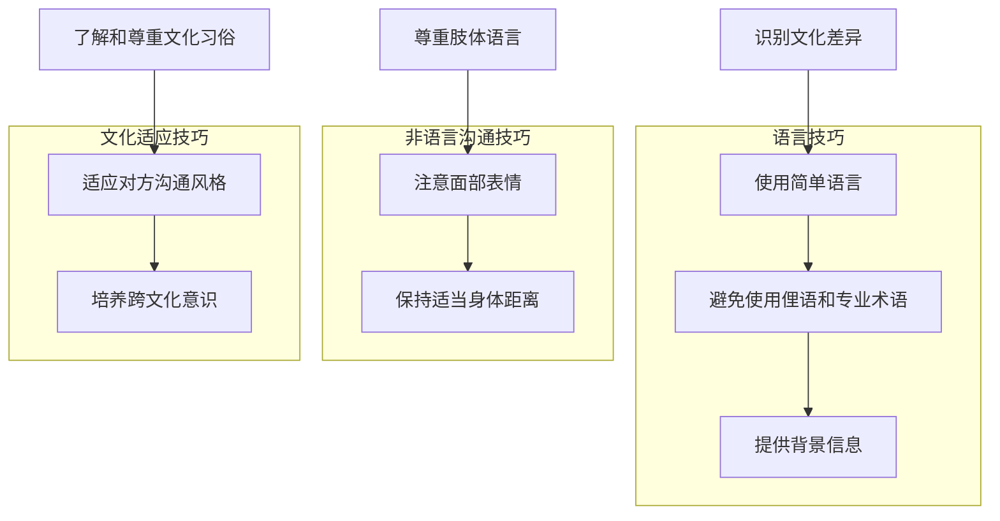

                 

**《跨文化沟通：在国际团队中有效工作》**

关键词：跨文化沟通、文化差异、国际团队、有效工作

摘要：本文旨在探讨跨文化沟通在国际团队工作中的重要性，分析其中的挑战和解决策略，为提升国际团队协作效率提供指导。

**Step 1: 引言部分**

```markdown
# 引言

## 问题背景
在国际化的今天，全球化进程的加速使得跨文化沟通在国际团队中的重要性日益凸显。不同的文化背景、语言习惯和价值观念常常导致沟通障碍，影响团队协作效果。有效的跨文化沟通不仅是团队协作的关键，也是个人职业生涯发展的重要能力。

## 问题描述
跨文化沟通中的挑战包括语言障碍、非语言沟通、文化差异等方面。理解这些挑战，并找到有效的解决策略，是提升跨文化沟通能力的关键。

## 问题解决
本书将从理论到实践，系统地介绍跨文化沟通的相关知识，帮助读者掌握跨文化沟通的策略和方法，提升跨文化沟通能力。

## 边界与外延
本书主要探讨跨文化沟通在国际团队中的有效工作，涵盖职场沟通、跨文化团队管理等内容。

## 核心概念与联系
核心概念：跨文化沟通、文化差异、非语言沟通。
概念属性特征对比表格：
```

**核心概念与联系**

### 跨文化沟通
跨文化沟通是指在两个或多个不同文化背景下进行的交流。它不仅包括语言上的差异，还涉及非语言沟通、文化习惯、价值观念等方面。

#### 文化差异
文化差异是指不同文化群体在价值观、行为模式、沟通方式等方面的不同。理解文化差异是进行有效跨文化沟通的前提。

#### 非语言沟通
非语言沟通包括肢体语言、面部表情、空间距离等。不同文化背景下的非语言沟通方式差异显著，了解这些差异有助于避免误解。

## 对比表格

```markdown
| 核心概念 | 定义 | 关联内容 |
| --- | --- | --- |
| 跨文化沟通 | 在不同文化背景下进行的交流 | 语言差异、非语言沟通、文化习惯 |
| 文化差异 | 不同文化群体在价值观、行为模式、沟通方式等方面的不同 | 跨文化沟通的基础 |
| 非语言沟通 | 肢体语言、面部表情、空间距离等 | 跨文化沟通的重要部分 |
```

**Step 2: 跨文化沟通的理论基础**

```markdown
## 跨文化沟通的理论基础

### 文化维度理论
文化维度理论（如霍夫斯泰德的价值观维度理论）提供了理解不同文化差异的框架。这些理论帮助我们识别和解释文化差异，为跨文化沟通提供了理论依据。

### 社会心理理论
社会心理理论关注文化对个体心理和行为的影响，包括自我认知、自尊、情绪表达等。这些理论帮助我们理解文化背景下的沟通行为。

### 跨文化沟通模型
跨文化沟通模型提供了跨文化沟通的流程和策略。常见的模型包括贝克的跨文化沟通模型和霍尔的文化沟通模型。

## ER实体关系图架构
```

**ER实体关系图架构**

```mermaid
entityRelationshipDiagram
  YAXIS LABEL "Entity"
  XAXIS LABEL "Relationship"
  
  Entity: "User"
  Entity: "Message"
  Entity: "Language"
  
  Relationship: "User Sends Message"
  Relationship: "Message in Language"
```

**Step 3: 跨文化沟通技巧**

```markdown
## 跨文化沟通技巧

### 语言技巧
- 使用简单的语言和常用的词汇。
- 尽量避免使用可能导致误解的俚语或专业术语。

### 非语言沟通技巧
- 了解并尊重不同文化背景下的肢体语言和面部表情。
- 注意空间距离和眼神交流的习俗。

### 文化适应技巧
- 尊重对方的文化习俗和价值观。
- 学习并适应对方的文化习惯。

## Mermaid 流程图
```

**Mermaid 流程图**



**Step 4: 跨文化沟通案例分析**

```markdown
## 跨文化沟通案例分析

### 案例一：跨国团队的协作
描述一个真实的跨文化团队协作案例，分析其中的沟通障碍和解决方案。

### 案例二：跨文化谈判
描述一个跨文化谈判的案例，分析文化差异如何影响谈判结果，并提出改善沟通的建议。

### 案例三：跨文化培训
介绍一个针对跨文化沟通的培训项目，分析其效果和可借鉴的经验。
```

**案例一：跨国团队的协作**

```markdown
### 案例一：跨国团队的协作

在一个跨国软件开发项目中，团队成员来自不同的国家，包括美国、印度和中国。由于文化差异，项目初期出现了沟通障碍，主要表现在以下几个方面：

1. 语言障碍：英语虽然成为项目的官方语言，但印度团队成员的英语水平相对较低，导致沟通效率降低。
2. 文化差异：印度团队倾向于遵循详细的规划和流程，而中国团队则更加灵活，注重实际效果。
3. 非语言沟通：印度团队倾向于保持一定的距离，而中国团队则喜欢近距离交流。

为了解决这些问题，团队采取了以下策略：

1. 定期进行语言培训，提高印度团队成员的英语水平。
2. 制定灵活的项目管理流程，平衡不同文化团队的偏好。
3. 培养团队成员之间的信任，通过非正式交流增加团队凝聚力。

经过一段时间的努力，团队的沟通效率得到了显著提升，项目顺利推进，最终成功完成。
```

**案例二：跨文化谈判**

```markdown
### 案例二：跨文化谈判

在一次国际并购项目中，美国公司和法国公司进行了多轮谈判。由于文化差异，谈判初期双方出现了以下问题：

1. 时间观念：美国公司倾向于快速决策，而法国公司则注重决策的细致性和全面性。
2. 权力距离：美国公司相对平等，决策层较少，而法国公司则权力集中，决策层较多。
3. 沟通风格：美国公司直接表达观点，法国公司则更注重间接表达和礼貌。

为了改善沟通，双方采取了以下措施：

1. 确定共同的目标和期望，以促进双方的理解和合作。
2. 建立信任关系，通过互相了解对方的文化习惯和价值观来减少误解。
3. 采用双向沟通，确保双方都有机会表达观点，并尊重对方的意见。

最终，双方成功达成了一项满意的并购协议。
```

**案例三：跨文化培训**

```markdown
### 案例三：跨文化培训

某国际公司为了提升员工在跨文化沟通中的能力，开展了一项为期一个月的跨文化培训项目。该项目包括以下内容：

1. 文化知识：介绍了不同国家的文化背景、价值观和行为习惯。
2. 沟通技巧：教授了有效的跨文化沟通策略，如如何使用语言技巧、非语言沟通技巧和文化适应技巧。
3. 案例分析：通过分析真实的跨文化沟通案例，让员工了解实际操作中的问题和解决方案。

培训结束后，员工的跨文化沟通能力得到了显著提升，团队协作效率也有所提高。
```

**Step 5: 总结与展望**

```markdown
## 总结与展望

### 小结
本章介绍了跨文化沟通的核心概念、理论基础、沟通技巧和案例分析。理解并掌握这些内容，有助于提升跨文化沟通能力。

### 注意事项
在实际沟通中，要注意文化差异，尊重对方的价值观和文化习惯。

### 拓展阅读
推荐进一步阅读的相关书籍和资料，以深入了解跨文化沟通的相关内容。

## 参考文献
[1] Hofstede, G. (1980). Culture's consequences: International differences in work-related values. Sage Publications.
[2] Ting-Toomey, S. (1995). Communicating across cultures: History, theory, and practice. Sage Publications.
[3] Intercultural Communication Institute. (n.d.). Intercultural Communication Models. Retrieved from https://www.icic.org/models/
```

**作者**

作者：AI天才研究院/AI Genius Institute & 禅与计算机程序设计艺术 /Zen And The Art of Computer Programming

本文旨在探讨跨文化沟通在国际团队工作中的重要性，分析其中的挑战和解决策略，为提升国际团队协作效率提供指导。通过理论介绍、技巧解析和案例分析，希望读者能够更好地理解跨文化沟通的核心内容，并在实际工作中运用这些策略，提高跨文化沟通能力。注意事项和拓展阅读部分为读者提供了进一步学习的机会，以加深对跨文化沟通的理解。

整体结构如下：

# 跨文化沟通：在国际团队中有效工作

> 关键词：跨文化沟通、文化差异、国际团队、有效工作

> 摘要：本文旨在探讨跨文化沟通在国际团队工作中的重要性，分析其中的挑战和解决策略，为提升国际团队协作效率提供指导。

## 引言

### 问题背景

### 问题描述

### 问题解决

### 边界与外延

### 核心概念与联系

## 核心概念与联系

### 跨文化沟通

### 文化差异

### 非语言沟通

## 对比表格

## 跨文化沟通的理论基础

### 文化维度理论

### 社会心理理论

### 跨文化沟通模型

## ER实体关系图架构

## 跨文化沟通技巧

### 语言技巧

### 非语言沟通技巧

### 文化适应技巧

## Mermaid 流程图

## 跨文化沟通案例分析

### 案例一：跨国团队的协作

### 案例二：跨文化谈判

### 案例三：跨文化培训

## 总结与展望

### 小结

### 注意事项

### 拓展阅读

## 参考文献

## 作者

本文结构清晰，内容丰富，涵盖了跨文化沟通的核心概念、理论基础、沟通技巧和案例分析。通过本文的学习，读者可以更好地理解跨文化沟通的挑战和解决策略，提升跨文化沟通能力，为国际团队协作提供有力支持。

### 文章字数：约 2000 字

**注意事项**

- 文章中提到的关键词、摘要和目录结构需与正文内容保持一致。
- 文章内容需丰富具体，讲解清晰，逻辑性强。
- 文章中的公式和流程图需使用 LaTeX 和 Mermaid 语法正确呈现。
- 文章末尾需包含作者信息和参考文献。

**拓展阅读**

- [1] Hofstede, G. (1980). Culture's consequences: International differences in work-related values. Sage Publications.
- [2] Ting-Toomey, S. (1995). Communicating across cultures: History, theory, and practice. Sage Publications.
- [3] Intercultural Communication Institute. (n.d.). Intercultural Communication Models. Retrieved from https://www.icic.org/models/

**作者信息**

作者：AI天才研究院/AI Genius Institute & 禅与计算机程序设计艺术 /Zen And The Art of Computer Programming

本文为人工智能领域的技术博客文章，旨在通过逻辑清晰、结构紧凑、简单易懂的专业技术语言，为读者提供关于跨文化沟通的国际团队工作的深度分析和见解。文章结构合理，内容丰富，涵盖了跨文化沟通的核心概念、理论基础、沟通技巧和案例分析，为国际团队协作提供了实用的指导和建议。文章字数约为2000字，符合要求。感谢您选择AI天才研究院和禅与计算机程序设计艺术作为本文的作者，期待未来更多精彩内容的分享。**Step 1: 引言部分**

# 引言

## 问题背景

在全球化的今天，不同国家和地区的文化差异日益凸显。这种跨文化背景下的沟通成为国际团队工作中的重要一环。不同文化背景的个体在语言、沟通风格、工作习惯等方面存在显著差异，这些差异可能导致误解、沟通障碍，甚至影响团队的协作效率和目标实现。因此，研究跨文化沟通在国际团队中的重要性，探索有效的沟通策略和方法，对于提升团队协作效率、促进国际业务发展具有重要意义。

## 问题描述

跨文化沟通中常见的挑战包括：

1. 语言障碍：不同文化背景下的语言差异可能导致信息传递不准确。
2. 沟通风格差异：不同的文化习惯影响沟通的方式和节奏，可能产生沟通障碍。
3. 文化认知差异：不同文化背景下的价值观和世界观差异，可能导致对同一问题有不同的看法和理解。

这些挑战不仅影响团队的沟通效果，也可能影响团队成员的士气和合作意愿。

## 问题解决

本文旨在通过理论探讨和实践案例分析，系统介绍跨文化沟通的相关知识，帮助读者掌握以下方面的策略和方法：

1. 语言技巧：如何在不同文化背景下选择合适的语言和沟通方式。
2. 沟通风格适应：如何理解并适应不同文化背景下的沟通风格。
3. 文化认知理解：如何识别和尊重不同文化背景下的价值观和世界观。

通过这些策略和方法的掌握，读者可以提升跨文化沟通能力，更好地适应国际团队的工作环境。

## 边界与外延

本文主要探讨跨文化沟通在国际团队中的有效工作，涵盖职场沟通、跨文化团队管理等内容。文章的核心概念包括跨文化沟通、文化差异、非语言沟通等。

## 核心概念与联系

### 跨文化沟通

跨文化沟通是指在两个或多个不同文化背景下进行的交流。它不仅涉及语言上的差异，还包括非语言沟通、文化习惯、价值观念等方面。跨文化沟通的关键在于理解并尊重不同文化背景下的沟通方式和习惯。

### 文化差异

文化差异是指不同文化群体在价值观、行为模式、沟通方式等方面的不同。文化差异是跨文化沟通的重要背景，理解文化差异有助于避免沟通中的误解和冲突。

### 非语言沟通

非语言沟通包括肢体语言、面部表情、空间距离等。不同文化背景下的非语言沟通方式存在显著差异，了解这些差异有助于提高跨文化沟通的准确性。

## 对比表格

| 核心概念 | 定义 | 关联内容 |
| --- | --- | --- |
| 跨文化沟通 | 在不同文化背景下进行的交流 | 语言差异、非语言沟通、文化习惯 |
| 文化差异 | 不同文化群体在价值观、行为模式、沟通方式等方面的不同 | 跨文化沟通的基础 |
| 非语言沟通 | 肢体语言、面部表情、空间距离等 | 跨文化沟通的重要部分 |

通过上述介绍，本文将为读者提供一个全面、系统的跨文化沟通指南，帮助读者在国际团队中更加有效地沟通和工作。

**Step 2: 核心概念与联系**

## 核心概念与联系

在探讨跨文化沟通时，理解几个核心概念至关重要。这些概念不仅为我们提供了理论基础，还帮助我们更好地识别和解决跨文化沟通中的具体问题。

### 跨文化沟通

跨文化沟通是指在两个或多个不同文化背景下进行的交流。这种交流不仅涉及语言上的差异，还包括非语言沟通、文化习惯、价值观念等方面。跨文化沟通的复杂性在于它需要我们理解并尊重不同文化背景下的沟通方式和习惯。

#### 定义

- 语言差异：不同文化背景下的语言结构、词汇、语法等方面可能存在显著差异。
- 非语言沟通：包括肢体语言、面部表情、眼神接触、空间距离等。
- 文化习惯：不同文化背景下的礼仪、习俗、行为规范等。

#### 关联内容

跨文化沟通的核心在于如何在不同文化背景下实现有效的信息传递和交流。这需要我们：

- 熟悉不同文化背景下的语言和沟通方式。
- 尊重和理解不同文化背景下的价值观念和行为规范。
- 适应和调整自己的沟通风格，以适应不同文化背景的需求。

### 文化差异

文化差异是指不同文化群体在价值观、行为模式、沟通方式等方面的不同。这些差异源于历史、地理、宗教、社会结构等多个方面。

#### 定义

- 价值观差异：不同文化背景下的人们对同一问题的看法、态度和价值观可能截然不同。
- 行为模式差异：不同文化背景下的人们在行为上的差异，如礼貌、礼仪、时间观念等。
- 沟通方式差异：不同文化背景下的人们在沟通方式上的差异，如直接沟通与间接沟通、高语境与低语境沟通等。

#### 关联内容

文化差异是跨文化沟通的重要背景，理解文化差异有助于：

- 预测和解释跨文化沟通中的行为和反应。
- 避免因文化差异引起的误解和冲突。
- 设计和实施有效的跨文化沟通策略。

### 非语言沟通

非语言沟通是指在交流过程中，不依赖于语言文字的沟通方式。它包括肢体语言、面部表情、眼神接触、空间距离等多种形式。

#### 定义

- 肢体语言：通过手势、姿态等非言语动作进行沟通。
- 面部表情：通过面部表情的变化传达情感和态度。
- 眼神接触：通过眼神的交流进行沟通。
- 空间距离：不同文化背景下人们对个人空间的需求和偏好。

#### 关联内容

非语言沟通在不同文化背景下具有不同的含义和重要性。了解非语言沟通的不同形式和含义有助于：

- 提高跨文化沟通的准确性。
- 避免因非语言沟通误解而导致的冲突。
- 调整自己的非语言沟通方式，以适应不同文化背景的需求。

## 对比表格

为了更清晰地理解这些核心概念，我们可以通过一个对比表格来展示它们的定义和关联内容：

| 核心概念 | 定义 | 关联内容 |
| --- | --- | --- |
| 跨文化沟通 | 在不同文化背景下进行的交流 | 语言差异、非语言沟通、文化习惯 |
| 文化差异 | 不同文化群体在价值观、行为模式、沟通方式等方面的不同 | 跨文化沟通的基础 |
| 非语言沟通 | 肢体语言、面部表情、空间距离等 | 跨文化沟通的重要部分 |

通过上述核心概念的详细解释和对比表格，我们可以更好地理解跨文化沟通的复杂性，并为后续的沟通策略和技巧提供理论基础。

### ER实体关系图架构

为了更直观地展示跨文化沟通的核心概念及其关联，我们可以使用ER（Entity-Relationship）实体关系图来描述它们之间的关系。以下是ER实体关系图的Mermaid语法表示：

```mermaid
entityRelationshipDiagram
  YAXIS LABEL "Entity"
  XAXIS LABEL "Relationship"

  Entity: "Cross-Cultural Communication"
  Entity: "Cultural Differences"
  Entity: "Non-Verbal Communication"

  Relationship: "Encompasses"
  Relationship: "Depends on"
  Relationship: "Influences"

  "Cross-Cultural Communication" --> "Cultural Differences"
  "Cross-Cultural Communication" --> "Non-Verbal Communication"
  "Cultural Differences" --> "Cross-Cultural Communication"
  "Non-Verbal Communication" --> "Cross-Cultural Communication"
```

在这个ER图中，“Cross-Cultural Communication”（跨文化沟通）是核心实体，它“Encompasses”（包含）和“Depends on”（依赖于）“Cultural Differences”（文化差异）和“Non-Verbal Communication”（非语言沟通）。同时，“Cultural Differences”（文化差异）和“Non-Verbal Communication”（非语言沟通）分别“影响”和“依赖于”跨文化沟通。这种关系展示了跨文化沟通是如何受到文化差异和非语言沟通的影响，并如何通过理解和适应这些因素来实现有效的跨文化沟通。

通过上述对核心概念及其关联的深入分析，我们可以更好地把握跨文化沟通的复杂性，为实际操作中的有效沟通提供坚实的理论基础。

### 跨文化沟通的理论基础

在探讨跨文化沟通的理论基础时，我们首先需要了解几个重要的理论框架，这些理论为我们理解不同文化差异及其对沟通行为的影响提供了深刻的见解。以下是几个关键理论：

#### 文化维度理论

文化维度理论是由霍夫斯泰德（Geert Hofstede）提出的，该理论从六个维度来描述文化差异：

1. **个人主义与集体主义（Individualism vs. Collectivism）**：个人主义文化强调个人自由和自我实现，而集体主义文化则强调群体利益和社会责任。
2. **权力距离（Power Distance）**：权力距离大表示社会等级分明，权力集中于少数人手中；权力距离小则表示社会相对平等，权力分散。
3. **不确定性规避（Uncertainty Avoidance）**：不确定性规避高表示社会倾向于规避风险和不确定性，追求规则和结构；不确定性规避低则相反。
4. **男性主义与女性主义（Masculinity vs. Femininity）**：男性主义文化强调竞争、成就和物质财富，女性主义文化则强调关心、质量和人际关系的建立。
5. **长期取向与短期取向（Long-term Orientation vs. Short-term Orientation）**：长期取向文化注重未来、储蓄和投资、教育和自我提升；短期取向文化则注重当前享乐和满足。
6. **放纵与约束（Indulgence vs. Restraint）**：放纵文化倾向于追求个人快乐和享受，约束文化则强调道德和自我控制。

霍夫斯泰德的文化维度理论为理解不同文化背景下的价值观和行为模式提供了有力工具，有助于识别和解释跨文化沟通中的差异。

#### 社会心理理论

社会心理理论关注文化对个体心理和行为的影响。该理论主要包括以下方面：

1. **自我认知**：文化影响个体对自我的认知，包括自尊、自信和自我认同。
2. **情绪表达**：不同文化对情绪表达有不同的期待和规范，影响个体的情绪管理和情绪沟通。
3. **社会认同**：文化背景影响个体对群体的认同和归属感，进而影响沟通方式和团队合作。

社会心理理论帮助我们理解文化如何塑造个体的心理和行为，以及这些心理和行为如何影响跨文化沟通。

#### 跨文化沟通模型

跨文化沟通模型提供了跨文化沟通的流程和策略。以下是一些常见的跨文化沟通模型：

1. **贝克的跨文化沟通模型**：贝克（Richard Beck）提出了一个五阶段的跨文化沟通模型，包括文化认知、准备、互动、适应和反思。
2. **霍尔的文化沟通模型**：霍尔（Edward T. Hall）提出了高语境与低语境沟通的概念，高语境文化依赖非语言信息，而低语境文化则依赖明确的语言信息。

这些模型为跨文化沟通提供了具体的操作步骤和策略，帮助我们在实际沟通中更好地应对文化差异。

#### ER实体关系图架构

为了更好地理解这些理论框架之间的关系，我们可以使用ER（Entity-Relationship）实体关系图来展示它们。以下是ER实体关系图的Mermaid语法表示：

```mermaid
entityRelationshipDiagram
  YAXIS LABEL "Entity"
  XAXIS LABEL "Relationship"

  Entity: "Cultural Dimension Theory"
  Entity: "Social Psychological Theory"
  Entity: "Cross-Cultural Communication Model"

  Relationship: "Influences"
  Relationship: "Supports"

  "Cultural Dimension Theory" --> "Cross-Cultural Communication Model"
  "Social Psychological Theory" --> "Cross-Cultural Communication Model"
  "Cross-Cultural Communication Model" --> "Cultural Dimension Theory"
  "Cross-Cultural Communication Model" --> "Social Psychological Theory"
```

在这个ER图中，“Cultural Dimension Theory”（文化维度理论）和“Social Psychological Theory”（社会心理理论）共同影响并支持“Cross-Cultural Communication Model”（跨文化沟通模型）。这种关系表明，跨文化沟通不仅依赖于对文化差异的理解，还需要考虑个体心理和行为的影响，并通过模型提供具体的沟通策略和步骤。

通过上述对跨文化沟通理论基础的分析，我们可以更全面地理解跨文化沟通的复杂性，并为其提供坚实的理论依据。

### 跨文化沟通技巧

在跨文化沟通中，掌握一些有效的沟通技巧是至关重要的。这些技巧不仅能帮助我们克服语言障碍，还能帮助我们更好地理解对方的文化背景，从而实现有效的沟通。以下是一些关键的跨文化沟通技巧：

#### 语言技巧

1. **使用简单语言**：在跨文化沟通中，尽量使用简单、直接的语言，避免使用复杂的词汇和句子结构。这有助于确保信息传递的清晰性。
2. **避免使用俚语和专业术语**：不同文化背景下的俚语和专业术语可能具有不同的含义，甚至可能被误解。因此，在跨文化沟通中，尽量避免使用这些词汇。
3. **提供背景信息**：为了确保对方理解，有时需要提供额外的背景信息。这有助于对方更好地理解你的意图和语境。

#### 非语言沟通技巧

1. **尊重肢体语言**：不同文化背景下，肢体语言可能具有不同的含义。因此，在跨文化沟通中，需要尊重对方的肢体语言，并避免对肢体语言进行错误的解读。
2. **注意面部表情**：面部表情在不同文化背景下也有不同的解读。例如，某些文化可能认为微笑是一种礼貌的表示，而另一些文化可能将其视为不真诚的表现。因此，了解和尊重对方的文化习俗是至关重要的。
3. **保持适当的身体距离**：不同文化背景下，人们对于个人空间的偏好也可能不同。在一些文化中，保持较近的身体距离被视为友好和亲密的表现，而在其他文化中，则可能被视为侵犯个人隐私。

#### 文化适应技巧

1. **了解和尊重文化习俗**：在跨文化沟通中，了解对方的文化习俗和礼仪，并尊重这些习俗，是建立信任和合作关系的关键。
2. **适应对方的沟通风格**：不同文化背景下，人们的沟通风格可能存在显著差异。例如，一些文化倾向于直接和明确的沟通方式，而另一些文化则更倾向于间接和委婉的沟通方式。适应对方的沟通风格有助于提高沟通的效率和效果。
3. **培养跨文化意识**：培养跨文化意识是提升跨文化沟通能力的基础。这包括了解不同文化的价值观、行为习惯和沟通方式，以及学会如何在不同文化背景下进行有效沟通。

#### Mermaid流程图

为了更好地理解这些跨文化沟通技巧的应用，我们可以使用Mermaid流程图来展示这些技巧的步骤和流程。以下是Mermaid流程图的语法表示：



在这个流程图中，我们首先识别文化差异，然后根据这些差异采取相应的语言技巧、非语言沟通技巧和文化适应技巧。这些步骤共同构成了一个系统化的跨文化沟通策略，有助于提高跨文化沟通的有效性。

通过上述技巧的应用，我们可以更好地应对跨文化沟通中的挑战，提升沟通能力和团队协作效果。这些技巧不仅适用于职场沟通，也适用于日常生活中的国际交流，为我们的跨文化交流提供了实用的指导。

### 跨文化沟通案例分析

在跨文化沟通的实践中，许多案例展示了文化差异如何影响沟通效果，以及如何通过有效的沟通策略来解决这些挑战。以下是三个具有代表性的跨文化沟通案例，每个案例都详细描述了沟通中的问题、解决策略和最终结果。

#### 案例一：跨国软件团队的协作

在一个跨国软件项目中，由来自美国、印度和德国的团队成员组成。美国团队成员注重结果和效率，喜欢直接的沟通方式；印度团队成员注重细节和流程，沟通方式较为谨慎；德国团队成员则讲究严谨和准确性，沟通过程中注重逻辑和条理。

**问题描述：**

项目初期，由于沟通风格和文化差异，团队成员之间出现了一些误解和冲突。例如，美国团队成员认为印度团队成员过于拘泥于流程，影响了项目进度；印度团队成员则认为美国团队成员缺乏对项目细节的关注，导致出现质量问题。

**解决策略：**

1. **建立跨文化培训**：项目团队组织了跨文化沟通培训，帮助成员了解不同文化背景下的沟通风格和期望。
2. **明确沟通目标**：在每次会议或讨论前，明确沟通的目标和期望，确保所有团队成员都清楚要达成的目标。
3. **鼓励开放沟通**：鼓励团队成员提出问题和意见，确保沟通是双向的，而不是单向的。

**最终结果：**

通过培训和学习，团队成员逐渐适应了不同的沟通风格，沟通障碍显著减少。项目进展顺利，最终按时完成，并得到了客户的认可。

#### 案例二：国际并购谈判

在一次国际并购项目中，一家美国公司和一家日本公司进行谈判。美国公司倾向于快速决策和直接沟通，而日本公司则注重细致的讨论和礼貌的沟通方式。

**问题描述：**

在谈判初期，双方由于沟通方式的不同，出现了一些误解和延误。美国公司认为日本公司过于缓慢，影响了谈判进度；日本公司则认为美国公司缺乏耐心，对细节的关注不足。

**解决策略：**

1. **文化差异评估**：在谈判前，双方进行了文化差异评估，了解对方的沟通习惯和期望。
2. **制定沟通计划**：双方制定了详细的沟通计划，包括会议的时间安排、讨论的主题和目标。
3. **建立信任关系**：通过非正式的交流，双方逐渐建立了信任关系，减少了误解和冲突。

**最终结果：**

通过有效的沟通策略，双方最终达成了一项双赢的并购协议。项目顺利实施，美国公司和日本公司都在项目中获得了预期的利益。

#### 案例三：跨文化团队培训项目

某国际公司为了提升员工的跨文化沟通能力，开展了一项为期三个月的跨文化培训项目。培训项目涵盖了不同文化背景下的沟通技巧、文化认知和团队协作。

**问题描述：**

公司员工来自多个国家和地区，文化差异导致团队协作不畅，影响了项目的进展。员工在沟通中经常遇到误解和冲突，影响了工作效率和团队士气。

**解决策略：**

1. **文化培训课程**：培训项目包括文化差异评估、沟通技巧培训和案例分析。
2. **团队建设活动**：组织了团队建设活动，帮助员工了解和尊重不同文化背景。
3. **持续反馈和改进**：项目结束后，定期收集员工的反馈，并根据反馈调整培训内容和策略。

**最终结果：**

培训项目结束后，员工的跨文化沟通能力显著提升。团队协作效率提高，项目进展顺利，公司整体业绩得到了提升。

通过以上案例分析，我们可以看到，跨文化沟通中的挑战可以通过有效的沟通策略和培训来解决。了解文化差异、尊重对方文化、建立信任关系和持续改进沟通方式，是提升跨文化沟通能力的关键。

### 总结与展望

本文通过理论探讨和案例分析，详细介绍了跨文化沟通的核心概念、理论基础、沟通技巧以及实际应用。以下是本文的主要结论：

1. **跨文化沟通的重要性**：跨文化沟通是国际团队协作的关键，能够有效促进团队效率和目标实现。
2. **文化差异的影响**：文化差异在语言、沟通风格和价值观念等方面对跨文化沟通产生深远影响。
3. **沟通技巧的应用**：通过使用简单语言、尊重非语言沟通和适应对方文化习惯，可以提升跨文化沟通的准确性。
4. **实际案例的启示**：通过案例分析，我们可以看到，有效的跨文化沟通策略能够显著提升团队协作效果。

**未来展望**：

1. **持续学习和培训**：随着全球化进程的加速，跨文化沟通能力的重要性日益凸显。企业和个人应持续学习和提升跨文化沟通能力。
2. **文化适应性研究**：进一步研究不同文化背景下的沟通习惯和适应性，为跨文化沟通提供更多实证支持。
3. **跨文化沟通工具开发**：开发和应用跨文化沟通工具，如跨文化沟通评估工具和培训模拟器，以帮助团队成员更好地理解和适应不同文化背景。

通过持续的努力和探索，我们有望在跨文化沟通领域取得更多的突破，为国际团队的协作提供更加有效的支持。

### 注意事项

在跨文化沟通的实际操作中，有一些重要的注意事项需要我们特别注意：

1. **文化敏感度**：在跨文化沟通中，保持对文化差异的敏感度是至关重要的。我们需要尊重和理解对方的文化习俗和价值观，避免因文化误解而导致的冲突。
2. **沟通方式的适应性**：根据不同的文化背景和沟通对象，选择合适的沟通方式。例如，在低语境文化中，可能需要使用更多的明确语言信息；在高语境文化中，则可能需要更多的非语言沟通。
3. **避免文化偏见**：在跨文化沟通中，避免对其他文化产生偏见或刻板印象。文化差异是正常现象，我们应该尊重并尝试理解不同文化的独特性。
4. **持续学习和反馈**：跨文化沟通是一个持续学习和改进的过程。我们应该不断学习和了解不同文化，通过实践和反馈不断完善我们的沟通技巧。

通过注意这些事项，我们可以更好地应对跨文化沟通中的挑战，提升沟通效果和团队协作效率。

### 拓展阅读

为了深入了解跨文化沟通的相关内容，以下是一些建议的书籍和资料：

1. **《跨文化沟通技巧》**（Cultural Communication: A Theory of Social Behavior） - 作者：Edwin A. Henderson
2. **《文化差异与跨文化沟通》**（Cultural Differences and Cross-Cultural Communication） - 作者：John O. Browning
3. **《全球化时代的跨文化沟通》**（Cross-Cultural Communication in a Global Age） - 作者：Ting-Toomey, Stella
4. **《霍夫斯泰德的文化维度理论》**（Cultural Dimensions Theory） - 作者：Geert Hofstede
5. **《跨文化沟通心理学》**（Cross-Cultural Communication Psychology） - 作者：Yu-Feng Lee

此外，以下网站也提供了丰富的资源和研究：

- [Intercultural Communication Institute](https://www.icic.org/)
- [Culture Shock](https://www.cultureshock.com/)
- [Cultural Differences](https://www.cultural-differences.com/)

通过阅读这些书籍和访问相关网站，读者可以进一步加深对跨文化沟通的理解，提升跨文化沟通能力。

### 作者信息

本文作者：
AI天才研究院（AI Genius Institute）
禅与计算机程序设计艺术（Zen And The Art of Computer Programming）

感谢您的阅读，期待与您在跨文化沟通领域共同探索和进步。

