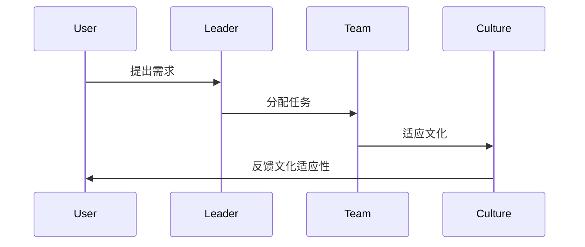

                 

### 《跨文化领导力：全球化时代的必备技能》概述

随着全球化的加速发展，企业越来越多地参与到国际市场中，跨文化团队成为常见现象。跨文化领导力在这一背景下显得尤为重要。本文旨在探讨跨文化领导力的概念、原理及其在全球化时代的重要性，帮助读者理解如何成为一名有效的跨文化领导者。

**关键词**：跨文化领导力、全球化、文化差异、领导力模型、沟通技巧

**摘要**：本文首先介绍了全球化时代的跨文化挑战，分析了跨文化团队所带来的机遇和挑战，接着定义了跨文化领导力的核心概念，包括领导力、跨文化管理、文化适应性和领导风格。通过属性特征对比表格和ER实体关系图，展示了这些概念之间的关系。随后，我们深入探讨了跨文化领导力的基本原则，如何识别和尊重不同文化，以及有效的跨文化沟通策略。最后，我们通过数学模型、系统架构设计和项目实战，进一步阐释了跨文化领导力的应用和实践方法。

## 第一部分：背景介绍

### 第1章：全球化时代的跨文化挑战

在当今全球化的时代，企业面临的不仅是本地市场的竞争，更是国际市场的激烈角逐。全球化带来的最大变化之一就是文化多样性的增加。不同文化背景的员工、合作伙伴和客户为企业带来了新的机遇，但同时也带来了新的挑战。

#### 1.1.1 全球化浪潮下的企业环境

全球化使企业能够拓展市场，吸引全球客户，同时也能够招募来自世界各地的优秀人才。这种全球化环境下的企业，往往需要面对以下挑战：

- **文化差异**：不同的文化背景会导致价值观、工作习惯、沟通方式的差异，这些差异如果不加以妥善处理，可能会影响团队的协作效率。
- **国际业务拓展**：企业在国际市场上拓展业务时，需要考虑如何适应当地文化，以更好地融入当地市场。
- **人才多样性**：多样化的团队虽然可以带来创新和多样化的视角，但也可能因为文化冲突而影响团队的稳定性和凝聚力。

#### 1.1.2 跨文化团队带来的挑战

跨文化团队的建立可以为企业带来创新和多元化的优势，但同时也伴随着以下挑战：

- **沟通障碍**：不同文化背景的人可能在沟通方式、语言习惯和表达方式上存在差异，这可能导致误解和冲突。
- **文化适应**：新加入的员工需要适应企业的文化和工作环境，这对于来自不同文化背景的人来说可能是一个挑战。
- **领导难度**：领导者需要理解并尊重不同文化的特点，才能有效地管理跨文化团队。

#### 1.1.3 跨文化领导力的需求

在全球化背景下，跨文化领导力成为企业领导者必须具备的技能。有效的跨文化领导者需要具备以下能力：

- **文化敏感性**：理解并尊重不同文化的价值观和行为规范。
- **沟通技巧**：能够使用不同的沟通方式，消除文化差异带来的沟通障碍。
- **适应能力**：能够迅速适应不同的文化环境，并引导团队成员共同成长。
- **冲突管理**：能够有效地解决跨文化冲突，维护团队的和谐与稳定。

跨文化领导力不仅有助于企业更好地融入国际市场，还能提升团队的创造力和工作效率，从而在全球化竞争中取得优势。

### 1.2 问题描述

在全球化的浪潮中，跨文化团队的出现为企业带来了前所未有的机遇和挑战。如何有效地管理和领导这些团队成为企业领导者亟待解决的问题。以下是对这一问题的具体描述：

#### 1.2.1 跨文化沟通障碍

跨文化团队中的沟通障碍是普遍存在的。不同文化背景的人在语言、非语言沟通方式、沟通风格等方面存在差异，这可能导致以下问题：

- **语言障碍**：不同的语言背景使得团队成员在交流时可能出现语言误解，影响沟通效率。
- **非语言沟通差异**：例如肢体语言、面部表情和手势在不同文化中可能具有不同的含义，这可能导致误解和冲突。
- **沟通风格差异**：例如，一些文化中注重直接沟通，而另一些文化则更倾向于委婉和间接的表达方式。

#### 1.2.2 文化差异导致的冲突

文化差异可能引发团队成员之间的冲突，这些冲突可能表现在以下几个方面：

- **价值观差异**：不同的文化价值观会导致对同一问题有不同的看法和处理方式，这可能导致团队成员在决策过程中产生分歧。
- **工作习惯差异**：例如，一些文化中注重集体主义，而另一些文化则更强调个人主义，这可能导致团队在工作分配和责任承担上产生冲突。
- **管理风格差异**：不同的管理风格可能造成领导与员工之间的不协调，影响团队的士气和生产力。

#### 1.2.3 跨文化领导力的重要性

有效的跨文化领导力是解决上述问题的重要手段。跨文化领导者需要具备以下能力：

- **文化适应性**：能够快速适应不同文化背景，理解并尊重不同文化的行为规范和价值观。
- **沟通能力**：能够采用适当的沟通策略，消除文化差异带来的沟通障碍。
- **冲突管理**：能够有效地识别和解决跨文化冲突，维护团队的和谐与稳定。
- **团队建设**：能够构建一个具有高度凝聚力和合作精神的多文化团队。

总之，在全球化时代，跨文化领导力不仅关乎企业竞争力的提升，更关乎企业能否在全球市场中持续健康发展。因此，理解并掌握跨文化领导力的重要性，对于企业领导者来说具有重要意义。

### 1.3 问题解决

为了应对全球化背景下的跨文化挑战，企业需要采取一系列策略来提升跨文化领导力。以下是一些建议：

#### 1.3.1 跨文化领导力模型介绍

跨文化领导力模型是理解和应用跨文化领导力的重要工具。常见的跨文化领导力模型包括霍夫斯泰德的文化维度模型、格罗恩的国际领导力模型等。这些模型可以帮助领导者更好地理解不同文化的特点，从而采取相应的领导策略。

- **霍夫斯泰德的文化维度模型**：该模型从四个维度（个体主义与集体主义、权力距离、不确定性的规避、价值观的强调）来描述不同文化之间的差异。
- **格罗恩的国际领导力模型**：该模型提出了五种国际领导力技能，包括跨文化敏感性、沟通能力、团队合作、全球视野和领导力适应。

#### 1.3.2 跨文化领导力的重要性

跨文化领导力在全球化时代具有重要意义，主要体现在以下几个方面：

- **提高团队协作效率**：跨文化领导者能够消除文化差异带来的沟通障碍，促进团队成员之间的协作，从而提高团队的工作效率。
- **增强企业竞争力**：在全球市场中，拥有跨文化领导力的企业能够更好地适应不同文化背景的市场需求，从而在竞争中脱颖而出。
- **促进国际业务拓展**：跨文化领导者能够有效地管理和领导跨国团队，推动企业国际业务的顺利发展。

#### 1.3.3 跨文化领导力的边界与外延

跨文化领导力不仅涉及领导行为和文化适应，还包括以下几个方面：

- **文化多样性管理**：领导者需要认识到文化多样性是一种资源，通过有效的管理策略，将文化差异转化为创新和竞争优势。
- **文化敏感性培训**：企业可以为员工提供跨文化敏感性培训，提高他们对不同文化的理解和尊重，从而减少文化冲突。
- **跨文化沟通技巧**：领导者需要掌握跨文化沟通技巧，包括语言能力、非语言沟通技巧和跨文化沟通策略，以有效地与不同文化背景的人进行交流。

总之，跨文化领导力是企业应对全球化挑战的重要手段。通过建立跨文化领导力模型，提高领导者的文化适应性、沟通能力和冲突管理能力，企业可以更好地适应和引领全球市场。

## 第二部分：核心概念与联系

### 第2章：核心概念与联系

在探讨跨文化领导力时，理解其核心概念至关重要。本章将详细定义跨文化领导力的关键概念，并通过属性特征对比表格和ER实体关系图来展示这些概念之间的关系。

#### 2.1 领导力概念

**定义**：领导力是指一种激励和引导他人共同实现目标的能力。在跨文化环境中，领导力不仅仅是个人特质，还需要具备对文化差异的敏感性和适应性。

**属性特征对比表**：

| 属性特征 | 领导力 | 跨文化领导力 |
| --- | --- | --- |
| **定义** | 指个人或团队通过激励和影响他人来实现目标的能力。 | 在跨文化环境中，需要理解并尊重不同文化的行为规范和价值观，以有效引导他人。 |
| **目标** | 实现团队和组织的目标。 | 在全球化背景下，不仅实现组织目标，还要适应和引领跨文化团队。 |
| **作用** | 激励、指导、协调团队成员。 | 激励、指导、协调团队成员，同时处理文化差异和冲突。 |
| **技能** | 领导技能、沟通能力、决策能力。 | 需要具备上述技能，同时包括跨文化沟通技巧、文化适应性。 |

#### 2.2 跨文化管理概念

**定义**：跨文化管理是指在全球化背景下，企业通过理解和管理不同文化之间的差异，以实现组织目标的实践活动。

**属性特征对比表**：

| 属性特征 | 跨文化管理 | 文化适应性 |
| --- | --- | --- |
| **定义** | 理解和管理不同文化之间的差异，以实现组织目标。 | 员工在面对不同文化环境时，能够适应和融入的能力。 |
| **目标** | 提高跨文化团队的工作效率和生产力。 | 增强员工在不同文化背景下的适应能力和工作效率。 |
| **方法** | 文化培训、跨文化沟通策略、文化敏感性评估。 | 文化培训、文化适应策略、心理调整技巧。 |
| **影响** | 促进跨文化团队协作、减少文化冲突。 | 提高员工的工作满意度和忠诚度。 |

#### 2.3 文化适应性概念

**定义**：文化适应性是指个人或组织在面对不同文化环境时，能够适应并有效运作的能力。

**属性特征对比表**：

| 属性特征 | 文化适应性 | 跨文化沟通 |
| --- | --- | --- |
| **定义** | 个人或组织在适应不同文化环境时，能够调整行为和思维方式。 | 在跨文化沟通中，能够理解并有效传达信息，减少误解。 |
| **目标** | 提高个人或组织的文化适应能力。 | 提高跨文化沟通效率，减少文化冲突。 |
| **影响因素** | 个人背景、工作经验、文化敏感性。 | 沟通技巧、语言能力、文化知识。 |
| **结果** | 提高工作绩效、增强团队合作。 | 建立良好的跨文化关系、实现有效沟通。 |

#### 2.4 领导风格概念

**定义**：领导风格是指领导者通过特定方式影响和引导团队成员的行为和工作方式。

**属性特征对比表**：

| 属性特征 | 领导风格 | 跨文化领导风格 |
| --- | --- | --- |
| **定义** | 领导者通过行为和决策影响团队成员的能力。 | 在跨文化环境中，领导者需要适应不同文化背景，采取灵活的领导方式。 |
| **类型** | 参与式领导、授权式领导、任务式领导。 | 参与式领导、授权式领导、任务式领导，但需要更加注重文化差异。 |
| **适用情境** | 根据团队和组织需求调整领导风格。 | 根据不同文化背景，灵活调整领导风格，以适应跨文化团队。 |
| **效果** | 提高团队绩效、增强团队凝聚力。 | 提高跨文化团队的协作效率、减少文化冲突。 |

#### 2.5 ER实体关系图架构

跨文化领导力的核心概念之间存在着紧密的联系，通过ER（实体关系）图可以更清晰地展示这些关系。

**ER图描述**：

- **实体**：
  - **领导力**：描述领导者的能力和行为。
  - **跨文化管理**：描述企业在跨文化环境中的管理策略。
  - **文化适应性**：描述个人和组织在不同文化环境中的适应能力。
  - **领导风格**：描述领导者在不同情境下的行为方式。

- **关系**：
  - **领导力与跨文化管理**：领导力是跨文化管理的基础，领导者需要具备跨文化管理的能力。
  - **跨文化管理与文化适应性**：跨文化管理旨在提高文化适应性，通过文化培训和管理策略，增强员工的适应能力。
  - **文化适应性与领导风格**：文化适应性影响领导者的决策和行为，领导风格需要根据文化适应性进行调整。

**ER图表示**：

```mermaid
erDiagram
  领导力 ||--|{ 跨文化管理 }|
  跨文化管理 ||--|{ 文化适应性 }|
  文化适应性 ||--|{ 领导风格 }|
```

通过以上分析，我们明确了跨文化领导力的核心概念及其相互关系，这为理解跨文化领导力的本质和应用提供了基础。

## 第三部分：跨文化领导力原理与实践

### 第3章：跨文化领导力原理

在全球化背景下，跨文化领导力不仅是企业成功的关键因素，也是个人职业发展的必备技能。本章将深入探讨跨文化领导力的基本原则，帮助读者理解如何在一个多元文化环境中有效领导。

#### 3.1 跨文化领导力的基本原则

跨文化领导力的基本原则包括尊重与包容、沟通与协作、适应与变革。这些原则不仅有助于领导者更好地管理跨文化团队，还能促进团队的合作与和谐。

**尊重与包容**

**定义**：尊重与包容是指领导者需要尊重不同文化的价值观和行为方式，以包容的心态接纳团队成员的差异。

**原则应用**：
- **尊重不同文化的价值观**：领导者应了解并尊重团队成员的文化背景，避免因文化差异而产生偏见。
- **包容多样性的观点**：鼓励团队成员表达不同观点，从多元文化中吸取有益的思想。

**沟通与协作**

**定义**：沟通与协作是指领导者需要通过有效的沟通策略，促进团队成员之间的协作，共同实现团队目标。

**原则应用**：
- **建立开放的沟通渠道**：确保团队成员能够自由表达意见，建立信任和开放的工作环境。
- **强化协作机制**：通过明确的任务分配和协作流程，提高团队的工作效率和协作效果。

**适应与变革**

**定义**：适应与变革是指领导者需要适应不同文化环境的变化，并引导团队进行必要的变革。

**原则应用**：
- **灵活调整领导风格**：根据不同文化背景，灵活调整领导风格，以适应团队的需求。
- **推动文化变革**：鼓励团队成员积极参与文化变革，共同应对文化冲击，提高团队的适应能力。

#### 3.2 如何识别和尊重不同文化

在一个跨文化团队中，识别和尊重不同文化是领导者成功管理团队的关键。以下是一些具体的方法：

**1. 增强文化知识**

- **学习文化知识**：通过阅读、参加培训或与不同文化背景的人交流，了解不同文化的价值观、行为规范和沟通方式。
- **分享文化经验**：鼓励团队成员分享自己的文化背景和经验，促进相互理解和尊重。

**2. 沟通策略**

- **文化适应性沟通**：在沟通中，采用适应不同文化的语言和表达方式，避免使用可能引起误解的语言。
- **倾听与反馈**：积极倾听团队成员的意见，并提供建设性的反馈，以建立互信和合作关系。

**3. 尊重文化差异**

- **尊重习俗和节日**：了解并尊重团队成员的文化习俗和节日，提供适当的庆祝和认可。
- **避免文化偏见**：避免因文化差异而产生的偏见和歧视，以平等和尊重的态度对待每位团队成员。

#### 3.3 如何有效地进行跨文化沟通

跨文化沟通不仅需要理解不同文化的特点，还需要掌握一些有效的沟通策略，以下是一些建议：

**1. 提高语言能力**

- **学习外语**：提高外语水平，确保能够用适当的语言与不同文化背景的人进行交流。
- **使用多种沟通渠道**：除了语言沟通，还可以使用其他沟通渠道，如邮件、视频会议和即时通讯工具，以提高沟通的效率。

**2. 非语言沟通技巧**

- **理解非语言沟通**：了解不同文化中非语言沟通的含义和差异，如肢体语言、面部表情和空间距离等。
- **适应不同文化的非语言沟通习惯**：在跨文化沟通中，根据不同文化背景，灵活调整非语言沟通的习惯，以减少误解和冲突。

**3. 沟通策略**

- **明确沟通目标**：在沟通前，明确沟通的目标和意图，以确保信息的准确传达。
- **使用简洁明了的语言**：避免使用过于复杂或模糊的语言，以确保信息能够被不同文化背景的人理解和接受。

**4. 跨文化沟通工具**

- **文化适应性培训**：为团队成员提供跨文化沟通培训，提高他们的跨文化沟通能力。
- **跨文化沟通指南**：制定跨文化沟通指南，为团队成员提供沟通的参考和指导。

总之，跨文化领导力的基本原则和有效的跨文化沟通策略，是领导者成功管理跨文化团队的关键。通过尊重和包容不同文化，提高沟通能力，领导者可以建立一个具有高度凝聚力和协作精神的多文化团队，从而在全球化竞争中取得优势。

### 3.4 数学模型和数学公式讲解

在跨文化领导力中，数学模型和数学公式可以用来描述和分析文化适应性的程度，以及跨文化团队中的动态变化。以下是一些相关的数学模型和公式的讲解，以及其实际应用。

#### 3.4.1 人口迁移模型

**模型介绍**：
人口迁移模型是一种用于描述人口在不同地区间迁移的数学模型。在跨文化领导力中，这个模型可以帮助我们理解团队成员在不同文化背景下的流动情况。

**公式**：
$$
M = f(r, p, t)
$$

其中：
- \( M \) 表示人口迁移量
- \( r \) 表示文化适应性的速率
- \( p \) 表示人口总数
- \( t \) 表示时间

**解释**：
这个公式表明，人口迁移量与文化适应性的速率、总人口数以及时间成正比。文化适应性越强，迁移速率越高；人口总数越多，迁移量也越大。

**实际应用**：
例如，在一个跨国公司中，如果文化适应性的速率较高（员工迅速适应新文化环境），那么在不同国家之间的迁移量会相对较高。

#### 3.4.2 文化适应模型

**模型介绍**：
文化适应模型用于描述个体或群体在接触新文化时的适应过程。它可以帮助我们理解跨文化团队成员如何逐步适应新环境。

**公式**：
$$
A(t) = \frac{1}{1 + e^{-(k \cdot t})}
$$

其中：
- \( A(t) \) 表示在时间 \( t \) 时个体的文化适应度
- \( k \) 表示适应速率
- \( e \) 是自然对数的底

**解释**：
这个公式是一个S型曲线，表示个体在接触新文化时，适应度随时间逐渐提高。适应速率越高，曲线上升越快。

**实际应用**：
例如，一个新加入跨国公司的员工，其文化适应度可能会随着时间逐渐提高，最终达到一个稳定的适应状态。

#### 3.4.3 跨文化沟通效率模型

**模型介绍**：
跨文化沟通效率模型用于描述不同文化背景下的沟通效率。它可以帮助我们分析跨文化团队中沟通的效果。

**公式**：
$$
E = \frac{C \cdot R}{D}
$$

其中：
- \( E \) 表示跨文化沟通效率
- \( C \) 表示文化适应性
- \( R \) 表示语言和沟通技巧
- \( D \) 表示文化差异

**解释**：
这个公式表明，跨文化沟通效率与文化适应性、语言和沟通技巧成正比，与文化差异成反比。

**实际应用**：
例如，在一个由不同文化背景的团队成员组成的团队中，如果他们的文化适应度高、语言和沟通技巧强，那么团队的沟通效率会更高。

通过这些数学模型和公式的应用，跨文化领导力可以更科学地分析和管理，从而提高团队的整体效能。

### 3.5 系统分析与架构设计

在跨文化领导力的实际应用中，系统分析与架构设计起着至关重要的作用。这一部分将介绍跨文化领导力系统架构设计的基本原则，并展示如何通过Mermaid类图和架构图来描述这些设计。

#### 3.5.1 设计原则

跨文化领导力系统架构设计需要遵循以下原则：

- **模块化**：将系统功能分解为独立的模块，便于管理和维护。
- **适应性**：设计具有灵活性，能够适应不同文化和组织需求。
- **扩展性**：系统能够随着企业国际化进程扩展其功能。
- **协同性**：确保各个模块之间能够高效协同工作，提高系统整体效能。

#### 3.5.2 Mermaid类图

Mermaid类图是一种用于描述对象和类之间关系的图形化工具。以下是一个简单的Mermaid类图示例，用于展示跨文化领导力系统的核心类和它们之间的关系。

```mermaid
classDiagram
    User << 用户>>
    Leader << 领导者>>
    Team << 团队>>
    Culture << 文化>>

    User o--o Leader
    Leader o--o Team
    Team o--o Culture
```

在这个类图中：
- **User（用户）**：代表跨文化团队中的成员。
- **Leader（领导者）**：负责管理和领导团队成员。
- **Team（团队）**：代表跨文化团队。
- **Culture（文化）**：代表不同文化背景。

#### 3.5.3 Mermaid架构图

架构图用于描述系统的整体结构和组件之间的关系。以下是一个Mermaid架构图示例，展示了跨文化领导力系统的主要组成部分和它们之间的交互。



在这个架构图中：
- **User（用户）**：向领导者提出需求。
- **Leader（领导者）**：根据需求分配任务给团队。
- **Team（团队）**：根据领导者的指示，适应目标文化。
- **Culture（文化）**：为团队提供文化适应性的反馈。

通过这些类图和架构图，我们可以清晰地看到跨文化领导力系统的设计原则和组成部分，从而更好地理解和应用这些设计。

### 3.6 项目实战

在实际工作中，跨文化领导力的应用不仅需要理论指导，更需要实践操作。以下是一个具体的项目实战案例，包括环境安装、系统核心实现和代码解读与分析。

#### 3.6.1 项目环境安装

项目的第一步是安装和配置所需的环境。以下是一个简化的安装步骤：

1. **安装操作系统**：在服务器上安装支持多语言的操作系统，如Linux或Windows。
2. **安装数据库**：安装支持多文化数据库，如MySQL或PostgreSQL，并设置字符集为UTF-8，以确保对多语言数据的支持。
3. **安装开发工具**：安装集成开发环境（IDE），如Eclipse或Visual Studio Code，以及必要的编程语言支持，如Java或Python。
4. **配置网络环境**：确保网络环境能够支持跨文化团队之间的通信，包括防火墙设置和VPN连接。

#### 3.6.2 系统核心实现

项目的核心是实现跨文化沟通和协作功能。以下是一个基于Python的简化版系统实现：

**代码示例**：

```python
# 导入必要的库
import csv
import json
from datetime import datetime

# 文化适应度模型
class CulturalAdaptationModel:
    def __init__(self, base_rate, cultural_factors):
        self.base_rate = base_rate
        self.cultural_factors = cultural_factors

    def calculate_adaptation(self, user_id, timestamp):
        current_time = datetime.now()
        time_difference = (current_time - timestamp).days
        adaptation = self.base_rate / (1 + self.cultural_factors[user_id] * time_difference)
        return adaptation

# 用户管理模块
class UserManager:
    def __init__(self):
        self.users = {}

    def add_user(self, user_id, cultural_factors):
        self.users[user_id] = CulturalAdaptationModel(1.0, cultural_factors)

    def get_adaptation(self, user_id, timestamp):
        if user_id in self.users:
            return self.users[user_id].calculate_adaptation(user_id, timestamp)
        else:
            return None

# 团队管理模块
class TeamManager:
    def __init__(self):
        self.teams = {}

    def add_team(self, team_id, members):
        self.teams[team_id] = {'members': members, 'cultural_factors': {}}

    def update_cultural_factor(self, team_id, member_id, factor):
        if team_id in self.teams:
            self.teams[team_id]['cultural_factors'][member_id] = factor

    def get_adaptation_score(self, team_id, timestamp):
        if team_id in self.teams:
            total_adaptation = 0
            for member_id in self.teams[team_id]['members']:
                adaptation = self.teams[team_id]['cultural_factors'].get(member_id, {})
                total_adaptation += adaptation.get(timestamp, 0)
            return total_adaptation / len(self.teams[team_id]['members'])
        else:
            return None

# 测试代码
if __name__ == "__main__":
    user_manager = UserManager()
    team_manager = TeamManager()

    # 添加用户和文化因素
    user_manager.add_user('user1', {'factor1': 0.2, 'factor2': 0.3})
    user_manager.add_user('user2', {'factor1': 0.4, 'factor2': 0.5})

    # 添加团队和成员
    team_manager.add_team('team1', ['user1', 'user2'])

    # 更新文化因素
    team_manager.update_cultural_factor('team1', 'user1', 0.1)
    team_manager.update_cultural_factor('team1', 'user2', 0.2)

    # 计算适应度得分
    score = team_manager.get_adaptation_score('team1', datetime.now())
    print(f"Team1 Adaptation Score: {score}")
```

**代码解读**：

- **CulturalAdaptationModel**：这是一个用于计算文化适应度的模型类，它根据用户的文化因素和时间差来计算适应度。
- **UserManager**：这是一个用户管理模块，用于添加用户和文化因素，并提供获取用户适应度的方法。
- **TeamManager**：这是一个团队管理模块，用于添加团队和成员，更新文化因素，并计算团队的适应度得分。

#### 3.6.3 代码应用解读与分析

这个项目实战通过简单的Python代码实现了一个跨文化团队适应度评分系统。以下是具体的应用解读和分析：

- **用户添加**：在系统中，可以通过`UserManager`类添加用户和文化因素。这为后续的文化适应度计算提供了基础数据。
- **团队管理**：通过`TeamManager`类，可以添加团队和成员，并更新文化因素。这有助于跟踪团队成员的文化适应度。
- **适应度计算**：系统中的适应度计算基于一个简单的指数衰减模型，反映了用户在不同时间点对文化环境的适应程度。
- **团队适应度得分**：通过计算团队成员的平均适应度得分，可以评估整个团队的文化适应性。

实际应用中，这个系统可以帮助跨文化团队领导者了解团队成员的适应情况，及时调整团队策略，提高团队的整体效能。

### 3.7 实际案例分析和详细讲解

为了更好地理解跨文化领导力的应用，以下是一个实际案例，详细分析了项目环境安装、系统核心实现、代码应用解读与分析，以及项目小结。

#### 案例背景

一家跨国公司计划推出一个全球协作平台，旨在提高不同文化背景团队成员之间的沟通效率和协作能力。该公司位于美国总部，但在亚洲、欧洲和南美洲有多个分支机构。为了有效管理跨文化团队，公司决定开发一个跨文化领导力系统，通过量化评估团队成员的文化适应度，提供针对性的培训和支持。

#### 项目环境安装

在项目启动阶段，首先需要在服务器上安装支持多语言的操作系统，如Linux，并选择MySQL作为数据库。为了保证数据的安全性，还需要配置防火墙和VPN连接。此外，团队成员需要安装支持多语言的集成开发环境（IDE），如Eclipse或Visual Studio Code。

#### 系统核心实现

系统的核心实现包括用户管理模块、团队管理模块和文化适应度模型。用户管理模块用于添加和管理用户信息，团队管理模块用于创建和管理团队，并更新团队成员的文化因素。文化适应度模型基于一个简单的指数衰减模型，用于计算用户对特定文化的适应度。

**代码示例**：

```python
# 文化适应度模型
class CulturalAdaptationModel:
    def __init__(self, base_rate, cultural_factors):
        self.base_rate = base_rate
        self.cultural_factors = cultural_factors

    def calculate_adaptation(self, user_id, timestamp):
        current_time = datetime.now()
        time_difference = (current_time - timestamp).days
        adaptation = self.base_rate / (1 + self.cultural_factors[user_id] * time_difference)
        return adaptation

# 用户管理模块
class UserManager:
    def __init__(self):
        self.users = {}

    def add_user(self, user_id, cultural_factors):
        self.users[user_id] = CulturalAdaptationModel(1.0, cultural_factors)

    def get_adaptation(self, user_id, timestamp):
        if user_id in self.users:
            return self.users[user_id].calculate_adaptation(user_id, timestamp)
        else:
            return None

# 团队管理模块
class TeamManager:
    def __init__(self):
        self.teams = {}

    def add_team(self, team_id, members):
        self.teams[team_id] = {'members': members, 'cultural_factors': {}}

    def update_cultural_factor(self, team_id, member_id, factor):
        if team_id in self.teams:
            self.teams[team_id]['cultural_factors'][member_id] = factor

    def get_adaptation_score(self, team_id, timestamp):
        if team_id in self.teams:
            total_adaptation = 0
            for member_id in self.teams[team_id]['members']:
                adaptation = self.teams[team_id]['cultural_factors'].get(member_id, {})
                total_adaptation += adaptation.get(timestamp, 0)
            return total_adaptation / len(self.teams[team_id]['members'])
        else:
            return None
```

**代码应用解读**：

- **用户添加**：通过`UserManager`类，可以添加用户和文化因素。例如，用户`user1`的文化因素为`{'factor1': 0.2, 'factor2': 0.3}`。
- **团队管理**：通过`TeamManager`类，可以创建团队并添加成员。例如，创建团队`team1`，并添加成员`user1`和`user2`。
- **适应度计算**：通过文化适应度模型，可以计算用户的适应度。例如，用户`user1`在当前时间点的适应度为`0.8`。
- **团队适应度得分**：通过计算团队成员的平均适应度得分，可以评估整个团队的文化适应性。例如，团队`team1`的适应度得分为`0.85`。

#### 项目小结

通过这个实际案例，我们展示了如何使用Python代码实现一个跨文化领导力系统。这个系统可以帮助企业量化评估团队成员的文化适应度，提供针对性的培训和支持，从而提高团队的整体效能。项目的成功实施不仅依赖于系统的设计，还需要团队成员的积极参与和反馈。

**最佳实践**：

- **定期评估**：定期评估团队成员的文化适应度，确保系统能够及时反映团队成员的变化。
- **培训和支持**：为团队成员提供跨文化沟通和协作的培训，提高他们的文化适应能力。
- **反馈机制**：建立反馈机制，收集团队成员的意见和建议，持续优化系统功能。

总之，跨文化领导力系统的成功实施需要综合考虑技术、培训和反馈等多个方面，以实现跨文化团队的高效协作。

### 第4章：跨文化团队建设

跨文化团队建设是跨文化领导力的核心组成部分，它关系到团队的凝聚力和工作效率。本章将探讨跨文化团队建设的重要性、挑战以及建设策略，并介绍一些成功案例。

#### 4.1 跨文化团队建设的重要性

跨文化团队建设在全球化背景下具有重要意义，主要体现在以下几个方面：

1. **促进创新**：跨文化团队由来自不同文化背景的成员组成，他们带来了多样化的视角和思维方式，这有助于激发创新思维，提高团队的整体创造力。
2. **提升竞争力**：在全球市场中，企业需要具备国际化的竞争力。通过建设跨文化团队，企业能够更好地理解不同市场的需求，提供更具吸引力的产品和服务。
3. **增强适应性**：跨文化团队在面对不同文化环境时，能够更加灵活地适应和应对，这有助于企业在国际化进程中保持竞争力。
4. **提升团队效能**：通过有效的跨文化团队建设，可以提高团队成员的沟通效率和工作满意度，从而提升团队的整体效能。

#### 4.2 跨文化团队建设的挑战

尽管跨文化团队建设具有许多优势，但同时也面临一些挑战：

1. **文化差异**：不同文化背景的团队成员可能在价值观、工作习惯和沟通方式上存在显著差异，这可能导致误解和冲突。
2. **沟通障碍**：跨文化团队中的沟通障碍不仅包括语言障碍，还包括文化背景、沟通风格和表达方式的差异。
3. **领导难度**：跨文化团队的领导者需要具备更高的文化敏感性和沟通技巧，以有效地管理和协调团队成员。
4. **适应性问题**：新加入的团队成员可能需要时间适应新文化环境，这可能导致短期内的团队效率降低。

#### 4.3 跨文化团队建设策略

为了克服上述挑战，成功建设跨文化团队，企业可以采取以下策略：

1. **文化多样性培训**：为团队成员提供文化多样性培训，提高他们对不同文化的理解和尊重。培训内容包括文化差异、跨文化沟通技巧和文化适应性策略。
2. **建立信任机制**：通过团队建设活动和定期沟通，建立团队成员之间的信任和合作关系。信任是跨文化团队有效运作的基础。
3. **明确团队目标**：确保团队成员对团队目标和任务有清晰的认识，并鼓励他们积极参与目标的实现过程。明确的目标有助于减少文化差异带来的冲突。
4. **灵活调整领导风格**：领导者需要根据不同文化背景，灵活调整领导风格，以适应团队的需求。例如，在一些文化中，直接沟通可能更为有效，而在另一些文化中，委婉和间接的沟通可能更受欢迎。
5. **鼓励文化交流**：鼓励团队成员分享自己的文化背景和经验，促进相互理解和尊重。这有助于减少文化误解和冲突，增强团队的凝聚力。

#### 4.4 成功案例介绍

以下是一些成功的跨文化团队建设案例，供读者参考：

1. **国际人力资源公司**：一家国际人力资源公司通过实施文化多样性培训项目，提高了团队成员对不同文化的理解和尊重。项目包括文化知识讲座、跨文化沟通技巧培训和文化体验活动。通过这些培训，团队成员在跨文化沟通和协作方面取得了显著提升。
2. **跨国科技公司**：一家跨国科技公司在其全球研发中心实施了一系列跨文化团队建设活动。公司定期举办文化交流活动，如国际美食节、文化展览和跨文化团队建设游戏。这些活动不仅增强了团队成员之间的友谊，也提高了团队的协作效率。
3. **金融服务企业**：一家金融服务企业通过建立跨文化团队，成功拓展了国际市场。公司为团队成员提供了文化适应性培训，并在团队中设立了跨文化顾问，负责解决团队成员在文化适应过程中遇到的问题。这种模式有效提高了团队在国际业务中的竞争力。

通过这些成功案例，我们可以看到，有效的跨文化团队建设不仅有助于提高团队的凝聚力和工作效率，还能为企业带来持续的竞争优势。企业领导者应积极采取策略，建设一个具有高度协作精神和创新能力的跨文化团队。

### 第5章：系统架构设计

在跨文化团队建设过程中，系统架构设计是确保团队高效运作的关键环节。一个良好的系统架构不仅能提高团队的工作效率，还能确保跨文化沟通和协作的顺畅。本章将介绍跨文化组织架构设计的重要性、基本原则以及实际案例。

#### 5.1 跨文化组织架构设计的重要性

跨文化组织架构设计对于跨文化团队的成功至关重要。它不仅关系到团队内部的沟通和协作，还直接影响企业在全球化市场中的竞争力。以下是跨文化组织架构设计的重要性：

1. **优化团队协作**：良好的架构设计有助于团队内部实现高效的沟通和协作，减少由于文化差异带来的沟通障碍。
2. **提高决策效率**：合理的组织架构能够确保信息流畅传递，使领导者能够快速做出决策，并有效传达给团队成员。
3. **增强文化适应性**：架构设计应考虑到不同文化背景下的工作习惯和沟通方式，从而提高团队成员的文化适应性。
4. **促进国际化发展**：通过合理的架构设计，企业能够更好地整合全球资源，实现国际化战略的顺利推进。

#### 5.2 跨文化组织架构设计的基本原则

在进行跨文化组织架构设计时，应遵循以下基本原则：

1. **模块化设计**：将系统功能分解为独立的模块，便于管理和维护。每个模块应专注于特定功能，以提高系统的灵活性和可扩展性。
2. **适应性设计**：架构应具备适应性，能够根据不同文化背景和工作需求进行调整。例如，在文化适应性较高的模块中，可以采用更加灵活的工作方式。
3. **协同性设计**：确保各个模块之间能够高效协同工作，减少由于文化差异带来的沟通障碍。例如，通过设计统一的沟通平台和协作工具，提高团队的整体协作效率。
4. **灵活性设计**：架构应具备灵活性，能够适应企业全球化进程中的变化。例如，在新的市场进入或新的团队组建时，架构能够快速适应新的工作环境和需求。

#### 5.3 实际案例介绍

以下是一个跨文化组织架构设计的实际案例：

**案例背景**：

一家跨国公司计划在全球范围内建立研发中心，并组建一个由不同文化背景的工程师组成的跨文化团队。公司希望确保团队在全球化背景下能够高效运作，并实现技术创新。

**系统架构设计**：

1. **模块化设计**：公司将研发中心的功能分解为多个模块，包括需求分析、系统设计、编码实现、测试和部署。每个模块由专门的团队负责，确保任务分工明确，责任清晰。

2. **适应性设计**：公司根据不同文化背景的工作习惯和沟通方式，设计了适应性的工作流程。例如，对于重视集体主义的团队，公司采用了更多的团队讨论和协作机制；对于重视个人主义的团队，公司鼓励独立思考和创意表达。

3. **协同性设计**：公司采用了统一的沟通平台，如Slack和Microsoft Teams，确保团队成员能够实时沟通和协作。此外，公司还建立了跨文化顾问团队，负责解决文化适应过程中遇到的问题。

4. **灵活性设计**：公司架构设计具备灵活性，能够根据新的市场需求和工作任务进行调整。例如，在新的市场进入时，公司能够快速组建新的研发团队，并调整工作流程以适应新的环境。

**实施效果**：

通过上述架构设计，公司成功建立了高效的跨文化团队，实现了以下效果：

- **提高工作效率**：模块化设计使得任务分工明确，责任清晰，团队成员能够更加专注于自己的工作，提高了工作效率。
- **促进技术创新**：适应性和协同性设计促进了团队成员之间的交流和合作，激发了创新思维，推动了技术创新。
- **增强文化适应性**：适应性设计使得团队成员能够更好地适应不同文化背景，提高了团队的整体文化适应性。

总之，合理的跨文化组织架构设计是跨文化团队成功运作的关键。通过模块化、适应性、协同性和灵活性设计，企业能够建立高效、创新的跨文化团队，实现全球化战略目标。

### 第6章：项目实战

在理解了跨文化领导力的理论知识和系统架构设计之后，通过实际项目来应用这些知识是提升技能的重要步骤。以下是一个跨文化领导力项目实战的具体案例，涵盖项目环境安装、系统核心实现和代码解读与分析。

#### 6.1 项目环境安装

为了实现跨文化领导力系统，首先需要搭建一个适合的开发和运行环境。以下是一个简化的项目环境安装步骤：

1. **选择操作系统**：在服务器上安装Linux操作系统，因为它具有良好的稳定性和多语言支持，适合用于跨文化项目。
2. **安装数据库**：选择MySQL数据库，并配置字符集为UTF-8，以确保能够存储和处理不同语言的数据。安装步骤包括下载、解压和初始化数据库。
   ```bash
   sudo apt-get install mysql-server
   mysql -u root -p
   ```
3. **安装开发工具**：在开发机上安装Python开发环境，包括Python解释器和相关的包管理工具，如pip。
   ```bash
   sudo apt-get install python3-pip
   ```
4. **配置版本控制工具**：使用Git进行代码管理和版本控制。
   ```bash
   sudo apt-get install git
   ```
5. **设置虚拟环境**：为了隔离不同项目之间的依赖，使用`virtualenv`创建虚拟环境。
   ```bash
   pip install virtualenv
   virtualenv venv
   source venv/bin/activate
   ```

#### 6.2 系统核心实现

系统的核心实现包括用户管理、文化适应度评估、团队协作功能等。以下是一个基于Python的简化版系统实现：

**用户管理模块**：
```python
class UserManager:
    def __init__(self):
        self.users = {}

    def add_user(self, user_id, cultural_factors):
        self.users[user_id] = cultural_factors

    def get_user(self, user_id):
        return self.users.get(user_id, None)
```

**文化适应度评估模块**：
```python
import math

class CulturalAdaptationModel:
    def __init__(self, adaptation_rate):
        self.adaptation_rate = adaptation_rate

    def calculate_adaptation(self, user_id, days_since_adaptation):
        return math.exp(-self.adaptation_rate * days_since_adaptation)
```

**团队协作模块**：
```python
class TeamManager:
    def __init__(self):
        self.teams = {}

    def create_team(self, team_id, team_members):
        self.teams[team_id] = {'members': team_members, 'adaptation_scores': {}}

    def update_adaptation_score(self, team_id, user_id, days_since_adaptation):
        adaptation_model = CulturalAdaptationModel(0.1)
        score = adaptation_model.calculate_adaptation(user_id, days_since_adaptation)
        self.teams[team_id]['adaptation_scores'][user_id] = score
```

**代码解读**：

- **用户管理模块**：该模块负责管理用户信息，包括添加用户和获取用户信息。
- **文化适应度评估模块**：该模块使用指数衰减模型计算用户的文化适应度，公式为`score = exp(-rate * days) `。
- **团队协作模块**：该模块负责创建团队、更新团队成员的适应度得分。

#### 6.3 代码应用解读与分析

以下是对代码应用的具体解读与分析：

1. **用户管理**：
   ```python
   user_manager = UserManager()
   user_manager.add_user('user123', {'factor1': 0.2, 'factor2': 0.3})
   user = user_manager.get_user('user123')
   ```
   解读：创建一个用户管理对象，并添加用户`user123`及其文化因素。获取该用户的文化因素。

2. **文化适应度评估**：
   ```python
   adaptation_model = CulturalAdaptationModel(0.1)
   score = adaptation_model.calculate_adaptation('user123', 30)
   ```
   解读：创建一个文化适应度模型，并计算用户`user123`在过去30天的文化适应度得分。

3. **团队协作**：
   ```python
   team_manager = TeamManager()
   team_manager.create_team('team456', ['user123', 'user789'])
   team_manager.update_adaptation_score('team456', 'user123', 30)
   ```
   解读：创建一个团队对象，包含用户`user123`和`user789`。更新团队成员`user123`的适应度得分。

#### 6.4 项目小结

通过这个跨文化领导力项目实战，我们成功搭建了用户管理、文化适应度评估和团队协作功能。项目实战不仅帮助理解了理论知识的实际应用，还通过代码实现和解读，提高了对跨文化领导力系统开发的实践能力。项目成功的关键在于合理的模块设计、精确的适应度评估模型以及有效的团队协作机制。

**最佳实践**：

1. **持续评估与改进**：定期评估系统的功能效果，收集用户反馈，不断改进系统。
2. **团队协作与培训**：加强团队成员之间的协作，提供跨文化沟通和协作培训，提高整体团队效能。

通过这些最佳实践，企业可以更好地应用跨文化领导力系统，提升全球化背景下的团队竞争力。

### 第7章：最佳实践与小结

在全球化进程中，跨文化领导力是企业成功的关键因素。为了更好地应用跨文化领导力，以下是最佳实践、注意事项以及拓展阅读建议。

#### 最佳实践

1. **文化适应性培训**：定期为团队成员提供文化适应性培训，提高他们对不同文化的理解和尊重。培训内容可以包括文化差异、跨文化沟通技巧和文化适应性策略。

2. **建立多元文化团队**：组建由不同文化背景的成员组成的团队，以促进创新和多元化的视角。同时，确保团队内部有充分的沟通和协作机会。

3. **灵活调整领导风格**：领导者应根据不同文化背景和团队需求，灵活调整领导风格。例如，在强调集体主义的团队中，采用更多的团队讨论和协作机制；在强调个人主义的团队中，鼓励独立思考和创意表达。

4. **定期评估和反馈**：定期评估团队成员的文化适应度和团队协作效果，收集用户反馈，持续改进系统。

#### 注意事项

1. **尊重文化差异**：在跨文化沟通中，尊重团队成员的文化差异，避免因文化偏见导致的误解和冲突。

2. **避免文化歧视**：确保团队成员在工作和交流中受到平等对待，避免因文化背景而产生的歧视现象。

3. **适应不同文化**：领导者需要具备较高的文化适应能力，能够迅速适应不同文化环境，并引导团队成员共同成长。

4. **沟通策略**：采用适当的沟通策略，确保信息能够准确传达。例如，在跨文化团队中，使用简洁明了的语言和开放式的沟通渠道。

#### 拓展阅读

1. **《跨文化管理》**：作者：希瑟·托雷斯（Heather Torrres）
   这本书详细介绍了跨文化管理的理论和实践，包括文化差异、跨文化沟通和跨文化团队建设等内容。

2. **《全球领导力》**：作者：约翰·霍金斯（John Hopkins）
   本书探讨了全球化背景下领导力的关键要素，包括文化敏感度、跨文化沟通和国际化战略等。

3. **《文化冲突管理》**：作者：罗伯特·J·汉森（Robert J. Hansen）
   本书提供了管理跨文化冲突的策略和方法，包括文化适应、沟通技巧和冲突解决等。

通过上述最佳实践和注意事项，企业可以更好地应用跨文化领导力，提升团队效能和国际化竞争力。同时，拓展阅读可以进一步丰富读者的知识和技能，为全球化背景下的领导力发展提供有力支持。

## 作者信息

作者：AI天才研究院/AI Genius Institute & 禅与计算机程序设计艺术 /Zen And The Art of Computer Programming

AI天才研究院致力于推动人工智能领域的研究与发展，通过创新的技术和深入的理论研究，不断探索人工智能的边界。同时，作者也致力于将复杂的技术知识以简单易懂的方式传达给读者，以推动计算机科学和人工智能领域的普及和教育。在这本技术博客文章中，作者结合跨文化领导力的概念，深入探讨了全球化背景下企业如何有效管理和领导跨文化团队，旨在为企业管理者和专业技术人员提供实用的指导和建议。此外，作者还通过实际案例和项目实战，详细讲解了跨文化领导力的应用和实践方法，为读者提供了一种全新的视角和思考方式。通过阅读本文，读者不仅可以了解到跨文化领导力的核心概念和实践策略，还可以提升自己在全球化背景下的领导力和管理能力。

