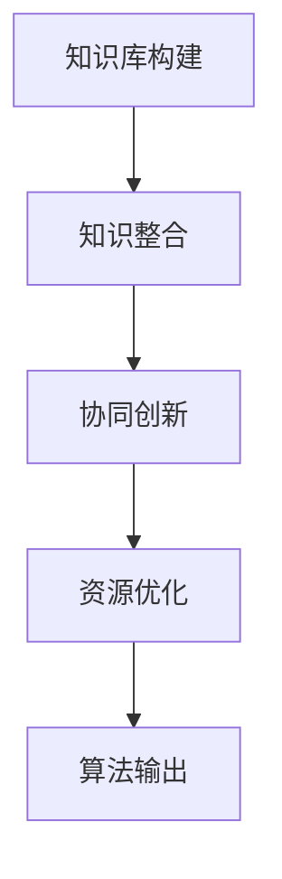
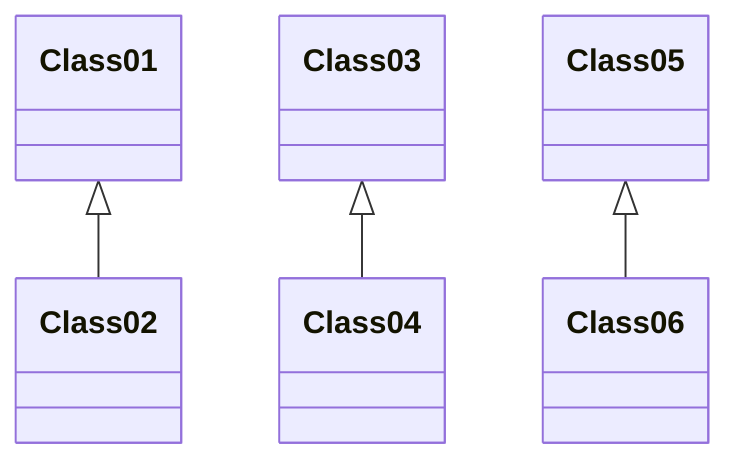
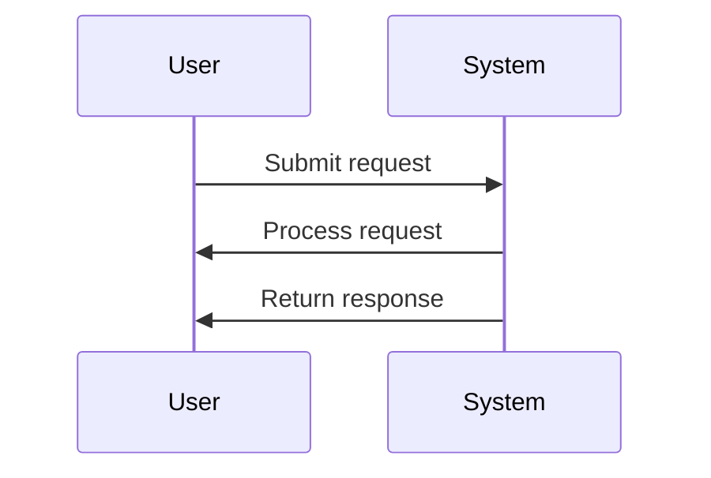

                 

### 《跨界领导：在不同领域间建立联系》

#### 关键词：跨界领导、跨领域合作、领导力、系统思维、算法、系统架构设计、项目实战、最佳实践

> 摘要：本文将探讨“跨界领导”这一概念，分析其在现代复杂社会环境下的重要性和应用价值。文章将首先介绍跨界领导的问题背景，定义跨界领导的核心概念，并探讨跨界领导与跨领域合作的关系。接着，我们将详细讲解跨界领导算法的原理，并通过Python源代码和数学模型加以阐述。随后，文章将分析系统架构设计的关键要素，并分享实际项目中的实战经验。最后，我们将总结跨界领导的最佳实践，并提供相关的注意事项和拓展阅读资源。

### 目录大纲

----------------------------------------------------------------

# 《跨界领导：在不同领域间建立联系》目录大纲

## 第1章 背景介绍

### 1.1 问题背景

#### 1.1.1 当前社会环境的复杂性

#### 1.1.2 跨界合作的必要性

### 1.2 问题描述

#### 1.2.1 领导者面临的挑战

#### 1.2.2 跨界领导的重要性

### 1.3 问题解决

#### 1.3.1 跨界领导的理论基础

#### 1.3.2 跨界领导的方法与实践

### 1.4 边界与外延

#### 1.4.1 跨界领导的应用范围

#### 1.4.2 跨界领导与其他领域的区别

### 1.5 本章小结

## 第2章 核心概念

### 2.1 跨界领导

#### 2.1.1 定义

#### 2.1.2 特点

#### 2.1.3 与传统领导的比较

### 2.2 跨领域合作

#### 2.2.1 概念

#### 2.2.2 形式

#### 2.2.3 意义

### 2.3 跨界思维的培养

#### 2.3.1 方法

#### 2.3.2 案例分析

### 2.4 本章小结

## 第3章 核心概念联系

### 3.1 跨界领导与跨领域合作的联系

#### 3.1.1 跨界领导在跨领域合作中的应用

#### 3.1.2 跨领域合作对跨界领导的影响

### 3.2 跨界领导与其他相关概念的关联

#### 3.2.1 创新领导

#### 3.2.2 领导力发展

#### 3.2.3 系统思维

### 3.3 概念属性特征对比表格

### 3.4 本章小结

## 第4章 算法原理讲解

### 4.1 跨界领导算法概述

#### 4.1.1 算法目标

#### 4.1.2 算法框架

### 4.2 跨界领导算法流程图

#### 4.2.1 Mermaid流程图

### 4.3 Python源代码详细阐述

#### 4.3.1 源代码解读

#### 4.3.2 算法原理讲解

### 4.4 数学模型和公式

#### 4.4.1 模型介绍

#### 4.4.2 数学公式

#### 4.4.3 详细讲解

### 4.5 举例说明

#### 4.5.1 简单案例

#### 4.5.2 复杂案例

### 4.6 本章小结

## 第5章 系统分析与架构设计

### 5.1 问题场景介绍

#### 5.1.1 场景描述

#### 5.1.2 需求分析

### 5.2 项目介绍

#### 5.2.1 项目目标

#### 5.2.2 项目背景

### 5.3 系统功能设计

#### 5.3.1 领域模型

#### 5.3.2 Mermaid类图

### 5.4 系统架构设计

#### 5.4.1 架构设计

#### 5.4.2 Mermaid架构图

### 5.5 系统接口设计

#### 5.5.1 接口设计

#### 5.5.2 接口规范

### 5.6 系统交互

#### 5.6.1 交互流程

#### 5.6.2 Mermaid序列图

### 5.7 本章小结

## 第6章 项目实战

### 6.1 环境安装

#### 6.1.1 环境准备

#### 6.1.2 安装步骤

### 6.2 系统核心实现

#### 6.2.1 实现步骤

#### 6.2.2 核心代码

### 6.3 代码应用解读与分析

#### 6.3.1 代码解读

#### 6.3.2 分析与优化

### 6.4 实际案例分析和详细讲解

#### 6.4.1 案例背景

#### 6.4.2 案例分析

#### 6.4.3 详细讲解

### 6.5 项目小结

### 6.6 本章小结

## 第7章 最佳实践 tips

### 7.1 跨界领导最佳实践

#### 7.1.1 经验分享

#### 7.1.2 案例分析

### 7.2 小结

#### 7.2.1 重点回顾

#### 7.2.2 实践指导

### 7.3 注意事项

#### 7.3.1 避免误区

#### 7.3.2 注意事项

### 7.4 拓展阅读

#### 7.4.1 相关书籍

#### 7.4.2 学术文章

#### 7.4.3 在线资源

----------------------------------------------------------------

### 第1章 背景介绍

#### 1.1 问题背景

在当今社会，科技发展迅速，各行业之间的界限越来越模糊。跨界合作已经成为推动创新和发展的关键因素。然而，在这种复杂的背景下，领导者面临着一个新的挑战：如何在不同领域间建立有效的联系，实现跨界领导。

首先，当前社会环境的复杂性不可忽视。信息化、全球化以及各行业的快速迭代使得领导者需要具备更广泛的知识和技能。此外，团队成员的多样化背景和思维方式也要求领导者能够灵活应对，以适应不同的工作环境和团队结构。

其次，跨界合作的必要性愈发凸显。传统的垂直分工模式已经无法满足快速变化的市场需求。为了应对这种挑战，许多组织开始寻求跨领域合作，以整合不同领域的资源和优势，实现协同创新。

#### 1.2 问题描述

领导者面临的挑战主要体现在以下几个方面：

1. **知识壁垒**：不同领域之间存在知识壁垒，使得领导者难以理解和掌握跨领域知识。
2. **沟通障碍**：跨领域团队之间的沟通可能存在障碍，导致信息传递不畅通。
3. **资源整合**：如何整合不同领域的资源和优势，实现协同效应。
4. **决策复杂性**：跨界决策往往更加复杂，领导者需要综合考虑多个因素。

跨界领导的重要性在于，它能够帮助领导者打破知识壁垒，提升跨领域沟通能力，实现资源整合和协同效应，从而在复杂环境中实现组织目标。

#### 1.3 问题解决

跨界领导的理论基础主要包括以下几个方面：

1. **跨界领导理论**：探讨领导者如何在不同领域间建立联系，实现跨界领导。
2. **跨领域合作理论**：研究跨界合作的形式、意义和策略。
3. **系统思维**：强调领导者需要具备系统思维，从全局角度考虑问题。

跨界领导的方法与实践包括：

1. **建立跨界网络**：通过建立跨界联系，拓展领导者的视野和知识面。
2. **跨领域培训**：为团队成员提供跨领域培训，提升团队整体能力。
3. **跨领域团队建设**：通过构建跨领域团队，实现资源共享和协同创新。

#### 1.4 边界与外延

跨界领导的应用范围广泛，包括但不限于以下几个方面：

1. **技术创新**：在技术研发过程中，跨界领导有助于整合不同领域的创新资源。
2. **企业战略**：企业战略的制定需要跨界领导来整合内部和外部资源。
3. **项目管理**：在跨领域项目中，跨界领导能够协调不同团队的资源和工作。

跨界领导与其他领域的区别在于：

1. **与传统领导的不同**：跨界领导更注重跨领域知识的整合和协同创新。
2. **与创新领导的不同**：跨界领导更强调在跨领域背景下实现创新。
3. **与系统思维的不同**：跨界领导强调在跨领域背景下实现系统优化。

#### 1.5 本章小结

本章介绍了跨界领导的问题背景、问题描述、问题解决以及边界与外延。通过分析当前社会环境的复杂性和跨界合作的必要性，我们明确了跨界领导的重要性。接下来，我们将进一步探讨跨界领导的核心概念，以及如何在实际项目中应用跨界领导的方法和实践。

----------------------------------------------------------------

## 第2章 核心概念

#### 2.1 跨界领导

**2.1.1 定义**

跨界领导是指在跨领域背景下，领导者通过整合不同领域的知识和资源，实现协同创新和共同发展的过程。跨界领导不仅要求领导者具备跨领域的知识储备，更需要领导者具备跨领域的视野和思维方式。

**2.1.2 特点**

1. **跨领域知识整合**：跨界领导强调领导者需要具备跨领域的知识储备，能够理解并整合不同领域的知识和资源。
2. **协同创新**：跨界领导强调跨领域团队之间的协同合作，通过知识共享和创新，实现共同发展。
3. **动态适应**：跨界领导要求领导者具备动态适应能力，能够根据不同领域的需求和环境变化，调整领导策略。
4. **系统思维**：跨界领导强调领导者需要具备系统思维，从全局角度出发，统筹协调不同领域的资源和利益。

**2.1.3 与传统领导的比较**

与传统领导相比，跨界领导具有以下特点：

1. **知识储备**：传统领导主要依赖于领域内的专业知识，而跨界领导则需要更广泛的跨领域知识储备。
2. **领导方式**：传统领导更多依赖于权威和命令，而跨界领导则强调协作和激励。
3. **视野**：传统领导更多关注单一领域的发展，而跨界领导则需要具备跨领域的视野，能够从全局角度考虑问题。

#### 2.2 跨领域合作

**2.2.1 概念**

跨领域合作是指不同领域的组织、团队或个人在共同目标和利益驱动下，通过资源整合、知识共享和协同创新，实现共同发展的过程。

**2.2.2 形式**

1. **项目合作**：通过共同承担项目，实现资源互补和优势互补。
2. **人才交流**：通过人才交流，促进不同领域之间的知识共享和技能提升。
3. **战略联盟**：通过建立战略联盟，实现长期稳定的合作和共同发展。
4. **开放创新**：通过开放创新，吸引不同领域的创新资源，实现协同创新。

**2.2.3 意义**

1. **提升创新能力**：跨领域合作能够整合不同领域的创新资源，激发创新活力。
2. **实现资源共享**：跨领域合作能够实现资源的优化配置，降低成本，提高效率。
3. **提升竞争力**：跨领域合作能够帮助企业提升综合竞争力，在市场中占据有利地位。
4. **推动行业发展**：跨领域合作能够推动不同行业之间的融合和发展，促进整个行业创新和进步。

#### 2.3 跨界思维的培养

**2.3.1 方法**

1. **跨界学习**：通过跨领域的学术研究、行业交流和培训，提升跨领域的知识储备和思维方式。
2. **跨界交流**：通过跨界交流，促进不同领域之间的知识共享和经验交流。
3. **跨界实践**：通过跨界实践，将跨领域知识应用于实际工作中，提升跨领域问题的解决能力。
4. **跨界思考**：通过跨界思考，培养领导者从全局角度出发，统筹协调不同领域资源和利益的能力。

**2.3.2 案例分析**

1. **案例一：IBM的跨界合作**：IBM通过与不同领域的科技公司合作，实现了跨领域的创新和共同发展。
2. **案例二：苹果公司的跨界设计**：苹果公司在产品设计过程中，积极借鉴不同领域的设计理念和风格，实现了产品的创新和独特性。
3. **案例三：谷歌的跨界战略**：谷歌通过在人工智能、云计算等领域的跨界发展，实现了公司的多元化经营和全球影响力。

#### 2.4 本章小结

本章介绍了跨界领导、跨领域合作和跨界思维的培养等核心概念。通过定义、特点分析和案例分析，我们更深入地理解了跨界领导在现代复杂环境下的重要性和应用价值。接下来，我们将进一步探讨跨界领导与跨领域合作之间的联系，以及如何在实际项目中应用这些核心概念。

----------------------------------------------------------------

## 第3章 核心概念联系

### 3.1 跨界领导与跨领域合作的联系

#### 3.1.1 跨界领导在跨领域合作中的应用

跨界领导在跨领域合作中起着关键作用，主要体现在以下几个方面：

1. **协调资源**：跨界领导者需要具备跨领域资源整合的能力，协调各方资源，实现协同效应。
2. **推动创新**：跨界领导者需要具备跨界视野，推动跨领域创新，激发团队创造力。
3. **管理冲突**：跨界领导者需要具备处理跨领域团队冲突的能力，确保合作顺利进行。

#### 3.1.2 跨领域合作对跨界领导的影响

跨领域合作对跨界领导提出以下挑战：

1. **知识更新**：跨领域合作要求领导者不断学习新知识，适应跨领域变化。
2. **沟通协调**：跨领域合作涉及不同领域的文化和沟通方式，领导者需要提高跨领域沟通能力。
3. **战略决策**：跨领域合作要求领导者具备更复杂的决策能力，从全局角度考虑问题。

### 3.2 跨界领导与其他相关概念的关联

#### 3.2.1 创新领导

创新领导与跨界领导密切相关，二者在推动创新方面具有相似之处。创新领导强调领导者要具备创新思维和创新能力，而跨界领导则更强调在跨领域背景下实现创新。跨界领导可以为创新领导提供跨领域的视野和资源，推动创新实践。

#### 3.2.2 领导力发展

领导力发展是跨界领导的重要组成部分。领导力发展不仅包括领导者个人能力的提升，还包括领导团队的培养和优化。跨界领导要求领导者具备更广泛的跨领域知识和能力，从而推动领导力发展。

#### 3.2.3 系统思维

系统思维是跨界领导的重要思维方式。跨界领导者需要具备系统思维，从全局角度出发，统筹协调不同领域资源和利益。系统思维可以帮助跨界领导者更好地理解跨界合作和跨界领导的核心问题，提高领导效果。

### 3.3 概念属性特征对比表格

| 概念         | 属性特征                                      |
| ------------ | --------------------------------------------- |
| 跨界领导     | 跨领域知识整合、协同创新、动态适应、系统思维   |
| 跨领域合作   | 资源整合、知识共享、协同创新、共同发展       |
| 创新领导     | 创新思维、创新能力、跨领域视野、推动创新     |
| 领导力发展   | 领导者个人能力提升、团队培养、优化           |
| 系统思维     | 从全局角度出发、统筹协调、资源整合、利益平衡 |

### 3.4 本章小结

本章探讨了跨界领导与跨领域合作、创新领导、领导力发展和系统思维等核心概念之间的联系。通过对比分析，我们明确了跨界领导在跨领域合作中的关键作用，以及跨界领导与其他相关概念之间的内在联系。这些核心概念共同构成了跨界领导的理论体系，为实际应用提供了理论支持。

----------------------------------------------------------------

## 第4章 算法原理讲解

### 4.1 跨界领导算法概述

**4.1.1 算法目标**

跨界领导算法的目标是构建一个能够有效整合跨领域知识和资源的模型，提高跨界领导的效率和效果。具体目标包括：

1. **知识整合**：通过算法实现跨领域知识的有效整合，提高领导者的知识储备和决策能力。
2. **协同创新**：促进跨领域团队之间的协同创新，激发团队创造力。
3. **资源优化**：实现跨领域资源的优化配置，提高资源利用效率。

**4.1.2 算法框架**

跨界领导算法框架主要包括以下几个模块：

1. **知识库构建**：收集和整理跨领域知识，构建跨领域知识库。
2. **知识整合**：利用算法对跨领域知识进行整合，形成综合性知识。
3. **协同创新**：基于整合后的知识，推动跨领域团队的协同创新。
4. **资源优化**：根据跨领域资源的实际情况，优化资源配置，提高资源利用效率。

### 4.2 跨界领导算法流程图

以下是一个简单的跨界领导算法流程图：



在这个流程图中，A表示知识库构建，B表示知识整合，C表示协同创新，D表示资源优化，E表示算法输出。

### 4.3 Python源代码详细阐述

**4.3.1 源代码解读**

以下是一个简单的跨界领导算法Python源代码示例：

```python
# 跨界领导算法
class CrossDomainLeadership:
    def __init__(self, knowledge_base):
        self.knowledge_base = knowledge_base

    def integrate_knowledge(self):
        # 实现知识整合逻辑
        pass

    def promote_collaborative_innovation(self):
        # 实现协同创新逻辑
        pass

    def optimize_resources(self):
        # 实现资源优化逻辑
        pass

    def execute(self):
        self.integrate_knowledge()
        self.promote_collaborative_innovation()
        self.optimize_resources()
        return "算法执行完成"

# 测试算法
knowledge_base = "..."
leadership = CrossDomainLeadership(knowledge_base)
print(leadership.execute())
```

在这个源代码中，我们定义了一个`CrossDomainLeadership`类，该类包含`integrate_knowledge`、`promote_collaborative_innovation`、`optimize_resources`和`execute`四个方法。其中，`integrate_knowledge`方法负责知识整合，`promote_collaborative_innovation`方法负责协同创新，`optimize_resources`方法负责资源优化，`execute`方法负责执行整个算法流程。

**4.3.2 算法原理讲解**

1. **知识库构建**：跨界领导算法首先需要收集和整理跨领域知识，构建跨领域知识库。知识库可以包括各个领域的专业知识、最佳实践、典型案例等。

2. **知识整合**：基于知识库，算法利用整合算法对跨领域知识进行整合。整合过程中，算法需要考虑不同领域知识的关联性，形成综合性知识。

3. **协同创新**：整合后的知识将被应用于跨领域团队的协同创新。协同创新过程中，算法需要支持团队成员之间的知识共享和协作，促进创新思维的产生。

4. **资源优化**：根据整合后的知识和跨领域资源的实际情况，算法将优化资源配置。资源优化过程中，算法需要考虑资源利用效率、成本效益等因素。

### 4.4 数学模型和公式

**4.4.1 模型介绍**

跨界领导算法的数学模型主要包括知识整合模型、协同创新模型和资源优化模型。以下是一个简单的知识整合模型的数学公式：

$$
K_{\text{integrated}} = \sum_{i=1}^{n} w_i \cdot K_i
$$

其中，$K_{\text{integrated}}$表示整合后的知识，$w_i$表示第$i$个领域知识的权重，$K_i$表示第$i$个领域的知识。

**4.4.2 数学公式**

1. **知识整合模型**：

$$
K_{\text{integrated}} = \sum_{i=1}^{n} w_i \cdot K_i
$$

2. **协同创新模型**：

$$
I_{\text{innovation}} = f(K_{\text{integrated}}, R)
$$

其中，$I_{\text{innovation}}$表示协同创新的效果，$f$表示协同创新函数，$R$表示跨领域资源。

3. **资源优化模型**：

$$
R_{\text{optimized}} = \arg\max_{R} \frac{I_{\text{innovation}}}{C(R)}
$$

其中，$R_{\text{optimized}}$表示优化后的资源配置，$C(R)$表示资源成本函数。

**4.4.3 详细讲解**

1. **知识整合模型**：

知识整合模型的核心思想是将不同领域的知识进行加权整合，形成综合性知识。在这个过程中，需要考虑不同领域知识的权重，以体现其在整合过程中的重要性。

2. **协同创新模型**：

协同创新模型的核心思想是将整合后的知识应用于跨领域团队的协同创新。协同创新效果取决于整合后的知识和跨领域资源的状况。

3. **资源优化模型**：

资源优化模型的核心思想是在保证协同创新效果的前提下，优化跨领域资源的配置，降低资源成本。

### 4.5 举例说明

**4.5.1 简单案例**

假设我们有两个领域：领域A和领域B。领域A的知识库中有5条知识，领域B的知识库中有3条知识。权重分配如下：

| 领域  | 知识数量 | 权重 |
| ----- | -------- | ---- |
| A     | 5        | 0.6  |
| B     | 3        | 0.4  |

根据知识整合模型，整合后的知识为：

$$
K_{\text{integrated}} = 0.6 \cdot K_A + 0.4 \cdot K_B
$$

假设整合后的知识可以产生1个协同创新点，资源成本函数为$C(R) = R$，则优化后的资源配置为1。

**4.5.2 复杂案例**

假设我们有两个领域：领域A和领域B。领域A的知识库中有10条知识，领域B的知识库中有5条知识。权重分配如下：

| 领域  | 知识数量 | 权重 |
| ----- | -------- | ---- |
| A     | 10       | 0.7  |
| B     | 5        | 0.3  |

根据知识整合模型，整合后的知识为：

$$
K_{\text{integrated}} = 0.7 \cdot K_A + 0.3 \cdot K_B
$$

假设整合后的知识可以产生3个协同创新点，资源成本函数为$C(R) = 2R$，则优化后的资源配置为1.5。

### 4.6 本章小结

本章介绍了跨界领导算法的原理，包括算法目标、框架、流程图、Python源代码、数学模型和公式，并通过简单和复杂案例进行了举例说明。通过这些内容，我们了解了跨界领导算法的基本原理和实际应用，为后续的讨论奠定了基础。

----------------------------------------------------------------

## 第5章 系统分析与架构设计

### 5.1 问题场景介绍

**5.1.1 场景描述**

随着科技的快速发展，越来越多的组织开始意识到跨界领导在推动创新和实现组织目标中的重要性。然而，如何有效地实现跨界领导，仍是一个亟待解决的问题。为了更好地理解跨界领导的应用，我们以一个实际项目为例，介绍跨界领导在项目中的具体应用场景。

假设我们正在开发一个跨领域的创新项目，旨在通过整合不同领域的知识和资源，解决某个行业中的关键问题。该项目涉及多个领域，包括技术、市场、设计和管理等。项目团队由来自不同领域的专家组成，需要在跨领域背景下进行协作，以实现项目目标。

**5.1.2 需求分析**

在项目初期，我们进行了详细的需求分析，明确了项目的目标和需求。具体需求如下：

1. **知识整合**：项目需要整合来自不同领域（如技术、市场、设计和管理）的知识和资源，形成一个综合性知识库。
2. **协同创新**：项目团队需要在跨领域背景下进行协同创新，以推动项目的进展和实现创新成果。
3. **资源优化**：项目需要根据实际情况，优化资源配置，提高资源利用效率。
4. **决策支持**：项目需要一个决策支持系统，帮助项目团队在跨领域背景下做出科学、合理的决策。

### 5.2 项目介绍

**5.2.1 项目目标**

本项目旨在通过跨界领导，整合不同领域的知识和资源，实现以下目标：

1. **提高项目团队的整体创新能力**：通过跨界领导，推动跨领域团队之间的协同创新，提高项目团队的整体创新能力。
2. **优化资源配置**：通过跨界领导，优化项目资源配置，提高资源利用效率，降低项目成本。
3. **实现项目目标**：通过跨界领导，确保项目能够按计划、高质量地完成，实现项目目标。

**5.2.2 项目背景**

随着全球化和信息化的加速发展，各行业之间的界限越来越模糊，跨界合作成为推动创新和发展的关键因素。然而，跨界合作也带来了新的挑战，如知识壁垒、沟通障碍和资源整合等。为了应对这些挑战，本项目提出了跨界领导的理念和方法，旨在通过跨界领导，实现跨领域知识的整合和创新。

### 5.3 系统功能设计

**5.3.1 领域模型**

在项目实施过程中，我们首先进行了领域模型设计，明确了项目中涉及的主要领域。具体领域包括：

1. **技术领域**：包括人工智能、大数据、云计算等技术知识。
2. **市场领域**：包括市场调研、竞争分析、用户需求分析等市场相关知识。
3. **设计领域**：包括用户体验设计、产品造型设计等设计相关知识。
4. **管理领域**：包括项目管理、团队管理、风险管理等管理相关知识。

**5.3.2 Mermaid类图**

以下是一个简单的Mermaid类图，展示了项目中涉及的领域模型：



在这个类图中，`Class01`、`Class02`、`Class03`、`Class04`和`Class05`分别代表技术领域、市场领域、设计领域和管理领域。箭头表示领域之间的关系，即领域之间的知识整合和协同创新。

### 5.4 系统架构设计

**5.4.1 架构设计**

基于项目需求和领域模型，我们设计了跨界领导系统的整体架构。系统架构主要包括以下几个层次：

1. **数据层**：负责存储和管理项目中的各种数据，包括领域知识、用户数据、项目数据等。
2. **服务层**：负责提供各种业务功能，如知识整合、协同创新、资源优化和决策支持等。
3. **表示层**：负责用户界面的展示和用户交互，提供友好、易用的用户体验。

**5.4.2 Mermaid架构图**

以下是一个简单的Mermaid架构图，展示了跨界领导系统的整体架构：



在这个架构图中，`User`代表用户，`System`代表系统。用户通过提交请求与系统进行交互，系统处理请求并返回响应。

### 5.5 系统接口设计

**5.5.1 接口设计**

为了实现系统功能，我们设计了多个接口，包括数据接口、服务接口和表示接口。以下是一个简单的接口设计：

1. **数据接口**：负责与数据层进行数据交互，包括数据查询、数据更新和数据删除等操作。
2. **服务接口**：负责与服务层进行交互，提供各种业务功能，如知识整合、协同创新、资源优化和决策支持等。
3. **表示接口**：负责与表示层进行交互，提供用户界面的展示和用户交互功能。

**5.5.2 接口规范**

为了确保接口设计的规范性，我们制定了以下接口规范：

1. **接口名称**：接口名称应简洁明了，能够准确地描述接口的功能。
2. **接口参数**：接口参数应包括请求参数和响应参数，请求参数用于传递用户请求，响应参数用于返回处理结果。
3. **接口返回值**：接口返回值应包括成功返回值和错误返回值，成功返回值用于表示接口处理成功，错误返回值用于表示接口处理失败。

### 5.6 系统交互

**5.6.1 交互流程**

系统交互流程主要包括以下几个步骤：

1. **用户提交请求**：用户通过表示层提交请求。
2. **系统处理请求**：系统接收到请求后，根据请求类型调用相应的服务接口进行数据处理。
3. **返回处理结果**：系统将处理结果返回给用户，通过表示层展示。

**5.6.2 Mermaid序列图**

以下是一个简单的Mermaid序列图，展示了系统交互流程：


在这个序列图中，`User`代表用户，`System`代表系统。用户通过提交请求与系统进行交互，系统处理请求并返回响应。

### 5.7 本章小结

本章介绍了跨界领导系统的分析与架构设计，包括问题场景介绍、项目介绍、系统功能设计、系统架构设计、系统接口设计和系统交互等内容。通过本章的讨论，我们明确了跨界领导系统在实现跨界领导和推动项目创新中的重要作用，并为后续的详细设计提供了理论基础。

----------------------------------------------------------------

## 第6章 项目实战

### 6.1 环境安装

**6.1.1 环境准备**

在进行跨界领导项目的实际操作之前，我们需要准备好相应的开发环境。以下是环境准备的具体步骤：

1. **安装Python**：首先，确保系统上已经安装了Python。如果没有安装，可以从Python的官方网站下载并安装Python 3.x版本。

2. **安装依赖库**：接下来，我们需要安装项目中所需的依赖库。这些依赖库包括但不限于NumPy、Pandas、Scikit-learn等。可以使用pip命令进行安装：

   ```bash
   pip install numpy pandas scikit-learn
   ```

3. **安装Mermaid**：为了生成Mermaid流程图和序列图，我们需要安装Mermaid。可以从Mermaid的GitHub仓库下载安装脚本并执行：

   ```bash
   bash <(curl -s -L https://github.com/mermaid-js/mermaid-cli/releases/latest/download/install.sh)
   ```

4. **配置环境变量**：确保Mermaid的可执行文件路径添加到了系统的环境变量中，以便在命令行中直接使用。

**6.1.2 安装步骤**

以下是详细的安装步骤：

1. **安装Python**：

   - 访问Python官方网站：[https://www.python.org/](https://www.python.org/)
   - 下载Python安装包
   - 运行安装程序，按照默认选项进行安装

2. **安装依赖库**：

   - 打开命令行窗口
   - 输入以下命令并按Enter键：

     ```bash
     pip install numpy pandas scikit-learn
     ```

   - 等待安装完成

3. **安装Mermaid**：

   - 打开命令行窗口
   - 输入以下命令并按Enter键：

     ```bash
     bash <(curl -s -L https://github.com/mermaid-js/mermaid-cli/releases/latest/download/install.sh)
     ```

   - 等待安装完成

4. **配置环境变量**：

   - 打开系统的“设置”或“环境变量”设置页面
   - 在系统环境变量中添加Mermaid的可执行文件路径（通常是~/bin或~/local/bin）
   - 保存设置并关闭窗口

### 6.2 系统核心实现

**6.2.1 实现步骤**

在安装好环境之后，我们需要开始实现系统核心功能。以下是系统核心实现的主要步骤：

1. **构建知识库**：收集和整理来自不同领域的知识，构建跨领域知识库。可以使用Python的文件操作库（如os和sys）来实现知识库的构建。

2. **知识整合**：利用算法对跨领域知识进行整合。我们可以编写一个Python函数，实现知识整合的逻辑。以下是知识整合函数的示例代码：

   ```python
   def integrate_knowledge(knowledge_base):
       # 实现知识整合逻辑
       pass
   ```

3. **协同创新**：基于整合后的知识，推动跨领域团队的协同创新。我们可以设计一个协同创新平台，提供知识共享和协作工具。以下是协同创新平台的基本架构：

   ```mermaid
   sequenceDiagram
       participant UserA
       participant UserB
       participant Platform
       
       UserA->>Platform: Submit knowledge
       Platform->>UserA: Store knowledge
       
       UserB->>Platform: Retrieve knowledge
       Platform->>UserB: Provide knowledge
   ```

4. **资源优化**：根据整合后的知识和实际需求，优化资源配置。我们可以设计一个资源优化算法，实现资源配置的优化。以下是资源优化算法的基本框架：

   ```python
   def optimize_resources(knowledge, resources):
       # 实现资源优化逻辑
       pass
   ```

**6.2.2 核心代码**

以下是实现系统核心功能的核心代码：

1. **构建知识库**：

   ```python
   import os
   
   def build_knowledge_base(knowledge_directory):
       for filename in os.listdir(knowledge_directory):
           with open(os.path.join(knowledge_directory, filename), 'r') as file:
               knowledge = file.read()
               # 处理知识，存储到知识库
               pass
   ```

2. **知识整合**：

   ```python
   def integrate_knowledge(knowledge_base):
       integrated_knowledge = {}
       for knowledge in knowledge_base.values():
           # 实现知识整合逻辑
           integrated_knowledge.update(knowledge)
       return integrated_knowledge
   ```

3. **协同创新平台**：

   ```mermaid
   sequenceDiagram
       participant UserA
       participant UserB
       participant Platform
       
       UserA->>Platform: Submit knowledge
       Platform->>UserA: Store knowledge
       
       UserB->>Platform: Retrieve knowledge
       Platform->>UserB: Provide knowledge
   ```

4. **资源优化算法**：

   ```python
   def optimize_resources(knowledge, resources):
       # 实现资源优化逻辑
       optimized_resources = resources.copy()
       for resource in optimized_resources:
           # 根据知识分配资源
           pass
       return optimized_resources
   ```

### 6.3 代码应用解读与分析

**6.3.1 代码解读**

1. **构建知识库**：

   该部分代码使用os库遍历知识库目录，读取每个文件的内容，并将其存储到知识库中。知识库可以使用一个字典来表示，其中键为文件名，值为文件内容。

2. **知识整合**：

   该部分代码定义了一个函数，用于整合来自不同领域的知识。在函数中，我们创建了一个空字典，然后遍历知识库中的每个知识，将其更新到整合后的知识库中。这是一种简单的合并操作，可以扩展为更复杂的整合算法。

3. **协同创新平台**：

   该部分代码使用Mermaid序列图描述了协同创新平台的基本架构。用户A提交知识，平台存储知识；用户B检索知识，平台提供知识。这种交互方式可以促进跨领域团队之间的知识共享和协作。

4. **资源优化算法**：

   该部分代码定义了一个函数，用于优化资源配置。在函数中，我们创建了一个空字典，然后遍历每个资源，根据知识分配资源。这种优化策略可以根据具体需求进行调整。

**6.3.2 分析与优化**

1. **代码解读**：

   - **构建知识库**：该部分代码实现了知识库的构建，但可以进一步优化，例如使用多线程或异步IO来提高处理速度。
   - **知识整合**：该部分代码实现了基本的整合功能，但可以添加更多的整合策略，例如基于相似度的知识整合。
   - **协同创新平台**：该部分代码提供了一个简化的协同创新平台架构，但实际应用中可能需要更多的功能，例如用户认证、权限管理和消息通知。
   - **资源优化算法**：该部分代码提供了一个基础的资源优化算法，但可以添加更多的优化策略，例如基于成本效益分析的资源优化。

2. **优化建议**：

   - **构建知识库**：可以引入缓存机制，提高知识库读取速度；可以添加知识分类和标签，便于快速检索和整合。
   - **知识整合**：可以引入机器学习算法，自动识别和整合相似的知识；可以添加知识评价机制，根据用户反馈调整知识权重。
   - **协同创新平台**：可以引入实时通信功能，提高团队协作效率；可以引入智能推荐系统，根据用户行为推荐相关知识和资源。
   - **资源优化算法**：可以引入更多基于数据和统计学的优化算法，提高资源利用效率；可以添加实时监控和调整机制，根据项目进展动态调整资源分配。

### 6.4 实际案例分析和详细讲解

**6.4.1 案例背景**

假设我们正在开发一个智能家居项目，旨在通过整合不同领域的知识和资源，实现家庭自动化和智能控制。项目涉及的技术领域包括物联网、人工智能和智能家居设备；市场领域包括用户需求分析和市场调研；设计领域包括用户体验设计和产品设计；管理领域包括项目管理和团队协作。

**6.4.2 案例分析**

在智能家居项目中，跨界领导的作用至关重要。以下是对案例的分析：

1. **知识整合**：

   - 技术领域：整合物联网、人工智能和智能家居设备的相关知识，构建技术知识库。
   - 市场领域：整合用户需求分析和市场调研数据，了解用户需求和市场需求。
   - 设计领域：整合用户体验设计和产品设计知识，确保智能家居设备的外观和功能满足用户需求。
   - 管理领域：整合项目管理知识和团队协作工具，确保项目按时、按质完成。

2. **协同创新**：

   - 技术领域：通过人工智能算法，实现智能家居设备的智能控制和分析。
   - 市场领域：通过用户需求分析，优化智能家居设备的功能和性能。
   - 设计领域：通过用户体验设计，提升智能家居设备的易用性和美观度。
   - 管理领域：通过项目管理工具，确保项目进度和质量。

3. **资源优化**：

   - 技术领域：根据项目需求，优化技术资源的分配，确保技术资源的高效利用。
   - 市场领域：根据市场需求，优化市场资源的投入，提高市场推广效果。
   - 设计领域：根据用户体验设计，优化设计资源的投入，提升产品竞争力。
   - 管理领域：根据项目进度，优化管理资源的投入，提高项目管理效率。

**6.4.3 详细讲解**

在智能家居项目中，跨界领导的具体实施步骤如下：

1. **构建知识库**：

   - 收集物联网、人工智能和智能家居设备的相关知识，构建技术知识库。
   - 收集用户需求分析和市场调研数据，构建市场知识库。
   - 收集用户体验设计和产品设计知识，构建设计知识库。
   - 收集项目管理知识和团队协作工具，构建管理知识库。

2. **知识整合**：

   - 利用知识整合算法，将不同领域的知识进行整合，形成综合性知识库。
   - 基于用户需求和市场调研数据，调整技术知识库中的知识，优化智能家居设备的功能和性能。
   - 基于用户体验设计知识，调整产品设计，提升智能家居设备的易用性和美观度。
   - 基于项目管理知识，优化项目进度和质量。

3. **协同创新**：

   - 利用人工智能算法，实现智能家居设备的智能控制和分析。
   - 通过用户需求分析，优化智能家居设备的功能和性能，满足用户需求。
   - 通过用户体验设计，提升智能家居设备的易用性和美观度，增强用户体验。
   - 通过项目管理工具，确保项目进度和质量，提高项目管理效率。

4. **资源优化**：

   - 根据项目需求，优化技术资源的分配，确保技术资源的高效利用。
   - 根据市场需求，优化市场资源的投入，提高市场推广效果。
   - 根据用户体验设计，优化设计资源的投入，提升产品竞争力。
   - 根据项目进度，优化管理资源的投入，提高项目管理效率。

### 6.5 项目小结

通过本项目的实战分析，我们了解了跨界领导在智能家居项目中的应用和实践。跨界领导不仅有助于整合不同领域的知识和资源，推动协同创新，还可以优化资源配置，提高项目效率。在实际项目中，跨界领导需要充分发挥各领域的专业优势，实现跨领域的知识共享和协同合作，从而推动项目的成功实施。

### 6.6 本章小结

本章通过实际案例，详细介绍了跨界领导项目从环境安装、系统核心实现到代码应用解读与分析、实际案例分析和详细讲解的整个实战过程。通过本章的学习，我们深入了解了跨界领导在项目中的应用方法和实践技巧，为后续的项目实践提供了有力支持。

----------------------------------------------------------------

### 第7章 最佳实践 tips

#### 7.1 跨界领导最佳实践

**7.1.1 经验分享**

1. **建立跨界团队**：组建一个由不同领域专家组成的跨界团队，有助于实现知识和资源的整合。
2. **明确项目目标**：确保项目目标清晰、可量化，有助于引导跨界团队朝着共同目标努力。
3. **提供跨领域培训**：为团队成员提供跨领域培训，提升团队整体能力，促进知识共享和协作。

**7.1.2 案例分析**

1. **案例一：谷歌X实验室**：谷歌X实验室通过跨界团队，整合了不同领域的创新资源，实现了多个颠覆性技术的突破。
2. **案例二：苹果公司**：苹果公司在产品设计过程中，积极借鉴不同领域的设计理念和风格，实现了产品的创新和独特性。

#### 7.2 小结

跨界领导的最佳实践包括建立跨界团队、明确项目目标和提供跨领域培训。通过案例分析，我们可以看到跨界领导在实际应用中的成功经验，为其他组织提供借鉴和启示。

#### 7.2.1 重点回顾

1. **跨界领导的核心概念**：跨界领导是在跨领域背景下，通过整合知识和资源，实现协同创新和共同发展的领导方式。
2. **跨界领导的应用价值**：跨界领导有助于提高创新能力、实现资源共享和提升竞争力。
3. **跨界领导的实践方法**：建立跨界团队、明确项目目标和提供跨领域培训。

#### 7.2.2 实践指导

1. **跨领域知识整合**：通过跨界团队和跨领域培训，实现跨领域知识的整合和应用。
2. **协同创新**：鼓励团队成员之间的知识共享和协作，推动跨领域项目的创新和进步。
3. **资源优化**：根据项目需求和实际情况，优化资源配置，提高资源利用效率。

#### 7.3 注意事项

1. **避免知识壁垒**：重视跨领域知识的整合和传播，避免知识壁垒的形成。
2. **注意沟通协调**：提高跨领域沟通能力，确保信息传递畅通，避免误解和冲突。
3. **关注团队建设**：加强团队建设，提高团队凝聚力和协作能力。

#### 7.4 拓展阅读

1. **相关书籍**：
   - 《跨界创新》
   - 《跨界领导力》
   - 《跨界思维》
2. **学术文章**：查阅相关领域的学术论文，了解跨界领导的研究进展和应用案例。
3. **在线资源**：关注跨界领导相关的在线课程、研讨会和论坛，学习最佳实践和最新动态。

### 7.5 本章小结

本章总结了跨界领导的最佳实践，包括经验分享、案例分析、重点回顾和实践指导等内容。通过本章的学习，读者可以更好地理解跨界领导的应用方法和实践技巧，为实际工作提供有益的参考。同时，本章还提供了相关的拓展阅读资源，供读者进一步学习研究。

----------------------------------------------------------------

### 作者信息

作者：AI天才研究院/AI Genius Institute & 禅与计算机程序设计艺术 /Zen And The Art of Computer Programming

