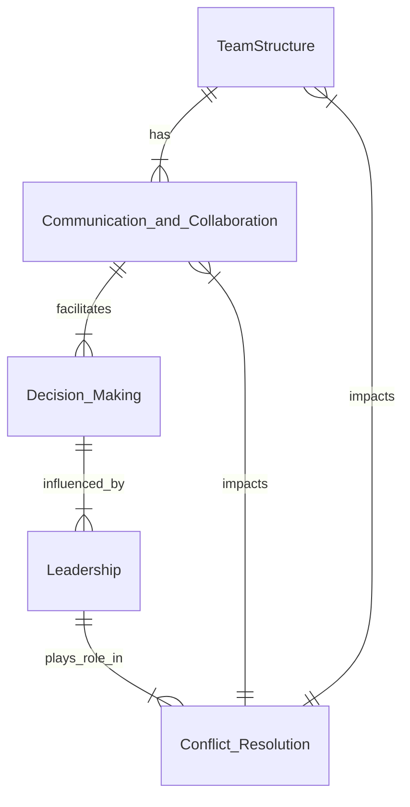

                 

### Part 1: Introduction to Cross-functional Team Management

#### Chapter 1: Background and Definition of Cross-functional Teams

##### 1.1 Definition and Characteristics of Cross-functional Teams

**Background Introduction:**

In today's fast-paced and complex business environment, the need for cross-functional teams has become increasingly evident. Cross-functional teams are composed of individuals from various departments or areas of expertise, such as marketing, sales, engineering, and customer support, who collaborate to work on a specific project or goal. Unlike traditional functional teams, which consist of individuals with similar skills and roles, cross-functional teams leverage the diverse expertise and perspectives of their members to achieve higher efficiency, innovation, and problem-solving capabilities.

**Conceptual Terms:**

- **Cross-functional Teams:** A team composed of members from various departments or areas of expertise, working collaboratively on a specific project or goal.
- **Functional Teams:** Teams consisting of individuals with similar skills and roles, often working independently within a specific department or area.
- **Diverse Skills and Perspectives:** The varied expertise, experiences, and perspectives that members of a cross-functional team bring to the table, enabling a broader range of ideas and solutions.

**Problem Description:**

As organizations increasingly rely on cross-functional teams to navigate the complexities of modern business, it is crucial to understand the definition, characteristics, and importance of these teams. While the concept of cross-functional teams may seem straightforward, effectively managing and leveraging their potential can be challenging. What specific characteristics distinguish cross-functional teams from traditional functional teams? How can organizations ensure that their cross-functional teams are optimized for success?

**Solution and Explanation:**

Cross-functional teams are characterized by the following key aspects:

1. **Diverse Skills and Expertise:** Members of cross-functional teams come from various backgrounds, such as marketing, sales, engineering, and customer support. This diversity enables the team to tackle complex problems and projects more effectively by leveraging a wide range of skills and perspectives.

2. **Collaborative Approach:** Unlike functional teams that often work independently within their departments, cross-functional teams collaborate closely and continuously throughout the project lifecycle. This collaborative approach fosters better communication, coordination, and problem-solving.

3. **Shared Goals and Objectives:** Cross-functional teams are typically formed to work on a specific project or goal that aligns with the organization's overall objectives. This shared focus on a common goal enhances team cohesion and drives collective effort towards achieving success.

4. **Flexible and Adaptive:** Cross-functional teams are designed to be flexible and adaptable to changing project requirements and priorities. This adaptability enables teams to respond quickly to new challenges and opportunities, ensuring that the organization remains agile and competitive.

**Boundary and Extension:**

While cross-functional teams are widely recognized as a valuable asset in modern organizations, there are certain limitations and challenges to consider. For instance, the diversity of skills and perspectives can sometimes lead to conflicts and misunderstandings. Additionally, managing and coordinating cross-functional teams can be more complex than managing functional teams, requiring strong leadership and effective communication strategies.

To overcome these challenges, organizations should focus on fostering a culture of collaboration, trust, and transparency. Providing training and support to team members on effective communication and conflict resolution can also help to mitigate potential issues and ensure that cross-functional teams operate smoothly and efficiently.

In conclusion, understanding the definition, characteristics, and importance of cross-functional teams is essential for organizations looking to leverage the benefits of these teams. By fostering a collaborative and adaptive environment, organizations can harness the diverse skills and perspectives of their cross-functional teams to drive innovation, improve problem-solving capabilities, and achieve their goals.

##### 1.2 The Importance of Cross-functional Teams in Modern Organizations

**Background Introduction:**

In today's fast-paced and highly competitive business environment, organizations are increasingly turning to cross-functional teams as a key component of their strategic initiatives. The importance of cross-functional teams lies in their ability to bring together diverse expertise and perspectives, driving innovation, enhancing collaboration, and ultimately improving organizational performance. Let's delve deeper into the reasons why cross-functional teams are indispensable in modern organizations.

**Conceptual Terms:**

- **Organizational Performance:** The overall effectiveness and success of an organization in achieving its goals and objectives.
- **Innovation:** The process of creating new ideas, products, or processes that lead to improved performance, competitiveness, or customer satisfaction.
- **Collaboration:** The act of working together towards a common goal, often involving the sharing of ideas, resources, and responsibilities.
- **Problem-Solving:** The process of identifying, analyzing, and resolving issues or challenges to achieve a desired outcome.

**Problem Description:**

Why are cross-functional teams considered essential in modern organizations? What specific advantages do they offer, and how do they contribute to overall organizational success? Understanding the importance of cross-functional teams can help organizations better leverage this valuable resource and achieve their strategic goals.

**Solution and Explanation:**

There are several key reasons why cross-functional teams are vital to modern organizations:

1. **Enhanced Innovation:**
   Cross-functional teams bring together individuals with diverse backgrounds, skills, and perspectives. This diversity of thought fosters creativity and innovation, as team members are more likely to generate new ideas and approaches to solving problems. By leveraging the collective knowledge and creativity of its members, a cross-functional team can develop innovative solutions that might not have been possible through the efforts of a single functional group.

2. **Improved Collaboration:**
   Collaboration is at the heart of cross-functional teams. By working closely together on a shared goal, team members from different departments or areas of expertise can develop a deeper understanding of each other's roles and responsibilities. This improved collaboration not only enhances communication and coordination but also fosters a sense of unity and shared purpose, which is crucial for achieving success.

3. **Better Problem-Solving:**
   Cross-functional teams are often formed to address complex problems or projects that require a broad range of skills and perspectives. By bringing together experts from various fields, these teams are better equipped to analyze problems from multiple angles and develop comprehensive solutions. This ability to tackle complex challenges more effectively can lead to better outcomes and a stronger competitive advantage for the organization.

4. **Increased Adaptability:**
   Cross-functional teams are inherently more adaptable than traditional functional teams. They can quickly adjust to changing project requirements or priorities, as team members are already skilled in working across different areas of the organization. This adaptability allows organizations to respond more effectively to market changes, customer needs, and other external factors, ensuring that they remain competitive and agile.

5. **Faster Decision-Making:**
   With members from various departments or areas of expertise, cross-functional teams can make more informed decisions more quickly. By leveraging the diverse perspectives and knowledge of its members, the team can identify potential issues, evaluate options, and choose the best course of action in a timely manner.

6. **Improved Employee Engagement:**
   Cross-functional teams often provide a more engaging and fulfilling work experience for employees. By working on projects that require collaboration and leverage their diverse skills, team members can develop new skills, gain a broader understanding of the organization, and feel more connected to their work and colleagues.

**Boundary and Extension:**

While the benefits of cross-functional teams are clear, it's important to recognize that they are not a one-size-fits-all solution. The success of cross-functional teams depends on various factors, such as the nature of the project, the organization's culture, and the leadership style of the team's manager.

For example, some projects may not require the input of multiple departments or areas of expertise, and in such cases, functional teams might be more appropriate. Additionally, a strong organizational culture that values collaboration, communication, and transparency is essential for the success of cross-functional teams.

In conclusion, cross-functional teams play a critical role in modern organizations by driving innovation, enhancing collaboration, improving problem-solving capabilities, and increasing adaptability. By understanding and leveraging the benefits of cross-functional teams, organizations can better navigate the complexities of today's business environment and achieve their strategic goals.

##### 1.3 Challenges and Opportunities in Cross-functional Team Management

**Background Introduction:**

While cross-functional teams offer numerous benefits, managing them effectively can be a complex and challenging task. The diverse backgrounds, skills, and perspectives of team members can sometimes lead to conflicts, misunderstandings, and inefficiencies. In this section, we will explore the challenges and opportunities associated with cross-functional team management, providing insights into how organizations can overcome these challenges and capitalize on the opportunities.

**Conceptual Terms:**

- **Team Dynamics:** The relationships, interactions, and processes that shape the behavior and performance of a team.
- **Communication Barriers:** Obstacles that impede effective communication within a team, such as language differences, lack of common ground, or differing communication styles.
- **Conflict Management:** The process of identifying, addressing, and resolving conflicts within a team to maintain harmony and promote collaboration.
- **Opportunity Identification:** The process of recognizing and capitalizing on potential opportunities for growth, improvement, or innovation within a team or organization.

**Problem Description:**

What are the main challenges faced by cross-functional teams, and how can organizations effectively manage them? Additionally, what opportunities arise from managing cross-functional teams, and how can organizations capitalize on these opportunities to improve their overall performance and success?

**Solution and Explanation:**

**Challenges in Cross-functional Team Management:**

1. **Communication Barriers:**
   One of the most common challenges in cross-functional team management is communication barriers. Team members often come from different backgrounds, have different terminologies, and use different communication styles. This can lead to misunderstandings, misinterpretations, and a lack of clarity, which can hinder collaboration and project progress.

   **Solution:**
   To overcome communication barriers, organizations should foster a culture of open communication and encourage team members to share their thoughts, ideas, and concerns openly. Providing training on effective communication techniques and establishing clear channels for communication can also help to ensure that information flows smoothly within the team.

2. **Conflicts and Misunderstandings:**
   Diverse backgrounds and perspectives can sometimes lead to conflicts and misunderstandings within cross-functional teams. These conflicts can arise from differences in opinions, priorities, or working styles, and if not addressed promptly, they can disrupt the team's progress and damage relationships.

   **Solution:**
   Effective conflict management is crucial for the success of cross-functional teams. Organizations should encourage a healthy level of conflict, recognizing that disagreements can lead to better decision-making and innovative solutions. Providing training on conflict resolution techniques and creating a supportive environment where team members feel comfortable expressing their opinions can help to mitigate conflicts and promote collaboration.

3. **Blurred Roles and Responsibilities:**
   In cross-functional teams, it can be challenging to define clear roles and responsibilities, especially when team members have overlapping skill sets or work on shared tasks. This ambiguity can lead to confusion, inefficiencies, and a lack of accountability.

   **Solution:**
   Organizations should clearly define roles and responsibilities within cross-functional teams, ensuring that each team member understands their specific contributions to the project. Regular check-ins and progress meetings can also help to clarify expectations and ensure that team members are on track to achieve their goals.

**Opportunities in Cross-functional Team Management:**

1. **Enhanced Innovation:**
   The diverse expertise and perspectives of cross-functional teams create a fertile ground for innovation. By bringing together individuals with different backgrounds and experiences, teams can generate new ideas, approaches, and solutions that might not have been possible through the efforts of a single functional group.

   **Solution:**
   Organizations should encourage a culture of innovation and empower cross-functional teams to explore new ideas and take calculated risks. Providing resources, support, and training for team members can help to foster a creative and collaborative environment.

2. **Improved Collaboration:**
   Cross-functional teams are designed to collaborate closely and continuously throughout the project lifecycle. This collaboration not only enhances communication and coordination but also fosters a sense of unity and shared purpose among team members.

   **Solution:**
   Organizations should invest in building strong relationships among team members, fostering a culture of trust and respect. Regular team-building activities, open channels of communication, and shared goals can help to strengthen collaboration and promote a positive team environment.

3. **Increased Adaptability:**
   Cross-functional teams are inherently more adaptable than traditional functional teams, as they are already skilled in working across different areas of the organization. This adaptability allows organizations to respond quickly to changes in project requirements, market conditions, or customer needs.

   **Solution:**
   Organizations should provide training and support to cross-functional teams to help them develop the skills and knowledge needed to adapt to changing circumstances. Encouraging a flexible and agile approach to work can also help teams to remain responsive and effective.

**Boundary and Extension:**

While the challenges and opportunities in cross-functional team management are well understood, it's important to recognize that each organization and project is unique. The specific challenges and opportunities faced by cross-functional teams will depend on factors such as the team's composition, the nature of the project, and the organizational culture.

To ensure the success of cross-functional teams, organizations should adopt a tailored approach, taking into account the specific needs and goals of their teams. By addressing challenges proactively and capitalizing on opportunities, organizations can harness the full potential of their cross-functional teams and drive innovation, collaboration, and overall success.

In conclusion, cross-functional team management presents both challenges and opportunities. By fostering a culture of open communication, collaboration, and innovation, and addressing the specific challenges faced by cross-functional teams, organizations can overcome obstacles and capitalize on the benefits of these dynamic and diverse teams.

##### 1.4 Core Concepts and Relationships in Cross-functional Teams

**Background Introduction:**

Understanding the core concepts and relationships within cross-functional teams is essential for effectively managing and leveraging their potential. In this section, we will delve into the key concepts that underpin cross-functional teams, discuss their interconnections, and explore how they contribute to the overall success of these teams. We will also provide a visual representation of these relationships using an Entity-Relationship (ER) diagram to aid in our discussion.

**Conceptual Terms:**

- **Team Structure:** The arrangement of team members and their roles within a cross-functional team.
- **Communication and Collaboration:** The processes and tools used to facilitate information exchange and joint problem-solving among team members.
- **Decision Making:** The process by which team members arrive at agreements and take action towards achieving the team's goals.
- **Leadership:** The ability of team leaders to guide, motivate, and support team members in achieving their objectives.
- **Conflict Resolution:** The strategies and techniques used to address and resolve conflicts within a team.

**Core Concepts:**

**1. Team Structure:**
The team structure is the foundation of any cross-functional team. It determines how team members are organized, their roles, and the relationships between them. A well-designed team structure ensures that each member has a clear understanding of their responsibilities and how their role contributes to the overall success of the team.

**2. Communication and Collaboration:**
Effective communication and collaboration are crucial for the success of cross-functional teams. These processes involve the exchange of information, ideas, and feedback among team members, as well as the use of collaboration tools and techniques to facilitate joint problem-solving and decision-making.

**3. Decision Making:**
Decision making is a key aspect of team management. Cross-functional teams often face complex problems that require input from multiple areas of expertise. The decision-making process should be transparent, inclusive, and based on a thorough analysis of all available information.

**4. Leadership:**
Leadership plays a critical role in guiding cross-functional teams towards their goals. Effective leaders inspire, motivate, and support team members, while also fostering a positive and collaborative team environment.

**5. Conflict Resolution:**
Conflicts are inevitable in any team, but how they are managed and resolved can significantly impact team performance. Conflict resolution strategies help to address disagreements, build trust, and maintain a healthy team dynamic.

**Relationships Between Core Concepts:**

The core concepts in cross-functional teams are interconnected and mutually reinforcing. For example:

- **Team Structure** influences the effectiveness of **Communication and Collaboration** by determining how information flows within the team.
- **Decision Making** is facilitated by **Communication and Collaboration** and influenced by the **Team Structure** and the leadership approach.
- **Leadership** plays a crucial role in **Conflict Resolution** by guiding the team in addressing and resolving disagreements.
- **Conflict Resolution** can enhance **Communication and Collaboration** by fostering a more positive and open team environment.

**Entity-Relationship Diagram (ER Diagram):**

To visually represent the relationships between the core concepts in cross-functional teams, we can use an ER diagram. Below is a simplified ER diagram using Mermaid syntax that illustrates the entities and relationships:

This ER diagram shows the main entities (TeamStructure, Communication_and_Collaboration, Decision_Making, Leadership, Conflict_Resolution) and their relationships. The lines with arrows indicate the direction of influence or dependency between entities.

**Attributes and Constraints:**

In addition to the ER diagram, we can further refine our understanding of the core concepts by considering their attributes and constraints:

- **TeamStructure:**
  - Attributes: Role, Responsibility, Reporting Structure
  - Constraints: Clarity of roles, Separation of duties

- **Communication_and_Collaboration:**
  - Attributes: Communication Channels, Collaboration Tools, Feedback Mechanisms
  - Constraints: Effectiveness of channels, Accessibility of tools

- **Decision_Making:**
  - Attributes: Decision Criteria, Decision Process, Decision Outcomes
  - Constraints: Inclusive decision-making, Thorough analysis

- **Leadership:**
  - Attributes: Leadership Style, Team Culture, Motivational Strategies
  - Constraints: Trust and respect, Clear direction

- **Conflict_Resolution:**
  - Attributes: Conflict Resolution Strategies, Resolution Outcomes, Follow-up Actions
  - Constraints: Timeliness, Fairness, Constructiveness

**Conclusion:**

Understanding the core concepts and their relationships in cross-functional teams is crucial for effective team management. By leveraging these concepts and fostering a collaborative and supportive team environment, organizations can harness the full potential of their cross-functional teams to drive innovation, collaboration, and success. The ER diagram provides a visual representation of these relationships, aiding in the conceptualization and management of cross-functional teams.

### Part 2: Integrating Diverse Skills

#### Chapter 3: Assessing Team Skills and Expertise

##### 3.1 Identifying Required Skills

**Background Introduction:**

One of the first steps in effectively managing a cross-functional team is to identify the required skills and expertise needed to achieve the team's goals. This process involves a thorough understanding of the project's objectives, the tasks that need to be accomplished, and the specific competencies that will be most valuable for the team. By accurately identifying the necessary skills, organizations can ensure that they have the right people in place to contribute effectively to the project's success.

**Conceptual Terms:**

- **Project Objectives:** The goals and desired outcomes of a project that guide the team's efforts.
- **Task Analysis:** The process of breaking down a project into smaller, manageable tasks to identify the required skills and resources.
- **Competency Mapping:** The process of aligning individual skills and abilities with the requirements of a project or role.

**Problem Description:**

How can organizations effectively identify the required skills for a cross-functional team? What methods and tools can be used to ensure that the team is well-equipped to tackle the project's challenges?

**Solution and Explanation:**

To identify the required skills for a cross-functional team, organizations can follow these steps:

1. **Define Project Objectives:**
   Begin by clearly defining the project objectives. What are the goals that the team needs to achieve? Understanding the project's objectives provides a framework for identifying the necessary skills and expertise.

2. **Conduct Task Analysis:**
   Break down the project into smaller tasks and identify the specific competencies required to complete each task. This involves analyzing the skills, knowledge, and experience needed at each stage of the project. Tools such as flowcharts, Gantt charts, and work breakdown structures (WBS) can be useful in visualizing the tasks and dependencies.

3. **Competency Mapping:**
   Use competency mapping to align individual team members' skills with the project's requirements. This can be done through interviews, skill assessments, or self-assessment tools. By mapping out the competencies required for each task, organizations can identify any gaps and determine whether additional training or hiring is necessary.

4. **Incorporate Feedback:**
   Gather input from team members, stakeholders, and project managers to ensure that the identified skills are relevant and achievable. Feedback can help refine the competency mapping and ensure that the team has a clear understanding of their roles and responsibilities.

**Example:**

Let's consider a project to develop a new software application. To identify the required skills for the cross-functional team, the organization would:

1. **Define Project Objectives:**
   - Develop a user-friendly software application that meets customer needs and requirements.
   - Ensure the application is scalable, secure, and maintainable.

2. **Conduct Task Analysis:**
   - Analyze the project tasks, such as requirements gathering, design, development, testing, and deployment.
   - Identify the specific skills and competencies required for each task, such as software development skills, user experience design, testing methodologies, and project management.

3. **Competency Mapping:**
   - Assess the current skills of team members against the competencies required for each task.
   - Identify any skill gaps, such as a lack of experience in user experience design or testing methodologies.

4. **Incorporate Feedback:**
   - Seek feedback from team members and stakeholders to ensure the identified skills are relevant and achievable.
   - Adjust the competency mapping as needed based on the feedback received.

**Conclusion:**

By following these steps, organizations can effectively identify the required skills for a cross-functional team, ensuring that the team is well-equipped to tackle the project's challenges and achieve its goals. Accurately identifying the necessary skills is a critical first step in building a successful cross-functional team.

##### 3.2 Assessing Team Members' Skills

**Background Introduction:**

Once the required skills for a cross-functional team have been identified, the next step is to assess the skills and expertise of each team member. This assessment helps ensure that team members have the necessary competencies to contribute effectively to the project and allows organizations to identify any gaps that need to be addressed through additional training or hiring. Assessing team members' skills involves a combination of self-assessment, peer review, and professional evaluations.

**Conceptual Terms:**

- **Self-Assessment:** A process where team members evaluate their own skills, knowledge, and abilities.
- **Peer Review:** A process where team members assess each other's work and provide feedback on their strengths and areas for improvement.
- **Professional Evaluation:** An evaluation conducted by professionals or experts to assess a team member's skills and competencies.
- **Skills Inventory:** A record of each team member's skills, knowledge, and expertise.

**Problem Description:**

How can organizations effectively assess the skills and expertise of team members in a cross-functional team? What methods and tools can be used to ensure a comprehensive evaluation?

**Solution and Explanation:**

To effectively assess the skills and expertise of team members in a cross-functional team, organizations can use the following methods:

1. **Self-Assessment:**
   Self-assessment is a valuable tool for team members to reflect on their own skills, knowledge, and abilities. This process can be facilitated through self-assessment surveys or questionnaires that ask team members to rate their proficiency in various skills and competencies. Self-assessment encourages team members to take ownership of their development and provides a starting point for identifying areas for improvement.

2. **Peer Review:**
   Peer review involves team members assessing each other's work and providing constructive feedback. This process can be conducted through regular team meetings, project reviews, or feedback sessions. Peer review helps to build a culture of accountability and allows team members to gain insights into how their colleagues perceive their skills and performance.

3. **Professional Evaluation:**
   Professional evaluation involves assessing team members' skills and competencies through the use of standardized assessments or evaluations conducted by experts in the field. These evaluations can provide a more objective assessment of a team member's skills and can be particularly useful for identifying specific areas where additional training or support may be needed.

4. **Skills Inventory:**
   A skills inventory is a record of each team member's skills, knowledge, and expertise. This inventory can be maintained through an internal database, spreadsheet, or skills management tool. By keeping a skills inventory, organizations can easily identify the strengths and weaknesses of their team, as well as any gaps that need to be addressed.

**Example:**

Let's consider a cross-functional team responsible for developing a new software application. To assess the skills and expertise of each team member, the organization could:

1. **Self-Assessment:**
   - Provide team members with a self-assessment questionnaire that asks them to rate their proficiency in areas such as software development, user experience design, testing, and project management.
   - Use the self-assessment results to identify areas where team members feel confident and areas where they may need additional support or training.

2. **Peer Review:**
   - Conduct regular project reviews where team members discuss their work and provide feedback to each other.
   - Use the feedback received to identify areas where team members can improve and develop their skills further.

3. **Professional Evaluation:**
   - Bring in external experts to conduct evaluations of team members' skills in areas such as software development methodologies or testing techniques.
   - Use the evaluations to identify specific areas where additional training or support may be needed.

4. **Skills Inventory:**
   - Maintain an up-to-date skills inventory for each team member, documenting their competencies, experience, and any training they have received.
   - Use the skills inventory to identify any gaps in the team's skill set and plan accordingly.

**Conclusion:**

By using a combination of self-assessment, peer review, professional evaluation, and skills inventory, organizations can effectively assess the skills and expertise of team members in a cross-functional team. This comprehensive evaluation process helps ensure that team members are well-equipped to contribute to the project's success and identifies any areas where additional support or training may be needed.

##### 3.3 Skill Gaps and Development Strategies

**Background Introduction:**

Identifying skill gaps within a cross-functional team is a critical step in ensuring that the team has the necessary competencies to achieve its goals. Skill gaps occur when there is a discrepancy between the skills required for a project and the skills possessed by team members. Addressing these gaps through targeted development strategies is essential for building a capable and resilient team. In this section, we will explore methods for identifying skill gaps and discuss strategies for addressing them effectively.

**Conceptual Terms:**

- **Skill Gaps:** The differences between the skills required for a project and the skills possessed by team members.
- **Development Strategies:** The approaches and initiatives used to enhance team members' skills and competencies.
- **Professional Development:** Continuous learning and growth activities that help individuals acquire new skills and knowledge.
- **Training Programs:** Structured learning experiences designed to develop specific skills or competencies.

**Problem Description:**

How can organizations identify skill gaps within a cross-functional team? What strategies can be employed to address these gaps and ensure that the team is well-equipped to tackle the project's challenges?

**Solution and Explanation:**

To identify and address skill gaps within a cross-functional team, organizations can follow these steps:

1. **Conduct a Skills Assessment:**
   Begin by conducting a comprehensive skills assessment to identify the current competencies of each team member. This can involve self-assessment surveys, peer reviews, and professional evaluations. By comparing the assessed skills to the project requirements, organizations can identify any gaps.

2. **Analyze the Project Requirements:**
   Review the project requirements to determine the specific skills and competencies needed to successfully complete the project. This analysis should take into account the complexity of the tasks, the project timeline, and any emerging trends in the industry.

3. **Identify Skill Gaps:**
   Compare the assessed skills of team members to the project requirements to identify any gaps. These gaps may include a lack of expertise in certain areas, outdated knowledge, or insufficient experience.

4. **Develop a Development Plan:**
   Based on the identified skill gaps, develop a targeted development plan that outlines the specific strategies and initiatives to address these gaps. This plan should include a mix of professional development activities, such as training programs, workshops, and mentoring.

5. **Implement Training Programs:**
   Implement structured training programs to help team members acquire the necessary skills. These programs can be tailored to address specific skill gaps and can include online courses, workshops, and on-the-job training.

6. **Provide Ongoing Support:**
   Offer ongoing support and resources to team members as they develop their skills. This can include access to learning materials, coaching, and mentoring. Ongoing support helps ensure that team members can successfully apply their new skills to the project.

**Example:**

Let's consider a cross-functional team working on the development of a new e-commerce platform. To identify and address skill gaps, the organization could:

1. **Conduct a Skills Assessment:**
   - Use a self-assessment survey to gather input from team members on their current skills in areas such as front-end development, back-end development, database management, and project management.
   - Conduct peer reviews to gather feedback on team members' strengths and areas for improvement.

2. **Analyze the Project Requirements:**
   - Review the project requirements, including the need for expertise in e-commerce platforms, user experience design, and payment gateway integration.
   - Identify any gaps in the team's skill set, such as a lack of experience with certain e-commerce platforms or insufficient knowledge of user experience design principles.

3. **Identify Skill Gaps:**
   - Compare the team's assessed skills to the project requirements to identify gaps, such as a lack of experience with specific e-commerce platforms or insufficient knowledge of user experience design.

4. **Develop a Development Plan:**
   - Create a development plan that includes training programs on e-commerce platforms, user experience design principles, and payment gateway integration.
   - Schedule workshops and online courses to address the identified skill gaps.

5. **Implement Training Programs:**
   - Implement the training programs and provide team members with access to learning materials and resources.
   - Assign mentors to help team members apply their new skills to the project.

6. **Provide Ongoing Support:**
   - Offer ongoing support through coaching, mentoring, and regular check-ins to help team members develop their skills and apply them effectively to the project.

**Conclusion:**

By following these steps, organizations can effectively identify and address skill gaps within cross-functional teams, ensuring that the team has the necessary competencies to achieve its goals. Addressing skill gaps through targeted development strategies and ongoing support helps build a capable and resilient team, enabling the organization to successfully navigate the complexities of modern business environments.

#### Chapter 4: Fostering Collaboration and Communication

##### 4.1 Building Effective Communication Channels

**Background Introduction:**

Effective communication is the cornerstone of successful cross-functional team management. Building effective communication channels is essential for ensuring that team members can exchange information, share ideas, and collaborate efficiently towards common goals. In this section, we will explore the importance of communication channels in cross-functional teams and discuss strategies for building and maintaining effective communication channels.

**Conceptual Terms:**

- **Communication Channels:** The pathways through which information is transmitted between individuals or groups.
- **Verbal Communication:** Communication that involves the use of spoken words.
- **Written Communication:** Communication that involves the use of written words, such as emails, reports, and messages.
- **Nonverbal Communication:** Communication that involves gestures, facial expressions, and body language.
- **Formal Communication:** Communication that follows established protocols and procedures.
- **Informal Communication:** Communication that occurs outside the formal framework, often characterized by a more casual and relaxed style.

**Problem Description:**

How can organizations build effective communication channels within cross-functional teams? What factors should be considered when designing communication channels to ensure that they facilitate efficient collaboration and information exchange?

**Solution and Explanation:**

To build effective communication channels within cross-functional teams, organizations should consider the following steps:

1. **Define Communication Goals:**
   Begin by clearly defining the communication goals for the team. What do you want to achieve through your communication channels? Setting clear goals helps ensure that communication efforts are focused and aligned with the team's objectives.

2. **Identify Communication Needs:**
   Understand the specific communication needs of the team members and the tasks they are working on. This involves considering factors such as the complexity of the project, the level of interdependence among team members, and the need for real-time communication versus more formal documentation.

3. **Choose Appropriate Communication Channels:**
   Select the most appropriate communication channels based on the team's goals and needs. Different channels may be more suitable for different types of communication. For example, verbal communication may be ideal for brainstorming sessions or project meetings, while written communication may be more effective for documentation and formal updates.

4. **Leverage Technology:**
   Utilize technology to facilitate communication and collaboration. There are numerous tools available, such as instant messaging apps, video conferencing platforms, project management software, and shared document repositories. These tools can help streamline communication and make it more accessible to team members.

5. **Encourage Open Communication:**
   Foster a culture of open communication where team members feel comfortable sharing their thoughts, ideas, and concerns. This includes both formal and informal communication channels. Encourage team members to use the appropriate channels for different types of communication and provide training on effective communication techniques.

6. **Monitor and Adjust Communication Channels:**
   Regularly monitor the effectiveness of your communication channels and make adjustments as needed. Collect feedback from team members on their communication experiences and identify any areas for improvement. This ongoing process ensures that communication channels remain effective and aligned with the team's evolving needs.

**Example:**

Let's consider a cross-functional team working on a software development project. To build effective communication channels, the organization could:

1. **Define Communication Goals:**
   - Establish goals such as ensuring clear and timely communication of project updates, facilitating collaboration among team members, and addressing any issues or concerns promptly.

2. **Identify Communication Needs:**
   - Consider factors such as the need for real-time communication during development tasks, the requirement for formal documentation and updates, and the need for collaboration on design and user experience.

3. **Choose Appropriate Communication Channels:**
   - Implement a mix of communication channels, including daily stand-up meetings for real-time updates, email for formal communication and documentation, instant messaging for quick discussions, and shared project management software for tracking progress and milestones.

4. **Leverage Technology:**
   - Use tools such as Slack for instant messaging, Zoom for video conferencing, and Jira for project management to facilitate communication and collaboration.

5. **Encourage Open Communication:**
   - Foster an environment where team members feel comfortable sharing their thoughts, ideas, and concerns. Encourage the use of both formal and informal channels, such as email for formal updates and Slack for casual discussions.

6. **Monitor and Adjust Communication Channels:**
   - Regularly collect feedback from team members on the effectiveness of the communication channels and make adjustments as needed. For example, if team members find that daily stand-up meetings are not providing enough value, consider adjusting the frequency or format of the meetings.

**Conclusion:**

By following these steps, organizations can build effective communication channels within cross-functional teams, enabling efficient collaboration and information exchange. Effective communication channels are essential for ensuring that team members are aligned, informed, and able to work together effectively towards common goals.

##### 4.2 Encouraging Knowledge Sharing

**Background Introduction:**

Knowledge sharing is a vital component of cross-functional team management. By promoting the exchange of information, ideas, and expertise, teams can enhance their problem-solving capabilities, drive innovation, and improve overall performance. Encouraging knowledge sharing also fosters a collaborative and learning-oriented culture within the team. In this section, we will explore strategies for fostering knowledge sharing in cross-functional teams and discuss the benefits it brings to the organization.

**Conceptual Terms:**

- **Knowledge Sharing:** The process of exchanging information, ideas, and expertise among team members.
- **Learning Culture:** A culture that values continuous learning and encourages team members to share their knowledge and experiences.
- **Knowledge Repositories:** Systems or platforms designed to store, organize, and share knowledge within an organization.
- **Mentorship Programs:** Formal programs that pair experienced team members with less experienced ones to facilitate knowledge transfer.
- **Social Learning:** A type of learning that occurs through observation, participation, and interaction with others.

**Problem Description:**

How can organizations encourage knowledge sharing within cross-functional teams? What strategies can be employed to foster a culture of knowledge sharing and maximize the benefits it brings to the team and the organization?

**Solution and Explanation:**

To encourage knowledge sharing within cross-functional teams, organizations can adopt the following strategies:

1. **Establish a Learning Culture:**
   Foster a culture that values continuous learning and encourages team members to share their knowledge and experiences. This can be achieved by promoting open communication, recognizing and rewarding knowledge sharing activities, and providing opportunities for professional development.

2. **Create Knowledge Repositories:**
   Implement knowledge repositories, such as intranets, wikis, or shared document repositories, to store and organize knowledge within the organization. These repositories can include documents, presentations, best practices, and lessons learned, making it easy for team members to access and share information.

3. **Implement Mentorship Programs:**
   Develop mentorship programs that pair experienced team members with less experienced ones. These programs can facilitate the transfer of knowledge and skills from more experienced team members to those who are new or less experienced, fostering a culture of learning and growth.

4. **Encourage Social Learning:**
   Promote social learning opportunities, such as team meetings, workshops, and training sessions, where team members can share their insights, ideas, and experiences. These opportunities encourage collaboration and knowledge sharing among team members.

5. **Provide Incentives:**
   Offer incentives for knowledge sharing, such as recognition, rewards, or professional development opportunities. Recognizing team members for their contributions to knowledge sharing can motivate others to participate and share their expertise.

6. **Facilitate Cross-Functional Collaboration:**
   Encourage cross-functional collaboration by assigning team members from different departments or areas of expertise to work together on projects. This collaboration promotes the exchange of knowledge and the development of a holistic understanding of the organization's operations.

**Example:**

Let's consider a cross-functional team working on a product development project. To encourage knowledge sharing, the organization could:

1. **Establish a Learning Culture:**
   - Promote open communication and collaboration within the team, encouraging team members to share their ideas and insights.
   - Recognize and reward team members who actively contribute to knowledge sharing, such as through public praise or bonus incentives.

2. **Create Knowledge Repositories:**
   - Implement a shared document repository, such as Google Drive or Confluence, where team members can store and access project documents, best practices, and lessons learned.

3. **Implement Mentorship Programs:**
   - Pair more experienced team members with new or less experienced team members to provide guidance and support.
   - Schedule regular mentorship meetings where team members can discuss their work, share knowledge, and offer feedback.

4. **Encourage Social Learning:**
   - Organize team meetings and workshops focused on sharing insights, ideas, and experiences related to the product development process.
   - Facilitate discussions and knowledge exchange sessions where team members can learn from each other's successes and challenges.

5. **Provide Incentives:**
   - Offer incentives for knowledge sharing, such as recognition during team meetings or additional professional development opportunities.
   - Consider implementing a reward system that acknowledges team members who actively contribute to knowledge sharing initiatives.

6. **Facilitate Cross-Functional Collaboration:**
   - Assign team members from different departments or areas of expertise to work together on product development tasks.
   - Encourage cross-functional collaboration by creating opportunities for team members to learn about each other's roles and responsibilities.

**Conclusion:**

By implementing these strategies, organizations can encourage knowledge sharing within cross-functional teams, fostering a collaborative and learning-oriented culture. Knowledge sharing not only enhances team performance but also drives innovation and supports the organization's long-term success. Encouraging knowledge sharing is essential for leveraging the diverse skills and expertise of cross-functional teams and maximizing their potential.

##### 4.3 Promoting a Culture of Collaboration

**Background Introduction:**

Promoting a culture of collaboration is crucial for the success of cross-functional teams. A collaborative culture fosters open communication, shared goals, and mutual respect among team members, enabling them to work together effectively towards common objectives. In this section, we will discuss the importance of fostering a collaborative culture within cross-functional teams and explore strategies for cultivating such an environment.

**Conceptual Terms:**

- **Collaborative Culture:** A work environment where team members actively engage in joint problem-solving, share ideas, and support each other's success.
- **Shared Goals:** Common objectives that team members work towards collectively.
- **Mutual Respect:** The appreciation and recognition of each team member's contributions, skills, and perspectives.
- **Open Communication:** A transparent and inclusive approach to sharing information, ideas, and feedback.
- **Teamwork:** The cooperative effort of individuals working together to achieve a common goal.

**Problem Description:**

How can organizations promote a culture of collaboration within cross-functional teams? What factors contribute to a collaborative culture, and how can they be fostered to enhance team performance and success?

**Solution and Explanation:**

To promote a culture of collaboration within cross-functional teams, organizations can follow these steps:

1. **Define Shared Goals:**
   Begin by defining clear, shared goals that align with the organization's overall objectives. When team members understand the purpose and direction of their work, they are more likely to collaborate effectively towards achieving those goals.

2. **Establish Open Communication Channels:**
   Foster open communication by creating channels where team members can freely share their thoughts, ideas, and concerns. This can include regular team meetings, feedback sessions, and collaborative tools that facilitate real-time communication and information exchange.

3. **Encourage Mutual Respect:**
   Cultivate a sense of mutual respect among team members by recognizing and valuing their contributions, skills, and perspectives. This can be achieved through positive reinforcement, recognition programs, and promoting a culture of inclusivity and diversity.

4. **Provide Training and Support:**
   Offer training and support to help team members develop the necessary skills and confidence to collaborate effectively. This can include workshops on teamwork, communication skills, and conflict resolution, as well as resources and tools that facilitate collaboration.

5. **Celebrate Successes:**
   Recognize and celebrate the successes of the team and individual team members. This can help reinforce the collaborative culture and motivate team members to continue working together towards common goals.

6. **Foster a Sense of Ownership:**
   Encourage team members to take ownership of their roles and contributions to the project. This can help foster a sense of accountability and collaboration, as team members understand that their work is integral to the overall success of the team.

**Example:**

Let's consider a cross-functional team working on the development of a new software application. To promote a culture of collaboration, the organization could:

1. **Define Shared Goals:**
   - Clearly define the project goals, such as delivering a high-quality software application that meets customer requirements and market expectations.
   - Ensure that team members understand how their work contributes to the overall success of the project.

2. **Establish Open Communication Channels:**
   - Hold regular team meetings where team members can discuss progress, share updates, and address any issues or concerns.
   - Use collaborative tools, such as Slack or Trello, to facilitate real-time communication and information exchange.

3. **Encourage Mutual Respect:**
   - Recognize and appreciate the unique perspectives and contributions of each team member.
   - Promote a culture of inclusivity and diversity, where all team members feel valued and respected.

4. **Provide Training and Support:**
   - Offer training sessions on effective teamwork, communication skills, and conflict resolution.
   - Provide resources and tools that support collaboration, such as shared document repositories and project management software.

5. **Celebrate Successes:**
   - Acknowledge and celebrate the achievements of the team and individual team members.
   - Hold regular recognition events to highlight the accomplishments and contributions of team members.

6. **Foster a Sense of Ownership:**
   - Encourage team members to take ownership of their roles and responsibilities.
   - Create opportunities for team members to actively participate in decision-making processes and contribute to the project's direction.

**Conclusion:**

By following these steps, organizations can promote a culture of collaboration within cross-functional teams, enhancing team performance and fostering a positive and inclusive work environment. A collaborative culture not only drives innovation and improves project outcomes but also builds strong relationships and supports the overall success of the organization.

### Part 3: Leadership and Management in Cross-functional Teams

#### Chapter 6: Leadership Styles and Approaches

##### 6.1 Traditional Leadership vs. Transformative Leadership

**Background Introduction:**

Leadership styles play a critical role in the success of cross-functional teams. Traditional leadership styles have been prevalent for many years, focusing on directive and hierarchical structures. However, as organizations increasingly embrace cross-functional teamwork and collaboration, the need for transformative leadership styles has become more apparent. In this section, we will compare traditional leadership styles with transformative leadership styles and discuss their implications for managing cross-functional teams.

**Conceptual Terms:**

- **Traditional Leadership:** A leadership style that emphasizes hierarchy, authority, and control.
- **Transformative Leadership:** A leadership style that focuses on inspiring and empowering team members to achieve shared goals.
- **Directive Leadership:** A leadership style where leaders provide clear instructions and expect team members to follow them.
- **Empowering Leadership:** A leadership style that involves delegating authority and responsibility to team members, encouraging autonomy and innovation.
- **Change Management:** The process of managing the transition of individuals, teams, or organizations from one state to another.

**Problem Description:**

How do traditional leadership styles differ from transformative leadership styles? What are the advantages and disadvantages of each style, and how can leaders effectively transition from traditional to transformative leadership in cross-functional teams?

**Solution and Explanation:**

**Traditional Leadership Styles:**

1. **Directive Leadership:**
   Directive leadership is a traditional leadership style where leaders provide clear instructions and expect team members to follow them. This style can be effective in situations where quick decision-making and efficient execution are required. However, it can also lead to a lack of autonomy and creativity among team members, as they may feel disengaged and less motivated.

   **Advantages:**
   - Provides clear direction and goals.
   - Ensures that tasks are completed efficiently.
   - Can be effective in crisis situations or when rapid execution is necessary.

   **Disadvantages:**
   - Can stifle creativity and innovation.
   - May lead to a lack of engagement and motivation among team members.
   - Can create a hierarchical and rigid organizational structure.

2. **Authoritative Leadership:**
   Authoritative leadership is another traditional style that focuses on strong leadership and decision-making authority. Leaders in this style exert significant control over their teams and expect compliance from team members. This style can be effective in maintaining order and ensuring that tasks are completed according to established standards.

   **Advantages:**
   - Provides clear guidance and direction.
   - Ensures that tasks are completed with a high level of quality.
   - Can be effective in maintaining discipline and order.

   **Disadvantages:**
   - Can lead to a lack of autonomy and innovation.
   - Can create a culture of fear and apprehension.
   - May limit the development of team members' skills and competencies.

**Transformative Leadership Styles:**

1. **Servant Leadership:**
   Servant leadership is a transformative leadership style that focuses on serving the needs of team members and promoting their growth and development. Leaders in this style prioritize the well-being of their team members and work to empower them to take on greater responsibilities and contribute to the team's success.

   **Advantages:**
   - Encourages a sense of ownership and accountability among team members.
   - Fosters a collaborative and inclusive culture.
   - Promotes continuous learning and development.

   **Disadvantages:**
   - May require a significant time investment from leaders to support team members' growth.
   - Can be challenging to implement in highly hierarchical organizations.

2. **Empowering Leadership:**
   Empowering leadership is a transformative leadership style that involves delegating authority and responsibility to team members, encouraging autonomy and innovation. Leaders in this style trust their team members to make decisions and take ownership of their work, fostering a sense of ownership and accountability.

   **Advantages:**
   - Enhances team members' autonomy and decision-making capabilities.
   - Promotes creativity and innovation.
   - Fosters a sense of ownership and commitment to the team's goals.

   **Disadvantages:**
   - Requires a high level of trust and confidence in team members' abilities.
   - Can lead to inconsistencies in decision-making and quality control if not managed properly.

**Transitioning from Traditional to Transformative Leadership:**

To transition from traditional leadership styles to transformative leadership in cross-functional teams, leaders can follow these steps:

1. **Develop Trust:**
   Build trust with team members by being transparent, consistent, and supportive. This involves being open to feedback, recognizing team members' contributions, and fostering a positive and inclusive team environment.

2. **Empower Team Members:**
   Delegate authority and responsibility to team members, allowing them to take ownership of their work. This can be achieved by providing clear goals and objectives, setting expectations, and removing barriers that may impede team members' autonomy.

3. **Encourage Collaboration:**
   Foster a collaborative culture by promoting open communication, shared decision-making, and mutual respect among team members. This can be facilitated through regular team meetings, brainstorming sessions, and collaborative tools.

4. **Provide Support and Resources:**
   Provide team members with the necessary support, resources, and training to succeed. This can include mentoring, coaching, and access to professional development opportunities.

5. **Lead by Example:**
   As a leader, demonstrate the transformative leadership style by modeling the behaviors and values you expect from your team members. This can include being open to feedback, taking risks, and being adaptable to change.

**Conclusion:**

By understanding the differences between traditional and transformative leadership styles and recognizing the advantages and disadvantages of each, leaders can effectively transition to transformative leadership in cross-functional teams. This transition fosters a collaborative and inclusive culture, empowers team members, and drives innovation and success. Leaders who embrace transformative leadership styles can create high-performing teams that are well-equipped to navigate the complexities of modern business environments.

##### 6.2 Adaptive Leadership in Cross-functional Teams

**Background Introduction:**

Adaptive leadership is a leadership style that emphasizes flexibility, resilience, and the ability to navigate uncertainty and change. In cross-functional teams, where projects and tasks often involve unpredictable challenges and evolving requirements, adaptive leadership is particularly valuable. This leadership style encourages team members to be adaptable, innovative, and proactive in addressing issues and seizing opportunities. In this section, we will explore the concept of adaptive leadership and discuss its key components and applications in managing cross-functional teams.

**Conceptual Terms:**

- **Adaptive Leadership:** A leadership style that focuses on fostering resilience, flexibility, and innovation in the face of uncertainty and change.
- **Resilience:** The ability to bounce back from setbacks and maintain performance and effectiveness.
- **Flexibility:** The capacity to adapt to changing circumstances and adjust strategies and approaches as needed.
- **Innovation:** The process of creating new ideas, products, or processes that lead to improved performance, competitiveness, or customer satisfaction.
- **Change Management:** The process of planning, managing, and implementing changes within an organization to achieve specific goals.

**Problem Description:**

How can leaders effectively apply adaptive leadership in cross-functional teams to navigate the complexities and uncertainties of modern business environments? What strategies and practices can be implemented to foster resilience, flexibility, and innovation within the team?

**Solution and Explanation:**

**Key Components of Adaptive Leadership:**

1. **Building Resilience:**
   Resilience is a cornerstone of adaptive leadership. Leaders must help team members develop resilience by promoting a growth mindset, encouraging them to view challenges as opportunities for learning and growth, and providing support and resources to help them overcome setbacks. This can involve offering coaching, mentoring, and training to help team members build their skills and confidence.

2. **Fostering Flexibility:**
   Adaptive leaders must be flexible in their thinking and approach to problem-solving. They should encourage team members to be open to new ideas and approaches, and to adapt their strategies and methods as needed to address changing circumstances. This can be facilitated by promoting a culture of experimentation and learning, where team members are encouraged to take risks and learn from both successes and failures.

3. **Promoting Innovation:**
   Innovation is a key aspect of adaptive leadership. Leaders should encourage team members to think creatively and challenge the status quo. This can involve creating opportunities for brainstorming sessions, encouraging the exploration of new ideas, and supporting the development of innovative solutions to problems. Leaders can also provide resources and support to help team members pursue innovative projects or initiatives.

4. **Navigating Complexity:**
   Adaptive leaders must be able to navigate the complexities of modern business environments. This involves understanding and anticipating the potential impacts of changes and disruptions, and being able to quickly adapt to new realities. Leaders should encourage team members to develop a deep understanding of the organization's goals, strategies, and market dynamics, and to use this knowledge to inform their decision-making.

**Strategies for Applying Adaptive Leadership in Cross-functional Teams:**

1. **Develop a Growth Mindset:**
   Foster a growth mindset within the team by promoting the belief that skills and abilities can be developed through effort and learning. Encourage team members to embrace challenges and view setbacks as opportunities for growth.

2. **Encourage Collaboration and Communication:**
   Promote open communication and collaboration within the team, ensuring that information flows freely and that team members feel comfortable sharing their ideas, concerns, and feedback.

3. **Support Continuous Learning:**
   Provide opportunities for team members to develop their skills and knowledge, whether through training programs, workshops, or on-the-job learning experiences.

4. **Encourage Experimentation:**
   Create a culture that embraces experimentation and innovation, where team members are encouraged to take calculated risks and learn from their experiences.

5. **Provide Resources and Support:**
   Ensure that team members have the resources and support they need to be successful, including access to information, tools, and guidance.

**Example:**

Consider a cross-functional team working on a complex software development project. To apply adaptive leadership, the team leader could:

1. **Develop a Growth Mindset:**
   - Encourage team members to embrace challenges and view setbacks as opportunities for learning and improvement.
   - Provide feedback and recognition for effort and progress, rather than just outcomes.

2. **Encourage Collaboration and Communication:**
   - Facilitate regular team meetings and brainstorming sessions to ensure that team members have opportunities to share their ideas and insights.
   - Use collaboration tools to facilitate communication and information exchange among team members.

3. **Support Continuous Learning:**
   - Provide team members with access to training programs, workshops, and online resources to help them develop their skills and knowledge.
   - Encourage team members to seek out learning opportunities outside of work, such as attending conferences or joining professional associations.

4. **Encourage Experimentation:**
   - Allow team members to experiment with new ideas and approaches, providing support and resources to help them explore innovative solutions.
   - Celebrate successes and learn from failures, using these experiences to inform future decisions.

5. **Provide Resources and Support:**
   - Ensure that the team has the necessary resources, such as technology, tools, and personnel, to be successful.
   - Provide guidance and support to help team members navigate challenges and overcome obstacles.

**Conclusion:**

By embracing adaptive leadership, leaders can help cross-functional teams navigate the complexities and uncertainties of modern business environments. Adaptive leadership fosters resilience, flexibility, and innovation, enabling teams to adapt to changing circumstances and achieve their goals. Leaders who apply adaptive leadership principles can create high-performing teams that are well-equipped to tackle complex challenges and drive success in today's dynamic business landscape.

##### 6.3 Fostering Trust and Respect

**Background Introduction:**

Trust and respect are essential elements for the success of cross-functional teams. Trust fosters collaboration, open communication, and a sense of belonging among team members, while respect promotes a positive and inclusive work environment. In this section, we will explore the importance of fostering trust and respect in cross-functional teams and discuss strategies for building and maintaining these critical components.

**Conceptual Terms:**

- **Trust:** The confidence and reliance that team members have in each other's abilities, intentions, and reliability.
- **Respect:** The admiration and esteem that team members hold for one another's contributions, perspectives, and experiences.
- **Team Cohesion:** The unity and camaraderie that develop among team members as they work together towards common goals.
- **Inclusive Leadership:** A leadership style that values diversity, promotes equal opportunities, and ensures that all team members feel valued and included.

**Problem Description:**

How can leaders and team members foster trust and respect within cross-functional teams? What strategies and practices can be implemented to create a positive and inclusive work environment that encourages collaboration and high performance?

**Solution and Explanation:**

**Importance of Trust and Respect:**

Trust and respect are foundational to the success of cross-functional teams. They create a supportive and inclusive work environment where team members feel valued, motivated, and empowered to contribute their best efforts. Here are some key reasons why trust and respect are crucial:

1. **Enhanced Collaboration:**
   Trust and respect facilitate open communication and collaboration, enabling team members to share their ideas, insights, and concerns without fear of judgment or retribution. This collaborative environment fosters innovation, problem-solving, and collective decision-making.

2. **Increased Engagement:**
   When team members trust and respect each other, they are more likely to be engaged and committed to the team's goals. This high level of engagement leads to increased motivation, productivity, and a willingness to go the extra mile to achieve success.

3. **Reduced Conflict:**
   Trust and respect can help mitigate conflicts and misunderstandings within the team. When team members feel valued and understood, they are more likely to resolve disputes constructively and find common ground.

4. **Improved Team Cohesion:**
   Trust and respect promote a sense of belonging and unity among team members. This cohesion strengthens the team's ability to work together effectively and achieve their goals.

**Strategies for Fostering Trust and Respect:**

1. **Lead by Example:**
   Leaders play a crucial role in fostering trust and respect within the team. By demonstrating these qualities through their actions and behaviors, leaders can set a positive example for team members to follow. This includes being transparent, trustworthy, and respectful in their interactions with team members.

2. **Promote Open Communication:**
   Encourage open and honest communication among team members. Create channels for team members to share their thoughts, ideas, and concerns without fear of repercussions. This can be facilitated through regular team meetings, feedback sessions, and open-door policies.

3. **Recognize and Celebrate Contributions:**
   Acknowledge and appreciate the contributions of each team member. Recognizing individual and team achievements can foster a sense of respect and value among team members. This can be done through public recognition, rewards, or other forms of appreciation.

4. **Foster Inclusion and Diversity:**
   Embrace diversity and ensure that all team members feel included and valued. This involves promoting an inclusive culture that respects different perspectives, backgrounds, and experiences. Leaders should actively seek to understand and appreciate the unique contributions that each team member brings to the team.

5. **Encourage Constructive Feedback:**
   Provide constructive feedback that focuses on behaviors and actions rather than personal attributes. Encourage team members to provide feedback in a respectful and supportive manner, fostering a culture of continuous improvement and growth.

6. **Develop Strong Relationships:**
   Build strong relationships among team members through team-building activities, social events, and regular interactions. These relationships can foster trust and respect, creating a positive and supportive team environment.

**Example:**

Consider a cross-functional team working on a product development project. To foster trust and respect, the team leader could:

1. **Lead by Example:**
   - Demonstrate trust and respect in their interactions with team members, showing empathy, transparency, and fairness.
   - Encourage open communication and feedback, actively listening to team members' perspectives and concerns.

2. **Promote Open Communication:**
   - Hold regular team meetings and feedback sessions to facilitate open and honest communication.
   - Create a shared platform or tool for team members to share their ideas, progress, and challenges.

3. **Recognize and Celebrate Contributions:**
   - Acknowledge and appreciate individual and team achievements, providing public recognition and rewards.
   - Celebrate milestones and successes as a team, reinforcing the value of collaboration and collective effort.

4. **Foster Inclusion and Diversity:**
   - Embrace diversity by valuing different perspectives and experiences.
   - Create opportunities for team members to share their insights and ideas, ensuring that everyone has a voice.

5. **Encourage Constructive Feedback:**
   - Foster a culture of constructive feedback, encouraging team members to provide and receive feedback in a respectful and supportive manner.
   - Provide feedback that focuses on improving performance and developing skills, rather than批评个人。

6. **Develop Strong Relationships:**
   - Organize team-building activities and social events to strengthen relationships among team members.
   - Encourage informal interactions and networking opportunities to build trust and understanding.

**Conclusion:**

By fostering trust and respect within cross-functional teams, leaders can create a positive and inclusive work environment that encourages collaboration, innovation, and high performance. Trust and respect are critical components of team success, and leaders play a key role in promoting these qualities. By following the strategies outlined above, leaders can help build strong, cohesive teams that are well-equipped to navigate the complexities of modern business environments and achieve their goals.

### Part 4: Project Management and Execution

#### Chapter 7: Managing Conflict and Disagreements

##### 7.1 Identifying and Addressing Conflict

**Background Introduction:**

Conflict is an inevitable part of any team environment, including cross-functional teams. While some level of conflict can be beneficial for driving innovation and fostering critical thinking, unaddressed conflict can hinder team performance, create a negative work atmosphere, and damage relationships. Effective conflict management is essential for maintaining a productive and harmonious team. In this section, we will discuss how to identify and address conflict within cross-functional teams.

**Conceptual Terms:**

- **Conflict:** A perceived incompatibility or difference between two or more parties that can lead to tension, disagreement, or opposition.
- **Conflict Resolution:** The process of identifying, analyzing, and resolving conflicts to restore harmony and improve team dynamics.
- **Root Causes of Conflict:** The underlying reasons or factors that contribute to the emergence of conflict within a team.
- **Constructive Conflict:** Conflict that is managed effectively and leads to positive outcomes, such as increased creativity and problem-solving.
- **Destructive Conflict:** Conflict that is not managed effectively and can lead to negative consequences, such as decreased morale and productivity.

**Problem Description:**

How can leaders and team members identify and address conflict within cross-functional teams? What strategies can be employed to transform destructive conflict into constructive conflict and maintain a positive team environment?

**Solution and Explanation:**

**Identifying Conflict:**

1. **Observation:** Pay attention to signs of conflict, such as increased tension, negative body language, or verbal cues. Observing these signs can help you identify potential sources of conflict.

2. **Feedback:** Encourage team members to provide feedback on their interactions and communication styles. This can help surface underlying issues that may be causing conflict.

3. **Surveys and Assessments:** Use surveys or assessments to gauge team members' perceptions of the team environment and identify areas of concern. This can provide valuable insights into potential conflict points.

4. **Open Communication:** Foster an environment where team members feel comfortable discussing their concerns and disagreements openly. This can help identify conflicts before they escalate.

**Addressing Conflict:**

1. **Early Intervention:** Address conflicts as soon as they arise, rather than waiting for them to escalate. Early intervention can prevent conflicts from causing significant harm to the team.

2. **Active Listening:** When addressing conflict, actively listen to all parties involved. This involves giving full attention, avoiding interrupting, and validating each person's perspective.

3. **Fact-Finding:** Gather all relevant information related to the conflict to understand the underlying issues and factors contributing to the disagreement.

4. **Problem-Solving:** Work with the involved parties to develop solutions that address the root causes of the conflict. This can involve brainstorming ideas, evaluating options, and selecting the most effective solution.

5. **Mediation:** In cases where the conflict cannot be resolved through discussion, consider using a mediator to facilitate a fair and impartial resolution process.

**Transforming Destructive Conflict into Constructive Conflict:**

1. **Focus on the Issue, Not the Person:** Encourage team members to focus on the problem at hand rather than attacking each other personally. This can help shift the focus from blame to finding a solution.

2. **Seek Common Ground:** Look for areas of agreement or shared goals that can serve as a foundation for resolving the conflict. Building on common ground can help rebuild trust and collaboration.

3. **Encourage Open Dialogue:** Create a safe space for open and honest dialogue where team members can express their concerns and ideas. This can help foster understanding and build empathy.

4. **Implementing Structure and Processes:** Establish clear processes and structures for addressing conflicts, such as regular check-ins, conflict resolution meetings, or a designated mediator. Having a defined approach can help manage conflicts more effectively.

**Example:**

Consider a cross-functional team working on a software development project. To identify and address conflict, the team leader could:

1. **Observation:** Pay attention to signs of conflict, such as increased tension or negative body language, during team meetings and interactions.

2. **Feedback:** Conduct a feedback session with the team to discuss their experiences and identify areas of concern or potential conflict points.

3. **Open Communication:** Foster an open communication environment where team members feel comfortable discussing their concerns and disagreements.

4. **Early Intervention:** Address any identified conflicts promptly, before they escalate. Schedule a meeting to discuss the issues and find a resolution.

5. **Active Listening:** During the meeting, actively listen to all team members involved in the conflict, ensuring that each person has an opportunity to express their perspective.

6. **Fact-Finding:** Gather all relevant information related to the conflict, such as project timelines, communication breakdowns, or performance issues.

7. **Problem-Solving:** Work with the team to develop solutions that address the root causes of the conflict, such as revising project timelines or improving communication channels.

8. **Mediation:** If necessary, bring in a mediator to facilitate the resolution process and ensure a fair and impartial outcome.

**Conclusion:**

By effectively identifying and addressing conflict, leaders and team members can transform destructive conflict into constructive conflict, fostering a positive and productive team environment. Effective conflict management is essential for maintaining strong team dynamics and driving success in cross-functional teams. By following the strategies outlined above, teams can navigate conflicts more effectively and leverage the opportunities for growth and innovation that conflicts can present.

##### 7.2 Negotiation and Conflict Resolution Strategies

**Background Introduction:**

Effective negotiation and conflict resolution strategies are crucial for maintaining a positive and productive work environment within cross-functional teams. When conflicts arise, it is important to address them promptly and find solutions that satisfy all parties involved. This section will explore various negotiation and conflict resolution strategies that can be employed to resolve conflicts within cross-functional teams and promote a harmonious working environment.

**Conceptual Terms:**

- **Negotiation:** A process where two or more parties discuss and agree on terms, typically involving compromise and mutual benefits.
- **Conflict Resolution:** The process of identifying, analyzing, and resolving conflicts to restore harmony and improve team dynamics.
- **Win-Win Negotiation:** A negotiation approach where both parties achieve a mutually beneficial outcome, focusing on finding solutions that satisfy both parties' interests.
- **Mediation:** A third-party facilitation technique used to help disputing parties reach a mutually acceptable resolution.
- **Collaborative Problem-Solving:** A process where team members work together to identify and address problems, focusing on collective solutions.

**Problem Description:**

How can leaders and team members effectively negotiate and resolve conflicts within cross-functional teams? What strategies can be employed to ensure that conflicts are addressed in a constructive and fair manner?

**Solution and Explanation:**

**Negotiation and Conflict Resolution Strategies:**

1. **Active Listening:**
   Active listening is a critical skill in negotiation and conflict resolution. It involves fully focusing on the speaker, understanding their perspective, and validating their feelings. By actively listening, team members can gain a deeper understanding of the underlying issues and the reasons behind the conflict.

   **Steps:**
   - Give the speaker your full attention without interruption.
   - Reflect back what you have heard to ensure you understand their perspective.
   - Acknowledge their feelings and concerns.

2. **Empathy:**
   Empathy is the ability to understand and share the feelings of another person. By demonstrating empathy, team members can build trust and rapport, which is essential for effective negotiation and conflict resolution.

   **Steps:**
   - Put yourself in the other person's shoes and consider their viewpoint.
   - Acknowledge their feelings and show that you understand their perspective.
   - Use language that conveys empathy and respect.

3. **Win-Win Negotiation:**
   A win-win negotiation approach focuses on finding solutions that satisfy the interests of all parties involved. This approach encourages collaboration and problem-solving, rather than a competitive mindset.

   **Steps:**
   - Identify the interests and needs of all parties.
   - Look for creative solutions that address the interests of all parties.
   - Negotiate to find a mutually beneficial agreement.

4. **Collaborative Problem-Solving:**
   Collaborative problem-solving involves team members working together to identify and address problems. This approach promotes open communication and collective decision-making, fostering a sense of ownership and commitment to the solution.

   **Steps:**
   - Clearly define the problem and gather all relevant information.
   - Generate a list of possible solutions.
   - Evaluate the solutions based on their feasibility, impact, and alignment with the team's goals.
   - Select the best solution and implement it.

5. **Mediation:**
   Mediation is a process where a neutral third party, known as a mediator, facilitates negotiations and helps parties reach a mutually acceptable resolution. Mediators can help to de-escalate conflicts, facilitate communication, and guide the negotiation process.

   **Steps:**
   - Identify a mediator who is neutral and has relevant experience.
   - Explain the conflict and the objectives of the mediation process.
   - Engage in the mediation process, actively listening and discussing with the mediator's guidance.

**Example:**

Consider a cross-functional team working on a software development project where a conflict has arisen between the development team and the testing team regarding the project timeline. To negotiate and resolve the conflict, the team leader could:

1. **Active Listening:**
   - Schedule a meeting with both teams to discuss their concerns and perspectives.
   - Listen to each team's viewpoints and acknowledge their concerns.

2. **Empathy:**
   - Understand the pressures and challenges each team faces.
   - Acknowledge the impact of the conflict on both teams and the project timeline.

3. **Win-Win Negotiation:**
   - Identify the shared goals and interests of both teams.
   - Brainstorm solutions that address the concerns of both teams and meet their needs.
   - Negotiate a mutually acceptable timeline that balances the requirements of both teams.

4. **Collaborative Problem-Solving:**
   - Work together with both teams to develop a revised project timeline.
   - Evaluate the revised timeline based on feasibility and impact.
   - Implement the revised timeline and monitor progress.

5. **Mediation:**
   - If the conflict remains unresolved, bring in a neutral mediator to facilitate the negotiation process.
   - Engage in the mediation process, actively listening to both teams and guiding them towards a resolution.

**Conclusion:**

By employing effective negotiation and conflict resolution strategies, leaders and team members can address conflicts within cross-functional teams in a constructive and fair manner. These strategies promote open communication, collaboration, and a shared commitment to resolving issues, fostering a positive and productive work environment. By following the steps outlined above, teams can navigate conflicts more effectively and achieve successful outcomes.

### Conclusion

Managing cross-functional teams effectively is crucial for driving innovation, improving collaboration, and achieving organizational success. Throughout this article, we have explored the key concepts and strategies for managing cross-functional teams, from defining team structures and roles to fostering communication and collaboration, and addressing conflicts and disagreements.

Cross-functional teams bring together individuals with diverse skills and perspectives, enabling them to tackle complex problems and projects more effectively. However, managing these teams requires a deep understanding of the unique challenges they face and the strategies needed to overcome them.

One of the primary challenges in managing cross-functional teams is ensuring effective communication and collaboration. By establishing clear communication channels, fostering open dialogue, and leveraging technology to facilitate information exchange, teams can work together more efficiently and achieve their goals.

Another important aspect of managing cross-functional teams is fostering a collaborative culture. This involves defining shared goals, promoting mutual respect and trust, and encouraging team members to share their knowledge and insights. A collaborative culture not only enhances team performance but also builds strong relationships and supports the overall success of the organization.

Conflict management is also a critical component of effective cross-functional team management. By identifying and addressing conflicts early, transforming destructive conflicts into constructive ones, and employing negotiation and conflict resolution strategies, teams can maintain a positive and productive work environment.

Looking ahead, the future of cross-functional team management will likely be shaped by advancements in technology and changing work environments. As organizations increasingly rely on remote and distributed teams, it will be important to find new ways to foster collaboration and maintain team cohesion.

Moreover, the growing importance of agility and adaptability in today's fast-paced business landscape will require leaders to continuously evolve their management practices. This includes developing new leadership skills, such as adaptive leadership and emotional intelligence, to navigate the complexities of managing diverse and dynamic teams.

In conclusion, managing cross-functional teams is a complex but essential task for organizations seeking to leverage the benefits of diverse expertise and perspectives. By following the strategies and best practices outlined in this article, leaders can build high-performing cross-functional teams that drive innovation, collaboration, and success in today's dynamic business environment.

### References and Further Reading

1. **Harvard Business Review.** (2015). "The Importance of Cross-Functional Teams." Harvard Business Review, 83(12), 58-67.
2. **Lencioni, P.** (2002). "The Five Dysfunctions of a Team." Jossey-Bass.
3. **Schein, E. H.** (1990). "Organizational Culture and Leadership." Jossey-Bass.
4. **Tannen, D.** (1995). "The Power of Talk: Who Gets Heard and Why." Harvard Business Review, 73(5), 138-149.
5. **Kotter, J. P.** (1996). "Leading Change." Harvard Business Review, 74(2), 59-69.
6. **Posner, B. Z.** (2000). "The Art of Delegation." Harvard Business Review, 78(6), 139-148.
7. **Amason, A. C.** (1996). "Top Management Team Characteristics and Performance: An Investigation of Common Beliefs and Their Consequences." Academy of Management Journal, 39(1), 80-99.
8. **Kumar, V., & Schoormans, J.** (2002). "Conflict Resolution: An Analysis of Resolutions in Teams." Journal of Business Research, 55(4), 461-468.

For more insights and practical advice on managing cross-functional teams, consider exploring the following resources:

- **"Cross-Functional Collaboration: Strategies for Success" by David H. Folkman and Ron Ashkenas.** Harvard Business Review Press, 2018.
- **"The Power of Pull: How Small Moves, Smartly Made, Can Set Big Things in Motion" by John Seely Brown and Douglas Thomas.** Basic Books, 2015.
- **"Collaboration Begins with You: Be a Purposeful Partner to Make It Happen" by Ron Ashkenas.** Harvard Business Review Press, 2020.
- **"The Back of the House: The Catering Secrets of the World's Best Restaurants" by Grand Cafe London.** Hachette UK, 2019.

These resources provide valuable information and best practices for fostering effective collaboration and managing cross-functional teams in various organizational contexts.

