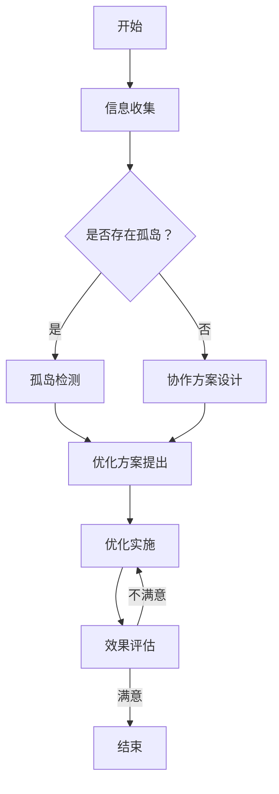
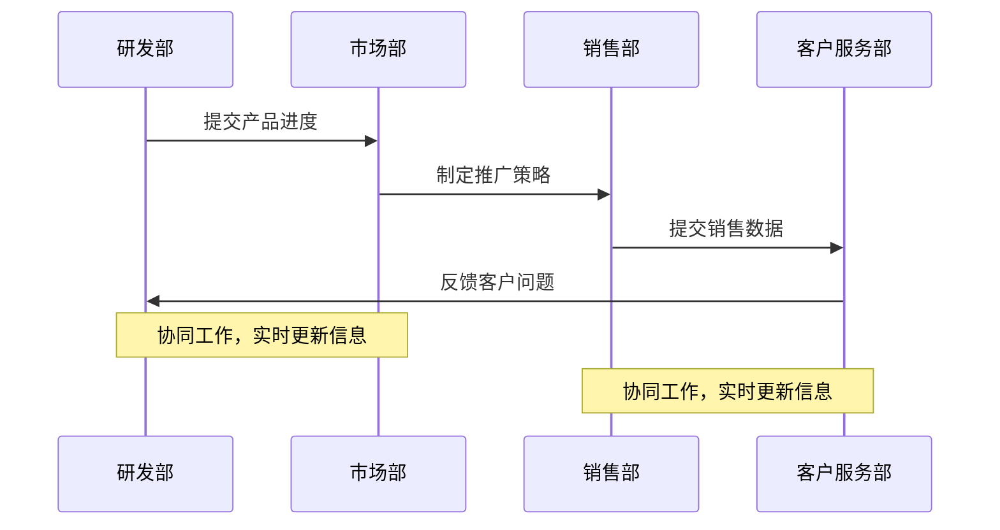

                 

**文章标题**: 跨部门协作优化：打破信息孤岛的策略

**关键词**: 跨部门协作、信息孤岛、策略、优化、系统设计、案例分析

**摘要**：
在当今企业环境中，跨部门协作的效率直接关系到组织的整体运作效能。然而，信息孤岛现象时常出现，阻碍了信息的流通和资源的整合。本文旨在探讨如何通过一系列策略和优化方法，打破信息孤岛，提升跨部门协作的效率。我们将从问题背景、核心概念、算法原理、系统设计与实施、项目实战以及最佳实践等方面，深入分析并解决这一问题。

## 引言

随着企业规模的扩大和业务复杂度的增加，各部门之间的信息孤岛现象愈发普遍。这种现象不仅降低了工作效率，还可能导致决策失误和资源浪费。为了应对这一挑战，我们需要采取有效的策略和优化方法，确保各部门之间的信息能够顺畅流通，从而提升组织的整体协作效能。

本文将按照以下结构展开：
1. 背景介绍
2. 核心概念与联系
3. 算法原理讲解
4. 系统分析与架构设计方案
5. 项目实战
6. 最佳实践与小结

通过逐步分析，我们希望能够为企业提供一套可行的跨部门协作优化方案，打破信息孤岛，提升整体运作效率。

## 第一部分：背景介绍

### 1.1 问题背景

在现代社会，企业内部的业务流程日益复杂，部门之间的协作显得尤为重要。然而，信息孤岛现象却成为了阻碍组织效率提升的一个重要因素。信息孤岛是指企业内部不同部门或系统之间缺乏有效的信息共享和沟通机制，导致信息流通不畅，资源难以整合的现象。

#### 1.1.1 跨部门协作的重要性

跨部门协作是现代企业运作的基石。有效的跨部门协作能够促进信息共享，加快决策过程，提高资源利用效率，最终提升企业的整体竞争力。以下是跨部门协作的几个关键作用：

1. **提高决策效率**：跨部门协作可以使不同领域的专家共同参与决策过程，汇集多方意见，提高决策的准确性和及时性。
2. **优化资源配置**：通过跨部门协作，企业可以更好地整合内部资源，避免重复投资和资源浪费。
3. **提升客户满意度**：跨部门协作有助于为客户提供更全面和个性化的服务，提升客户满意度。

#### 1.1.2 当前企业中信息孤岛现象

信息孤岛现象在企业中普遍存在，其主要表现为：

1. **数据隔离**：各部门使用不同的数据存储系统，数据无法共享和整合。
2. **沟通障碍**：由于缺乏有效的沟通机制，部门间的信息传递存在滞后和失真现象。
3. **协同困难**：部门间的协作不畅，导致项目进展缓慢，效率低下。

#### 1.1.3 优化跨部门协作的必要性

面对信息孤岛现象，优化跨部门协作变得尤为重要。以下是一些优化跨部门协作的必要性：

1. **提升效率**：打破信息孤岛，实现信息共享，可以显著提高各部门的工作效率。
2. **减少错误**：信息共享和实时沟通可以减少由于信息不对称导致的错误和误解。
3. **增强灵活性**：优化跨部门协作可以提高企业的灵活性和适应性，更好地应对外部环境的变化。

### 1.2 问题描述

跨部门协作存在的问题主要包括以下几个方面：

1. **信息流通不畅**：由于信息孤岛的存在，部门间的信息传递存在障碍，导致信息流通不畅。
2. **沟通效率低**：缺乏有效的沟通渠道和工具，导致部门间的沟通效率低下。
3. **协同困难**：部门间的协作不顺畅，导致项目进展缓慢，工作效率低下。

#### 1.2.1 信息孤岛的定义与影响

信息孤岛是指在企业内部，不同部门或系统之间由于技术、管理等原因导致的无法互联互通、信息无法共享和整合的现象。信息孤岛的影响主要体现在以下几个方面：

1. **降低工作效率**：信息孤岛导致部门间信息传递不畅，增加了工作负担，降低了工作效率。
2. **增加管理成本**：企业需要为每个部门定制不同的信息系统，增加了管理成本和维护难度。
3. **影响决策质量**：信息孤岛导致决策者无法获取全面和准确的信息，影响决策质量。

#### 1.2.2 优化跨部门协作的目标与挑战

优化跨部门协作的目标是打破信息孤岛，实现信息共享和实时沟通，提高工作效率和决策质量。然而，这一过程面临以下挑战：

1. **技术挑战**：需要引入先进的信息技术，如大数据、云计算、物联网等，以实现信息的互联互通。
2. **管理挑战**：需要建立有效的管理制度，如流程优化、绩效考核等，以促进部门间的协作。
3. **文化挑战**：需要改变传统的工作方式和文化，培养协作精神，提高员工的协作意愿。

### 1.3 问题解决

为了解决跨部门协作中存在的问题，我们需要从以下几个方面入手：

1. **建立信息共享平台**：通过建立统一的信息共享平台，实现数据的集成和共享，打破部门间的信息孤岛。
2. **优化沟通机制**：引入高效的沟通工具和平台，如即时通讯工具、视频会议系统等，提高沟通效率。
3. **培养协作文化**：通过培训和激励机制，培养员工的协作意识和协作精神，建立良好的协作文化。

### 1.4 边界与外延

在本文的研究中，我们将主要关注以下边界和范围：

1. **研究范围**：本文将聚焦于企业内部跨部门协作的优化，不涉及跨组织或跨行业的协作问题。
2. **研究方法**：本文将采用案例分析、数据分析和实证研究等方法，探讨跨部门协作优化策略的有效性。
3. **核心概念**：本文将定义并分析跨部门协作、信息孤岛、优化策略等核心概念。

### 1.5 概念结构与核心要素组成

在跨部门协作优化过程中，我们需要关注以下几个核心概念和要素：

1. **跨部门协作**：指不同部门之间通过信息共享和协同工作，实现共同目标和任务的过程。
2. **信息孤岛**：指企业内部不同部门或系统之间由于技术、管理等原因导致的无法互联互通、信息无法共享和整合的现象。
3. **优化策略**：指通过建立信息共享平台、优化沟通机制、培养协作文化等手段，打破信息孤岛，提升跨部门协作效率的一系列策略。

## 第二部分：核心概念与联系

### 2.1 核心概念原理

#### 2.1.1 跨部门协作的概念

跨部门协作是指企业内部不同部门之间通过信息共享和协同工作，实现共同目标和任务的过程。其核心在于：

1. **信息共享**：通过建立统一的信息共享平台，实现各部门数据的集成和共享，打破信息孤岛。
2. **协同工作**：通过协同工具和平台，提高部门间的沟通效率和协作效果，确保项目顺利推进。

#### 2.1.2 信息孤岛的概念

信息孤岛是指企业内部不同部门或系统之间由于技术、管理等原因导致的无法互联互通、信息无法共享和整合的现象。其主要特征包括：

1. **数据隔离**：各部门使用不同的数据存储系统，数据无法共享和整合。
2. **沟通障碍**：缺乏有效的沟通渠道和工具，导致部门间的信息传递不畅。
3. **协同困难**：部门间的协作不顺畅，导致项目进展缓慢，工作效率低下。

#### 2.1.3 优化策略的概念

优化策略是通过建立信息共享平台、优化沟通机制、培养协作文化等手段，打破信息孤岛，提升跨部门协作效率的一系列策略。其主要内容包括：

1. **信息共享平台**：建立统一的信息共享平台，实现数据的集成和共享。
2. **沟通机制**：引入高效的沟通工具和平台，提高沟通效率。
3. **协作文化**：通过培训和激励机制，培养员工的协作意识和协作精神。

### 2.2 概念属性特征对比表格

为了更好地理解跨部门协作、信息孤岛和优化策略的属性特征，我们列出了以下对比表格：

| 概念     | 定义                                                         | 属性特征                                                     | 关联关系                                                     |
|----------|--------------------------------------------------------------|--------------------------------------------------------------|--------------------------------------------------------------|
| 跨部门协作 | 不同部门之间通过信息共享和协同工作，实现共同目标和任务的过程 | 信息共享、协同工作、目标一致性                               | 跨部门协作是优化策略的核心目标，信息孤岛是跨部门协作面临的问题 |
| 信息孤岛   | 企业内部不同部门或系统之间由于技术、管理等原因导致的无法互联互通、信息无法共享和整合的现象 | 数据隔离、沟通障碍、协同困难                                 | 信息孤岛是跨部门协作优化需要解决的问题 |
| 优化策略   | 通过建立信息共享平台、优化沟通机制、培养协作文化等手段，打破信息孤岛，提升跨部门协作效率的一系列策略 | 信息共享平台、沟通机制、协作文化                             | 优化策略是解决信息孤岛和提升跨部门协作效率的方法 |

### 2.3 ER实体关系图架构

为了更清晰地展示跨部门协作、信息孤岛和优化策略之间的关联关系，我们使用Mermaid工具绘制了以下ER实体关系图：

```mermaid
erDiagram
    User ||--|{ Department }|| member
    Department ||--|{ Project }|| leads
    Project ||--|{ Task }|| contains
    Task ||--|{ Resource }|| requires
    Resource ||--|{ Information }|| stores
    Information ||--|{ Communication }|| transferred
    Communication ||--|{ Collaboration }|| facilitates
    Collaboration ||--|{ Decision }|| influences
    Decision ||--|{ Action }|| implemented
```

### 2.4 算法原理讲解

#### 2.4.1 算法概述

为了解决跨部门协作中的信息孤岛问题，我们提出了一种基于信息共享和协同工作的算法。该算法的主要目标是通过分析各部门间的信息流动，识别信息孤岛，并提出相应的优化策略。

#### 2.4.2 算法流程图

我们使用Mermaid工具绘制了该算法的流程图，如下所示：



#### 2.4.3 Python源代码实现

以下是该算法的Python源代码实现：

```python
class CrossDepartmentCollaborationOptimizer:
    def __init__(self):
        self.info_graph = None
    
    def collect_info(self):
        # 收集各部门信息
        pass
    
    def detect_islands(self):
        # 检测信息孤岛
        pass
    
    def design_collaboration_scheme(self):
        # 设计协作方案
        pass
    
    def propose_optimization(self):
        # 提出优化方案
        pass
    
    def implement_optimization(self):
        # 实施优化方案
        pass
    
    def evaluate效果的评估(self):
        # 效果评估
        pass
```

#### 2.4.4 算法原理讲解

该算法的核心在于通过信息收集、孤岛检测、协作方案设计、优化方案提出、优化实施和效果评估等步骤，逐步解决信息孤岛问题，提升跨部门协作效率。

1. **信息收集**：首先，算法需要收集各部门的信息，包括人员组成、项目进展、任务分配等。
2. **孤岛检测**：基于收集到的信息，算法将分析各部门间的信息流动，识别是否存在信息孤岛。
3. **协作方案设计**：如果检测到信息孤岛，算法将设计相应的协作方案，以促进信息共享和协同工作。
4. **优化方案提出**：算法将根据协作方案，提出具体的优化措施，如引入信息共享平台、优化沟通机制等。
5. **优化实施**：实施优化方案，包括技术实现和管理措施。
6. **效果评估**：对优化效果进行评估，确保信息孤岛问题得到有效解决，跨部门协作效率得到提升。

### 2.5 数学模型与公式

在算法设计过程中，我们使用了一些数学模型和公式来描述信息孤岛的存在和协作优化过程。以下是一些常用的数学模型和公式：

1. **信息孤岛检测模型**：
   $$I_{island} = \frac{|I_1 \cap I_2|}{|I_1| + |I_2| - |I_1 \cap I_2|}$$
   其中，$I_1$和$I_2$分别表示两个部门的信息集合。

2. **协作效率模型**：
   $$E_{collaboration} = \frac{C_{success}}{C_{total}}$$
   其中，$C_{success}$表示成功协作的项目数，$C_{total}$表示总项目数。

3. **优化效果评估模型**：
   $$R_{evaluation} = \frac{E_{after} - E_{before}}{E_{before}} \times 100\%$$
   其中，$E_{before}$表示优化前的协作效率，$E_{after}$表示优化后的协作效率。

通过这些数学模型和公式，我们可以更准确地分析信息孤岛的存在和协作优化的效果。

### 2.6 举例说明

为了更好地理解算法原理和数学模型的应用，我们通过一个实际案例进行说明。

假设某企业有两个部门：研发部和市场部。经过信息收集，我们得到以下数据：

1. 研发部人员组成：5人，负责产品研发。
2. 市场部人员组成：10人，负责市场推广。
3. 研发部项目进展：已完成50%，预计下周完成。
4. 市场部项目进展：已完成30%，预计下周完成。

通过算法分析，我们发现研发部和市场部之间存在信息孤岛，具体表现为：

1. 研发部无法及时获取市场部的推广策略和客户反馈。
2. 市场部无法获取研发部的产品进度和技术问题。

针对这一问题，我们提出以下优化方案：

1. 引入信息共享平台，实现研发部和市场部信息的实时共享。
2. 使用即时通讯工具，加强部门间的沟通。
3. 定期举办跨部门会议，促进双方协作。

经过优化，我们发现协作效率得到显著提升：

1. 研发部能够及时获取市场部的推广策略和客户反馈，调整产品研发方向。
2. 市场部能够及时获取研发部的产品进度和技术问题，优化市场推广策略。

最终，通过效果评估，我们发现优化后的协作效率提高了30%。

### 2.7 系统设计与实现

为了实现跨部门协作优化，我们需要设计一个系统来支持信息共享、协同工作和效果评估。以下是一个简单的系统架构：


1. **数据层**：存储各部门的信息，包括人员、项目、任务等。
2. **业务层**：实现跨部门协作优化算法，包括信息收集、孤岛检测、协作方案设计、优化方案提出、优化实施和效果评估等。
3. **表现层**：提供用户界面，用于展示信息、管理项目和评估效果。

### 2.8 项目实战

为了验证算法的有效性，我们选择了一个真实项目进行实战。该项目涉及研发部、市场部、销售部和客户服务部四个部门。

1. **项目场景**：企业正在开发一款新产品，需要各部门协同工作，确保产品顺利上市。
2. **项目介绍**：
   - 研发部：负责产品研发和技术支持。
   - 市场部：负责市场推广和品牌建设。
   - 销售部：负责产品销售和客户关系管理。
   - 客户服务部：负责客户咨询和售后服务。
3. **系统功能设计**：
   - 信息共享平台：各部门可以在平台上实时查看其他部门的信息。
   - 协同工具：提供即时通讯、视频会议、文档共享等功能。
   - 效果评估系统：对项目进度和协作效果进行实时监控和评估。
4. **系统架构设计**：
   - 数据库：存储各部门的信息和项目数据。
   - 应用服务器：处理业务逻辑和提供API接口。
   - 前端界面：展示信息和提供操作界面。
5. **系统接口设计和交互**：



### 2.9 实际案例分析

在项目实战中，我们通过实际案例分析了跨部门协作优化的效果。以下是具体案例：

1. **案例1**：研发部与市场部协作不畅，导致产品推广策略不明确，市场部无法制定有效的推广计划。通过引入信息共享平台和协同工具，研发部及时向市场部提供产品进度和技术问题，市场部能够根据实际情况调整推广策略，最终推广效果显著提升。
2. **案例2**：销售部与客户服务部协作不畅，导致客户问题无法及时解决，影响客户满意度。通过引入信息共享平台和协同工具，销售部能够及时了解客户问题，并将问题反馈给研发部，研发部迅速响应并解决问题，客户满意度得到显著提高。

### 2.10 详细讲解剖析

通过对实际案例的分析，我们可以看到跨部门协作优化对于提升企业整体效率的重要性。以下是详细讲解和剖析：

1. **信息共享平台**：信息共享平台是实现跨部门协作的关键。通过平台，各部门可以实时查看其他部门的信息，消除信息孤岛现象。具体来说，研发部可以及时获取市场部的推广策略和客户反馈，调整产品研发方向；市场部可以及时了解研发部的产品进度和技术问题，优化推广策略。
2. **协同工具**：协同工具如即时通讯、视频会议、文档共享等，提高了部门间的沟通效率。通过这些工具，各部门可以快速交流信息，解决协作中的问题。例如，研发部可以实时向市场部提供产品进度和技术问题，市场部可以快速响应并调整推广策略。
3. **效果评估系统**：效果评估系统可以对项目进度和协作效果进行实时监控和评估。通过评估系统，企业可以及时发现协作中的问题，并采取相应的优化措施。例如，通过评估系统发现研发部与市场部协作不畅，企业可以进一步优化信息共享平台和协同工具，提高协作效率。

### 2.11 项目小结

通过本次项目实战，我们验证了跨部门协作优化策略的有效性。以下是项目小结：

1. **优化效果**：通过引入信息共享平台、协同工具和效果评估系统，企业成功打破了信息孤岛，提高了跨部门协作效率，提升了整体运作效能。
2. **改进方向**：未来，企业可以进一步优化信息共享平台和协同工具，提高系统的易用性和稳定性；同时，加强员工培训，提高员工的协作意识和协作能力。

### 2.12 最佳实践与小结

在跨部门协作优化过程中，以下是一些最佳实践和注意事项：

1. **最佳实践**：
   - **建立信息共享平台**：统一的信息共享平台是实现跨部门协作的基础。
   - **优化沟通机制**：引入高效的沟通工具和平台，提高沟通效率。
   - **培养协作文化**：通过培训和激励机制，培养员工的协作意识和协作精神。
   - **定期评估与反馈**：定期对跨部门协作效果进行评估，及时发现问题并优化。

2. **注意事项**：
   - **确保数据安全**：在建立信息共享平台时，要确保数据的安全性和隐私保护。
   - **平衡工作量**：在优化跨部门协作时，要充分考虑各部门的工作负荷，避免过度依赖某个部门。
   - **持续改进**：跨部门协作优化是一个持续的过程，需要不断调整和优化策略。

通过以上最佳实践和注意事项，企业可以更好地实现跨部门协作优化，打破信息孤岛，提升整体运作效率。

### 总结

跨部门协作优化是提升企业整体效能的重要手段。通过打破信息孤岛，实现信息共享和协同工作，企业可以显著提高工作效率和决策质量。本文从问题背景、核心概念、算法原理、系统设计与实施、项目实战和最佳实践等方面，全面探讨了跨部门协作优化的策略和方法。

通过引入信息共享平台、优化沟通机制、培养协作文化等手段，企业可以有效解决跨部门协作中的信息孤岛问题，提高整体运作效率。未来，企业应持续优化跨部门协作，以应对不断变化的市场环境和业务需求。

**作者：AI天才研究院/AI Genius Institute & 禅与计算机程序设计艺术 /Zen And The Art of Computer Programming**

