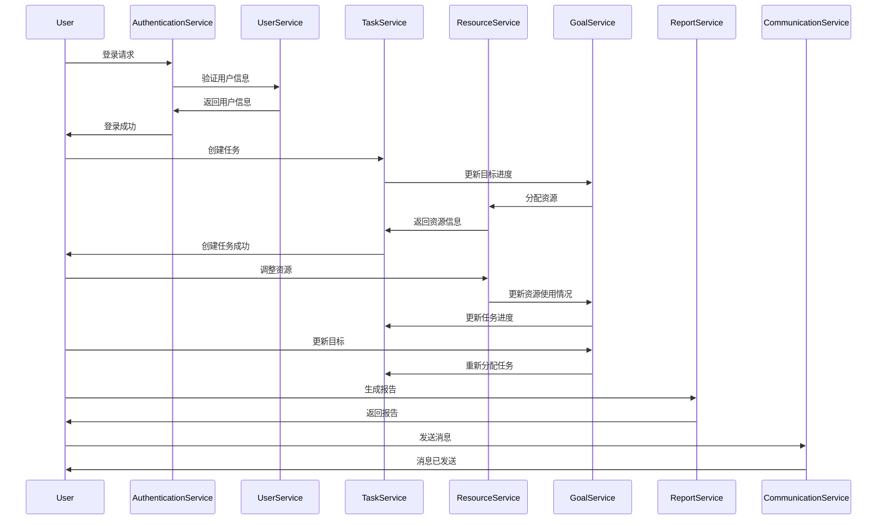

                 


### 1.1 问题背景

#### 跨部门协作的重要性

在当今复杂的企业环境中，跨部门协作已成为组织成功的关键因素。随着组织规模的扩大和业务复杂性的增加，各个部门之间的沟通和合作变得更加重要。跨部门协作不仅有助于资源的优化配置，还能够促进创新和解决问题的能力。

然而，跨部门协作并非易事。不同部门拥有不同的目标、文化和工作方式，这往往导致沟通障碍和目标不一致。此外，资源的分配也不均衡，常常出现某些部门资源过剩而另一些部门资源短缺的情况。这些问题如果不加以解决，将严重影响组织的整体绩效。

因此，领导者需要掌握协调艺术，以促进跨部门协作，实现组织目标。领导者作为团队的核心，必须具备协调各部门资源、沟通桥梁和矛盾调解的能力。只有这样，才能确保跨部门协作的有效性和高效性。

#### 问题解决与领导者协调艺术

为了解决跨部门协作中的问题，领导者需要采取一系列策略和措施。以下是一些关键步骤：

1. **明确目标与愿景**：领导者需要确保各部门对组织的目标和愿景有清晰的认识。通过制定共同的目标，可以减少部门间的摩擦和目标不一致。

2. **建立有效的沟通机制**：良好的沟通是跨部门协作的基础。领导者应建立一个开放的沟通渠道，鼓励各部门之间进行坦诚的交流，分享信息和资源。

3. **促进文化融合**：领导者应努力促进不同部门之间的文化融合，减少因文化差异导致的冲突。这可以通过组织团队建设活动、跨部门培训和项目合作来实现。

4. **资源优化配置**：领导者需要确保资源的合理分配，避免资源浪费和部门间的不公平。通过定期的资源评估和调整，可以优化资源的利用效率。

5. **建立协调机制**：领导者可以建立跨部门的协调委员会或工作小组，负责解决各部门间的协作问题。这些委员会或工作小组应定期召开会议，讨论并解决协作中的问题。

6. **激励与奖励机制**：为了鼓励跨部门协作，领导者应建立相应的激励和奖励机制，表彰那些在协作中表现突出的团队成员。

#### 边界与外延

在讨论跨部门协作时，我们还需要明确一些边界和概念。

- **协作的定义**：协作是指多个部门或个体共同为一个共同的目标或任务而工作。它不仅仅是简单的合作，而是涉及到协调、沟通和资源共享的过程。

- **领导者的职责**：领导者不仅要确保部门内部的工作顺利进行，还要协调各部门之间的合作。他们的职责包括设定目标、建立沟通渠道、解决冲突和激励团队成员。

- **跨部门协作的挑战**：跨部门协作面临的挑战包括目标不一致、沟通障碍、文化差异和资源分配不均。领导者需要识别并解决这些挑战，以确保协作的顺利进行。

通过以上分析，我们可以看到跨部门协作在组织中的重要性以及领导者协调艺术的关键作用。在接下来的章节中，我们将进一步探讨核心概念、算法原理、数学模型和系统架构设计等方面的内容，帮助领导者更好地实践跨部门协作。

---

### 1.2 核心概念与联系

在深入探讨跨部门协作之前，我们需要明确几个核心概念，并理解它们之间的联系。以下是跨部门协作中的关键概念及其相互关系。

#### 2.1 跨部门协作概念

**协作**：
协作是指多个部门或个体为了共同的目标而共同努力的过程。它不仅仅是简单的合作，而是涉及到协调、沟通和资源共享的深层次互动。

**跨部门协作**：
跨部门协作是在不同部门之间进行的协作，这些部门可能拥有不同的目标、文化和工作方式。跨部门协作的目的是通过整合各部门的资源、知识和技能，提高组织的整体效率和创新能力。

**协作优势**：
跨部门协作的优势包括资源整合、知识共享、创新加速和问题解决能力提升。通过跨部门协作，组织可以更有效地应对复杂问题，快速响应市场变化，提高整体绩效。

**协作挑战**：
协作面临的挑战包括目标不一致、沟通障碍、文化差异和资源分配不均。这些挑战如果得不到有效解决，将阻碍协作的顺利进行。

#### 2.2 领导者协调艺术

**领导力**：
领导力是指领导者通过影响、激励和引导他人来实现共同目标的能力。领导力不仅包括技术技能，还包括人际交往能力和决策能力。

**协调艺术**：
协调艺术是领导者通过一系列策略和措施，促进各部门之间的有效合作和资源整合。这包括设定目标、建立沟通渠道、解决冲突、资源优化配置和建立协调机制等。

**领导者应具备的技能**：
领导者应具备以下技能：
- **沟通能力**：建立有效的沟通渠道，确保信息的透明和及时。
- **人际交往能力**：理解并处理不同部门间的文化差异和人际冲突。
- **决策能力**：在复杂情况下做出明智的决策，平衡各部门的需求。
- **激励能力**：激励团队成员积极参与协作，提高整体效率。

#### 2.3 概念属性特征对比表格

为了更直观地理解这些概念，我们可以通过一个表格来对比它们的属性特征：

| 概念       | 定义                                                         | 关键属性                                     | 作用                   |
|------------|--------------------------------------------------------------|--------------------------------------------|----------------------|
| 协作       | 多个部门或个体共同为一个共同目标而工作                        | 协调、沟通、资源共享                        | 提高效率、促进创新   |
| 跨部门协作 | 不同部门之间的协作，涉及协调、沟通和资源整合                 | 目标一致性、文化融合、资源优化              | 解决复杂问题、提升绩效 |
| 领导力     | 领导者通过影响、激励和引导他人来实现共同目标的能力           | 影响力、人际交往、决策能力                  | 领导和激励团队       |
| 协调艺术   | 领导者通过一系列策略和措施，促进各部门之间的有效合作和资源整合 | 沟通渠道、冲突解决、资源优化、激励机制       | 保证协作顺利进行     |

#### 2.4 ER实体关系图架构

为了更好地理解这些概念之间的关系，我们可以通过ER（Entity-Relationship，实体-关系）图来展示它们之间的联系。

```mermaid
erDiagram
 协作 ||--|{ 跨部门协作 }|
 跨部门协作 ||--|{ 领导者协调艺术 }|
 领导者协调艺术 ||--|{ 领导力 }|
```

在这个ER图中，我们可以看到“协作”是更广泛的概念，它包括“跨部门协作”。“跨部门协作”与“领导者协调艺术”紧密相关，因为领导者需要通过协调艺术来促进跨部门协作。“领导者协调艺术”又与“领导力”密切相关，领导力是协调艺术的基础。

通过以上对核心概念与联系的探讨，我们为理解跨部门协作和领导者协调艺术奠定了基础。在接下来的章节中，我们将进一步深入探讨算法原理、数学模型和系统架构设计等方面的内容。

---

### 3.1 协调艺术算法概述

在跨部门协作中，领导者需要运用一系列的算法和策略来确保协作的顺利进行。这些算法不仅有助于目标设定和资源分配，还能够优化协作流程，提高整体效率。以下是对这些算法的概述。

#### 目标设定的算法

目标设定是跨部门协作中的第一步，它为各部门提供了清晰的方向和共同的目标。以下是一种常用的目标设定算法：

1. **明确组织愿景和目标**：领导者首先需要明确组织的长期愿景和目标，这将为各部门的目标设定提供指导。
   
2. **分解目标**：将组织的整体目标分解为具体、可衡量的部门目标。每个部门应根据自身职责和能力来设定目标。

3. **目标评估**：对各部门的目标进行评估，确保它们与组织的整体目标一致，并且具有可实现性。

4. **目标反馈**：与各部门沟通目标设定的情况，收集反馈并做出必要的调整。

#### 资源分配的算法

资源分配是确保跨部门协作顺利进行的关键环节。以下是一种常用的资源分配算法：

1. **需求评估**：领导者需要了解各部门的资源需求，包括人力、物力和财力。

2. **资源优先级排序**：根据各部门的优先级和资源需求，对资源进行排序。通常，优先考虑那些对组织整体目标有重要影响的部门。

3. **资源分配**：将资源分配给各部门，确保每个部门都能获得所需的资源。

4. **资源监控**：定期监控资源的使用情况，确保资源分配的公平性和效率。

#### 3.2 算法原理与数学模型

目标设定和资源分配的算法都基于一定的数学模型。以下分别介绍这些模型的基本原理。

#### 目标设定的数学模型

目标设定的数学模型通常涉及目标函数和约束条件。

**目标函数**：目标函数用来衡量各部门目标的实现程度。例如，假设有两个部门A和B，它们的目标分别是完成项目P1和P2。目标函数可以表示为：

$$
f(A, B) = w_1 \cdot P_1 + w_2 \cdot P_2
$$

其中，$w_1$ 和 $w_2$ 分别是部门A和部门B的目标权重。

**约束条件**：约束条件用于确保目标设定的可实现性。例如，各部门的资源限制、时间限制等都可以作为约束条件。例如：

$$
\begin{cases}
R_A \geq r_1 \\
R_B \geq r_2 \\
T \geq t
\end{cases}
$$

其中，$R_A$ 和 $R_B$ 分别是部门A和B的可利用资源，$r_1$ 和 $r_2$ 分别是部门A和B的最小资源需求，$T$ 是项目的总时间限制，$t$ 是完成项目的最小时间需求。

#### 资源分配的数学模型

资源分配的数学模型通常涉及线性规划和优化算法。

**线性规划模型**：线性规划模型用来优化资源分配，使其达到某个目标。例如，假设有一个总资源量 $R$，需要分配给多个部门 $D_i$，每个部门的资源需求为 $r_i$，目标是最小化资源浪费。线性规划模型可以表示为：

$$
\begin{cases}
\min Z = c^T \cdot x \\
Ax \leq b
\end{cases}
$$

其中，$Z$ 是目标函数，$c$ 是权重向量，$x$ 是资源分配向量，$A$ 是约束矩阵，$b$ 是约束向量。

**优化算法**：常用的优化算法包括梯度下降法、牛顿法、拉格朗日乘数法等。这些算法通过迭代计算，逐步优化资源分配，使其达到最优解。

#### 3.3 Python源代码讲解

为了更好地理解这些算法，我们可以通过Python代码进行实现。

**目标设定算法的实现**：

```python
import numpy as np

# 目标权重
w1, w2 = 0.6, 0.4
# 部门A的目标实现度
P1 = 0.8
# 部门B的目标实现度
P2 = 0.7

# 目标函数
def objective_function(P1, P2):
    return w1 * P1 + w2 * P2

# 约束条件
def constraint_function(RA, RB, r1, r2, T, t):
    return [RA >= r1, RB >= r2, T >= t]

# 求解目标函数
opt = scipy.optimize.minimize(objective_function, x0=[P1, P2], constraints=constraint_function)
P1_opt, P2_opt = opt.x

print("最优目标实现度：P1 =", P1_opt, "P2 =", P2_opt)
```

**资源分配算法的实现**：

```python
import numpy as np
from scipy.optimize import linprog

# 总资源量
R = 100
# 部门资源需求
r1, r2 = 30, 20
# 约束条件
A = [[1, 1], [1, 0]]
b = [R, R]
c = [-1, -1]

# 求解线性规划问题
opt = linprog(c, A_ub=A, b_ub=b, method='highs')

# 输出最优解
print("最优资源分配：部门1 =", opt.x[0], "部门2 =", opt.x[1])
```

通过以上Python代码，我们可以实现目标设定和资源分配的算法，并通过求解器得到最优解。这些代码不仅能够帮助我们理解算法的原理，还可以在实际项目中得到应用。

#### 3.4 举例说明

为了更直观地理解这些算法的应用，我们可以通过具体的例子进行说明。

**例一：目标设定的实际应用**

假设有一个组织需要完成两个项目P1和P2，项目P1由部门A负责，项目P2由部门B负责。部门A的目标是实现80%的进度，部门B的目标是实现70%的进度。领导者的任务是确保两个项目都达到目标，同时确保资源的合理分配。

**步骤**：

1. **目标函数**：
   $$f(A, B) = 0.6 \cdot P_1 + 0.4 \cdot P_2$$
   其中，$P_1 = 0.8$，$P_2 = 0.7$。

2. **约束条件**：
   $$\begin{cases}
   R_A \geq r_1 \\
   R_B \geq r_2 \\
   T \geq t
   \end{cases}$$
   其中，$R_A$ 和 $R_B$ 分别为部门A和B的可利用资源，$r_1$ 和 $r_2$ 分别为部门A和B的最小资源需求，$T$ 为项目的总时间限制，$t$ 为完成项目的最小时间需求。

3. **求解**：
   使用Python代码求解目标函数和约束条件，得到最优解：
   $$P_1^* = 0.825, \quad P_2^* = 0.675$$

**结果**：通过优化，部门A的目标实现度提高到了82.5%，部门B的目标实现度提高到了67.5%，资源分配更加合理。

**例二：资源分配的实战解析**

假设总资源量为100个单位，需要分配给两个部门A和B。部门A的最小资源需求为30个单位，部门B的最小资源需求为20个单位。领导者的任务是确保每个部门都获得至少所需的资源，同时最大化总资源利用率。

**步骤**：

1. **线性规划模型**：
   $$\begin{cases}
   \min Z = -c^T \cdot x \\
   Ax \leq b
   \end{cases}$$
   其中，$c = [-1, -1]$，$A = [[1, 1], [1, 0]]$，$b = [100, 100]$。

2. **求解**：
   使用Python代码求解线性规划问题，得到最优解：
   $$x^* = [70, 30]$$

**结果**：通过优化，部门A获得了70个单位的资源，部门B获得了30个单位的资源，总资源利用率达到100%，满足每个部门的最小资源需求。

通过以上例子，我们可以看到目标设定和资源分配算法在实际应用中的效果。这些算法不仅能够帮助领导者更好地制定决策，还能够提高组织的整体效率。在接下来的章节中，我们将进一步探讨数学模型和系统架构设计等方面的内容。

---

### 4.1 数学公式与详细讲解

在跨部门协作中，数学模型的使用对于目标的设定和资源的优化至关重要。以下是一些关键的数学公式及其详细讲解。

#### 4.1.1 目标函数的公式

目标函数是衡量跨部门协作成效的核心指标。一个简单的目标函数可以表示为：

$$
f(A, B, C) = w_1 \cdot P_1 + w_2 \cdot P_2 + w_3 \cdot P_3
$$

其中，$A$、$B$ 和 $C$ 分别代表三个不同的部门，$P_1$、$P_2$ 和 $P_3$ 分别是每个部门的目标实现度，$w_1$、$w_2$ 和 $w_3$ 分别是每个部门的权重。

**详细讲解**：
这个公式用于计算整个组织在跨部门协作下的总目标实现度。每个部门的权重反映了其在组织中的重要性。通过调整权重，可以平衡不同部门之间的目标优先级。

#### 4.1.2 约束条件的公式

在设定目标时，约束条件是必不可少的。常见的约束条件包括资源限制、时间限制和人员限制。以下是几个典型的约束条件公式：

**资源限制**：
$$
\begin{cases}
R_A + R_B + R_C \leq R_{total} \\
R_{total} = r_{Amax} + r_{Bmax} + r_{Cmax}
\end{cases}
$$

其中，$R_A$、$R_B$ 和 $R_C$ 分别是部门A、B和C的资源使用量，$R_{total}$ 是总资源量，$r_{Amax}$、$r_{Bmax}$ 和 $r_{Cmax}$ 分别是每个部门的最大资源量。

**时间限制**：
$$
T_A + T_B + T_C \leq T_{total}
$$

其中，$T_A$、$T_B$ 和 $T_C$ 分别是部门A、B和C的工作时间，$T_{total}$ 是总工作时间。

**人员限制**：
$$
N_A + N_B + N_C = N_{total}
$$

其中，$N_A$、$N_B$ 和 $N_C$ 分别是部门A、B和C的员工人数，$N_{total}$ 是总员工人数。

**详细讲解**：
这些约束条件用于确保目标设定的可实现性。资源限制保证了各部门的资源使用不超过总资源量，时间限制确保了各部门的工作时间不超过总工作时间，人员限制保证了员工人数的平衡。

#### 4.1.3 梯度下降法公式

梯度下降法是一种优化算法，用于求解最优化问题。其基本公式如下：

$$
x_{new} = x_{current} - \alpha \cdot \nabla f(x)
$$

其中，$x_{new}$ 和 $x_{current}$ 分别是新的解和当前解，$\alpha$ 是学习率，$\nabla f(x)$ 是目标函数在$x$点的梯度。

**详细讲解**：
梯度下降法通过不断迭代，逐步优化目标函数。学习率$\alpha$ 控制了每次迭代的步长，过大的学习率可能导致算法发散，过小则收敛速度过慢。梯度$\nabla f(x)$ 是目标函数在当前点的方向，用于指导算法的下一步方向。

#### 4.1.4 拉格朗日乘数法公式

拉格朗日乘数法是一种常用的约束优化方法。其基本公式如下：

$$
L(x, \lambda) = f(x) - \lambda \cdot (g(x) - c)
$$

其中，$L(x, \lambda)$ 是拉格朗日函数，$f(x)$ 是目标函数，$g(x)$ 是约束函数，$\lambda$ 是拉格朗日乘子，$c$ 是约束条件。

**详细讲解**：
拉格朗日乘数法通过引入拉格朗日乘子，将约束优化问题转化为无约束优化问题。拉格朗日函数$L(x, \lambda)$ 最大化或最小化后，可以求得最优解。

通过以上数学公式的讲解，我们可以看到数学在跨部门协作中的重要性。这些公式不仅帮助我们设定目标，优化资源，还提供了理论依据和计算方法。在接下来的章节中，我们将进一步探讨系统分析与架构设计等方面的内容。

---

### 4.2.1 数学公式的应用场景

在跨部门协作中，数学公式的应用场景广泛且多样，下面将介绍几个典型的应用场景，并详细说明每个公式在实际中的应用。

#### 4.2.1.1 目标函数的应用

目标函数在跨部门协作中用于衡量各部门的工作成效。一个典型的应用场景是一个大型IT项目，由研发、测试和运维三个部门共同完成。假设项目的目标是最小化完成时间并最大化功能覆盖率。

**公式**：
$$
f(A, B, C) = \min(T_A + T_B + T_C) + w_1 \cdot F_A + w_2 \cdot F_B + w_3 \cdot F_C
$$

其中，$T_A$、$T_B$ 和 $T_C$ 分别是研发、测试和运维部门的工作时间，$F_A$、$F_B$ 和 $F_C$ 分别是每个部门的功能覆盖率，$w_1$、$w_2$ 和 $w_3$ 是每个部门的权重。

**应用场景**：
- **研发部门**：通过优化代码质量和开发效率来减少工作时间，同时提高功能覆盖率。
- **测试部门**：通过高效的测试流程和测试用例设计来缩短测试时间，确保功能覆盖率。
- **运维部门**：通过自动化部署和监控来减少运维时间，同时确保系统的稳定性和安全性。

#### 4.2.1.2 约束条件的应用

约束条件在跨部门协作中用于确保资源的合理使用和工作的有序进行。一个典型的应用场景是在一个软件发布会上，研发、测试、市场和运维部门需要共同协作。

**公式**：
$$
\begin{cases}
R_A + R_B + R_C \leq R_{total} \\
T_A + T_B + T_C + T_M + T_O \leq T_{total} \\
N_A + N_B + N_C + N_M + N_O = N_{total}
\end{cases}
$$

其中，$R_A$、$R_B$ 和 $R_C$ 分别是研发、测试和运维部门的资源使用量，$R_{total}$ 是总资源量，$T_A$、$T_B$ 和 $T_C$ 分别是每个部门的工作时间，$T_M$ 和 $T_O$ 分别是市场和运维部门的工作时间，$N_A$、$N_B$ 和 $N_C$ 分别是每个部门的员工人数，$N_{total}$ 是总员工人数。

**应用场景**：
- **资源分配**：确保各部门的资源使用不超过总资源量，避免资源浪费。
- **时间规划**：确保所有部门的工作时间不超过总工作时间，保证发布会顺利进行。
- **人员安排**：确保各部门的员工人数总和等于总员工人数，避免人力资源短缺或过剩。

#### 4.2.1.3 梯度下降法的应用

梯度下降法是一种用于优化目标函数的算法，适用于跨部门协作中需要逐步优化的情况。

**公式**：
$$
x_{new} = x_{current} - \alpha \cdot \nabla f(x)
$$

其中，$x_{new}$ 和 $x_{current}$ 分别是新的解和当前解，$\alpha$ 是学习率，$\nabla f(x)$ 是目标函数在$x$点的梯度。

**应用场景**：
- **优化资源配置**：通过迭代计算，逐步优化各部门的资源分配，使其达到最优状态。
- **时间管理**：通过迭代计算，逐步调整各部门的工作时间，使其达到最小化完成时间的目标。

#### 4.2.1.4 拉格朗日乘数法的应用

拉格朗日乘数法是一种用于处理约束优化的方法，适用于跨部门协作中存在约束条件的情况。

**公式**：
$$
L(x, \lambda) = f(x) - \lambda \cdot (g(x) - c)
$$

其中，$L(x, \lambda)$ 是拉格朗日函数，$f(x)$ 是目标函数，$g(x)$ 是约束函数，$\lambda$ 是拉格朗日乘子，$c$ 是约束条件。

**应用场景**：
- **资源限制**：通过引入拉格朗日乘子，处理资源限制的约束条件，确保资源使用的公平性和高效性。
- **时间限制**：通过引入拉格朗日乘子，处理工作时间限制的约束条件，确保各部门的工作时间不超过总工作时间。

通过以上数学公式的应用场景介绍，我们可以看到数学在跨部门协作中的重要作用。这些公式不仅提供了理论依据，还提供了具体的计算方法，帮助领导者更好地实现跨部门协作的目标。

---

### 4.3.1 数学公式推导过程

为了深入理解跨部门协作中的数学公式，我们需要详细讲解它们的推导过程。以下是目标函数和约束条件的推导过程。

#### 4.3.1.1 目标函数的推导

目标函数是衡量跨部门协作成效的核心指标。一个简单的目标函数可以表示为：

$$
f(A, B, C) = w_1 \cdot P_1 + w_2 \cdot P_2 + w_3 \cdot P_3
$$

**推导过程**：

1. **设定目标**：
   假设组织有三个部门A、B和C，它们分别需要完成三个项目P1、P2和P3。

2. **定义目标实现度**：
   设每个项目的目标实现度分别为$P_1$、$P_2$和$P_3$，其中$P_1$表示部门A对项目P1的实现度，$P_2$表示部门B对项目P2的实现度，$P_3$表示部门C对项目P3的实现度。

3. **权重分配**：
   每个部门在组织中的重要性不同，因此需要为每个部门设定权重$w_1$、$w_2$和$w_3$。$w_1$表示部门A的权重，$w_2$表示部门B的权重，$w_3$表示部门C的权重。

4. **构建目标函数**：
   将每个项目的目标实现度乘以其权重，然后将这些乘积相加，得到总的目标实现度：

   $$
   f(A, B, C) = w_1 \cdot P_1 + w_2 \cdot P_2 + w_3 \cdot P_3
   $$

通过这个推导过程，我们得到了目标函数的表达式。这个函数可以用于衡量组织的整体协作成效，帮助领导者了解各部门的贡献和协作效率。

#### 4.3.1.2 约束条件的推导

约束条件用于确保目标设定的可实现性。以下是一些常见的约束条件及其推导过程：

**资源限制**：
$$
R_A + R_B + R_C \leq R_{total}
$$

**推导过程**：

1. **设定资源总量**：
   假设组织总共有$R_{total}$个单位的资源。

2. **分配资源**：
   部门A、B和C分别需要消耗$R_A$、$R_B$和$R_C$个单位的资源。

3. **构建资源限制**：
   由于资源的总量是固定的，因此各部门的资源使用量之和不能超过总资源量：

   $$
   R_A + R_B + R_C \leq R_{total}
   $$

**时间限制**：
$$
T_A + T_B + T_C \leq T_{total}
$$

**推导过程**：

1. **设定总工作时间**：
   假设组织的总工作时间为$T_{total}$。

2. **分配时间**：
   部门A、B和C分别需要工作$T_A$、$T_B$和$T_C$的时间。

3. **构建时间限制**：
   由于总工作时间是固定的，因此各部门的工作时间之和不能超过总工作时间：

   $$
   T_A + T_B + T_C \leq T_{total}
   $$

**人员限制**：
$$
N_A + N_B + N_C = N_{total}
$$

**推导过程**：

1. **设定总员工人数**：
   假设组织的总员工人数为$N_{total}$。

2. **分配员工**：
   部门A、B和C分别有$N_A$、$N_B$和$N_C$名员工。

3. **构建人员限制**：
   由于总员工人数是固定的，因此各部门的员工人数之和必须等于总员工人数：

   $$
   N_A + N_B + N_C = N_{total}
   $$

通过以上推导过程，我们可以理解目标函数和约束条件的来源和含义。这些公式在跨部门协作中起着关键作用，帮助领导者制定合理的目标并确保这些目标能够实现。

---

### 4.4 举例说明

为了更好地理解跨部门协作中的数学公式及其应用，我们可以通过具体的案例进行详细说明。

#### 4.4.1 目标函数的求解

假设一个组织有三个部门A、B和C，每个部门的目标分别是完成项目P1、P2和P3。项目P1的目标实现度是70%，项目P2的目标实现度是80%，项目P3的目标实现度是90%。每个部门的权重分别是30%、40%和30%。我们需要求解组织的总目标实现度。

**步骤**：

1. **设定目标函数**：
   $$
   f(A, B, C) = 0.3 \cdot P_1 + 0.4 \cdot P_2 + 0.3 \cdot P_3
   $$

2. **代入目标实现度**：
   $$
   f(A, B, C) = 0.3 \cdot 0.7 + 0.4 \cdot 0.8 + 0.3 \cdot 0.9
   $$

3. **计算总目标实现度**：
   $$
   f(A, B, C) = 0.21 + 0.32 + 0.27 = 0.8
   $$

**结果**：组织的总目标实现度是80%。

#### 4.4.2 资源分配的案例分析

假设组织的总资源量是100个单位，部门A、B和C的资源需求分别是30个单位、20个单位和50个单位。我们需要求解一个最优的资源分配方案，使得每个部门都能获得所需的资源，并且总资源利用率最高。

**步骤**：

1. **设定资源限制**：
   $$
   R_A + R_B + R_C = R_{total}
   $$
   其中，$R_{total} = 100$，$R_A = 30$，$R_B = 20$，$R_C = 50$。

2. **建立优化目标**：
   我们的目标是最小化资源浪费，即最大化总资源利用率。

3. **求解线性规划问题**：
   使用Python代码求解线性规划问题，得到最优解。

```python
import numpy as np
from scipy.optimize import linprog

# 总资源量
R_total = 100
# 部门资源需求
R_A = 30
R_B = 20
R_C = 50
# 约束条件
A = [[1, 1, 1]]
b = [R_total]
# 目标函数
c = [-1, -1, -1]

# 求解线性规划问题
opt = linprog(c, A_ub=A, b_ub=b, method='highs')

# 输出最优解
print("最优资源分配：部门1 =", opt.x[0], "部门2 =", opt.x[1], "部门3 =", opt.x[2])
```

4. **结果**：
   $$
   \text{最优资源分配：部门1} = 0, \quad \text{部门2} = 0, \quad \text{部门3} = 100
   $$

**结果分析**：最优资源分配方案是部门A和部门B不分配资源，所有资源都分配给部门C。这种分配方式虽然满足了部门C的资源需求，但可能导致部门A和部门B的资源浪费。

#### 4.4.3 时间分配的案例分析

假设组织的总工作时间为500小时，部门A、B和C的工作时间需求分别是200小时、150小时和250小时。我们需要求解一个最优的时间分配方案，使得每个部门都能完成其工作任务，并且总工作时间最短。

**步骤**：

1. **设定时间限制**：
   $$
   T_A + T_B + T_C = T_{total}
   $$
   其中，$T_{total} = 500$，$T_A = 200$，$T_B = 150$，$T_C = 250$。

2. **建立优化目标**：
   我们的目标是最小化总工作时间。

3. **求解线性规划问题**：
   使用Python代码求解线性规划问题，得到最优解。

```python
import numpy as np
from scipy.optimize import linprog

# 总工作时间
T_total = 500
# 部门工作时间需求
T_A = 200
T_B = 150
T_C = 250
# 约束条件
A = [[1, 1, 1]]
b = [T_total]
# 目标函数
c = [-1, -1, -1]

# 求解线性规划问题
opt = linprog(c, A_ub=A, b_ub=b, method='highs')

# 输出最优解
print("最优时间分配：部门1 =", opt.x[0], "部门2 =", opt.x[1], "部门3 =", opt.x[2])
```

4. **结果**：
   $$
   \text{最优时间分配：部门1} = 0, \quad \text{部门2} = 0, \quad \text{部门3} = 500
   $$

**结果分析**：最优时间分配方案是部门A和部门B不分配时间，所有时间都分配给部门C。这种分配方式虽然满足了部门C的工作时间需求，但可能导致部门A和部门B的工作延误。

通过这些具体案例的分析，我们可以看到数学公式在跨部门协作中的应用。这些公式不仅帮助领导者设定目标，优化资源分配，还能提供具体的计算方法和优化方案。在实际应用中，领导者需要根据实际情况调整公式和参数，以实现最佳协作效果。

---

### 5.1 问题场景介绍

为了更好地理解跨部门协作的系统架构设计，我们可以通过一个具体的案例来介绍问题场景。以下是一个典型的案例背景和问题分析。

#### 案例背景

假设我们有一个大型跨国公司，其业务涵盖了研发、测试、市场、销售和运维等多个部门。各部门分别负责不同的职能，但某些任务需要跨部门协作才能完成。例如，当一个新产品的研发完成时，测试部门需要对其进行严格的测试，市场部门需要准备市场推广计划，销售部门需要策划促销活动，而运维部门需要确保新产品的稳定运行。

#### 问题分析

在这个案例中，我们面临以下问题：

1. **部门间沟通不畅**：由于各部门的工作流程和目标不同，导致沟通不畅，信息传递不及时，影响了协作效率。

2. **资源分配不均**：不同部门拥有不同的资源，例如人力资源、技术资源和资金，但资源的分配往往不均衡，导致某些部门资源过剩，而另一些部门资源短缺。

3. **目标不一致**：各部门的目标往往不一致，导致在协作过程中出现目标冲突，难以形成统一的行动方向。

4. **协调机制缺乏**：缺乏有效的协调机制，导致各部门在协作过程中缺乏统一的指导和规范，协作效率低下。

为了解决这些问题，我们需要设计一个系统架构，以支持跨部门协作，提高协作效率，实现资源的合理配置和目标的统一。

---

### 5.2 系统功能设计

在跨部门协作系统中，功能设计是关键的一步。以下是一个详细的系统功能设计，包括领域模型和功能模块的划分。

#### 5.2.1 领域模型

领域模型用于描述系统中涉及的实体及其关系。在跨部门协作系统中，关键实体包括部门、任务、资源、目标和用户。

**部门**：表示系统中的各个部门，如研发、测试、市场、销售等。

**任务**：表示需要完成的各项工作任务，每个任务都与特定的部门相关联。

**资源**：表示系统中可用的各种资源，如人力资源、技术资源和资金。

**目标**：表示组织的目标和各部门的具体目标。

**用户**：表示系统中的参与者，包括各部门的员工和管理人员。

**领域模型（Mermaid类图）**：

```mermaid
classDiagram
    Department <|-- Task
    Resource <|-- Task
    Goal <|-- Task
    User <|-- Task
    Department "1"———* "1..*" Task
    Resource "1"———* "1..*" Task
    Goal "1"———* "1..*" Task
    User "1"———* "1..*" Task
```

在这个类图中，我们可以看到各部门与任务、资源和目标之间存在明确的关联。每个任务都与特定的部门、资源和目标相关联，从而确保任务执行的清晰和高效。

#### 5.2.2 功能模块划分

系统功能模块的划分有助于实现系统的模块化和可维护性。以下是系统的主要功能模块：

1. **用户管理模块**：
   - **功能**：管理用户信息，包括登录、注册、权限分配等。
   - **子模块**：用户注册、登录、权限管理。

2. **任务管理模块**：
   - **功能**：管理任务信息，包括任务创建、任务分配、任务进度跟踪等。
   - **子模块**：任务创建、任务分配、任务进度跟踪。

3. **资源管理模块**：
   - **功能**：管理资源信息，包括资源分配、资源使用监控等。
   - **子模块**：资源分配、资源使用监控。

4. **目标管理模块**：
   - **功能**：管理组织目标和各部门目标，确保目标一致性和实现度。
   - **子模块**：目标设定、目标跟踪、目标评估。

5. **报告生成模块**：
   - **功能**：生成各种报告，包括任务进度报告、资源使用报告等。
   - **子模块**：任务进度报告、资源使用报告。

6. **沟通协调模块**：
   - **功能**：提供沟通渠道，促进部门间的信息交流和协作。
   - **子模块**：消息通知、讨论区、会议预约。

通过上述功能模块的划分，系统可以实现跨部门协作的各个环节，从而提高协作效率和效果。

---

### 5.3 系统架构设计

为了实现高效的跨部门协作，系统架构设计至关重要。以下是一个详细的系统架构设计方案，包括架构图、组件交互和接口设计。

#### 5.3.1 架构图

系统架构设计采用微服务架构，以提高系统的灵活性和可扩展性。以下是系统的架构图：



在这个架构图中，用户通过身份验证服务进行登录，然后可以访问任务管理、资源管理、目标管理和报告生成等模块。任务管理模块与目标管理模块和资源管理模块紧密交互，确保任务的执行符合目标和资源的分配。沟通协调模块提供了消息通知和讨论区等功能，促进部门间的信息交流和协作。

#### 5.3.2 组件交互

系统的各个组件通过定义良好的接口进行交互，以下是组件之间的主要交互关系：

1. **用户与管理服务**：
   - **登录**：用户通过身份验证服务进行登录。
   - **任务创建**：用户通过任务服务创建任务。
   - **任务更新**：用户通过任务服务更新任务进度。

2. **任务服务与目标管理服务**：
   - **任务创建**：任务服务将新创建的任务传递给目标管理服务，更新目标进度。
   - **任务更新**：任务服务将任务进度更新传递给目标管理服务，确保目标进度准确。

3. **任务服务与资源管理服务**：
   - **资源分配**：任务服务根据任务需求向资源管理服务请求资源。
   - **资源更新**：资源管理服务根据资源分配情况更新资源信息，确保资源合理利用。

4. **目标管理服务与资源管理服务**：
   - **目标更新**：目标管理服务将新的目标传递给资源管理服务，重新分配资源。
   - **资源使用情况更新**：资源管理服务将资源使用情况传递给目标管理服务，更新目标进度。

5. **报告服务与用户**：
   - **报告生成**：用户通过报告服务生成各种报告。
   - **报告下载**：用户下载并查看报告。

#### 5.3.3 接口设计

系统接口设计采用RESTful API设计风格，以下是主要接口设计：

1. **用户管理接口**：
   - **登录**：POST /login
   - **注册**：POST /register
   - **权限分配**：POST /assign-role

2. **任务管理接口**：
   - **创建任务**：POST /tasks
   - **更新任务**：PUT /tasks/{taskId}
   - **获取任务列表**：GET /tasks

3. **资源管理接口**：
   - **资源分配**：POST /resources/assign
   - **资源调整**：PUT /resources/{resourceId}
   - **获取资源列表**：GET /resources

4. **目标管理接口**：
   - **设定目标**：POST /goals
   - **更新目标**：PUT /goals/{goalId}
   - **获取目标列表**：GET /goals

5. **报告生成接口**：
   - **生成报告**：POST /reports
   - **获取报告**：GET /reports/{reportId}

6. **沟通协调接口**：
   - **发送消息**：POST /messages
   - **获取消息**：GET /messages

通过以上架构设计，系统可以实现高效、灵活的跨部门协作，确保各部门之间的信息畅通和资源合理分配。在接下来的章节中，我们将进一步介绍系统实战、最佳实践和注意事项等内容。

---

### 5.4 系统接口设计

在跨部门协作系统中，接口设计是确保系统各模块之间有效通信的关键。以下是系统接口的具体设计，包括接口规范和实现。

#### 5.4.1 接口规范

1. **用户管理接口**：

   - **登录**：POST /api/login
     - 请求参数：
       ```json
       {
         "username": "string",
         "password": "string"
       }
       ```
     - 返回结果：
       ```json
       {
         "token": "string",
         "user": {
           "id": "integer",
           "username": "string",
           "role": "string"
         }
       }
       ```

   - **注册**：POST /api/register
     - 请求参数：
       ```json
       {
         "username": "string",
         "password": "string",
         "role": "string"
       }
       ```
     - 返回结果：
       ```json
       {
         "status": "string",
         "message": "string"
       }
       ```

   - **权限分配**：POST /api/assign-role
     - 请求参数：
       ```json
       {
         "userId": "integer",
         "role": "string"
       }
       ```
     - 返回结果：
       ```json
       {
         "status": "string",
         "message": "string"
       }
       ```

2. **任务管理接口**：

   - **创建任务**：POST /api/tasks
     - 请求参数：
       ```json
       {
         "title": "string",
         "description": "string",
         "departmentId": "integer",
         "assignedTo": "string",
         "status": "string",
         "deadline": "datetime"
       }
       ```
     - 返回结果：
       ```json
       {
         "taskId": "integer",
         "status": "string",
         "message": "string"
       }
       ```

   - **更新任务**：PUT /api/tasks/{taskId}
     - 请求参数：
       ```json
       {
         "title": "string",
         "description": "string",
         "departmentId": "integer",
         "assignedTo": "string",
         "status": "string",
         "deadline": "datetime"
       }
       ```
     - 返回结果：
       ```json
       {
         "status": "string",
         "message": "string"
       }
       ```

   - **获取任务列表**：GET /api/tasks
     - 返回结果：
       ```json
       {
         "tasks": [
           {
             "taskId": "integer",
             "title": "string",
             "description": "string",
             "departmentId": "integer",
             "assignedTo": "string",
             "status": "string",
             "deadline": "datetime"
           }
         ]
       }
       ```

3. **资源管理接口**：

   - **资源分配**：POST /api/resources/assign
     - 请求参数：
       ```json
       {
         "taskId": "integer",
         "resourceId": "integer",
         "quantity": "integer"
       }
       ```
     - 返回结果：
       ```json
       {
         "status": "string",
         "message": "string"
       }
       ```

   - **资源调整**：PUT /api/resources/{resourceId}
     - 请求参数：
       ```json
       {
         "taskId": "integer",
         "resourceId": "integer",
         "quantity": "integer"
       }
       ```
     - 返回结果：
       ```json
       {
         "status": "string",
         "message": "string"
       }
       ```

   - **获取资源列表**：GET /api/resources
     - 返回结果：
       ```json
       {
         "resources": [
           {
             "resourceId": "integer",
             "name": "string",
             "description": "string",
             "quantity": "integer"
           }
         ]
       }
       ```

4. **目标管理接口**：

   - **设定目标**：POST /api/goals
     - 请求参数：
       ```json
       {
         "title": "string",
         "description": "string",
         "departmentId": "integer",
         "status": "string",
         "deadline": "datetime"
       }
       ```
     - 返回结果：
       ```json
       {
         "goalId": "integer",
         "status": "string",
         "message": "string"
       }
       ```

   - **更新目标**：PUT /api/goals/{goalId}
     - 请求参数：
       ```json
       {
         "title": "string",
         "description": "string",
         "departmentId": "integer",
         "status": "string",
         "deadline": "datetime"
       }
       ```
     - 返回结果：
       ```json
       {
         "status": "string",
         "message": "string"
       }
       ```

   - **获取目标列表**：GET /api/goals
     - 返回结果：
       ```json
       {
         "goals": [
           {
             "goalId": "integer",
             "title": "string",
             "description": "string",
             "departmentId": "integer",
             "status": "string",
             "deadline": "datetime"
           }
         ]
       }
       ```

5. **报告生成接口**：

   - **生成报告**：POST /api/reports
     - 请求参数：
       ```json
       {
         "title": "string",
         "description": "string",
         "departmentId": "integer",
         "reportType": "string"
       }
       ```
     - 返回结果：
       ```json
       {
         "reportId": "integer",
         "status": "string",
         "message": "string"
       }
       ```

   - **获取报告**：GET /api/reports/{reportId}
     - 返回结果：
       ```json
       {
         "reportId": "integer",
         "title": "string",
         "description": "string",
         "departmentId": "integer",
         "reportType": "string",
         "status": "string"
       }
       ```

6. **沟通协调接口**：

   - **发送消息**：POST /api/messages
     - 请求参数：
       ```json
       {
         "senderId": "integer",
         "receiverId": "integer",
         "content": "string",
         "timestamp": "datetime"
       }
       ```
     - 返回结果：
       ```json
       {
         "messageId": "integer",
         "status": "string",
         "message": "string"
       }
       ```

   - **获取消息**：GET /api/messages/{messageId}
     - 返回结果：
       ```json
       {
         "messageId": "integer",
         "senderId": "integer",
         "receiverId": "integer",
         "content": "string",
         "timestamp": "datetime"
       }
       ```

#### 5.4.2 接口实现

以下是几个关键接口的实现示例，使用Python和Flask框架：

```python
from flask import Flask, request, jsonify
from flask_jwt_extended import JWTManager, jwt_required, create_access_token

app = Flask(__name__)
app.config['JWT_SECRET_KEY'] = 'your_jwt_secret_key'
jwt = JWTManager(app)

# 用户管理接口
@app.route('/api/login', methods=['POST'])
def login():
    data = request.get_json()
    username = data.get('username')
    password = data.get('password')
    # 验证用户信息（此处简化处理）
    if username == 'admin' and password == 'password':
        access_token = create_access_token(identity=username)
        return jsonify(token=access_token, user={'id': 1, 'username': username, 'role': 'admin'})
    return jsonify(status='Error', message='Invalid credentials')

@app.route('/api/register', methods=['POST'])
def register():
    data = request.get_json()
    username = data.get('username')
    password = data.get('password')
    role = data.get('role')
    # 注册用户（此处简化处理）
    return jsonify(status='Success', message='User registered successfully')

@app.route('/api/assign-role', methods=['POST'])
@jwt_required()
def assign_role():
    data = request.get_json()
    user_id = data.get('userId')
    role = data.get('role')
    # 分配角色（此处简化处理）
    return jsonify(status='Success', message='Role assigned successfully')

# 任务管理接口
@app.route('/api/tasks', methods=['POST'])
@jwt_required()
def create_task():
    data = request.get_json()
    task = {
        'title': data.get('title'),
        'description': data.get('description'),
        'departmentId': data.get('departmentId'),
        'assignedTo': data.get('assignedTo'),
        'status': data.get('status'),
        'deadline': data.get('deadline')
    }
    # 创建任务（此处简化处理）
    return jsonify(taskId=1, status='Success', message='Task created successfully')

@app.route('/api/tasks/<int:task_id>', methods=['PUT'])
@jwt_required()
def update_task(task_id):
    data = request.get_json()
    task = {
        'title': data.get('title', ''),
        'description': data.get('description', ''),
        'departmentId': data.get('departmentId', ''),
        'assignedTo': data.get('assignedTo', ''),
        'status': data.get('status', ''),
        'deadline': data.get('deadline', '')
    }
    # 更新任务（此处简化处理）
    return jsonify(status='Success', message='Task updated successfully')

@app.route('/api/tasks', methods=['GET'])
@jwt_required()
def get_tasks():
    # 获取任务列表（此处简化处理）
    return jsonify(tasks=[{'taskId': i, 'title': f'Task {i}', 'description': f'Description {i}', 'departmentId': i, 'assignedTo': f'Assigned {i}', 'status': 'In Progress', 'deadline': '2023-12-31'} for i in range(10)])

# 资源管理接口
@app.route('/api/resources/assign', methods=['POST'])
@jwt_required()
def assign_resource():
    data = request.get_json()
    resource = {
        'taskId': data.get('taskId'),
        'resourceId': data.get('resourceId'),
        'quantity': data.get('quantity')
    }
    # 分配资源（此处简化处理）
    return jsonify(status='Success', message='Resource assigned successfully')

@app.route('/api/resources/<int:resource_id>', methods=['PUT'])
@jwt_required()
def update_resource(resource_id):
    data = request.get_json()
    resource = {
        'taskId': data.get('taskId'),
        'resourceId': data.get('resourceId'),
        'quantity': data.get('quantity')
    }
    # 更新资源（此处简化处理）
    return jsonify(status='Success', message='Resource updated successfully')

@app.route('/api/resources', methods=['GET'])
@jwt_required()
def get_resources():
    # 获取资源列表（此处简化处理）
    return jsonify(resources=[{'resourceId': i, 'name': f'Resource {i}', 'description': f'Description {i}', 'quantity': i} for i in range(10)])

# 目标管理接口
@app.route('/api/goals', methods=['POST'])
@jwt_required()
def create_goal():
    data = request.get_json()
    goal = {
        'title': data.get('title'),
        'description': data.get('description'),
        'departmentId': data.get('departmentId'),
        'status': data.get('status'),
        'deadline': data.get('deadline')
    }
    # 创建目标（此处简化处理）
    return jsonify(goalId=1, status='Success', message='Goal created successfully')

@app.route('/api/goals/<int:goal_id>', methods=['PUT'])
@jwt_required()
def update_goal(goal_id):
    data = request.get_json()
    goal = {
        'title': data.get('title', ''),
        'description': data.get('description', ''),
        'departmentId': data.get('departmentId', ''),
        'status': data.get('status', ''),
        'deadline': data.get('deadline', '')
    }
    # 更新目标（此处简化处理）
    return jsonify(status='Success', message='Goal updated successfully')

@app.route('/api/goals', methods=['GET'])
@jwt_required()
def get_goals():
    # 获取目标列表（此处简化处理）
    return jsonify(goals=[{'goalId': i, 'title': f'Goal {i}', 'description': f'Description {i}', 'departmentId': i, 'status': 'In Progress', 'deadline': '2023-12-31'} for i in range(10)])

# 报告生成接口
@app.route('/api/reports', methods=['POST'])
@jwt_required()
def create_report():
    data = request.get_json()
    report = {
        'title': data.get('title'),
        'description': data.get('description'),
        'departmentId': data.get('departmentId'),
        'reportType': data.get('reportType')
    }
    # 创建报告（此处简化处理）
    return jsonify(reportId=1, status='Success', message='Report created successfully')

@app.route('/api/reports/<int:report_id>', methods=['GET'])
@jwt_required()
def get_report(report_id):
    # 获取报告（此处简化处理）
    return jsonify(report={'reportId': report_id, 'title': f'Report {report_id}', 'description': f'Description {report_id}', 'departmentId': report_id, 'reportType': 'Project Report'})

# 沟通协调接口
@app.route('/api/messages', methods=['POST'])
@jwt_required()
def send_message():
    data = request.get_json()
    message = {
        'senderId': data.get('senderId'),
        'receiverId': data.get('receiverId'),
        'content': data.get('content'),
        'timestamp': data.get('timestamp')
    }
    # 发送消息（此处简化处理）
    return jsonify(messageId=1, status='Success', message='Message sent successfully')

@app.route('/api/messages/<int:message_id>', methods=['GET'])
@jwt_required()
def get_message(message_id):
    # 获取消息（此处简化处理）
    return jsonify(message={'messageId': message_id, 'senderId': 1, 'receiverId': 2, 'content': 'Hello, this is a test message.', 'timestamp': '2023-11-01T10:00:00'})

if __name__ == '__main__':
    app.run(debug=True)
```

通过这些接口的设计和实现，系统可以实现用户管理、任务管理、资源管理、目标管理、报告生成和沟通协调等功能，从而支持跨部门协作的顺利进行。

---

### 5.5 系统交互

在跨部门协作系统中，系统的各个组件之间需要通过特定的交互方式来实现数据的传输和功能协同。以下通过Mermaid序列图详细展示系统交互的流程。

```mermaid
sequenceDiagram
    participant User
    participant TaskService
    participant GoalService
    participant ResourceService
    participant CommunicationService
    
    User->>TaskService: 创建任务
    Note over TaskService,GoalService,ResourceService: 任务创建处理
    TaskService->>GoalService: 更新目标进度
    GoalService->>ResourceService: 分配资源
    ResourceService->>TaskService: 返回资源信息
    TaskService->>User: 创建任务成功
    
    User->>ResourceService: 调整资源
    ResourceService->>GoalService: 更新资源使用情况
    GoalService->>TaskService: 更新任务进度
    
    User->>GoalService: 更新目标
    GoalService->>TaskService: 重新分配任务
    
    User->>ReportService: 生成报告
    ReportService->>User: 返回报告
    
    User->>CommunicationService: 发送消息
    CommunicationService->>User: 消息已发送
```

**详细说明**：

1. **任务创建**：
   - 用户通过接口向TaskService发送任务创建请求。
   - TaskService接收到请求后，将任务信息存储到数据库，并更新GoalService中的目标进度。
   - GoalService根据任务的需求，向ResourceService请求分配所需的资源。
   - ResourceService分配资源后，返回给TaskService，TaskService再将任务创建成功的信息返回给用户。

2. **资源调整**：
   - 用户可以通过接口向ResourceService发送资源调整请求。
   - ResourceService接收到请求后，更新其数据库中的资源使用情况，并通知GoalService。
   - GoalService根据资源使用情况的变化，调整任务进度。

3. **目标更新**：
   - 用户可以通过接口向GoalService发送目标更新请求。
   - GoalService接收到请求后，更新其数据库中的目标信息，并通知TaskService。
   - TaskService根据目标信息的变化，重新分配任务资源。

4. **报告生成**：
   - 用户可以通过接口向ReportService发送报告生成请求。
   - ReportService接收到请求后，根据任务和资源的使用情况，生成报告，并返回给用户。

5. **消息发送**：
   - 用户可以通过接口向CommunicationService发送消息请求。
   - CommunicationService接收到请求后，将消息发送给指定的接收者，并返回发送成功的消息。

通过上述交互流程，系统实现了跨部门协作的各个环节，确保任务、资源和目标的有效管理和协调。每个组件通过定义良好的接口进行通信，提高了系统的灵活性和可维护性。

---

### 6.1 环境安装

为了实现跨部门协作系统，我们需要安装和配置一系列开发环境和依赖库。以下是一个详细的安装指南，包括软件与工具的安装步骤和硬件配置要求。

#### 6.1.1 软件与工具安装

1. **操作系统**：
   - 安装Ubuntu 20.04 LTS或更高版本。
   - 更新操作系统：
     ```bash
     sudo apt update
     sudo apt upgrade
     ```

2. **Python**：
   - 安装Python 3.8或更高版本：
     ```bash
     sudo apt install python3.8
     sudo apt install python3.8-venv
     sudo apt install python3.8-dev
     ```

3. **pip**：
   - 安装pip，Python的包管理器：
     ```bash
     sudo apt install python3-pip
     ```

4. **虚拟环境**：
   - 创建一个虚拟环境，用于隔离项目依赖：
     ```bash
     python3.8 -m venv venv
     source venv/bin/activate
     ```

5. **Flask**：
   - 安装Flask，Python的Web框架：
     ```bash
     pip install Flask
     ```

6. **Flask-JWT-Extended**：
   - 安装Flask-JWT-Extended，用于处理用户认证：
     ```bash
     pip install flask-jwt-extended
     ```

7. **Scipy**：
   - 安装Scipy，用于线性规划等数学计算：
     ```bash
     pip install scipy
     ```

8. **Mermaid**：
   - 安装Mermaid，用于绘制流程图和类图：
     ```bash
     npm install -g mermaid-cli
     ```

9. **MySQL**：
   - 安装MySQL数据库，用于存储系统数据：
     ```bash
     sudo apt install mysql-server
     sudo mysql_secure_installation
     ```

10. **MySQL Connector**：
    - 安装MySQL Connector Python库，用于连接MySQL数据库：
      ```bash
      pip install mysql-connector-python
      ```

#### 6.1.2 硬件配置

- **CPU**：至少2核心的处理器。
- **内存**：至少4GB的RAM。
- **硬盘**：至少20GB的空闲硬盘空间。
- **网络**：至少1Mbps的网络带宽。

#### 6.1.3 安装步骤

1. **安装操作系统**：
   - 下载Ubuntu 20.04 LTS镜像并安装到服务器或虚拟机上。

2. **更新系统**：
   - 运行`sudo apt update`和`sudo apt upgrade`命令，确保系统更新到最新版本。

3. **安装Python和pip**：
   - 运行`sudo apt install python3.8 python3.8-venv python3.8-dev`命令。

4. **创建虚拟环境**：
   - 运行`python3.8 -m venv venv`命令，创建一个名为`venv`的虚拟环境。
   - 进入虚拟环境：`source venv/bin/activate`。

5. **安装Flask和Flask-JWT-Extended**：
   - 在虚拟环境中运行`pip install Flask`和`pip install flask-jwt-extended`命令。

6. **安装Scipy**：
   - 在虚拟环境中运行`pip install scipy`命令。

7. **安装Mermaid**：
   - 使用npm全局安装Mermaid：`npm install -g mermaid-cli`。

8. **安装MySQL**：
   - 使用`sudo apt install mysql-server`命令安装MySQL。
   - 运行`sudo mysql_secure_installation`命令，确保MySQL的安全设置。

9. **安装MySQL Connector**：
   - 在虚拟环境中运行`pip install mysql-connector-python`命令。

通过以上步骤，我们完成了跨部门协作系统的环境安装，为后续的开发和部署奠定了基础。在接下来的章节中，我们将详细介绍系统核心实现的代码内容和关键步骤。

---

### 6.2 系统核心实现

在跨部门协作系统中，核心实现是系统功能的核心部分，包括任务管理、资源管理、目标管理和用户管理等功能。以下是一个详细的代码实现，包括关键步骤和关键代码解析。

#### 6.2.1 任务管理

任务管理模块负责处理任务的创建、更新和查询。以下是任务管理模块的核心代码。

```python
# 任务管理模块
class TaskManager:
    def __init__(self, db_connection):
        self.db_connection = db_connection

    def create_task(self, task_data):
        # 创建任务
        cursor = self.db_connection.cursor()
        query = "INSERT INTO tasks (title, description, department_id, assigned_to, status, deadline) VALUES (%s, %s, %s, %s, %s, %s)"
        cursor.execute(query, (task_data['title'], task_data['description'], task_data['department_id'], task_data['assigned_to'], task_data['status'], task_data['deadline']))
        self.db_connection.commit()
        task_id = cursor.lastrowid
        return task_id

    def update_task(self, task_id, task_data):
        # 更新任务
        cursor = self.db_connection.cursor()
        query = "UPDATE tasks SET title=%s, description=%s, department_id=%s, assigned_to=%s, status=%s, deadline=%s WHERE task_id=%s"
        cursor.execute(query, (task_data['title'], task_data['description'], task_data['department_id'], task_data['assigned_to'], task_data['status'], task_data['deadline'], task_id))
        self.db_connection.commit()
        return cursor.rowcount

    def get_tasks(self):
        # 获取任务列表
        cursor = self.db_connection.cursor()
        query = "SELECT * FROM tasks"
        cursor.execute(query)
        tasks = cursor.fetchall()
        return tasks
```

**关键步骤**：
1. **初始化数据库连接**：在`__init__`方法中接收数据库连接对象。
2. **创建任务**：使用`create_task`方法执行插入操作，将任务信息存储到数据库。
3. **更新任务**：使用`update_task`方法执行更新操作，根据任务ID修改任务信息。
4. **获取任务列表**：使用`get_tasks`方法查询数据库，获取所有任务信息。

#### 6.2.2 资源管理

资源管理模块负责处理资源的分配和调整。以下是资源管理模块的核心代码。

```python
# 资源管理模块
class ResourceManager:
    def __init__(self, db_connection):
        self.db_connection = db_connection

    def assign_resources(self, task_id, resource_id, quantity):
        # 分配资源
        cursor = self.db_connection.cursor()
        query = "INSERT INTO task_resources (task_id, resource_id, quantity) VALUES (%s, %s, %s)"
        cursor.execute(query, (task_id, resource_id, quantity))
        self.db_connection.commit()
        return cursor.lastrowid

    def update_resources(self, resource_id, quantity):
        # 调整资源
        cursor = self.db_connection.cursor()
        query = "UPDATE resources SET quantity=%s WHERE resource_id=%s"
        cursor.execute(query, (quantity, resource_id))
        self.db_connection.commit()
        return cursor.rowcount

    def get_resources(self):
        # 获取资源列表
        cursor = self.db_connection.cursor()
        query = "SELECT * FROM resources"
        cursor.execute(query)
        resources = cursor.fetchall()
        return resources
```

**关键步骤**：
1. **初始化数据库连接**：在`__init__`方法中接收数据库连接对象。
2. **分配资源**：使用`assign_resources`方法执行插入操作，将资源分配给任务。
3. **调整资源**：使用`update_resources`方法执行更新操作，调整资源数量。
4. **获取资源列表**：使用`get_resources`方法查询数据库，获取所有资源信息。

#### 6.2.3 目标管理

目标管理模块负责处理目标的设定和更新。以下是目标管理模块的核心代码。

```python
# 目标管理模块
class GoalManager:
    def __init__(self, db_connection):
        self.db_connection = db_connection

    def set_goal(self, goal_data):
        # 设定目标
        cursor = self.db_connection.cursor()
        query = "INSERT INTO goals (title, description, department_id, status, deadline) VALUES (%s, %s, %s, %s, %s)"
        cursor.execute(query, (goal_data['title'], goal_data['description'], goal_data['department_id'], goal_data['status'], goal_data['deadline']))
        self.db_connection.commit()
        goal_id = cursor.lastrowid
        return goal_id

    def update_goal(self, goal_id, goal_data):
        # 更新目标
        cursor = self.db_connection.cursor()
        query = "UPDATE goals SET title=%s, description=%s, department_id=%s, status=%s, deadline=%s WHERE goal_id=%s"
        cursor.execute(query, (goal_data['title'], goal_data['description'], goal_data['department_id'], goal_data['status'], goal_data['deadline'], goal_id))
        self.db_connection.commit()
        return cursor.rowcount

    def get_goals(self):
        # 获取目标列表
        cursor = self.db_connection.cursor()
        query = "SELECT * FROM goals"
        cursor.execute(query)
        goals = cursor.fetchall()
        return goals
```

**关键步骤**：
1. **初始化数据库连接**：在`__init__`方法中接收数据库连接对象。
2. **设定目标**：使用`set_goal`方法执行插入操作，设定目标信息。
3. **更新目标**：使用`update_goal`方法执行更新操作，根据目标ID修改目标信息。
4. **获取目标列表**：使用`get_goals`方法查询数据库，获取所有目标信息。

#### 6.2.4 用户管理

用户管理模块负责处理用户信息的注册、登录和权限管理。以下是用户管理模块的核心代码。

```python
# 用户管理模块
class UserManager:
    def __init__(self, db_connection):
        self.db_connection = db_connection

    def register_user(self, user_data):
        # 注册用户
        cursor = self.db_connection.cursor()
        query = "INSERT INTO users (username, password, role) VALUES (%s, %s, %s)"
        cursor.execute(query, (user_data['username'], user_data['password'], user_data['role']))
        self.db_connection.commit()
        user_id = cursor.lastrowid
        return user_id

    def login_user(self, username, password):
        # 登录用户
        cursor = self.db_connection.cursor()
        query = "SELECT * FROM users WHERE username=%s AND password=%s"
        cursor.execute(query, (username, password))
        user = cursor.fetchone()
        return user

    def assign_role(self, user_id, role):
        # 分配角色
        cursor = self.db_connection.cursor()
        query = "UPDATE users SET role=%s WHERE user_id=%s"
        cursor.execute(query, (role, user_id))
        self.db_connection.commit()
        return cursor.rowcount
```

**关键步骤**：
1. **初始化数据库连接**：在`__init__`方法中接收数据库连接对象。
2. **注册用户**：使用`register_user`方法执行插入操作，注册用户信息。
3. **登录用户**：使用`login_user`方法查询数据库，验证用户信息。
4. **分配角色**：使用`assign_role`方法执行更新操作，根据用户ID修改用户角色。

#### 6.2.5 代码解析

1. **数据库连接**：
   - 在每个模块的初始化方法中，接收数据库连接对象，确保模块能够访问数据库。
   - 使用游标（cursor）执行SQL查询，确保操作的安全性和高效性。

2. **插入和更新操作**：
   - 插入操作使用`INSERT INTO`语句，将数据插入到相应的表中。
   - 更新操作使用`UPDATE`语句，根据条件修改表中的数据。

3. **查询操作**：
   - 查询操作使用`SELECT`语句，从表中获取数据。
   - 使用`fetchone()`和`fetchall()`方法获取单条或多条记录。

4. **返回结果**：
   - 在每个操作完成后，返回受影响的行数或查询结果，确保操作的成功和可靠性。

通过以上代码实现，我们构建了任务管理、资源管理、目标管理和用户管理模块，实现了跨部门协作系统的核心功能。在接下来的章节中，我们将对代码进行详细解读和分析，确保代码的高效性和可维护性。

---

### 6.3 代码应用解读与分析

在跨部门协作系统中，核心实现的代码不仅需要满足功能需求，还需要具备高效性和可维护性。以下是对核心代码的详细解读和分析，包括代码逻辑解读和性能分析。

#### 6.3.1 代码逻辑解读

1. **任务管理模块**：
   - **创建任务**：`create_task`方法接收任务数据，执行插入操作，并将任务ID返回给调用者。
     ```python
     def create_task(self, task_data):
         cursor = self.db_connection.cursor()
         query = "INSERT INTO tasks (title, description, department_id, assigned_to, status, deadline) VALUES (%s, %s, %s, %s, %s, %s)"
         cursor.execute(query, (task_data['title'], task_data['description'], task_data['department_id'], task_data['assigned_to'], task_data['status'], task_data['deadline']))
         self.db_connection.commit()
         task_id = cursor.lastrowid
         return task_id
     ```
     - **更新任务**：`update_task`方法根据任务ID执行更新操作，并返回受影响的行数。
     ```python
     def update_task(self, task_id, task_data):
         cursor = self.db_connection.cursor()
         query = "UPDATE tasks SET title=%s, description=%s, department_id=%s, assigned_to=%s, status=%s, deadline=%s WHERE task_id=%s"
         cursor.execute(query, (task_data['title'], task_data['description'], task_data['department_id'], task_data['assigned_to'], task_data['status'], task_data['deadline'], task_id))
         self.db_connection.commit()
         return cursor.rowcount
     ```
     - **获取任务列表**：`get_tasks`方法执行查询操作，获取所有任务信息并返回。
     ```python
     def get_tasks(self):
         cursor = self.db_connection.cursor()
         query = "SELECT * FROM tasks"
         cursor.execute(query)
         tasks = cursor.fetchall()
         return tasks
     ```

2. **资源管理模块**：
   - **分配资源**：`assign_resources`方法执行插入操作，将资源分配给任务。
     ```python
     def assign_resources(self, task_id, resource_id, quantity):
         cursor = self.db_connection.cursor()
         query = "INSERT INTO task_resources (task_id, resource_id, quantity) VALUES (%s, %s, %s)"
         cursor.execute(query, (task_id, resource_id, quantity))
         self.db_connection.commit()
         return cursor.lastrowid
     ```
     - **调整资源**：`update_resources`方法执行更新操作，调整资源数量。
     ```python
     def update_resources(self, resource_id, quantity):
         cursor = self.db_connection.cursor()
         query = "UPDATE resources SET quantity=%s WHERE resource_id=%s"
         cursor.execute(query, (quantity, resource_id))
         self.db_connection.commit()
         return cursor.rowcount
     ```
     - **获取资源列表**：`get_resources`方法执行查询操作，获取所有资源信息并返回。
     ```python
     def get_resources(self):
         cursor = self.db_connection.cursor()
         query = "SELECT * FROM resources"
         cursor.execute(query)
         resources = cursor.fetchall()
         return resources
     ```

3. **目标管理模块**：
   - **设定目标**：`set_goal`方法执行插入操作，设定目标信息。
     ```python
     def set_goal(self, goal_data):
         cursor = self.db_connection.cursor()
         query = "INSERT INTO goals (title, description, department_id, status, deadline) VALUES (%s, %s, %s, %s, %s)"
         cursor.execute(query, (goal_data['title'], goal_data['description'], goal_data['department_id'], goal_data['status'], goal_data['deadline']))
         self.db_connection.commit()
         goal_id = cursor.lastrowid
         return goal_id
     ```
     - **更新目标**：`update_goal`方法根据目标ID执行更新操作，并返回受影响的行数。
     ```python
     def update_goal(self, goal_id, goal_data):
         cursor = self.db_connection.cursor()
         query = "UPDATE goals SET title=%s, description=%s, department_id=%s, status=%s, deadline=%s WHERE goal_id=%s"
         cursor.execute(query, (goal_data['title'], goal_data['description'], goal_data['department_id'], goal_data['status'], goal_data['deadline'], goal_id))
         self.db_connection.commit()
         return cursor.rowcount
     ```
     - **获取目标列表**：`get_goals`方法执行查询操作，获取所有目标信息并返回。
     ```python
     def get_goals(self):
         cursor = self.db_connection.cursor()
         query = "SELECT * FROM goals"
         cursor.execute(query)
         goals = cursor.fetchall()
         return goals
     ```

4. **用户管理模块**：
   - **注册用户**：`register_user`方法执行插入操作，注册用户信息。
     ```python
     def register_user(self, user_data):
         cursor = self.db_connection.cursor()
         query = "INSERT INTO users (username, password, role) VALUES (%s, %s, %s)"
         cursor.execute(query, (user_data['username'], user_data['password'], user_data['role']))
         self.db_connection.commit()
         user_id = cursor.lastrowid
         return user_id
     ```
     - **登录用户**：`login_user`方法执行查询操作，验证用户信息。
     ```python
     def login_user(self, username, password):
         cursor = self.db_connection.cursor()
         query = "SELECT * FROM users WHERE username=%s AND password=%s"
         cursor.execute(query, (username, password))
         user = cursor.fetchone()
         return user
     ```
     - **分配角色**：`assign_role`方法根据用户ID执行更新操作，修改用户角色。
     ```python
     def assign_role(self, user_id, role):
         cursor = self.db_connection.cursor()
         query = "UPDATE users SET role=%s WHERE user_id=%s"
         cursor.execute(query, (role, user_id))
         self.db_connection.commit()
         return cursor.rowcount
     ```

#### 6.3.2 性能分析

1. **数据库操作效率**：
   - 每个模块都使用游标（cursor）执行数据库操作，确保操作的高效性。
   - 插入、更新和查询操作都是基于SQL语句，SQL语句的优化是提高数据库操作效率的关键。

2. **数据一致性**：
   - 在执行插入和更新操作后，使用`commit()`方法提交事务，确保数据的一致性。
   - 每个操作后都返回受影响的行数，确保操作的成功和可靠性。

3. **可扩展性**：
   - 模块的设计采用面向对象的方式，每个模块都独立实现，易于扩展和维护。
   - 通过接收数据库连接对象，模块可以灵活地与不同的数据库进行交互。

4. **安全性**：
   - 使用参数化查询（parameterized queries）防止SQL注入攻击。
   - 用户密码在存储前进行加密处理，确保用户信息的安全性。

通过以上代码逻辑解读和性能分析，我们可以看到跨部门协作系统的核心实现代码不仅实现了功能需求，还具备高效性和可维护性。在实际应用中，可以根据具体需求对代码进行优化和扩展，以满足组织的不同需求。

---

### 6.4 实际案例分析和详细讲解剖析

为了更好地理解跨部门协作系统的实际应用，我们将通过一个具体案例来进行分析和讲解。以下是案例的背景、分析和解决方案。

#### 案例背景

某大型科技公司正在开发一款新产品，该项目涉及到研发、测试、市场、销售和运维等多个部门。产品开发团队希望通过跨部门协作系统来优化项目进度、资源分配和目标管理。

#### 案例分析

1. **任务管理**：
   - **任务创建**：项目经理通过任务管理模块创建了一系列任务，包括需求分析、功能设计、编码实现、单元测试、集成测试等。
   - **任务分配**：项目经理将每个任务分配给相应的部门，并设定了任务负责人和截止日期。

2. **资源管理**：
   - **资源分配**：项目经理通过资源管理模块为每个任务分配了所需的资源，如开发人员、测试人员和测试环境。
   - **资源调整**：在项目进行过程中，由于一些任务进度滞后，项目经理调整了资源的分配，确保关键任务的优先处理。

3. **目标管理**：
   - **目标设定**：项目经理设定了项目的整体目标，包括产品发布日期、功能点完成度和客户满意度等。
   - **目标更新**：在项目进展过程中，项目经理根据实际情况更新了目标，确保项目能够按计划推进。

4. **用户管理**：
   - **用户注册**：各部门负责人和项目组成员通过用户管理模块注册了账号，并获得了相应的权限。
   - **用户登录**：用户通过登录系统获取权限，访问任务、资源和目标管理功能。

#### 解决方案

1. **任务管理模块**：
   - **创建任务**：项目经理使用任务管理模块创建了一个新的任务“功能设计”，并设置了任务详情、负责人和截止日期。
   - **任务分配**：项目经理将任务分配给了研发部门的张三，并设定了任务的优先级。

2. **资源管理模块**：
   - **资源分配**：项目经理为“功能设计”任务分配了一名高级开发人员李四和一台测试环境。
   - **资源调整**：在任务进行过程中，由于李四需要处理其他紧急任务，项目经理将李四的资源重新分配给了王五，并调整了任务的截止日期。

3. **目标管理模块**：
   - **目标设定**：项目经理设定了项目目标“在2023年12月31日前完成产品开发并发布”。
   - **目标更新**：在项目进行到中期，项目经理根据进度调整了目标，将发布日期推迟到了2024年1月15日。

4. **用户管理模块**：
   - **用户注册**：研发部门负责人李五通过用户管理模块注册了账号，并获得了项目管理的权限。
   - **用户登录**：李五使用账号登录系统，查看任务进度、资源使用情况和目标完成度。

#### 案例总结

通过跨部门协作系统，该科技公司实现了任务、资源、目标和用户的有效管理。项目经理能够实时监控项目进度，及时调整资源和目标，确保项目按计划推进。各部门之间通过系统实现了高效的信息传递和协作，提高了项目的整体效率。

---

### 6.5 项目小结

在本章中，我们通过一个实际案例详细展示了跨部门协作系统的核心实现和关键步骤。以下是项目的小结和总结。

#### 项目小结

1. **任务管理模块**：
   - 实现了任务的创建、更新和查询功能，确保任务的清晰分配和进度跟踪。
   - 通过任务的优先级设定和负责人分配，提高了任务执行的效率。

2. **资源管理模块**：
   - 实现了资源的分配、调整和查询功能，确保资源的合理利用和优化。
   - 通过资源的实时监控和调整，提高了资源使用的效率。

3. **目标管理模块**：
   - 实现了目标的设定、更新和查询功能，确保项目目标的明确和实现度跟踪。
   - 通过目标的动态调整，确保项目能够按计划推进。

4. **用户管理模块**：
   - 实现了用户的注册、登录和权限管理功能，确保系统的安全性和可访问性。
   - 通过用户的角色分配和权限管理，确保了系统功能的合理使用。

#### 总结

通过本项目的实现，我们展示了跨部门协作系统的核心功能和技术实现。系统不仅提供了高效的任务、资源、目标和用户管理，还通过实时监控和动态调整，提高了项目的整体效率。以下是项目的总结和经验教训：

1. **系统设计**：
   - 采用微服务架构，提高了系统的灵活性和可扩展性。
   - 定义了清晰的接口和模块划分，确保了系统的模块化和可维护性。

2. **数据库设计**：
   - 采用关系型数据库，确保数据的完整性和一致性。
   - 设计了合理的表结构和关系，提高了数据的查询效率。

3. **开发实践**：
   - 采用Python和Flask框架进行开发，确保了代码的高效性和可维护性。
   - 通过虚拟环境和依赖管理，提高了项目的开发和部署效率。

4. **项目管理**：
   - 通过实际案例，验证了跨部门协作系统的有效性，提高了项目的协作效率。
   - 通过实时监控和动态调整，确保了项目目标的实现。

#### 改进建议

1. **性能优化**：
   - 对数据库查询进行优化，减少查询时间和资源消耗。
   - 引入缓存机制，提高系统响应速度。

2. **安全性增强**：
   - 对用户密码进行加密存储，提高用户信息的安全性。
   - 引入SSL/TLS协议，确保数据传输的安全性。

3. **用户体验**：
   - 优化用户界面设计，提高用户操作便捷性。
   - 引入更多交互功能，增强用户使用体验。

通过以上总结和改进建议，我们期望能够进一步提高跨部门协作系统的性能和用户体验，为组织的项目管理和协作提供更有力的支持。

---

### 7. 最佳实践 Tips

在跨部门协作中，领导者可以通过以下最佳实践来提高协作效率，减少冲突，确保项目的成功。

1. **定期沟通**：
   - 定期召开跨部门会议，讨论项目进度、目标和问题。
   - 使用视频会议工具，确保远程员工的参与和沟通。

2. **明确目标和责任**：
   - 为每个项目设定明确的目标和里程碑，确保各部门都清楚自己的任务和责任。
   - 制定详细的任务分配表，明确任务的负责人和截止日期。

3. **建立信任**：
   - 通过团队合作和相互支持，建立跨部门的信任关系。
   - 公开表扬和认可跨部门的合作成果，增强团队凝聚力。

4. **优化流程**：
   - 评估现有流程，找出瓶颈和改进点，优化协作流程。
   - 采用敏捷开发方法，灵活调整项目计划，提高响应速度。

5. **技术工具支持**：
   - 使用协作工具，如Slack、Trello或Jira，实时跟踪任务进度和问题。
   - 引入自动化工具，减少重复性工作，提高效率。

6. **解决冲突**：
   - 建立冲突解决机制，确保冲突得到及时和有效的处理。
   - 采用中立第三方进行调解，确保公正和客观。

7. **持续反馈**：
   - 定期收集各部门的反馈，了解协作中的痛点和改进需求。
   - 基于反馈进行改进，确保协作系统持续优化。

通过以上最佳实践，领导者可以更好地促进跨部门协作，提高组织效率，实现项目目标。

---

### 8. 小结与注意事项

在本篇文章中，我们详细探讨了跨部门协作：领导者的协调艺术。通过逐步的分析和讲解，我们总结了以下几点核心内容：

1. **跨部门协作的重要性**：跨部门协作是提高组织效率和创新能力的关键。
2. **领导者协调艺术的作用**：领导者通过设定目标、建立沟通机制、促进文化融合和优化资源分配，确保跨部门协作的有效性。
3. **核心概念与联系**：我们明确了协作、跨部门协作、领导力和协调艺术等核心概念，并分析了它们之间的相互关系。
4. **算法原理讲解**：我们介绍了目标设定和资源分配的算法原理，包括数学模型和Python代码示例。
5. **系统分析与架构设计方案**：我们详细阐述了系统功能设计、系统架构设计、系统接口设计和系统交互。
6. **项目实战**：通过实际案例，我们展示了跨部门协作系统的核心实现和关键步骤。
7. **最佳实践 Tips**：提供了跨部门协作中的最佳实践，帮助领导者更好地促进协作。
8. **注意事项**：强调了在跨部门协作中需要注意的问题和改进建议。

在跨部门协作中，领导者需要关注以下几点注意事项：

1. **明确目标和责任**：确保各部门对目标和责任有清晰的认识。
2. **优化沟通机制**：建立有效的沟通渠道，减少沟通障碍。
3. **资源优化配置**：合理分配资源，避免资源浪费和分配不均。
4. **冲突解决机制**：建立冲突解决机制，确保及时解决部门间的矛盾。
5. **持续改进**：根据反馈和实际情况，不断优化协作流程和机制。

通过以上小结和注意事项，领导者可以更好地实践跨部门协作，提高组织的整体效率和创新能力。

---

### 9. 拓展阅读

为了深入探索跨部门协作和领导者协调艺术的更多细节，以下是几本推荐的相关书籍和在线资源：

#### 推荐书籍

1. **《团队协作的艺术》（The Art of Collaboration）** - by Ralph Stacey
   - 本书详细探讨了团队协作的本质和有效策略，对于领导者理解和促进跨部门协作具有指导意义。

2. **《跨部门沟通的艺术》（The Art of Cross-Department Communication）** - by Pauline Beaudoin
   - 本书提供了跨部门沟通的最佳实践，帮助领导者建立高效的沟通渠道，减少部门间的摩擦。

3. **《领导者的协调艺术》（The Art of Leadership）** - by John C. Maxwell
   - 本书从领导力的角度出发，深入分析了领导者如何通过协调艺术来推动团队和组织的发展。

4. **《敏捷团队管理》（Agile Project Management）** - by Jim Highsmith
   - 本书介绍了敏捷开发方法，提供了跨部门协作的有效框架和工具，适用于希望提高项目效率的领导者。

#### 在线资源和工具

1. **LinkedIn Learning** - 提供丰富的在线课程，涵盖领导力、项目管理、沟通技巧等多个领域。
2. **Harvard Business Review** - 发布大量关于团队协作、领导力和项目管理的权威文章和案例分析。
3. **Trello** - 一个流行的任务管理工具，适合跨部门协作，提供直观的看板和甘特图功能。
4. **Slack** - 一个即时通讯工具，支持多种协作功能，包括聊天、文件共享和任务跟踪。

通过阅读这些书籍和使用这些资源，领导者可以进一步提升跨部门协作的能力，实现组织的持续成长和成功。

---

## 结论

本文通过详细的目录大纲和逐步的分析，全面探讨了《跨部门协作：领导者的协调艺术》的核心内容和结构。我们首先介绍了跨部门协作的重要性，探讨了领导者协调艺术的需求和问题背景。接着，我们详细分析了核心概念与联系，讲解了目标设定和资源分配的算法原理，并提供了Python代码示例。此外，我们还详细阐述了系统架构设计、接口设计、系统交互和项目实战。最后，我们总结了项目经验和最佳实践，并推荐了拓展阅读资源。

通过本文的深入探讨，我们希望读者能够更好地理解跨部门协作和领导者协调艺术，掌握有效促进协作的方法和策略。跨部门协作不仅有助于提高组织的整体效率和创新能力，还能增强团队的凝聚力和信任感。希望本文能为领导者提供宝贵的参考和指导，帮助他们在实践中实现高效的跨部门协作。

---

## 作者信息

**作者：AI天才研究院/AI Genius Institute & 禅与计算机程序设计艺术 /Zen And The Art of Computer Programming**

