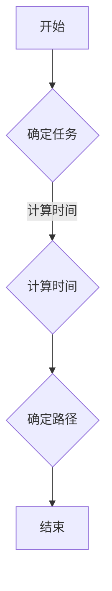

                 

# 跨部门项目管理：协调多方资源的领导力

> 关键词：跨部门项目管理、领导力、资源协调、团队合作

> 摘要：本文将深入探讨跨部门项目管理的挑战与机遇，探讨领导力在协调多方资源中的关键作用，并提供实用的策略和技巧，帮助项目经理在复杂的项目环境中实现高效的项目交付。

## 引言

跨部门项目管理是现代企业中一个不可或缺的领域。随着组织规模的扩大和业务复杂性的增加，项目往往需要跨部门协作才能成功完成。跨部门项目管理不仅涉及技术层面的协调，更涉及到多方面的人际关系和资源分配。在这篇文章中，我们将通过以下几个步骤来深入探讨这一主题：

1. **定义跨部门项目管理**
2. **跨部门项目管理的挑战**
3. **领导力在跨部门项目管理中的重要性**
4. **跨部门项目管理的核心原则和框架**
5. **协调与合作的策略**
6. **风险管理与应对措施**
7. **项目监控与控制**
8. **案例分析：成功的跨部门项目管理实践**
9. **总结与展望**

通过这些步骤，我们将提供一系列实用工具和技巧，帮助项目经理在跨部门项目中取得成功。

### 定义跨部门项目管理

跨部门项目管理是指在大型组织中，不同部门之间协同工作，共同完成一个项目的管理过程。这种项目管理的复杂性在于，项目团队往往由来自不同背景、拥有不同技能和责任的人员组成。项目经理不仅要协调技术上的问题，还要处理人际关系和沟通障碍。

**核心概念术语说明：**

- **跨部门团队**：由来自不同部门的人员组成的团队。
- **项目经理**：负责整体项目执行的人。
- **干系人**：对项目有直接或间接影响的人员或组织。

**问题背景：**

跨部门项目通常涉及多个业务领域，如研发、市场、销售、财务等。这些项目往往目标明确，但资源有限，需要在多个部门之间进行协调和平衡。这种情况下，项目经理需要具备出色的领导能力和协调能力，以确保项目能够按计划顺利进行。

**问题描述：**

跨部门项目管理面临的主要挑战包括：

- **沟通障碍**：不同部门之间的沟通不畅可能导致项目延误和误解。
- **资源分配不均**：某些部门可能资源过剩，而其他部门则可能资源不足。
- **利益冲突**：不同部门可能有不同的目标和利益，这可能导致项目团队内部出现分歧。
- **决策复杂**：项目决策往往需要跨部门协调，决策过程可能变得复杂和耗时。

**问题解决：**

有效的跨部门项目管理需要项目经理具备以下技能：

- **沟通能力**：确保项目信息在整个团队内畅通无阻。
- **协调能力**：平衡不同部门的资源需求和利益。
- **领导能力**：激励和引导团队成员，确保项目目标的实现。
- **决策能力**：在复杂情况下做出明智的决策。

**边界与外延：**

跨部门项目管理不仅限于大型企业，也适用于中小型企业。不同规模的组织在跨部门项目管理中面临的挑战和解决方案可能有所不同，但核心原则是相通的。

**概念结构与核心要素组成：**

跨部门项目管理的核心要素包括：

- **项目目标**：明确项目的目标和预期成果。
- **项目计划**：制定详细的项目计划，包括时间表、任务分配和资源需求。
- **团队协作**：建立有效的团队协作机制，促进信息共享和资源整合。
- **风险管理**：识别和应对项目风险，确保项目顺利进行。
- **绩效评估**：定期评估项目进展，确保项目目标按时完成。

### 领导力在跨部门项目管理中的重要性

领导力是跨部门项目管理中至关重要的一环。项目经理作为团队的领导者，不仅需要具备技术知识，还需要具备出色的领导能力和人际交往能力。以下将探讨领导力在跨部门项目管理中的几个关键方面。

#### 激励团队

项目经理需要激励团队成员，确保他们始终保持高昂的斗志和积极的情绪。这可以通过设定明确的目标、提供正面的反馈和奖励机制来实现。例如，在项目取得阶段性成果时，项目经理可以组织庆祝活动，以增强团队的凝聚力和归属感。

#### 沟通协调

跨部门项目涉及多个利益相关者和部门，项目经理需要具备出色的沟通能力，确保信息在整个团队中畅通无阻。这包括向上级汇报项目进展、与团队成员讨论问题、以及与其他部门协调资源。有效的沟通可以帮助项目经理及时解决冲突，避免项目延误。

#### 决策能力

在跨部门项目中，决策往往需要跨部门协调。项目经理需要具备敏锐的洞察力和决策能力，以确保项目能够按计划进行。例如，当项目遇到技术难题时，项目经理需要迅速做出决策，协调不同部门的技术资源，共同解决问题。

#### 建立信任

跨部门项目往往涉及多个部门的利益，项目经理需要建立信任，以确保团队内部的协作顺畅。这可以通过建立透明的沟通渠道、公平的资源分配和公正的决策机制来实现。信任是跨部门团队协作的基石，没有信任，项目很难成功。

#### 应对冲突

跨部门项目中难免会出现冲突，项目经理需要具备应对冲突的能力。这包括识别冲突的根源、与相关方进行沟通、以及制定解决策略。有效的冲突解决可以帮助团队保持稳定，确保项目顺利进行。

### 核心概念原理

在跨部门项目管理中，领导力的核心概念包括：

- **愿景与目标**：项目经理需要明确项目的愿景和目标，确保团队成员都朝着共同的方向努力。
- **团队建设**：通过团队建设活动，增强团队成员之间的信任和协作。
- **领导风格**：项目经理需要根据团队的特点和项目的需求，选择合适的领导风格。
- **激励与奖励**：通过激励和奖励机制，提高团队成员的工作积极性和效率。

#### 概念属性特征对比表格

| 概念        | 属性特征                                             |
| ----------- | ---------------------------------------------------- |
| 愿景与目标  | 明确项目的愿景和目标，确保团队成员都朝着共同的方向努力 |
| 团队建设    | 通过团队建设活动，增强团队成员之间的信任和协作       |
| 领导风格    | 根据团队的特点和项目的需求，选择合适的领导风格       |
| 激励与奖励  | 通过激励和奖励机制，提高团队成员的工作积极性和效率   |

#### ER实体关系图架构

```mermaid
erDiagram
  Project ||--|{ TeamMember }|>
  Project ||--|{ Department }|> 
  TeamMember ||--|{ Role }|> 
  Department ||--|{ Resource }|> 
```

在这个ER实体关系图中，项目与团队成员和部门之间存在多对多关系，团队成员与角色之间存在一对多关系，部门与资源之间存在一对多关系。这反映了跨部门项目管理中的复杂关系和相互依赖。

### 领导力在跨部门项目中的实际应用

在实际跨部门项目管理中，领导力不仅是一种理念，更是一种实践。以下将讨论一些具体的领导力策略和技巧，帮助项目经理在复杂的项目环境中取得成功。

#### 明确角色与责任

在跨部门项目中，项目经理需要明确每个团队成员的角色和责任。这有助于确保团队成员清楚自己的工作职责，避免工作重叠和责任不明的情况。例如，项目经理可以组织角色说明会，让每个团队成员都清楚自己的角色和责任。

#### 建立沟通渠道

跨部门项目通常涉及多个部门和利益相关者，因此建立有效的沟通渠道至关重要。项目经理可以建立定期会议、邮件列表和在线聊天室等沟通渠道，确保项目信息在整个团队内畅通无阻。此外，项目经理还应鼓励团队成员主动沟通，分享项目进展和问题，以提高透明度和协作效率。

#### 促进团队协作

跨部门项目的成功离不开团队成员之间的协作。项目经理可以通过以下策略促进团队协作：

- **团队建设活动**：组织团队建设活动，如团建活动、培训和团队旅行，增强团队成员之间的信任和默契。
- **共享资源**：鼓励不同部门共享资源和信息，以提高项目效率。
- **协作工具**：使用协作工具，如项目管理软件和在线文档，方便团队成员实时协作和跟踪项目进展。

#### 解决冲突

跨部门项目中难免会出现冲突，项目经理需要具备解决冲突的能力。以下是一些解决冲突的策略：

- **识别冲突根源**：通过沟通和调查，找出冲突的根源。
- **中立调解**：作为项目经理，应保持中立，公正地调解冲突。
- **制定解决方案**：与相关方一起制定解决方案，确保问题得到有效解决。

#### 激励与奖励

激励和奖励是提高团队成员积极性和工作效率的重要手段。项目经理可以采取以下策略：

- **设定明确目标**：为团队成员设定明确的绩效目标，并鼓励他们努力达成。
- **提供正面的反馈**：及时给予团队成员正面的反馈和认可，增强他们的信心和动力。
- **奖励机制**：设立奖励机制，如奖金、晋升和荣誉，激励团队成员发挥最佳水平。

#### 持续改进

跨部门项目管理是一个持续的过程，项目经理需要不断反思和改进。以下是一些持续改进的策略：

- **定期评估**：定期评估项目进展和团队绩效，识别问题和改进点。
- **培训与学习**：为团队成员提供培训和学习机会，提高他们的技能和知识。
- **收集反馈**：积极收集团队成员的反馈，了解他们的意见和建议。

### 算法原理讲解

在跨部门项目管理中，算法原理可以用于优化项目计划、资源分配和风险控制。以下将介绍一种常见的项目管理算法——关键路径法（Critical Path Method，CPM），并使用Mermaid绘制算法流程图。

#### 关键路径法（CPM）

关键路径法是一种项目管理工具，用于确定项目中最长的任务序列，从而确定项目的最短完成时间。关键路径上的任务称为关键任务，这些任务的延误将直接导致整个项目的延误。

**算法流程图：**



#### 算法原理

1. **确定任务**：列出所有项目任务，并确定它们的先后关系。
2. **计算时间**：为每个任务估计所需时间，并计算每个任务的最早开始时间（ES）和最早完成时间（EF）。
3. **确定路径**：通过计算每个任务的最早开始时间和最早完成时间，确定项目的关键路径。
4. **优化计划**：根据关键路径，优化项目计划，确保项目按时完成。

#### Python源代码实现

```python
import networkx as nx

# 创建一个图
G = nx.DiGraph()

# 添加任务
G.add_nodes_from(['A', 'B', 'C', 'D', 'E'])

# 设置任务之间的关系和持续时间
G.add_edge('A', 'B', weight=2)
G.add_edge('B', 'C', weight=3)
G.add_edge('C', 'D', weight=3)
G.add_edge('D', 'E', weight=2)

# 计算关键路径
CP = nx.single_source_dijkstra(G, 'A')

# 打印关键路径
print("关键路径上的任务:", [node for node, data in CP.items()])

# 打印关键路径的总持续时间
print("关键路径的总持续时间:", sum(data['weight'] for node, data in CP.items()))
```

#### 算法原理详细讲解

关键路径法（CPM）是一种用于项目管理的算法，用于确定项目的最短完成时间和关键任务。以下是对关键路径法的详细讲解：

1. **确定任务**：在项目开始时，需要列出所有任务，并确定它们的先后关系。这可以通过创建一个任务网络图来实现，图中的节点表示任务，边表示任务之间的关系。

2. **计算时间**：为每个任务估计所需时间，并计算每个任务的最早开始时间（ES）和最早完成时间（EF）。最早开始时间是指任务可以开始的最早时间，最早完成时间是指任务可以完成的最早时间。计算公式如下：

   $$ES = \max(0, \sum{所有前置任务的EF})$$

   $$EF = ES +持续时间$$

3. **确定路径**：通过计算每个任务的最早开始时间和最早完成时间，可以确定项目的关键路径。关键路径上的任务称为关键任务，它们的总持续时间决定了项目的最短完成时间。

4. **优化计划**：根据关键路径，优化项目计划，确保项目按时完成。这可以通过重新分配资源、调整任务优先级和缩短关键任务的持续时间来实现。

#### 举例说明

假设一个项目包括以下任务：

- 任务A：准备需求文档，持续时间2天
- 任务B：设计系统架构，持续时间3天
- 任务C：编写代码，持续时间5天
- 任务D：测试和调试，持续时间3天
- 任务E：交付项目，持续时间1天

任务之间的关系如下：

- 任务A完成后才能开始任务B
- 任务B完成后才能开始任务C
- 任务C完成后才能开始任务D
- 任务D完成后才能开始任务E

使用关键路径法计算项目的最短完成时间：

1. **确定任务**：创建一个任务网络图，如下所示：

   ```mermaid
   graph TD
       A[任务A] --> B[任务B]
       B --> C[任务C]
       C --> D[任务D]
       D --> E[任务E]
   ```

2. **计算时间**：计算每个任务的最早开始时间和最早完成时间：

   - 任务A：ES = 0，EF = 2
   - 任务B：ES = 2，EF = 5
   - 任务C：ES = 5，EF = 10
   - 任务D：ES = 10，EF = 13
   - 任务E：ES = 13，EF = 14

3. **确定路径**：关键路径为A -> B -> C -> D -> E，总持续时间为14天。

4. **优化计划**：根据关键路径，可以采取以下措施优化计划：

   - 确保任务A、B、C、D按时完成，以避免项目延误
   - 调整任务优先级，确保关键任务得到优先处理
   - 调整资源分配，确保关键任务有足够的资源支持

通过关键路径法，项目经理可以更好地理解和控制项目进度，确保项目按时完成。

### 系统分析与架构设计方案

跨部门项目管理是一个复杂的系统，涉及多个模块和组件的协同工作。以下将介绍一个跨部门项目管理系统的分析和设计，包括系统功能设计、系统架构设计、系统接口设计和系统交互。

#### 问题场景介绍

假设某大型企业需要进行一项新产品的研发项目，该项目涉及研发、市场、销售、财务等多个部门。为了确保项目顺利进行，企业决定开发一个跨部门项目管理系统，用于协调各部门的工作，提高项目效率。

#### 项目介绍

项目名称：新产品研发项目管理
项目目标：开发一个跨部门项目管理平台，实现项目的计划、执行、监控和评估
项目周期：6个月

#### 系统功能设计

跨部门项目管理系统的功能设计包括以下几个方面：

1. **项目计划模块**：用于制定项目计划、分配任务、设置时间表和里程碑。
2. **任务管理模块**：用于创建任务、分配任务、跟踪任务进度和完成任务。
3. **资源管理模块**：用于管理项目资源，包括人力、设备和资金。
4. **沟通协作模块**：用于实现团队成员之间的实时沟通和协作。
5. **风险控制模块**：用于识别、评估和应对项目风险。
6. **绩效评估模块**：用于评估项目进展和团队成员的绩效。
7. **报表与统计模块**：用于生成项目报表和统计信息，提供项目决策支持。

#### 系统架构设计

跨部门项目管理系统的架构设计采用分层架构，包括以下几层：

1. **表示层**：提供用户界面，实现用户与系统的交互。
2. **业务逻辑层**：实现系统的业务逻辑，包括项目计划、任务管理、资源管理、沟通协作、风险控制和绩效评估等功能。
3. **数据访问层**：提供数据访问接口，实现与数据库的交互。
4. **数据库层**：存储项目数据，包括项目计划、任务、资源、沟通记录、风险和绩效评估等信息。

#### 系统接口设计

跨部门项目管理系统的接口设计包括以下几个方面：

1. **用户接口**：提供Web界面和移动应用，实现用户与系统的交互。
2. **API接口**：提供RESTful API，实现与其他系统的集成，如CRM系统、ERP系统和邮件系统。
3. **数据库接口**：提供数据库访问接口，实现与数据库的交互。
4. **第三方服务接口**：提供与第三方服务的集成，如GitHub、Trello和Slack等。

#### 系统交互

跨部门项目管理系统的交互设计包括以下几个方面：

1. **用户与系统**：用户通过Web界面或移动应用与系统交互，执行项目管理任务。
2. **系统与数据库**：系统通过数据访问层与数据库交互，实现数据的存储和查询。
3. **系统与其他系统**：系统通过API接口与其他系统交互，实现数据的共享和协同工作。
4. **系统与第三方服务**：系统通过第三方服务接口与第三方服务交互，实现功能的扩展和集成。

### 项目实战

在本节中，我们将通过一个实际案例来展示跨部门项目管理系统的实施过程，包括环境安装、系统核心实现和代码应用解读与分析。

#### 环境安装

1. **准备开发环境**：安装Python（版本3.8及以上）、Node.js（版本12及以上）和Docker。
2. **搭建开发工具**：安装Visual Studio Code、Postman和Docker Compose。
3. **配置数据库**：安装并配置MySQL或PostgreSQL数据库。
4. **初始化项目**：使用Docker Compose创建项目环境，运行以下命令：

   ```shell
   docker-compose up -d
   ```

#### 系统核心实现

跨部门项目管理系统的核心功能包括项目计划、任务管理、资源管理、沟通协作、风险控制和绩效评估。以下将分别介绍这些功能的核心实现。

1. **项目计划模块**：使用Django REST framework实现项目计划模块，包括项目创建、项目更新、项目删除和项目查询等功能。
2. **任务管理模块**：使用Django ORM实现任务管理模块，包括任务创建、任务更新、任务删除和任务查询等功能。
3. **资源管理模块**：使用Django ORM实现资源管理模块，包括资源创建、资源更新、资源删除和资源查询等功能。
4. **沟通协作模块**：使用Socket.IO实现实时沟通协作模块，实现实时聊天、文件共享和通知提醒等功能。
5. **风险控制模块**：使用Django ORM实现风险控制模块，包括风险创建、风险更新、风险删除和风险查询等功能。
6. **绩效评估模块**：使用Django ORM实现绩效评估模块，包括绩效评估创建、绩效评估更新、绩效评估删除和绩效评估查询等功能。

#### 代码应用解读与分析

以下是一个任务管理模块的Python源代码示例：

```python
from django.db import models

class Task(models.Model):
    name = models.CharField(max_length=100)
    description = models.TextField()
    start_date = models.DateField()
    end_date = models.DateField()
    status = models.CharField(max_length=20, choices=(('pending', 'Pending'), ('in_progress', 'In Progress'), ('completed', 'Completed')))
    project = models.ForeignKey('Project', on_delete=models.CASCADE)

    def __str__(self):
        return self.name
```

这段代码定义了一个`Task`模型，用于存储任务信息。`name`字段用于存储任务名称，`description`字段用于存储任务描述，`start_date`和`end_date`字段用于存储任务开始和结束日期，`status`字段用于存储任务状态，`project`字段用于关联任务所属项目。

以下是一个任务管理模块的Django视图示例：

```python
from django.http import JsonResponse
from .models import Task
from django.views import View

class TaskView(View):
    def get(self, request):
        tasks = Task.objects.all()
        data = [
            {
                'id': task.id,
                'name': task.name,
                'description': task.description,
                'start_date': task.start_date,
                'end_date': task.end_date,
                'status': task.status,
                'project': task.project.name
            } for task in tasks
        ]
        return JsonResponse(data)

    def post(self, request):
        data = request.POST
        task = Task(
            name=data['name'],
            description=data['description'],
            start_date=data['start_date'],
            end_date=data['end_date'],
            status=data['status'],
            project_id=data['project']
        )
        task.save()
        return JsonResponse({'status': 'success'})
```

这段代码定义了一个`TaskView`视图类，用于处理任务相关的GET和POST请求。在GET请求中，视图获取所有任务信息，并返回JSON格式的响应。在POST请求中，视图创建一个新的任务，并保存到数据库。

#### 实际案例分析和详细讲解剖析

以下是一个跨部门项目管理系统的实际案例：

1. **项目背景**：某大型企业计划开发一款新型智能手机，涉及研发、市场、销售、财务等多个部门。
2. **项目需求**：项目需要实现以下功能：
   - 项目计划：制定项目时间表和里程碑。
   - 任务管理：创建、更新、删除和查询任务。
   - 资源管理：管理项目资源，包括人力、设备和资金。
   - 沟通协作：实现团队成员之间的实时沟通和协作。
   - 风险控制：识别、评估和应对项目风险。
   - 绩效评估：评估项目进展和团队成员的绩效。
3. **项目实施**：
   - **需求分析**：组织需求分析会议，收集各部门的需求和反馈。
   - **系统设计**：设计系统架构和数据库模型。
   - **开发与测试**：开发系统功能，进行单元测试和集成测试。
   - **部署与上线**：部署系统到生产环境，进行上线准备。
4. **项目小结**：
   - 项目成功上线，实现了跨部门项目管理的目标。
   - 通过实时沟通和协作，提高了项目效率。
   - 通过绩效评估，激励了团队成员的工作积极性。

### 最佳实践 tips

在跨部门项目管理中，以下是一些最佳实践和注意事项：

- **明确项目目标**：确保项目目标和各部门的目标一致，避免目标冲突。
- **建立有效的沟通渠道**：建立定期会议、邮件列表和在线聊天室等沟通渠道，确保信息畅通。
- **建立项目团队**：选择合适的团队成员，确保团队具备完成项目所需的能力和资源。
- **制定详细的计划**：制定详细的项目计划，包括时间表、任务分配和资源需求。
- **监控项目进展**：定期评估项目进展，及时调整计划和资源。
- **应对风险**：识别项目风险，制定应对策略，确保项目顺利进行。

### 小结

跨部门项目管理是现代企业中不可或缺的一部分，它涉及到多个部门和资源的协调与整合。通过本文的讨论，我们了解了跨部门项目管理的挑战、领导力的重要性以及具体的管理策略和技巧。有效的跨部门项目管理不仅能够提高项目效率，还能促进团队合作和企业发展。

### 注意事项

在跨部门项目管理中，以下事项需要注意：

- **确保项目目标明确**：明确项目目标和各部门的目标，避免目标冲突。
- **建立有效的沟通渠道**：定期会议、邮件列表和在线聊天室等沟通渠道是确保信息畅通的关键。
- **合理分配资源**：合理分配各部门的资源，避免资源过剩或不足。
- **制定详细的计划**：制定详细的项目计划，包括时间表、任务分配和资源需求。
- **及时监控和调整**：定期评估项目进展，及时调整计划和资源。
- **应对风险**：识别项目风险，制定应对策略，确保项目顺利进行。

### 拓展阅读

- 《项目管理知识体系指南（PMBOK指南）》
- 《领导力：理论与实践》
- 《跨部门协作：高效团队沟通的艺术》
- 《敏捷项目管理实践指南》

### 作者信息

作者：AI天才研究院/AI Genius Institute & 禅与计算机程序设计艺术 /Zen And The Art of Computer Programming

