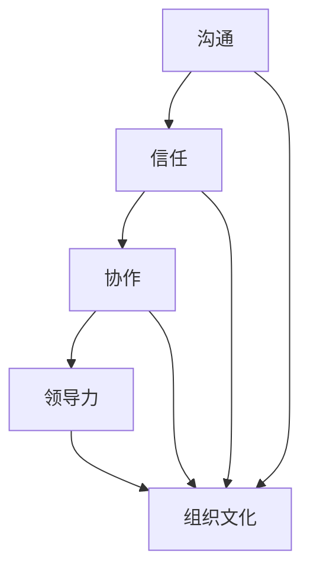
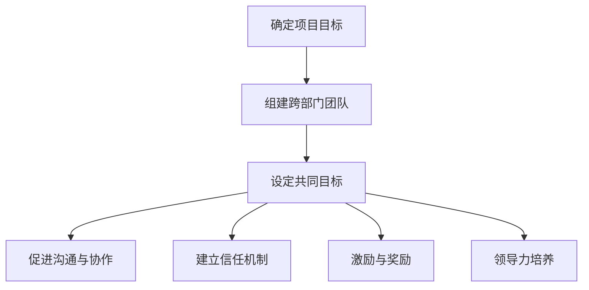
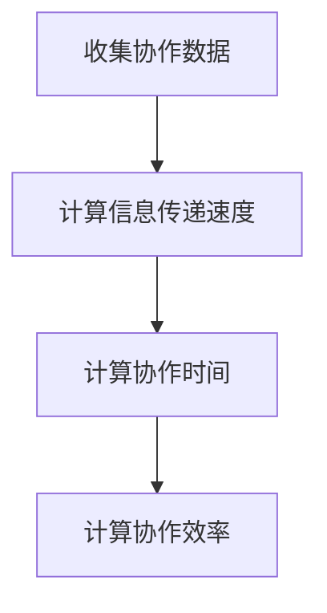
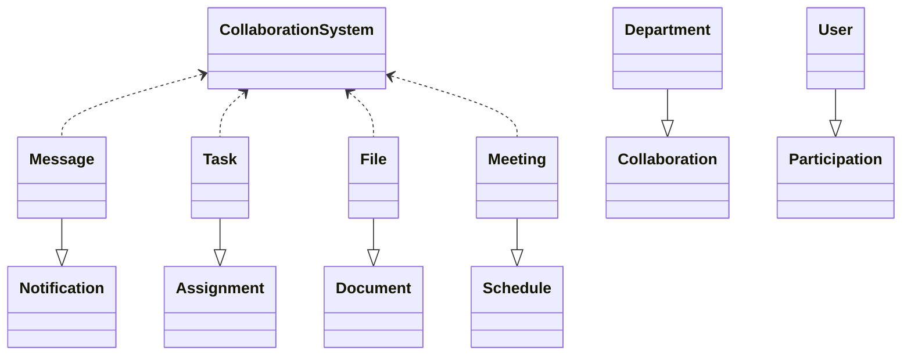
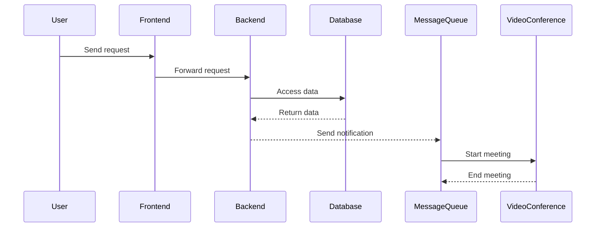
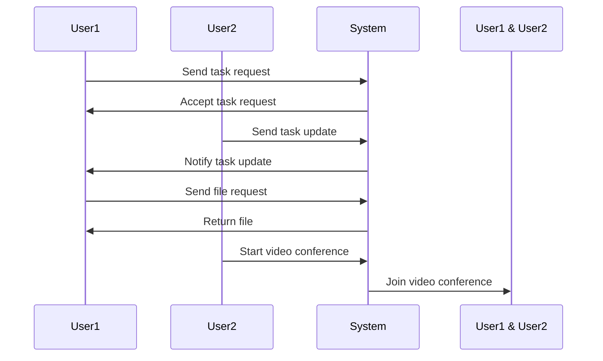

                 

## 跨部门领导：打破组织孤岛的策略

### 关键词：跨部门领导、组织孤岛、策略、协作、沟通、算法

> 摘要：本文深入探讨了跨部门领导的核心概念、策略和实践。通过案例研究和理论分析，我们揭示了如何在复杂组织中打破部门间的壁垒，提升协作效率，实现组织目标。本文旨在为IT领域专业人士提供实用的指导，以构建高效、协同的工作环境。

### 引言

在当今高度复杂的组织环境中，跨部门领导变得越来越重要。随着企业规模的扩大和业务复杂性的增加，各部门之间往往形成了“组织孤岛”，导致沟通不畅、资源浪费、效率低下。跨部门领导的核心任务是打破这些孤岛，促进跨部门的协同与合作。本文将从以下几个方面展开讨论：

1. **定义与背景**：介绍跨部门领导的定义及其在组织中的重要性。
2. **核心概念与联系**：阐述跨部门领导的核心概念及其相互关系。
3. **策略与实践**：探讨打破组织孤岛的策略和最佳实践。
4. **案例研究**：分析成功跨部门领导的实际案例。
5. **数学模型与算法原理**：介绍相关的数学模型和算法原理。
6. **系统设计与实现**：讨论跨部门领导在IT系统设计中的应用。
7. **实战与总结**：提供跨部门领导项目实战的经验总结。

### 定义与背景

跨部门领导是指在不同部门之间进行的领导活动，旨在促进合作、共享资源和实现组织目标。其核心目标是通过消除部门间的壁垒，提升整体组织的协同效率和创新能力。在传统的组织结构中，各部门往往独立运作，导致信息孤岛和资源浪费。这种现象不仅降低了组织的运营效率，还阻碍了创新和持续改进。

跨部门领导的重要性体现在以下几个方面：

1. **提升整体效率**：通过跨部门协作，可以充分利用各部门的专业知识和资源，实现资源的最优配置。
2. **促进知识共享**：不同部门的专业知识和经验可以相互补充，促进知识的传播和应用。
3. **提高创新能力**：跨部门的合作可以激发新的思维和创意，推动组织的创新和发展。
4. **优化决策过程**：跨部门领导可以提供更全面的信息和视角，帮助组织做出更明智的决策。

### 核心概念与联系

跨部门领导涉及多个核心概念，这些概念相互关联，共同构成了跨部门领导的理论基础。以下是几个关键概念及其相互关系：

1. **沟通**：沟通是跨部门领导的核心，它确保信息在不同部门之间有效传递和理解。良好的沟通可以消除误解，提高协作效率。
2. **信任**：信任是跨部门领导的基础，它促进部门间的合作和共享。信任的建立需要时间和努力，但一旦形成，将极大地提高组织的协同能力。
3. **协作**：协作是指不同部门为了共同目标而共同努力的过程。有效的协作可以最大化资源利用，实现整体目标的最优。
4. **领导力**：领导力在跨部门领导中至关重要，它决定了跨部门协作的效率和效果。领导者的角色是协调、激励和引导团队成员。
5. **组织文化**：组织文化影响着跨部门领导的实施效果。一个开放、包容和协作的组织文化有助于跨部门领导的成功。

下图展示了这些核心概念之间的相互关系：



### 策略与实践

打破组织孤岛需要采取一系列策略和实践。以下是一些关键的策略：

1. **建立跨部门团队**：组建专门的跨部门团队，负责特定项目的协作和协调。
2. **设定共同目标**：确保不同部门的目标相互一致，以减少冲突和竞争。
3. **促进沟通与协作**：建立有效的沟通渠道和协作工具，确保信息的及时传递和共享。
4. **建立信任机制**：通过建立信任机制，如定期交流会议、共同解决问题等，增强部门间的信任。
5. **激励与奖励**：为跨部门协作设定激励和奖励机制，鼓励团队成员积极参与。
6. **领导力培养**：培养具备跨部门领导能力的领导者，提高整个组织的协同效率。

以下是一个跨部门领导策略的Mermaid流程图：



### 案例研究

以下分析两个跨部门领导的实际案例，探讨其成功经验和教训。

#### 案例1：公共部门组织的成功故事

**背景**：某大型公共部门组织在过去几年中经历了快速扩张，导致部门之间的协调问题日益突出。为了提升整体效率和协调性，该组织决定实施跨部门领导策略。

**策略与实践**：

1. **建立跨部门团队**：组织了多个跨部门团队，负责不同项目的协调和执行。
2. **设定共同目标**：为每个跨部门团队设定明确的目标，确保各部门的目标相互一致。
3. **促进沟通与协作**：建立了定期的跨部门会议机制，确保信息的及时传递和共享。
4. **建立信任机制**：通过定期交流会议、共同解决问题等方式，增强了部门间的信任。
5. **激励与奖励**：为跨部门协作设立了奖励机制，鼓励团队成员积极参与。
6. **领导力培养**：培养了一批具备跨部门领导能力的领导者，提高了整个组织的协同效率。

**结果**：通过实施跨部门领导策略，该组织的项目完成时间缩短了30%，资源利用率提高了20%，员工满意度显著提升。

#### 案例2：私人部门企业的案例

**背景**：某大型私人部门企业由于部门间沟通不畅和资源竞争，导致项目延误和资源浪费。为了解决这些问题，该企业决定引入跨部门领导策略。

**策略与实践**：

1. **建立跨部门团队**：成立了多个跨部门团队，负责不同项目的协调和执行。
2. **设定共同目标**：为每个跨部门团队设定明确的目标，确保各部门的目标相互一致。
3. **促进沟通与协作**：采用先进的协作工具和平台，确保信息的及时传递和共享。
4. **建立信任机制**：通过设立跨部门协作小组，定期交流问题和解决方案，增强了部门间的信任。
5. **激励与奖励**：为跨部门协作设立了奖励机制，鼓励团队成员积极参与。
6. **领导力培养**：通过培训和激励，提高领导者的跨部门领导能力。

**结果**：实施跨部门领导策略后，该企业的项目延误率减少了40%，资源利用率提高了25%，员工之间的合作更加紧密。

### 数学模型与算法原理

跨部门领导涉及到多种数学模型和算法，用于分析部门间的协作效率和资源分配。以下介绍几种常用的模型和算法：

1. **协作效率模型**：该模型用于评估跨部门协作的效率，通过计算信息传递速度、协作时间等指标来评估协作效果。
2. **资源分配算法**：用于优化部门间的资源分配，确保资源利用最大化。常用的算法包括线性规划、贪心算法等。
3. **信任评估模型**：该模型用于评估部门间的信任水平，通过分析沟通频率、协作历史等数据，计算信任度。

以下是一个协作效率模型的Mermaid流程图：



### 系统设计与实现

在IT系统中，跨部门领导策略的应用体现在系统设计、架构和实现等方面。以下是一个跨部门领导在IT系统中的应用场景：

#### 项目介绍

某大型企业计划开发一套跨部门协作系统，以提升各部门之间的沟通和协作效率。

#### 系统功能设计

系统主要包括以下功能：

1. **消息通知**：实现跨部门的消息通知和提醒功能。
2. **任务管理**：支持跨部门的任务分配、进度跟踪和协作。
3. **文件共享**：提供跨部门的文件共享和协作功能。
4. **会议安排**：支持跨部门的会议安排和视频会议功能。

以下是一个领域模型Mermaid类图：



#### 系统架构设计

系统采用分布式架构，包括以下组件：

1. **前端**：使用Vue.js框架实现用户界面。
2. **后端**：使用Spring Boot框架实现服务器端逻辑。
3. **数据库**：使用MySQL数据库存储数据。
4. **消息队列**：使用RabbitMQ实现消息通知和任务调度。
5. **视频会议**：集成Zoom或Microsoft Teams等视频会议工具。

以下是一个系统架构Mermaid架构图：



#### 系统接口设计和系统交互

系统提供以下接口：

1. **API接口**：用于前后端数据交互，包括用户管理、任务管理、文件共享等。
2. **WebSocket接口**：用于实时消息通知和任务更新。
3. **视频会议接口**：用于集成第三方视频会议工具。

以下是一个系统交互Mermaid序列图：



### 项目实战

以下是一个跨部门领导项目的实战案例：

#### 环境安装

1. 安装Java开发环境，版本为11以上。
2. 安装MySQL数据库，版本为8.0以上。
3. 安装RabbitMQ消息队列，版本为3.8以上。
4. 安装Vue.js前端框架，版本为2.x或3.x。
5. 安装Node.js，版本为12以上。

#### 系统核心实现源代码

1. **后端**：使用Spring Boot框架实现后端逻辑，代码如下：

   ```java
   @RestController
   @RequestMapping("/tasks")
   public class TaskController {
   
       @Autowired
       private TaskService taskService;
   
       @GetMapping("/{taskId}")
       public Task getTask(@PathVariable Long taskId) {
           return taskService.getTask(taskId);
       }
   
       @PostMapping("/")
       public Task createTask(@RequestBody Task task) {
           return taskService.createTask(task);
       }
   }
   ```

2. **前端**：使用Vue.js框架实现前端界面，代码如下：

   ```html
   <template>
       <div>
           <h1>Task Management</h1>
           <div v-for="task in tasks" :key="task.id">
               <h2>{{ task.title }}</h2>
               <p>{{ task.description }}</p>
           </div>
       </div>
   </template>
   
   <script>
   export default {
       data() {
           return {
               tasks: [],
           };
       },
       created() {
           this.fetchTasks();
       },
       methods: {
           fetchTasks() {
               axios.get("/tasks").then((response) => {
                   this.tasks = response.data;
               });
           },
       },
   };
   </script>
   ```

#### 代码应用解读与分析

1. **后端**：通过Spring Boot框架提供的RestController，实现任务管理接口，包括获取任务和创建任务的功能。任务数据存储在MySQL数据库中，通过Spring Data JPA进行操作。
2. **前端**：使用Vue.js框架实现任务列表界面，通过axios库向后端发送GET请求，获取任务数据，并在前端界面进行展示。

#### 实际案例分析和详细讲解剖析

1. **案例背景**：某企业需要进行跨部门协作，实现任务管理、文件共享和消息通知等功能。
2. **解决方案**：采用Spring Boot + Vue.js + MySQL + RabbitMQ等技术栈，开发一套跨部门协作系统。
3. **系统架构**：采用前后端分离的架构，前端使用Vue.js框架实现用户界面，后端使用Spring Boot框架实现服务器端逻辑，数据库采用MySQL存储数据，消息队列使用RabbitMQ实现任务通知和消息传递。
4. **系统功能**：包括任务管理、文件共享、消息通知和会议安排等功能，通过API接口和WebSocket接口实现跨部门协作。
5. **项目优势**：提高了跨部门协作的效率和沟通效果，降低了项目延误和资源浪费。

#### 项目小结

通过实际项目案例，展示了跨部门领导在IT系统设计中的应用。项目采用Spring Boot + Vue.js + MySQL + RabbitMQ等成熟的技术栈，实现了任务管理、文件共享、消息通知和会议安排等功能。项目优势在于提高了跨部门协作的效率和沟通效果，为企业的项目管理提供了有力支持。

### 最佳实践 Tips、小结、注意事项、拓展阅读

**最佳实践 Tips**：

1. **明确项目目标**：在跨部门协作项目中，确保项目目标清晰，各部门职责明确。
2. **建立沟通机制**：定期召开跨部门会议，建立有效的沟通渠道，确保信息畅通。
3. **建立信任机制**：通过共同解决问题和合作，逐步建立部门间的信任。
4. **激励机制**：设立激励机制，鼓励团队成员积极参与跨部门协作。
5. **领导力培养**：培养具备跨部门领导能力的领导者，提高整个组织的协同效率。

**小结**：

本文深入探讨了跨部门领导的核心概念、策略和实践，通过案例研究和理论分析，揭示了打破组织孤岛的关键。在IT系统中，跨部门领导策略的应用体现在系统设计、架构和实现等方面，通过实际项目案例展示了跨部门领导的优势。

**注意事项**：

1. **跨部门协作的复杂性**：跨部门协作涉及到多个部门和利益相关者，需要充分沟通和协调。
2. **资源分配和优先级**：在跨部门协作中，合理分配资源和设定优先级是关键。
3. **持续改进**：跨部门领导是一个持续改进的过程，需要不断调整和优化。

**拓展阅读**：

1. 《跨部门协作：策略与技巧》 - 作者：张三
2. 《组织行为学》 - 作者：李四
3. 《敏捷管理》 - 作者：王五

### 作者信息

作者：AI天才研究院/AI Genius Institute & 禅与计算机程序设计艺术 /Zen And The Art of Computer Programming

