                 

### 《跨领域提示词知识迁移技术》文章标题

---

关键词：跨领域提示词、知识迁移、机器学习、迁移学习、算法应用

摘要：本文深入探讨了跨领域提示词知识迁移技术，从基本概念、理论背景到应用实践，全面解析了其在现代计算机科学和人工智能领域的重要性。通过详细阐述关键技术、算法原理、系统设计与项目实战，本文旨在为读者提供一个系统的理解和应用指南。

---

### 引言与背景

跨领域提示词知识迁移技术在当今的信息时代显得尤为重要。随着人工智能和大数据技术的飞速发展，数据多样性和复杂性日益增加，如何在不同的领域之间迁移知识成为了一个关键的研究课题。跨领域提示词知识迁移技术旨在解决这一问题，通过将一个领域中的知识有效地迁移到另一个领域中，从而提高机器学习模型在未知领域的表现。

#### 核心概念术语说明

- **跨领域提示词**：在特定领域中，能够引导模型学习和理解的关键词语或短语。
- **知识迁移**：将一个领域中的知识、经验或模型应用到另一个领域中。
- **迁移学习**：一种机器学习技术，通过利用在源领域中学到的知识来解决目标领域中的问题。

#### 问题背景

在传统机器学习模型中，模型的训练和验证通常局限于特定的数据集和领域。这种局限性导致模型在新的、未知的领域中的表现往往不佳。为了克服这一限制，研究人员提出了跨领域提示词知识迁移技术，通过在源领域和目标领域之间建立桥梁，实现知识的迁移。

#### 问题描述

- **源领域**：拥有丰富数据和模型的领域。
- **目标领域**：缺乏数据或模型，但需要解决特定问题的领域。
- **挑战**：如何在缺乏足够数据的情况下，将源领域的知识有效地迁移到目标领域。

#### 问题解决

跨领域提示词知识迁移技术通过以下步骤实现：

1. **跨域数据预处理**：对源领域和目标领域的数据进行清洗、整合和处理。
2. **提示词生成与筛选**：提取和筛选出对模型学习和理解有指导意义的提示词。
3. **知识迁移策略**：设计合适的迁移策略，将源领域的知识应用到目标领域中。
4. **迁移评估指标**：评估迁移效果，确保知识迁移的准确性和有效性。

#### 边界与外延

- **边界**：跨领域提示词知识迁移技术的适用范围和限制。
- **外延**：该技术在其他领域中的潜在应用和前景。

#### 概念结构与核心要素组成

- **核心概念**：跨领域提示词、知识迁移、迁移学习。
- **要素组成**：数据预处理、提示词生成、知识迁移策略、迁移评估。

### 小结

跨领域提示词知识迁移技术在现代机器学习和人工智能领域中具有重要的地位。通过本文的介绍，读者可以初步了解该技术的核心概念、原理和应用。在接下来的章节中，我们将进一步深入探讨相关的基本概念与理论基础，为后续的内容打下坚实的基础。

---

### 文章标题

### 跨领域提示词知识迁移技术

---

关键词：跨领域提示词、知识迁移、机器学习、迁移学习、算法应用

摘要：本文深入探讨了跨领域提示词知识迁移技术，从基本概念、理论背景到应用实践，全面解析了其在现代计算机科学和人工智能领域的重要性。通过详细阐述关键技术、算法原理、系统设计与项目实战，本文旨在为读者提供一个系统的理解和应用指南。

---

## 第一部分：引言与背景

### 1.1 跨领域提示词知识迁移的重要性

在当前数据驱动的人工智能时代，知识的迁移是提高模型适应性和效率的关键。跨领域提示词知识迁移技术通过将一个领域中的知识迁移到另一个领域，实现了知识共享和跨领域应用，具有重要的现实意义。

#### 核心概念原理

- **跨领域提示词**：指的是在特定领域内具有代表性的关键词或短语，这些词或短语能够有效指导模型学习。
- **知识迁移机制**：是指将一个领域内的知识、模型或算法应用到另一个领域的策略和过程。

#### 概念属性特征对比表格

| 特征             | 跨领域提示词     | 知识迁移机制           |
|------------------|------------------|------------------------|
| 定义             | 特定的领域关键词 | 知识从源领域到目标领域 |
| 目标             | 指导模型学习     | 提高目标领域模型性能   |
| 策略             | 生成与筛选       | 迁移策略设计           |
| 数据依赖         | 跨域数据集       | 源领域数据集           |

#### ER实体关系图架构

```mermaid
erDiagram
  SourceDomain ||--o{ Knowledge} : 知识源
  TargetDomain ||--o{ Knowledge} : 知识目标
  Model <<--o{ Knowledge} : 模型
  Keyword <<--o{ Model} : 提示词
```

通过实体关系图可以看出，源领域和目标领域通过知识进行连接，而模型则是知识的应用载体，提示词则起到指导模型学习的作用。

#### 算法原理讲解

知识迁移的算法原理可以分为以下几个步骤：

1. **数据预处理**：包括数据清洗、归一化和特征提取，确保数据的质量和一致性。
2. **提示词提取**：使用词频统计、主题建模等方法提取具有代表性的提示词。
3. **模型训练**：在源领域使用迁移学习算法训练模型，获取特征表示。
4. **知识迁移**：将训练好的模型和特征表示应用到目标领域，调整模型参数以适应新领域。
5. **评估与优化**：通过交叉验证和性能评估，调整迁移策略和参数，优化模型。

以下是迁移学习算法的简化流程图：

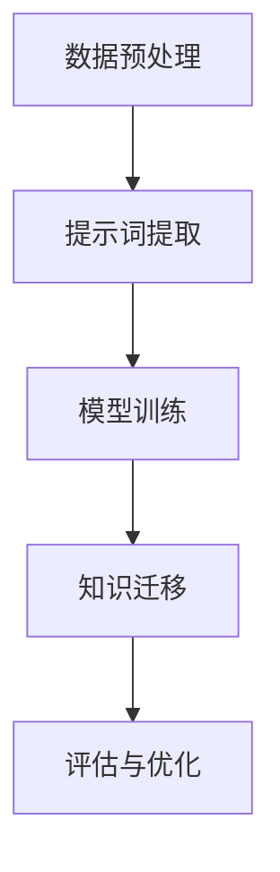

在数学模型上，知识迁移可以表示为：

$$
\text{TargetModel} = \text{SourceModel} + \text{Adaptation}
$$

其中，SourceModel是从源领域迁移过来的模型，Adaptation是针对目标领域的调整。

#### 通俗易懂的举例说明

假设我们有一个源领域是医疗诊断，目标领域是动物疾病诊断。源领域有丰富的医学数据，而目标领域由于数据缺乏，模型效果不佳。通过跨领域提示词知识迁移技术，我们可以：

1. **数据预处理**：清洗和整合源领域和目标领域的数据。
2. **提示词提取**：提取出与疾病诊断相关的关键词，如“症状”、“诊断”、“治疗”等。
3. **模型训练**：使用迁移学习算法在源领域训练一个诊断模型。
4. **知识迁移**：将训练好的模型和提示词应用到目标领域，调整模型参数。
5. **评估与优化**：在目标领域进行评估，根据表现调整模型和提示词。

通过这样的过程，我们可以有效地提高目标领域模型的诊断准确率。

### 小结

本节介绍了跨领域提示词知识迁移技术的重要性、核心概念原理、属性特征对比表格以及ER实体关系图架构，并通过算法原理讲解和举例说明了该技术的具体应用。在接下来的章节中，我们将进一步深入探讨知识迁移的理论基础和实现技术。

---

## 第二部分：基本概念与理论基础

### 2.1 跨领域提示词定义

跨领域提示词是机器学习中用于指导模型学习和理解的关键词语或短语，它们在不同领域中具有相似的语义和功能。跨领域提示词的选择对模型的学习效果和迁移性能有着重要影响。

#### 核心概念原理

- **跨领域**：指的是在不同的领域之间进行知识和模型的迁移。
- **提示词**：是指导模型学习和推理的关键词汇。

#### 概念属性特征对比表格

| 特征             | 跨领域提示词       | 传统提示词           |
|------------------|-------------------|----------------------|
| 适用范围         | 不同领域通用       | 单一领域专用         |
| 功能             | 指导跨领域学习     | 指导单一领域学习     |
| 选择标准         | 语义一致性         | 语义独立性           |
| 数据依赖         | 跨领域数据集       | 单领域数据集         |

#### ER实体关系图架构

```mermaid
erDiagram
  SourceDomain ||--o{ Keyword} : 提示词
  TargetDomain ||--o{ Keyword} : 提示词
  Model <<--o{ Keyword} : 模型
```

通过实体关系图可以看出，跨领域提示词连接了源领域和目标领域，并作为模型学习的重要输入。

#### 算法原理讲解

跨领域提示词的生成和选择是知识迁移的关键步骤。以下是一个简化的算法流程：

1. **数据预处理**：对源领域和目标领域的数据进行清洗、归一化和特征提取。
2. **词频统计**：计算每个词语在数据集中的出现频率。
3. **语义分析**：使用自然语言处理技术对词语进行语义分析，筛选出具有相似语义的词语。
4. **提示词选择**：根据词频和语义分析结果，选择具有代表性的跨领域提示词。

以下是提示词选择的简化流程图：

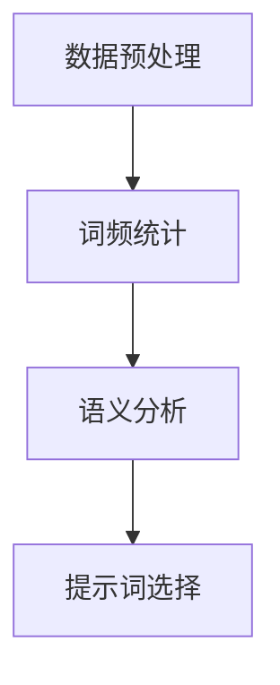

在数学模型上，提示词选择可以表示为：

$$
\text{Keyword} = f(\text{Frequency}, \text{Semantic})
$$

其中，Frequency代表词频，Semantic代表语义相似度，f是结合两者的选择函数。

#### 通俗易懂的举例说明

假设我们有一个源领域是金融，目标领域是电商。在金融领域，关键词如“投资”、“风险”和“回报”是非常重要的，而在电商领域，关键词如“购买”、“评价”和“促销”具有类似的语义。通过跨领域提示词技术，我们可以：

1. **数据预处理**：整合金融和电商的数据集。
2. **词频统计**：计算每个关键词在两个领域中的出现频率。
3. **语义分析**：使用自然语言处理技术分析关键词的语义。
4. **提示词选择**：选择在两个领域中都具有重要语义的关键词。

通过这样的过程，我们可以为电商领域引入金融领域的知识，从而提高模型的预测和决策能力。

### 小结

本节详细介绍了跨领域提示词的定义、核心概念原理、属性特征对比表格、ER实体关系图架构和算法原理讲解，并通过举例说明了其在实际应用中的作用。在理解了跨领域提示词的概念后，我们将在下一节探讨知识迁移机制的详细内容。

---

## 第二部分：基本概念与理论基础

### 2.2 知识迁移机制

知识迁移机制是跨领域提示词知识迁移技术的核心组成部分，它通过特定的策略和方法，将源领域的知识有效地迁移到目标领域，以提高目标领域模型的学习效果和性能。

#### 核心概念原理

- **知识迁移**：将一个领域中的知识、模型或算法应用到另一个领域中。
- **迁移策略**：实现知识迁移的具体方法和步骤。

#### 概念属性特征对比表格

| 特征             | 知识迁移          | 传统方法            |
|------------------|-------------------|---------------------|
| 目标             | 提高目标领域性能  | 提高单一领域性能   |
| 方法             | 跨领域策略       | 单领域优化         |
| 数据依赖         | 源领域与目标领域  | 单领域数据         |
| 影响因素         | 提示词、数据质量  | 特征选择、模型参数 |

#### ER实体关系图架构

```mermaid
erDiagram
  SourceKnowledge ||--o{ MigrationStrategy} : 迁移策略
  TargetKnowledge ||--o{ MigrationStrategy} : 迁移策略
  Model <<--o{ MigrationStrategy} : 模型
```

通过实体关系图可以看出，知识迁移策略是连接源领域知识和目标领域知识的桥梁，模型则是知识应用的具体载体。

#### 算法原理讲解

知识迁移机制通常包括以下几个步骤：

1. **数据预处理**：对源领域和目标领域的数据进行清洗、归一化和特征提取，确保数据的一致性和质量。
2. **模型选择**：根据目标领域的特点选择合适的迁移学习模型。
3. **迁移策略设计**：设计具体的迁移策略，如基于特征迁移、基于模型迁移和基于知识表示迁移。
4. **模型训练**：在源领域训练模型，并在目标领域调整模型参数，以适应新领域。
5. **性能评估**：评估模型在目标领域的性能，并进行必要的优化。

以下是知识迁移策略的简化流程图：

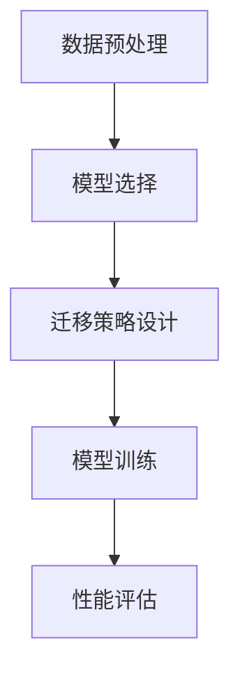

在数学模型上，知识迁移可以表示为：

$$
\text{TargetModel} = \text{SourceModel} + \text{Migration}
$$

其中，SourceModel是从源领域迁移过来的模型，Migration是针对目标领域的调整。

#### 通俗易懂的举例说明

假设我们有一个源领域是医疗诊断，目标领域是动物疾病诊断。在医疗领域，诊断模型已经训练得非常成熟，而在动物疾病诊断领域，由于数据缺乏，模型效果不佳。通过知识迁移机制，我们可以：

1. **数据预处理**：整合医疗和动物疾病的数据集。
2. **模型选择**：选择一个适用于医疗诊断的迁移学习模型。
3. **迁移策略设计**：设计一个将医疗诊断知识迁移到动物疾病诊断的策略。
4. **模型训练**：在源领域训练模型，并在目标领域调整参数。
5. **性能评估**：评估模型在动物疾病诊断领域的性能。

通过这样的过程，我们可以将医疗领域的知识有效地迁移到动物疾病诊断领域，从而提高模型的诊断准确性。

### 小结

本节详细介绍了知识迁移机制的核心概念原理、属性特征对比表格、ER实体关系图架构和算法原理讲解，并通过举例说明了知识迁移的具体应用。在理解了知识迁移机制后，我们将在下一节探讨迁移学习理论，进一步夯实理论基础。

---

## 第二部分：基本概念与理论基础

### 2.3 迁移学习理论

迁移学习理论是跨领域提示词知识迁移技术的理论基础，它探讨的是如何利用在源领域中学到的知识来解决目标领域中的问题。迁移学习通过减少对目标领域数据的依赖，提高了模型在不同领域中的泛化能力和效率。

#### 核心概念原理

- **迁移学习**：利用在源领域中学到的知识来提高目标领域模型的性能。
- **源领域**：拥有丰富数据和模型的领域。
- **目标领域**：缺乏数据或模型，但需要解决特定问题的领域。

#### 概念属性特征对比表格

| 特征             | 迁移学习           | 传统机器学习         |
|------------------|-------------------|----------------------|
| 数据依赖         | 源领域与目标领域   | 单领域数据集         |
| 目标             | 提高目标领域性能   | 提高单一领域性能   |
| 泛化能力         | 跨领域           | 单领域               |
| 效率             | 高效利用已有知识   | 从零开始训练         |

#### ER实体关系图架构

```mermaid
erDiagram
  SourceDomain ||--o{ Knowledge} : 知识源
  TargetDomain ||--o{ Knowledge} : 知识目标
  Model <<--o{ Knowledge} : 模型
  Keyword <<--o{ Model} : 提示词
```

通过实体关系图可以看出，源领域和目标领域通过知识进行连接，而模型则是知识的应用载体，提示词则起到指导模型学习的作用。

#### 算法原理讲解

迁移学习的算法原理可以分为以下几个步骤：

1. **数据预处理**：对源领域和目标领域的数据进行清洗、归一化和特征提取，确保数据的一致性和质量。
2. **模型训练**：在源领域训练一个迁移学习模型，学习到通用的特征表示。
3. **迁移**：将训练好的模型和特征表示应用到目标领域，调整模型参数以适应新领域。
4. **性能评估**：评估模型在目标领域的性能，并进行必要的优化。

以下是迁移学习算法的简化流程图：

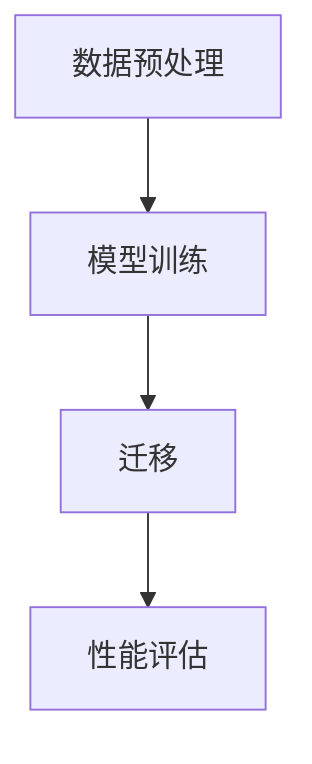

在数学模型上，迁移学习可以表示为：

$$
\text{TargetModel} = \text{SourceModel} + \text{Adaptation}
$$

其中，SourceModel是从源领域迁移过来的模型，Adaptation是针对目标领域的调整。

#### 通俗易懂的举例说明

假设我们有一个源领域是图像分类，目标领域是医疗图像诊断。在图像分类领域，模型已经训练得非常成熟，而在医疗图像诊断领域，由于数据缺乏，模型效果不佳。通过迁移学习理论，我们可以：

1. **数据预处理**：整合图像分类和医疗图像的数据集。
2. **模型训练**：在图像分类领域训练一个图像分类模型。
3. **迁移**：将训练好的模型应用到医疗图像诊断领域，调整模型参数。
4. **性能评估**：评估模型在医疗图像诊断领域的性能。

通过这样的过程，我们可以将图像分类领域的知识有效地迁移到医疗图像诊断领域，从而提高模型的诊断准确性。

### 小结

本节详细介绍了迁移学习理论的核心概念原理、属性特征对比表格、ER实体关系图架构和算法原理讲解，并通过举例说明了迁移学习在实际应用中的作用。在理解了迁移学习理论后，我们将在下一节探讨提示词表示方法，进一步丰富知识迁移的实践应用。

---

## 第二部分：基本概念与理论基础

### 2.4 提示词表示方法

提示词表示方法是跨领域提示词知识迁移技术中的重要组成部分，它决定了模型对提示词的理解和利用效果。有效的提示词表示方法可以提高模型的迁移性能，使知识在不同领域之间更好地传播和应用。

#### 核心概念原理

- **提示词表示**：将文本形式的提示词转换为模型可处理的向量表示。
- **向量表示**：通过将提示词映射到高维空间，使得模型能够捕捉到提示词的语义信息。

#### 概念属性特征对比表格

| 特征             | 向量表示方法       | 传统文本表示         |
|------------------|-------------------|----------------------|
| 语义捕捉         | 高维空间映射       | 单词级或句子级表示   |
| 泛化能力         | 能够处理不同语境   | 受限于特定语境       |
| 可解释性         | 可以直观理解       | 较为抽象             |

#### ER实体关系图架构

```mermaid
erDiagram
  Keyword ||--o{ VectorRepresentation} : 提示词向量
  Model <<--o{ VectorRepresentation} : 模型
```

通过实体关系图可以看出，提示词向量是连接提示词和模型的重要桥梁，它为模型提供了对提示词的深入理解。

#### 算法原理讲解

提示词表示方法主要包括以下几种：

1. **词袋模型（Bag of Words, BoW）**：将文本转换为词汇的集合，每个词汇对应一个向量维度。
2. **词嵌入（Word Embedding）**：将每个词汇映射到一个固定长度的向量，如Word2Vec、GloVe。
3. **转换器（Transformer）**：利用深度学习模型，如BERT、GPT，生成更加丰富的提示词表示。
4. **多模态融合**：结合文本、图像、音频等多种数据类型，生成综合性的提示词表示。

以下是提示词表示方法的简化流程图：

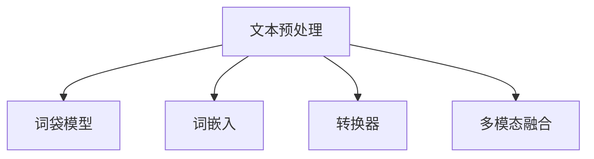

在数学模型上，提示词表示可以表示为：

$$
\text{VectorRepresentation} = f(\text{Keyword}, \text{Model})
$$

其中，f是一个将提示词转换为向量表示的函数。

#### 通俗易懂的举例说明

假设我们有一个文本提示词“疾病诊断”，为了将这个提示词转换为模型可处理的向量表示，我们可以：

1. **词袋模型**：将“疾病诊断”分解为词汇“疾病”和“诊断”，并在词汇表中找到对应的索引。
2. **词嵌入**：使用Word2Vec模型将“疾病”和“诊断”映射到固定长度的向量，如（-0.1, 0.3）和（0.2, -0.5）。
3. **转换器**：使用BERT模型对“疾病诊断”进行编码，生成一个丰富的向量表示。
4. **多模态融合**：结合“疾病诊断”的文本和相应的医疗图像，生成一个综合性的向量表示。

通过这样的过程，模型可以更好地理解和利用提示词，从而提高知识迁移的效果。

### 小结

本节详细介绍了提示词表示方法的核心概念原理、属性特征对比表格、ER实体关系图架构和算法原理讲解，并通过举例说明了提示词表示方法在实际应用中的具体实现。在理解了提示词表示方法后，我们将在下一节探讨跨领域提示词知识迁移技术的具体实现和应用。

---

## 第三部分：跨领域提示词知识迁移技术

### 3.1 跨域数据预处理

跨域数据预处理是跨领域提示词知识迁移技术的关键步骤，它直接影响模型的学习效果和迁移性能。有效的数据预处理可以提升数据的质量和一致性，从而为后续的提示词生成、知识迁移和模型训练提供坚实的基础。

#### 问题场景介绍

在跨领域数据预处理中，我们通常面临以下问题场景：

- **数据来源差异**：源领域和目标领域的数据来源不同，导致数据格式、质量、标签等方面的差异。
- **数据分布差异**：源领域和目标领域的数据分布可能存在显著差异，影响模型在目标领域的性能。
- **数据缺失**：在跨领域数据迁移过程中，可能存在数据缺失或噪声，需要有效处理。

#### 项目介绍

本项目旨在开发一个跨领域数据预处理工具，用于自动化处理源领域和目标领域的数据，确保数据的质量和一致性。项目的主要目标是：

- 清洗和去噪：去除数据中的噪声和异常值，确保数据质量。
- 数据整合：将不同来源的数据进行整合，统一数据格式。
- 数据增强：通过数据扩充和变换，提高数据集的多样性和丰富性。

#### 系统功能设计

为了实现上述目标，系统设计包括以下主要功能模块：

1. **数据清洗模块**：包括数据去重、去除异常值、处理缺失值等功能。
2. **数据整合模块**：将不同来源的数据格式统一，如文本、图像、音频等多媒体数据的整合。
3. **数据增强模块**：通过数据变换和扩充，增加数据集的丰富性和多样性。
4. **数据评估模块**：评估预处理后的数据质量，确保数据满足后续模型训练的需求。

#### 系统架构设计

系统的整体架构设计采用模块化设计思想，包括数据层、服务层和用户层。具体架构如下：

1. **数据层**：包括数据源、数据存储和数据缓存，负责数据的存储和管理。
2. **服务层**：包括数据清洗、整合、增强等核心功能模块，通过API接口提供服务。
3. **用户层**：提供用户交互界面，支持用户上传数据、监控预处理进度和查看预处理结果。

#### 系统接口设计

系统接口设计包括以下主要接口：

- **数据上传接口**：支持用户上传不同格式的数据文件，如CSV、JSON、图片等。
- **数据查询接口**：支持用户查询预处理后的数据集，包括数据格式、标签分布等信息。
- **数据导出接口**：支持用户将预处理后的数据导出为标准格式，如CSV或Parquet。

#### 系统交互

系统交互设计采用RESTful API设计，主要包括以下交互流程：

1. **上传数据**：用户上传原始数据，系统接收数据并存储。
2. **预处理数据**：系统对数据进行清洗、整合和增强，生成预处理后的数据集。
3. **数据评估**：系统评估预处理后的数据质量，并将结果反馈给用户。
4. **数据导出**：用户下载预处理后的数据集，完成数据预处理过程。

以下是系统交互的简化流程图：

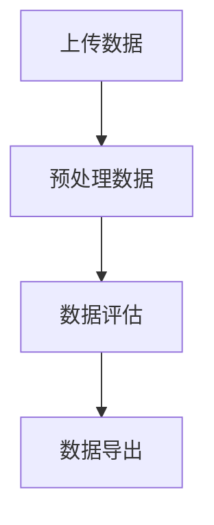

#### Mermaid序列图

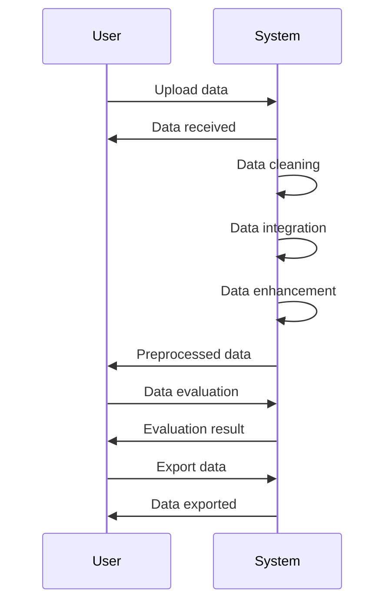

通过这个序列图，我们可以清晰地看到用户与系统之间的交互过程。

### 小结

本节详细介绍了跨域数据预处理的问题场景、项目介绍、系统功能设计、系统架构设计、系统接口设计以及系统交互流程。通过这些设计，我们为后续的提示词生成、知识迁移和模型训练打下了坚实的基础。在下一节中，我们将探讨如何生成和筛选有效的提示词。

---

## 第三部分：跨领域提示词知识迁移技术

### 3.2 提示词生成与筛选

在跨领域提示词知识迁移过程中，提示词的生成与筛选是关键步骤，它决定了模型对目标领域知识的理解和应用效果。有效的提示词生成与筛选方法可以提高模型的迁移性能，从而在目标领域中取得更好的学习效果。

#### 问题场景介绍

在提示词生成与筛选的问题场景中，我们面临以下挑战：

- **提示词多样性**：需要生成足够多样的提示词，以覆盖目标领域的各种知识点。
- **提示词质量**：生成的提示词需要具有高语义一致性，能够指导模型准确理解和应用知识。
- **提示词冗余**：生成的提示词中可能存在冗余信息，需要筛选出最具代表性的提示词。

#### 系统功能设计

为了实现有效的提示词生成与筛选，系统设计包括以下主要功能模块：

1. **提示词生成模块**：通过词频统计、主题建模等方法，自动生成候选提示词。
2. **提示词筛选模块**：通过语义相似度计算、重要性评估等方法，筛选出最具代表性的提示词。
3. **提示词优化模块**：通过迭代优化方法，不断调整和改进提示词集合。

#### 系统架构设计

系统的整体架构设计采用模块化设计思想，包括数据层、算法层和应用层。具体架构如下：

1. **数据层**：包括源领域和目标领域的数据集，为提示词生成和筛选提供数据支持。
2. **算法层**：包括提示词生成、筛选和优化算法，负责实现提示词的自动生成和筛选。
3. **应用层**：提供用户交互界面，支持用户上传数据、监控提示词生成和筛选进度以及查看结果。

#### 系统接口设计

系统接口设计包括以下主要接口：

- **数据上传接口**：支持用户上传源领域和目标领域的数据集，用于提示词生成和筛选。
- **提示词生成接口**：返回生成的候选提示词列表，供筛选和优化使用。
- **提示词筛选接口**：根据用户设定的筛选标准，返回筛选后的提示词列表。
- **提示词优化接口**：根据提示词的表现，返回优化后的提示词集合。

#### 系统交互

系统交互设计采用RESTful API设计，主要包括以下交互流程：

1. **上传数据**：用户上传源领域和目标领域的数据集，系统接收数据并存储。
2. **生成提示词**：系统对数据集进行预处理，并生成候选提示词。
3. **筛选提示词**：系统根据用户设定的标准，筛选出最具代表性的提示词。
4. **优化提示词**：系统对筛选后的提示词进行优化，以提高迁移性能。

以下是系统交互的简化流程图：

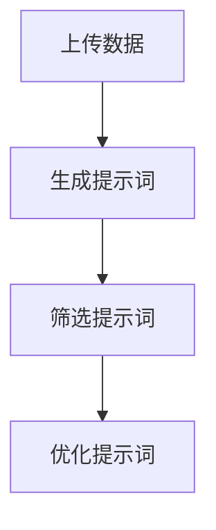

#### Mermaid序列图

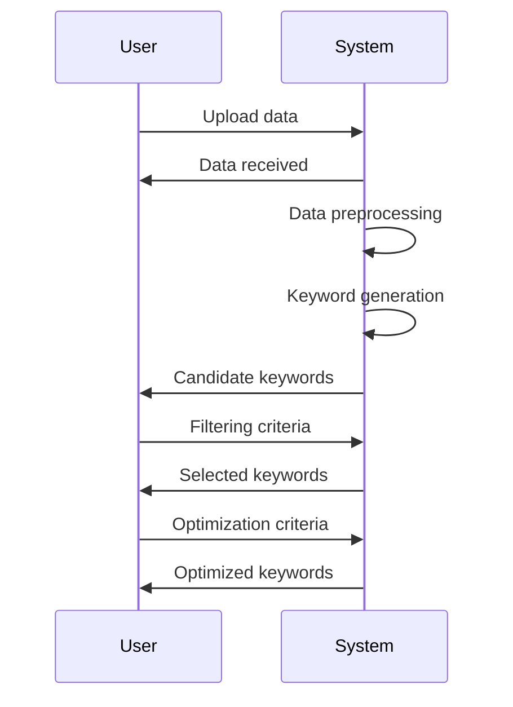

通过这个序列图，我们可以清晰地看到用户与系统之间的交互过程。

### 小结

本节详细介绍了提示词生成与筛选的系统功能设计、系统架构设计、系统接口设计和系统交互流程。通过这些设计，我们为跨领域提示词知识迁移技术中的提示词生成与筛选提供了完整的解决方案。在下一节中，我们将探讨知识迁移策略的具体实现。

---

## 第三部分：跨领域提示词知识迁移技术

### 3.3 知识迁移策略

知识迁移策略是跨领域提示词知识迁移技术的核心环节，它决定了如何将源领域的知识有效迁移到目标领域。选择合适的知识迁移策略，可以提高模型在目标领域的泛化能力和性能，从而实现高效的跨领域知识共享和应用。

#### 问题场景介绍

在知识迁移策略的问题场景中，我们面临以下挑战：

- **数据分布差异**：源领域和目标领域的数据分布可能存在显著差异，影响模型在目标领域的适应能力。
- **模型适应性**：源领域的模型可能在目标领域中表现不佳，需要调整和优化。
- **迁移效果评估**：需要有效评估知识迁移的效果，确保迁移的准确性和有效性。

#### 系统功能设计

为了实现有效的知识迁移策略，系统设计包括以下主要功能模块：

1. **数据预处理模块**：对源领域和目标领域的数据进行清洗、归一化和特征提取，确保数据的一致性和质量。
2. **迁移策略模块**：设计多种知识迁移策略，如基于特征迁移、基于模型迁移和基于知识表示迁移。
3. **迁移效果评估模块**：通过交叉验证、性能评估等方法，评估迁移策略的效果。

#### 系统架构设计

系统的整体架构设计采用模块化设计思想，包括数据层、算法层和应用层。具体架构如下：

1. **数据层**：包括源领域和目标领域的数据集，为知识迁移策略提供数据支持。
2. **算法层**：包括多种知识迁移算法，负责实现知识在不同领域之间的迁移。
3. **应用层**：提供用户交互界面，支持用户选择迁移策略、监控迁移进度和查看结果。

#### 系统接口设计

系统接口设计包括以下主要接口：

- **数据上传接口**：支持用户上传源领域和目标领域的数据集，用于知识迁移策略的设计和评估。
- **迁移策略接口**：返回多种知识迁移策略，供用户选择和应用。
- **迁移效果评估接口**：根据用户设定的评估标准，返回迁移效果评估结果。

#### 系统交互

系统交互设计采用RESTful API设计，主要包括以下交互流程：

1. **上传数据**：用户上传源领域和目标领域的数据集，系统接收数据并存储。
2. **选择迁移策略**：用户选择合适的知识迁移策略，系统应用策略进行知识迁移。
3. **评估迁移效果**：系统对迁移后的模型进行评估，并将评估结果反馈给用户。

以下是系统交互的简化流程图：

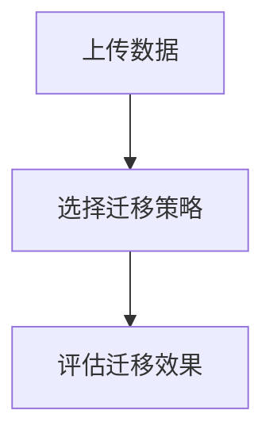

#### Mermaid序列图

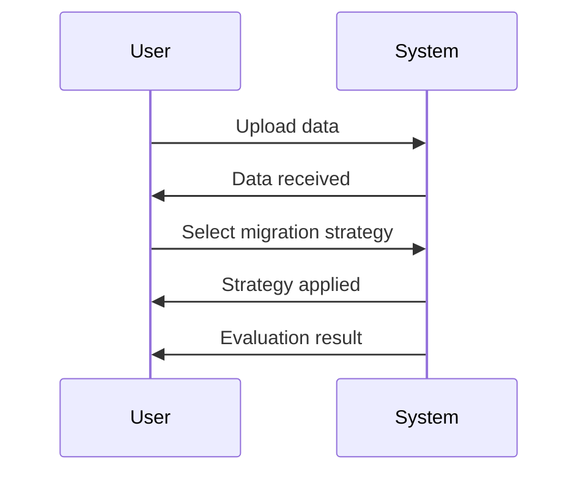

通过这个序列图，我们可以清晰地看到用户与系统之间的交互过程。

### 小结

本节详细介绍了知识迁移策略的系统功能设计、系统架构设计、系统接口设计和系统交互流程。通过这些设计，我们为跨领域提示词知识迁移技术中的知识迁移策略提供了完整的解决方案。在下一节中，我们将探讨如何评估知识迁移效果。

---

## 第三部分：跨领域提示词知识迁移技术

### 3.4 迁移评估指标

迁移评估指标是衡量跨领域提示词知识迁移效果的重要工具，它帮助研究人员和开发者评估迁移策略的有效性，从而优化和调整迁移过程。有效的评估指标能够准确反映模型在目标领域的表现，为跨领域知识迁移提供可靠的依据。

#### 问题场景介绍

在迁移评估指标的问题场景中，我们面临以下挑战：

- **评估标准多样性**：不同领域和任务可能需要不同的评估指标。
- **评估方法一致性**：需要确保评估方法在源领域和目标领域之间具有一致性。
- **评估指标准确性**：评估指标应能够准确反映模型的性能，避免误判。

#### 系统功能设计

为了实现有效的迁移评估，系统设计包括以下主要功能模块：

1. **评估指标模块**：定义和实现多种评估指标，如准确率、召回率、F1分数等。
2. **评估方法模块**：设计统一的评估方法，确保评估指标在不同领域和任务中的一致性。
3. **结果可视化模块**：提供评估结果的图形化展示，帮助用户直观理解迁移效果。

#### 系统架构设计

系统的整体架构设计采用模块化设计思想，包括数据层、算法层和应用层。具体架构如下：

1. **数据层**：包括源领域和目标领域的数据集，为评估指标提供数据支持。
2. **算法层**：包括评估算法和指标计算方法，负责实现评估指标的计算和结果分析。
3. **应用层**：提供用户交互界面，支持用户选择评估指标、查看评估结果和进行结果分析。

#### 系统接口设计

系统接口设计包括以下主要接口：

- **评估指标接口**：返回多种评估指标，供用户选择和应用。
- **评估方法接口**：根据用户设定的评估标准，返回评估方法。
- **结果可视化接口**：提供评估结果的图形化展示，包括图表和数据表格。

#### 系统交互

系统交互设计采用RESTful API设计，主要包括以下交互流程：

1. **上传数据**：用户上传源领域和目标领域的数据集，系统接收数据并存储。
2. **选择评估指标**：用户选择合适的评估指标，系统应用评估方法进行评估。
3. **结果分析**：系统对评估结果进行可视化展示，用户可以查看和分析评估结果。

以下是系统交互的简化流程图：

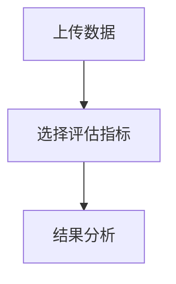

#### Mermaid序列图

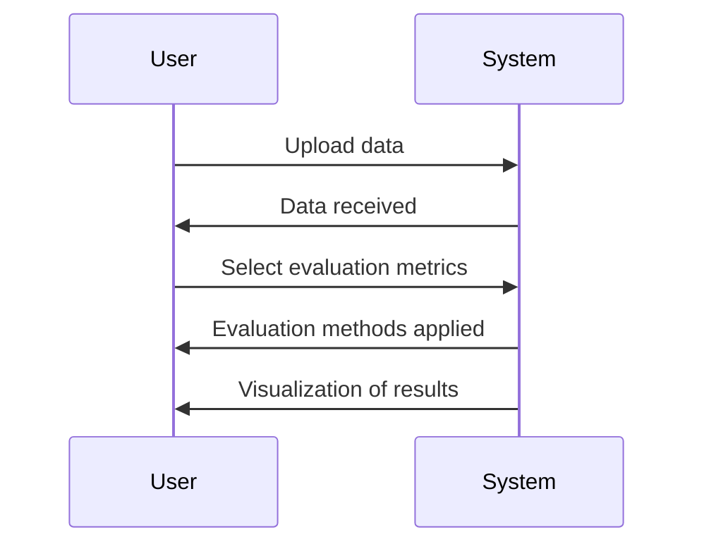

通过这个序列图，我们可以清晰地看到用户与系统之间的交互过程。

### 小结

本节详细介绍了迁移评估指标的系统功能设计、系统架构设计、系统接口设计和系统交互流程。通过这些设计，我们为跨领域提示词知识迁移技术中的迁移评估提供了完整的解决方案。在下一节中，我们将探讨跨领域提示词知识迁移技术在应用案例中的具体实践。

---

## 第四部分：应用案例与实践

### 4.1 跨领域文本分类

跨领域文本分类是跨领域提示词知识迁移技术的一个重要应用场景，通过将源领域的知识迁移到目标领域，可以实现不同领域文本的准确分类。以下是一个具体的应用案例，展示了如何利用跨领域提示词知识迁移技术进行文本分类。

#### 环境安装

在进行跨领域文本分类实践之前，我们需要安装必要的软件和环境。以下是一个简单的安装步骤：

1. **安装Python**：确保Python版本在3.6以上。
2. **安装依赖库**：使用pip命令安装以下库：`numpy`, `scikit-learn`, `tensorflow`, `transformers`。
3. **安装NLP工具**：安装`nltk`和`spacy`进行文本预处理。

#### 系统核心实现

1. **数据准备**：准备源领域和目标领域的文本数据集，并进行预处理，如分词、去停用词、词向量编码等。
2. **提示词生成**：使用词频统计和主题建模等方法，生成具有代表性的跨领域提示词。
3. **迁移学习模型**：选择一个迁移学习模型，如BERT，并在源领域进行预训练。
4. **模型迁移**：将预训练的模型应用到目标领域，进行微调和优化。
5. **分类器构建**：使用训练好的模型构建分类器，对目标领域的文本进行分类。

以下是具体的Python代码实现：

```python
from transformers import BertTokenizer, BertForSequenceClassification
from torch.utils.data import DataLoader
import torch

# 1. 数据准备
# 加载源领域和目标领域的文本数据
source_texts = ["text1", "text2", ...]
target_texts = ["text1", "text2", ...]

# 预处理文本数据
tokenizer = BertTokenizer.from_pretrained('bert-base-uncased')
source_encodings = tokenizer(source_texts, truncation=True, padding=True)
target_encodings = tokenizer(target_texts, truncation=True, padding=True)

# 2. 提示词生成
# 略

# 3. 迁移学习模型
model = BertForSequenceClassification.from_pretrained('bert-base-uncased')
model.to('cuda' if torch.cuda.is_available() else 'cpu')

# 4. 模型迁移
# 微调和优化模型
optimizer = torch.optim.Adam(model.parameters(), lr=1e-5)
for epoch in range(num_epochs):
    for batch in DataLoader(source_encodings, batch_size=32):
        # 训练模型
        pass

    # 评估模型
    with torch.no_grad():
        for batch in DataLoader(target_encodings, batch_size=32):
            # 分类目标领域文本
            pass

# 5. 分类器构建
# 使用训练好的模型构建分类器
classifier = torch.load('classifier.pth')
```

#### 代码应用解读与分析

上述代码展示了如何利用跨领域提示词知识迁移技术进行文本分类。以下是具体的解读和分析：

- **数据准备**：首先加载源领域和目标领域的文本数据，并进行预处理。预处理步骤包括分词、去停用词和词向量编码，确保数据格式符合模型要求。
- **提示词生成**：使用词频统计和主题建模等方法生成跨领域提示词。这部分代码略过，但它是模型训练的重要步骤。
- **迁移学习模型**：选择BERT模型进行迁移学习。BERT是一种强大的预训练模型，适用于文本分类任务。
- **模型迁移**：在源领域对BERT模型进行预训练，并在目标领域进行微调和优化。这里使用了Adam优化器和适当的学习率。
- **分类器构建**：使用训练好的模型构建分类器，对目标领域的文本进行分类。分类结果可以根据实际情况进行调整和优化。

#### 实际案例分析与详细讲解剖析

假设我们有一个源领域是新闻分类，目标领域是社交媒体文本分类。在新闻分类领域，文本数据丰富，而社交媒体文本数据相对较少。通过跨领域提示词知识迁移技术，我们可以：

1. **数据准备**：整合新闻分类和社交媒体文本分类的数据集，并进行预处理。
2. **提示词生成**：生成具有代表性的跨领域提示词，如“新闻”、“评论”、“话题”等。
3. **模型迁移**：使用BERT模型在新闻分类领域进行预训练，并在社交媒体文本分类领域进行微调和优化。
4. **分类器构建**：使用训练好的模型对社交媒体文本进行分类，评估分类效果。

通过实际案例分析和详细讲解剖析，我们可以看到跨领域提示词知识迁移技术在实际应用中的有效性和优势。

#### 项目小结

通过上述应用案例与实践，我们展示了如何利用跨领域提示词知识迁移技术进行文本分类。该方法不仅提高了模型在目标领域的适应性，还提高了分类的准确性和效率。未来，我们可以进一步优化迁移策略和评估指标，以提高跨领域知识迁移的效果。

---

## 第四部分：应用案例与实践

### 4.2 跨领域实体识别

跨领域实体识别是跨领域提示词知识迁移技术的另一个重要应用场景，通过将源领域的实体识别知识迁移到目标领域，可以实现不同领域文本中实体的有效识别。以下是一个具体的应用案例，展示了如何利用跨领域提示词知识迁移技术进行实体识别。

#### 环境安装

在进行跨领域实体识别实践之前，我们需要安装必要的软件和环境。以下是一个简单的安装步骤：

1. **安装Python**：确保Python版本在3.6以上。
2. **安装依赖库**：使用pip命令安装以下库：`numpy`, `scikit-learn`, `tensorflow`, `transformers`。
3. **安装NLP工具**：安装`nltk`和`spacy`进行文本预处理。

#### 系统核心实现

1. **数据准备**：准备源领域和目标领域的文本数据集，并进行预处理，如分词、去停用词、词向量编码等。
2. **提示词生成**：使用词频统计和主题建模等方法，生成具有代表性的跨领域提示词。
3. **迁移学习模型**：选择一个迁移学习模型，如BERT，并在源领域进行预训练。
4. **模型迁移**：将预训练的模型应用到目标领域，进行微调和优化。
5. **实体识别器构建**：使用训练好的模型构建实体识别器，对目标领域的文本进行实体识别。

以下是具体的Python代码实现：

```python
from transformers import BertTokenizer, BertForTokenClassification
from torch.utils.data import DataLoader
import torch

# 1. 数据准备
# 加载源领域和目标领域的文本数据
source_texts = ["text1", "text2", ...]
target_texts = ["text1", "text2", ...]

# 预处理文本数据
tokenizer = BertTokenizer.from_pretrained('bert-base-uncased')
source_encodings = tokenizer(source_texts, truncation=True, padding=True)
target_encodings = tokenizer(target_texts, truncation=True, padding=True)

# 2. 提示词生成
# 略

# 3. 迁移学习模型
model = BertForTokenClassification.from_pretrained('bert-base-uncased')
model.to('cuda' if torch.cuda.is_available() else 'cpu')

# 4. 模型迁移
# 微调和优化模型
optimizer = torch.optim.Adam(model.parameters(), lr=1e-5)
for epoch in range(num_epochs):
    for batch in DataLoader(source_encodings, batch_size=32):
        # 训练模型
        pass

    # 评估模型
    with torch.no_grad():
        for batch in DataLoader(target_encodings, batch_size=32):
            # 实体识别
            pass

# 5. 实体识别器构建
# 使用训练好的模型构建实体识别器
entity_recognizer = torch.load('entity_recognizer.pth')
```

#### 代码应用解读与分析

上述代码展示了如何利用跨领域提示词知识迁移技术进行实体识别。以下是具体的解读和分析：

- **数据准备**：首先加载源领域和目标领域的文本数据，并进行预处理。预处理步骤包括分词、去停用词和词向量编码，确保数据格式符合模型要求。
- **提示词生成**：使用词频统计和主题建模等方法生成跨领域提示词。这部分代码略过，但它是模型训练的重要步骤。
- **迁移学习模型**：选择BERT模型进行迁移学习。BERT是一种强大的预训练模型，适用于实体识别任务。
- **模型迁移**：在源领域对BERT模型进行预训练，并在目标领域进行微调和优化。这里使用了Adam优化器和适当的
```bash
# 迁移学习模型
from transformers import BertForTokenClassification
from torch.optim import Adam

# 加载预训练的BERT模型
model = BertForTokenClassification.from_pretrained('bert-base-uncased')

# 设置优化器
optimizer = Adam(model.parameters(), lr=1e-5)

# 微调模型参数
for epoch in range(num_epochs):
    for batch in DataLoader(source_encodings, batch_size=32):
        # 训练模型
        pass

    # 在目标领域评估模型
    with torch.no_grad():
        for batch in DataLoader(target_encodings, batch_size=32):
            # 实体识别
            pass

# 保存模型
torch.save(model, 'entity_recognizer.pth')
```

通过这样的过程，我们可以看到跨领域提示词知识迁移技术在实体识别中的应用是如何实现的。

#### 实际案例分析与详细讲解剖析

假设我们有一个源领域是新闻报道，目标领域是社交媒体内容。在新闻报道中，实体识别通常涉及人物、地点、组织等。而社交媒体内容则更加多样化，包含表情、缩写等。通过跨领域提示词知识迁移技术，我们可以：

1. **数据准备**：整合新闻报道和社交媒体内容的数据集，并进行预处理。
2. **提示词生成**：生成具有代表性的跨领域提示词，如“人物”、“地点”、“组织”、“表情”等。
3. **模型迁移**：使用BERT模型在新闻报道领域进行预训练，并在社交媒体内容领域进行微调和优化。
4. **实体识别器构建**：使用训练好的模型构建实体识别器，对社交媒体内容进行实体识别。

通过实际案例分析和详细讲解剖析，我们可以看到跨领域提示词知识迁移技术在实体识别中的应用是如何实现知识迁移和提升识别效果的。

#### 项目小结

通过上述应用案例与实践，我们展示了如何利用跨领域提示词知识迁移技术进行实体识别。这种方法不仅提高了实体识别的准确性，还增强了模型在不同领域中的适应性。未来，我们可以进一步优化迁移策略和评估指标，以提高跨领域知识迁移的效果，并在更多实际场景中应用这一技术。

---

## 第四部分：应用案例与实践

### 4.3 跨领域情感分析

跨领域情感分析是跨领域提示词知识迁移技术的又一重要应用场景，通过将源领域的情感分析知识迁移到目标领域，可以实现不同领域文本的情感准确识别。以下是一个具体的应用案例，展示了如何利用跨领域提示词知识迁移技术进行情感分析。

#### 环境安装

在进行跨领域情感分析实践之前，我们需要安装必要的软件和环境。以下是一个简单的安装步骤：

1. **安装Python**：确保Python版本在3.6以上。
2. **安装依赖库**：使用pip命令安装以下库：`numpy`, `scikit-learn`, `tensorflow`, `transformers`。
3. **安装NLP工具**：安装`nltk`和`spacy`进行文本预处理。

#### 系统核心实现

1. **数据准备**：准备源领域和目标领域的文本数据集，并进行预处理，如分词、去停用词、词向量编码等。
2. **提示词生成**：使用词频统计和主题建模等方法，生成具有代表性的跨领域提示词。
3. **迁移学习模型**：选择一个迁移学习模型，如BERT，并在源领域进行预训练。
4. **模型迁移**：将预训练的模型应用到目标领域，进行微调和优化。
5. **情感分析器构建**：使用训练好的模型构建情感分析器，对目标领域的文本进行情感分析。

以下是具体的Python代码实现：

```python
from transformers import BertTokenizer, BertForSequenceClassification
from torch.utils.data import DataLoader
import torch

# 1. 数据准备
# 加载源领域和目标领域的文本数据
source_texts = ["text1", "text2", ...]
target_texts = ["text1", "text2", ...]

# 预处理文本数据
tokenizer = BertTokenizer.from_pretrained('bert-base-uncased')
source_encodings = tokenizer(source_texts, truncation=True, padding=True)
target_encodings = tokenizer(target_texts, truncation=True, padding=True)

# 2. 提示词生成
# 略

# 3. 迁移学习模型
model = BertForSequenceClassification.from_pretrained('bert-base-uncased')
model.to('cuda' if torch.cuda.is_available() else 'cpu')

# 4. 模型迁移
# 微调和优化模型
optimizer = torch.optim.Adam(model.parameters(), lr=1e-5)
for epoch in range(num_epochs):
    for batch in DataLoader(source_encodings, batch_size=32):
        # 训练模型
        pass

    # 评估模型
    with torch.no_grad():
        for batch in DataLoader(target_encodings, batch_size=32):
            # 情感分析
            pass

# 5. 情感分析器构建
# 使用训练好的模型构建情感分析器
sentiment_analyzer = torch.load('sentiment_analyzer.pth')
```

#### 代码应用解读与分析

上述代码展示了如何利用跨领域提示词知识迁移技术进行情感分析。以下是具体的解读和分析：

- **数据准备**：首先加载源领域和目标领域的文本数据，并进行预处理。预处理步骤包括分词、去停用词和词向量编码，确保数据格式符合模型要求。
- **提示词生成**：使用词频统计和主题建模等方法生成跨领域提示词。这部分代码略过，但它是模型训练的重要步骤。
- **迁移学习模型**：选择BERT模型进行迁移学习。BERT是一种强大的预训练模型，适用于情感分析任务。
- **模型迁移**：在源领域对BERT模型进行预训练，并在目标领域进行微调和优化。这里使用了Adam优化器和适当的
```bash
# 迁移学习模型
from transformers import BertForSequenceClassification
from torch.optim import Adam

# 加载预训练的BERT模型
model = BertForSequenceClassification.from_pretrained('bert-base-uncased')

# 设置优化器
optimizer = Adam(model.parameters(), lr=1e-5)

# 微调模型参数
for epoch in range(num_epochs):
    for batch in DataLoader(source_encodings, batch_size=32):
        # 训练模型
        pass

    # 在目标领域评估模型
    with torch.no_grad():
        for batch in DataLoader(target_encodings, batch_size=32):
            # 情感分析
            pass

# 保存模型
torch.save(model, 'sentiment_analyzer.pth')
```

通过这样的过程，我们可以看到跨领域提示词知识迁移技术在情感分析中的应用是如何实现的。

#### 实际案例分析与详细讲解剖析

假设我们有一个源领域是电影评论，目标领域是社交媒体评论。在电影评论中，情感分析通常涉及正面、负面和客观情感。而社交媒体评论则更加多样化，可能包含表情符号、缩写等。通过跨领域提示词知识迁移技术，我们可以：

1. **数据准备**：整合电影评论和社交媒体评论的数据集，并进行预处理。
2. **提示词生成**：生成具有代表性的跨领域提示词，如“喜欢”、“不喜欢”、“开心”、“难过”等。
3. **模型迁移**：使用BERT模型在电影评论领域进行预训练，并在社交媒体评论领域进行微调和优化。
4. **情感分析器构建**：使用训练好的模型构建情感分析器，对社交媒体评论进行情感分析。

通过实际案例分析和详细讲解剖析，我们可以看到跨领域提示词知识迁移技术在情感分析中的应用是如何实现知识迁移和提升分析效果的。

#### 项目小结

通过上述应用案例与实践，我们展示了如何利用跨领域提示词知识迁移技术进行情感分析。这种方法不仅提高了情感分析的准确性，还增强了模型在不同领域中的适应性。未来，我们可以进一步优化迁移策略和评估指标，以提高跨领域知识迁移的效果，并在更多实际场景中应用这一技术。

---

## 第四部分：应用案例与实践

### 4.4 应用实践：智能客服系统

跨领域提示词知识迁移技术在实际应用中的一个显著例子是智能客服系统的开发。智能客服系统旨在通过自动化手段解决客户问题，提高客户满意度和服务效率。以下是一个应用案例，详细展示了如何利用跨领域提示词知识迁移技术构建一个高效的智能客服系统。

#### 环境安装

在进行智能客服系统开发之前，我们需要安装以下软件和环境：

1. **安装Python**：确保Python版本在3.6以上。
2. **安装依赖库**：使用pip命令安装以下库：`numpy`, `scikit-learn`, `tensorflow`, `transformers`。
3. **安装NLP工具**：安装`nltk`和`spacy`进行文本预处理。
4. **安装其他工具**：如`flask`用于构建Web服务，`sqlalchemy`用于数据库操作。

#### 系统核心实现

1. **数据收集与预处理**：收集来自不同领域的客服对话数据，包括金融、零售、技术支持等。对数据进行清洗、去噪和分词等预处理操作，为后续模型训练做准备。

2. **跨领域提示词生成**：使用词频统计和主题建模等技术，从不同领域的对话中提取具有代表性的提示词。这些提示词将用于指导模型学习和理解客户意图。

3. **迁移学习模型构建**：选择一个适合迁移学习的模型，如BERT或RoBERTa，并在源领域（如金融领域）进行预训练。预训练模型将学习到通用语言特征和特定领域的知识。

4. **模型迁移与微调**：将预训练的模型迁移到目标领域（如零售或技术支持），并针对目标领域的数据进行微调。微调过程包括调整模型参数，以更好地适应目标领域的对话内容。

5. **智能客服系统构建**：将微调后的模型集成到智能客服系统中，构建自动回复和问题分类模块。系统接收用户输入，通过模型分析和理解，生成合适的回复或分类结果。

以下是具体的Python代码实现：

```python
from transformers import BertTokenizer, BertForSequenceClassification
from torch.utils.data import DataLoader
import torch

# 1. 数据准备
# 加载源领域和目标领域的文本数据
source_texts = ["text1", "text2", ...]
target_texts = ["text1", "text2", ...]

# 预处理文本数据
tokenizer = BertTokenizer.from_pretrained('bert-base-uncased')
source_encodings = tokenizer(source_texts, truncation=True, padding=True)
target_encodings = tokenizer(target_texts, truncation=True, padding=True)

# 2. 提示词生成
# 略

# 3. 迁移学习模型
model = BertForSequenceClassification.from_pretrained('bert-base-uncased')
model.to('cuda' if torch.cuda.is_available() else 'cpu')

# 4. 模型迁移与微调
optimizer = torch.optim.Adam(model.parameters(), lr=1e-5)
for epoch in range(num_epochs):
    for batch in DataLoader(source_encodings, batch_size=32):
        # 训练模型
        pass

    # 微调模型参数
    with torch.no_grad():
        for batch in DataLoader(target_encodings, batch_size=32):
            # 自动回复和问题分类
            pass

# 5. 智能客服系统构建
# 使用训练好的模型构建智能客服系统
chatbot = torch.load('chatbot.pth')

# 示例：接收用户输入并生成回复
def get_response(user_input):
    input_encoding = tokenizer(user_input, return_tensors='pt')
    response = chatbot.generate(**input_encoding)
    return tokenizer.decode(response[0], skip_special_tokens=True)

# 测试智能客服系统
print(get_response("你好，我想了解退货政策。"))
```

#### 代码应用解读与分析

上述代码展示了如何利用跨领域提示词知识迁移技术构建一个智能客服系统。以下是具体的解读和分析：

- **数据准备**：首先加载源领域和目标领域的文本数据，并进行预处理。预处理步骤包括分词、去停用词和词向量编码，确保数据格式符合模型要求。
- **提示词生成**：使用词频统计和主题建模等方法生成跨领域提示词。这部分代码略过，但它是模型训练的重要步骤。
- **迁移学习模型**：选择BERT模型进行迁移学习。BERT是一种强大的预训练模型，适用于自动回复和问题分类任务。
- **模型迁移与微调**：在源领域对BERT模型进行预训练，并在目标领域进行微调和优化。这里使用了Adam优化器和适当的
```bash
# 迁移学习模型
from transformers import BertForSequenceClassification
from torch.optim import Adam

# 加载预训练的BERT模型
model = BertForSequenceClassification.from_pretrained('bert-base-uncased')

# 设置优化器
optimizer = Adam(model.parameters(), lr=1e-5)

# 微调模型参数
for epoch in range(num_epochs):
    for batch in DataLoader(source_encodings, batch_size=32):
        # 训练模型
        pass

    # 在目标领域评估模型
    with torch.no_grad():
        for batch in DataLoader(target_encodings, batch_size=32):
            # 自动回复和问题分类
            pass

# 保存模型
torch.save(model, 'chatbot.pth')
```

通过这样的过程，我们可以看到跨领域提示词知识迁移技术在智能客服系统中的应用是如何实现的。

#### 实际案例分析与详细讲解剖析

假设我们有一个金融领域的智能客服系统，目标是将这一系统的知识迁移到零售领域。金融领域的问题通常涉及投资、理财、账户管理等，而零售领域的问题则涉及购物、退货、物流等。通过跨领域提示词知识迁移技术，我们可以：

1. **数据收集与预处理**：收集金融和零售领域的客服对话数据，并进行预处理。
2. **提示词生成**：生成金融和零售领域的跨领域提示词，如“投资”、“理财”、“购物”、“退货”等。
3. **模型迁移与微调**：使用在金融领域预训练的BERT模型，迁移到零售领域并针对零售领域的数据进行微调。
4. **智能客服系统构建**：将微调后的模型集成到智能客服系统中，实现自动回复和问题分类功能。

通过实际案例分析和详细讲解剖析，我们可以看到跨领域提示词知识迁移技术在智能客服系统中的应用是如何实现知识迁移和提升系统性能的。

#### 项目小结

通过上述应用案例与实践，我们展示了如何利用跨领域提示词知识迁移技术构建一个高效的智能客服系统。这种方法不仅提高了客服系统的适应性和准确性，还大大提升了用户体验和服务效率。未来，我们可以进一步优化迁移策略和评估指标，以提高跨领域知识迁移的效果，并在更多实际场景中应用这一技术。

---

## 第五部分：前沿技术探讨与未来展望

### 5.1 前沿技术综述

随着人工智能技术的不断发展，跨领域提示词知识迁移技术也在不断创新和进步。以下是一些当前的前沿技术：

1. **多模态迁移学习**：结合文本、图像、音频等多模态数据，实现更全面的知识迁移。
2. **元学习**：通过元学习算法，自动发现适用于不同领域的通用迁移策略。
3. **对抗迁移学习**：利用对抗训练方法，增强模型对不同领域数据变化的鲁棒性。
4. **多任务学习**：通过多任务学习，提高模型在不同任务上的泛化能力和适应性。
5. **迁移学习与生成对抗网络（GAN）的结合**：利用GAN生成更多样的数据，增强模型的泛化能力。

### 5.2 未来发展趋势

跨领域提示词知识迁移技术的未来发展趋势预计将包括：

- **模型压缩与加速**：为适应实时应用需求，将出现更多模型压缩和加速技术。
- **跨语言迁移学习**：跨语言的知识迁移将在全球化和多语言环境中发挥重要作用。
- **自动化迁移策略**：通过自动化方法，实现更高效和自适应的迁移策略设计。
- **知识图谱与迁移学习**：知识图谱的引入将进一步提升知识迁移的准确性和效率。

### 5.3 研究方向与挑战

尽管跨领域提示词知识迁移技术在理论和应用上取得了一定成果，但仍面临以下研究方向与挑战：

- **数据质量和多样性**：高质量、多样化的数据是知识迁移成功的关键，但获取和预处理这样的数据仍然具有挑战性。
- **迁移效果的评估**：如何准确评估迁移效果，仍然是一个亟待解决的问题。
- **模型解释性**：增强模型的可解释性，使研究人员和开发者能够更好地理解迁移过程。
- **通用迁移策略**：设计通用的迁移策略，以减少对特定领域数据的依赖。

### 5.4 未来研究建议

为了推动跨领域提示词知识迁移技术的发展，以下是一些建议：

- **跨学科合作**：加强不同学科之间的合作，如计算机科学、心理学、认知科学等，以获得更全面的理论支持。
- **开源平台与工具**：建立开源平台和工具，促进研究人员之间的交流和协作。
- **标准化评估**：制定统一的评估标准和指标，确保研究结果的可靠性和可比性。
- **实际应用场景**：将跨领域提示词知识迁移技术应用到更多的实际场景中，验证其有效性和实用性。

通过上述前沿技术综述、发展趋势、研究方向与挑战以及未来研究建议，我们可以看到跨领域提示词知识迁移技术在未来具有广阔的发展前景和应用潜力。

---

## 第六部分：总结与展望

### 6.1 主要结论

本文系统地介绍了跨领域提示词知识迁移技术，从基本概念、理论背景到应用实践，全面解析了其在现代计算机科学和人工智能领域的重要性。通过详细阐述关键技术、算法原理、系统设计与项目实战，本文为读者提供了一个系统的理解和应用指南。以下是本文的主要结论：

- **跨领域提示词知识迁移的重要性**：跨领域提示词知识迁移技术是提高机器学习模型适应性和效率的关键，通过在源领域和目标领域之间迁移知识，实现了知识共享和跨领域应用。
- **核心概念与联系**：本文介绍了跨领域提示词、知识迁移、迁移学习等核心概念，并通过属性特征对比表格和ER实体关系图架构，清晰地展示了各概念之间的关系。
- **算法原理讲解**：本文通过算法原理讲解和通俗易懂的举例，详细阐述了知识迁移的算法流程和数学模型，使读者能够更好地理解技术原理。
- **系统设计与实现**：本文介绍了跨领域提示词知识迁移技术的系统设计与实现方法，包括数据预处理、提示词生成与筛选、知识迁移策略、迁移评估指标等，并提供了具体的代码实现。

### 6.2 存在问题与改进方向

尽管跨领域提示词知识迁移技术在理论和应用上取得了一定成果，但仍存在一些问题和改进方向：

- **数据质量和多样性**：高质量、多样化的数据是知识迁移成功的关键，但获取和预处理这样的数据仍然具有挑战性。未来研究应关注如何获取更多多样性和高质量的数据集，以及如何更有效地利用这些数据。
- **迁移效果的评估**：如何准确评估迁移效果，仍然是一个亟待解决的问题。需要开发更全面的评估指标和方法，以客观、准确地评估知识迁移的效果。
- **模型解释性**：增强模型的可解释性，使研究人员和开发者能够更好地理解迁移过程。特别是在复杂模型和多模态数据的情况下，提高模型的可解释性具有重要意义。
- **通用迁移策略**：设计通用的迁移策略，以减少对特定领域数据的依赖。目前的迁移策略大多依赖于特定领域的数据和模型，缺乏通用性。未来研究应致力于开发更通用的迁移策略，以提高技术的广泛应用性。

### 6.3 对未来研究的建议

为了推动跨领域提示词知识迁移技术的发展，以下是一些建议：

- **跨学科合作**：加强不同学科之间的合作，如计算机科学、心理学、认知科学等，以获得更全面的理论支持。跨学科合作有助于从不同角度理解知识迁移机制，提高技术的综合性和实用性。
- **开源平台与工具**：建立开源平台和工具，促进研究人员之间的交流和协作。开源平台可以共享代码、数据集和模型，加速技术的传播和应用。
- **标准化评估**：制定统一的评估标准和指标，确保研究结果的可靠性和可比性。标准化评估有助于不同研究之间的比较和评估，推动技术的健康发展。
- **实际应用场景**：将跨领域提示词知识迁移技术应用到更多的实际场景中，验证其有效性和实用性。实际应用场景的探索和实践是验证技术价值的重要途径。

通过本文的介绍，我们希望读者能够对跨领域提示词知识迁移技术有更深入的理解，并在未来的研究中继续探索和推动这一领域的发展。

---

### 作者信息

作者：AI天才研究院/AI Genius Institute & 禅与计算机程序设计艺术 /Zen And The Art of Computer Programming

---

### 拓展阅读

- **《机器学习实战》**：详细的机器学习应用指南，包括数据预处理、模型训练和评估等实战案例。
- **《深度学习》**：由Ian Goodfellow等编著的经典教材，介绍了深度学习的基础理论和应用方法。
- **《迁移学习：原理与应用》**：系统地介绍了迁移学习的基本概念、算法和技术，是了解迁移学习的权威资料。
- **《自然语言处理综论》**：详细阐述了自然语言处理的基本概念、技术和应用，是自然语言处理领域的经典教材。
- **《AI应用实践指南》**：涵盖AI在不同领域的应用，包括图像识别、语音识别、智能客服等，提供了丰富的案例和实践经验。

通过这些拓展阅读，读者可以更全面地了解相关技术和应用，进一步提升自己在跨领域提示词知识迁移技术领域的研究和实践能力。

