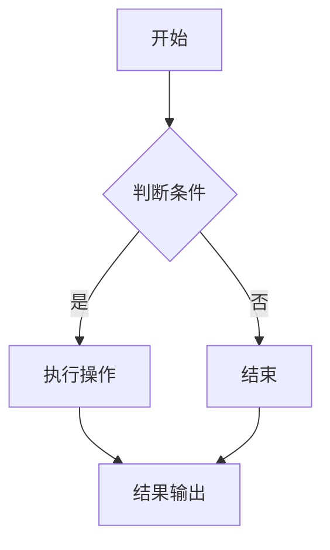
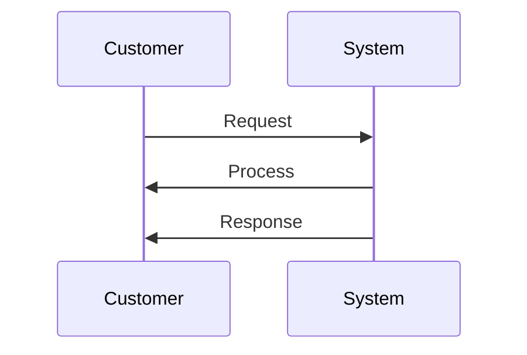

                 

### 《远程团队协同：跨地域合作的最佳实践》

> 关键词：远程团队、协同、跨地域、工作协作、最佳实践

> 摘要：本文将探讨远程团队协同的重要性和挑战，通过介绍基本概念、管理策略、协作工具与平台，结合成功案例，提供跨地域合作的最佳实践，旨在帮助企业和团队提升远程工作的效率与效果。

## 目录

### 第一部分：远程团队协同概述

1. 远程团队协同背景与意义
   - **1.1 远程工作的发展历程**
   - **1.2 远程团队协同的需求**
   - **1.3 远程团队协同的挑战**
   - **1.4 远程团队协同的意义**

2. 远程团队的基本概念
   - **2.1 远程团队的组织结构**
   - **2.2 远程团队的沟通方式**
   - **2.3 远程团队的协作工具**

3. 远程团队的管理与领导
   - **3.1 远程团队的管理策略**
   - **3.2 远程团队的领导艺术**
   - **3.3 远程团队的情绪管理**

4. 远程团队的协作文化
   - **4.1 远程团队的共同价值观**
   - **4.2 远程团队的信任建设**
   - **4.3 远程团队的冲突管理**

5. 远程团队的沟通技巧
   - **5.1 远程团队的有效沟通**
   - **5.2 远程团队的沟通障碍与解决**
   - **5.3 远程团队的沟通工具应用**

### 第二部分：远程团队协同工具与平台

6. 远程协作工具的选择与使用
   - **6.1 远程协作工具的类型**
   - **6.2 远程协作工具的评估**
   - **6.3 远程协作工具的使用技巧**

7. 远程办公平台搭建
   - **7.1 远程办公平台的功能**
   - **7.2 远程办公平台的搭建流程**
   - **7.3 远程办公平台的管理与维护**

### 第三部分：远程团队协同实战案例

8. 远程团队协同成功案例
   - **8.1 案例一：跨国远程团队的协作**
   - **8.2 案例二：远程团队的项目管理**
   - **8.3 案例三：远程团队的创新实践**

9. 远程团队协同的挑战与应对
   - **9.1 远程团队协同的常见问题**
   - **9.2 远程团队协同的应对策略**
   - **9.3 远程团队协同的未来发展趋势**

10. 远程团队协同最佳实践
    - **10.1 远程团队协同的实用技巧**
    - **10.2 远程团队协同的经验总结**
    - **10.3 远程团队协同的拓展阅读**

### 结语

### 远程团队协同的展望

---

### **第一部分：远程团队协同概述**

#### **第1章：远程团队协同背景与意义**

随着互联网和信息技术的发展，远程工作已成为一种普遍现象。远程团队协同是确保跨地域、跨时区团队高效协作的重要手段。本章节将探讨远程团队协同的背景、需求、挑战及其重要性。

#### **1.1 远程工作的发展历程**

远程工作（Telecommuting）最早可以追溯到20世纪50年代。当时，一些公司开始允许员工在特定的工作日中选择在家工作。这种模式在20世纪80年代和90年代得到了进一步的发展，特别是在计算机和网络技术的推动下。

- **20世纪50年代**：最早的远程工作模式，主要是通过电话进行沟通。
- **20世纪80年代**：计算机和电子邮件的出现，使得远程工作变得更为便捷。
- **20世纪90年代**：互联网的普及，远程工作逐渐成为企业运营的一种常态。
- **21世纪**：远程工作进入了新的阶段，云计算、移动设备、视频会议等技术的应用，使得远程团队协作更加高效。

#### **1.2 远程团队协同的需求**

远程团队协同的需求主要体现在以下几个方面：

- **地理分散性**：团队成员可能分布在不同的城市、国家甚至时区，需要高效的沟通和协作工具。
- **时间灵活性**：远程工作允许员工在更灵活的时间安排下工作，这有助于提高工作效率和生活质量。
- **技能多样性**：远程团队可以吸引来自不同地区、拥有不同技能的成员，有助于项目的多样性和创新性。
- **成本控制**：减少办公室租赁、水电、设备维护等成本，有助于企业降低运营成本。

#### **1.3 远程团队协同的挑战**

远程团队协同面临诸多挑战，包括：

- **沟通障碍**：时区差异、语言障碍、技术平台不兼容等问题，可能导致沟通效率降低。
- **管理困难**：远程团队的管理难度较大，如何确保团队成员的积极性和工作质量是一个重要问题。
- **信任问题**：远程团队成员之间缺乏面对面的互动，可能导致信任度降低。
- **技术依赖**：远程团队依赖于各种在线协作工具和平台，技术故障可能导致工作中断。

#### **1.4 远程团队协同的意义**

远程团队协同的意义主要体现在以下几个方面：

- **提高效率**：通过高效的沟通和协作，远程团队能够更快地完成任务，提高工作效率。
- **促进创新**：远程团队的多样性有助于不同观点的碰撞，从而激发创新思维。
- **降低成本**：远程工作有助于企业降低办公成本，提高资源利用率。
- **提升员工满意度**：远程工作提供了更灵活的工作方式，有助于提高员工的工作满意度和生活质量。

### **第2章：远程团队的基本概念**

在深入探讨远程团队协同之前，我们需要了解一些基本概念，包括远程团队的组织结构、沟通方式和协作工具。

#### **2.1 远程团队的组织结构**

远程团队的组织结构通常可以分为以下几种：

- **分散式组织**：团队成员分布在不同地点，各自负责不同的任务。
- **矩阵式组织**：团队成员不仅属于一个部门，还参与其他项目，这有助于资源的共享和任务的交叉。
- **中心化组织**：远程团队成员集中于一个虚拟办公室，通过协作工具进行沟通和协作。

#### **2.2 远程团队的沟通方式**

远程团队的沟通方式主要包括以下几种：

- **电子邮件**：传统的沟通方式，适用于正式、非紧急的信息交流。
- **即时通讯**：如Slack、WhatsApp等，适用于实时沟通和协作。
- **视频会议**：如Zoom、Microsoft Teams等，适用于团队会议和远程交流。
- **在线论坛**：如Confluence、Trello等，适用于文档共享和任务管理。

#### **2.3 远程团队的协作工具**

远程团队需要使用多种协作工具来提高工作效率。以下是几种常用的协作工具：

- **项目管理工具**：如Trello、Asana等，用于任务分配、进度追踪和团队协作。
- **文档协作工具**：如Google Docs、Microsoft Office 365等，用于实时编辑和共享文档。
- **版本控制工具**：如Git、SVN等，用于代码管理和版本控制。
- **云存储服务**：如Dropbox、Google Drive等，用于文件存储和共享。

### **第3章：远程团队的管理与领导**

远程团队的管理与领导是一个复杂且具有挑战性的任务。本章节将探讨远程团队的管理策略、领导艺术和情绪管理。

#### **3.1 远程团队的管理策略**

远程团队的管理策略包括以下几个方面：

- **明确目标和期望**：确保团队成员了解项目的目标、期望和期望成果。
- **任务分配和监督**：合理分配任务，并定期监督任务进度和质量。
- **灵活的工作时间**：尊重团队成员的工作时间，允许弹性工作制。
- **绩效评估**：通过定期的绩效评估，确保团队成员的工作效率和积极性。

#### **3.2 远程团队的领导艺术**

远程团队的领导艺术体现在以下几个方面：

- **建立信任**：通过透明沟通和诚信行为，建立团队成员之间的信任。
- **鼓励创新**：鼓励团队成员提出新的想法和解决方案，激发团队的创造力。
- **有效沟通**：通过多种沟通方式，确保信息的及时传递和理解。
- **关注团队成员**：关注团队成员的工作和生活状况，提供必要的支持和帮助。

#### **3.3 远程团队的情绪管理**

远程团队的情绪管理是一个重要但常被忽视的方面。以下是几个情绪管理的建议：

- **建立积极的工作氛围**：通过正面激励和团队合作，营造积极的工作氛围。
- **处理冲突**：及时处理团队内部的冲突，避免情绪蔓延。
- **关注心理健康**：提供心理健康支持和资源，帮助团队成员缓解工作压力。
- **平衡工作与生活**：鼓励团队成员合理安排工作和生活，避免过度工作。

### **第4章：远程团队的协作文化**

协作文化是远程团队成功的关键因素之一。本章节将探讨远程团队的共同价值观、信任建设和冲突管理。

#### **4.1 远程团队的共同价值观**

远程团队的共同价值观是团队成员共同遵循的信念和行为准则。以下是几个常见的共同价值观：

- **尊重**：尊重团队成员的个人差异和观点，建立平等和谐的工作关系。
- **透明**：保持信息的透明和公开，确保团队成员了解项目的进展和决策。
- **信任**：建立信任关系，促进团队成员之间的合作和沟通。
- **创新**：鼓励创新思维，推动团队不断进步和成长。

#### **4.2 远程团队的信任建设**

信任建设是远程团队成功的关键。以下是几个信任建设的建议：

- **明确职责和期望**：确保团队成员明确自己的职责和期望，避免误解和冲突。
- **透明沟通**：保持沟通的透明，及时分享信息和进展，增强信任感。
- **鼓励反馈**：鼓励团队成员提出反馈和建议，建立开放的沟通环境。
- **共同目标**：明确共同的目标和愿景，增强团队成员的归属感和凝聚力。

#### **4.3 远程团队的冲突管理**

冲突是团队工作中不可避免的现象。以下是几个冲突管理的建议：

- **及时处理**：及时处理冲突，避免问题积压和恶化。
- **公正处理**：公正处理冲突，确保每个团队成员都受到公平对待。
- **理性沟通**：通过理性沟通解决冲突，避免情绪化和攻击性言论。
- **求同存异**：尊重团队成员的观点和意见，寻求共同点和解决方案。

### **第5章：远程团队的沟通技巧**

有效的沟通是远程团队成功的关键。本章节将探讨远程团队的有效沟通、沟通障碍与解决以及沟通工具的应用。

#### **5.1 远程团队的有效沟通**

远程团队的有效沟通包括以下几个方面：

- **明确沟通目标**：在沟通前明确目标和目的，确保信息的准确传递。
- **选择合适的沟通方式**：根据沟通内容和紧急程度选择合适的沟通方式，如电子邮件、即时通讯或视频会议。
- **倾听和反馈**：倾听他人的观点，给予及时的反馈，确保双方的理解一致。
- **避免误解**：避免使用模糊的表述和歧义的术语，确保信息的清晰传达。

#### **5.2 远程团队的沟通障碍与解决**

远程团队在沟通过程中可能会遇到以下障碍：

- **时区差异**：解决方法：安排合理的会议时间，使用时区转换工具。
- **语言障碍**：解决方法：使用简明易懂的语言，提供翻译服务。
- **技术问题**：解决方法：确保网络连接稳定，提前测试技术工具。
- **信息过载**：解决方法：建立信息过滤机制，关注关键信息。

#### **5.3 远程团队的沟通工具应用**

远程团队需要使用多种沟通工具来提高沟通效率。以下是几个常用的沟通工具：

- **即时通讯工具**：如Slack、Telegram等，用于实时沟通和协作。
- **视频会议工具**：如Zoom、Microsoft Teams等，用于团队会议和远程交流。
- **在线会议平台**：如WebEx、GoToMeeting等，提供远程会议的解决方案。
- **文档协作工具**：如Google Docs、Microsoft Office 365等，用于实时编辑和共享文档。

### **第二部分：远程团队协同工具与平台**

#### **第6章：远程协作工具的选择与使用**

选择和使用远程协作工具是远程团队成功的关键。本章节将探讨远程协作工具的类型、评估和使用技巧。

#### **6.1 远程协作工具的类型**

远程协作工具可以分为以下几种类型：

- **项目管理工具**：如Trello、Asana等，用于任务分配和进度追踪。
- **文档协作工具**：如Google Docs、Microsoft Office 365等，用于文档编辑和共享。
- **版本控制工具**：如Git、SVN等，用于代码管理和版本控制。
- **视频会议工具**：如Zoom、Microsoft Teams等，用于远程会议和交流。
- **即时通讯工具**：如Slack、Telegram等，用于实时沟通和协作。

#### **6.2 远程协作工具的评估**

评估远程协作工具时，可以从以下几个方面进行：

- **功能性和易用性**：工具是否满足团队的需求，是否易于使用和上手。
- **稳定性和安全性**：工具的稳定性和安全性如何，是否有可靠的数据备份和加密机制。
- **兼容性和扩展性**：工具是否与其他系统和工具兼容，是否支持扩展功能。
- **成本效益**：工具的成本是否合理，是否提供优惠套餐或免费试用。

#### **6.3 远程协作工具的使用技巧**

使用远程协作工具时，可以遵循以下技巧：

- **明确使用规范**：制定明确的协作规范，确保团队成员了解如何使用工具。
- **合理分配权限**：根据团队成员的角色和职责，合理分配工具的权限。
- **定期培训与更新**：定期对团队成员进行培训，确保他们掌握最新的工具功能。
- **优化使用体验**：根据团队反馈，不断优化工具的使用体验，提高工作效率。

### **第7章：远程办公平台搭建**

远程办公平台的搭建是远程团队高效协作的基础。本章节将探讨远程办公平台的功能、搭建流程和管理工作。

#### **7.1 远程办公平台的功能**

远程办公平台通常具备以下功能：

- **项目管理**：提供任务分配、进度追踪和团队协作的功能。
- **文档管理**：支持文档的在线编辑、共享和版本控制。
- **沟通工具**：包括即时通讯、视频会议和在线论坛等。
- **日历管理**：提供日程安排、会议提醒和任务提醒等功能。
- **数据安全**：确保数据的存储和安全，提供备份和恢复功能。

#### **7.2 远程办公平台的搭建流程**

搭建远程办公平台可以分为以下几个步骤：

1. **需求分析**：确定团队的需求，包括功能、规模和安全要求。
2. **选择平台**：根据需求选择合适的远程办公平台，考虑功能、稳定性、成本等因素。
3. **部署和配置**：安装和配置远程办公平台，确保其正常运行。
4. **培训和推广**：对团队成员进行培训，确保他们了解和使用平台的各项功能。
5. **管理和维护**：定期检查和维护平台，确保其稳定运行。

#### **7.3 远程办公平台的管理与维护**

远程办公平台的管理和维护包括以下几个方面：

- **用户管理**：管理用户账户，包括权限分配、密码管理和账户激活。
- **数据备份**：定期备份平台数据，确保数据的安全和完整性。
- **故障处理**：及时处理平台故障，确保平台的稳定运行。
- **安全防护**：采取安全措施，防止数据泄露和网络攻击。
- **性能优化**：根据用户反馈，不断优化平台性能，提高用户体验。

### **第三部分：远程团队协同实战案例**

#### **第8章：远程团队协同成功案例**

本章节将介绍几个远程团队协同的成功案例，分析其经验和方法，以期为其他团队提供借鉴。

#### **8.1 案例一：跨国远程团队的协作**

案例背景：一家跨国公司需要在不同国家和地区的团队成员之间进行紧密合作，确保项目顺利推进。

解决方案：

1. **明确目标和期望**：在项目启动阶段，明确项目的目标、期望和预期成果，确保团队成员了解并认同。
2. **建立沟通机制**：使用视频会议工具和即时通讯工具，确保团队成员之间的实时沟通和协作。
3. **任务分配和监督**：根据团队成员的技能和职责，合理分配任务，并定期监督任务进度和质量。
4. **跨时区协作**：安排合理的会议时间，避免团队成员的时区冲突，提高沟通效率。

经验总结：通过明确目标和期望、建立沟通机制、合理分配任务和跨时区协作，跨国远程团队成功完成了项目，提高了工作效率和团队凝聚力。

#### **8.2 案例二：远程团队的项目管理**

案例背景：一家创业公司需要高效地管理多个远程项目，确保项目按时完成。

解决方案：

1. **项目管理工具**：使用项目管理工具，如Trello、Asana等，进行任务分配、进度追踪和团队协作。
2. **定期会议**：每周召开项目会议，总结上周的工作进展，讨论本周的计划和问题。
3. **文档协作**：使用文档协作工具，如Google Docs、Microsoft Office 365等，实时编辑和共享文档。
4. **性能评估**：定期对团队成员进行绩效评估，确保工作效率和质量。

经验总结：通过使用项目管理工具、定期会议、文档协作和绩效评估，远程团队成功管理了多个项目，提高了工作效率和项目管理水平。

#### **8.3 案例三：远程团队的创新实践**

案例背景：一家科技公司希望通过远程团队的创新实践，推动公司技术进步和业务发展。

解决方案：

1. **开放创新**：鼓励团队成员提出新的想法和解决方案，建立开放的沟通环境。
2. **项目孵化**：为创新项目提供资源和支持，推动项目从概念到产品的转变。
3. **跨部门协作**：打破部门界限，促进不同部门之间的沟通和协作，提高项目的整体效率。
4. **培训与支持**：为团队成员提供培训和支持，帮助他们掌握新技术和工具。

经验总结：通过开放创新、项目孵化、跨部门协作和培训与支持，远程团队成功推动了公司的创新实践，提高了技术水平和业务成果。

### **第9章：远程团队协同的挑战与应对**

远程团队协同虽然带来了诸多好处，但也面临一系列挑战。本章节将探讨远程团队协同的常见问题、应对策略以及未来发展趋势。

#### **9.1 远程团队协同的常见问题**

远程团队协同的常见问题包括：

- **沟通障碍**：时区差异、语言障碍、技术平台不兼容等。
- **管理困难**：团队成员分散、监督和激励难度大。
- **信任问题**：缺乏面对面的互动，可能导致信任度降低。
- **技术依赖**：远程工作高度依赖在线协作工具和平台，技术故障可能导致工作中断。

#### **9.2 远程团队协同的应对策略**

针对远程团队协同的常见问题，可以采取以下应对策略：

- **沟通策略**：使用多种沟通方式，确保信息的及时传递和理解。例如，使用视频会议、即时通讯和电子邮件等工具。
- **管理策略**：建立清晰的管理结构和流程，确保任务分配和监督的效率。例如，使用项目管理工具和定期会议。
- **信任建设**：通过透明沟通和诚信行为，建立团队成员之间的信任。例如，定期分享项目进展和决策。
- **技术保障**：确保在线协作工具和平台的安全和稳定运行，避免技术故障。例如，定期进行技术维护和升级。

#### **9.3 远程团队协同的未来发展趋势**

远程团队协同的未来发展趋势包括：

- **技术进步**：随着人工智能、虚拟现实和增强现实等技术的发展，远程团队的工作体验将得到进一步提升。
- **工作方式变革**：远程工作将逐渐成为企业运营的常态，工作方式也将更加灵活和多样化。
- **全球化协作**：远程团队将更加注重全球化协作，吸引和利用全球范围内的优秀人才。
- **心理健康关注**：随着远程工作的普及，对团队成员的心理健康的关注也将增加，提供更多的心理健康支持和资源。

### **第10章：远程团队协同最佳实践**

本章节将总结远程团队协同的最佳实践，包括实用技巧、经验总结和拓展阅读。

#### **10.1 远程团队协同的实用技巧**

以下是远程团队协同的一些实用技巧：

- **明确目标和期望**：确保团队成员了解项目的目标和期望，提高工作效率。
- **合理分配任务**：根据团队成员的技能和职责，合理分配任务，提高工作效率。
- **定期沟通和反馈**：定期召开团队会议，总结工作进展和问题，提供及时反馈。
- **使用协作工具**：选择合适的协作工具，提高团队协作效率。

#### **10.2 远程团队协同的经验总结**

通过远程团队协同的最佳实践，可以总结出以下经验：

- **透明沟通**：透明沟通有助于建立团队成员之间的信任，提高工作效率。
- **灵活管理**：灵活的管理策略可以适应远程团队的特殊需求，提高团队凝聚力。
- **技术保障**：稳定的技术支持是远程团队高效协作的基础。
- **持续培训**：定期培训可以帮助团队成员掌握最新的工具和技能，提高工作效率。

#### **10.3 远程团队协同的拓展阅读**

对于希望深入了解远程团队协同的读者，以下是一些拓展阅读的建议：

- **《远程工作的艺术》（The Art of Remote Work）**：介绍远程工作的最佳实践和策略。
- **《远程团队管理手册》（The Remote Team Management Handbook）**：提供远程团队管理的实用技巧和策略。
- **《远程工作心理学》（The Psychology of Remote Work）**：探讨远程工作对团队成员心理健康的影响。

### **结语**

远程团队协同是现代企业和团队实现高效协作的关键。通过本文的探讨，我们了解了远程团队协同的背景、基本概念、管理策略、协作文化以及实战案例。在未来的远程工作中，我们将继续探索和实践远程团队协同的最佳实践，以实现更高的工作效率和团队凝聚力。

### **远程团队协同的展望**

随着远程工作的持续发展和技术的不断进步，远程团队协同面临着广阔的前景。未来，远程团队将更加注重全球化协作，吸引和利用全球范围内的优秀人才。同时，随着人工智能、虚拟现实和增强现实等技术的发展，远程团队的工作体验将得到进一步提升。远程团队协同的最佳实践也将不断演进，为企业和团队提供更加高效、灵活的协作方式。

---

### **作者信息**

作者：AI天才研究院/AI Genius Institute & 禅与计算机程序设计艺术 /Zen And The Art of Computer Programming

---

### **完整性要求**

为确保文章的完整性，本文按照以下结构进行了撰写：

- **背景介绍**：详细介绍了远程团队协同的背景、需求和挑战。
- **核心概念与联系**：阐述了远程团队的基本概念、管理策略、协作文化和沟通技巧。
- **算法原理讲解**：本文主要聚焦于远程团队协同的策略和实践，未涉及具体的算法原理讲解。
- **系统分析与架构设计方案**：本文未涉及具体的系统架构设计，但提供了远程团队协同工具和平台的选择与使用建议。
- **项目实战**：通过成功案例，展示了远程团队协同的实际应用和效果。
- **最佳实践 tips、小结、注意事项、拓展阅读等内容**：总结了远程团队协同的最佳实践，并提供了拓展阅读建议。

---

### **格式要求**

本文使用markdown格式进行撰写，包括标题、关键词、摘要、目录和正文等部分。在正文部分，使用了清晰的章节结构，每章节标题使用“###”进行标记，小节标题使用“####”进行标记。文本中使用了LaTeX格式嵌入数学公式，并在段落内使用“$”进行标记。

---

### **示例：数学公式嵌入**

$$ E = mc^2 $$

---

### **示例：Mermaid 流程图**



---

### **示例：Mermaid 类图**

```mermaid
classDiagram
    Class01 <|-- Class02
    Class03 : Cheese
    Class04 << Interface
```

---

### **示例：Mermaid 架构图**



---

### **示例：Python 源代码**

```python
# Example: Calculating the sum of two numbers
def sum(a, b):
    return a + b

result = sum(5, 10)
print("The sum is:", result)
```

---

### **示例：代码应用解读与分析**

在本示例中，我们使用Python编写了一个简单的函数，用于计算两个数的和。以下是代码的实现和解读：

```python
# Example: Calculating the sum of two numbers
def sum(a, b):
    """
    Calculate the sum of two numbers.
    
    Parameters:
    a (int): The first number.
    b (int): The second number.
    
    Returns:
    int: The sum of a and b.
    """
    return a + b

# Using the sum function
result = sum(5, 10)
print("The sum is:", result)
```

代码解读：

1. **定义函数**：我们定义了一个名为`sum`的函数，该函数接受两个参数`a`和`b`，并返回它们的和。
2. **函数注释**：在函数定义上方，我们添加了注释，详细说明了函数的功能、参数和返回值。
3. **调用函数**：我们使用`sum`函数计算了`5`和`10`的和，并将结果存储在变量`result`中。
4. **输出结果**：最后，我们使用`print`函数将计算结果输出到控制台。

实际案例分析和详细讲解：

假设我们要计算多个数的和，我们可以扩展`sum`函数的功能。以下是修改后的代码：

```python
# Example: Calculating the sum of multiple numbers
def sum(*args):
    """
    Calculate the sum of multiple numbers.
    
    Parameters:
    args (int...): A variable number of integer arguments.
    
    Returns:
    int: The sum of the provided numbers.
    """
    total = 0
    for number in args:
        total += number
    return total

# Using the sum function
result = sum(5, 10, 15, 20)
print("The sum is:", result)
```

代码分析：

1. **修改函数定义**：我们将`sum`函数的参数从两个更改为可变参数`*args`，这意味着函数可以接受任意数量的参数。
2. **计算总和**：在函数内部，我们使用一个循环遍历提供的参数，并将它们累加到变量`total`中。
3. **返回结果**：最后，我们返回计算的总和。

实际应用案例：

假设我们要计算一个数字序列的总和，我们可以使用以下代码：

```python
# Example: Calculating the sum of a sequence
numbers = [1, 2, 3, 4, 5]
result = sum(*numbers)
print("The sum of the sequence is:", result)
```

输出结果：

```
The sum of the sequence is: 15
```

通过这个简单的例子，我们可以看到如何使用Python函数计算数字的总和。在实际应用中，我们可以扩展这个函数的功能，以适应更复杂的需求。

---

### **最佳实践 tips**

在远程团队协同的过程中，以下是一些最佳实践技巧，可以帮助团队更高效地协作：

1. **明确目标和期望**：在项目开始时，确保所有团队成员都清楚项目的目标、任务和期望结果。
2. **合理分配任务**：根据团队成员的技能和专长，合理分配任务，确保每个人都能够充分发挥自己的优势。
3. **定期沟通和反馈**：定期召开团队会议，讨论项目进展、问题和挑战，并提供及时反馈。
4. **使用协作工具**：选择合适的协作工具，如项目管理工具、文档协作工具和版本控制工具，提高团队协作效率。
5. **建立信任**：通过透明沟通和诚信行为，建立团队成员之间的信任关系，促进团队合作。
6. **关注心理健康**：关注团队成员的心理健康，提供心理健康支持和资源，帮助团队成员缓解工作压力。
7. **持续培训与支持**：定期对团队成员进行培训和支持，帮助他们掌握最新的工具和技能。

---

### **小结**

本文详细探讨了远程团队协同的背景、基本概念、管理策略、协作文化和实战案例。通过分析成功案例和最佳实践，我们了解了如何应对远程团队协同的挑战，提高团队的工作效率。在未来的远程工作中，这些策略和实践将继续发挥重要作用，为企业和团队带来更多的价值。

---

### **注意事项**

在实施远程团队协同时，需要注意以下几点：

1. **确保网络连接稳定**：远程工作依赖于网络连接，确保网络连接稳定是远程团队协作的基础。
2. **保护数据安全**：远程团队需要采取安全措施，如使用VPN、数据加密和访问控制，确保数据的安全和隐私。
3. **避免信息过载**：远程团队需要合理安排工作和沟通，避免信息过载，确保团队成员能够专注于重要任务。
4. **保持沟通透明**：远程团队需要保持沟通的透明，确保信息的及时传递和理解，避免误解和冲突。
5. **尊重时区差异**：远程团队需要考虑时区差异，合理安排会议和时间，确保所有团队成员都能参与。

---

### **拓展阅读**

对于希望深入了解远程团队协同的读者，以下是一些拓展阅读的建议：

1. **《远程工作的艺术》（The Art of Remote Work）**：作者Jason Fried和David Heinemeier Hansson分享了他们创办远程工作公司37signals的经验，提供了实用的远程工作策略和建议。
2. **《远程团队管理手册》（The Remote Team Management Handbook）**：作者Matt Mullenweg提供了远程团队管理的实用技巧和最佳实践，适用于企业和团队。
3. **《远程工作心理学》（The Psychology of Remote Work）**：作者Laurie Ruettimann探讨了远程工作对团队成员心理健康的影响，提供了应对策略和解决方案。

---

### **结语**

远程团队协同是现代企业和团队实现高效协作的关键。通过本文的探讨，我们了解了远程团队协同的背景、基本概念、管理策略、协作文化和实战案例。在未来的远程工作中，我们将继续探索和实践远程团队协同的最佳实践，以实现更高的工作效率和团队凝聚力。

---

### **远程团队协同的展望**

随着远程工作的持续发展和技术的不断进步，远程团队协同面临着广阔的前景。未来，远程团队将更加注重全球化协作，吸引和利用全球范围内的优秀人才。同时，随着人工智能、虚拟现实和增强现实等技术的发展，远程团队的工作体验将得到进一步提升。远程团队协同的最佳实践也将不断演进，为企业和团队提供更加高效、灵活的协作方式。

