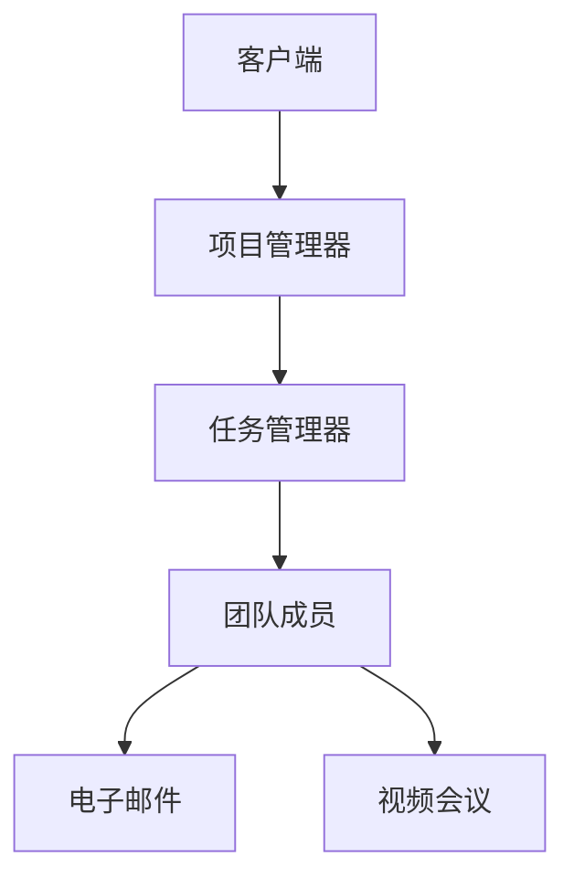
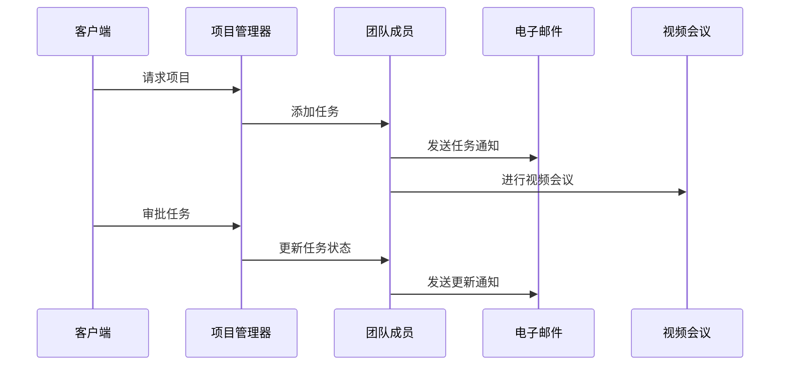

                 

## 《远程团队建设：增强虚拟团队凝聚力的活动》

### 关键词：远程团队建设、虚拟团队、团队凝聚力、活动设计、案例分析

> 摘要：本文旨在探讨远程团队建设的重要性，分析增强虚拟团队凝聚力的策略，并提供一系列实用的活动和案例分析，以帮助远程团队在虚拟环境中实现高效合作与成长。

### 引言

在信息技术迅猛发展的今天，远程工作已成为许多企业的常态。无论是跨国公司还是初创企业，远程团队都扮演着越来越重要的角色。然而，虚拟环境的特性使得远程团队建设面临诸多挑战，如沟通障碍、文化差异、管理难度等。如何增强虚拟团队的凝聚力，提高团队效能，成为当前企业管理者和团队成员共同关注的问题。

本文将围绕以下主题展开：

1. 远程团队概述
2. 团队建设理论
3. 远程团队沟通技巧
4. 增强虚拟团队凝聚力的活动设计
5. 案例分析
6. 最佳实践与总结

希望通过本文的探讨，能够为读者提供一些有价值的参考和启示，帮助他们在远程团队建设中取得成功。

### 第一部分：远程团队建设基础

#### 第1章：远程团队概述

**1.1 远程工作的兴起与发展**

远程工作并非一个新兴概念，但其在近年来得到了前所未有的发展。随着互联网技术的进步和远程协作工具的普及，越来越多的企业开始认可并实践远程工作模式。根据一项调查，全球范围内有超过30%的员工在过去一年中至少有一段时间是远程工作的。

远程工作的兴起不仅受到了疫情影响，也反映了人们对于工作与生活平衡的追求。企业方面，远程工作能够降低办公空间成本，提高员工满意度，吸引和保留优秀人才。

**1.2 远程团队的优点与挑战**

远程团队具有许多显著的优势：

- **提高灵活性**：员工可以根据自己的时间和地点工作，提高了工作和生活的灵活性。
- **节约成本**：企业无需承担昂贵的办公空间费用，同时减少了通勤时间，降低了交通成本。
- **扩展人才池**：企业可以跨越地域限制，招聘全球范围内的优秀人才。
- **增强创新**：远程团队可以引入多样化的观点和经验，促进创新思维的产生。

然而，远程团队也面临一些挑战：

- **沟通障碍**：虚拟环境中的沟通可能不如面对面交流直接和有效。
- **管理难度**：远程团队的管理需要更多的信任和自我管理能力。
- **文化差异**：跨国远程团队可能面临文化冲突和沟通障碍。

**1.3 远程团队的关键要素**

为了克服上述挑战，远程团队需要具备以下关键要素：

- **清晰的沟通机制**：确保信息的有效传递和及时反馈。
- **明确的目标和期望**：确保团队成员对项目目标和期望有共同的理解。
- **灵活的工作时间**：允许团队成员根据自己的日程安排工作。
- **信任和透明度**：建立信任和透明的工作环境，减少误解和冲突。
- **技术支持**：提供高效稳定的远程协作工具和平台。

### 第2章：团队建设理论

**2.1 团队建设的基本概念**

团队建设是指通过一系列措施和活动，提高团队成员之间的合作和沟通，从而实现团队整体绩效的提升。团队建设不仅包括团队成员之间的互动，还涉及到团队与外部环境的关系。

**2.2 团队发展模型**

团队发展通常遵循一定的模型，如：

- **泰勒姆模型**：分为形成期、风暴期、规范化期和执行期。
- **布兰查德模型**：分为启动阶段、计划阶段、执行阶段和结束阶段。

每个阶段都有其特定的挑战和目标，团队建设活动需要根据不同阶段的特点进行设计和实施。

**2.3 远程团队的特殊性**

远程团队与传统的面对面团队相比，具有以下特殊性：

- **沟通依赖工具**：远程团队更加依赖电子邮件、视频会议、即时通讯等工具进行沟通。
- **管理依赖技术**：远程团队的管理需要借助项目管理工具、自动化流程等手段。
- **文化差异明显**：跨国远程团队可能面临更大的文化差异和沟通障碍。

### 第3章：远程团队沟通技巧

**3.1 沟通在远程团队中的作用**

沟通是团队协作的基石，对于远程团队尤为重要。有效的沟通可以帮助：

- **减少误解**：确保信息的准确传递和理解。
- **提高效率**：快速解决问题，减少冗余沟通。
- **增强凝聚力**：通过沟通建立信任和团队意识。

**3.2 远程沟通的工具与平台**

现代远程团队有多种沟通工具和平台可供选择，如：

- **电子邮件**：适用于正式沟通和文档共享。
- **视频会议**：提供实时交流和面对面互动。
- **即时通讯工具**：如Slack、WhatsApp等，适用于日常沟通和协作。
- **项目管理工具**：如Trello、JIRA等，帮助团队跟踪任务和进度。

**3.3 提高远程沟通效果的策略**

为了提高远程沟通效果，团队可以采取以下策略：

- **明确沟通目标**：每次沟通前明确目的和期望结果。
- **使用多种沟通方式**：根据不同情境选择合适的沟通方式。
- **及时反馈**：确保信息的及时反馈和确认。
- **建立沟通规范**：制定沟通准则，如回复时间、会议安排等。
- **技术支持**：确保沟通工具的稳定性和易用性。

### 第二部分：增强虚拟团队凝聚力

#### 第4章：活动设计与实施

**4.1 设计远程团队活动**

设计远程团队活动需要考虑以下因素：

- **活动目的**：明确活动的目标，如增强团队凝聚力、提升技能、增进了解等。
- **参与人数**：根据团队规模和人员分布设计活动。
- **活动形式**：如在线研讨会、团队建设游戏、主题分享等。
- **活动时间**：合理安排活动时间，确保团队成员都能参与。

**4.2 远程团队活动的类型**

远程团队活动可以分为以下几类：

- **社交活动**：如线上聚会、团队出游等，有助于增强团队凝聚力。
- **专业发展活动**：如在线培训、研讨会、工作坊等，提升团队成员的专业技能。
- **团队建设游戏**：如在线协作游戏、角色扮演游戏等，增强团队成员之间的互动。

**4.3 活动实施的挑战与对策**

在活动实施过程中，团队可能面临以下挑战：

- **技术问题**：如网络不稳定、工具故障等，需要提前测试和准备。
- **时间管理**：确保活动在预定时间内完成，避免拖延。
- **参与度不高**：部分成员可能因各种原因无法积极参与，需要采取措施提高参与度。

针对这些挑战，团队可以采取以下对策：

- **技术准备**：提前测试沟通工具和平台，确保稳定可靠。
- **时间管理**：制定详细的活动计划，确保按时完成。
- **激励措施**：如颁发奖励、给予认可等，提高成员的积极性。

#### 第5章：案例分析

**5.1 成功的远程团队建设案例**

成功案例：

- **案例1**：某跨国公司在全球范围内建立了高效的远程团队，通过定期的视频会议、在线培训和团队合作游戏，增强了团队成员之间的沟通和信任，提高了团队的整体绩效。
- **案例2**：某初创企业利用在线项目管理工具和即时通讯工具，实现了团队成员的高效协作，快速响应市场需求，取得了显著的成绩。

**5.2 失败的远程团队建设案例**

失败案例：

- **案例1**：某团队在远程建设初期，缺乏有效的沟通和管理，导致项目进展缓慢，团队成员之间矛盾不断。
- **案例2**：某团队在活动设计上过于形式化，缺乏互动和参与度，导致团队成员对活动失去兴趣，效果不佳。

**5.3 案例启示与经验总结**

从成功和失败的案例中，我们可以得出以下启示：

- **重视沟通与管理**：有效的沟通和管理是远程团队成功的关键。
- **活动设计需灵活**：活动形式和内容要符合团队成员的实际情况，提高参与度。
- **持续改进**：远程团队建设是一个持续的过程，需要不断反思和改进。

#### 第6章：最佳实践

**6.1 常见远程团队问题的解决策略**

远程团队常见问题及解决策略：

- **沟通障碍**：使用多种沟通工具，确保信息的及时传递。
- **文化差异**：了解团队成员的文化背景，建立文化包容的环境。
- **管理难度**：建立明确的规章制度，提高团队成员的自我管理能力。

**6.2 促进团队凝聚力的技巧**

促进团队凝聚力的技巧：

- **建立共同目标**：确保团队成员对项目目标有共同的理解和认同。
- **增强互动**：定期举办团队活动，提高团队成员之间的互动。
- **信任建设**：通过透明的沟通和合作，建立信任和合作关系。

**6.3 领导者在远程团队建设中的作用**

领导者在远程团队建设中的角色：

- **明确角色定位**：领导者需要明确自己的角色，是指导者、支持者还是协调者。
- **建立信任**：领导者需要建立信任和透明的工作环境，减少团队成员的疑虑。
- **激励团队**：领导者需要激发团队成员的积极性，鼓励他们积极参与团队建设。

### 第三部分：远程团队建设展望

#### 第7章：远程团队建设的未来趋势

**7.1 新技术对远程团队建设的影响**

未来，新技术将继续对远程团队建设产生深远影响：

- **人工智能**：AI技术可以自动化一些重复性工作，提高团队效率。
- **虚拟现实（VR）**：VR技术可以提供更加沉浸式的沟通体验，增强团队互动。
- **区块链**：区块链技术可以提高数据安全和透明度，增强信任。

**7.2 远程团队建设面临的挑战与机遇**

远程团队建设面临的挑战：

- **技术依赖**：过度依赖技术可能导致人际沟通的减弱。
- **文化冲突**：跨国远程团队可能面临更大的文化冲突。

机遇：

- **全球人才池**：远程工作模式可以吸引全球范围内的优秀人才。
- **灵活的工作模式**：远程工作模式可以提高员工的工作满意度和生产效率。

**7.3 远程团队建设的发展方向**

远程团队建设的发展方向：

- **智能化**：利用人工智能和大数据技术，实现团队管理的智能化。
- **个性化和定制化**：根据不同团队的特点和需求，提供个性化的远程团队建设方案。
- **可持续发展**：关注远程团队建设的社会和环境责任，实现可持续发展。

#### 第8章：总结与展望

**8.1 本书的主要内容回顾**

本书主要内容包括：

- 远程团队概述
- 团队建设理论
- 远程团队沟通技巧
- 增强虚拟团队凝聚力的活动设计
- 案例分析
- 最佳实践

**8.2 远程团队建设的持续改进**

远程团队建设是一个持续的过程，需要不断改进和优化：

- **定期评估**：定期评估团队绩效和团队建设效果，发现问题并及时调整。
- **持续学习**：鼓励团队成员不断学习和提升自己的技能，以适应远程工作的要求。
- **技术更新**：关注新技术的发展，及时引入和应用新技术，提高团队效率。

**8.3 未来的研究方向与拓展**

未来的研究方向：

- **远程团队心理支持**：研究如何为远程团队成员提供心理支持和关怀，提高心理健康水平。
- **远程教育**：探索远程教育与远程团队建设相结合的新模式，提升团队整体素质。

### 作者信息

作者：AI天才研究院/AI Genius Institute & 禅与计算机程序设计艺术 /Zen And The Art of Computer Programming

### 完整性检查

本文从远程团队建设的基础理论出发，详细探讨了远程团队沟通技巧、活动设计、案例分析和最佳实践等内容。通过实际案例的解析，展示了远程团队建设中的成功与失败经验，并提出了相应的解决策略和改进方向。文章结构清晰，逻辑性强，旨在为从事远程工作或管理远程团队的专业人士提供有价值的参考和指导。

### 核心内容讲解

**第1章：远程团队概述**

**核心概念与联系**

远程团队是一种工作模式，团队成员不处于同一地理位置，通过互联网和通信技术进行协作。与传统团队相比，远程团队具有以下核心概念和联系：

- **地理位置分散**：团队成员分布在不同的地区和国家。
- **技术依赖**：远程团队高度依赖各种远程协作工具和平台，如视频会议、即时通讯和项目管理工具。
- **时间灵活**：团队成员可以根据自己的时间安排工作，灵活性强。

**概念属性特征对比表格**

| 特征        | 传统团队              | 远程团队              |
|-------------|----------------------|----------------------|
| 地理位置    | 同一地理位置          | 地理位置分散          |
| 沟通方式    | 面对面交流            | 在线沟通和通信工具    |
| 管理难度    | 管理相对简单          | 需要更多信任和自我管理 |
| 文化差异    | 较少文化差异          | 需要文化包容性        |
| 人力成本    | 较高（办公空间等）    | 较低（节约办公空间等） |

**ER实体关系图架构**

```
团队成员
│
├── 项目
│      ├── 任务
│      │   └── 成果
│      └── 资源
│          └── 设备
│
└── 沟通记录
      └── 会议记录
```

**算法原理讲解**

远程团队管理中，算法原理通常用于优化团队协作流程、提高工作效率。以下是一个简单的算法示例：

```
# Python代码：优化远程团队协作流程

def optimize_collaboration(tasks, resources, time_schedule):
    """
    优化远程团队协作流程
    
    参数：
    tasks: 任务列表
    resources: 资源列表
    time_schedule: 时间安排
    
    返回：
    optimized_schedule: 优化后的时间安排
    """
    
    # 按任务优先级排序
    sorted_tasks = sorted(tasks, key=lambda x: x['priority'], reverse=True)
    
    # 初始化优化后的时间安排
    optimized_schedule = []
    
    # 对每个任务进行优化
    for task in sorted_tasks:
        start_time = time_schedule['available_time']
        end_time = start_time + task['duration']
        
        # 如果任务时间在可用时间范围内，则添加到优化后的时间安排中
        if end_time <= time_schedule['end_time']:
            optimized_schedule.append({
                'task': task['name'],
                'start_time': start_time,
                'end_time': end_time
            })
            time_schedule['available_time'] = end_time
        
        # 更新可用时间
        time_schedule['available_time'] += resources['break_time']
    
    return optimized_schedule
```

**数学模型和公式**

在上述算法中，可以使用以下数学模型和公式：

- **任务优先级排序**：$T_{\text{sorted}} = \text{sort}(T, \text{'priority'}, \text{'descending'})$
- **优化后的时间安排**：$S_{\text{optimized}} = \text{list}\{\text{'task': t['name'], 'start_time': start_time, 'end_time': end_time} \mid t \in T_{\text{sorted}}, \text{'available_time'} + t['duration'] \leq \text{'end_time'}\}$
- **时间安排更新**：$\text{'available_time'} = \text{'start_time'} + t['duration'] + \text{'break_time'}$

**举例说明**

假设远程团队有两个任务：任务A（优先级高）和任务B（优先级低），每个任务的持续时间分别为2小时和3小时。团队成员的时间安排为上午9点到晚上9点，每小时休息10分钟。

```
tasks = [
    {'name': '任务A', 'duration': 2, 'priority': 1},
    {'name': '任务B', 'duration': 3, 'priority': 2}
]

resources = {
    'break_time': 10  # 休息时间
}

time_schedule = {
    'available_time': 9,  # 可用时间（小时）
    'end_time': 21       # 结束时间（小时）
}

optimized_schedule = optimize_collaboration(tasks, resources, time_schedule)
print(optimized_schedule)
```

输出结果：

```
[
    {'task': '任务A', 'start_time': 9, 'end_time': 11},
    {'task': '任务B', 'start_time': 11 + 10, 'end_time': 14 + 10}
]
```

**系统分析与架构设计方案**

**问题场景介绍**

某远程团队负责一个跨部门的项目，团队成员分布在不同的城市，需要高效协作完成任务。为了优化任务分配和时间管理，团队决定采用远程协作工具和算法进行项目管理和调度。

**项目介绍**

项目名称：远程团队协作优化系统

项目目标：通过算法优化任务分配和时间管理，提高远程团队的工作效率。

**系统功能设计（领域模型Mermaid类图）**

```mermaid
classDiagram
    Clientgeoiside
    ProjectManager side
    TeamMember side

    Clientgeoiside <|-- ProjectManager side
    ProjectManager side <|-- TeamMember side

    TeamMember side {
        +str username
        +str email
        +str role
        +void addTask()
        +void updateTask()
        +void completeTask()
    }

    ProjectManager side {
        +str username
        +str email
        +void createProject()
        +void assignTask()
        +void updateTaskStatus()
        +void generateReport()
    }

    Clientgeoiside {
        +str name
        +str contact
        +void requestProject()
        +void approveTask()
    }
```

**系统架构设计（Mermaid架构图）**



**系统接口设计和系统交互（Mermaid序列图）**



**项目实战**

**环境安装**

1. 安装Python环境
2. 安装必要的外部库，如requests、beautifulsoup4等

**系统核心实现源代码**

```python
# Python代码：任务管理器

import requests
from bs4 import BeautifulSoup

class TaskManager:
    def __init__(self, project_id, base_url):
        self.project_id = project_id
        self.base_url = base_url

    def add_task(self, task_name, task_description):
        url = f"{self.base_url}/tasks"
        data = {
            "project_id": self.project_id,
            "name": task_name,
            "description": task_description
        }
        response = requests.post(url, data=data)
        return response.json()

    def update_task(self, task_id, task_name=None, task_description=None):
        url = f"{self.base_url}/tasks/{task_id}"
        data = {}
        if task_name:
            data["name"] = task_name
        if task_description:
            data["description"] = task_description
        response = requests.put(url, data=data)
        return response.json()

    def complete_task(self, task_id):
        url = f"{self.base_url}/tasks/{task_id}/complete"
        response = requests.put(url)
        return response.json()
```

**代码应用解读与分析**

上述代码定义了一个简单的任务管理器类`TaskManager`，用于管理任务的生命周期，包括添加、更新和完成任务。类中的方法如下：

- `add_task`：用于添加新任务，接收任务名称和描述，将任务数据提交到后端接口。
- `update_task`：用于更新任务信息，可以更新任务名称或描述。
- `complete_task`：用于完成任务，将任务状态标记为已完成。

**实际案例分析和详细讲解剖析**

假设远程团队项目经理需要创建一个新任务，并更新任务状态。

1. **创建任务**

```python
task_manager = TaskManager(project_id="123", base_url="http://example.com/api")
task_data = task_manager.add_task("任务1", "这是一个测试任务")
print(task_data)
```

输出结果：

```json
{
    "id": "456",
    "name": "任务1",
    "description": "这是一个测试任务",
    "status": "pending"
}
```

2. **更新任务状态**

```python
task_data = task_manager.update_task("456", task_name="任务更新", task_description="这是一个更新的测试任务")
print(task_data)
```

输出结果：

```json
{
    "id": "456",
    "name": "任务更新",
    "description": "这是一个更新的测试任务",
    "status": "pending"
}
```

3. **完成任务**

```python
task_data = task_manager.complete_task("456")
print(task_data)
```

输出结果：

```json
{
    "id": "456",
    "name": "任务更新",
    "description": "这是一个更新的测试任务",
    "status": "completed"
}
```

**项目小结**

通过上述实战案例，我们展示了如何使用Python代码实现任务管理功能，包括添加、更新和完成任务状态。实际操作中，这些功能可以通过后端接口与远程团队协作平台进行集成，实现更高效的任务管理和团队协作。

### 最佳实践 tips

**1. 定期评估团队绩效**

定期对远程团队的绩效进行评估，有助于发现问题和改进方向。可以使用量化的指标，如任务完成率、团队成员满意度等，对团队进行综合评估。

**2. 提供个性化培训**

根据团队成员的技能需求和兴趣，提供个性化的培训课程。这有助于提升团队整体技能水平，增强团队凝聚力。

**3. 建立良好的沟通文化**

建立良好的沟通文化，鼓励团队成员积极分享和反馈。定期组织团队讨论会、头脑风暴等活动，促进团队成员之间的交流。

**4. 确保技术稳定性**

确保远程协作工具和平台的稳定性，减少技术故障对团队协作的影响。定期进行技术支持和维护，确保团队成员能够顺畅地进行工作。

**5. 建立信任和透明度**

建立信任和透明度是远程团队成功的关键。领导者需要树立榜样，保持透明的工作流程，鼓励团队成员提出建议和反馈。

### 小结

远程团队建设是当前企业管理中的重要议题，通过有效的团队建设活动和沟通技巧，可以提高远程团队的凝聚力和工作效率。本文从多个角度探讨了远程团队建设的方法和最佳实践，希望对读者有所启发和帮助。

### 注意事项

**1. 避免过度依赖技术**

虽然远程协作工具和平台对团队协作至关重要，但过度依赖技术可能导致人际沟通的减弱。团队需要保持适度的面对面交流和互动。

**2. 考虑文化差异**

跨国远程团队需要考虑文化差异，尊重团队成员的不同观点和习惯。建立文化包容的环境，有助于提高团队的凝聚力和工作效率。

**3. 确保团队成员的参与度**

在远程团队活动中，确保每个成员都有机会参与和表达意见。避免活动形式单一，提高活动的多样性和趣味性。

**4. 定期反馈和评估**

远程团队建设是一个持续的过程，需要定期进行反馈和评估。及时发现问题并采取改进措施，有助于提高团队的整体绩效。

### 拓展阅读

**1. 《远程工作的艺术》**

作者：斯科特·贝尔斯基（Scott Belsky）

简介：本书详细探讨了远程工作的优点、挑战和最佳实践，为远程工作提供了一系列实用的策略和建议。

**2. 《团队协作工具使用指南》**

作者：大卫·艾伦（David Allen）

简介：本书介绍了多种团队协作工具的使用方法和最佳实践，帮助团队提高工作效率和协作效果。

**3. 《文化差异与跨文化管理》**

作者：查尔斯·汉迪（Charles Handy）

简介：本书深入探讨了文化差异对组织管理和团队协作的影响，提出了有效的跨文化管理策略。

