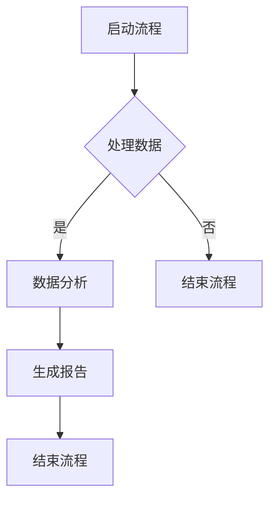

                 


# 远程团队激励：保持分散团队积极性的技巧

关键词：远程团队、激励、积极性、沟通技巧、工作环境、目标设定、技术工具

摘要：本文将深入探讨远程团队激励的重要性以及如何通过一系列策略来保持分散团队的高积极性。我们将从背景介绍、核心概念与联系、激励理论、远程团队激励策略、技术工具与平台、案例分析、最佳实践与策略以及小结与拓展阅读等多个方面进行详细阐述，旨在为IT领域的专业人士提供实用的指导和参考。

## 1. 背景介绍

### 1.1 远程工作的兴起

随着互联网技术的飞速发展，远程工作已成为现代工作方式的一种重要形式。无论是在家办公，还是在不同的城市、国家工作，远程工作都为员工提供了更大的灵活性。然而，远程工作也带来了一系列的挑战，如沟通障碍、团队凝聚力下降、工作环境差异等。因此，如何保持远程团队的积极性成为一个亟待解决的问题。

### 1.2 远程工作的优势与挑战

远程工作有诸多优势，如节省通勤时间、提高工作效率、降低企业成本等。但与此同时，远程工作也面临一些挑战，如缺乏面对面的交流、工作与生活界限模糊、自我管理能力要求高等。这些问题如果不妥善解决，可能会影响团队的整体积极性。

### 1.3 为什么需要激励

激励是激发人们内在动机的重要因素，对于远程团队尤为重要。通过激励，可以提高员工的满意度和忠诚度，增强团队凝聚力，从而保持团队的积极性。

### 1.4 激励在远程团队中的重要性

在远程团队中，激励不仅可以帮助员工克服工作中的困难，还能促进团队协作和创新。有效的激励策略能够激发员工的潜力，提高团队的整体绩效。

## 2. 核心概念与联系

### 2.1 关键概念定义

为了更好地理解远程团队激励，我们需要先明确一些关键概念，如远程工作、激励、积极性等。

- **远程工作**：指员工在不同地点通过互联网完成工作任务。
- **激励**：指通过各种手段激发员工的内在动机，提高其工作表现。
- **积极性**：指员工在工作中的主动性和热情程度。

### 2.2 概念属性特征对比表格

| 概念   | 定义                                                         | 属性特征对比                     |
| ------ | ------------------------------------------------------------ | ------------------------------ |
| 远程工作 | 员工在不同地点通过互联网完成工作任务                         | - 灵活性<br>- 独立性<br>- 成本节约 |
| 激励   | 通过各种手段激发员工的内在动机，提高其工作表现                 | - 目标导向<br>- 赞赏与认可<br>- 财务激励 |
| 积极性 | 员工在工作中的主动性和热情程度                             | - 自我驱动<br>- 团队协作<br>- 创新意识 |

### 2.3 ER实体关系图

```mermaid
erDiagram
    A[员工] ||--|{ B[激励] } : "受到"
    B ||--|{ C[积极性] } : "影响"
```

在上面的ER实体关系图中，员工是激励的接收者，激励会直接影响员工的积极性。这种关系有助于我们理解远程团队激励的整体架构。

## 3. 激励理论

### 3.1 马斯洛需求层次理论

马斯洛需求层次理论是最著名的激励理论之一，它将人的需求分为五个层次：生理需求、安全需求、社交需求、尊重需求和自我实现需求。根据这一理论，员工在不同阶段的需求驱动下，会有不同的工作表现。

### 3.2 赫茨伯格的双因素理论

赫茨伯格的双因素理论认为，工作满意度和工作不满意度的因素是不同的。激励因素（如成就、认可、工作本身等）能够提升员工的满意度，而保健因素（如薪酬、工作环境、管理政策等）虽然不能直接提升满意度，但可以防止员工产生不满意。

### 3.3 目标设定理论

目标设定理论强调设定具有挑战性的目标可以激励员工。这种理论认为，目标的具体性、挑战性和实现的可能性是影响激励效果的关键因素。

## 4. 远程团队激励策略

### 4.1 沟通技巧

沟通是远程团队管理的核心，有效的沟通技巧能够增强团队凝聚力，提高工作效率。

- **主动沟通**：定期与团队成员沟通，了解他们的工作进度和困难。
- **积极倾听**：认真倾听团队成员的意见和建议，尊重他们的观点。
- **反馈机制**：建立有效的反馈机制，及时给予正面反馈和建设性意见。

### 4.2 工作环境优化

良好的工作环境能够提高员工的工作满意度和积极性。

- **远程协作工具**：使用如Slack、Trello等工具，提高团队协作效率。
- **灵活的工作时间**：允许员工根据自己的时间表工作，提高工作效率。
- **健康的工作方式**：提供健康的工作环境，如定期休息、锻炼等。

### 4.3 目标设定与目标管理

明确的目标是激励员工的重要手段。通过设定具体的、可衡量的、可实现的、相关性和有挑战性的（SMART）目标，可以帮助员工明确自己的方向，提高工作效率。

- **目标设定**：与团队成员共同制定目标，确保目标的明确性和可行性。
- **目标管理**：定期检查目标的实现情况，及时调整策略。

## 5. 技术工具与平台

### 5.1 项目管理软件

项目管理软件可以帮助远程团队更好地管理项目和任务。

- **Asana**：用于任务分配和进度跟踪。
- **Jira**：用于项目管理、问题跟踪和报告生成。

### 5.2 协作工具

协作工具可以提高远程团队的沟通和协作效率。

- **Slack**：用于实时沟通和消息传递。
- **Zoom**：用于视频会议和在线培训。

## 6. 案例分析

### 6.1 成功案例分析

- **案例背景**：某远程团队通过引入有效的激励策略，成功提高了团队的整体绩效。
- **案例分析**：团队采用了多种激励措施，如定期沟通、目标设定、奖励制度等。
- **启示与借鉴**：成功经验表明，有效的激励策略可以显著提升远程团队的积极性。

### 6.2 失败案例分析

- **案例背景**：某远程团队缺乏有效的激励策略，导致团队士气低落。
- **案例分析**：团队在沟通、目标设定、工作环境等方面存在问题。
- **启示与教训**：失败的案例提醒我们，忽视激励策略可能会导致严重的团队问题。

## 7. 最佳实践与策略

### 7.1 激励策略总结

- **沟通技巧**：主动沟通、积极倾听、反馈机制。
- **工作环境优化**：远程协作工具、灵活的工作时间、健康的工作方式。
- **目标设定与目标管理**：SMART目标、定期检查、策略调整。

### 7.2 实用策略与技巧

- **针对不同团队的策略**：根据团队的特点和需求，制定个性化的激励策略。
- **针对不同阶段的策略**：根据团队的发展阶段，调整激励策略。

## 8. 小结与拓展阅读

### 8.1 全书总结

本文从多个角度探讨了远程团队激励的重要性以及具体实施策略。通过有效的沟通、工作环境优化、目标设定与管理，以及技术工具的运用，远程团队可以保持高积极性，提高整体绩效。

### 8.2 拓展阅读

- **相关书籍推荐**：推荐阅读《远程工作的艺术》、《敏捷团队管理》等书籍。
- **学术论文推荐**：推荐阅读关于远程团队激励的学术论文，如《远程工作的心理影响》、《目标设定与团队绩效》等。
- **优秀实践网站推荐**：推荐访问一些优秀的远程工作实践网站，如Remote.co、DistantJob等。

## 附录

本文中使用的mermaid流程图和LaTeX公式如下：

### Mermaid流程图



### LaTeX公式

$$
E = mc^2
$$

$$
1 + 1 = 2
$$

---

作者：AI天才研究院/AI Genius Institute & 禅与计算机程序设计艺术 /Zen And The Art of Computer Programming

---

本文通过详细的章节内容和逻辑结构，深入探讨了远程团队激励的重要性以及具体实施策略。从背景介绍、核心概念与联系、激励理论、远程团队激励策略、技术工具与平台、案例分析、最佳实践与策略以及小结与拓展阅读等多个方面，为读者提供了全面、实用的指导。希望本文能够帮助IT领域的专业人士更好地应对远程团队激励的挑战，提升团队绩效。在未来的实践中，我们也将不断总结经验，优化策略，为远程团队的管理提供更加有力的支持。

