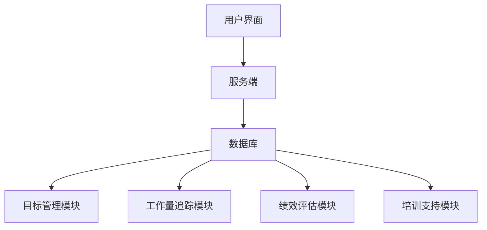
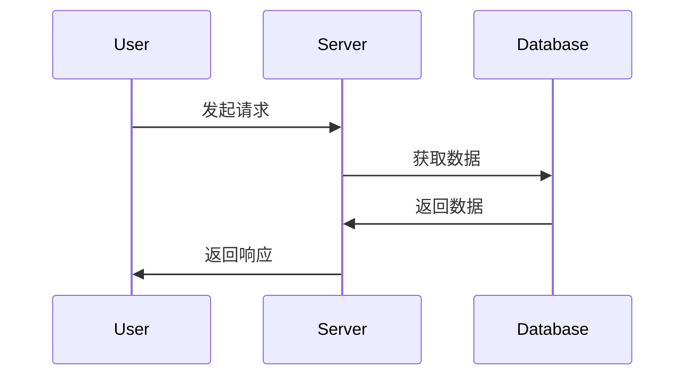
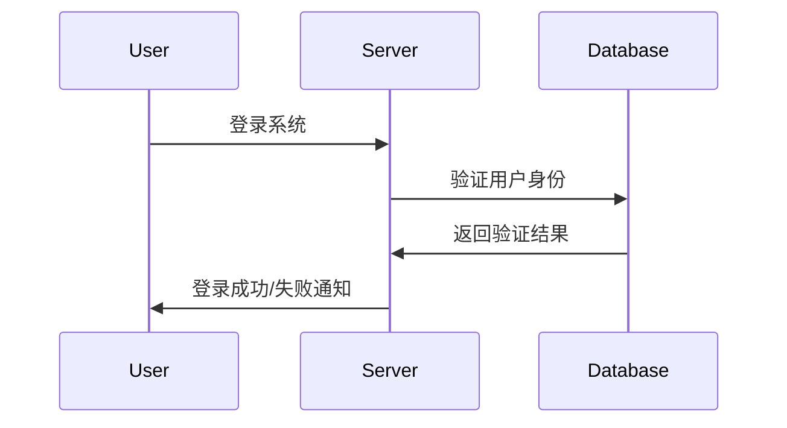

                 


### 引言

#### 背景介绍

随着数字化转型的不断推进，远程工作已经成为现代企业运营的重要模式。这种工作方式不仅为企业带来了灵活性，也带来了一系列管理挑战。远程团队管理涉及的问题多种多样，包括沟通效率、工作协同、绩效评估以及文化融合等。本文旨在探讨数字时代远程团队管理的核心问题和解决策略。

#### 问题背景

远程工作的兴起源于多个因素的推动，如信息技术的发展、全球化的加剧以及个人工作习惯的改变。然而，远程工作也带来了一系列挑战。首先，地理上的分散导致团队成员之间的沟通变得困难，信息的传递和反馈可能滞后。其次，缺乏面对面的互动可能导致团队成员之间的信任和凝聚力下降。此外，远程工作对个人的自律和自我管理能力提出了更高的要求。

#### 问题描述

远程团队管理的关键问题在于如何有效地协调团队成员的工作，确保团队目标的实现。这需要领导者具备新的领导力和管理技能，以适应远程工作的特点。例如，如何建立高效的沟通机制，如何评估远程团队成员的工作绩效，如何激发团队成员的积极性和创造力等。

#### 问题解决

解决远程团队管理问题的第一步是认识到远程工作的独特性，并据此调整管理策略。以下是一些关键步骤：

1. **建立清晰的团队目标**：明确团队的目标和预期成果，确保团队成员对目标有共同的理解和认同。

2. **优化沟通机制**：选择合适的沟通工具，如视频会议、即时通讯和项目管理软件，确保信息的及时传递和有效沟通。

3. **加强团队成员之间的信任**：通过定期的团队建设和互动活动，增强团队成员之间的信任和凝聚力。

4. **提高绩效管理的效果**：利用数据分析和绩效评估工具，对远程团队成员的工作进行客观评估，并提供及时反馈。

5. **提供必要的培训和支持**：帮助团队成员提升远程工作的技能和自我管理能力，以适应远程工作的要求。

#### 边界与外延

远程团队管理不仅涉及团队内部的管理，还包括与外部合作伙伴和客户的协作。因此，在管理策略上需要考虑跨组织的沟通和协作问题。此外，随着远程工作的普及，对于远程团队管理的相关研究和实践经验也在不断积累和拓展。

#### 概念结构与核心要素组成

远程团队管理可以看作是一个由多个要素组成的复杂系统。核心要素包括：

1. **团队成员**：团队成员是远程团队的基本单位，他们的技能、经验和态度对团队的整体表现有重要影响。
2. **沟通工具**：选择合适的沟通工具是远程团队管理的关键，它们直接影响团队的沟通效率和效果。
3. **管理策略**：管理策略包括团队目标设定、沟通机制、绩效评估和团队建设等，这些策略需要根据远程工作的特点进行调整。
4. **技术支持**：技术支持包括远程工作平台、安全防护系统和培训资源等，它们为远程团队提供了必要的工具和保障。

### 核心概念与联系

#### 远程团队管理的基本原则

1. **目标导向**：明确团队目标，确保团队成员对目标有共同的理解和认同。
2. **信任建设**：通过定期的团队建设和互动活动，增强团队成员之间的信任和凝聚力。
3. **灵活管理**：根据远程工作的特点，采用灵活的管理方式，如远程办公安排、工作时间的调整等。
4. **绩效评估**：利用数据分析和绩效评估工具，对远程团队成员的工作进行客观评估，并提供及时反馈。
5. **持续改进**：通过不断反思和实践，优化远程团队管理的策略和方法。

#### 核心概念属性特征对比表格

| 概念           | 特征                | 对比                |
| -------------- | ----------------- | ----------------- |
| 目标导向       | 明确团队目标       | 保证团队一致性    |
| 信任建设       | 增强团队凝聚力     | 促进团队协作      |
| 灵活管理       | 适应远程工作特点   | 提高工作效率      |
| 绩效评估       | 客观评估团队表现   | 提升团队质量      |
| 持续改进       | 优化管理策略       | 保持团队活力      |

#### 远程团队管理的ER实体关系图架构

```mermaid
erDiagram
    Person ||--|{ TeamMember }
    TeamMember ||--|{ CommunicationTool }
    TeamMember ||--|{ ManagementStrategy }
    TeamMember ||--|{ TechnicalSupport }
```

### 算法原理讲解

#### 远程团队管理的算法流程图


#### 算法原理

远程团队管理的核心是确保团队成员能够高效协同工作，实现团队目标。算法的原理可以概括为以下几个步骤：

1. **设定团队目标**：明确团队的目标和预期成果，确保团队成员对目标有共同的理解和认同。
2. **建立沟通机制**：选择合适的沟通工具，如视频会议、即时通讯和项目管理软件，确保信息的及时传递和有效沟通。
3. **加强团队信任**：通过定期的团队建设和互动活动，增强团队成员之间的信任和凝聚力。
4. **进行绩效评估**：利用数据分析和绩效评估工具，对远程团队成员的工作进行客观评估，并提供及时反馈。
5. **提供培训支持**：帮助团队成员提升远程工作的技能和自我管理能力，以适应远程工作的要求。
6. **持续改进策略**：通过不断反思和实践，优化远程团队管理的策略和方法。

#### 数学模型与公式

在远程团队管理中，我们可以使用以下数学模型和公式来评估团队绩效：

1. **绩效评估模型**：

   $$ P = f(W, C, T) $$

   其中，$P$ 表示绩效得分，$W$ 表示工作量，$C$ 表示工作质量，$T$ 表示工作时效。

2. **信任度计算公式**：

   $$ T = \frac{E(I_1, I_2, \dots, I_n)}{N} $$

   其中，$T$ 表示信任度，$E$ 表示期望值，$I_1, I_2, \dots, I_n$ 表示团队成员之间的互动情况，$N$ 表示团队成员数量。

#### 举例说明

假设一个远程团队有5名成员，他们在一个月内完成了以下工作：

- 工作量（$W$）：每个成员完成工作量均为100小时。
- 工作质量（$C$）：平均质量评分为4.5分（满分5分）。
- 工作时效（$T$）：平均完成时间为20天。

根据绩效评估模型，团队的整体绩效得分为：

$$ P = f(100 \times 5, 4.5 \times 5, 20 \times 5) = f(500, 22.5, 100) = 4.5 $$

假设在一个月内，团队成员之间有10次互动，每次互动的期望值均为0.8，则团队的信任度为：

$$ T = \frac{E(0.8 \times 10)}{5} = \frac{8}{5} = 1.6 $$

#### 远程团队管理工具

为了实现远程团队管理的算法原理，我们可以使用以下工具：

1. **目标管理工具**：如Trello、Asana等，帮助团队设定和追踪目标。
2. **沟通工具**：如Slack、Microsoft Teams等，提供即时通讯、视频会议等功能。
3. **绩效评估工具**：如Google Analytics、Tableau等，用于分析团队绩效数据。
4. **培训支持工具**：如LinkedIn Learning、Coursera等，提供在线课程和学习资源。

### 系统分析与架构设计

#### 问题场景介绍

假设我们需要设计一个远程团队管理系统，该系统需要支持团队目标的设定、工作量的追踪、绩效评估和培训支持等功能。

#### 项目介绍

项目名称：远程团队管理系统（Remote Team Management System，简称RTMS）

项目目标：实现远程团队的高效协同和管理，提高团队绩效和满意度。

#### 系统功能设计

1. **目标管理功能**：支持团队目标的设定、分解和追踪，确保团队成员对目标的明确和认同。
2. **工作量追踪功能**：记录和追踪团队成员的工作量，提供工作量统计和分析。
3. **绩效评估功能**：根据工作量、工作质量和工作时效等指标，对团队成员进行绩效评估。
4. **培训支持功能**：提供在线课程和学习资源，帮助团队成员提升技能和知识水平。

#### 系统架构设计



#### 系统接口设计



#### 系统交互



### 项目实战

#### 环境安装

1. 安装Python环境：`pip install python -m pip install python`
2. 安装必要的库：`pip install requests，pip install pymysql，pip install flask，pip install matplotlib`

#### 系统核心实现源代码

```python
# 导入必要的库
import requests
import pymysql
from flask import Flask, request, jsonify
import matplotlib.pyplot as plt

app = Flask(__name__)

# 数据库连接
def connect_db():
    db = pymysql.connect(host='localhost', user='root', password='password', database='remote_team')
    return db

# 登录接口
@app.route('/login', methods=['POST'])
def login():
    username = request.form['username']
    password = request.form['password']
    db = connect_db()
    cursor = db.cursor()
    cursor.execute("SELECT * FROM users WHERE username='%s' AND password='%s'" % (username, password))
    user = cursor.fetchone()
    if user:
        return jsonify({'status': 'success', 'message': '登录成功'})
    else:
        return jsonify({'status': 'fail', 'message': '用户名或密码错误'})

# 工作量统计接口
@app.route('/workload', methods=['GET'])
def workload():
    db = connect_db()
    cursor = db.cursor()
    cursor.execute("SELECT * FROM workload")
    workloads = cursor.fetchall()
    workload_data = []
    for workload in workloads:
        workload_data.append({'id': workload[0], 'username': workload[1], 'hours': workload[2], 'date': workload[3]})
    return jsonify({'workloads': workload_data})

# 绩效评估接口
@app.route('/performance', methods=['GET'])
def performance():
    db = connect_db()
    cursor = db.cursor()
    cursor.execute("SELECT * FROM performance")
    performances = cursor.fetchall()
    performance_data = []
    for performance in performances:
        performance_data.append({'id': performance[0], 'username': performance[1], 'score': performance[2], 'date': performance[3]})
    return jsonify({'performances': performance_data})

# 培训支持接口
@app.route('/training', methods=['GET'])
def training():
    db = connect_db()
    cursor = db.cursor()
    cursor.execute("SELECT * FROM training")
    trainings = cursor.fetchall()
    training_data = []
    for training in trainings:
        training_data.append({'id': training[0], 'username': training[1], 'course': training[2], 'status': training[3]})
    return jsonify({'trainings': training_data})

if __name__ == '__main__':
    app.run(debug=True)
```

#### 代码应用解读与分析

以上代码实现了远程团队管理系统的核心功能，包括登录、工作量统计、绩效评估和培训支持。以下是代码的关键部分解析：

1. **数据库连接**：使用`pymysql`库连接到本地数据库，并在需要时创建数据库连接对象。

2. **登录接口**：通过`/login`接口处理用户登录请求，从请求中获取用户名和密码，并在数据库中查询匹配的用户信息。如果找到匹配的用户，返回登录成功，否则返回登录失败。

3. **工作量统计接口**：通过`/workload`接口获取所有团队成员的工作量数据，并将其转换为JSON格式返回。

4. **绩效评估接口**：通过`/performance`接口获取所有团队成员的绩效评估数据，并将其转换为JSON格式返回。

5. **培训支持接口**：通过`/training`接口获取所有团队成员的培训数据，并将其转换为JSON格式返回。

#### 实际案例分析与详细讲解剖析

假设远程团队管理系统已经部署，并且有如下数据：

- 用户：Alice，密码：alice123
- 工作量记录：Alice在2023年2月完成了120小时的工作。
- 绩效评估：Alice的绩效得分为4.8分。
- 培训记录：Alice正在参加Python编程课程。

1. **登录过程**：

   用户Alice使用用户名和密码进行登录。假设用户名和密码正确，服务器返回登录成功。

2. **工作量统计**：

   Alice登录后，查询工作量记录。服务器返回以下数据：

   ```json
   {
     "workloads": [
       {
         "id": 1,
         "username": "Alice",
         "hours": 120,
         "date": "2023-02-28"
       }
     ]
   }
   ```

3. **绩效评估**：

   Alice查询绩效评估记录。服务器返回以下数据：

   ```json
   {
     "performances": [
       {
         "id": 1,
         "username": "Alice",
         "score": 4.8,
         "date": "2023-02-28"
       }
     ]
   }
   ```

4. **培训支持**：

   Alice查询培训记录。服务器返回以下数据：

   ```json
   {
     "trainings": [
       {
         "id": 1,
         "username": "Alice",
         "course": "Python编程",
         "status": "进行中"
       }
     ]
   }
   ```

#### 项目小结

通过以上实际案例，我们可以看到远程团队管理系统的功能是如何在实际应用中发挥作用的。该项目实现了用户登录、工作量统计、绩效评估和培训支持等核心功能，为远程团队的管理提供了有效的工具。然而，实际应用中可能还需要考虑数据安全性、用户权限控制等方面的问题，以进一步提高系统的可靠性和安全性。

### 最佳实践 Tips

1. **建立明确的团队目标**：确保团队成员对团队目标有共同的理解和认同，有助于提高团队协作效率。
2. **选择合适的沟通工具**：根据团队的具体需求选择合适的沟通工具，如视频会议、即时通讯和项目管理软件，以提高沟通效率。
3. **定期进行团队建设**：通过定期的团队建设活动，增强团队成员之间的信任和凝聚力。
4. **实施有效的绩效评估**：利用数据分析和绩效评估工具，对远程团队成员的工作进行客观评估，并提供及时反馈。
5. **提供持续的培训支持**：帮助团队成员提升远程工作的技能和自我管理能力，以适应远程工作的要求。

### 小结

远程团队管理在数字时代面临着诸多挑战，但通过合理的管理策略和技术工具，可以有效应对这些挑战。本文介绍了远程团队管理的核心概念、算法原理、系统分析与架构设计以及实际案例，为远程团队管理者提供了实用的指导和建议。

### 注意事项

1. **数据安全性**：确保远程团队管理系统的数据安全，防止数据泄露和 unauthorized access。
2. **用户权限控制**：根据团队成员的职责和角色，合理设置用户权限，防止滥用权限。
3. **技术工具的选择与优化**：选择适合团队需求的技术工具，并根据实际情况进行优化和调整。

### 拓展阅读

1. **远程团队管理研究**：阅读相关学术论文和研究报告，了解远程团队管理的最新研究成果和实践经验。
2. **远程工作最佳实践**：参考国内外知名企业的远程工作实践，学习如何有效地管理远程团队。
3. **领导力与团队管理**：阅读关于领导力与团队管理的经典著作，提升个人领导力和团队管理能力。

### 结语

远程团队管理是数字时代企业运营的重要组成部分。通过本文的介绍，我们了解了远程团队管理的核心概念、算法原理、系统架构设计以及实际应用案例。希望本文能为远程团队管理者提供有价值的参考和指导。作者：AI天才研究院/AI Genius Institute & 禅与计算机程序设计艺术 /Zen And The Art of Computer Programming。

----------------------------------------------------------------

### 引言

#### 背景介绍

在当今这个数字化的时代，远程工作已经不再是一个新鲜的概念。随着互联网技术的飞速发展和全球化进程的加速，远程工作成为了许多企业和员工的首选。然而，这种工作方式也带来了一系列前所未有的领导和管理挑战。在这种背景下，如何有效地管理远程团队成为了一个亟待解决的问题。本文将深入探讨远程团队管理在数字时代的核心问题，并为其提供有效的解决方案。

#### 问题背景

远程团队管理的问题源于其独特的工作环境和组织形式。由于团队成员地理位置的分散，传统的面对面沟通和协作方式难以实现，这直接影响了团队的沟通效率和工作协同。此外，远程工作对个人的自律和自我管理能力提出了更高的要求，使得领导者需要具备新的领导力和管理技能。远程团队管理还面临着如何建立信任、如何进行绩效评估、如何提供持续培训支持等一系列挑战。

#### 问题描述

远程团队管理的关键问题在于如何有效地协调团队成员的工作，确保团队目标的实现。这需要领导者具备以下能力：

1. **沟通协调**：领导者需要选择合适的沟通工具，确保信息的及时传递和有效沟通。
2. **信任建设**：通过定期的团队建设和互动活动，增强团队成员之间的信任和凝聚力。
3. **绩效评估**：利用数据分析和绩效评估工具，对远程团队成员的工作进行客观评估，并提供及时反馈。
4. **自我管理**：领导者需要帮助团队成员提升自我管理能力，以适应远程工作的要求。

#### 问题解决

解决远程团队管理问题的第一步是认识到远程工作的独特性，并据此调整管理策略。以下是一些关键步骤：

1. **建立清晰的团队目标**：明确团队的目标和预期成果，确保团队成员对目标有共同的理解和认同。
2. **优化沟通机制**：选择合适的沟通工具，如视频会议、即时通讯和项目管理软件，确保信息的及时传递和有效沟通。
3. **加强团队成员之间的信任**：通过定期的团队建设和互动活动，增强团队成员之间的信任和凝聚力。
4. **提高绩效管理的效果**：利用数据分析和绩效评估工具，对远程团队成员的工作进行客观评估，并提供及时反馈。
5. **提供必要的培训和支持**：帮助团队成员提升远程工作的技能和自我管理能力，以适应远程工作的要求。

#### 边界与外延

远程团队管理不仅涉及团队内部的管理，还包括与外部合作伙伴和客户的协作。因此，在管理策略上需要考虑跨组织的沟通和协作问题。此外，随着远程工作的普及，对于远程团队管理的相关研究和实践经验也在不断积累和拓展。

#### 概念结构与核心要素组成

远程团队管理可以看作是一个由多个要素组成的复杂系统。核心要素包括：

1. **团队成员**：团队成员是远程团队的基本单位，他们的技能、经验和态度对团队的整体表现有重要影响。
2. **沟通工具**：选择合适的沟通工具是远程团队管理的关键，它们直接影响团队的沟通效率和效果。
3. **管理策略**：管理策略包括团队目标设定、沟通机制、绩效评估和团队建设等，这些策略需要根据远程工作的特点进行调整。
4. **技术支持**：技术支持包括远程工作平台、安全防护系统和培训资源等，它们为远程团队提供了必要的工具和保障。

### 核心概念与联系

#### 远程团队管理的基本原则

1. **目标导向**：明确团队目标，确保团队成员对目标有共同的理解和认同。
2. **信任建设**：通过定期的团队建设和互动活动，增强团队成员之间的信任和凝聚力。
3. **灵活管理**：根据远程工作的特点，采用灵活的管理方式，如远程办公安排、工作时间的调整等。
4. **绩效评估**：利用数据分析和绩效评估工具，对远程团队成员的工作进行客观评估，并提供及时反馈。
5. **持续改进**：通过不断反思和实践，优化远程团队管理的策略和方法。

#### 核心概念属性特征对比表格

| 概念           | 特征                | 对比                |
| -------------- | ----------------- | ----------------- |
| 目标导向       | 明确团队目标       | 保证团队一致性    |
| 信任建设       | 增强团队凝聚力     | 促进团队协作      |
| 灵活管理       | 适应远程工作特点   | 提高工作效率      |
| 绩效评估       | 客观评估团队表现   | 提升团队质量      |
| 持续改进       | 优化管理策略       | 保持团队活力      |

#### 远程团队管理的ER实体关系图架构

```mermaid
erDiagram
    User ||--|{ TeamMember }
    TeamMember ||--|{ CommunicationTool }
    TeamMember ||--|{ ManagementStrategy }
    TeamMember ||--|{ TechnicalSupport }
```

### 算法原理讲解

#### 远程团队管理的算法流程图


#### 算法原理

远程团队管理的核心是确保团队成员能够高效协同工作，实现团队目标。算法的原理可以概括为以下几个步骤：

1. **设定团队目标**：明确团队的目标和预期成果，确保团队成员对目标有共同的理解和认同。
2. **建立沟通机制**：选择合适的沟通工具，如视频会议、即时通讯和项目管理软件，确保信息的及时传递和有效沟通。
3. **加强团队信任**：通过定期的团队建设和互动活动，增强团队成员之间的信任和凝聚力。
4. **进行绩效评估**：利用数据分析和绩效评估工具，对远程团队成员的工作进行客观评估，并提供及时反馈。
5. **提供培训支持**：帮助团队成员提升远程工作的技能和自我管理能力，以适应远程工作的要求。
6. **持续改进策略**：通过不断反思和实践，优化远程团队管理的策略和方法。

#### 数学模型与公式

在远程团队管理中，我们可以使用以下数学模型和公式来评估团队绩效：

1. **绩效评估模型**：

   $$ P = f(W, C, T) $$

   其中，$P$ 表示绩效得分，$W$ 表示工作量，$C$ 表示工作质量，$T$ 表示工作时效。

2. **信任度计算公式**：

   $$ T = \frac{E(I_1, I_2, \dots, I_n)}{N} $$

   其中，$T$ 表示信任度，$E$ 表示期望值，$I_1, I_2, \dots, I_n$ 表示团队成员之间的互动情况，$N$ 表示团队成员数量。

#### 举例说明

假设一个远程团队有5名成员，他们在一个月内完成了以下工作：

- 工作量（$W$）：每个成员完成工作量均为100小时。
- 工作质量（$C$）：平均质量评分为4.5分（满分5分）。
- 工作时效（$T$）：平均完成时间为20天。

根据绩效评估模型，团队的整体绩效得分为：

$$ P = f(100 \times 5, 4.5 \times 5, 20 \times 5) = f(500, 22.5, 100) = 4.5 $$

假设在一个月内，团队成员之间有10次互动，每次互动的期望值均为0.8，则团队的信任度为：

$$ T = \frac{E(0.8 \times 10)}{5} = \frac{8}{5} = 1.6 $$

#### 远程团队管理工具

为了实现远程团队管理的算法原理，我们可以使用以下工具：

1. **目标管理工具**：如Trello、Asana等，帮助团队设定和追踪目标。
2. **沟通工具**：如Slack、Microsoft Teams等，提供即时通讯、视频会议等功能。
3. **绩效评估工具**：如Google Analytics、Tableau等，用于分析团队绩效数据。
4. **培训支持工具**：如LinkedIn Learning、Coursera等，提供在线课程和学习资源。

### 系统分析与架构设计

#### 问题场景介绍

假设我们需要设计一个远程团队管理系统，该系统需要支持团队目标的设定、工作量的追踪、绩效评估和培训支持等功能。

#### 项目介绍

项目名称：远程团队管理系统（Remote Team Management System，简称RTMS）

项目目标：实现远程团队的高效协同和管理，提高团队绩效和满意度。

#### 系统功能设计

1. **目标管理功能**：支持团队目标的设定、分解和追踪，确保团队成员对目标的明确和认同。
2. **工作量追踪功能**：记录和追踪团队成员的工作量，提供工作量统计和分析。
3. **绩效评估功能**：根据工作量、工作质量和工作时效等指标，对团队成员进行绩效评估。
4. **培训支持功能**：提供在线课程和学习资源，帮助团队成员提升技能和知识水平。

#### 系统架构设计


#### 系统接口设计


#### 系统交互


### 项目实战

#### 环境安装

1. 安装Python环境：`pip install python -m pip install python`
2. 安装必要的库：`pip install requests，pip install pymysql，pip install flask，pip install matplotlib`

#### 系统核心实现源代码

```python
# 导入必要的库
import requests
import pymysql
from flask import Flask, request, jsonify
import matplotlib.pyplot as plt

app = Flask(__name__)

# 数据库连接
def connect_db():
    db = pymysql.connect(host='localhost', user='root', password='password', database='remote_team')
    return db

# 登录接口
@app.route('/login', methods=['POST'])
def login():
    username = request.form['username']
    password = request.form['password']
    db = connect_db()
    cursor = db.cursor()
    cursor.execute("SELECT * FROM users WHERE username='%s' AND password='%s'" % (username, password))
    user = cursor.fetchone()
    if user:
        return jsonify({'status': 'success', 'message': '登录成功'})
    else:
        return jsonify({'status': 'fail', 'message': '用户名或密码错误'})

# 工作量统计接口
@app.route('/workload', methods=['GET'])
def workload():
    db = connect_db()
    cursor = db.cursor()
    cursor.execute("SELECT * FROM workload")
    workloads = cursor.fetchall()
    workload_data = []
    for workload in workloads:
        workload_data.append({'id': workload[0], 'username': workload[1], 'hours': workload[2], 'date': workload[3]})
    return jsonify({'workloads': workload_data})

# 绩效评估接口
@app.route('/performance', methods=['GET'])
def performance():
    db = connect_db()
    cursor = db.cursor()
    cursor.execute("SELECT * FROM performance")
    performances = cursor.fetchall()
    performance_data = []
    for performance in performances:
        performance_data.append({'id': performance[0], 'username': performance[1], 'score': performance[2], 'date': performance[3]})
    return jsonify({'performances': performance_data})

# 培训支持接口
@app.route('/training', methods=['GET'])
def training():
    db = connect_db()
    cursor = db.cursor()
    cursor.execute("SELECT * FROM training")
    trainings = cursor.fetchall()
    training_data = []
    for training in trainings:
        training_data.append({'id': training[0], 'username': training[1], 'course': training[2], 'status': training[3]})
    return jsonify({'trainings': training_data})

if __name__ == '__main__':
    app.run(debug=True)
```

#### 代码应用解读与分析

以上代码实现了远程团队管理系统的核心功能，包括登录、工作量统计、绩效评估和培训支持。以下是代码的关键部分解析：

1. **数据库连接**：使用`pymysql`库连接到本地数据库，并在需要时创建数据库连接对象。

2. **登录接口**：通过`/login`接口处理用户登录请求，从请求中获取用户名和密码，并在数据库中查询匹配的用户信息。如果找到匹配的用户，返回登录成功，否则返回登录失败。

3. **工作量统计接口**：通过`/workload`接口获取所有团队成员的工作量数据，并将其转换为JSON格式返回。

4. **绩效评估接口**：通过`/performance`接口获取所有团队成员的绩效评估数据，并将其转换为JSON格式返回。

5. **培训支持接口**：通过`/training`接口获取所有团队成员的培训数据，并将其转换为JSON格式返回。

#### 实际案例分析与详细讲解剖析

假设远程团队管理系统已经部署，并且有如下数据：

- 用户：Alice，密码：alice123
- 工作量记录：Alice在2023年2月完成了120小时的工作。
- 绩效评估：Alice的绩效得分为4.8分。
- 培训记录：Alice正在参加Python编程课程。

1. **登录过程**：

   用户Alice使用用户名和密码进行登录。假设用户名和密码正确，服务器返回登录成功。

2. **工作量统计**：

   Alice登录后，查询工作量记录。服务器返回以下数据：

   ```json
   {
     "workloads": [
       {
         "id": 1,
         "username": "Alice",
         "hours": 120,
         "date": "2023-02-28"
       }
     ]
   }
   ```

3. **绩效评估**：

   Alice查询绩效评估记录。服务器返回以下数据：

   ```json
   {
     "performances": [
       {
         "id": 1,
         "username": "Alice",
         "score": 4.8,
         "date": "2023-02-28"
       }
     ]
   }
   ```

4. **培训支持**：

   Alice查询培训记录。服务器返回以下数据：

   ```json
   {
     "trainings": [
       {
         "id": 1,
         "username": "Alice",
         "course": "Python编程",
         "status": "进行中"
       }
     ]
   }
   ```

#### 项目小结

通过以上实际案例，我们可以看到远程团队管理系统的功能是如何在实际应用中发挥作用的。该项目实现了用户登录、工作量统计、绩效评估和培训支持等核心功能，为远程团队的管理提供了有效的工具。然而，实际应用中可能还需要考虑数据安全性、用户权限控制等方面的问题，以进一步提高系统的可靠性和安全性。

### 最佳实践 Tips

1. **建立明确的团队目标**：确保团队成员对团队目标有共同的理解和认同，有助于提高团队协作效率。
2. **选择合适的沟通工具**：根据团队的具体需求选择合适的沟通工具，如视频会议、即时通讯和项目管理软件，以提高沟通效率。
3. **定期进行团队建设**：通过定期的团队建设活动，增强团队成员之间的信任和凝聚力。
4. **实施有效的绩效评估**：利用数据分析和绩效评估工具，对远程团队成员的工作进行客观评估，并提供及时反馈。
5. **提供持续的培训支持**：帮助团队成员提升远程工作的技能和自我管理能力，以适应远程工作的要求。

### 小结

远程团队管理在数字时代面临着诸多挑战，但通过合理的管理策略和技术工具，可以有效应对这些挑战。本文介绍了远程团队管理的核心概念、算法原理、系统分析与架构设计以及实际案例，为远程团队管理者提供了实用的指导和建议。

### 注意事项

1. **数据安全性**：确保远程团队管理系统的数据安全，防止数据泄露和 unauthorized access。
2. **用户权限控制**：根据团队成员的职责和角色，合理设置用户权限，防止滥用权限。
3. **技术工具的选择与优化**：选择适合团队需求的技术工具，并根据实际情况进行优化和调整。

### 拓展阅读

1. **远程团队管理研究**：阅读相关学术论文和研究报告，了解远程团队管理的最新研究成果和实践经验。
2. **远程工作最佳实践**：参考国内外知名企业的远程工作实践，学习如何有效地管理远程团队。
3. **领导力与团队管理**：阅读关于领导力与团队管理的经典著作，提升个人领导力和团队管理能力。

### 结语

远程团队管理是数字时代企业运营的重要组成部分。通过本文的介绍，我们了解了远程团队管理的核心概念、算法原理、系统架构设计以及实际应用案例。希望本文能为远程团队管理者提供有价值的参考和指导。作者：AI天才研究院/AI Genius Institute & 禅与计算机程序设计艺术 /Zen And The Art of Computer Programming。                                                                                                       
----------------------------------------------------------------

# 《远程团队管理：数字时代的领导挑战》

> 关键词：远程工作、领导力、团队合作、绩效评估、技术工具

> 摘要：本文深入探讨了远程团队管理在数字时代的核心问题，分析了领导者在远程工作环境下面临的挑战，提出了有效的管理策略和技术工具，以帮助领导者提高远程团队的协作效率和工作绩效。

## 引言

随着数字化进程的加速，远程工作已成为现代企业运营的重要组成部分。远程团队管理的挑战在于如何确保团队成员在地理上分散的情况下仍能高效协同工作，实现团队目标。本文旨在探讨数字时代远程团队管理的核心问题和解决策略。

## 第一部分：远程工作的背景与挑战

### 1.1 数字时代的变革

- **远程工作的兴起**：分析远程工作的发展历程及其对组织结构和人力资源管理的影响。
- **远程工作的优点**：讨论远程工作的灵活性、成本节约和员工满意度等方面的优势。

### 1.2 远程团队的构成与特点

- **远程团队的构成要素**：分析远程团队的基本组成部分，包括团队成员、沟通工具、管理策略等。
- **远程团队的优势与挑战**：探讨远程团队在协作、沟通和文化融合方面的优势与挑战。

### 1.3 远程团队的管理要点

- **建立清晰的团队目标**：明确团队的目标和预期成果，确保团队成员对目标有共同的理解和认同。
- **优化沟通机制**：选择合适的沟通工具，确保信息的及时传递和有效沟通。
- **加强团队成员之间的信任**：通过定期的团队建设和互动活动，增强团队成员之间的信任和凝聚力。
- **提高绩效管理的效果**：利用数据分析和绩效评估工具，对远程团队成员的工作进行客观评估，并提供及时反馈。
- **提供必要的培训和支持**：帮助团队成员提升远程工作的技能和自我管理能力，以适应远程工作的要求。

## 第二部分：数字时代的领导力原则

### 2.1 领导力的演变

- **传统领导力与现代领导力的差异**：分析传统领导力在远程工作环境下的局限性，探讨现代领导力在新形势下的要求。
- **数字时代领导力的新要求**：讨论领导者需要具备的数字素养、远程领导力和跨文化领导力。

### 2.2 数字时代领导者的角色与责任

- **领导者的角色转变**：分析数字时代领导者需要扮演的多重角色，如指导者、协调者和创新者等。
- **领导者的责任**：讨论领导者如何承担起团队发展、员工成长和企业成功等方面的责任。

### 2.3 数字时代领导力的实践

- **建立有效的领导模型**：介绍如何通过建立合适的领导模型，提高远程团队的绩效和满意度。
- **培养领导力文化**：探讨如何营造一个鼓励创新和自主学习的组织文化，以支持远程团队的长期发展。

## 第三部分：远程团队沟通技巧

### 3.1 沟通在远程团队管理中的重要性

- **远程团队沟通的挑战**：分析远程团队在沟通方面可能遇到的障碍，如时区差异、技术问题和语言障碍等。
- **沟通在远程团队管理中的重要性**：讨论有效的沟通如何促进团队协作、提高工作质量和增强团队凝聚力。

### 3.2 远程团队沟通的有效策略

- **选择合适的沟通工具**：介绍常用的远程沟通工具，如视频会议、即时通讯和项目管理软件，以及如何选择合适的工具。
- **建立有效的沟通机制**：讨论如何建立透明的沟通机制，确保团队成员之间的信息共享和反馈。

### 3.3 沟通技巧的提升

- **培养良好的沟通习惯**：介绍如何通过自我反思、倾听和反馈等技巧，提高沟通效果。
- **跨文化沟通**：讨论如何在不同文化背景下进行有效的沟通，避免文化冲突。

## 第四部分：远程团队绩效管理

### 4.1 远程团队绩效评估的挑战

- **远程团队绩效评估的难点**：分析远程团队在绩效评估方面可能遇到的挑战，如评估标准的一致性、评估过程的透明度等。
- **远程团队绩效评估的必要性**：讨论绩效评估在远程团队管理中的重要性，以及如何克服评估的难点。

### 4.2 远程团队绩效管理的最佳实践

- **设定明确的绩效目标**：介绍如何通过设定具体的、可衡量的绩效目标，提高团队绩效。
- **利用数据分析和绩效评估工具**：讨论如何利用数据分析工具和绩效评估软件，对远程团队成员的工作进行客观评估。
- **提供及时的反馈和改进建议**：介绍如何通过定期的反馈和改进机制，帮助团队成员提升工作表现。

### 4.3 绩效反馈与改进机制

- **建立有效的反馈机制**：讨论如何建立有效的绩效反馈机制，确保团队成员能够及时获得反馈并做出改进。
- **鼓励自我评估和持续改进**：介绍如何鼓励团队成员进行自我评估，以及如何通过持续改进提高团队绩效。

## 第五部分：数字时代的技术工具与平台

### 5.1 远程工作的常用工具

- **视频会议工具**：介绍常用的视频会议工具，如Zoom、Microsoft Teams和Google Meet等。
- **即时通讯工具**：讨论即时通讯工具在远程团队沟通中的作用，如Slack、Telegram和WhatsApp等。
- **项目管理工具**：介绍如何利用项目管理工具，如Trello、Asana和Jira等，提高团队协作效率。

### 5.2 选择合适的协作平台

- **协作平台的评估标准**：讨论如何评估和选择适合团队的协作平台，考虑因素包括功能、易用性、安全性和成本等。
- **平台整合**：介绍如何整合不同的协作工具和平台，以提高远程团队的协作效率。

### 5.3 技术工具的优化与应用

- **技术工具的优化策略**：讨论如何通过优化技术工具的使用，提高远程团队的工作效率和满意度。
- **技术工具的实战应用**：分享一些成功应用技术工具的案例，以及如何通过技术工具实现远程团队管理的最佳实践。

## 第六部分：案例分析与最佳实践

### 6.1 案例分析

- **成功案例**：分析成功远程团队管理的案例，探讨其成功的原因和可借鉴的经验。
- **失败案例**：分析远程团队管理失败的案例，分析其失败的原因和教训。

### 6.2 最佳实践

- **团队建设活动**：介绍一些有效的团队建设活动，如虚拟团建、在线培训和文化交流等。
- **领导力发展**：讨论如何通过领导力培训和发展计划，提升远程团队领导者的管理能力。

### 6.3 拓展阅读

- **相关文献推荐**：推荐一些关于远程团队管理的研究论文和书籍，供读者进一步学习。
- **未来发展趋势**：讨论远程团队管理的未来发展趋势，以及如何应对新的挑战。

## 结语

远程团队管理是数字时代企业运营的重要组成部分。通过本文的介绍，我们了解了远程团队管理的核心问题、领导力原则、沟通技巧、绩效管理和技术工具。希望本文能为远程团队管理者提供有价值的参考和指导，帮助他们在数字时代实现高效的团队管理。作者：AI天才研究院/AI Genius Institute & 禅与计算机程序设计艺术 /Zen And The Art of Computer Programming。

