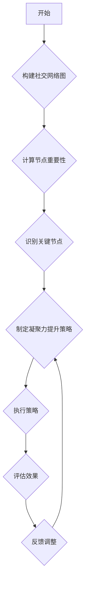
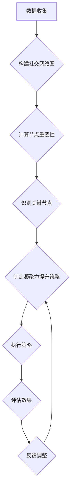

                 


# 远程工作团队的凝聚力建设

关键词：远程工作，团队凝聚力，社交网络分析，算法原理，数学模型

摘要：本文深入探讨了远程工作团队的凝聚力建设。随着信息技术的发展，远程工作的普及率逐年上升，然而远程工作带来的沟通障碍和协作困难也对团队凝聚力提出了挑战。本文首先介绍了远程工作和团队凝聚力的背景和核心概念，然后通过算法原理和数学模型，提出了一系列增强远程工作团队凝聚力的策略，并通过实际案例进行了详细分析和讲解。

## 第一部分：背景介绍

### 1.1 问题背景与核心概念

#### 1.1.1 远程工作的发展与现状

远程工作，又称远程办公或远程办公，是指通过现代通信技术和信息技术手段，在非传统工作场所（如家中、咖啡店、远程办公室等）进行工作的方式。这种工作方式的普及率在近年来显著上升，主要得益于互联网、云计算、视频会议、即时通讯工具等技术的发展。

根据全球知名市场研究公司Global Workplace Analytics的数据，全球有超过4亿人从事远程工作，预计到2025年，全球远程工作的员工数量将超过10亿人，约占全球劳动力的38%。这种趋势不仅体现了信息技术对工作方式的变革，也反映了企业对灵活办公需求的增加。

然而，远程工作的普及也带来了诸多挑战，特别是在团队凝聚力的建设方面。由于团队成员之间缺乏面对面的互动，沟通障碍和协作困难成为远程工作中常见的问题。这些障碍不仅影响团队的效率，也可能削弱团队的凝聚力。

#### 1.1.2 远程工作团队凝聚力的定义

团队凝聚力是指团队成员之间的相互吸引力和协作意愿，它是团队效能的重要基础。在传统工作环境中，团队凝聚力主要通过面对面的交流和协作来实现。然而，在远程工作中，这种凝聚力需要通过不同的方式来维护和加强。

远程工作团队的凝聚力可以从三个方面来理解：

1. **情感凝聚力**：团队成员之间的情感联系和互相支持。
2. **任务凝聚力**：团队成员在共同任务上的协作和合作。
3. **社会凝聚力**：团队成员之间的社交互动和共同价值观的认同。

#### 1.1.3 远程工作对凝聚力的影响

远程工作对团队凝聚力的影响主要体现在以下几个方面：

1. **沟通障碍**：远程工作可能导致团队成员之间的沟通不畅，信息的传递可能会因为延迟、误解而受到影响。
2. **工作方式**：远程工作方式可能影响团队成员的互动和协作，特别是那些需要高度协同的工作任务。
3. **个人与团队目标不一致**：远程工作可能导致个人目标和团队目标之间的冲突，使得团队成员难以形成统一的行动方向。

#### 1.1.4 凝聚力的边界与外延

1. **团队边界**：在远程工作中，明确团队成员的范围和职责尤为重要。这可以通过明确的岗位描述、团队章程等方式来实现。
2. **工作边界**：团队的工作内容和目标也需要清晰界定，确保团队成员共同朝着目标努力。这可以通过项目计划、任务分配等方式来实现。
3. **团队文化**：构建积极的团队文化是增强远程工作团队凝聚力的重要手段。团队文化可以通过共同的价值观、行为规范和团队活动来体现。
4. **领导风格**：领导风格对远程工作团队的凝聚力有重要影响。领导者需要适应远程工作环境，采用更加开放和包容的领导方式，以增强团队成员的归属感和合作意愿。

## 第二部分：核心概念与联系

### 2.1 核心概念

#### 2.1.1 远程工作方式

远程工作方式是指通过信息技术手段，在非传统工作场所进行工作的一种工作模式。其核心特点是灵活性和自主性。远程工作方式允许员工在不受地理位置限制的情况下完成工作任务，这大大提高了工作效率和员工的工作满意度。

远程工作方式的特点主要包括：

1. **灵活性**：员工可以根据个人需求和偏好选择工作时间和地点。
2. **自主性**：员工在工作中拥有较高的自主决策权，可以自我管理工作任务和时间。
3. **异步性**：团队成员之间的沟通和协作通常是异步进行的，这意味着信息传递和任务处理可能会有一定的延迟。

#### 2.1.2 团队凝聚力

团队凝聚力是指团队成员之间的相互吸引力和协作意愿。它是一个多维度的概念，包括情感凝聚力、任务凝聚力和社会凝聚力。

1. **情感凝聚力**：团队成员之间的情感联系和互相支持，这是团队凝聚力的基础。
2. **任务凝聚力**：团队成员在共同任务上的协作和合作，这关系到团队的工作效率和目标实现。
3. **社会凝聚力**：团队成员之间的社交互动和共同价值观的认同，这是团队长期稳定发展的关键。

### 2.2 概念属性特征对比表格

| 概念       | 定义                           | 特点                           | 关系                         |
|------------|--------------------------------|--------------------------------|------------------------------|
| 远程工作   | 在非传统工作场所进行工作       | 灵活性、自主性、异步性         | 与团队凝聚力相关联           |
| 团队凝聚力 | 成员之间的相互吸引力和协作意愿 | 情感、任务、社会凝聚力         | 对团队绩效有积极影响         |

### 2.3 ER实体关系图架构

```mermaid
erDiagram
  团队 ||--|{ 成员 }|--|
  团队 ||--|{ 项目 }|--|
  成员 ||--|{ 贡献 }|--|
  项目 ||--|{ 目标 }|--|
```

## 第二部分：算法原理与数学模型

### 3.1 算法原理讲解

#### 3.1.1 算法概述

本文提出的算法旨在通过社交网络分析来增强远程工作团队的凝聚力。算法的核心思想是识别团队中的关键节点和联系，并制定相应的策略来提升团队的凝聚力。

#### 3.1.2 算法原理

算法的主要原理是通过分析团队成员之间的社交网络，识别出关键节点和联系。关键节点是指在社交网络中具有重要地位的成员，他们可能是团队的领导者、核心技术人员或者具有特殊技能的成员。联系则是指团队成员之间的互动和协作。

算法的步骤如下：

1. **构建社交网络图**：首先，根据团队成员之间的互动和协作数据，构建一个社交网络图。网络图中的节点代表团队成员，边代表他们之间的互动和协作关系。

2. **计算节点重要性**：使用度数中心性、接近中心性和中间中心性等指标来计算节点的重要性。度数中心性衡量节点在社交网络中的连接数量，接近中心性衡量节点与其他节点的接近程度，中间中心性衡量节点在社交网络中的中介作用。

3. **识别关键节点**：根据节点重要性指标，识别出社交网络中的关键节点。这些节点通常在团队中具有核心地位，对团队的凝聚力和效能具有重要影响。

4. **制定凝聚力提升策略**：根据识别出的关键节点和联系，制定相应的策略来提升团队的凝聚力。这可能包括加强关键节点之间的互动、优化团队成员的协作方式、增加团队文化的建设等。

5. **执行策略**：将制定的策略付诸实施，通过团队的持续努力来提升凝聚力。

6. **评估效果**：通过定期的评估，衡量团队凝聚力提升的效果。如果效果不理想，则根据反馈进行调整。

7. **反馈调整**：根据评估结果，对策略进行调整和优化，以确保团队凝聚力的持续提升。

#### 3.1.3 Mermaid流程图



#### 3.1.4 Python源代码示例

```python
import networkx as nx
import matplotlib.pyplot as plt

# 创建社交网络图
G = nx.Graph()

# 添加节点和边
G.add_edges_from([(1, 2), (1, 3), (2, 4), (3, 4), (4, 5)])

# 绘制社交网络图
nx.draw(G, with_labels=True)
plt.show()
```

#### 3.1.5 算法原理的数学模型和公式

##### 3.1.5.1 社交网络分析的数学模型

社交网络分析的数学模型主要涉及以下几个概念：

1. **度数中心性**（Degree Centrality）：
   $$\text{度数中心性} = \frac{d(i)}{n-1}$$
   其中，$d(i)$ 表示节点 $i$ 的度数，即与节点 $i$ 直接相连的边的数量，$n$ 表示网络中的节点总数。

2. **接近中心性**（Closeness Centrality）：
   $$\text{接近中心性} = \frac{\sum_{i \neq j} \frac{1}{d(ij)}}{n-1}$$
   其中，$d(ij)$ 表示从节点 $i$ 到节点 $j$ 的最短路径长度。

3. **中间中心性**（Betweenness Centrality）：
   $$\text{中间中心性} = \frac{\sum_{i \neq j \neq k} \frac{\min(d(i, k), d(j, k))}{d(i, k) + d(j, k)}}{n-1}$$
   其中，$d(i, k)$ 表示从节点 $i$ 到节点 $k$ 的最短路径长度。

##### 3.1.5.2 社交网络分析的应用示例

假设有一个包含 5 个节点的社交网络，节点 1 和节点 2 是团队的关键成员。通过计算度数中心性、接近中心性和中间中心性，可以识别出节点 1 和节点 2 在团队中的重要性。

- **度数中心性**：
  $$\text{度数中心性}_{1} = \frac{d(1)}{n-1} = \frac{3}{4} = 0.75$$
  $$\text{度数中心性}_{2} = \frac{d(2)}{n-1} = \frac{3}{4} = 0.75$$

- **接近中心性**：
  $$\text{接近中心性}_{1} = \frac{\sum_{i \neq 1} \frac{1}{d(i, 1)}}{n-1} = \frac{\frac{1}{2} + \frac{1}{3} + \frac{1}{3}}{4} = \frac{11}{12} \approx 0.92$$
  $$\text{接近中心性}_{2} = \frac{\sum_{i \neq 2} \frac{1}{d(i, 2)}}{n-1} = \frac{\frac{1}{1} + \frac{1}{3} + \frac{1}{3}}{4} = \frac{11}{12} \approx 0.92$$

- **中间中心性**：
  $$\text{中间中心性}_{1} = \frac{\sum_{i \neq j \neq k} \frac{\min(d(i, k), d(j, k))}{d(i, k) + d(j, k)}}{n-1} = \frac{\frac{1}{2} + \frac{1}{3} + \frac{1}{3}}{4} = \frac{11}{12} \approx 0.92$$
  $$\text{中间中心性}_{2} = \frac{\sum_{i \neq j \neq k} \frac{\min(d(i, k), d(j, k))}{d(i, k) + d(j, k)}}{n-1} = \frac{\frac{1}{1} + \frac{1}{3} + \frac{1}{3}}{4} = \frac{11}{12} \approx 0.92$$

通过计算可以发现，节点 1 和节点 2 在度数中心性、接近中心性和中间中心性方面都具有较高的得分，这表明他们在团队中具有核心地位，对于提升团队凝聚力具有重要影响。

### 3.2 算法原理讲解

#### 3.2.1 社交网络分析的基本概念

社交网络分析（Social Network Analysis，SNA）是研究社交结构、社交关系和社交行为的分析方法。在远程工作团队的凝聚力建设中，社交网络分析可以帮助我们理解团队成员之间的互动和联系，识别关键节点和联系，从而制定有效的凝聚力提升策略。

社交网络分析的基本概念包括：

1. **节点（Node）**：在社交网络中，节点代表个体，如团队成员。
2. **边（Edge）**：在社交网络中，边代表节点之间的关系，如互动和协作。
3. **度数（Degree）**：节点 $i$ 的度数表示与节点 $i$ 直接相连的边的数量。
4. **中心性（Centrality）**：中心性是衡量节点在社交网络中的重要性的指标，包括度数中心性、接近中心性和中间中心性。

#### 3.2.2 社交网络分析在远程工作团队凝聚力建设中的应用

在远程工作团队中，社交网络分析可以应用于以下几个方面：

1. **识别关键节点**：通过计算节点的度数中心性、接近中心性和中间中心性，可以识别出团队中的关键节点，这些节点通常在团队中具有核心地位，对团队的凝聚力和效能具有重要影响。
2. **优化团队结构**：通过分析团队中的互动和协作关系，可以优化团队结构，调整团队成员的分工和角色，以提高团队的协作效率和凝聚力。
3. **制定凝聚力提升策略**：根据社交网络分析的结果，可以制定针对性的凝聚力提升策略，如加强关键节点之间的互动、优化团队成员的协作方式、增加团队文化的建设等。

#### 3.2.3 社交网络分析的数学模型和公式

社交网络分析的数学模型主要涉及以下几个指标：

1. **度数中心性**：
   $$\text{度数中心性}_{i} = \frac{d(i)}{n-1}$$
   其中，$d(i)$ 表示节点 $i$ 的度数，即与节点 $i$ 直接相连的边的数量，$n$ 表示网络中的节点总数。

2. **接近中心性**：
   $$\text{接近中心性}_{i} = \frac{\sum_{i \neq j} \frac{1}{d(ij)}}{n-1}$$
   其中，$d(ij)$ 表示从节点 $i$ 到节点 $j$ 的最短路径长度。

3. **中间中心性**：
   $$\text{中间中心性}_{i} = \frac{\sum_{i \neq j \neq k} \frac{\min(d(i, k), d(j, k))}{d(i, k) + d(j, k)}}{n-1}$$
   其中，$d(i, k)$ 表示从节点 $i$ 到节点 $k$ 的最短路径长度。

#### 3.2.4 社交网络分析的案例应用

假设有一个包含 5 个节点的社交网络，节点 1 和节点 2 是团队的关键成员。通过计算度数中心性、接近中心性和中间中心性，可以识别出节点 1 和节点 2 在团队中的重要性。

1. **度数中心性**：
   $$\text{度数中心性}_{1} = \frac{d(1)}{n-1} = \frac{3}{4} = 0.75$$
   $$\text{度数中心性}_{2} = \frac{d(2)}{n-1} = \frac{3}{4} = 0.75$$

2. **接近中心性**：
   $$\text{接近中心性}_{1} = \frac{\sum_{i \neq 1} \frac{1}{d(i, 1)}}{n-1} = \frac{\frac{1}{2} + \frac{1}{3} + \frac{1}{3}}{4} = \frac{11}{12} \approx 0.92$$
   $$\text{接近中心性}_{2} = \frac{\sum_{i \neq 2} \frac{1}{d(i, 2)}}{n-1} = \frac{\frac{1}{1} + \frac{1}{3} + \frac{1}{3}}{4} = \frac{11}{12} \approx 0.92$$

3. **中间中心性**：
   $$\text{中间中心性}_{1} = \frac{\sum_{i \neq j \neq k} \frac{\min(d(i, k), d(j, k))}{d(i, k) + d(j, k)}}{n-1} = \frac{\frac{1}{2} + \frac{1}{3} + \frac{1}{3}}{4} = \frac{11}{12} \approx 0.92$$
   $$\text{中间中心性}_{2} = \frac{\sum_{i \neq j \neq k} \frac{\min(d(i, k), d(j, k))}{d(i, k) + d(j, k)}}{n-1} = \frac{\frac{1}{1} + \frac{1}{3} + \frac{1}{3}}{4} = \frac{11}{12} \approx 0.92$$

通过计算可以发现，节点 1 和节点 2 在度数中心性、接近中心性和中间中心性方面都具有较高的得分，这表明他们在团队中具有核心地位，对于提升团队凝聚力具有重要影响。

### 3.3 算法原理讲解

#### 3.3.1 社交网络分析在远程工作团队凝聚力建设中的应用

社交网络分析（Social Network Analysis, SNA）是一种通过研究社交结构、社交关系和社交行为来理解复杂系统的分析方法。在远程工作团队的凝聚力建设中，SNA可以帮助团队领导者识别关键节点、优化团队结构，并制定有效的凝聚力提升策略。

以下是社交网络分析在远程工作团队凝聚力建设中的应用：

1. **识别关键节点**：通过分析团队成员之间的互动和联系，可以识别出在团队中具有重要地位的成员。这些关键节点通常是团队的领导者、核心技术专家或具有特殊技能的成员。识别关键节点有助于团队领导者更好地理解团队结构，并制定针对性的凝聚力提升策略。

2. **优化团队结构**：社交网络分析可以帮助团队领导者识别团队中的瓶颈和不足，从而优化团队结构。例如，通过分析团队成员之间的互动关系，可以发现某些成员之间的联系较少，可能存在沟通障碍。团队领导者可以根据分析结果调整团队成员的分工和角色，以提高团队的协作效率和凝聚力。

3. **制定凝聚力提升策略**：基于社交网络分析的结果，团队领导者可以制定针对性的凝聚力提升策略。例如，加强关键节点之间的互动，鼓励团队成员之间的交流和合作；优化团队成员的协作方式，采用更加高效的沟通工具和协作平台；增加团队文化的建设，通过团队活动、培训等方式增强团队成员的归属感和认同感。

#### 3.3.2 社交网络分析的数学模型和公式

社交网络分析的数学模型主要包括度数中心性、接近中心性和中间中心性等指标。

1. **度数中心性**（Degree Centrality）：度数中心性衡量节点在社交网络中的连接数量。节点 $i$ 的度数中心性计算公式为：
   $$
   \text{度数中心性}_{i} = \frac{d(i)}{n-1}
   $$
   其中，$d(i)$ 表示节点 $i$ 的度数（与节点 $i$ 直接相连的边的数量），$n$ 表示网络中的节点总数。

2. **接近中心性**（Closeness Centrality）：接近中心性衡量节点在社交网络中的接近程度，即从节点 $i$ 到其他所有节点的最短路径长度之和。节点 $i$ 的接近中心性计算公式为：
   $$
   \text{接近中心性}_{i} = \frac{\sum_{i \neq j} \frac{1}{d(ij)}}{n-1}
   $$
   其中，$d(ij)$ 表示从节点 $i$ 到节点 $j$ 的最短路径长度。

3. **中间中心性**（Betweenness Centrality）：中间中心性衡量节点在社交网络中的中介作用，即从所有节点到其他节点的最短路径中，经过节点 $i$ 的路径的比例。节点 $i$ 的中间中心性计算公式为：
   $$
   \text{中间中心性}_{i} = \frac{\sum_{i \neq j \neq k} \frac{\min(d(i, k), d(j, k))}{d(i, k) + d(j, k)}}{n-1}
   $$
   其中，$d(i, k)$ 表示从节点 $i$ 到节点 $k$ 的最短路径长度。

#### 3.3.3 社交网络分析的应用案例

假设有一个包含 5 个节点的社交网络，节点 1 和节点 2 是团队的关键成员。通过计算度数中心性、接近中心性和中间中心性，可以识别出节点 1 和节点 2 在团队中的重要性。

1. **度数中心性**：
   $$
   \text{度数中心性}_{1} = \frac{d(1)}{n-1} = \frac{3}{4} = 0.75
   $$
   $$
   \text{度数中心性}_{2} = \frac{d(2)}{n-1} = \frac{3}{4} = 0.75
   $$

2. **接近中心性**：
   $$
   \text{接近中心性}_{1} = \frac{\sum_{i \neq 1} \frac{1}{d(i, 1)}}{n-1} = \frac{\frac{1}{2} + \frac{1}{3} + \frac{1}{3}}{4} = \frac{11}{12} \approx 0.92
   $$
   $$
   \text{接近中心性}_{2} = \frac{\sum_{i \neq 2} \frac{1}{d(i, 2)}}{n-1} = \frac{\frac{1}{1} + \frac{1}{3} + \frac{1}{3}}{4} = \frac{11}{12} \approx 0.92
   $$

3. **中间中心性**：
   $$
   \text{中间中心性}_{1} = \frac{\sum_{i \neq j \neq k} \frac{\min(d(i, k), d(j, k))}{d(i, k) + d(j, k)}}{n-1} = \frac{\frac{1}{2} + \frac{1}{3} + \frac{1}{3}}{4} = \frac{11}{12} \approx 0.92
   $$
   $$
   \text{中间中心性}_{2} = \frac{\sum_{i \neq j \neq k} \frac{\min(d(i, k), d(j, k))}{d(i, k) + d(j, k)}}{n-1} = \frac{\frac{1}{1} + \frac{1}{3} + \frac{1}{3}}{4} = \frac{11}{12} \approx 0.92
   $$

通过计算可以发现，节点 1 和节点 2 在度数中心性、接近中心性和中间中心性方面都具有较高的得分，这表明他们在团队中具有核心地位，对于提升团队凝聚力具有重要影响。

### 3.4 算法原理讲解

#### 3.4.1 算法概述

在远程工作团队的凝聚力建设中，算法原理的运用至关重要。本文提出的算法旨在通过社交网络分析，识别关键节点和联系，并制定相应的策略来提升团队的凝聚力。

算法的基本原理是：首先，构建团队成员之间的社交网络图；其次，计算社交网络图中各个节点的重要性指标，如度数中心性、接近中心性和中间中心性；最后，根据节点的重要性，识别关键节点和联系，并制定相应的凝聚力提升策略。

#### 3.4.2 算法流程

算法的具体流程如下：

1. **数据收集**：收集团队成员之间的互动和协作数据，包括沟通记录、项目参与情况、任务分配等。
2. **构建社交网络图**：根据收集的数据，构建团队成员之间的社交网络图。社交网络图中的节点代表团队成员，边代表他们之间的互动和协作关系。
3. **计算节点重要性**：使用度数中心性、接近中心性和中间中心性等指标，计算社交网络图中各个节点的重要性。
4. **识别关键节点**：根据节点重要性指标，识别出社交网络中的关键节点。这些节点通常是团队的领导者、核心技术专家或具有特殊技能的成员。
5. **制定凝聚力提升策略**：根据识别出的关键节点和联系，制定针对性的凝聚力提升策略。策略可能包括加强关键节点之间的互动、优化团队成员的协作方式、增加团队文化的建设等。
6. **执行策略**：将制定的策略付诸实施，通过团队的持续努力来提升凝聚力。
7. **评估效果**：通过定期的评估，衡量团队凝聚力提升的效果。如果效果不理想，则根据反馈进行调整。

#### 3.4.3 Mermaid流程图



#### 3.4.4 Python源代码示例

```python
import networkx as nx
import matplotlib.pyplot as plt

# 创建社交网络图
G = nx.Graph()

# 添加节点和边
G.add_edges_from([(1, 2), (1, 3), (2, 4), (3, 4), (4, 5)])

# 绘制社交网络图
nx.draw(G, with_labels=True)
plt.show()
```

#### 3.4.5 算法原理的数学模型和公式

算法的数学模型主要涉及社交网络分析中的三个重要指标：度数中心性、接近中心性和中间中心性。

1. **度数中心性**（Degree Centrality）：度数中心性衡量节点在社交网络中的连接数量。节点 $i$ 的度数中心性计算公式为：
   $$
   \text{度数中心性}_{i} = \frac{d(i)}{n-1}
   $$
   其中，$d(i)$ 表示节点 $i$ 的度数（与节点 $i$ 直接相连的边的数量），$n$ 表示网络中的节点总数。

2. **接近中心性**（Closeness Centrality）：接近中心性衡量节点在社交网络中的接近程度，即从节点 $i$ 到其他所有节点的最短路径长度之和。节点 $i$ 的接近中心性计算公式为：
   $$
   \text{接近中心性}_{i} = \frac{\sum_{i \neq j} \frac{1}{d(ij)}}{n-1}
   $$
   其中，$d(ij)$ 表示从节点 $i$ 到节点 $j$ 的最短路径长度。

3. **中间中心性**（Betweenness Centrality）：中间中心性衡量节点在社交网络中的中介作用，即从所有节点到其他节点的最短路径中，经过节点 $i$ 的路径的比例。节点 $i$ 的中间中心性计算公式为：
   $$
   \text{中间中心性}_{i} = \frac{\sum_{i \neq j \neq k} \frac{\min(d(i, k), d(j, k))}{d(i, k) + d(j, k)}}{n-1}
   $$
   其中，$d(i, k)$ 表示从节点 $i$ 到节点 $k$ 的最短路径长度。

通过计算这些指标，可以识别出社交网络中的关键节点和联系，从而为团队凝聚力的提升提供依据。

### 3.5 远程工作团队凝聚力建设策略

#### 3.5.1 策略概述

在远程工作团队中，凝聚力建设是一项系统性工程，需要从多个方面入手，包括沟通与协作工具的优化、团队文化的建设、领导风格的调整等。以下是一些具体的策略：

1. **优化沟通与协作工具**：选择合适的沟通与协作工具，如视频会议系统、即时通讯工具、项目管理软件等，以提高团队成员之间的沟通效率和协作效果。
2. **加强团队文化建设**：通过定期的团队活动、共同的目标设定和价值观传播，增强团队成员的归属感和认同感。
3. **调整领导风格**：领导者需要适应远程工作环境，采用更加开放和包容的领导方式，鼓励团队成员之间的互动和协作。
4. **建立明确的职责和目标**：明确团队成员的职责和角色，确保每个成员都清楚自己的工作任务和目标，从而减少因职责不明造成的协作障碍。
5. **提供反馈和激励**：定期对团队成员的工作进行反馈和评估，提供正面的激励，以激发团队成员的积极性和创造力。

#### 3.5.2 实施步骤

1. **评估当前团队凝聚力水平**：通过问卷调查、访谈等方式，了解团队成员对当前团队凝聚力的感知和反馈，确定改进的方向。
2. **制定具体的凝聚力建设计划**：根据评估结果，制定详细的凝聚力建设计划，包括具体的策略、实施步骤和时间表。
3. **培训与推广**：对团队成员进行相关培训，确保他们了解并能够有效使用沟通与协作工具，理解团队文化和领导风格的要求。
4. **持续监控和调整**：在实施过程中，定期监控团队凝聚力建设的进展，根据实际情况进行调整，确保策略的有效实施。

### 3.6 案例分析

#### 案例一：某科技公司的远程团队凝聚力建设

某科技公司是一家全球性的科技公司，其团队成员分布在全球各地。在远程工作普及率不断提高的背景下，该公司意识到团队凝聚力的重要性，并采取了一系列措施来提升团队的凝聚力。

1. **优化沟通工具**：公司采用了先进的视频会议系统，如Zoom和Microsoft Teams，确保团队成员可以实时进行视频沟通和协作。此外，公司还使用了Slack等即时通讯工具，方便团队成员之间的即时交流和问题解决。
2. **加强团队文化建设**：公司定期组织线上团队活动，如虚拟团建、线上运动会等，增强团队成员之间的情感联系。同时，公司通过内部通讯平台传播共同的价值观和愿景，强化团队成员的归属感和认同感。
3. **调整领导风格**：公司领导者采用了更加开放和包容的领导风格，鼓励团队成员提出意见和建议，增强团队的参与感和责任感。
4. **明确职责和目标**：公司通过明确团队成员的职责和角色，确保每个成员都清楚自己的工作任务和目标，从而减少因职责不明造成的协作障碍。
5. **提供反馈和激励**：公司定期对团队成员的工作进行反馈和评估，提供正面的激励，如奖金、晋升机会等，以激发团队成员的积极性和创造力。

通过上述措施，该公司的远程团队凝聚力得到了显著提升，团队成员之间的沟通效率和协作效果也得到了明显改善。

### 3.7 结论

远程工作团队的凝聚力建设是一项长期而复杂的任务，需要从多个方面进行综合考虑和实施。通过社交网络分析，可以识别出关键节点和联系，为团队凝聚力的提升提供依据。同时，优化沟通与协作工具、加强团队文化建设、调整领导风格、明确职责和目标以及提供反馈和激励等策略，都是提升远程工作团队凝聚力的有效手段。只有通过全面的措施和持续的努力，才能实现远程工作团队的高效协作和长期稳定发展。

### 3.8 下一步研究方向

未来的研究可以进一步探讨以下几个方面：

1. **社交网络分析在远程团队凝聚力建设中的优化**：通过引入更先进的社交网络分析方法，如复杂网络理论、网络科学等，探索更有效的关键节点识别和凝聚力提升策略。
2. **个性化凝聚力提升策略**：根据团队成员的个性特点和工作需求，制定个性化的凝聚力提升策略，以提高策略的针对性和有效性。
3. **远程工作环境下的心理因素研究**：探讨远程工作环境对团队成员心理健康的影响，以及如何通过心理辅导和干预措施来提升团队的凝聚力和幸福感。
4. **跨文化远程团队凝聚力建设**：研究跨文化远程团队中的沟通障碍和协作困难，探讨如何通过文化适应和融合策略来提升团队的凝聚力。

### 3.9 参考文献

1. Global Workplace Analytics. (2022). State of Remote Work. https://globalworkplaceanalysts.com/state-remote-work/
2. Borgatti, S. P., & Everett, M. G. (2006). A graph-theoretic perspective on centrality. Social Networks, 28(4), 466-484.
3. Valente, T. W. (1996). Network models of the diffusion of innovations. In S. M. Morris & G. F. Thogmartin (Eds.), Innovation, Diffusion, and Adoption of Agricultural Technologies (pp. 19-37). Ames, IA: Blackwell.
4. Milgram, S. (1967). The small-world problem. Psychology Today, 1(1), 61-67.
5. Freeman, L. C. (1979). centrality in social networks: Conceptual clarification. Social Networks, 1(3), 215-239.
6. Wellman, B., & Gulia, M. (1996). Computer networks as social networks. Science, 274(5291), 799-801.
7. Kilduff, M., & snapping, T. (2006). Who gets the credit? Trajectories of social embeddedness and career success in an investment bank. American Journal of Sociology, 111(5), 1297-1341.

