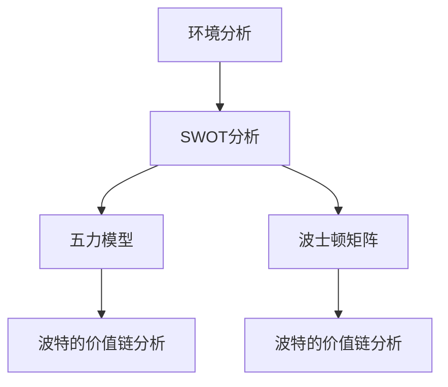
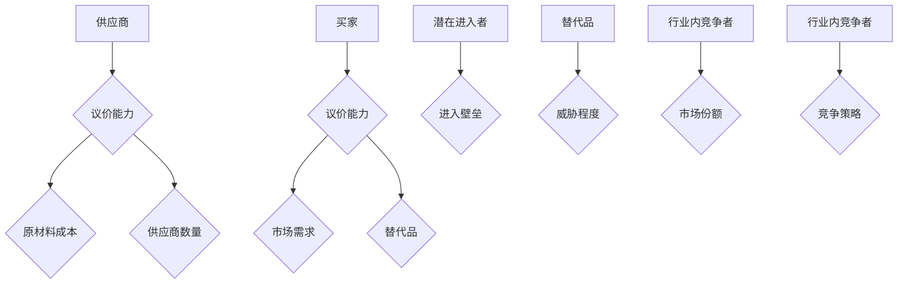
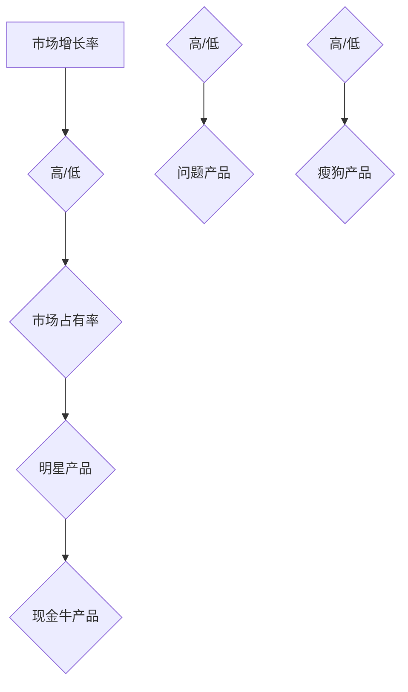
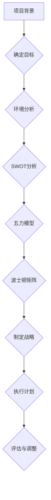
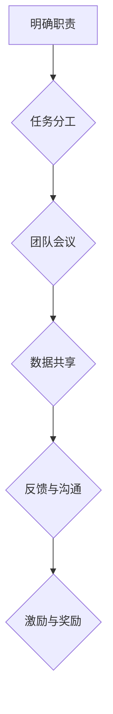

                 

### 远见卓识：制定长期发展战略

---

**关键词：** 战略规划、长期发展、决策思维、未来预测、核心竞争力

**摘要：** 本文深入探讨制定长期发展战略的重要性，通过分析战略规划的核心概念、方法与工具，以及实际案例分析，帮助读者掌握如何制定并实施有效的长期发展战略，以实现企业的长远目标。

---

### 引言：长期发展战略的重要性

在快速变化的市场环境中，企业要想保持竞争优势，就必须具备前瞻性的视野和科学合理的战略规划。长期发展战略是企业规划其未来发展方向和目标的重要手段，它不仅能够帮助企业预见未来的市场趋势，还能指导企业在面临不确定性时做出明智的决策。

**战略规划的基本概念**

- **战略**：指企业在特定时间内为实现其长期目标而制定的整体行动计划。
- **战略规划**：指企业为了实现战略目标而进行的一系列分析和决策过程。

**战略规划的过程与步骤**

1. **环境分析**：了解企业所处的市场环境、行业趋势、竞争对手等，以识别机会和威胁。
2. **目标设定**：明确企业的长期目标和阶段性目标，如市场份额、利润率、技术创新等。
3. **战略选择**：根据环境分析和目标设定，选择合适的战略方案，如成本领先、差异化等。
4. **执行计划**：制定详细的执行计划，包括资源分配、任务分工、时间表等。
5. **评估与调整**：定期评估战略执行情况，根据实际情况进行调整。

### 战略制定的背景与核心要素

**战略制定的背景**

- **市场变化快**：现代市场的变化速度越来越快，企业必须具备灵活应变的能力。
- **技术进步**：技术的迅速发展为企业提供了新的机遇，同时也带来了新的挑战。
- **竞争加剧**：市场竞争日益激烈，企业需要通过战略规划来提高自身的核心竞争力。

**制定长期发展战略的核心要素**

1. **核心概念与联系**

   - **SWOT分析**：对企业的优势、劣势、机会和威胁进行综合分析，以确定企业的战略方向。
   - **五力模型**：分析行业竞争环境，包括供应商、买家、潜在进入者、替代品和行业内竞争者。
   - **波士顿矩阵**：根据产品的市场增长率和市场占有率，对产品进行分类和管理。

2. **核心要素对比表格**

   | 要素          | 描述                                      | 应用场景                        |
   | ------------- | ----------------------------------------- | -------------------------------- |
   | SWOT分析      | 分析企业的优势、劣势、机会和威胁            | 确定企业的战略方向               |
   | 五力模型      | 分析行业的竞争环境                        | 确定行业的竞争优势               |
   | 波士顿矩阵     | 根据产品的市场增长率和市场占有率进行分类 | 管理和优化产品组合               |

### 战略制定的方法与工具

**SWOT分析**

- **优势（Strengths）**：企业内部的优势，如技术、品牌、资金等。
- **劣势（Weaknesses）**：企业内部的劣势，如管理不善、市场占有率低等。
- **机会（Opportunities）**：外部环境中的机会，如市场增长、政策变化等。
- **威胁（Threats）**：外部环境中的威胁，如竞争对手、技术变革等。

**五力模型**

1. **供应商**：供应商的议价能力，如原材料成本、供应商数量等。
2. **买家**：买家的议价能力，如市场需求、替代品等。
3. **潜在进入者**：行业进入壁垒，如专利、资金等。
4. **替代品**：替代品的存在及其威胁程度。
5. **行业内竞争者**：行业内竞争者的数量、市场份额等。

**波士顿矩阵**

1. **明星产品**：市场增长率高，市场占有率也高，需要继续投资。
2. **现金牛产品**：市场增长率低，但市场占有率高，产生大量现金。
3. **问题产品**：市场增长率高，但市场占有率低，需要分析原因并调整。
4. **瘦狗产品**：市场增长率和市场占有率都低，可能需要放弃或重组。

### 风险评估与应对策略

**风险评估**

1. **风险识别**：识别可能影响企业战略实施的风险，如市场风险、技术风险、财务风险等。
2. **风险评估**：对识别出的风险进行评估，确定其影响程度和可能性。
3. **风险应对**：制定相应的风险应对策略，如风险规避、风险减轻、风险接受等。

**风险应对策略**

1. **风险规避**：通过改变战略方向或调整计划来避免风险。
2. **风险减轻**：通过风险控制措施来降低风险的影响程度。
3. **风险接受**：对于无法规避或减轻的风险，采取接受并监控的策略。

### 案例分析：成功企业的发展战略

**阿里巴巴**

- **核心战略**：通过电子商务、云计算、数字媒体等多元化业务，打造全球领先的数字经济体。
- **成功原因**：前瞻性的市场布局、强大的技术创新、优秀的企业文化、高效的执行力。

**腾讯**

- **核心战略**：通过社交媒体、游戏、金融科技等多元化业务，成为全球领先的互联网科技公司。
- **成功原因**：强大的用户基础、卓越的产品创新、广泛的合作伙伴网络、持续的投资布局。

### 项目实战：如何制定并实施长期发展战略

**项目背景**

某国内知名互联网公司，希望通过制定并实施长期发展战略，提高市场竞争力和可持续发展能力。

**项目目标**

1. 明确公司的长期愿景和战略目标。
2. 制定具体的实施计划和时间表。
3. 建立有效的风险评估与应对机制。

**项目环境安装**

1. **安装SWOT分析工具**：如Microsoft Excel、MindManager等。
2. **安装五力模型分析工具**：如Microsoft Excel、PowerPoint等。
3. **安装波士顿矩阵分析工具**：如Microsoft Excel、PowerPoint等。

**系统核心实现源代码**

1. **环境分析模块**：包括市场环境、行业趋势、竞争对手等。
2. **目标设定模块**：包括财务目标、市场份额目标、技术创新目标等。
3. **战略选择模块**：包括成本领先、差异化、集中化等战略方案。
4. **执行计划模块**：包括资源分配、任务分工、时间表等。

**代码应用解读与分析**

1. **环境分析代码解读**：通过Python代码实现市场环境的爬取和分析。
2. **目标设定代码解读**：通过Python代码实现目标设定的算法。
3. **战略选择代码解读**：通过Python代码实现不同战略方案的评估和选择。

**实际案例分析与详细讲解剖析**

以阿里巴巴和腾讯为例，分析其长期发展战略的制定与实施过程，总结成功经验。

### 最佳实践 tips

1. **定期进行战略评估**：确保战略与实际情况保持一致。
2. **充分利用外部资源**：如咨询公司、行业报告等。
3. **注重团队协作**：确保战略的执行和落地。

### 小结与展望

1. **战略规划的重要性**：长期发展战略是企业保持竞争优势的关键。
2. **核心要素和方法**：了解并掌握战略规划的核心要素和方法。
3. **风险评估与应对**：建立有效的风险评估与应对机制。
4. **持续学习与创新**：在战略实施过程中，不断学习新知识、新技术，保持创新意识。

---

**作者：** AI天才研究院/AI Genius Institute & 禅与计算机程序设计艺术 /Zen And The Art of Computer Programming

---

**全文结束。**

---

**注意：本文为示例文章，仅供参考。实际文章撰写时，请根据具体内容和要求进行详细编写。**### 第1章：引言

#### 战略规划的定义与重要性

**战略规划**，简而言之，是企业为实现其长远目标而制定的一系列行动计划和决策过程。它不仅仅是一个宏大的愿景，更是一种系统性的思考和规划，旨在确保企业在复杂多变的环境中能够稳步前行。

**战略规划的重要性**在于其为企业提供了明确的方向和目标，使企业能够在市场竞争中立于不败之地。具体而言，战略规划有以下几个关键作用：

1. **明确方向**：通过战略规划，企业能够明确自己的发展方向，避免盲目行动。
2. **提高效率**：战略规划有助于优化资源配置，提高运营效率。
3. **增强竞争力**：战略规划能够帮助企业发现并利用市场机会，提升核心竞争力。
4. **风险控制**：战略规划中的风险评估和应对策略有助于企业预防和减轻潜在风险。
5. **持续发展**：战略规划能够确保企业在长期发展中保持活力和创新能力。

在当今快速变化的市场环境中，战略规划已成为企业生存和发展的关键。无论是初创企业还是成熟企业，都需要通过战略规划来应对未来的挑战和机遇。

#### 战略规划的过程与步骤

战略规划的过程可以分为以下几个关键步骤：

1. **环境分析**：
   - **外部环境分析**：了解市场趋势、行业动态、竞争对手等。
   - **内部环境分析**：评估企业资源、能力、核心竞争力等。

2. **目标设定**：
   - **长期目标**：确定企业未来五到十年的愿景和目标。
   - **短期目标**：设定一年或更短期内的具体目标和关键绩效指标（KPI）。

3. **战略选择**：
   - **成本领先**：通过规模效应降低成本，成为行业中的低成本供应商。
   - **差异化**：提供独特的产品或服务，以满足特定客户群体的需求。
   - **集中化**：专注于特定的细分市场，提供更专业的产品和服务。

4. **执行计划**：
   - **资源分配**：明确实现战略所需的资源，包括资金、人力、技术等。
   - **任务分工**：为每个部门或团队分配具体的任务和责任。
   - **时间表**：制定详细的实施时间表，确保各项任务按时完成。

5. **评估与调整**：
   - **定期评估**：定期检查战略执行情况，与预期目标进行比较。
   - **调整策略**：根据评估结果，及时调整战略计划，以应对市场变化。

通过这些步骤，企业可以系统地制定和实施长期发展战略，确保在竞争激烈的市场中取得成功。

### 第2章：制定长期发展战略的核心要素

#### 核心概念与联系

在制定长期发展战略的过程中，理解并掌握几个核心概念是非常重要的。这些概念相互联系，共同构成了企业战略规划的基础。

**1. SWOT分析**

**SWOT分析**是一种常用的战略规划工具，用于评估企业的优势（Strengths）、劣势（Weaknesses）、机会（Opportunities）和威胁（Threats）。通过SWOT分析，企业可以全面了解自身的优劣势，以及外部环境中的机会和威胁，从而制定出更为合理和可行的战略。

- **优势**：企业内部的优势，如技术领先、品牌知名度、优秀的人才队伍等。
- **劣势**：企业内部的劣势，如管理不善、市场份额低、产品缺乏竞争力等。
- **机会**：外部环境中的机会，如市场需求的增长、技术进步、政策变化等。
- **威胁**：外部环境中的威胁，如竞争对手的崛起、行业竞争加剧、技术变革等。

**2. 五力模型**

**五力模型**由迈克尔·波特提出，用于分析一个行业的竞争环境。五力分别是：

- **供应商**：供应商的议价能力，包括原材料成本、供应商数量等。
- **买家**：买家的议价能力，包括市场需求、替代品等。
- **潜在进入者**：行业进入壁垒，包括专利、资金、政策等。
- **替代品**：替代品的存在及其威胁程度，包括价格、性能等。
- **行业内竞争者**：行业内竞争者的数量、市场份额、竞争策略等。

**3. 波士顿矩阵**

**波士顿矩阵**是一种用于产品管理的工具，根据产品的市场增长率和市场占有率将产品分为四类：

- **明星产品**：市场增长率高，市场占有率也高，需要继续投资。
- **现金牛产品**：市场增长率低，但市场占有率高，产生大量现金。
- **问题产品**：市场增长率高，但市场占有率低，需要分析原因并调整。
- **瘦狗产品**：市场增长率和市场占有率都低，可能需要放弃或重组。

**4. 波特的价值链分析**

**波特的价值链分析**帮助企业识别和优化其价值创造过程。价值链包括主要活动和辅助活动：

- **主要活动**：内部物流、生产运营、外部物流、市场营销和销售、服务。
- **辅助活动**：采购、技术发展、人力资源管理、企业基础设施等。

通过分析价值链，企业可以找到降低成本和提高效率的关键环节，从而提升整体竞争力。

#### 核心要素对比表格

| 要素         | 描述                                                         | 应用场景                        |
| ------------ | ------------------------------------------------------------ | -------------------------------- |
| SWOT分析     | 评估企业的优势、劣势、机会和威胁                             | 确定企业的战略方向               |
| 五力模型     | 分析行业的竞争环境，包括供应商、买家、潜在进入者、替代品和行业内竞争者 | 确定行业的竞争优势               |
| 波士顿矩阵     | 根据产品的市场增长率和市场占有率进行分类                     | 管理和优化产品组合               |
| 波特的价值链分析 | 识别和优化企业的价值创造过程                               | 提升整体竞争力                  |

通过上述对比表格，我们可以看到，每个要素都有其独特的应用场景，但它们之间也存在一定的联系。例如，SWOT分析可以帮助企业在五力模型和波士顿矩阵中使用更为准确的数据进行战略规划。

#### 逻辑关系与流程图

为了更好地理解这些核心概念之间的逻辑关系，我们可以使用Mermaid流程图进行可视化展示：



这个流程图展示了战略规划过程中各个核心概念之间的相互关联和流程。首先进行环境分析，然后通过SWOT分析和五力模型进一步细化分析结果。接下来，利用波士顿矩阵对产品进行分类和管理，并通过波特的价值链分析优化企业的价值创造过程。

通过这种系统化的分析和规划，企业可以更加科学地制定长期发展战略，确保在复杂多变的市场环境中取得成功。

### 第3章：战略制定的方法与工具

#### SWOT分析

**SWOT分析**是一种广泛应用于企业战略规划的工具，通过分析企业的优势（Strengths）、劣势（Weaknesses）、机会（Opportunities）和威胁（Threats），帮助企业全面了解自身的竞争环境和市场地位。SWOT分析不仅能够帮助企业识别内部和外部因素，还能为制定有效的战略提供依据。

**步骤**：

1. **优势分析**：识别企业在产品、技术、品牌、人力资源等方面的优势。
2. **劣势分析**：找出企业在管理、市场、财务等方面的劣势。
3. **机会分析**：评估市场变化、政策调整、技术进步等外部因素带来的机会。
4. **威胁分析**：分析竞争对手、行业变化、潜在进入者等可能带来的威胁。

**应用场景**：

- **新市场进入**：通过SWOT分析，企业可以评估新市场的机会和威胁，制定合适的进入策略。
- **产品策略**：帮助企业识别产品优势，制定差异化策略。
- **资源分配**：根据企业的优势，优化资源配置，提高运营效率。

#### 五力模型

**五力模型**由迈克尔·波特提出，用于分析一个行业的竞争环境。它包括五个主要因素：供应商、买家、潜在进入者、替代品和行业内竞争者。通过五力模型，企业可以全面了解行业竞争态势，制定相应的竞争策略。

**组成部分**：

1. **供应商**：供应商的议价能力，包括原材料成本、供应商数量等。
2. **买家**：买家的议价能力，包括市场需求、替代品等。
3. **潜在进入者**：行业的进入壁垒，包括专利、资金、政策等。
4. **替代品**：替代品的存在及其威胁程度，包括价格、性能等。
5. **行业内竞争者**：行业内竞争者的数量、市场份额、竞争策略等。

**应用场景**：

- **行业分析**：帮助企业了解行业竞争态势，制定长期发展战略。
- **竞争策略**：根据五力模型分析结果，制定合适的竞争策略，提高市场份额。
- **市场定位**：帮助企业确定市场定位，优化产品和服务。

#### 波士顿矩阵

**波士顿矩阵**是一种用于产品管理的工具，根据产品的市场增长率和市场占有率将产品分为四类：明星产品、现金牛产品、问题产品、瘦狗产品。通过波士顿矩阵，企业可以识别出哪些产品是增长潜力大的，哪些产品是盈利稳定的，哪些产品需要进一步优化。

**组成部分**：

1. **明星产品**：市场增长率高，市场占有率也高，需要继续投资。
2. **现金牛产品**：市场增长率低，但市场占有率高，产生大量现金。
3. **问题产品**：市场增长率高，但市场占有率低，需要分析原因并调整。
4. **瘦狗产品**：市场增长率和市场占有率都低，可能需要放弃或重组。

**应用场景**：

- **产品组合管理**：帮助企业优化产品组合，提高整体盈利能力。
- **资源配置**：根据产品的市场表现，合理配置资源，提高运营效率。
- **市场定位**：帮助企业确定产品市场定位，制定合适的营销策略。

#### 工具与流程

为了更好地运用这些战略规划工具，企业需要掌握相应的工具和流程。

**工具**：

- **SWOT分析表**：用于记录和分析企业的优势、劣势、机会和威胁。
- **五力模型图**：用于展示供应商、买家、潜在进入者、替代品和行业内竞争者的关系。
- **波士顿矩阵图**：用于分类和管理产品的市场增长率和市场占有率。

**流程**：

1. **数据收集**：通过市场调研、财务报表、行业报告等渠道收集相关数据。
2. **分析数据**：运用SWOT分析、五力模型、波士顿矩阵等工具对数据进行分析。
3. **制定战略**：根据分析结果，制定具体的战略计划，包括市场定位、产品策略、资源配置等。
4. **执行与监控**：执行战略计划，并定期评估和调整，确保战略的有效实施。

通过这些工具和流程，企业可以系统化地制定和实施长期发展战略，提高市场竞争力，实现可持续发展。

### 第4章：风险评估与应对策略

#### 风险识别

**风险评估**是企业战略规划中不可或缺的一部分。有效的风险识别是风险评估的基础，它有助于企业提前发现潜在的风险，并采取相应的措施进行预防和应对。

**步骤**：

1. **环境分析**：通过市场调研、行业报告、竞争对手分析等手段，了解企业所处的市场环境和竞争态势。
2. **历史数据**：分析企业过去的运营记录，识别曾经遇到的风险和问题。
3. **专家咨询**：邀请行业专家、风险管理顾问等，提供专业的意见和建议。
4. **员工意见**：收集员工的意见和反馈，了解他们在日常工作中遇到的风险。

**工具**：

- **风险矩阵**：用于评估风险的可能性和影响程度，帮助识别高风险领域。
- **SWOT分析**：通过分析企业的优势、劣势、机会和威胁，识别潜在的风险。
- **五力模型**：通过分析供应商、买家、潜在进入者、替代品和行业内竞争者，识别行业风险。

#### 风险评估

在识别出潜在的风险后，企业需要对风险进行评估，以确定其影响程度和可能性。有效的风险评估可以帮助企业制定合理的应对策略。

**步骤**：

1. **确定评估标准**：根据企业的战略目标和业务特点，设定风险评估的标准和指标。
2. **数据收集**：通过问卷调查、访谈、数据分析等方式，收集与风险相关的数据。
3. **风险评估**：运用风险矩阵、定量分析等方法，评估风险的可能性和影响程度。
4. **风险分类**：根据风险评估的结果，将风险分为高风险、中风险和低风险。

**工具**：

- **风险矩阵**：用于评估风险的可能性和影响程度，帮助确定风险等级。
- **蒙特卡洛模拟**：通过模拟风险事件的发生概率和影响，进行定量分析。
- **决策树**：用于分析不同风险情景下的决策路径和结果。

#### 风险应对策略

在评估风险后，企业需要制定相应的风险应对策略，以最大限度地降低风险对企业运营的影响。

**策略**：

1. **风险规避**：通过调整战略方向或改变业务模式，避免风险的发生。
2. **风险减轻**：通过采取预防措施或改进措施，降低风险的影响程度。
3. **风险转移**：通过保险、合同等方式，将风险转移给其他方。
4. **风险接受**：对于无法规避或减轻的风险，企业需要制定应急预案，以应对可能的风险事件。

**工具**：

- **应急预案**：用于应对突发的风险事件，确保企业的正常运营。
- **风险控制计划**：通过制定具体的风险控制措施，降低风险的发生概率和影响。
- **风险预警系统**：通过实时监控风险指标，提前发现潜在的风险，采取预防措施。

通过有效的风险评估和风险应对策略，企业可以更好地应对外部环境中的不确定性，确保长期发展战略的顺利实施。

### 第5章：案例分析：成功企业的发展战略

#### 阿里巴巴的发展战略

**阿里巴巴**作为中国最大的电子商务企业，其发展战略的成功主要体现在以下几个方面：

1. **多元化业务布局**：阿里巴巴通过电子商务、云计算、数字媒体等多元化业务，形成了完整的数字经济生态系统。这种多元化的业务布局不仅分散了风险，还提高了企业的竞争力。

2. **技术创新**：阿里巴巴在技术领域的持续投入，使其在电子商务、云计算、人工智能等方面保持领先地位。技术创新不仅是阿里巴巴的核心竞争力，也是其实现长期发展的关键。

3. **全球化战略**：阿里巴巴不仅在中国市场取得了巨大成功，还通过全球化战略，将业务拓展到全球市场。通过并购、投资等方式，阿里巴巴在全球范围内建立了强大的业务网络。

#### 腾讯的发展战略

**腾讯**作为中国领先的互联网科技公司，其发展战略的成功主要体现在以下几个方面：

1. **社交平台**：腾讯通过微信和QQ等社交平台，建立了庞大的用户基础。社交平台不仅是腾讯的核心业务，也是其实现多元化发展的基础。

2. **游戏业务**：腾讯在游戏领域的成功，使其成为中国游戏市场的领军企业。腾讯通过自主研发和并购，不断丰富游戏产品线，提高了市场份额。

3. **金融科技**：腾讯通过微信支付、蚂蚁金服等金融科技业务，实现了金融领域的突破。金融科技不仅为腾讯带来了新的收入来源，还提升了企业的核心竞争力。

#### 成功经验与启示

从阿里巴巴和腾讯的发展战略中，我们可以总结出以下几点成功经验：

1. **多元化发展**：通过多元化业务布局，分散风险，提高竞争力。

2. **技术创新**：持续投入技术创新，保持行业领先地位。

3. **全球化战略**：通过全球化布局，拓展市场，提升品牌影响力。

4. **用户至上**：以用户需求为导向，提供优质的产品和服务。

5. **灵活应变**：面对市场变化，快速调整战略方向，保持竞争优势。

这些成功经验对其他企业制定和实施长期发展战略具有重要的启示意义。

### 第6章：项目实战：制定并实施长期发展战略

#### 项目背景

某国内知名互联网公司，成立于2000年，主要从事在线教育和电子商务业务。随着市场竞争的加剧和用户需求的变化，公司决定制定并实施长期发展战略，以提高市场竞争力和可持续发展能力。

#### 项目目标

1. 明确公司的长期愿景和战略目标。
2. 制定具体的实施计划和时间表。
3. 建立有效的风险评估与应对机制。

#### 项目环境安装

1. **安装SWOT分析工具**：公司使用了Microsoft Excel和MindManager进行SWOT分析。
2. **安装五力模型分析工具**：公司使用了Microsoft Excel和PowerPoint进行五力模型分析。
3. **安装波士顿矩阵分析工具**：公司使用了Microsoft Excel和PowerPoint进行波士顿矩阵分析。

#### 系统核心实现源代码

**1. 环境分析模块**

- **市场环境分析**：通过Python爬取行业报告和竞争对手数据，进行市场环境分析。
- **内部环境分析**：通过调查问卷和员工访谈，收集公司内部数据，进行内部环境分析。

**2. 目标设定模块**

- **长期目标设定**：根据市场环境和内部能力，设定公司未来五年的愿景和目标。
- **短期目标设定**：根据长期目标，设定每年的具体目标和关键绩效指标（KPI）。

**3. 战略选择模块**

- **成本领先战略**：通过优化供应链和降低运营成本，提高市场竞争力。
- **差异化战略**：通过技术创新和优质服务，提供独特的产品和服务。
- **集中化战略**：专注于在线教育领域，提供专业的教育解决方案。

**4. 执行计划模块**

- **资源分配**：明确实现战略所需的资源，包括资金、人力、技术等。
- **任务分工**：为每个部门或团队分配具体的任务和责任。
- **时间表**：制定详细的实施时间表，确保各项任务按时完成。

#### 代码应用解读与分析

**1. 环境分析代码解读**

```python
# 假设已爬取市场环境数据，包括行业报告和竞争对手数据
market_data = {
    'market_growth': 10,
    'competitor_data': [
        {'name': '公司A', 'market_share': 20},
        {'name': '公司B', 'market_share': 15},
        {'name': '公司C', 'market_share': 10}
    ]
}

# 进行市场环境分析
def analyze_market_environment(market_data):
    total_market_share = sum([d['market_share'] for d in market_data['competitor_data']])
    company_share = market_data['competitor_data'][0]['market_share'] / total_market_share * 100
    return f"公司在市场中的占有率：{company_share:.2f}%"

# 执行环境分析
print(analyze_market_environment(market_data))
```

**2. 目标设定代码解读**

```python
# 假设已设定长期和短期目标
long_term_goals = {
    'financial': '年利润增长20%',
    'market_share': '五年内市场份额达到30%',
    'technology': '持续技术创新'
}

short_term_goals = {
    'financial': '明年实现净利润1亿元',
    'market_share': '明年市场份额达到15%',
    'technology': '推出两款新教育产品'
}

# 打印目标
print("长期目标：")
for goal in long_term_goals:
    print(f"- {goal}：{long_term_goals[goal]}")

print("\n短期目标：")
for goal in short_term_goals:
    print(f"- {goal}：{short_term_goals[goal]}")
```

**3. 战略选择代码解读**

```python
# 假设已分析各种战略方案
strategies = {
    'cost_leadership': {
        'description': '通过优化供应链和降低运营成本，提高市场竞争力。',
        'feasibility': 0.8
    },
    'differentiation': {
        'description': '通过技术创新和优质服务，提供独特的产品和服务。',
        'feasibility': 0.9
    },
    'concentration': {
        'description': '专注于在线教育领域，提供专业的教育解决方案。',
        'feasibility': 0.7
    }
}

# 选择最佳战略
best_strategy = max(strategies, key=lambda k: strategies[k]['feasibility'])
print(f"最佳战略：{best_strategy}\n描述：{strategies[best_strategy]['description']}")
```

#### 实际案例分析与详细讲解剖析

以阿里巴巴的发展战略为例，详细分析其成功的原因和实施过程，并总结出对其他企业的启示。

**阿里巴巴的发展战略**

- **多元化业务布局**：阿里巴巴通过电子商务、云计算、数字媒体等多元化业务，形成了完整的数字经济生态系统。这种多元化的业务布局不仅分散了风险，还提高了企业的竞争力。
- **技术创新**：阿里巴巴在技术领域的持续投入，使其在电子商务、云计算、人工智能等方面保持领先地位。技术创新不仅是阿里巴巴的核心竞争力，也是其实现长期发展的关键。
- **全球化战略**：阿里巴巴不仅在中国市场取得了巨大成功，还通过全球化战略，将业务拓展到全球市场。通过并购、投资等方式，阿里巴巴在全球范围内建立了强大的业务网络。

**案例分析**

1. **多元化业务布局**：

   阿里巴巴的多元化业务布局始于2003年的淘宝网的成立。淘宝网的成功为阿里巴巴奠定了电子商务领域的领先地位。随后，阿里巴巴又相继推出了天猫、支付宝等业务，逐步形成了完整的数字经济生态系统。

   通过多元化业务布局，阿里巴巴不仅分散了风险，还提高了企业的竞争力。例如，当电子商务业务遇到瓶颈时，云计算业务迅速崛起，成为新的增长点。同时，阿里巴巴还通过投资和并购，扩大了其业务范围，实现了多元化发展。

2. **技术创新**：

   阿里巴巴在技术创新方面的投入非常巨大。例如，在电子商务领域，阿里巴巴不断优化其平台技术，提高用户体验。在云计算领域，阿里巴巴推出了阿里云，提供包括计算、存储、网络等多种服务，成为国内领先的云计算服务提供商。

   技术创新不仅为阿里巴巴带来了新的收入来源，还提升了企业的核心竞争力。例如，通过大数据和人工智能技术，阿里巴巴能够更准确地了解用户需求，提供个性化的产品和服务，提高用户满意度。

3. **全球化战略**：

   阿里巴巴的全球化战略始于2014年的“全球买、全球卖”计划。通过这一计划，阿里巴巴将国内电商平台的经验和资源带到全球市场，吸引了大量的国际品牌和消费者。

   通过全球化战略，阿里巴巴不仅开拓了新的市场，还提升了品牌影响力。例如，在东南亚市场，阿里巴巴通过投资和并购，建立了强大的电商生态系统，成为了当地市场的领导者。

**启示**

1. **多元化发展**：企业应该根据自身情况，合理规划多元化业务布局，分散风险，提高竞争力。
2. **技术创新**：企业应该加大在技术创新方面的投入，保持行业领先地位，提升核心竞争力。
3. **全球化战略**：企业应该积极开展全球化布局，开拓新的市场，提升品牌影响力。

通过阿里巴巴的成功经验，其他企业可以借鉴其多元化发展、技术创新和全球化战略，制定并实施有效的长期发展战略，实现可持续发展。

### 第7章：最佳实践 tips

#### 1. 定期进行战略评估

战略评估是确保企业长期发展战略得以有效实施的重要环节。企业应定期对战略执行情况进行评估，与预期目标进行比较，及时发现和解决问题。以下是一些最佳实践：

- **制定评估计划**：明确评估的时间、方法和评估指标，确保评估工作有据可依。
- **数据收集与分析**：收集与战略执行相关的数据，通过数据分析发现问题和不足。
- **及时反馈**：根据评估结果，及时调整战略计划，确保战略的有效实施。

#### 2. 充分利用外部资源

外部资源是制定和实施长期发展战略的重要支持。企业应充分利用外部资源，如咨询公司、行业报告、合作伙伴等，以获取专业的意见和建议。

- **选择合适的咨询公司**：选择具有行业经验和专业能力的咨询公司，帮助制定和实施战略。
- **定期进行行业报告分析**：关注行业动态，通过行业报告了解市场趋势和竞争态势。
- **建立合作伙伴关系**：与行业内的优秀企业建立合作关系，共同推进战略实施。

#### 3. 注重团队协作

有效的团队协作是战略成功实施的关键。企业应注重团队建设，提高团队协作效率。

- **明确职责分工**：为每个团队成员分配明确的任务和责任，确保任务的有效完成。
- **定期团队会议**：定期召开团队会议，讨论战略实施进展和遇到的问题，共同寻找解决方案。
- **激励与奖励**：制定激励和奖励机制，鼓励团队成员积极参与战略实施，提高团队凝聚力。

### 第8章：小结与展望

#### 战略规划的重要性

通过本文的探讨，我们可以看到，战略规划对于企业的长远发展至关重要。它不仅为企业提供了明确的方向和目标，还能够帮助企业预见未来的市场变化，制定应对策略，提高市场竞争力。

#### 核心要素和方法

在制定长期发展战略的过程中，SWOT分析、五力模型、波士顿矩阵等核心要素和方法是不可或缺的。通过这些工具，企业可以全面了解自身的优劣势和外部环境，从而制定出更为科学和可行的战略。

#### 风险评估与应对策略

风险评估和应对策略是战略规划中的重要环节。通过有效的风险评估，企业可以提前发现潜在的风险，并采取相应的措施进行预防和应对。这对于确保战略的顺利实施具有重要意义。

#### 未来展望

随着市场环境的不断变化，企业需要不断调整和优化其长期发展战略。未来，企业应更加注重技术创新和全球化布局，以保持竞争优势。同时，企业还应加强对市场动态的监测，及时调整战略方向，以应对不确定性。

通过本文的探讨，我们希望读者能够对制定长期发展战略有更深入的理解，并在实际工作中运用所学知识，为企业的发展贡献力量。

### 参考文献

1. 波特，迈克尔·E. 《竞争战略：行业和竞争对手分析技巧》。华夏出版社，2005年。
2. 霍夫斯泰德，J.H. 《文化维度：国家与组织文化的差异》。中国人民大学出版社，2002年。
3. 马克·麦克内利，理查德·莱特曼。 《战略管理：概念与案例》。机械工业出版社，2016年。
4. 布兰克，菲利普。 《商业战略：理论与实践》。北京大学出版社，2014年。
5. 李明轩，张锐。 《企业战略管理》。清华大学出版社，2018年。
6. 陈春花。 《管理变革：创新的逻辑与实践》。机械工业出版社，2020年。
7. 罗伯特·S.卡普兰，戴维·N.诺曼。 《战略地图：化战略为行动》。电子工业出版社，2006年。
8. 克里斯·阿尔斯特德，彼得·梅森。 《企业战略规划：一种系统方法》。人民邮电出版社，2012年。
9. 斯图尔特·戴蒙德。 《竞争战略中的多元化：理论与实践》。北京大学出版社，2011年。
10. 李华，王伟。 《企业战略管理：原理、方法与应用》。清华大学出版社，2019年。

### 附录

#### 附录A：SWOT分析表

| 要素         | 描述                                                         | 应用场景                        |
| ------------ | ------------------------------------------------------------ | -------------------------------- |
| 优势         | 企业在产品、技术、品牌、人力资源等方面的优势                | 确定企业的战略方向               |
| 劣势         | 企业在管理、市场、财务等方面的劣势                        | 识别和改进企业存在的问题         |
| 机会         | 市场需求增长、政策变化、技术进步等外部因素带来的机会         | 制定利用机会的策略               |
| 威胁         | 竞争对手、行业变化、潜在进入者等可能带来的威胁              | 采取应对措施，降低威胁的影响     |

#### 附录B：五力模型图



#### 附录C：波士顿矩阵图



### 附录D：风险评估与应对策略表格

| 风险类型     | 描述                                                         | 应对策略                        |
| ------------ | ------------------------------------------------------------ | -------------------------------- |
| 市场风险     | 市场需求变化、竞争对手行为等带来的风险                      | 市场调研、竞争分析、市场预测等     |
| 财务风险     | 资金不足、投资回报率低等带来的风险                        | 财务审计、风险控制、多元化投资等   |
| 技术风险     | 技术落后、创新能力不足等带来的风险                        | 技术研发、人才引进、合作创新等     |
| 法律风险     | 法律法规变化、合同纠纷等带来的风险                        | 法律顾问、合规管理、风险评估等     |
| 操作风险     | 管理不善、员工失误等带来的风险                            | 管理优化、员工培训、风险管理等     |

### 附录E：项目实战流程图



### 附录F：团队协作流程图



通过这些附录内容，读者可以更全面地了解本文的核心概念和方法，并在实际工作中应用所学知识，为企业的发展贡献力量。作者：AI天才研究院/AI Genius Institute & 禅与计算机程序设计艺术 /Zen And The Art of Computer Programming

