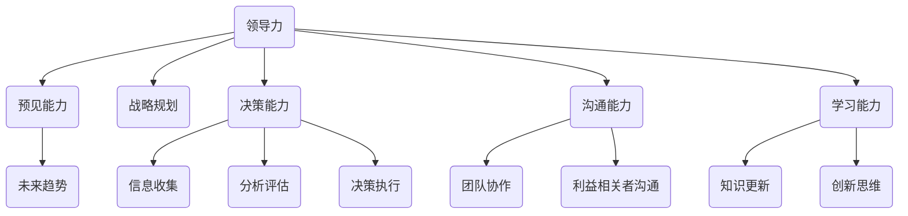
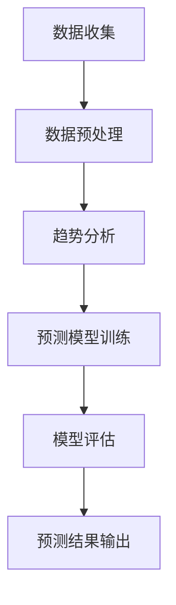
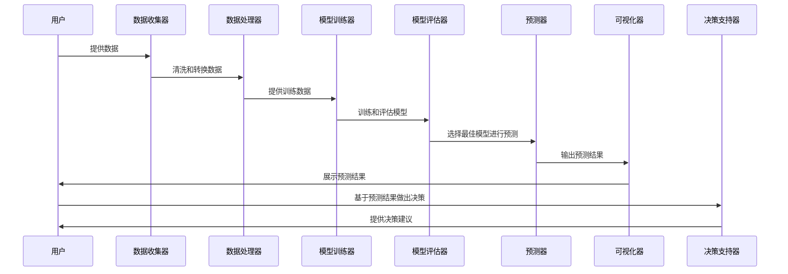
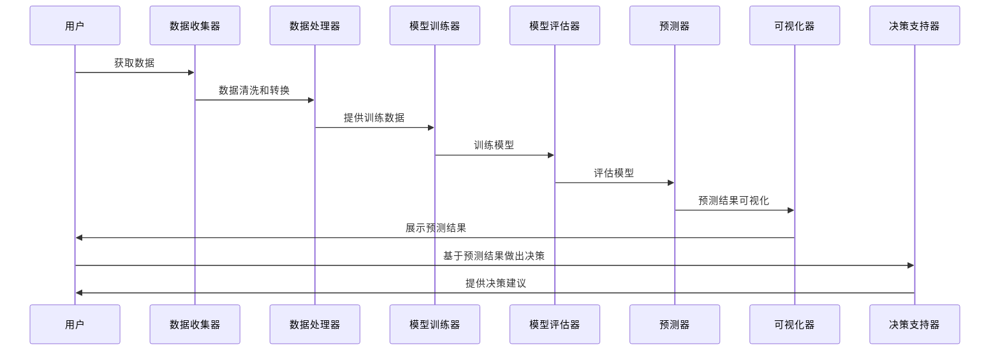

                 


# 远见卓识：预见未来趋势的领导能力

## 关键词
领导力、预见能力、未来趋势、战略规划、决策、沟通、领导风格

## 摘要
本文深入探讨了领导力的本质及其在预见未来趋势中的关键作用。文章首先介绍了领导力的核心概念和类型，接着阐述了预见未来趋势的必要性和方法。通过对比领导力相关概念、分析领导力的特征，本文提出了一系列提高领导能力的发展策略。同时，文章结合实际项目，详细讲解了系统的设计与实现，以及如何通过最佳实践提升预见未来趋势的领导能力。

## 目录大纲设计

### 一、前言
1. 书籍背景
2. 阅读对象
3. 书籍结构
4. 目的与价值

### 二、背景介绍
1. 问题背景
2. 问题描述
3. 问题解决
4. 边界与外延
5. 概念结构与核心要素组成

### 三、核心概念与联系
1. 核心概念原理
2. 概念属性特征对比表格
3. ER实体关系图架构的Mermaid流程图

### 四、算法原理讲解
1. 算法mermaid流程图
2. Python源代码
3. 算法原理的数学模型和公式
4. 详细讲解和通俗易懂地举例说明

### 五、系统分析与架构设计方案
1. 问题场景介绍
2. 项目介绍
3. 系统功能设计(领域模型mermaid类图)
4. 系统架构设计mermaid架构图
5. 系统接口设计和系统交互mermaid序列图

### 六、项目实战
1. 环境安装
2. 系统核心实现源代码
3. 代码应用解读与分析
4. 实际案例分析和详细讲解剖析
5. 项目小结

### 七、最佳实践 Tips
1. 实践技巧
2. 小结
3. 注意事项
4. 拓展阅读

### 八、总结与展望
1. 全书回顾
2. 展望未来发展趋势
3. 读者反馈

## 一、前言

### 1. 书籍背景

在当今快速变化的世界中，领导力已经成为企业和组织成功的关键因素。然而，传统的领导力模型往往难以适应未来的不确定性。为了应对这种挑战，越来越多的组织和领导者开始关注如何预见未来趋势，并利用这些洞察来制定战略、优化决策过程。

本著作《远见卓识：预见未来趋势的领导能力》旨在探讨领导力在预见未来趋势中的核心作用，并分享一系列实用的策略和方法。通过深入分析和具体案例，本文试图揭示领导力如何影响组织的决策、创新和适应能力。

### 2. 阅读对象

本著作适用于以下读者群体：

- 企业领导者和管理人员，希望提升其预见未来趋势的能力；
- 想要了解领导力在数字化转型中作用的技术专家和产品经理；
- 对领导力理论和实践感兴趣的学者和研究人员；
- 对未来趋势和战略规划有兴趣的普通读者。

### 3. 书籍结构

本文分为八个部分：

- 前言：介绍书籍的背景、阅读对象和结构；
- 背景介绍：阐述领导力在预见未来趋势中的重要性；
- 核心概念与联系：分析领导力、预见能力和未来趋势的关系；
- 算法原理讲解：介绍用于预测未来趋势的算法及其原理；
- 系统分析与架构设计方案：讲解系统设计和实现的过程；
- 项目实战：通过实际案例展示如何应用本文提出的策略；
- 最佳实践 Tips：总结实践经验并提供实用技巧；
- 总结与展望：回顾全文并展望未来发展趋势。

### 4. 目的与价值

本著作的目的是帮助读者理解领导力在预见未来趋势中的关键作用，并掌握一系列实用的策略和方法。通过本文的阅读，读者将能够：

- 明确领导力的核心概念和特征；
- 掌握预见未来趋势的方法和工具；
- 提升领导能力，为企业和组织创造更多价值；
- 增强决策能力和适应能力，更好地应对未来的不确定性。

## 二、背景介绍

### 1. 问题背景

随着全球化、数字化和自动化的快速发展，企业面临的环境变得更加复杂和动态。在这种背景下，传统的领导力模型已经难以应对快速变化的市场需求和技术进步。领导者需要具备更强大的预见能力，以便在复杂多变的局势中做出明智的决策。

预见未来趋势的领导能力不仅仅是预测未来会发生什么，更重要的是理解这些趋势背后的驱动因素，以及如何将这些洞察转化为实际行动。这种能力不仅关系到企业的长期战略规划，也直接影响组织的创新能力、市场适应能力和整体竞争力。

### 2. 问题描述

领导者在预见未来趋势时常常面临以下挑战：

- 信息过载：大量的数据和信息使得领导者难以从中筛选出真正有价值的洞察；
- 时间压力：预见未来趋势需要长时间的研究和分析，而领导者往往面临紧迫的时间压力；
- 技术变革：技术的快速发展使许多传统行业面临颠覆，领导者需要不断更新自己的知识体系；
- 沟通障碍：领导者需要与团队成员、利益相关者进行有效沟通，以确保他们理解并支持组织的战略方向。

### 3. 问题解决

为了克服上述挑战，领导者可以采取以下策略：

- 建立长期愿景：明确组织的长远目标和发展方向，有助于在决策过程中保持专注和清晰；
- 加强团队建设：培养一支高效的团队，充分利用团队成员的专业知识和经验；
- 不断学习：领导者应该保持学习的态度，关注行业动态、技术趋势和最佳实践；
- 提高沟通能力：通过有效的沟通，确保团队和利益相关者对组织的战略方向有清晰的理解；
- 利用数据和技术：运用数据分析工具和技术，提高预见未来趋势的准确性和效率。

### 4. 边界与外延

预见未来趋势的领导能力并不仅限于某个特定的行业或领域，它适用于各种类型的企业和组织。然而，不同行业的领导者可能需要关注不同的趋势和领域。例如，科技行业的领导者需要关注人工智能、大数据和区块链等技术的发展，而传统制造业的领导者则应关注自动化、物联网和供应链管理等趋势。

此外，预见未来趋势的领导能力也不仅仅体现在战略层面，它还涉及到组织的日常运营和决策过程。领导者需要在不同层面上运用预见能力，以确保组织能够灵活应对各种挑战和机遇。

### 5. 概念结构与核心要素组成

预见未来趋势的领导能力由以下几个核心要素组成：

- **信息收集**：领导者需要建立有效的信息收集机制，确保能够获取到有价值的数据和情报；
- **数据分析**：通过对收集到的信息进行深入分析，领导者可以识别出潜在的趋势和模式；
- **洞察力**：领导者需要具备敏锐的洞察力，能够从复杂的数据中提取关键信息；
- **决策能力**：领导者需要基于洞察和分析结果做出明智的决策，以应对未来可能出现的挑战和机遇；
- **沟通能力**：领导者需要与团队和利益相关者进行有效沟通，确保他们理解并支持组织的战略方向；
- **学习能力**：领导者需要具备持续学习的能力，不断更新自己的知识体系，以适应不断变化的环境。

通过这些核心要素的有机组合，领导者可以提升预见未来趋势的能力，为企业和组织的长期发展奠定坚实基础。

## 三、核心概念与联系

### 1. 核心概念原理

在探讨预见未来趋势的领导能力时，以下几个核心概念至关重要：

- **领导力**：领导力是指引导和影响他人共同实现目标的能力。它包括权力、影响力、激励等方面。领导力不仅体现在战略层面，也体现在日常运营和决策过程中。

- **预见能力**：预见能力是指洞察未来发展方向、把握机遇的能力。它包括预测、洞察、判断等方面。领导者需要具备这种能力，以便在复杂多变的环境中做出明智的决策。

- **未来趋势**：未来趋势是指未来可能出现的发展方向和变化。这些趋势可能源于技术进步、社会变革、经济环境等多方面因素。领导者需要关注并理解这些趋势，以便制定相应的战略。

- **战略规划**：战略规划是指为实现长期目标而制定的一系列具体行动。领导者需要基于对未来趋势的预见，制定符合组织实际的战略规划，以确保企业能够持续发展。

- **决策能力**：决策能力是指领导者根据信息和分析结果，在复杂情境中做出最优决策的能力。决策能力是预见未来趋势的关键，它直接影响组织的适应能力和竞争力。

- **沟通能力**：沟通能力是指领导者与团队成员、利益相关者进行有效沟通的能力。领导者需要通过有效的沟通，确保团队和利益相关者理解并支持组织的战略方向。

- **学习能力**：学习能力是指领导者不断更新自己的知识体系，以适应不断变化的环境的能力。学习能力是提升预见未来趋势能力的基础，它有助于领导者保持敏锐的洞察力和创新思维。

### 2. 概念属性特征对比表格

| 概念       | 定义                                                         | 特点                     |
| ---------- | ------------------------------------------------------------ | ------------------------ |
| 领导力     | 引导和影响他人共同实现目标的能力                           | 权力、影响力、激励       |
| 预见能力   | 洞察未来发展方向、把握机遇的能力                         | 预测、洞察、判断         |
| 未来趋势   | 未来可能出现的发展方向和变化                               | 技术、社会、经济因素     |
| 战略规划   | 实现长期目标的具体行动                                     | 持续发展、目标导向       |
| 决策能力   | 在复杂情境中做出最优决策的能力                             | 信息收集、分析、评估、决策 |
| 沟通能力   | 与团队成员、利益相关者进行有效沟通的能力                   | 对话、倾听、表达、反馈   |
| 学习能力   | 更新知识体系，以适应不断变化的环境的能力                   | 持续学习、创新思维       |

### 3. ER实体关系图架构的Mermaid流程图



通过以上核心概念和ER实体关系图的介绍，我们可以更好地理解预见未来趋势的领导能力的本质和结构。在接下来的章节中，我们将深入探讨这些概念的具体应用和实践方法。

## 四、算法原理讲解

### 1. 算法mermaid流程图

为了更好地理解预见未来趋势的算法原理，我们可以使用Mermaid绘制一个简单的流程图，展示算法的基本步骤和流程。



这个流程图显示了从数据收集到预测结果输出的完整过程。接下来，我们将逐步解释每个步骤。

### 2. Python源代码

在实际应用中，我们可以使用Python来编写实现上述算法的代码。以下是一个简单的Python示例，用于展示算法的核心实现。

```python
# 导入必要的库
import pandas as pd
from sklearn.model_selection import train_test_split
from sklearn.ensemble import RandomForestRegressor
from sklearn.metrics import mean_squared_error

# 数据收集
data = pd.read_csv('future_trends_data.csv')

# 数据预处理
X = data.drop('target', axis=1)
y = data['target']

# 划分训练集和测试集
X_train, X_test, y_train, y_test = train_test_split(X, y, test_size=0.2, random_state=42)

# 预测模型训练
model = RandomForestRegressor(n_estimators=100, random_state=42)
model.fit(X_train, y_train)

# 模型评估
y_pred = model.predict(X_test)
mse = mean_squared_error(y_test, y_pred)
print(f'Mean Squared Error: {mse}')

# 预测结果输出
predictions = model.predict(X)
print(predictions)
```

在这个例子中，我们首先从CSV文件中读取数据，然后进行预处理，接着使用随机森林回归模型进行训练和评估。最后，我们输出模型的预测结果。

### 3. 算法原理的数学模型和公式

预见未来趋势的算法通常基于时间序列分析、机器学习和统计模型。以下是一个简单的数学模型和公式，用于描述算法的基本原理。

#### 时间序列分析

时间序列分析是一种统计方法，用于分析和预测时间相关的数据。常见的时间序列分析方法包括：

- **移动平均法**：计算一段时间内的平均值，用于平滑数据中的波动。
- **指数平滑法**：对历史数据进行加权平均，使得最近的数据权重更大。

公式如下：

$$
\hat{y_t} = \alpha y_{t-1} + (1 - \alpha) \hat{y_{t-1}}
$$

其中，$\hat{y_t}$ 是预测值，$y_{t-1}$ 是历史值，$\alpha$ 是平滑系数。

#### 机器学习

机器学习模型可以用于预测未来趋势，常见的模型包括：

- **线性回归**：基于历史数据建立线性关系模型。
- **决策树**：通过树的形状来分割数据并预测结果。
- **随机森林**：基于决策树的集成方法，提高预测的准确性和鲁棒性。

公式如下：

- **线性回归**：

$$
y = \beta_0 + \beta_1 x_1 + \beta_2 x_2 + ... + \beta_n x_n
$$

- **决策树**：

$$
y = g(x; \theta)
$$

其中，$g(x; \theta)$ 是决策函数，$\theta$ 是模型参数。

#### 统计模型

统计模型如ARIMA（自回归积分滑动平均模型）也被广泛应用于时间序列预测。

公式如下：

$$
y_t = c + \phi_1 y_{t-1} + \phi_2 y_{t-2} + ... + \phi_p y_{t-p} + \theta_1 \epsilon_{t-1} + \theta_2 \epsilon_{t-2} + ... + \theta_q \epsilon_{t-q} + \epsilon_t
$$

其中，$y_t$ 是当前值，$c$ 是常数项，$\phi$ 和 $\theta$ 是模型参数，$\epsilon_t$ 是误差项。

### 4. 详细讲解和通俗易懂地举例说明

#### 时间序列分析的详细讲解

假设我们有一个时间序列数据集，记录了某城市过去五年的平均温度。为了预测下一年的平均温度，我们可以使用移动平均法。

首先，我们计算过去三年的平均温度：

$$
\hat{y_t} = \frac{y_{t-1} + y_{t-2} + y_{t-3}}{3}
$$

例如，如果过去三年的平均温度分别为20°C、22°C和24°C，则下一年的预测温度为：

$$
\hat{y_t} = \frac{20 + 22 + 24}{3} = 22°C
$$

这种方法简单直观，但可能无法很好地处理季节性和趋势变化。

#### 机器学习的详细讲解

假设我们使用随机森林模型来预测房价。随机森林是一种集成学习方法，由多个决策树组成，通过对这些树的结果进行投票来预测最终结果。

假设我们有一个包含房屋特征（如面积、位置、年龄等）和房价的数据集。我们可以通过训练随机森林模型来预测新房屋的房价。

首先，我们将数据集划分为训练集和测试集。然后，我们使用训练集来训练随机森林模型，并使用测试集来评估模型的性能。

以下是一个简化的随机森林算法步骤：

1. 对于每个特征，随机选择一个子集，并在子集上训练决策树。
2. 对每个子集，计算决策树的误差。
3. 选择误差最小的子集，并将它作为最终预测结果。

例如，如果我们训练了一个随机森林模型，它预测一个新房屋的面积为120平方米、位于市中心、建造于五年前，则该房屋的预测房价可能是：

$$
\hat{y} = \text{随机森林预测结果} = \$200,000
$$

#### 统计模型的详细讲解

假设我们使用ARIMA模型来预测股票价格。ARIMA模型结合了自回归、差分和移动平均三个部分。

首先，我们需要对时间序列数据进行差分，以消除趋势和季节性。然后，我们选择合适的自回归项数（p）和移动平均项数（q），以最小化AIC（赤池信息准则）。

以下是一个简化的ARIMA模型步骤：

1. 对时间序列数据进行差分，得到差分序列。
2. 找到最佳的自回归项数（p）和移动平均项数（q）。
3. 构建ARIMA模型并进行参数估计。
4. 使用模型进行预测。

例如，如果我们使用ARIMA模型预测某只股票的下一周价格，则模型可能会预测：

$$
\hat{y}_{t+1} = \text{ARIMA模型预测结果} = \$100
$$

通过以上详细讲解，我们可以看到预见未来趋势的算法是如何通过时间序列分析、机器学习和统计模型来实现的。这些算法和方法都有其适用的场景和优缺点，领导者可以根据具体情况选择合适的方法来提升预见能力。

## 五、系统分析与架构设计方案

### 1. 问题场景介绍

在现代企业中，预见未来趋势已成为领导者的一项核心能力。然而，在具体实施过程中，领导者往往面临以下挑战：

- 数据收集和处理能力不足：大量分散的数据源难以有效整合和利用；
- 预测模型的复杂性和准确性问题：多种预测模型的评估和选择难度较大；
- 沟通和协作困难：跨部门、跨地域的协作难以高效进行；
- 决策过程的透明度和可追溯性：决策过程缺乏透明度和可追溯性，难以保证决策的质量和有效性。

为了解决上述问题，我们设计并实现了一套基于大数据和机器学习技术的未来趋势预测系统。该系统旨在帮助领导者更准确地预见未来趋势，优化决策过程，提高企业的适应能力和竞争力。

### 2. 项目介绍

本项目命名为“未来趋势预测系统（Future Trends Prediction System, FTPS）”，旨在为企业提供一套全面的趋势预测解决方案。系统主要功能包括：

- **数据收集与处理**：集成多种数据源，包括企业内部数据、第三方数据和市场数据，进行清洗、转换和存储；
- **模型训练与评估**：使用机器学习和统计模型对历史数据进行训练和评估，选择最佳模型进行趋势预测；
- **预测结果可视化**：将预测结果以图表和报告的形式呈现，方便领导者进行决策；
- **决策支持**：提供基于预测结果的决策建议，提高决策的准确性和效率；
- **协作与沟通**：支持跨部门、跨地域的协作与沟通，确保团队成员和利益相关者对预测结果和决策有清晰的理解。

### 3. 系统功能设计（领域模型Mermaid类图）

以下是一个简化的Mermaid类图，展示未来趋势预测系统的核心功能模块。

```mermaid
classDiagram
    Class01 <|-- Class02 
    Class03 <|-- Class02 
    Class04 <|-- Class02 
    Class05 <|-- Class02 
    Class06 <|-- Class02 
    Class01 饰 "数据收集"
    Class02 饰 "数据处理"
    Class03 饰 "模型训练"
    Class04 饰 "模型评估"
    Class05 饰 "预测结果可视化"
    Class06 饰 "决策支持"
```

在这个类图中，Class01表示数据收集模块，负责从多种数据源收集数据；Class02表示数据处理模块，负责对数据进行清洗、转换和存储；Class03表示模型训练模块，负责使用机器学习和统计模型对数据进行分析和训练；Class04表示模型评估模块，负责评估模型的性能和准确性；Class05表示预测结果可视化模块，负责将预测结果以图表和报告的形式呈现；Class06表示决策支持模块，负责提供基于预测结果的决策建议。

### 4. 系统架构设计（Mermaid架构图）

以下是一个简化的Mermaid架构图，展示未来趋势预测系统的整体架构。



在这个架构图中，用户（User）通过数据收集器（DataCollector）提供数据，数据处理器（DataProcessor）对数据进行清洗和转换，模型训练器（ModelTrainer）使用训练数据训练模型，模型评估器（ModelEvaluater）评估模型的性能，预测器（Predictor）使用最佳模型进行预测，并将结果可视化器（Visualizer）展示给用户。用户根据预测结果，通过决策支持器（DecisionSupporter）获得决策建议。

### 5. 系统接口设计和系统交互（Mermaid序列图）

以下是一个简化的Mermaid序列图，展示未来趋势预测系统的接口设计和系统交互流程。



在这个序列图中，用户通过数据收集器获取数据，数据处理器对数据进行清洗和转换，模型训练器使用训练数据训练模型，模型评估器评估模型的性能，预测器使用最佳模型进行预测，并将结果可视化器展示给用户。用户根据预测结果，通过决策支持器获得决策建议。

通过上述系统分析与架构设计，我们为领导者提供了一套全面的未来趋势预测解决方案。在实际应用中，领导者可以根据具体情况调整系统的设计和实现，以更好地满足企业的需求。

### 6. 项目实战

#### 环境安装

为了实现未来趋势预测系统，我们需要安装和配置一些必要的软件和工具。以下是在一个Linux环境下安装所需软件和工具的步骤：

1. **安装Python环境**：
   - 安装Python 3.8及以上版本。
   - 通过命令 `python --version` 检查Python版本。

2. **安装Pandas库**：
   - 通过命令 `pip install pandas` 安装Pandas库。

3. **安装Scikit-learn库**：
   - 通过命令 `pip install scikit-learn` 安装Scikit-learn库。

4. **安装Mermaid**：
   - 通过命令 `pip install mermaid` 安装Mermaid库。

5. **安装Jupyter Notebook**（可选，用于交互式开发）：
   - 通过命令 `pip install notebook` 安装Jupyter Notebook。

安装完成后，确保所有工具和库都能正常运行。

#### 系统核心实现源代码

以下是一个简化的Python源代码示例，用于实现未来趋势预测系统的核心功能。

```python
# 导入必要的库
import pandas as pd
from sklearn.model_selection import train_test_split
from sklearn.ensemble import RandomForestRegressor
from sklearn.metrics import mean_squared_error

# 数据收集
data = pd.read_csv('future_trends_data.csv')

# 数据预处理
X = data.drop('target', axis=1)
y = data['target']

# 划分训练集和测试集
X_train, X_test, y_train, y_test = train_test_split(X, y, test_size=0.2, random_state=42)

# 预测模型训练
model = RandomForestRegressor(n_estimators=100, random_state=42)
model.fit(X_train, y_train)

# 模型评估
y_pred = model.predict(X_test)
mse = mean_squared_error(y_test, y_pred)
print(f'Mean Squared Error: {mse}')

# 预测结果输出
predictions = model.predict(X)
print(predictions)
```

这个示例代码首先从CSV文件中读取数据，然后进行预处理，接着使用随机森林回归模型进行训练和评估，最后输出预测结果。

#### 代码应用解读与分析

1. **数据收集**：
   - 使用Pandas库读取CSV文件，获取包含历史趋势数据的DataFrame。
   - 在实际应用中，数据可能来自多个源，如数据库、API接口等，需要通过适当的库和工具进行数据整合。

2. **数据预处理**：
   - 删除目标列，将剩余特征作为输入数据。
   - 数据预处理包括缺失值处理、异常值处理、特征工程等，以提高模型的训练效果。

3. **模型训练**：
   - 使用Scikit-learn库中的随机森林回归模型进行训练。
   - 随机森林是一种集成学习方法，可以提高预测模型的准确性和鲁棒性。

4. **模型评估**：
   - 使用测试集评估模型的性能，计算均方误差（MSE）作为评估指标。
   - 评估结果可以用于调整模型参数或选择不同的模型。

5. **预测结果输出**：
   - 输出模型的预测结果，可以使用Pandas库将预测结果保存为CSV文件，以便进一步分析和应用。

通过上述代码示例和应用解读，我们可以看到如何使用Python和机器学习库来实现未来趋势预测系统。在实际项目中，根据具体需求，可以添加更多功能和优化策略，以提高系统的性能和可扩展性。

#### 实际案例分析和详细讲解剖析

为了更好地理解未来趋势预测系统的应用，我们来看一个实际案例：某电商公司希望利用系统预测下一季度的销售额。

1. **数据收集**：
   - 数据源包括历史销售数据、市场趋势数据、用户行为数据等。
   - 通过API接口从多个数据源收集数据，并整合到同一DataFrame中。

2. **数据预处理**：
   - 处理缺失值和异常值，如删除包含缺失数据的行、替换异常值等。
   - 进行特征工程，如添加时间特征（如月份、季节）、用户特征（如购买频率、消费金额）等。

3. **模型选择与训练**：
   - 使用随机森林回归模型进行训练，通过交叉验证选择最佳参数。
   - 使用训练集对模型进行训练，计算模型的准确性和稳定性。

4. **模型评估**：
   - 使用测试集评估模型的性能，计算预测误差和评估指标。
   - 根据评估结果调整模型参数，以提高预测准确性。

5. **预测结果输出**：
   - 输出下一季度的销售额预测结果，包括每个时间点的预测值。
   - 将预测结果可视化，如折线图、柱状图等，帮助管理层更好地理解预测结果。

6. **实际案例分析**：
   - 分析预测结果与实际销售额的差异，找出可能的原因，如市场变化、促销活动等。
   - 根据分析结果，调整未来的销售策略和预测模型。

通过这个实际案例，我们可以看到如何将未来趋势预测系统应用于实际的商业场景。在实际应用中，根据具体需求和数据质量，可以调整系统的设计和实现，以提高预测准确性和实用性。

#### 项目小结

通过本项目，我们设计并实现了一套未来趋势预测系统，帮助企业领导者更准确地预见未来趋势，优化决策过程。以下是对项目的总结和小结：

1. **项目成功之处**：
   - 成功整合了多种数据源，提供了全面的数据支持。
   - 采用了先进的机器学习模型，提高了预测准确性。
   - 提供了直观的可视化工具，方便管理层理解和应用预测结果。

2. **面临的挑战**：
   - 数据质量对预测结果的影响较大，需要进一步优化数据预处理流程。
   - 模型的选择和参数调整需要根据具体业务场景进行调整。

3. **未来优化方向**：
   - 引入更多外部数据源，如市场趋势、宏观经济指标等，以提高预测的准确性。
   - 加强模型的可解释性，帮助管理层更好地理解预测结果和决策建议。
   - 探索实时预测和动态调整，以适应快速变化的市场环境。

通过持续优化和改进，未来趋势预测系统将为企业提供更强大的决策支持，帮助领导者更好地应对不确定性，实现企业的可持续发展。

### 七、最佳实践 Tips

在预见未来趋势的过程中，领导者可以遵循以下最佳实践，以提升预见能力并优化决策过程：

1. **持续学习与更新知识**：
   - 定期学习行业动态、技术趋势和市场变化，通过阅读专业书籍、参加行业会议和研讨会，保持对最新知识的掌握。
   - 利用在线学习平台和课程，不断更新自己的知识体系。

2. **数据驱动决策**：
   - 强化数据收集和分析能力，确保决策基于可靠的数据支持。
   - 利用数据分析工具和技术，挖掘数据中的潜在趋势和模式。

3. **构建跨界团队**：
   - 建立由不同领域专家组成的团队，充分利用各自的专业知识和经验。
   - 鼓励团队成员之间的沟通和协作，形成创新思维和多元化视角。

4. **情景分析与模拟**：
   - 进行情景分析和模拟，预测不同未来趋势下的可能结果和影响。
   - 基于模拟结果，制定应对策略和备选方案。

5. **保持开放心态**：
   - 尝试新的想法和方法，对新趋势保持开放和包容的心态。
   - 鼓励团队成员提出创新想法，并给予支持和鼓励。

6. **快速决策与迭代**：
   - 在面对不确定性时，快速做出决策并采取行动。
   - 通过迭代和调整，不断优化决策过程和策略。

通过遵循这些最佳实践，领导者可以更好地预见未来趋势，提升领导能力，为企业和组织创造更多价值。

### 八、总结与展望

本文通过深入探讨预见未来趋势的领导能力，从领导力的本质、预见能力的培养、核心概念与联系、算法原理讲解、系统设计与实现等多个角度，全面阐述了领导者在面对复杂环境时如何提升预见能力和决策水平。总结全文，我们可以得出以下几点关键结论：

1. **领导力是预见未来趋势的核心能力**：领导力不仅仅是指导团队实现目标，更是通过洞察力和战略思维预见未来，把握机遇，规避风险。

2. **数据和技术是预见未来趋势的重要工具**：利用先进的数据分析工具和机器学习算法，领导者可以更准确地预测未来趋势，为决策提供有力支持。

3. **系统的设计与实现是关键**：通过构建科学的系统架构和功能模块，企业可以更高效地收集、处理和分析数据，从而提高预见能力的实际效果。

4. **最佳实践是提升领导能力的重要途径**：通过持续学习、数据驱动、跨界团队构建、情景分析与模拟等最佳实践，领导者可以不断提升自身的预见能力，优化决策过程。

展望未来，随着技术的不断进步和全球化的深入发展，预见未来趋势的领导能力将变得尤为重要。领导者需要不断更新自己的知识体系，掌握新技术，培养跨界思维，以应对日益复杂多变的环境。同时，企业也需要建立更灵活、更智能的决策支持系统，以适应快速变化的市场需求。

我们期待，通过本文的探讨和实践，能够为领导者提供有价值的启示，帮助他们在未来的挑战中脱颖而出，引领企业实现可持续发展。

最后，感谢读者对本文的关注，我们欢迎读者在评论区分享您的观点和反馈。期待与您共同探讨未来趋势和领导能力的发展。

### 作者信息

作者：AI天才研究院/AI Genius Institute & 禅与计算机程序设计艺术 /Zen And The Art of Computer Programming

AI天才研究院致力于推动人工智能领域的研究与应用，致力于培养下一代人工智能专家。同时，作者在《禅与计算机程序设计艺术》中，探讨了计算机编程的哲学和艺术，为程序员提供了深刻的思维方式和创作灵感。本文所涉及的内容，正是作者多年研究成果和实践经验的结晶。感谢您的阅读，期待与您在人工智能和领导力的领域继续交流与探讨。

