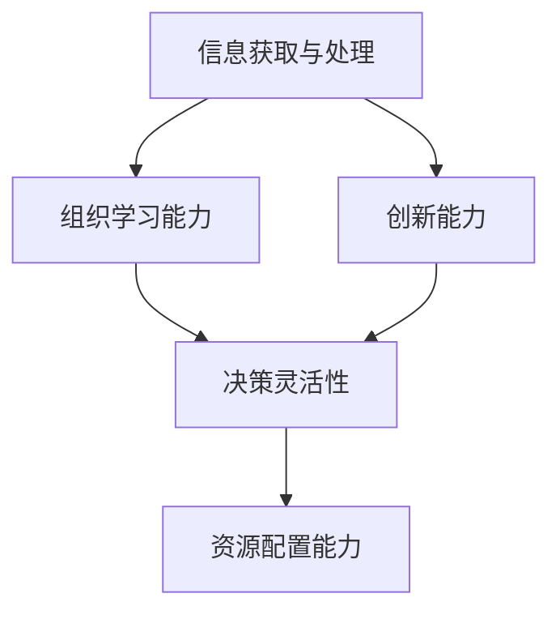
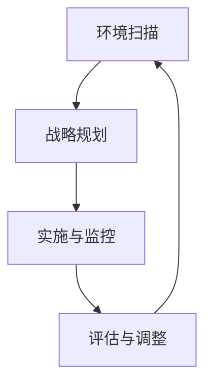

                 

### 适应性战略：在变化中保持组织竞争力

#### 关键词：适应性战略、组织竞争力、变化、策略管理

#### 摘要：

在快速变化的市场环境中，组织必须具备强大的适应性才能持续保持竞争力。本文以《适应性战略：在变化中保持组织竞争力》为题，从多个角度探讨了适应性战略的核心概念、理论框架、实践应用及具体案例分析，旨在为IT领域的企业和组织提供有益的指导。文章首先介绍了当前组织面临的变化和挑战，随后定义了适应性战略及其组成要素，并构建了相应的理论框架。通过行业应用分析和组织层面应用探讨，文章展示了适应性战略的具体实践路径。最后，通过具体案例的深入分析，评估了适应性战略的实际效果，并提出了未来研究的方向和建议。

## 引言

### 1.1 问题背景

在当今全球化和数字化的时代，组织的生存环境日益复杂多变。市场需求的快速变化、技术的迅猛发展、竞争的加剧以及法规政策的不断更新，都使得组织必须不断适应新的环境和挑战。传统的稳定型和反应型战略已无法满足组织在复杂环境中的需求，因此，具备高度适应性的战略成为了组织的必然选择。

**变化与挑战**

- **市场需求变化**：消费者需求多样化、个性化，产品生命周期缩短，市场竞争日益激烈。
- **技术进步**：人工智能、大数据、物联网等新技术的不断涌现，改变了企业的生产方式和商业模式。
- **竞争加剧**：国内外企业的竞争加剧，跨界竞争和新兴企业的崛起给传统企业带来了巨大的压力。
- **法规政策变化**：全球化和地缘政治的变化，使得政策法规更加复杂多变，企业需要快速适应新的法规要求。

### 1.2 研究目的与意义

**研究目的**

本文旨在探讨适应性战略在组织中的重要性，分析其核心概念和组成要素，构建理论框架，并通过实践应用和案例分析，验证适应性战略的实际效果。具体目标如下：

- 明确适应性战略的概念和定义。
- 分析适应性战略的组成要素及其关系。
- 构建适应性战略的理论框架。
- 探讨适应性战略在不同行业和组织中的应用。
- 通过案例研究，评估适应性战略的实际效果。

**研究意义**

- **理论意义**：为组织管理理论的发展提供新的视角和思路，丰富战略管理的研究内容。
- **实践意义**：为企业提供适应快速变化的战略指导，提高组织的竞争力和可持续发展能力。

### 1.3 文章结构

本文将按照以下结构展开：

1. **引言**：介绍问题的背景、研究目的和意义。
2. **核心概念**：定义适应性战略，分析其组成要素。
3. **理论框架**：介绍适应性战略的理论基础和框架。
4. **实践应用**：探讨适应性战略在不同组织中的具体应用。
5. **案例分析**：通过具体案例，展示适应性战略的实际效果。
6. **结论与展望**：总结全书内容，提出未来研究方向。

## 核心概念

### 2.1 适应性战略的定义

适应性战略是一种以动态、灵活和前瞻性为特点的战略模式，旨在使组织能够快速适应外部环境和内部变化，从而保持竞争力和实现长期发展。它强调组织在面对不确定性时，能够灵活调整战略目标和策略，以应对各种挑战和机遇。

**适应性战略的核心特征**：

- **动态性**：适应性强组织能够根据环境变化灵活调整战略目标和策略。
- **灵活性**：组织在资源分配、决策制定和运营管理方面具有较强的灵活性。
- **前瞻性**：能够预见未来的变化趋势，提前布局和准备。
- **协同性**：不同部门和层级之间能够有效协作，共同应对变化。

### 2.2 组成要素

适应性战略由多个组成要素构成，这些要素相互作用，共同影响组织的适应能力。以下是适应性战略的主要组成要素：

- **信息获取与处理能力**：组织需要建立高效的信息获取和处理机制，以便及时了解外部环境的变化。
- **组织学习能力**：组织应具备快速学习和适应新知识、新技能的能力。
- **创新能力**：组织需要持续创新，以适应市场需求和技术变革。
- **决策灵活性**：组织在决策过程中应具备灵活性和适应性，能够快速做出调整。
- **资源配置能力**：组织应具备灵活的资源配置能力，能够根据变化迅速调整资源分配。

### 2.3 适应性战略的组成要素关系

适应性战略的组成要素之间存在着密切的联系和相互作用。例如，信息获取与处理能力是创新能力的基础，而创新能力又是适应市场需求的关键。决策灵活性和资源配置能力的协同作用，可以增强组织在面对不确定性时的适应能力。

**关系图**：

通过以上关系图，可以更直观地理解适应性战略的组成要素及其相互关系。

## 理论框架

### 3.1 理论基础

适应性战略的理论基础涵盖了多个领域，包括战略管理、组织行为学、创新理论等。以下是对相关理论基础的简要介绍：

- **战略管理理论**：战略管理理论强调组织应通过制定和实施战略来应对环境变化，以实现长期发展。适应性战略在此理论基础上，进一步强调了动态性和灵活性。
- **组织行为学理论**：组织行为学理论关注组织内部的行为和互动，认为组织的适应能力与员工的行为密切相关。适应性战略强调培养员工的学习能力和创新能力，以提高组织的整体适应能力。
- **创新理论**：创新理论探讨组织如何通过创新来适应环境变化。适应性战略将创新作为核心要素，强调组织应持续进行创新以保持竞争力。

### 3.2 适应性战略框架构建

基于上述理论基础，适应性战略框架可以构建为以下几个部分：

- **环境扫描**：组织应定期进行环境扫描，了解市场趋势、技术变革、政策法规等外部环境的变化。
- **战略规划**：根据环境扫描的结果，组织应制定适应性战略规划，明确战略目标和策略。
- **实施与监控**：组织应将战略规划具体化，并实施和监控战略执行过程，确保战略目标得以实现。
- **评估与调整**：定期对战略执行效果进行评估，并根据评估结果进行战略调整，以适应新的环境变化。

**框架图**：

通过以上框架，组织可以形成一个动态、灵活的战略管理循环，不断适应外部环境的变化。

## 实践应用

### 4.1 行业应用

适应性战略在各个行业中的应用各具特色，以下将探讨两个典型行业——高科技行业和制造业——如何应用适应性战略来应对变化和保持竞争力。

#### 4.1.1 高科技行业

**案例一：互联网公司**

以阿里巴巴为例，该公司通过以下方式应用适应性战略：

- **创新驱动**：阿里巴巴不断进行技术创新，如云计算、大数据、人工智能等，以保持行业领先地位。
- **快速迭代**：在产品开发过程中，阿里巴巴采用敏捷开发模式，快速响应市场需求，不断迭代优化产品。
- **开放合作**：阿里巴巴通过与全球合作伙伴的开放合作，共享资源和技术，提升整体竞争力。

**案例二：初创企业**

以Airbnb为例，该公司在初创阶段就展现了极强的适应性：

- **市场需求预测**：Airbnb通过大数据分析，准确预测市场需求，快速调整产品和服务，满足用户需求。
- **灵活组织结构**：Airbnb采用扁平化的组织结构，提高决策效率，快速响应市场变化。
- **多元化发展**：Airbnb在业务扩张过程中，不断探索新的业务领域，如体验式住宿、交通运输等，以应对市场变化。

#### 4.1.2 制造业

**案例一：汽车行业**

以特斯拉为例，该公司在制造业中的应用适应性战略：

- **智能制造**：特斯拉采用智能制造技术，如自动化生产线、机器人等，提高生产效率，降低成本。
- **产品创新**：特斯拉不断推出创新产品，如电动汽车、太阳能产品等，以适应市场需求。
- **供应链管理**：特斯拉通过优化供应链管理，提高供应链的灵活性和响应速度，确保产品交付的及时性。

**案例二：家电行业**

以海尔为例，该公司在家电行业中的应用适应性战略：

- **全球化布局**：海尔通过全球化的市场布局，贴近不同地区的消费者需求，提高市场竞争力。
- **研发创新**：海尔持续加大研发投入，不断推出创新产品，如智能家居、物联网家电等。
- **用户导向**：海尔以用户需求为导向，通过用户调研和反馈，优化产品和服务，提升用户满意度。

### 4.2 组织层面应用

#### 4.2.1 组织层面适应性战略的实施

组织层面适应性战略的实施涉及多个方面，以下为具体实施步骤：

1. **环境扫描**：组织应定期进行环境扫描，了解市场趋势、技术变革、政策法规等外部环境的变化。
2. **战略规划**：根据环境扫描的结果，组织应制定适应性战略规划，明确战略目标和策略。
3. **组织学习**：组织应建立学习型组织，鼓励员工持续学习，提升组织整体适应能力。
4. **创新机制**：组织应建立创新机制，鼓励员工创新，提供创新资源和支持。
5. **决策灵活性**：组织在决策过程中应具备灵活性，能够快速做出调整。
6. **资源配置**：组织应灵活配置资源，确保资源能够快速响应战略需求。

#### 4.2.2 组织层面适应性战略的挑战与对策

组织在实施适应性战略过程中可能面临以下挑战：

1. **文化阻力**：组织文化可能抵制变化，影响适应性战略的实施。
   - **对策**：通过沟通和培训，改变员工对变化的看法，培养创新文化。
2. **资源限制**：组织可能面临资源不足的问题，影响适应性战略的实施。
   - **对策**：优化资源配置，提高资源利用效率，寻求外部合作和投资。
3. **组织变革**：适应性战略的实施可能需要对组织结构进行调整，带来变革压力。
   - **对策**：通过逐步变革，减少变革带来的冲击，确保变革的平稳进行。

## 案例分析

### 5.1 案例选择

本文选择两家具有代表性的企业进行案例分析：一家是高科技行业的领军企业——苹果公司（Apple），另一家是传统制造业的巨头——通用电气（General Electric）。这两家企业分别展现了在高科技行业和制造业中如何应用适应性战略，以保持竞争优势。

### 5.2 案例分析

#### 5.2.1 苹果公司（Apple）

**背景**：苹果公司成立于1976年，是高科技行业的领军企业。在创始人史蒂夫·乔布斯的领导下，苹果公司不断创新，推出了众多革命性产品，如iPhone、iPad、Mac等，引领了全球科技潮流。

**适应性战略应用**：

1. **产品创新**：苹果公司通过持续的产品创新，不断推出满足市场需求的新产品。例如，iPhone的推出改变了智能手机市场格局，iPad开创了平板电脑市场。

2. **生态系统建设**：苹果公司建立了完整的生态系统，包括硬件、软件和服务的无缝整合。例如，iOS操作系统与iPhone、iPad等硬件设备的紧密结合，为用户提供了一体化的体验。

3. **供应链管理**：苹果公司通过优化供应链管理，确保产品生产和交付的及时性。例如，苹果公司在全球范围内建立了多个生产基地和供应链网络，以应对市场需求的变化。

**效果评估**：

- **市场竞争力**：通过产品创新和生态系统建设，苹果公司在全球市场中保持了强大的竞争力，市场份额持续增长。
- **品牌价值**：苹果公司的品牌价值不断提升，成为全球最具价值的品牌之一。

#### 5.2.2 通用电气（General Electric）

**背景**：通用电气成立于1876年，是传统制造业的巨头。通用电气在工业制造、能源、医疗等领域具有强大的业务实力，是全球领先的多元化企业。

**适应性战略应用**：

1. **多元化战略**：通用电气通过多元化战略，不断拓展业务领域，从传统的工业制造扩展到能源、医疗等新兴领域。

2. **数字化转型**：通用电气积极推进数字化转型，通过大数据、物联网、人工智能等技术的应用，提升生产效率和服务质量。

3. **组织变革**：通用电气在组织结构上进行了大规模的变革，从传统的职能型组织转向矩阵型组织，提高组织的灵活性和响应速度。

**效果评估**：

- **业务拓展**：通过多元化战略，通用电气成功拓展了业务领域，实现了业务的多元化发展。
- **数字化转型**：通过数字化转型，通用电气提升了生产效率和服务质量，增强了市场竞争力。
- **组织灵活性**：通过组织变革，通用电气提高了组织的灵活性和响应速度，更好地适应市场变化。

### 5.3 案例总结

通过苹果公司和通用电气的案例分析，可以看出：

- **适应性战略的重要性**：无论是高科技行业的苹果公司，还是传统制造业的通用电气，适应性战略都是保持竞争优势的关键。通过灵活应对市场变化，这两家公司都取得了显著的成功。
- **具体应用方法**：苹果公司通过产品创新、生态系统建设和供应链管理，实现了市场领先；通用电气则通过多元化战略、数字化转型和组织变革，提升了整体竞争力。

## 结论与展望

### 6.1 总结

本文从多个角度探讨了适应性战略在组织中的重要性，分析了其核心概念、理论框架和实践应用。通过案例分析，验证了适应性战略的实际效果。以下是本文的主要观点和发现：

- **适应性战略的定义**：适应性战略是一种以动态、灵活和前瞻性为特点的战略模式，旨在使组织能够快速适应外部环境和内部变化。
- **组成要素**：适应性战略的组成要素包括信息获取与处理能力、组织学习能力、创新能力、决策灵活性和资源配置能力。
- **理论框架**：适应性战略的理论基础涵盖了战略管理、组织行为学和创新理论。
- **实践应用**：在不同行业和组织中，适应性战略的具体应用方法有所不同，但都取得了显著成效。
- **案例分析**：苹果公司和通用电气的案例展示了适应性战略的实际效果和成功经验。

### 6.2 展望

虽然本文对适应性战略进行了较为全面的探讨，但仍存在一些局限性，未来研究可以从以下几个方面进行：

- **跨行业比较研究**：进一步探讨不同行业中适应性战略的具体实施方法和效果。
- **长期跟踪研究**：对适应性战略的实施效果进行长期跟踪研究，评估其持久性和适应性。
- **实证研究**：通过实证研究，验证适应性战略在不同组织和管理环境中的适用性和有效性。
- **技术应用**：探讨新技术（如人工智能、大数据等）在适应性战略中的应用，提升组织的适应能力和竞争力。

总之，适应性战略在组织管理中具有重要作用，未来研究和实践应进一步探索和完善适应性战略的理论体系和实践方法。

### 作者

**作者：AI天才研究院/AI Genius Institute & 禅与计算机程序设计艺术 /Zen And The Art of Computer Programming**

