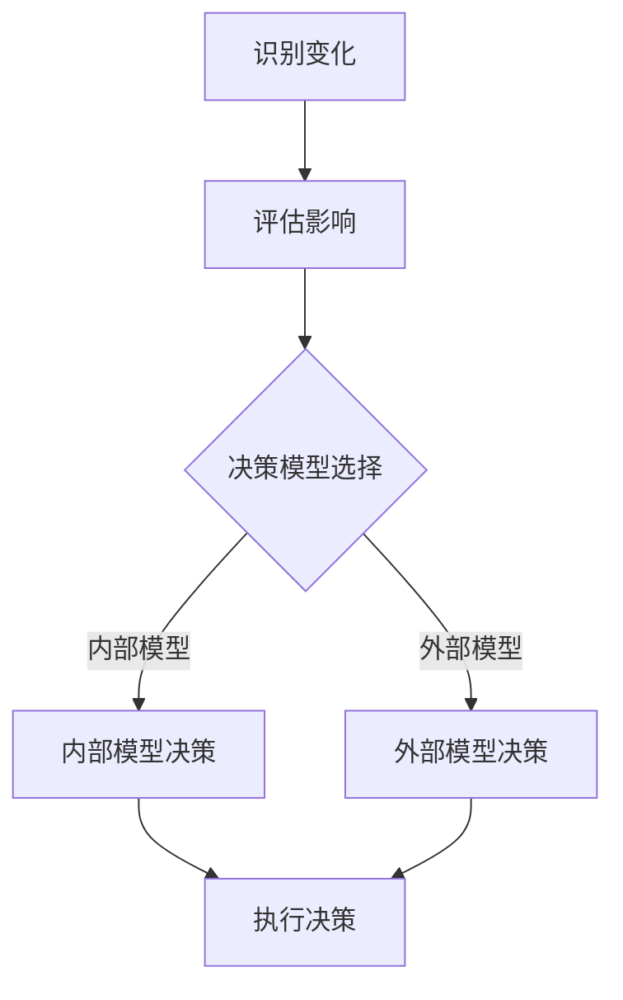
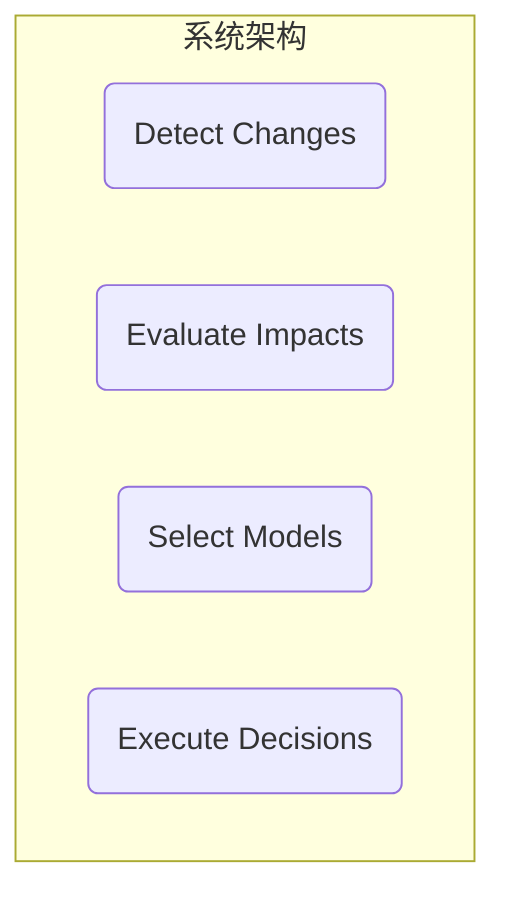
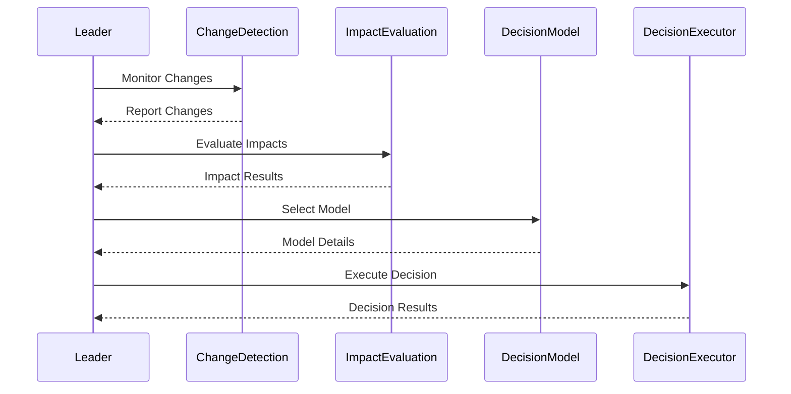

                 

### 文章标题

适应性领导：在VUCA时代保持灵活性

### 关键词

- **VUCA时代**
- **适应性领导**
- **组织文化**
- **决策能力**
- **创新管理**
- **领导者的个人发展**

### 摘要

在当今的VUCA时代（易变、不确定、复杂、模糊），领导者的角色面临着前所未有的挑战。本文深入探讨了适应性领导的概念、原则、策略和实践，为领导者提供了如何在动荡的环境中保持组织灵活性和持续发展的策略和工具。

### 目录大纲：

#### 第一部分：理解VUCA时代与适应性领导

#### 第1章：VUCA时代的特征与挑战

#### 第2章：适应性领导的四大原则

#### 第二部分：适应性领导的具体策略

#### 第3章：建立适应性组织文化

#### 第4章：提高决策能力

#### 第5章：创新管理

#### 第6章：领导者的个人发展

#### 第三部分：适应性领导实践案例分析

#### 第7章：案例一：应对市场变化的领导策略

#### 第7章：案例二：危机中的领导决策

#### 第7章：案例三：创新领导实践

#### 结论

#### 8.1 适应性领导的核心观点

#### 8.2 适应性领导的未来展望

#### 8.3 对读者的建议

### 核心概念与联系

#### 适应性领导的概念

适应性领导是一种在VUCA（易变、不确定、复杂、模糊）环境中，能够灵活应对变化、抓住机遇、维持组织活力的领导方式。它强调领导者需要具备快速适应变化、灵活应对挑战的能力，以及培养团队共同适应的环境。

### 适应性领导的特点

- **主动适应**：领导者主动调整自身和团队，以适应环境变化。
- **灵活应变**：在不确定性面前，领导者能够快速做出决策和调整。
- **全局思维**：领导者具备从整体上思考和解决问题的能力。
- **人本管理**：领导者关注员工的发展，建立积极的工作氛围。

### 算法原理讲解

适应性领导涉及到多个层面的决策和策略。以下是一个简单的适应性领导算法框架，用于指导领导者在VUCA时代中的决策过程。

#### 算法流程图



#### 算法原理详细讲解

1. **识别变化**：领导者需要时刻关注内外部环境的变化，如市场趋势、技术进步、法律法规等。

2. **评估影响**：对识别出的变化进行影响评估，确定其对于组织战略、运营、员工等的影响程度。

3. **决策模型选择**：根据变化的影响程度和类型，选择适合的决策模型。内部模型可能包括SWOT分析、PEST分析等，而外部模型可能依赖于市场研究、专家咨询等。

4. **执行决策**：根据决策模型的结果，制定并执行具体的行动计划。

### 数学模型和公式

适应性领导中常用的决策模型可以使用以下数学公式表示：

$$
\text{决策结果} = f(\text{变化程度}, \text{影响评估}, \text{决策模型})
$$

### 详细讲解与举例说明

假设一个公司在面临市场变化时，需要决定是否进行产品线的扩展。

1. **识别变化**：市场调研显示，某新兴市场对某种产品需求激增。

2. **评估影响**：扩展产品线可能带来额外收入，但也需要承担额外的成本和风险。

3. **决策模型选择**：使用SWOT分析来评估扩展的优劣势。

    - 优势：扩大市场份额、增加收入。
    - 劣势：可能需要大量投资、市场竞争加剧。
    - 机会：满足新兴市场需求、提高品牌知名度。
    - 威胁：市场份额可能被其他竞争对手占据。

4. **执行决策**：根据SWOT分析结果，决定是否进行产品线扩展。

- 如果优势大于劣势，且机会大于威胁，则进行产品线扩展。
- 如果劣势大于优势，或威胁大于机会，则暂缓扩展。

### 系统分析与架构设计方案

在建立适应性组织文化时，我们需要考虑系统分析与架构设计。以下是一个简单的架构设计方案：

#### 系统功能设计（领域模型类图）

```mermaid
classDiagram
    ChangeDetection <<interface>>
    ImpactEvaluation <<interface>>
    DecisionModel <<interface>>
    DecisionExecutor <<interface>>

    OrganizationTeam o--o ChangeDetection
    OrganizationTeam o--o ImpactEvaluation
    OrganizationTeam o--o DecisionModel
    OrganizationTeam o--o DecisionExecutor
```

#### 系统架构设计（架构图）



#### 系统接口设计和系统交互（序列图）



### 项目实战

为了更好地理解适应性领导，我们可以通过一个实际项目来实践。以下是一个简单的项目示例。

#### 项目环境安装

- 安装Python环境
- 安装必要的库，如numpy、pandas等

#### 系统核心实现源代码

```python
import numpy as np

class ChangeDetection:
    def monitor_changes(self):
        # 代码实现：监测环境变化
        pass

class ImpactEvaluation:
    def evaluate_impacts(self, changes):
        # 代码实现：评估变化影响
        pass

class DecisionModel:
    def select_model(self, impacts):
        # 代码实现：选择决策模型
        pass

class DecisionExecutor:
    def execute_decision(self, model):
        # 代码实现：执行决策
        pass
```

#### 代码应用解读与分析

- **ChangeDetection**：负责监测环境变化，如市场趋势、技术更新等。
- **ImpactEvaluation**：评估变化对组织的影响，如收入、成本、风险等。
- **DecisionModel**：选择合适的决策模型，如SWOT分析、PEST分析等。
- **DecisionExecutor**：执行决策，制定并实施具体的行动计划。

#### 实际案例分析和详细讲解剖析

假设一家公司面临市场需求变化，需要决定是否增加产品线。通过适应性领导框架，我们可以进行以下步骤：

1. **监测变化**：通过市场调研，发现某类产品需求增长。
2. **评估影响**：增加产品线可能带来收入增长，但同时也需要考虑成本和风险。
3. **选择决策模型**：使用SWOT分析来评估增加产品线的优劣势。
4. **执行决策**：根据SWOT分析结果，决定是否增加产品线。

通过以上步骤，公司可以更好地应对市场需求变化，提高竞争力。

#### 项目小结

通过项目实战，我们理解了如何在实际应用中运用适应性领导框架。关键在于及时监测环境变化、准确评估影响、选择合适的决策模型，并有效执行决策。

### 最佳实践 tips

- **持续学习**：领导者需要不断学习新知识、新技能，以适应不断变化的环境。
- **鼓励创新**：培养员工的创新意识，鼓励尝试新方法、新思路。
- **建立反馈机制**：及时收集员工和客户的反馈，持续优化决策过程。

### 小结

适应性领导是在VUCA时代中保持组织活力和竞争力的关键。领导者需要具备主动适应、灵活应变、全局思维和人本管理的能力，通过建立适应性组织文化、提高决策能力、实施创新管理以及个人发展，实现组织的持续成长。

### 注意事项

- **环境变化监测**：领导者需要时刻关注内外部环境的变化，及时调整决策。
- **决策模型选择**：根据具体情况进行决策模型的选择，避免盲目跟风。

### 拓展阅读

- 《敏捷领导者：如何引领变革》
- 《创新者的窘境》
- 《组织文化与领导力》

### 作者

作者：AI天才研究院/AI Genius Institute & 禅与计算机程序设计艺术 /Zen And The Art of Computer Programming

---

本文系统地介绍了适应性领导的概念、原则、策略和实践，为领导者提供了在VUCA时代保持灵活性和持续发展的指南。通过理解VUCA时代的特征，掌握适应性领导的核心原则，实施具体的策略，以及通过实践案例进行分析，领导者可以更好地应对变化，引领组织走向成功。希望本文对您有所帮助，祝愿您在领导的道路上越走越远。

