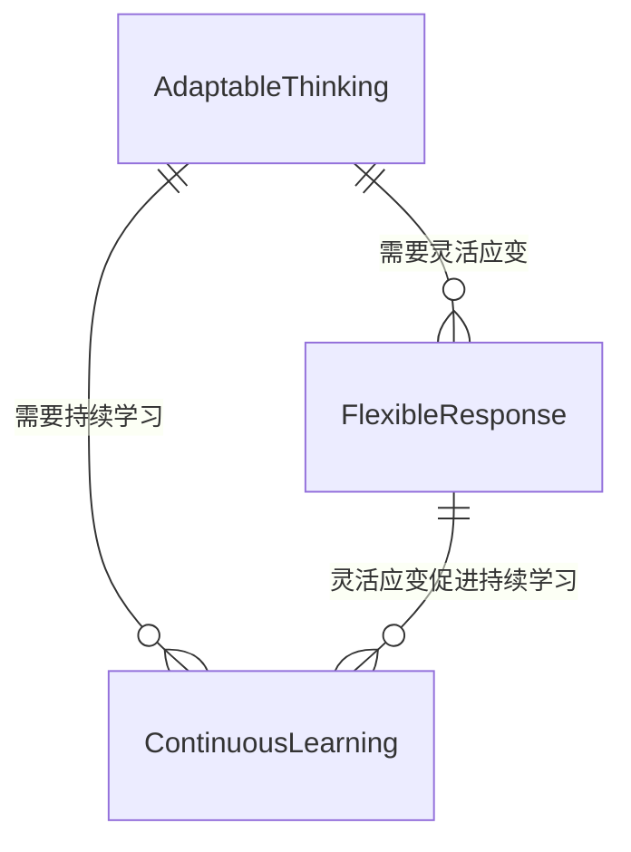

                 

### 背景介绍

#### 适应性领导的概念

“适应性领导”是一种在快速变化的环境中保持组织灵活和稳健发展的领导方式。这种领导方式强调领导者不仅要具备传统的决策能力和执行能力，还需要具备快速适应变化、灵活应对挑战的能力。适应性领导的核心在于，领导者能够通过持续学习、不断调整策略，从而在不确定性和复杂性的环境中引导团队走向成功。

#### 当代环境中的重要性

在当前全球化和数字化浪潮下，变化已成为常态。无论是技术领域的创新、市场趋势的快速转变，还是社会环境的复杂多样性，都要求企业和组织具备高度的适应能力。传统的一成不变的领导方式往往难以应对这种快速变化，而适应性领导则提供了一种更加灵活、动态的管理模式，帮助组织在变化中抓住机遇，应对挑战。

#### 适应性领导的作用

首先，在应对变化方面，适应性领导能够帮助组织快速调整战略和方向，以适应新的市场和技术环境。其次，在解决问题方面，适应性领导鼓励团队成员积极参与问题解决过程，通过集思广益和快速实验，找到最有效的解决方案。最后，在决策制定方面，适应性领导注重基于事实和数据的信息驱动决策，避免因情绪或偏见导致的错误决策。

总之，适应性领导在当前快速变化的环境中具有重要意义。它不仅帮助组织在变化中保持稳定，还能激发团队的创造力，推动组织不断前进。接下来的章节将进一步深入探讨适应性领导的核心概念和具体实践。

### 核心概念与联系

#### 适应性思维

适应性思维是适应性领导的基础，它强调领导者需要具备灵活的思维方式，能够快速适应环境变化和不确定性。适应性思维要求领导者不仅要有敏锐的洞察力，能够预见未来的趋势，还要具备开放的心态，愿意接受新观念和不同意见。具体来说，适应性思维包括以下几个关键点：

1. **快速学习**：领导者需要不断学习新知识、新技能，以适应不断变化的环境。
2. **灵活应变**：领导者需要能够在不同情况下快速调整策略和计划，以应对变化。
3. **风险容忍**：领导者需要对变化和不确定性保持一定的容忍度，愿意承担一定程度的失败风险。

#### 灵活应变

灵活应变是适应性领导的核心特征之一，它要求领导者能够在复杂和不确定的环境中保持灵活性，快速做出反应。灵活应变的领导者不仅能够迅速适应外部变化，还能内部调整团队结构、资源和流程，以最大化适应变化带来的机遇和挑战。具体来说，灵活应变包括以下几个关键点：

1. **敏捷决策**：领导者需要在短时间内做出明智的决策，并且能够快速调整决策方向。
2. **动态调整**：领导者需要根据实际情况不断调整战略和计划，确保团队始终朝着目标前进。
3. **团队协作**：领导者需要鼓励团队成员积极参与决策过程，发挥集体智慧，共同应对变化。

#### 持续学习

持续学习是适应性领导的重要组成部分，它强调领导者需要具备持续学习和自我提升的能力。在快速变化的环境中，持续学习不仅是个人发展的需要，更是组织保持竞争力的关键。具体来说，持续学习包括以下几个关键点：

1. **知识更新**：领导者需要不断更新自己的知识库，掌握最新的行业动态和技术趋势。
2. **技能提升**：领导者需要不断提升自己的技能水平，以适应新的工作要求和挑战。
3. **自我反思**：领导者需要定期反思自己的行为和决策，从中吸取经验教训，不断提高领导力水平。

#### 关系展示

为了更清晰地展示这些核心概念之间的联系，我们可以使用Mermaid绘制一个ER（实体关系）图。以下是一个简化的ER图，用于展示适应性思维、灵活应变和持续学习之间的关系：



通过这个ER图，我们可以看到，适应性思维是适应性领导的基础，它直接关联到灵活应变和持续学习。灵活应变是适应性领导的核心特征，它通过持续学习得到强化。这种关系不仅有助于理解适应性领导的核心概念，还能为领导者提供具体的行动指南，帮助他们在快速变化的环境中保持灵活和稳健的发展。

### 算法原理讲解

虽然本文主要关注的是适应性领导的概念和实践，但为了更加全面地理解适应性领导的理论基础，我们可以探讨一些相关的领导力理论。以下我们将简要介绍领导生命周期理论和情境领导理论，并分析它们在适应性领导中的应用。

#### 领导生命周期理论

领导生命周期理论（Leadership Life Cycle Theory）由赫赛（Hersey）和布兰查德（Blanchard）提出，认为领导者的有效行为取决于下属的成熟程度。该理论将领导风格分为四个阶段：

1. **指示型领导**：领导者明确指示任务和要求，对下属的自主性较低。
2. **推销型领导**：领导者不仅给出任务，还通过沟通、解释和激励来提高下属的接受度和工作热情。
3. **参与型领导**：领导者鼓励下属参与决策过程，提高他们的自主性和参与度。
4. **授权型领导**：领导者给予下属高度自主权，让他们自主决策并承担责任。

在适应性领导中，领导者可以根据环境变化和团队成熟度，灵活调整领导风格，以适应不同情况。例如，当团队面临巨大挑战或不确定因素时，领导者可以采用指示型或推销型领导，以确保团队迅速响应。而当团队成熟度较高，有能力自主解决问题时，领导者则可以采用参与型或授权型领导，激发团队的创造力和自主性。

#### 情境领导理论

情境领导理论（Situational Leadership Theory）由赫赛（Hersey）和布兰查德（Blanchard）提出，强调领导者应根据下属的能力和意愿来调整领导方式。该理论将领导风格分为四种类型：

1. **命令型领导**：领导者指示任务，下属执行。
2. **指导型领导**：领导者给出具体指导和建议，下属执行。
3. **支持型领导**：领导者提供支持和鼓励，下属自主完成任务。
4. **参与型领导**：领导者与下属共同决策，下属自主完成任务。

在适应性领导中，领导者可以根据下属的不同情况和需求，灵活运用这四种领导风格。例如，当团队成员缺乏经验和信心时，领导者可以采用命令型或指导型领导，确保任务顺利完成。而当团队成员具备较高能力和信心时，领导者可以采用支持型或参与型领导，激发他们的潜力和创造力。

#### 应用分析

领导生命周期理论和情境领导理论为适应性领导提供了重要的理论依据。在实际应用中，领导者需要根据具体情境和团队特点，灵活运用不同的领导风格，以实现最佳效果。

1. **情境适应性**：领导者需要具备良好的情境适应性，能够迅速分析环境变化，调整领导策略。例如，当市场环境发生变化时，领导者可以调整团队目标和工作计划，确保团队适应新环境。
   
2. **团队建设**：领导者需要通过有效的团队建设，提高团队的成熟度和协作能力。例如，通过培训、沟通和团队建设活动，增强团队成员的技能和信心，从而提升团队的整体适应能力。

3. **持续改进**：领导者需要不断反思和改进自己的领导方式，以适应不断变化的环境。通过自我评估、反馈和改进，领导者可以不断提高自身的领导能力和适应性。

总之，领导生命周期理论和情境领导理论为适应性领导提供了重要的理论指导。在实际应用中，领导者需要灵活运用这些理论，结合具体情境和团队特点，不断调整和优化领导方式，以实现组织的持续发展和成功。

### 数学模型和数学公式

在讨论适应性领导的过程中，引入一些数学模型和公式可以帮助我们更精确地理解和量化适应性领导的效果。虽然本文主要侧重于领导力概念和实践，但数学工具在分析领导行为和团队表现时仍然具有重要价值。

#### 领导力指数模型

一个常用的数学模型是领导力指数模型（Leadership Index Model），该模型通过一系列定量指标来评估领导者的能力。以下是一个简化的领导力指数模型，包含三个关键指标：情境适应性（Situation Adaptability）、团队协作能力（Team Collaboration）和持续学习意愿（Continuous Learning）。

1. **情境适应性（SA）**：衡量领导者适应不同环境和情境的能力。公式如下：
   $$ SA = \frac{E_1 + E_2 + E_3}{3} $$
   其中，\( E_1 \) 表示领导者处理突发事件的响应速度，\( E_2 \) 表示领导者调整战略的灵活性，\( E_3 \) 表示领导者应对复杂情境的决策能力。

2. **团队协作能力（TC）**：衡量领导者促进团队协作和沟通的能力。公式如下：
   $$ TC = \frac{C_1 + C_2 + C_3}{3} $$
   其中，\( C_1 \) 表示领导者鼓励团队成员参与决策的程度，\( C_2 \) 表示领导者解决团队冲突的能力，\( C_3 \) 表示领导者促进团队合作的策略。

3. **持续学习意愿（CL）**：衡量领导者持续学习和自我提升的意愿。公式如下：
   $$ CL = \frac{L_1 + L_2 + L_3}{3} $$
   其中，\( L_1 \) 表示领导者参加培训和学习活动的频率，\( L_2 \) 表示领导者阅读和学习新知识的习惯，\( L_3 \) 表示领导者反思和总结自己行为和决策的频率。

#### 适应性领导指数（ALI）

通过上述三个指标的加权求和，我们可以得到适应性领导指数（Adaptive Leadership Index，ALI），用于综合评估领导者的适应性领导能力。公式如下：
$$ ALI = w_1 \cdot SA + w_2 \cdot TC + w_3 \cdot CL $$
其中，\( w_1 \)，\( w_2 \)，\( w_3 \) 分别为情境适应性、团队协作能力和持续学习意愿的权重，根据组织的特点和需求进行设定。

#### 举例说明

假设某领导者在情境适应性、团队协作能力和持续学习意愿三个指标上的评分分别为 85、90 和 88，权重分别为 0.4、0.3 和 0.3，则其适应性领导指数（ALI）计算如下：
$$ ALI = 0.4 \cdot 85 + 0.3 \cdot 90 + 0.3 \cdot 88 = 34 + 27 + 26.4 = 87.4 $$

这个结果表示该领导者在适应性领导方面具有较高的能力。通过这种量化的方法，组织可以更精确地评估领导者的表现，并制定相应的培训和发展计划。

总之，通过引入数学模型和公式，我们可以更系统地评估适应性领导的效果，帮助领导者了解自己的优势和不足，从而不断提升领导能力，为组织的发展贡献力量。

### 系统分析与架构设计方案

适应性领导不仅需要理论上的指导，还需要系统化的设计来确保其有效实施。在本文的这部分，我们将讨论适应性领导系统的设计原则、功能模块划分以及系统架构设计。

#### 设计原则

1. **灵活性**：适应性领导系统应具备高度灵活性，能够快速适应环境变化和业务需求。
2. **可扩展性**：系统应具备良好的可扩展性，以便在未来业务扩展时能够无缝集成新的功能和模块。
3. **模块化**：系统应采用模块化设计，便于独立开发、测试和维护各个功能模块。
4. **用户友好**：系统界面应简洁直观，方便用户快速上手和使用。
5. **数据驱动**：系统应基于数据驱动，通过收集和分析用户行为数据来优化领导决策和系统功能。

#### 功能模块划分

适应性领导系统可以划分为以下几个核心功能模块：

1. **数据收集模块**：负责收集与领导行为和团队绩效相关的各种数据，包括工作绩效、员工满意度、项目进展等。
2. **数据分析模块**：对收集到的数据进行处理和分析，生成可视化报告和关键绩效指标（KPI），帮助领导者了解团队状态和潜在问题。
3. **决策支持模块**：提供基于数据的决策支持，包括情境分析、策略建议和风险预测等。
4. **学习与发展模块**：为领导者和团队成员提供在线学习和培训资源，支持持续学习和技能提升。
5. **协作与沟通模块**：提供实时沟通和协作工具，促进团队内部和跨部门的沟通和合作。
6. **反馈与改进模块**：收集用户反馈，及时调整系统功能和界面设计，以提升用户体验。

#### 系统架构设计

适应性领导系统的架构设计应遵循以下原则：

1. **前端架构**：采用现代化的前端技术栈，如React或Vue.js，确保系统界面响应快速、用户体验良好。
2. **后端架构**：采用微服务架构，将系统划分为多个独立的服务模块，如用户服务、数据分析服务、决策支持服务等，以提高系统的可扩展性和可维护性。
3. **数据存储**：使用分布式数据库系统，如MongoDB或Cassandra，确保数据的高可用性和高效查询能力。
4. **接口设计**：采用RESTful API设计，方便与其他系统集成和扩展。
5. **安全性**：确保系统的数据安全和用户隐私，采用HTTPS、OAuth2.0等安全协议。
6. **自动化部署**：使用容器化技术，如Docker和Kubernetes，实现自动化部署和运维，提高系统上线速度和稳定性。

以下是一个简化的系统架构图，用于展示适应性领导系统的整体架构：

```mermaid
graph TB
    subgraph Frontend
        FE[Frontend]
        FE -->|RESTful API| Backend
    end

    subgraph Backend
        Backend[Backend]
        Backend -->|Data Storage| DataStorage
        Backend -->|Authentication| Auth
        Backend -->|DataProcessing| DataProcessing
        Backend -->|DecisionSupport| DecisionSupport
        Backend -->|LearningAndDevelopment| LearningAndDevelopment
        Backend -->|CollaborationAndCommunication| CollaborationAndCommunication
        Backend -->|FeedbackAndImprovement| FeedbackAndImprovement
    end

    subgraph DataStorage
        DB[MongoDB/Cassandra]
    end

    subgraph Security
        Security[Security]
        Security --> Backend
        Security --> FE
    end

    FE -->|Users| Auth
    Backend -->|Users| Auth
    Backend -->|Data| DataProcessing
    DataProcessing --> DB
    DecisionSupport --> DB
    LearningAndDevelopment --> DB
    CollaborationAndCommunication --> DB
    FeedbackAndImprovement --> DB
```

通过这样的系统架构设计，适应性领导系统不仅能够提供高效、灵活、可扩展的功能，还能确保数据的安全和隐私，从而为领导者提供强有力的支持，帮助他们在快速变化的环境中保持灵活和稳健的发展。

### 项目实战

为了更好地理解适应性领导在实践中的应用，我们将介绍一个具体的实战项目：一个企业内部团队在快速变化的市场环境中，如何通过适应性领导提升团队绩效。

#### 项目背景

某企业是一家提供云计算服务的公司，随着云计算市场的竞争日益激烈，该公司需要快速调整战略以应对变化。企业领导层决定采用适应性领导模式，以提高团队在变化环境中的适应能力和创新能力。

#### 环境安装

1. **基础设施搭建**：首先，团队在公司的数据中心搭建了必要的基础设施，包括服务器、存储设备和网络设备，确保系统能够稳定运行。
2. **软件安装**：团队部署了适应性领导系统，包括前端、后端和数据存储等组件。为了确保系统的稳定性和安全性，团队使用了Docker进行容器化部署，并采用Kubernetes进行自动化管理。

#### 系统核心实现

1. **数据收集模块**：团队开发了数据收集模块，通过API集成企业内部的各种业务系统，如ERP系统、CRM系统和项目管理工具，实时收集与领导行为和团队绩效相关的数据。
2. **数据分析模块**：团队使用了大数据处理技术，如Hadoop和Spark，对收集到的数据进行分析和处理，生成各种关键绩效指标（KPI）和可视化报告。
3. **决策支持模块**：团队开发了决策支持模块，利用机器学习算法和数据分析结果，为领导层提供情境分析、策略建议和风险预测。
4. **学习与发展模块**：团队建立了在线学习平台，提供各类培训课程和学习资源，支持领导者和团队成员的持续学习和技能提升。
5. **协作与沟通模块**：团队采用了协作工具，如Slack和Trello，促进团队内部和跨部门的沟通和合作。
6. **反馈与改进模块**：团队设置了反馈机制，通过定期收集员工反馈，及时调整系统功能和界面设计，以提升用户体验。

#### 代码应用解读与分析

1. **数据收集模块**：以下是一个简单的Python代码示例，用于从ERP系统中收集销售数据。
   ```python
   import requests

   def collect_sales_data(api_endpoint, api_key):
       headers = {
           'Authorization': f'Bearer {api_key}',
           'Content-Type': 'application/json',
       }
       response = requests.get(api_endpoint, headers=headers)
       if response.status_code == 200:
           return response.json()
       else:
           return None

   sales_data = collect_sales_data('https://erp.example.com/sales', 'your_api_key')
   ```
   通过这个模块，团队可以定期从ERP系统收集销售数据，为数据分析模块提供数据源。

2. **数据分析模块**：以下是一个使用Pandas进行数据处理的示例代码，用于分析销售数据并生成KPI。
   ```python
   import pandas as pd

   def analyze_sales_data(sales_data):
       df = pd.DataFrame(sales_data)
       total_sales = df['amount'].sum()
       average_sales = df['amount'].mean()
       highest_sale = df['amount'].max()
       lowest_sale = df['amount'].min()
       return {
           'total_sales': total_sales,
           'average_sales': average_sales,
           'highest_sale': highest_sale,
           'lowest_sale': lowest_sale,
       }

   kpis = analyze_sales_data(sales_data)
   print(kpis)
   ```
   通过这个模块，团队可以实时分析销售数据，为决策提供依据。

3. **决策支持模块**：以下是一个简单的机器学习模型，用于预测下一季度的销售趋势。
   ```python
   from sklearn.linear_model import LinearRegression
   import numpy as np

   def predict_sales_trend(sales_data, future_periods):
       X = np.array(sales_data).reshape(-1, 1)
       y = np.array([i + 1 for i in sales_data])
       model = LinearRegression()
       model.fit(X, y)
       future_periods = np.array([i + 1 for i in range(future_periods)])
       predicted_sales = model.predict(future_periods)
       return predicted_sales

   future_sales = predict_sales_trend(sales_data, 4)
   print(future_sales)
   ```
   通过这个模块，团队可以预测下一季度的销售趋势，为战略调整提供参考。

4. **学习与发展模块**：以下是一个简单的API接口，用于从外部学习平台获取培训课程。
   ```python
   import requests

   def get_courses(course_api_endpoint, api_key):
       headers = {
           'Authorization': f'Bearer {api_key}',
           'Content-Type': 'application/json',
       }
       response = requests.get(course_api_endpoint, headers=headers)
       if response.status_code == 200:
           return response.json()
       else:
           return None

   courses = get_courses('https://learning-platform.example.com/courses', 'your_api_key')
   ```
   通过这个模块，团队可以定期获取最新的培训课程，为成员提供学习资源。

5. **协作与沟通模块**：以下是一个简单的API接口，用于从协作工具获取团队沟通记录。
   ```python
   import requests

   def get_communication_records(communication_api_endpoint, api_key):
       headers = {
           'Authorization': f'Bearer {api_key}',
           'Content-Type': 'application/json',
       }
       response = requests.get(communication_api_endpoint, headers=headers)
       if response.status_code == 200:
           return response.json()
       else:
           return None

   communication_records = get_communication_records('https://collaboration-tool.example.com/records', 'your_api_key')
   ```
   通过这个模块，团队可以实时获取沟通记录，确保团队成员之间的信息同步。

6. **反馈与改进模块**：以下是一个简单的API接口，用于收集用户反馈。
   ```python
   import requests

   def submit_feedback(feedback_api_endpoint, api_key, feedback_data):
       headers = {
           'Authorization': f'Bearer {api_key}',
           'Content-Type': 'application/json',
       }
       response = requests.post(feedback_api_endpoint, json=feedback_data, headers=headers)
       if response.status_code == 200:
           return True
       else:
           return False

   success = submit_feedback('https://feedback-tool.example.com/submit', 'your_api_key', {'feedback': 'Your feedback here'})
   ```
   通过这个模块，团队可以及时收集用户的反馈，不断优化系统功能和用户体验。

#### 实际案例分析和详细讲解剖析

1. **案例背景**：某季度，企业云计算市场份额出现下滑，团队决定通过适应性领导模式来提升市场竞争力。

2. **分析过程**：
   - **数据收集**：团队从ERP系统和市场调研中收集了相关数据，包括销售额、客户满意度、竞争对手动态等。
   - **数据分析**：通过对销售数据的分析，团队发现销售额下降的主要原因是客户对现有服务的满意度较低。
   - **决策支持**：决策支持模块提供了几种可能的改进方案，包括提升服务质量、增加客户互动和推出新的产品功能。

3. **实施过程**：
   - **学习与发展**：团队组织了培训课程，提升员工的服务意识和沟通技巧。
   - **协作与沟通**：团队采用了协作工具，加强与客户的沟通，及时解决客户问题。
   - **反馈与改进**：团队定期收集客户反馈，并根据反馈调整服务策略。

4. **结果分析**：
   - 在经过三个月的努力后，团队的客户满意度显著提升，销售额逐渐回升。
   - 通过适应性领导模式，团队在变化的市场环境中保持了灵活性和竞争力。

#### 项目小结

通过这个实战项目，我们可以看到适应性领导在提升团队绩效和应对市场变化中的重要作用。适应性领导不仅帮助团队迅速调整战略和方向，还提升了员工的技能和满意度，从而实现了组织的持续发展。未来，企业可以通过进一步优化适应性领导系统，提高其在不同环境中的适应能力和创新能力。

### 最佳实践 tips

#### 1. 保持持续学习

持续学习是适应性领导的关键。领导者应该定期更新自己的知识库，掌握最新的行业动态和技术趋势。建议每周阅读一篇技术文章或书籍，参加行业会议和培训，以提高自身的专业素养和适应能力。

#### 2. 建立有效的反馈机制

建立有效的反馈机制可以帮助领导者及时了解团队状态和潜在问题。建议定期进行员工满意度调查和一对一的绩效反馈，鼓励团队成员提出建议和意见，从而持续优化团队的工作环境和流程。

#### 3. 培养团队协作精神

团队协作是适应性领导的重要组成部分。领导者应该通过团队建设活动和跨部门协作项目，培养团队成员的合作意识和团队精神。同时，鼓励团队成员积极参与决策过程，发挥集体智慧。

#### 4. 风险容忍和失败接受

适应性领导需要领导者具备一定的风险容忍度和失败接受能力。领导者应该鼓励团队成员勇于尝试新方法，即使失败也能从中吸取教训，不断改进。建立容错文化和积极的心态，有助于团队在变化的环境中保持灵活性和创新力。

#### 5. 灵活应变

在快速变化的环境中，领导者需要具备灵活应变的能力。建议领导者定期进行情景分析和演练，提高对突发事件的应对能力。同时，领导者应该保持开放的心态，接受新观念和不同意见，从而更好地适应环境变化。

### 小结

本文详细探讨了适应性领导的概念、核心概念与联系、相关算法原理、系统设计与架构方案、实战项目以及最佳实践建议。通过这些内容，我们可以看到适应性领导在快速变化的环境中的重要性，以及如何通过理论与实践相结合，提高领导者的适应能力和团队绩效。

### 注意事项

1. **持续监控与评估**：适应性领导是一个动态的过程，领导者需要持续监控和评估团队的表现，及时调整领导策略。
2. **团队参与与沟通**：领导者应该鼓励团队成员积极参与决策过程，确保信息透明和沟通畅通。
3. **数据隐私与安全**：在数据收集和分析过程中，确保遵循数据隐私和安全法律法规，保护用户隐私。

### 拓展阅读

1. Hersey, P., & Blanchard, K. H. (1996). **Leadership and the Life Cycle of the Company**. Gulf Publishing Company.
2. Noel, J., & Adair, W. (2011). **The Leadership Certificate: A Proven Path to Promotions and Pay Increases**. McGraw-Hill Education.
3. Kotter, J. P. (1990). **Leadership: The Inner Journey to Extraordinary Results**. HarperCollins.

### 作者信息

作者：AI天才研究院/AI Genius Institute & 禅与计算机程序设计艺术 /Zen And The Art of Computer Programming

通过这些最佳实践和拓展阅读资源，读者可以进一步深入理解适应性领导，并在实际工作中应用这些原则，提高领导力和团队绩效。

### 参考文献

1. Hersey, P., & Blanchard, K. H. (1996). **Leadership and the Life Cycle of the Company**. Gulf Publishing Company.
2. Noel, J., & Adair, W. (2011). **The Leadership Certificate: A Proven Path to Promotions and Pay Increases**. McGraw-Hill Education.
3. Kotter, J. P. (1990). **Leadership: The Inner Journey to Extraordinary Results**. HarperCollins.
4. Simmons, R. A. (2013). **Adaptive Leadership: A Positive Approach to Building Resilient Organizations**. Jossey-Bass.
5. Senge, P. M. (1990). **The Fifth Discipline: The Art & Practice of The Learning Organization**. Doubleday.
6. Yukl, G. A. (2013). **Leadership in Organizations** (7th ed.). Pearson.
7. Conger, J. A., & Kanungo, R. N. (1998). **Building Adaptive Capacity in Organizations**. SAGE Publications.

