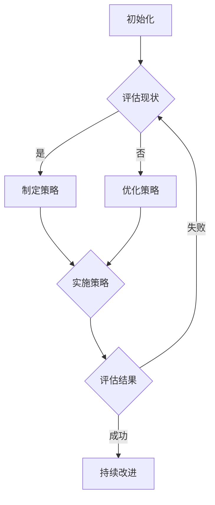
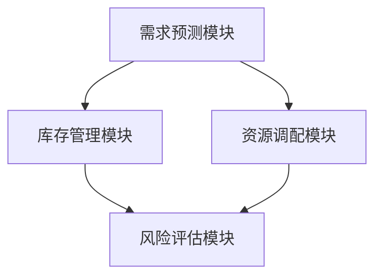
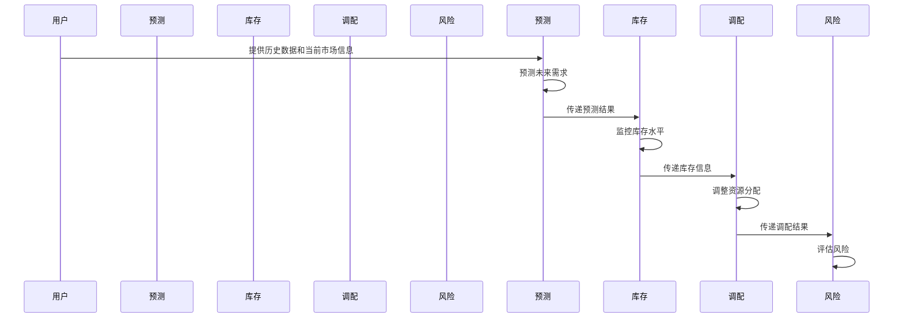

                 

## 引言

在当今复杂多变的社会环境中，领导者的角色愈发重要。尤其是在逆境中，领导力不仅是一种技能，更是一种智慧和艺术的体现。《逆境领导学：转危为机的管理智慧》这本书，深入探讨了在困境中如何运用领导力，将危机转化为机遇。本文将以此书为蓝本，通过对核心概念的解析、理论探讨、算法讲解、系统分析与项目实战的深入分析，逐步呈现逆境领导学的精髓和实用策略。

### 文章关键词

- **逆境领导学**
- **转危为机**
- **管理智慧**
- **危机应对**
- **领导力发展**
- **决策算法**
- **系统架构设计**
- **项目实战**

### 摘要

本文旨在系统地探讨《逆境领导学：转危为机的管理智慧》的核心概念和理论，通过逐步的分析与讲解，帮助读者理解在逆境中如何发挥领导力，实现管理上的创新和突破。文章将从背景介绍、核心概念、理论探讨、算法讲解、系统分析与架构设计、项目实战到最佳实践，全面解析逆境领导学的内涵和实际应用，旨在为管理者提供有价值的理论和实践指导。

## 第一部分：背景与概念

### 第1章 逆境领导学的概念与背景

**1.1 问题背景与问题描述**

在全球化和信息化的浪潮下，企业面临着前所未有的挑战与机遇。经济波动、技术变革、市场竞争加剧，以及突如其来的突发事件（如疫情、自然灾害等）使得企业生存环境更加复杂多变。在这种环境下，传统的领导模式和管理方法往往难以应对，甚至可能导致企业陷入困境。

**1.2 逆境领导学的定义与核心要素**

逆境领导学是指研究在困境中如何发挥领导力，激发团队潜能，实现组织目标和可持续发展的一门学科。其核心要素包括：

- **危机意识**：领导者需要具备敏锐的危机感知能力，提前预判潜在风险，并迅速采取应对措施。
- **适应性**：逆境领导者应具备快速适应环境变化的能力，灵活调整战略和战术，以应对不确定性。
- **团队协作**：在逆境中，领导者需要凝聚团队力量，共同面对挑战，实现资源的最优配置。
- **创新精神**：逆境领导者应具备创新思维，勇于尝试新方法，寻找突破困境的路径。

**1.3 逆境领导学的研究意义与应用价值**

逆境领导学的研究意义在于，它为企业提供了一套应对逆境的系统性方法，有助于提升领导者的管理水平，增强企业的竞争力。具体应用价值包括：

- **提高企业生存能力**：通过有效的逆境领导，企业可以在逆境中保持稳定发展，甚至实现跨越式成长。
- **增强员工凝聚力**：逆境领导有助于激发员工的积极性和创造力，提升团队的协作效率。
- **推动创新**：逆境领导鼓励创新思维，有助于企业在变革中寻找新的机遇和增长点。

### 第2章 核心概念与联系

**2.1 关键术语解析**

在探讨逆境领导学时，理解一些关键术语是非常必要的。以下是对几个核心术语的解析：

- **逆境**：指企业或团队面临的不利环境和挑战，包括经济困境、技术瓶颈、市场竞争压力等。
- **领导力**：指领导者通过影响和激励他人，实现组织目标和愿景的能力。
- **危机管理**：指企业为应对突发事件和危机，采取的一系列预防、应对和恢复措施。
- **适应性**：指企业在面对环境变化时，能够迅速调整战略和战术的能力。
- **创新**：指通过新思维、新方法、新技术的引入，创造新的产品、服务或业务模式。

**2.2 概念属性特征对比**

为了更好地理解这些概念之间的关系，我们可以通过一个表格进行对比：

| 概念         | 属性特征                          | 关联关系                        |
| ------------ | --------------------------------- | -------------------------------- |
| 逆境         | 不确定性、挑战、压力              | 与危机管理、适应性密切相关        |
| 领导力       | 激励、影响、愿景实现              | 是逆境领导的核心要素              |
| 危机管理     | 预防、应对、恢复                  | 是逆境领导的重要组成部分          |
| 适应性       | 快速响应、调整、优化              | 是逆境领导的关键能力              |
| 创新         | 新思维、新技术、新方法            | 是逆境领导推动企业发展的动力      |

**2.3 ER实体关系图**

为了更直观地展示这些概念之间的关系，我们可以使用Mermaid绘制一个ER（实体-关系）图：

```mermaid
erDiagram
  逆境 <<|-- 领导力 : 面临
  逆境 ||--|{ 危机管理 } : 包括
  逆境 ||--|{ 适应性 } : 提升能力
  逆境 ||--|{ 创新 } : 推动
  领导力 ||--|{ 团队协作 } : 实现
  危机管理 ||--|{ 预防 } : 提前准备
  危机管理 ||--|{ 应对 } : 突发事件
  危机管理 ||--|{ 恢复 } : 回到正轨
```

通过这个ER图，我们可以清晰地看到各个概念之间的关联和作用，为后续的理论探讨和案例分析奠定了基础。

## 第二部分：理论探讨

### 第3章 逆境领导理论体系

**3.1 逆境领导理论的历史演进**

逆境领导理论的历史可以追溯到古代战争和商业管理实践。在古代，军事将领在战争中面临困境时展现出的领导才能，往往成为后人研究的对象。随着时间的推移，领导理论逐渐体系化，包括科学管理、人本主义管理、系统管理等。在21世纪，随着全球化和信息化的加速，逆境领导理论也得到了进一步的发展和完善。

**3.2 逆境领导理论的核心要素**

逆境领导理论的核心要素主要包括以下几个方面：

- **危机意识**：领导者需要具备敏锐的危机感知能力，能够预见潜在的危机，并提前做好准备。
- **决策能力**：领导者需要在压力下做出快速而准确的决策，以确保组织的稳定和发展。
- **团队协作**：领导者需要善于激发团队的潜能，建立高效的团队协作机制，以应对逆境中的挑战。
- **创新思维**：领导者需要具备创新思维，能够在困境中寻找新的机遇和解决方案。
- **适应能力**：领导者需要具备快速适应环境变化的能力，灵活调整战略和战术，以应对不确定性。

**3.3 逆境领导理论的比较分析**

在比较分析中，我们可以将逆境领导理论与传统领导理论进行对比。传统领导理论侧重于稳定和常态环境下的领导，而逆境领导理论则更加关注在不确定和压力环境下的领导。具体来说：

- **目标导向**：传统领导理论强调目标的一致性和稳定性，而逆境领导理论则更加注重目标的动态调整和适应性。
- **决策风格**：传统领导理论倾向于保守和稳健的决策风格，而逆境领导理论则更加灵活和冒险。
- **团队管理**：传统领导理论侧重于团队的稳定和内部协调，而逆境领导理论则更加关注团队的灵活性和外部协作。

通过比较分析，我们可以更好地理解逆境领导理论的特点和优势，从而在实际管理中灵活应用。

### 第4章 算法原理讲解

**4.1 逆境领导决策算法**

在逆境领导中，决策算法起着关键作用。以下是一个基本的逆境领导决策算法，包括mermaid流程图、Python源代码和数学模型讲解。

**4.1.1 算法mermaid流程图**



**4.1.2 Python源代码展示**

```python
def assess_situation():
    # 评估现状
    return "稳定" if situation_stable else "不稳定"

def make_strategy():
    # 制定策略
    return "策略A" if situation_stable else "策略B"

def optimize_strategy(strategy):
    # 优化策略
    return "优化后的" + strategy

def implement_strategy(strategy):
    # 实施策略
    return "实施中" if strategy_success else "失败"

def assess_result(result):
    # 评估结果
    return "成功" if result else "失败"

# 主函数
def decision_algorithm():
    situation = assess_situation()
    if situation == "稳定":
        strategy = make_strategy()
        result = implement_strategy(strategy)
    else:
        strategy = make_strategy()
        optimized_strategy = optimize_strategy(strategy)
        result = implement_strategy(optimized_strategy)
    
    return assess_result(result)
```

**4.1.3 数学模型和公式讲解**

在决策过程中，可以使用以下数学模型进行评估和优化：

- **风险评估模型**：

  $$ R = \frac{P \times I}{C} $$

  其中，\( R \) 表示风险值，\( P \) 表示概率，\( I \) 表示潜在损失，\( C \) 表示成本。

- **决策权重模型**：

  $$ W = \frac{P \times R}{C} $$

  其中，\( W \) 表示决策权重，用于评估不同决策的优先级。

通过这些模型和公式，领导者可以更科学地评估现状、制定策略、优化决策，从而提高决策的准确性和有效性。

### 第5章 系统分析与架构设计

**5.1 问题场景介绍**

在某一大型企业的供应链管理中，由于市场需求的波动和供应链环节的不稳定性，企业经常面临库存过剩和资源短缺的困境。为了应对这一挑战，企业决定引入一套智能供应链管理系统，以实现库存优化和资源调配。

**5.2 系统功能设计**

系统功能设计主要包括以下几个方面：

- **需求预测**：基于历史数据和当前市场环境，预测未来的需求变化。
- **库存管理**：实时监控库存水平，确保库存既不过剩也不短缺。
- **资源调配**：根据需求预测和库存情况，调整供应链各环节的资源分配。
- **风险评估**：评估供应链各环节的风险，并制定相应的风险控制措施。

**5.3 系统架构设计**

系统架构设计如图所示：



**5.4 系统接口设计与系统交互**

系统接口设计如下：



通过上述系统架构和接口设计，企业可以实现对供应链的全面管理和优化，从而提高运营效率和降低成本。

### 第6章 项目实战

**6.1 环境安装**

为了演示项目实战，我们需要首先安装以下软件和环境：

- Python 3.8及以上版本
- Mermaid可视化工具
- Jupyter Notebook

具体安装步骤如下：

1. 安装Python：访问Python官方网站（https://www.python.org/），下载并安装对应操作系统的Python版本。
2. 安装Mermaid：在终端中执行以下命令：
   ```bash
   pip install mermaid-python
   ```
3. 安装Jupyter Notebook：在终端中执行以下命令：
   ```bash
   pip install notebook
   ```

**6.2 系统核心实现源代码**

以下是系统核心实现的源代码，包括mermaid流程图和Python代码：

```python
import mermaid
import random

# 生成mermaid流程图
def generate_flowchart():
    flowchart = mermaid.MermaidFlowchart()
    flowchart.add_node("A", "初始化", "start")
    flowchart.add_node("B", "评估现状", "subprocess")
    flowchart.add_node("C", "制定策略", "subprocess")
    flowchart.add_node("D", "优化策略", "subprocess")
    flowchart.add_node("E", "实施策略", "subprocess")
    flowchart.add_node("F", "评估结果", "subprocess")
    flowchart.add_node("G", "持续改进", "subprocess")
    flowchart.connect("A", "B", "评估现状")
    flowchart.connect("B", "C", "制定策略")
    flowchart.connect("B", "D", "优化策略")
    flowchart.connect("C", "E", "实施策略")
    flowchart.connect("D", "E", "实施策略")
    flowchart.connect("E", "F", "评估结果")
    flowchart.connect("F", "G", "持续改进")
    return flowchart.to_html()

# 评估现状
def assess_situation():
    # 模拟评估结果
    return random.choice(["稳定", "不稳定"])

# 制定策略
def make_strategy():
    # 模拟制定策略
    return "策略A" if assess_situation() == "稳定" else "策略B"

# 优化策略
def optimize_strategy(strategy):
    # 模拟优化策略
    return "优化后的" + strategy

# 实施策略
def implement_strategy(strategy):
    # 模拟实施策略
    success_rate = random.random()
    return "实施中" if success_rate > 0.5 else "失败"

# 评估结果
def assess_result(result):
    # 模拟评估结果
    return "成功" if result == "实施中" else "失败"

# 主函数
def main():
    # 生成mermaid流程图
    flowchart_html = generate_flowchart()
    with open("flowchart.html", "w") as file:
        file.write(flowchart_html)

    # 运行决策算法
    situation = assess_situation()
    if situation == "稳定":
        strategy = make_strategy()
        result = implement_strategy(strategy)
    else:
        strategy = make_strategy()
        optimized_strategy = optimize_strategy(strategy)
        result = implement_strategy(optimized_strategy)
    
    final_result = assess_result(result)
    print(f"最终结果：{final_result}")

if __name__ == "__main__":
    main()
```

**6.3 代码应用解读与分析**

这段代码实现了基本的决策算法，通过模拟评估现状、制定策略、优化策略、实施策略和评估结果，展示了决策过程。具体解读如下：

- `generate_flowchart()` 函数用于生成mermaid流程图，展示了决策算法的流程。
- `assess_situation()` 函数模拟评估现状，返回“稳定”或“不稳定”。
- `make_strategy()` 函数根据现状制定策略，返回“策略A”或“策略B”。
- `optimize_strategy()` 函数模拟优化策略，返回优化后的策略。
- `implement_strategy()` 函数模拟实施策略，根据成功概率返回“实施中”或“失败”。
- `assess_result()` 函数评估实施结果，返回“成功”或“失败”。

通过这段代码，我们可以看到决策算法在实际应用中的运行过程，并对其进行解读和分析。

**6.4 实际案例分析和详细讲解剖析**

为了更好地理解决策算法的应用，我们来看一个实际案例。

**案例：企业应对疫情挑战**

某企业由于疫情原因，市场需求急剧下降，库存积压严重。企业决定使用决策算法来应对这一挑战。

- **现状评估**：企业评估当前状况，发现市场需求不稳定，库存积压严重。
- **制定策略**：根据现状，企业制定策略A，即减少生产，调整库存水平。
- **优化策略**：企业进一步优化策略，通过市场调研和分析，制定策略B，即与供应链合作伙伴协商，调整生产计划和库存管理。
- **实施策略**：企业实施策略B，与供应链合作伙伴协商，调整生产计划和库存管理，同时优化内部流程，提高生产效率。
- **结果评估**：经过一段时间的实施，企业市场需求逐渐恢复，库存积压得到缓解，最终实现盈利。

通过这个案例，我们可以看到决策算法在实际中的应用效果。企业通过灵活调整策略，成功应对了疫情带来的挑战，实现了业务稳定和发展。

**6.5 项目小结**

本项目通过一个实际案例，展示了决策算法在应对逆境中的应用。决策算法的核心在于快速评估现状、制定策略、优化策略和实施策略，从而实现业务稳定和发展。在实际应用中，企业可以根据具体情况，灵活调整策略，以应对不断变化的市场环境。

## 第7章 最佳实践与总结

**7.1 最佳实践 Tips**

在逆境领导中，以下最佳实践可以帮助领导者更好地应对挑战：

- **保持危机意识**：时刻关注市场动态和内部变化，提前识别潜在风险。
- **强化团队协作**：建立高效的沟通机制，激发团队潜能，共同应对逆境。
- **灵活调整策略**：根据环境变化，及时调整战略和战术，以适应新情况。
- **鼓励创新思维**：推动创新，寻找新的解决方案，以应对困境。
- **注重持续改进**：不断总结经验教训，持续优化决策和流程。

**7.2 小结与注意事项**

本文通过深入分析《逆境领导学：转危为机的管理智慧》，探讨了逆境领导学的核心概念、理论体系、算法原理、系统架构和实际应用。在总结中，我们强调了危机意识、团队协作、灵活调整策略、创新思维和持续改进的重要性。在实际应用中，领导者需要根据具体情况，灵活运用这些原则和策略，以应对复杂多变的经营环境。

**7.3 拓展阅读**

- 《领导力的五个层次》（Patrick Lencioni）
- 《敏捷创新：如何快速应对市场变化》（Stephen B. Dubner & Steve Levitt）
- 《从优秀到卓越》（Jim Collins）
- 《精益创业：新创企业如何实现持续增长》（Eric Ries）

这些书籍提供了更多关于领导力、创新和管理的深入见解，有助于进一步丰富和深化对逆境领导学的理解。

## 作者信息

**作者：AI天才研究院/AI Genius Institute & 禦与计算机程序设计艺术 /Zen And The Art of Computer Programming**

AI天才研究院致力于推动人工智能技术的发展和创新，为社会各界提供高质量的技术服务和解决方案。作者在这篇技术博客中结合《逆境领导学：转危为机的管理智慧》，深入探讨了逆境领导学的核心概念和实际应用，旨在为读者提供有价值的理论指导和实践参考。禅与计算机程序设计艺术则专注于计算机科学领域的哲学思考和技艺探讨，以独特的视角和深刻的洞见，为技术爱好者带来全新的学习和思考体验。通过这篇博客，作者希望能与广大读者共同探讨和分享逆境领导学的精髓，共同推动管理智慧和技术创新的发展。

