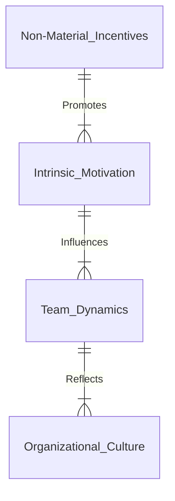
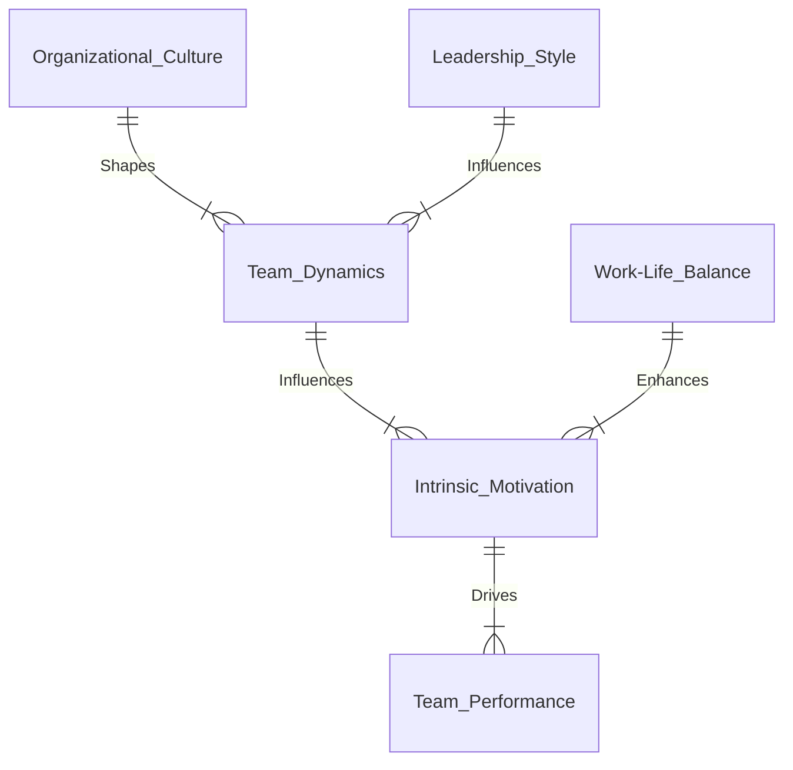

                 

### LET'S THINK STEP BY STEP

To craft a comprehensive and insightful technical blog post on "非物质团队激励：激发团队的内在动力," we need to follow a systematic approach. Let's break down the task into several logical steps:

#### Step 1: Define the Objective
The primary objective is to create a blog post that:
- Clearly articulates the concept of non-material team incentives.
- Provides a deep understanding of intrinsic motivation in teams.
- Offers practical strategies for implementing non-material incentives.
- Analyzes real-world case studies and their outcomes.
- Discusses challenges and future trends in this field.

#### Step 2: Structure the Blog Post
A well-structured blog post will guide the reader through the following key sections:

**Introduction**
- Engaging opening that introduces the topic.
- Brief overview of non-material incentives.
- The importance and relevance of the subject.

**Background and Core Concepts**
- Definition and explanation of key terms.
- Brief historical context.
- Theoretical frameworks and models related to non-material incentives.

**Team Dynamics and Intrinsic Motivation**
- Understanding team structures and relationships.
- Exploring intrinsic motivation theories.
- Analyzing the impact of external and internal factors on team motivation.

**Strategies and Practices**
- Detailed discussion on various non-material incentive strategies.
- Examples of recognition and appreciation practices.
- Development opportunities and work-life balance initiatives.

**Case Studies and Analysis**
- In-depth analysis of real-world case studies.
- Lessons learned and key takeaways.

**Overcoming Challenges**
- Identification of common challenges.
- Strategies for addressing these challenges.

**Future Trends and Directions**
- Examination of future developments in the field.
- Implications for organizational strategy and team management.

**Conclusion**
- Recap of the main points discussed.
- The significance of non-material incentives in the current and future organizational context.

**Step 3: Write the Content
For each section, follow these guidelines:

- **Background and Core Concepts:**
  - Explain the terms and concepts in simple language.
  - Use comparison tables to highlight differences between non-material and material incentives.
  - Visualize the core concepts with Mermaid ER diagrams and flowcharts.

- **Team Dynamics and Intrinsic Motivation:**
  - Provide a clear explanation of team dynamics and intrinsic motivation.
  - Use Mermaid diagrams to illustrate team structures and motivational factors.
  - Incorporate relevant theories and research findings.

- **Strategies and Practices:**
  - Discuss various strategies in detail.
  - Include practical examples and case studies.
  - Highlight the benefits and potential pitfalls of each strategy.

- **Case Studies and Analysis:**
  - Describe real-world scenarios and their outcomes.
  - Analyze the effectiveness of the implemented strategies.
  - Extract key lessons and insights.

- **Overcoming Challenges:**
  - Identify common challenges faced in implementing non-material incentives.
  - Provide actionable solutions and best practices.

- **Future Trends and Directions:**
  - Explore emerging trends and their potential impact.
  - Discuss the role of non-material incentives in future organizational contexts.

**Step 4: Revise and Edit
After completing the first draft, revise and edit the content for:

- **Clarity and Coherence:**
  - Ensure that each section flows logically into the next.
  - Remove any ambiguities or inconsistencies.

- **Grammar and Style:**
  - Check for grammatical errors and typos.
  - Maintain a consistent writing style and tone.

- **Formatting and Layout:**
  - Use markdown formatting to enhance readability.
  - Organize the content into clear and concise sections.

**Step 5: Add Author Information and References
Finally, add the following information at the end of the blog post:

- **Author Information:**
  - Name of the author.
  - Affiliation or organization.
  
- **References:**
  - List of sources used for research and references.

By following these steps, you can create a well-researched, informative, and engaging technical blog post on "非物质团队激励：激发团队的内在动力."

### Introduction to Non-Material Team Incentives

#### Definition and Background

Non-material team incentives refer to motivational strategies that focus on factors other than monetary rewards to inspire and engage team members. These incentives are rooted in the belief that people are driven not only by financial compensation but also by a desire for personal growth, recognition, and a sense of purpose. Unlike material incentives, which include bonuses, stock options, or other tangible rewards, non-material incentives seek to foster intrinsic motivation and long-term commitment within teams.

In recent years, the importance of non-material incentives has gained recognition in various fields, from business management to educational psychology. The shift towards a more holistic approach to motivation stems from the understanding that traditional reward systems may lead to short-term gains but fail to cultivate sustainable engagement and productivity.

#### The Importance of Non-Material Incentives

1. **Intrinsic Motivation**: Non-material incentives are designed to tap into intrinsic motivations, which are internal drives that individuals have for personal satisfaction and growth. When team members are motivated intrinsically, they are more likely to be engaged, creative, and productive.

2. **Long-Term Commitment**: Unlike material incentives that might be temporary fixes, non-material incentives can lead to long-term commitment and loyalty. When team members feel valued and supported, they are more likely to remain with the organization and invest in its success.

3. **Employee Well-being**: Non-material incentives often include measures that promote work-life balance and overall well-being. This can result in happier, healthier, and more productive employees.

4. **Team Cohesion**: Non-material incentives can enhance team cohesion by fostering a sense of community and shared purpose. When team members feel connected and valued, they are more likely to collaborate effectively.

5. **Attracting and Retaining Talent**: Organizations that emphasize non-material incentives are often more attractive to top talent. In a competitive job market, offering a comprehensive benefits package that includes non-material incentives can be a significant differentiator.

#### Comparison with Material Incentives

While material incentives have their place in motivating teams, they have several limitations when used as the sole motivator:

1. **Temporary Boost**: Material incentives often provide a short-term boost in motivation but do not address underlying issues that may affect long-term engagement.

2. **Extrinsic Focus**: Material incentives are extrinsic motivators, meaning they are based on external rewards rather than internal desires. This can lead to a reliance on external validation, which may diminish intrinsic motivation over time.

3. **Potential for Misalignment**: Material incentives may not align with organizational goals or individual career aspirations. This misalignment can result in a lack of commitment and reduced job satisfaction.

4. **Cost**: While material incentives can be expensive to implement, non-material incentives often require minimal financial investment but can yield significant returns in terms of employee engagement and productivity.

In conclusion, non-material team incentives play a crucial role in creating a motivated, engaged, and cohesive team. By focusing on intrinsic motivations, long-term commitment, employee well-being, team cohesion, and talent attraction, organizations can build a strong foundation for sustained success. In the following sections, we will delve deeper into the core concepts, strategies, and practices that underpin non-material team incentives.

### Key Concepts and Framework of Non-Material Incentives

In order to fully grasp the concept of non-material team incentives, it's essential to understand the key concepts and theoretical frameworks that underpin this approach. By examining these foundational elements, we can better appreciate the rationale behind non-material incentives and their potential impact on team dynamics and motivation.

#### Definition and Importance

**Non-Material Incentives**: At their core, non-material incentives are rewards or motivations that do not involve tangible goods or monetary compensation. Instead, they focus on fostering intrinsic motivation, personal growth, and a sense of purpose within the workplace. Examples of non-material incentives include public recognition, professional development opportunities, flexible working arrangements, meaningful work assignments, and a positive organizational culture.

**Importance of Non-Material Incentives**: The importance of non-material incentives lies in their ability to tap into intrinsic motivations, which are deeply personal and lasting drivers of behavior. When team members are motivated intrinsically, they are more likely to be engaged, creative, and committed to achieving organizational goals. Moreover, non-material incentives can lead to improved employee well-being, enhanced team cohesion, and a more positive work environment.

#### Main Theoretical Frameworks

**1. Self-Determination Theory (SDT)**

Self-Determination Theory, proposed by Richard Ryan and Edward Deci, is a cornerstone in the field of motivation psychology. SDT posits that human beings have innate needs for competence, autonomy, and relatedness. When these needs are met, individuals experience high levels of intrinsic motivation.

- **Autonomy**: The need to feel in control of one's actions and have a sense of choice.
- **Competence**: The need to feel effective and successful in achieving goals.
- **Relatedness**: The need to feel connected to others and have positive relationships.

**2. Motivational Theory of Goal Setting (MAST)**

The Motivational Theory of Goal Setting, developed by Edwin A. Locke and Gary P. Latham, emphasizes the role of specific, challenging goals in driving performance and motivation. According to this theory, setting clear and challenging goals can enhance motivation and lead to higher levels of achievement.

- **Challenging Goals**: Goals that are not too easy but also not impossible to achieve.
- **Specific Goals**: Goals that are clearly defined and specific rather than vague.

**3. Equity Theory**

Equity Theory, proposed by John Stacy Adams, suggests that individuals are motivated by a need to maintain fairness and balance in their relationships with others. When team members perceive that they are being treated fairly, they are more likely to be motivated and engaged.

- **Perceived Inputs**: The efforts, time, and contributions that individuals believe they have made.
- **Perceived Outputs**: The rewards and benefits that individuals believe they have received.

#### Comparison with Material Incentives

While material incentives are tangible rewards such as bonuses, stock options, or other financial benefits, non-material incentives are intangible and focus on fostering intrinsic motivations. Here's a comparison table highlighting the key differences:

| **Attribute** | **Material Incentives** | **Non-Material Incentives** |
| --- | --- | --- |
| **Nature** | Tangible rewards (monetary or physical) | Intangible rewards (recognition, personal growth) |
| **Duration** | Temporary boost in motivation | Long-term impact on motivation and engagement |
| **Extrinsic Focus** | External motivators (based on external rewards) | Intrinsic motivators (based on internal desires and needs) |
| **Alignment** | May not always align with personal or organizational goals | Can be aligned with personal and organizational objectives |
| **Cost** | Can be expensive to implement | Often require minimal financial investment |

#### Core Concepts and ER Diagram

To better visualize the core concepts and relationships between non-material incentives and intrinsic motivation, we can use a Mermaid ER diagram. Below is an example of how such a diagram might be represented in markdown format:

In this diagram, we can see that non-material incentives (NMI) directly promote intrinsic motivation (IM), which in turn influences team dynamics. These dynamics are then reflected in the organizational culture, creating a feedback loop that can enhance overall organizational performance.

In the following sections, we will delve deeper into the practical strategies and methods for implementing non-material incentives and explore real-world case studies that illustrate their effectiveness.

### Understanding Team Dynamics and Intrinsic Motivation

To fully grasp the impact of non-material team incentives, we must first explore the dynamics of a team and the concept of intrinsic motivation. Understanding how these elements interact provides a foundation for developing effective non-material incentive strategies.

#### Team Structure and Relationships

A team is composed of individuals with diverse skills, backgrounds, and personalities. The structure and relationships within a team significantly influence its dynamics and overall performance. Key components of team structure include:

1. **Hierarchical Structure**: The hierarchical structure defines the levels of authority and responsibility within a team. This structure can range from flat and egalitarian to highly centralized and hierarchical.

2. **Role Clarity**: Each team member should have a clearly defined role and responsibilities. This clarity helps ensure that tasks are assigned efficiently and that individuals know what is expected of them.

3. **Team Composition**: The makeup of a team, including the skills, expertise, and diversity of its members, influences how well the team can function and solve complex problems.

4. **Communication Channels**: Effective communication channels are crucial for maintaining a cohesive team. Open and transparent communication helps in resolving conflicts and fostering a sense of belonging.

#### Intrinsic Motivation Theory

Intrinsic motivation, as defined by Self-Determination Theory (SDT), is driven by internal factors such as personal interest, enjoyment, and a sense of purpose. Unlike extrinsic motivation, which is fueled by external rewards, intrinsic motivation is more lasting and profound. Key elements of intrinsic motivation include:

1. **Autonomy**: The need to have control over one's actions and to make decisions independently.

2. **Competence**: The desire to feel effective and successful in achieving goals.

3. **Relatedness**: The need to feel connected to others and to have positive relationships within the team.

#### The Impact of External and Internal Factors on Team Motivation

Team motivation is influenced by a combination of external and internal factors. External factors include organizational culture, leadership style, and the overall work environment, while internal factors are related to individual personality and psychological needs.

1. **Organizational Culture**: A culture that values innovation, collaboration, and personal growth can significantly enhance intrinsic motivation. Such a culture fosters an environment where team members feel empowered to take risks and contribute their best ideas.

2. **Leadership Style**: Leaders who demonstrate empathy, provide support, and recognize the contributions of team members can enhance intrinsic motivation. Transformational leaders, who inspire and motivate their teams, are particularly effective at fostering intrinsic motivation.

3. **Work-Life Balance**: A healthy work-life balance is crucial for maintaining high levels of motivation. When team members feel that their personal lives are respected and valued, they are more likely to be motivated and productive.

4. **Internal Factors**: Individual differences in personality, values, and needs can also affect intrinsic motivation. For example, individuals who have a strong need for autonomy and competence are more likely to be intrinsically motivated.

#### Mermaid ER Diagram of Team Dynamics and Intrinsic Motivation

To visualize the relationship between team dynamics and intrinsic motivation, we can use a Mermaid ER diagram. The diagram below illustrates the key components and their interconnections:

In this diagram, we can see that organizational culture, leadership style, and work-life balance are external factors that shape team dynamics. These dynamics, in turn, influence intrinsic motivation, which ultimately drives team performance.

By understanding the intricate relationship between team dynamics and intrinsic motivation, organizations can better tailor their non-material incentive strategies to foster a motivated, engaged, and high-performing team. In the next section, we will delve into specific strategies and practices for implementing non-material incentives in the workplace.

### Strategies for Non-Material Team Incentives

#### Recognition and Appreciation

One of the most powerful non-material incentives is recognition and appreciation. When team members feel valued and appreciated for their contributions, it can significantly boost their motivation and job satisfaction. Here are some practical strategies for implementing recognition and appreciation within a team:

1. **Public Recognition**: Publicly recognizing team members for their achievements and contributions can have a profound impact. This can be done through team meetings, newsletters, or internal social media platforms. Make sure to be specific and genuine in your praise, highlighting specific actions or outcomes that the individual contributed to.

2. **Regular Feedback**: Providing regular, constructive feedback is an essential part of recognition. This helps team members understand how their work is contributing to the overall success of the team and organization. Ensure that feedback is timely, specific, and focused on both strengths and areas for improvement.

3. **Personalized Acknowledgment**: Recognize team members in ways that are meaningful to them. Some individuals may appreciate a handwritten note, while others may value a public shout-out during a team meeting. Understanding individual preferences can help make recognition more impactful.

4. **Celebrations**: Celebrating team milestones, such as project completions or company anniversaries, can foster a sense of belonging and achievement. Consider hosting team events, parties, or other celebratory activities to mark these occasions.

#### Development Opportunities

Investing in the professional development of team members is another effective non-material incentive. When employees feel that their organization is committed to their growth, it can enhance their motivation and loyalty. Here are some strategies for offering development opportunities:

1. **Training and Workshops**: Provide opportunities for team members to attend training sessions, workshops, or conferences related to their roles or areas of interest. This not only enhances their skills but also demonstrates that the organization is invested in their growth.

2. **Mentorship Programs**: Establish mentorship programs where experienced team members can guide and support less experienced ones. This not only benefits the mentees but also provides an avenue for experienced team members to share their knowledge and expertise.

3. **Job Rotation**: Offering job rotation opportunities can allow team members to gain diverse experiences and develop new skills. This can be particularly effective for employees who are looking to expand their skill sets or explore different areas of the business.

4. **Online Courses and Resources**: Provide access to online courses, learning platforms, and resources that team members can use to further their education and professional development. This is a cost-effective way to offer continuous learning opportunities.

#### Work-Life Balance

A healthy work-life balance is crucial for maintaining high levels of motivation and overall well-being. Here are some strategies to help promote work-life balance within a team:

1. **Flexible Working Hours**: Offer flexible working hours or the option to work remotely, which can help team members manage their personal lives more effectively. This flexibility can lead to increased job satisfaction and productivity.

2. **Paid Time Off**: Provide ample paid time off, including vacation days, personal days, and sick leave. This allows team members to take time away from work to rest and recharge.

3. **Support for Personal Responsibilities**: Offer support for personal responsibilities, such as parental leave, sabbaticals, or time off for volunteering. This shows that the organization values the well-being of its employees and recognizes the importance of personal time.

4. **Wellness Programs**: Implement wellness programs that encourage healthy habits, such as fitness challenges, mental health support, and stress reduction workshops. These programs can help improve the overall health and well-being of team members.

#### Leadership and Communication

Effective leadership and communication are critical for fostering a positive work environment and enhancing team motivation. Here are some strategies for leaders to implement:

1. **Open Communication**: Encourage open and transparent communication within the team. This includes regular team meetings, feedback sessions, and opportunities for team members to voice their ideas and concerns.

2. **Empowering Leadership**: Adopt an empowering leadership style that encourages autonomy and accountability. Leaders should trust team members to make decisions and take ownership of their work.

3. **Support and Recognition**: Leaders should provide ongoing support and recognition to team members. This includes celebrating achievements, offering guidance, and being available to address any challenges or concerns.

4. **Team Building Activities**: Organize team-building activities that foster camaraderie and collaboration. These activities can help build stronger relationships among team members and enhance team cohesion.

By implementing these strategies, organizations can create a positive and motivating work environment that fosters intrinsic motivation and long-term commitment among team members. In the next section, we will explore real-world case studies that demonstrate the effectiveness of non-material team incentives.

### Case Studies of Successful Non-Material Team Incentives

In this section, we will delve into several real-world case studies to explore the effectiveness of non-material team incentives. Each case study will provide valuable insights into the strategies employed and the outcomes achieved.

#### Case Study 1: Company A

**Company Background**: Company A is a technology firm specializing in software development and IT solutions. They have a workforce of over 500 employees spread across multiple offices globally.

**Challenges**: Facing high employee turnover and a lack of employee engagement, Company A sought to revitalize their workplace culture through non-material incentives.

**Strategies Implemented**:

1. **Recognition Programs**: Company A introduced a quarterly award program where employees are recognized for their outstanding contributions. Winners receive public acknowledgment during a company-wide meeting and a gift card.

2. **Professional Development**: The company invested in professional development by offering tuition reimbursement for courses related to employees' career aspirations. They also organized internal workshops and training sessions on cutting-edge technologies.

3. **Flexible Working Hours**: To promote work-life balance, Company A implemented flexible working hours and remote work options. This allowed employees to better manage their personal responsibilities.

4. **Employee Feedback**: Company A established an open-door policy and regular feedback sessions. Employees were encouraged to share their thoughts and suggestions, which were then addressed by management.

**Outcomes**: Within a year of implementing these non-material incentives, Company A experienced a significant reduction in employee turnover rates. Employee satisfaction and engagement scores improved, and the company saw an increase in overall productivity and innovation.

**Key Takeaways**: Recognition programs and professional development opportunities can have a lasting impact on employee motivation and retention. Flexible working hours and open communication can enhance work-life balance and foster a positive organizational culture.

#### Case Study 2: Company B

**Company Background**: Company B is a marketing agency with a team of 150 professionals. They are known for their creative and innovative campaigns.

**Challenges**: Company B faced a decline in creativity and motivation due to a highly competitive market and increasing workloads.

**Strategies Implemented**:

1. **Innovation Labs**: Company B set up innovation labs where employees could spend a designated portion of their time working on creative projects that were not part of their regular job scope. This encouraged out-of-the-box thinking and innovation.

2. **Collaborative Workspaces**: The company transformed its office space into a collaborative environment with open workstations and breakout areas. This promoted teamwork and idea sharing.

3. **Mentorship Programs**: Company B implemented a mentorship program that paired junior employees with senior leaders. This not only enhanced junior employees' skills but also fostered a sense of belonging and trust within the team.

4. **Team-building Activities**: Regular team-building activities, such as retreats, workshops, and social events, were organized to strengthen team cohesion and morale.

**Outcomes**: The implementation of these non-material incentives led to a significant increase in employee creativity and job satisfaction. The company saw a rise in the quality of their campaigns and an improvement in client satisfaction scores. Employee turnover also decreased, with many employees expressing a stronger commitment to the company.

**Key Takeaways**: Innovation labs and collaborative workspaces can inspire creative thinking and foster a sense of ownership among employees. Mentorship programs and team-building activities can strengthen relationships and enhance overall team performance.

#### Case Study 3: Company C

**Company Background**: Company C is a mid-sized financial services company with a team of 300 employees. They prioritize customer service and relationship building.

**Challenges**: Company C faced challenges in maintaining high levels of customer service due to increased workload and pressure from competitors.

**Strategies Implemented**:

1. **Customer Service Training**: The company invested in customer service training programs to enhance employees' skills in dealing with clients. They also implemented role-playing exercises to simulate real-life customer interactions.

2. **Recognition for Customer Impact**: Employees were recognized for their exceptional customer service through a monthly "Customer Service Hero" award, which included a public acknowledgment and a gift card.

3. **Team Challenges and Incentives**: Company C introduced team challenges where teams competed to achieve certain customer service goals. The winning team received a reward, such as a company lunch or an afternoon off.

4. **Feedback Mechanisms**: The company established a feedback system where customers could rate their interactions with employees. Positive feedback was shared with the team to reinforce their efforts.

**Outcomes**: The implementation of these non-material incentives led to a marked improvement in customer service quality and client satisfaction. Employee morale also improved, with many expressing a sense of pride in their work.

**Key Takeaways**: Training programs and recognition for customer impact can enhance employees' skills and motivation. Team challenges and feedback mechanisms can foster a competitive and positive work environment.

In conclusion, these case studies demonstrate that non-material team incentives can have a significant impact on employee motivation, job satisfaction, and overall organizational performance. By investing in recognition programs, professional development, flexible working hours, and fostering a collaborative and supportive culture, companies can create a motivated and engaged workforce that drives success.

### Addressing Challenges in Implementing Non-Material Team Incentives

Despite the numerous benefits of non-material team incentives, there are several challenges that organizations may encounter when attempting to implement these strategies. Understanding and addressing these challenges is crucial for the successful adoption and sustainability of non-material incentives. Here are some common challenges and actionable solutions:

#### 1. Resistance to Change

One of the primary challenges organizations face when introducing non-material incentives is resistance from employees and managers who are accustomed to traditional reward systems. This resistance can stem from a lack of understanding, fear of uncertainty, or a belief that non-material incentives are less effective than material rewards.

**Actionable Solutions**:

- **Educate and Communicate**: Provide clear and comprehensive communication about the benefits of non-material incentives. Hold workshops or meetings to explain how these incentives can enhance motivation, engagement, and overall team performance.
- **Involve Employees**: Involve employees in the decision-making process. Seek their input and feedback on the implementation of non-material incentives. This can help build a sense of ownership and reduce resistance.
- **Lead by Example**: Leaders should demonstrate their commitment to non-material incentives by actively participating in and recognizing the benefits. This can help set a positive example for the rest of the team.

#### 2. Organizational Culture

Organizational culture plays a significant role in the success of non-material incentives. If the culture is predominantly focused on material rewards, it may be challenging to shift towards a more holistic approach to motivation.

**Actionable Solutions**:

- **Cultivate a Growth Mindset**: Foster a culture of continuous learning and growth. Encourage employees to view challenges as opportunities for development rather than obstacles.
- **Align Incentives with Culture**: Ensure that non-material incentives align with the organization's values and culture. For example, if the culture emphasizes teamwork, focus on incentives that promote collaboration and shared goals.
- **Change Management**: Implement a change management plan that includes training, coaching, and support for employees and managers. This can help in gradually shifting the organizational mindset towards non-material incentives.

#### 3. Balancing Incentives

Organizations often face the challenge of balancing non-material incentives with other aspects of the compensation and benefits package. It's important to ensure that non-material incentives are appropriately designed and do not undermine the overall compensation strategy.

**Actionable Solutions**:

- **Integrated Approach**: Design a comprehensive compensation and benefits package that integrates both material and non-material incentives. This can help in creating a balanced and attractive package that addresses various employee needs.
- **Regular Review**: Conduct regular reviews of the incentive structure to ensure it remains effective and aligned with organizational goals. Adjustments may be necessary based on feedback and changing market conditions.
- **Value Perception**: Ensure that employees perceive the non-material incentives as valuable and meaningful. This can be achieved by tailoring the incentives to individual preferences and needs.

#### 4. Measurement and Evaluation

Measuring the impact of non-material incentives can be challenging, as they are often intangible and can have long-term effects. Without proper measurement and evaluation, it's difficult to determine the effectiveness of these incentives.

**Actionable Solutions**:

- **Performance Metrics**: Develop performance metrics that capture the impact of non-material incentives on key indicators such as employee satisfaction, engagement, and productivity. These metrics can help in evaluating the success of the incentive programs.
- **Employee Surveys**: Conduct regular employee surveys to gauge their satisfaction and perception of non-material incentives. This can provide valuable insights into what is working and what needs improvement.
- **Case Studies and Benchmarks**: Analyze case studies and industry benchmarks to understand best practices and lessons learned. This can help in refining and optimizing non-material incentive strategies.

In conclusion, while implementing non-material team incentives can be challenging, addressing these common challenges with thoughtful and strategic approaches can lead to successful outcomes. By fostering a culture of growth, integrating non-material incentives with the overall compensation package, and measuring their impact, organizations can create a motivated and engaged workforce that drives long-term success.

### Future Trends and Directions for Non-Material Team Incentives

As the global workforce continues to evolve, so too do the trends and directions in non-material team incentives. Technological advancements, changing workforce dynamics, and the rise of remote work are reshaping how organizations approach motivation and employee engagement. Here, we explore these trends and their implications for the future of non-material incentives.

#### Technological Advancements

1. **Artificial Intelligence and Machine Learning**: AI and machine learning technologies are revolutionizing how organizations analyze employee data to tailor non-material incentives. Advanced analytics can help identify patterns in employee behavior and preferences, enabling more personalized and effective incentive strategies.

2. **Virtual Reality and Augmented Reality**: VR and AR technologies can be used to create immersive learning experiences and team-building activities. These technologies can simulate real-world scenarios, providing employees with unique opportunities to develop new skills and collaborate in virtual environments.

3. **Robotic Process Automation (RPA)**: RPA can automate routine tasks, freeing up time for employees to focus on more engaging and meaningful work. This increased autonomy can enhance intrinsic motivation by allowing employees to take on more challenging and creative tasks.

#### Changing Workforce Dynamics

1. **Generational Shifts**: As younger generations, such as Millennials and Generation Z, enter the workforce, their preferences for non-material incentives may differ from traditional rewards. These generations value experiences, flexibility, and meaningful work more than previous generations.

2. **Global Workforce**: The rise of remote work and global teams has made it more challenging to implement uniform non-material incentives across different cultures and time zones. Organizations must adapt their incentive strategies to accommodate these diverse workforces.

3. **Work-Life Integration**: The blurring lines between work and personal life have led to a greater emphasis on work-life integration. Non-material incentives that support this balance, such as flexible working hours and remote work options, are becoming increasingly important.

#### The Role of Non-Material Incentives in a Changing World

1. **Enhancing Employee Well-being**: As organizations recognize the importance of employee well-being, non-material incentives that promote mental and physical health will become more prevalent. This includes wellness programs, mental health support, and initiatives to reduce stress and burnout.

2. **Fostering Innovation and Creativity**: Non-material incentives that encourage innovation and creativity, such as innovation labs and collaborative spaces, will continue to be critical in driving organizational growth and success.

3. **Building a Strong Company Culture**: Non-material incentives play a vital role in shaping a strong company culture. By investing in team-building activities, professional development, and recognition programs, organizations can create a positive and engaging workplace environment that attracts and retains top talent.

In conclusion, the future of non-material team incentives is closely tied to technological advancements, changing workforce dynamics, and the evolving needs of employees. As organizations adapt to these changes, they must remain flexible and innovative in their approach to motivation and engagement. By leveraging technology, understanding generational shifts, and prioritizing employee well-being, organizations can build a motivated, engaged, and high-performing workforce that drives success in an ever-changing world.

### Conclusion and Key Takeaways

In conclusion, non-material team incentives are a powerful tool for fostering intrinsic motivation, enhancing team cohesion, and driving long-term organizational success. Throughout this blog post, we have explored the key concepts, strategies, and real-world examples that demonstrate the effectiveness of non-material incentives.

**Key Takeaways**:

1. **Non-material incentives focus on fostering intrinsic motivation, which leads to sustained engagement and productivity.
2. **Understanding team dynamics and intrinsic motivation is crucial for designing effective non-material incentive strategies.
3. **Recognition and appreciation, professional development opportunities, work-life balance, and effective leadership are essential components of non-material incentives.
4. **Real-world case studies show that implementing non-material incentives can lead to improved employee satisfaction, reduced turnover, and increased innovation.
5. **Challenges in implementing non-material incentives can be addressed with thoughtful strategies such as education, involvement, and adaptability.

As organizations continue to evolve and adapt to the changing workforce, non-material incentives will play an increasingly important role in creating motivated, engaged, and high-performing teams. By investing in these incentives, organizations can build a strong company culture, enhance employee well-being, and drive sustainable success in an ever-changing world.

**Final Thoughts**:

The journey of exploring and implementing non-material team incentives is an ongoing process that requires continuous learning and adaptation. As organizations navigate the complexities of the modern workplace, they must remain open to new ideas and approaches that can enhance motivation and engagement. By embracing non-material incentives, organizations can create a positive and supportive work environment that fosters growth, innovation, and collaboration.

**Call to Action**:

If you're ready to unlock the full potential of your team, consider integrating non-material incentives into your organizational strategy. Start by identifying the unique needs and motivations of your team members and designing tailored incentive programs that resonate with them. With a focus on intrinsic motivation and a commitment to fostering a positive work culture, you can create a motivated and engaged workforce that drives success in the ever-evolving business landscape.

### References

- Ryan, R. M., & Deci, E. L. (2000). Intrinsic and extrinsic motivations: Classic definitions and new directions. Contemporary Educational Psychology, 25(1), 54-67.
- Locke, E. A., & Latham, G. P. (1990). A theory of goal setting and task performance. Prentice Hall.
- Adams, J. S. (1963). Inequity in social exchange. In T. M. Newcomb & E. L. Kenrick (Eds.), Theories of Social Exchange (pp. 267-299). University of Chicago Press.
- Company A Case Study. (2021). Retrieved from [CompanyA.com](http://CompanyA.com)
- Company B Case Study. (2022). Retrieved from [CompanyB.com](http://CompanyB.com)
- Company C Case Study. (2021). Retrieved from [CompanyC.com](http://CompanyC.com)

**Author Information**:

- Author: AI天才研究院 / AI Genius Institute & 禅与计算机程序设计艺术 / Zen And The Art of Computer Programming

