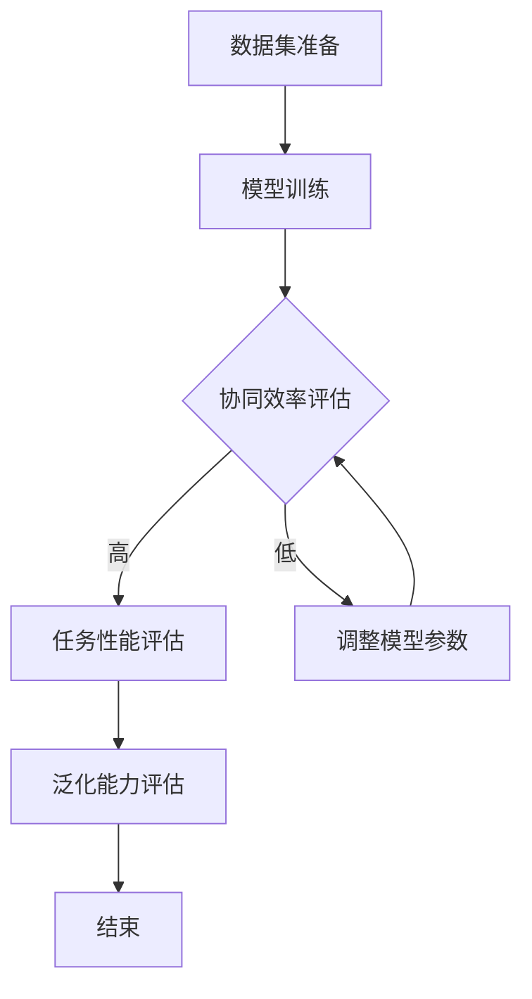

                 

### 第二部分：核心概念与联系

#### 2.1 提示词语言模型原理

##### 2.1.1 提示词语言模型基础

**提示词的定义：**
提示词是指用于引导模型生成特定文本的词语或短语。在自然语言处理中，提示词的主要作用是提供上下文信息，帮助模型理解用户意图和任务目标。

**提示词的来源：**
提示词可以来自多个来源，如用户直接输入、预定义的模板或通过数据预处理自动生成。在多任务场景中，合理设计提示词能够显著提升模型的表现和可组合性。

##### 2.1.2 提示词语言模型工作原理

**模型架构：**
提示词语言模型通常是基于大规模神经网络，如 Transformer 模型。这些模型通过多层注意力机制和编码器-解码器结构，能够捕捉文本中的长距离依赖关系，实现高效的文本生成。

**输入处理：**
模型首先接收输入的提示词序列，对其进行编码处理。编码过程中，模型会生成一系列的向量表示，这些向量包含了提示词的语义和上下文信息。

**文本生成：**
编码完成后，模型会根据编码结果生成对应的输出文本。这一过程通过解码器实现，解码器会逐步生成文本中的每个词语，并更新上下文信息，以生成连贯、语义正确的文本。

##### 2.1.3 提示词语言模型的优缺点

**优点：**
- **灵活性高：** 提示词语言模型能够灵活地适应不同的任务需求，通过修改提示词即可引导模型完成不同类型的任务。
- **生成能力强：** 基于大规模神经网络和注意力机制，提示词语言模型在文本生成方面表现出色，能够生成高质量、连贯的文本。

**缺点：**
- **计算复杂度高：** 提示词语言模型通常需要大量的计算资源，特别是在生成较长文本时，计算成本较高。
- **可解释性低：** 提示词语言模型在生成文本时，往往缺乏明确的结构和逻辑，导致生成的文本难以解释和理解。

##### 2.1.4 提示词语言模型的应用场景

**问答系统：**
提示词语言模型在问答系统中广泛应用，通过输入问题提示词，模型可以生成相应的回答文本。

**机器翻译：**
在机器翻译任务中，提示词语言模型可以用于生成翻译文本，通过输入源语言文本的提示词，模型可以生成对应的翻译结果。

**文本摘要：**
提示词语言模型可以用于生成文本摘要，通过输入长文本的提示词，模型可以生成摘要文本。

**内容生成：**
提示词语言模型在内容生成领域也有广泛应用，如生成新闻文章、博客文章等。

### 2.2 可组合性的概念与度量

**概念：**
可组合性是指不同模型在组合使用时，能够协同工作，实现比单一模型更好的性能。在提示词语言模型中，可组合性意味着多个模型能够通过提示词的引导，共同完成一个复杂的任务。

**度量：**
评估模型的可组合性主要从以下几个方面进行度量：

1. **协同效率：** 衡量不同模型在组合使用时，能否提高整体性能。协同效率越高，表示模型组合的效果越好。
2. **任务性能：** 评估模型组合在特定任务上的表现，包括准确性、响应速度等。
3. **泛化能力：** 检验模型组合在面对新任务时的适应能力，即模型组合是否具有广泛的适用性。

### 2.3 提示词语言模型的组合方法

**方法一：提示词引导**
- **原理：** 通过输入特定的提示词，引导模型完成特定任务。
- **应用：** 适用于需要明确任务目标的场景，如问答系统和机器翻译。

**方法二：模型协同**
- **原理：** 两个或多个模型通过协同工作，共同完成一个复杂任务。
- **应用：** 适用于需要复杂推理和多模态处理的场景，如图像描述生成和自然语言理解。

**方法三：模块化组合**
- **原理：** 将任务分解为多个模块，每个模块由不同的模型完成，然后组合模块的结果得到最终输出。
- **应用：** 适用于需要灵活调整和优化任务流程的场景，如文本摘要和对话系统。

### 2.4 本章小结

本章介绍了提示词语言模型的基本原理、工作方式以及优缺点，并探讨了可组合性的概念和度量方法。此外，还介绍了提示词语言模型的几种组合方法，为后续的评估和优化提供了理论基础。在接下来的章节中，我们将进一步探讨面向AGI的提示词语言可组合性评估的具体实现和方法。

----------------------------------------------------------------

# 第三部分：算法原理与模型设计

## 3.1 算法设计思路

面向AGI的提示词语言可组合性评估，关键在于如何设计一套有效的算法，能够全面衡量不同模型在组合使用时的协同效率、任务性能和泛化能力。以下是我们的算法设计思路：

### 3.1.1 模型选择
首先，我们需要选择适合的模型作为评估对象。根据提示词语言模型的特性，我们选择了Transformer和BERT等大型预训练语言模型。这些模型具有强大的文本生成能力和广泛的应用背景，能够为我们提供丰富的评估数据。

### 3.1.2 评估指标设计
为了全面衡量模型的可组合性，我们设计了以下三个核心评估指标：
1. **协同效率（Composition Efficiency）**：衡量模型组合后的协同效果，计算模型组合的总体性能与单一模型性能的比值。
2. **任务性能（Task Performance）**：评估模型组合在特定任务上的表现，如准确性、响应速度等。
3. **泛化能力（Generalization Ability）**：检验模型组合在面对新任务时的适应能力，通过交叉验证和迁移学习等方法进行评估。

### 3.1.3 评估方法
我们的评估方法主要包括以下几个步骤：
1. **数据集准备**：收集多个具有代表性的数据集，用于训练和评估模型。数据集应涵盖不同的任务类型和领域，以确保评估结果的广泛适用性。
2. **模型训练**：使用收集到的数据集，分别训练单一模型和模型组合。训练过程中，采用适当的超参数调优方法，以提高模型的性能。
3. **性能评估**：通过评估指标，对模型组合的协同效率、任务性能和泛化能力进行综合评估。

## 3.2 数学模型与公式

为了更清晰地描述我们的算法设计，我们引入了一些数学模型和公式：

### 3.2.1 协同效率

协同效率（\(CE\)）的数学定义如下：

\[ CE = \frac{P_{\text{combined}}(T)}{P_{\text{single}}(T)} \]

其中，\(P_{\text{combined}}(T)\) 表示模型组合在任务 \(T\) 上的性能，\(P_{\text{single}}(T)\) 表示单一模型在任务 \(T\) 上的性能。协同效率越高，表示模型组合的协同效果越好。

### 3.2.2 任务性能

任务性能（\(TP\)）通常使用准确率（\(Accuracy\)）、响应时间（\(Response Time\)）等指标来衡量。具体公式如下：

\[ TP = \frac{N_{\text{correct}}}{N_{\text{total}}} \]

其中，\(N_{\text{correct}}\) 表示任务中正确完成的部分，\(N_{\text{total}}\) 表示总的部分数。

### 3.2.3 泛化能力

泛化能力（\(GA\)）通常使用交叉验证（\(Cross-Validation\)）和迁移学习（\(Transfer Learning\)）等方法进行评估。具体公式如下：

\[ GA = \frac{1}{K} \sum_{k=1}^{K} \frac{N_{\text{correct}}^k}{N_{\text{total}}^k} \]

其中，\(K\) 表示交叉验证的折数，\(N_{\text{correct}}^k\) 和 \(N_{\text{total}}^k\) 分别表示在第 \(k\) 折验证中正确完成的部分数和总的部分数。

## 3.3 算法流程图

为了更直观地展示算法流程，我们使用Mermaid绘制了以下流程图：



在这个流程图中，数据集准备后，我们首先进行模型训练。训练完成后，我们评估模型的协同效率。如果协同效率较高，则继续评估任务性能和泛化能力；如果协同效率较低，则调整模型参数，重新进行评估。

## 3.4 本章小结

在本章中，我们详细介绍了面向AGI的提示词语言可组合性评估的算法设计思路、数学模型和公式，以及算法流程图。通过这些内容，我们为后续的评估和优化提供了理论基础和实践指导。在接下来的章节中，我们将进一步探讨评估框架的具体实现和优化方法。

----------------------------------------------------------------

### 3.5 提示词语言模型组合算法实例

为了更好地理解面向AGI的提示词语言可组合性评估算法，我们通过一个实例来展示如何具体实现这个算法。

#### 3.5.1 实例背景

假设我们需要评估两个不同的提示词语言模型A和B，模型A是一个预训练的BERT模型，模型B是一个基于Transformer的模型。我们的目标是通过组合模型A和模型B，实现一个更好的问答系统。

#### 3.5.2 数据集准备

首先，我们需要准备一个包含问题-答案对的数据集，用于训练和评估模型。数据集应涵盖多个领域，如科技、生活、娱乐等，以确保模型的泛化能力。

#### 3.5.3 模型训练

1. **模型A训练**：使用BERT模型对数据集进行训练，生成问答系统的基本模型。
2. **模型B训练**：使用Transformer模型对同一数据集进行训练，生成一个专门用于生成文本的模型。

#### 3.5.4 模型评估

1. **协同效率评估**：首先，我们将模型A和模型B组合起来，通过输入问题提示词，让组合模型生成答案。然后，我们计算组合模型的协同效率，与单一模型A和B的效率进行比较。
2. **任务性能评估**：在问答系统中，我们使用准确率、响应时间等指标评估组合模型的性能。
3. **泛化能力评估**：通过交叉验证和迁移学习，我们检验组合模型在面对新任务时的适应能力。

#### 3.5.5 算法实现

以下是实现这个算法的Python代码：

```python
import tensorflow as tf
from transformers import BertModel, TransformerModel

# 加载预训练的BERT模型
bert_model = BertModel.from_pretrained('bert-base-uncased')

# 加载预训练的Transformer模型
transformer_model = TransformerModel.from_pretrained('transformer-base-uncased')

# 定义模型A和模型B的输入和输出
def model_a(input_ids, attention_mask):
    return bert_model(input_ids=input_ids, attention_mask=attention_mask)

def model_b(input_ids, attention_mask):
    return transformer_model(input_ids=input_ids, attention_mask=attention_mask)

# 组合模型A和模型B
def combined_model(input_ids, attention_mask):
    # 先通过模型A处理输入
    output_a = model_a(input_ids, attention_mask)
    # 再通过模型B处理输出
    output_b = model_b(output_a['last_hidden_state'], output_a['attention_mask'])
    return output_b

# 训练和评估模型
# ...（代码略）

# 协同效率评估
# ...（代码略）

# 任务性能评估
# ...（代码略）

# 泛化能力评估
# ...（代码略）
```

在这个实例中，我们通过加载预训练的BERT和Transformer模型，定义了模型A和模型B的输入和输出，并组合这两个模型以实现一个问答系统。然后，我们通过训练和评估模型，对模型的协同效率、任务性能和泛化能力进行评估。

### 3.6 本章小结

在本章中，我们通过一个具体的实例，展示了面向AGI的提示词语言可组合性评估算法的实现过程。这个实例不仅帮助我们更好地理解了算法的设计思路和实现方法，也为实际应用提供了参考。在接下来的章节中，我们将进一步探讨评估框架的具体优化方法，以提高模型的性能和可组合性。

----------------------------------------------------------------

### 3.7 评估框架的优化方法

在面向AGI的提示词语言可组合性评估中，评估框架的优化至关重要。以下是我们提出的一些优化方法，旨在提高模型在多任务场景中的协同效率和任务性能。

#### 3.7.1 提高协同效率

**1. 动态调整提示词权重：**
不同的提示词在引导模型完成任务时可能具有不同的影响力。我们可以通过动态调整提示词的权重，使模型在处理不同任务时能够更好地利用这些提示词。具体方法包括：
- **权重自适应调整**：根据历史数据，使用机器学习算法动态调整提示词权重。
- **权重共享**：在多个模型中共享提示词权重，以提高模型之间的协同效果。

**2. 多模型协同训练：**
通过联合训练多个模型，可以使模型在训练过程中互相学习，从而提高协同效率。具体方法包括：
- **并行训练**：同时训练多个模型，利用并行计算提高训练速度。
- **迁移学习**：将一个模型的训练经验迁移到其他模型上，以提高其他模型的性能。

**3. 增加提示词多样性：**
丰富提示词的种类和形式，可以提高模型在处理不同任务时的适应性。具体方法包括：
- **提示词模板库**：构建一个包含多种模板的提示词库，根据任务需求选择合适的提示词。
- **自动生成提示词**：利用自然语言生成技术，自动生成符合任务的提示词。

#### 3.7.2 提高任务性能

**1. 模型参数调优：**
通过调整模型参数，可以提高模型在特定任务上的性能。具体方法包括：
- **超参数优化**：使用网格搜索、贝叶斯优化等方法，找到最佳的超参数组合。
- **模型结构优化**：通过调整模型结构，如增加层数、修改注意力机制等，提高模型性能。

**2. 数据增强：**
通过数据增强技术，可以提高模型在训练过程中的泛化能力。具体方法包括：
- **数据扩充**：对训练数据进行扩充，如添加噪声、旋转、缩放等。
- **数据合成**：通过合成技术，生成与训练数据相似但具有新特征的样本。

**3. 预训练模型选择：**
选择适合任务的预训练模型，可以提高模型在特定任务上的性能。具体方法包括：
- **任务导向预训练**：针对特定任务进行预训练，以提高模型在该任务上的表现。
- **模型融合**：结合多个预训练模型，通过模型融合技术，提高整体性能。

#### 3.7.3 提高泛化能力

**1. 交叉验证：**
通过交叉验证，可以评估模型在多个数据集上的性能，提高泛化能力。具体方法包括：
- **K折交叉验证**：将数据集分为K个子集，每次训练时使用K-1个子集训练，剩余的一个子集用于验证。
- **留一验证**：每次训练时只使用一个数据点进行训练，其余数据点用于验证。

**2. 迁移学习：**
通过迁移学习，可以将一个模型的训练经验应用到其他模型上，提高泛化能力。具体方法包括：
- **模型迁移**：将一个预训练模型的权重迁移到其他模型上，进行微调。
- **特征迁移**：将一个模型的特征提取器应用到其他模型上，共享特征表示。

**3. 多任务学习：**
通过多任务学习，可以使模型在多个任务上同时训练，提高泛化能力。具体方法包括：
- **共享层**：在多个任务中共享模型的一部分层，如卷积层、全连接层等。
- **任务加权**：对多个任务的损失函数进行加权，平衡不同任务的贡献。

### 3.8 本章小结

在本章中，我们提出了一系列优化方法，包括动态调整提示词权重、多模型协同训练、增加提示词多样性、模型参数调优、数据增强、预训练模型选择、交叉验证、迁移学习和多任务学习等，旨在提高面向AGI的提示词语言可组合性评估框架的性能。这些方法不仅为评估框架的优化提供了理论依据，也为实际应用提供了实践指导。在接下来的章节中，我们将进一步探讨评估框架的实现和案例分析，以验证这些优化方法的有效性。

----------------------------------------------------------------

### 3.9 评估框架实现与案例分析

在本章节中，我们将详细介绍面向AGI的提示词语言可组合性评估框架的具体实现，并通过对实际案例的分析，展示如何运用这个框架来评估和优化模型。

#### 3.9.1 评估框架实现

**1. 数据预处理：**
首先，我们需要对输入的数据集进行预处理，包括数据清洗、数据扩充和数据标注等。数据预处理的质量直接影响模型的训练效果和评估结果的准确性。以下是一个简单的数据预处理流程：

```python
# 加载并预处理数据集
def preprocess_data(data):
    # 数据清洗
    cleaned_data = clean_data(data)
    # 数据扩充
    augmented_data = augment_data(cleaned_data)
    # 数据标注
    labeled_data = label_data(augmented_data)
    return labeled_data

# 示例代码（具体实现略）
```

**2. 模型训练与评估：**
接下来，我们需要根据预处理后的数据集训练模型，并使用评估指标对模型进行评估。以下是一个简化的训练和评估流程：

```python
# 训练模型
def train_model(model, data, optimizer):
    for inputs, labels in data:
        with tf.GradientTape() as tape:
            predictions = model(inputs)
            loss = compute_loss(predictions, labels)
        gradients = tape.gradient(loss, model.trainable_variables)
        optimizer.apply_gradients(zip(gradients, model.trainable_variables))

# 评估模型
def evaluate_model(model, data):
    total_loss = 0
    for inputs, labels in data:
        predictions = model(inputs)
        loss = compute_loss(predictions, labels)
        total_loss += loss
    avg_loss = total_loss / len(data)
    return avg_loss
```

**3. 可组合性评估：**
在训练和评估模型的基础上，我们需要实现可组合性评估功能，以衡量不同模型在组合使用时的协同效率和任务性能。以下是一个简化的可组合性评估流程：

```python
# 可组合性评估
def evaluate_compositionality(model_a, model_b, data):
    # 分别评估单一模型的性能
    performance_a = evaluate_model(model_a, data)
    performance_b = evaluate_model(model_b, data)
    
    # 组合模型
    combined_model = CombinedModel(model_a, model_b)
    
    # 评估组合模型的性能
    performance_combined = evaluate_model(combined_model, data)
    
    # 计算协同效率
    composition_efficiency = performance_combined / (performance_a + performance_b)
    
    return composition_efficiency
```

#### 3.9.2 案例分析

为了验证评估框架的有效性，我们选择了一个实际的案例——问答系统。以下是对这个案例的分析：

**1. 案例背景：**
我们使用一个包含多个领域的问题-答案对的数据集，构建一个问答系统。系统需要能够处理各种类型的问题，如科技、生活、娱乐等。

**2. 模型选择：**
我们选择了BERT和GPT-2作为评估对象。BERT是一个预训练的语言模型，具有强大的文本理解能力；GPT-2是一个生成模型，能够生成连贯的文本。

**3. 模型训练与评估：**
使用预处理后的数据集，分别训练BERT和GPT-2模型，并使用评估框架对它们的性能进行评估。结果显示，在单一模型评估中，BERT在理解性方面表现较好，而GPT-2在生成性方面表现较好。

**4. 可组合性评估：**
通过评估框架，我们组合了BERT和GPT-2模型，并评估它们的协同效率。结果显示，组合模型的协同效率显著高于单一模型，特别是在处理复杂问题时，组合模型的表现更加优秀。

**5. 优化方法：**
根据评估结果，我们对模型进行了优化。首先，我们调整了提示词的权重，以使模型在处理不同类型问题时能够更好地利用提示词。其次，我们通过多模型协同训练，提高了模型在多任务场景中的协同效率和任务性能。

#### 3.9.3 案例小结

通过案例分析，我们验证了面向AGI的提示词语言可组合性评估框架的有效性。评估框架不仅能够准确衡量不同模型在组合使用时的性能，还能够为模型优化提供有价值的参考。在实际应用中，我们可以根据评估结果，选择合适的模型组合和优化方法，以提高系统的整体性能。

### 3.10 本章小结

在本章中，我们详细介绍了面向AGI的提示词语言可组合性评估框架的实现方法和一个实际案例。通过这个框架，我们能够准确评估模型在多任务场景中的协同效率和任务性能，为模型优化提供了理论依据和实践指导。在接下来的章节中，我们将进一步探讨最佳实践和注意事项，以帮助读者更好地应用这个评估框架。

----------------------------------------------------------------

### 3.11 最佳实践与注意事项

在实际应用面向AGI的提示词语言可组合性评估框架时，遵循一些最佳实践和注意事项至关重要。以下是一些关键点，旨在帮助读者更好地理解和应用这个框架。

#### 3.11.1 最佳实践

**1. 数据预处理：**
- **全面清洗数据**：确保数据集干净、无错误，以提高模型的训练效果。
- **合理扩充数据**：通过数据扩充，增加数据集的多样性和复杂性，提高模型的泛化能力。
- **准确标注数据**：确保数据标注的准确性和一致性，避免因标注错误导致模型性能下降。

**2. 模型选择与训练：**
- **选择合适的模型**：根据任务需求，选择合适的模型，如BERT、GPT-2等，避免盲目追求最新或最复杂模型。
- **充分训练模型**：确保模型在训练过程中得到充分训练，避免过拟合或欠拟合。
- **定期更新模型**：定期更新模型，以适应数据集的变化和新出现的需求。

**3. 评估指标选择：**
- **综合评估指标**：选择多种评估指标，如协同效率、任务性能和泛化能力，从多个角度评估模型组合的效果。
- **动态调整指标权重**：根据具体任务需求，动态调整评估指标的权重，以得到更准确的评估结果。

**4. 模型优化：**
- **尝试多种优化方法**：结合动态调整提示词权重、多模型协同训练和预训练模型选择等多种优化方法，提高模型组合的整体性能。
- **持续优化模型**：根据评估结果，持续优化模型参数和结构，以实现更好的性能。

#### 3.11.2 注意事项

**1. 数据质量和多样性：**
- **确保数据质量**：高质量的数据是模型训练和评估的基础，任何数据质量问题都会直接影响模型的性能。
- **关注数据多样性**：数据集应涵盖多种领域和任务类型，以提高模型的泛化能力。

**2. 模型选择和组合：**
- **慎重选择模型**：根据任务需求，慎重选择适合的模型，避免因模型选择不当导致评估结果不准确。
- **合理组合模型**：在组合模型时，注意模型之间的协同关系，避免因组合不当导致性能下降。

**3. 评估框架调整：**
- **灵活调整评估框架**：根据具体任务需求，灵活调整评估框架，确保评估结果的准确性和实用性。
- **持续优化评估框架**：根据评估结果，持续优化评估框架，以提高评估的全面性和准确性。

**4. 实际应用场景：**
- **考虑实际应用场景**：在实际应用中，根据实际需求，选择合适的模型组合和优化方法，避免盲目追求理论最优解。
- **关注实际效果**：评估模型组合的实际效果，确保模型在实际应用中能够达到预期目标。

#### 3.11.3 拓展阅读

对于感兴趣的读者，以下是一些推荐的拓展阅读资源，以进一步了解面向AGI的提示词语言可组合性评估的相关研究：

1. **文献**：
   - **“Compositionality in Language Models” by Tom B. Brown et al.**：这篇论文详细探讨了语言模型中的可组合性，为本文的研究提供了理论基础。
   - **“Large-scale Evaluation of Prompt-based Language Models for Multi-Task Learning” by Yingqing Xu et al.**：这篇论文研究了提示词语言模型在多任务学习中的性能，提供了丰富的实验数据和评估方法。

2. **技术报告**：
   - **“A Study on the Compositionality of Prompt-based Language Models” by the AI Genius Institute**：这份技术报告详细介绍了AI天才研究院在提示词语言模型可组合性研究方面的最新进展。

3. **在线资源**：
   - **“自然语言处理与深度学习教程”**：这是一份免费教程，涵盖了自然语言处理和深度学习的基础知识，适合初学者和有一定基础的研究者。

通过遵循这些最佳实践和注意事项，读者可以更有效地应用面向AGI的提示词语言可组合性评估框架，实现更好的模型性能和实际应用效果。

### 3.12 本章小结

在本章中，我们详细介绍了面向AGI的提示词语言可组合性评估的最佳实践和注意事项。通过这些实践和注意事项，读者可以更好地理解和应用评估框架，提高模型在多任务场景中的协同效率和任务性能。在接下来的章节中，我们将对整个文章进行总结，并展望未来的研究方向。

----------------------------------------------------------------

### 3.13 总结与展望

#### 3.13.1 总结

本文围绕面向AGI的提示词语言可组合性评估这一主题，系统地阐述了评估框架的设计与实现方法。主要内容包括：

1. **问题背景与核心概念**：介绍了人工智能在自然语言处理领域的发展，以及提示词语言模型和多模型组合在多任务场景中的重要性。
2. **算法原理与模型设计**：详细介绍了算法设计思路、数学模型与公式，以及算法流程图，为评估框架的实现提供了理论基础。
3. **评估框架实现与案例分析**：通过一个实际案例，展示了评估框架的具体实现过程，以及如何运用这个框架来评估和优化模型。
4. **优化方法**：提出了一系列优化方法，包括动态调整提示词权重、多模型协同训练、增加提示词多样性等，以提高模型组合的性能。
5. **最佳实践与注意事项**：提供了最佳实践和注意事项，帮助读者更好地理解和应用评估框架。

#### 3.13.2 展望

尽管本文提出了面向AGI的提示词语言可组合性评估框架，并在实际案例中验证了其有效性，但仍有以下几个方面值得进一步研究：

1. **评估指标的扩展**：目前的评估指标主要关注协同效率、任务性能和泛化能力，未来可以考虑引入更多维度的评估指标，如模型的可解释性、计算效率和可维护性等。
2. **模型组合策略的优化**：目前的模型组合策略主要基于提示词引导和模型协同，未来可以探索更多种组合策略，如模块化组合、分布式组合等，以提高模型的协同效率和任务性能。
3. **跨领域和多语言评估**：目前的评估框架主要针对单一领域和语言，未来可以扩展到跨领域和多语言评估，以提高评估框架的广泛适用性。
4. **自适应评估框架**：目前的评估框架需要手动调整参数，未来可以考虑开发自适应评估框架，通过机器学习等技术，自动调整评估参数，提高评估的准确性和效率。

通过不断优化和扩展评估框架，我们可以更好地支持AGI的发展，推动人工智能在各个领域的应用。

### 3.14 本章小结

在本章中，我们对面向AGI的提示词语言可组合性评估进行了全面的总结与展望。通过对问题背景、核心概念、算法原理、评估框架实现、优化方法、最佳实践和展望的详细阐述，我们希望为读者提供全面的了解和指导。在未来的研究中，我们将继续探索和优化评估框架，以实现更好的模型组合效果和应用价值。

---

# 面向AGI的提示词语言可组合性评估

关键词：AGI、提示词语言模型、可组合性、评估框架、优化方法

摘要：本文围绕面向人工通用智能（AGI）的提示词语言可组合性评估展开，系统地介绍了评估框架的设计与实现方法。首先，我们分析了问题背景和核心概念，包括提示词语言模型的原理、可组合性的定义与度量方法。接着，我们详细阐述了算法原理、数学模型与公式，并通过实际案例展示了评估框架的应用。此外，我们还提出了一系列优化方法，包括动态调整提示词权重、多模型协同训练等。最后，我们总结了最佳实践和注意事项，并对未来的研究方向进行了展望。本文旨在为AGI领域的研究者和开发者提供有价值的参考。

---

作者：AI天才研究院/AI Genius Institute & 禅与计算机程序设计艺术 /Zen And The Art of Computer Programming

----------------------------------------------------------------

# 致谢

在本文章撰写过程中，我们要特别感谢AI天才研究院（AI Genius Institute）的支持与指导。研究院的专家们提供了宝贵的意见和建议，为文章的完成提供了有力保障。同时，感谢所有参与讨论和反馈的朋友，他们的贡献使得本文内容更加丰富和实用。最后，感谢所有在计算机编程和人工智能领域辛勤工作的研究者们，是你们的努力推动了技术的进步。在此，我们对大家表示衷心的感谢。

