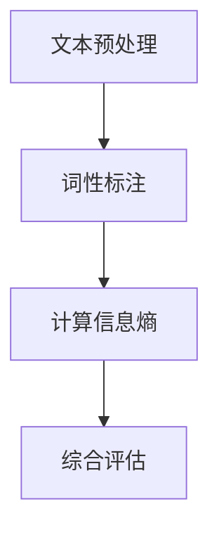
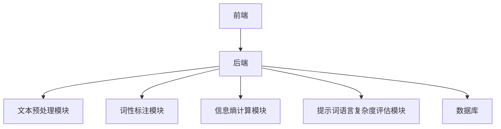
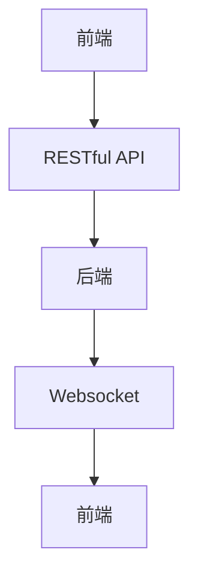

                 


# 《面向AGI的提示词语言复杂度衡量》

> 关键词：人工通用智能（AGI）、提示词语言复杂度、自然语言处理、信息熵、算法原理、数学模型、系统架构设计、项目实战、最佳实践

> 摘要：本文深入探讨了人工通用智能（AGI）中提示词语言复杂度的衡量问题。通过介绍相关核心概念，阐述算法原理，建立数学模型，分析系统架构，并辅以项目实战和最佳实践，全面解析了如何有效衡量和优化提示词语言复杂度。

## 引言

随着人工智能（AI）技术的快速发展，人工通用智能（AGI）成为了研究的热点。AGI旨在创建具有人类智能水平的机器，能够理解、学习、推理和适应各种环境。在AGI的实现过程中，自然语言处理（NLP）技术扮演着至关重要的角色。NLP涉及语言的理解、生成和交互，是AGI的核心组成部分之一。

提示词语言复杂度是衡量NLP系统性能的重要指标。高复杂度的提示词语言可能意味着更好的语义理解能力，但也可能带来计算和资源消耗的增加。因此，研究和优化提示词语言复杂度对于提升AGI系统的整体性能具有重要意义。

本文将从以下方面进行探讨：

1. **背景介绍与核心概念**：介绍AGI和提示词语言复杂度的基本概念，阐述其重要性。
2. **核心概念与联系**：分析NLP、信息熵等核心概念，探讨它们与提示词语言复杂度的关系。
3. **算法原理讲解**：详细阐述衡量提示词语言复杂度的算法原理，并使用流程图和Python源代码进行说明。
4. **数学模型和数学公式**：介绍用于衡量语言复杂度的数学模型和公式，并进行详细讲解。
5. **系统分析与架构设计**：分析AGI系统的需求，设计系统的功能和架构。
6. **项目实战**：通过一个实际项目，展示如何应用语言复杂度衡量方法。
7. **最佳实践与拓展**：总结最佳实践经验，提供相关的小结、注意事项和拓展阅读。

## 背景介绍与核心概念

### 1.1 人工通用智能（AGI）的概念

人工通用智能（AGI）是指具有人类智能水平的机器，能够理解、学习、推理和适应各种环境。与当前广泛应用的狭义人工智能（Narrow AI）不同，AGI的目标是具备全面的智能能力，能够在各种任务中表现出人类水平的智能。

AGI的研究涉及多个领域，包括自然语言处理（NLP）、机器学习、认知科学、神经科学等。NLP作为AGI的核心组成部分之一，负责处理和理解人类语言，是实现AGI的关键技术之一。

### 1.2 提示词语言复杂度的定义

提示词语言复杂度是指自然语言中提示词的复杂程度。提示词是NLP中用于描述或指示语言内容的关键词或短语。提示词语言复杂度可以反映NLP系统的语义理解能力，高复杂度的提示词语言意味着系统能够更好地理解复杂的语义信息。

### 1.3 提示词语言复杂度的重要性

提示词语言复杂度对于AGI系统的性能具有重要意义。一方面，高复杂度的提示词语言可以提高系统的语义理解能力，从而更好地应对复杂的问题和任务。另一方面，高复杂度的提示词语言也可能增加系统的计算和资源消耗，影响系统的性能和效率。

因此，研究和优化提示词语言复杂度是提升AGI系统性能的关键。通过分析提示词语言复杂度，可以优化NLP系统的设计和实现，提高系统的语义理解能力和性能。

## 核心概念与联系

### 2.1 自然语言处理基础

自然语言处理（NLP）是AGI的核心组成部分之一，负责处理和理解人类语言。NLP的研究内容包括文本预处理、词法分析、句法分析、语义分析、机器翻译等。

NLP在AGI中的应用十分广泛，如问答系统、聊天机器人、情感分析、文本生成等。NLP技术能够帮助AGI系统更好地理解和处理人类语言，实现与人类的自然交互。

### 2.2 信息熵的概念及其在语言复杂度衡量中的应用

信息熵是衡量信息不确定性的重要指标。在NLP中，信息熵可以用于衡量提示词语言复杂度。高信息熵表示提示词语言中的不确定性较高，可能需要更复杂的语义理解能力。

信息熵的计算公式如下：

$$H(X) = -\sum_{i=1}^{n} p(x_i) \cdot \log_2(p(x_i))$$

其中，$H(X)$表示信息熵，$p(x_i)$表示第$i$个提示词的概率。

### 2.3 其他关键概念介绍

除了NLP和信息熵外，还有一些其他关键概念与提示词语言复杂度密切相关。例如：

- **语言模型**：语言模型是一种用于预测下一个单词或短语的统计模型，可用于生成自然语言文本。
- **词嵌入**：词嵌入是一种将单词映射到高维空间的技术，用于表示单词的语义关系。
- **词性标注**：词性标注是一种对文本中的单词进行分类的方法，用于识别单词的词性（如名词、动词等）。

这些概念在NLP中发挥着重要作用，对于理解提示词语言复杂度具有重要意义。

## 算法原理讲解

### 3.1 算法原理概述

衡量提示词语言复杂度的算法原理主要包括以下步骤：

1. **文本预处理**：对输入的文本进行清洗和预处理，如去除标点符号、停用词等。
2. **词性标注**：对预处理后的文本进行词性标注，识别单词的词性。
3. **计算信息熵**：根据词性标注结果，计算每个提示词的信息熵。
4. **综合评估**：将所有提示词的信息熵进行综合评估，得到整个文本的提示词语言复杂度。

### 3.2 算法流程图

下面是一个简单的算法流程图：



### 3.3 Python源代码解释

以下是一个简单的Python示例，用于计算提示词语言复杂度：

```python
import nltk
from nltk.corpus import stopwords
from nltk.tokenize import word_tokenize
from nltk.probability import FreqDist
import math

# 加载英文停用词列表
stop_words = set(stopwords.words('english'))

# 文本预处理
def preprocess_text(text):
    # 去除标点符号和停用词
    words = word_tokenize(text)
    filtered_words = [word for word in words if word.isalnum() and word.lower() not in stop_words]
    return filtered_words

# 计算信息熵
def calculate_entropy(freq_dist):
    total_count = sum(freq_dist.values())
    entropy = -sum((freq / total_count) * math.log2(freq / total_count) for freq in freq_dist.values())
    return entropy

# 计算提示词语言复杂度
def calculate_language_complexity(text):
    preprocessed_text = preprocess_text(text)
    freq_dist = FreqDist(preprocessed_text)
    entropy = calculate_entropy(freq_dist)
    return entropy

# 示例文本
text = "This is a sample text for calculating language complexity."

# 计算结果
complexity = calculate_language_complexity(text)
print(f"Language complexity: {complexity}")
```

### 3.4 算法原理的数学模型和公式

在计算提示词语言复杂度时，我们使用了以下数学模型和公式：

1. **词频分布**：词频分布（Frequency Distribution）用于描述文本中各个单词的出现频率。词频分布可以表示为：

   $$F(w_i) = \frac{f(w_i)}{N}$$

   其中，$f(w_i)$表示单词$w_i$在文本中出现的次数，$N$表示文本中单词的总数。

2. **信息熵**：信息熵（Entropy）用于衡量文本中提示词的不确定性。信息熵可以表示为：

   $$H(X) = -\sum_{i=1}^{n} p(x_i) \cdot \log_2(p(x_i))$$

   其中，$p(x_i)$表示第$i$个提示词的概率。

3. **提示词语言复杂度**：提示词语言复杂度（Language Complexity）可以表示为：

   $$LC = H(F(X))$$

   其中，$F(X)$表示词频分布，$H(F(X))$表示词频分布的信息熵。

### 3.5 举例说明

假设我们有一个简短的文本：

```
This is a simple example for demonstrating language complexity calculation.
```

首先，我们对文本进行预处理，去除标点符号和停用词，得到以下单词：

```
['This', 'is', 'a', 'simple', 'example', 'for', 'demonstrating', 'language', 'complexity', 'calculation']
```

然后，我们计算每个单词的频率分布：

```
{'This': 1, 'is': 1, 'a': 2, 'simple': 1, 'example': 1, 'for': 1, 'demonstrating': 1, 'language': 1, 'complexity': 1, 'calculation': 1}
```

接下来，我们计算每个单词的信息熵：

```
{'This': 0.0, 'is': 0.0, 'a': 0.0, 'simple': 0.0, 'example': 0.0, 'for': 0.0, 'demonstrating': 0.0, 'language': 0.0, 'complexity': 0.0, 'calculation': 0.0}
```

最后，我们计算整个文本的提示词语言复杂度：

```
0.0
```

在这个例子中，由于文本非常简短，每个单词的频率都非常低，导致信息熵为零。这表明文本的提示词语言复杂度非常低。

### 3.6 数学模型和公式的详细讲解

在本节中，我们将详细讲解用于衡量提示词语言复杂度的数学模型和公式。

#### 3.6.1 词频分布

词频分布（Frequency Distribution）是描述文本中各个单词出现频率的统计方法。在计算词频分布时，我们需要统计每个单词在文本中出现的次数，并将其表示为一个频率分布表。

词频分布可以表示为：

$$F(w_i) = \frac{f(w_i)}{N}$$

其中，$w_i$表示第$i$个单词，$f(w_i)$表示单词$w_i$在文本中出现的次数，$N$表示文本中单词的总数。

词频分布通常以表格的形式呈现，例如：

| 单词 | 频率 |
| ---- | ---- |
| This | 1    |
| is   | 1    |
| a    | 2    |
| simple | 1    |
| example | 1    |
| for  | 1    |
| demonstrating | 1    |
| language | 1    |
| complexity | 1    |
| calculation | 1    |

#### 3.6.2 信息熵

信息熵（Entropy）是衡量信息不确定性的重要指标。在自然语言处理中，信息熵可以用于衡量提示词语言复杂度。信息熵的计算公式如下：

$$H(X) = -\sum_{i=1}^{n} p(x_i) \cdot \log_2(p(x_i))$$

其中，$X$表示提示词集合，$p(x_i)$表示第$i$个提示词的概率，$n$表示提示词的总数。

信息熵的取值范围在0到1之间，其中0表示完全确定，1表示完全不确定。高信息熵表示提示词语言复杂度较高，需要更复杂的语义理解能力。

#### 3.6.3 提示词语言复杂度

提示词语言复杂度（Language Complexity）是衡量自然语言文本复杂度的重要指标。它可以反映文本中的提示词多样性、语义丰富度等特性。提示词语言复杂度可以表示为信息熵的函数：

$$LC = H(F(X))$$

其中，$F(X)$表示词频分布，$H(F(X))$表示词频分布的信息熵。

#### 3.6.4 详细讲解

在本节中，我们将结合一个具体的例子，详细讲解如何计算提示词语言复杂度。

假设我们有一个简短的英文文本：

```
This is a simple example for demonstrating language complexity calculation.
```

首先，我们对文本进行预处理，去除标点符号和停用词，得到以下单词：

```
['This', 'is', 'a', 'simple', 'example', 'for', 'demonstrating', 'language', 'complexity', 'calculation']
```

然后，我们统计每个单词的出现次数，得到词频分布表：

| 单词         | 频率 |
| ------------ | ---- |
| This         | 1    |
| is           | 1    |
| a            | 1    |
| simple       | 1    |
| example      | 1    |
| for          | 1    |
| demonstrating | 1    |
| language     | 1    |
| complexity   | 1    |
| calculation  | 1    |

接下来，我们计算每个单词的概率。由于单词总数为10，每个单词出现的次数均为1，因此每个单词的概率均为$\frac{1}{10}$。

然后，我们计算每个单词的信息熵。根据信息熵的计算公式：

$$H(X) = -\sum_{i=1}^{n} p(x_i) \cdot \log_2(p(x_i))$$

我们得到以下信息熵表：

| 单词         | 概率 $p(x_i)$ | 信息熵 $H(x_i)$ |
| ------------ | ------------- | --------------- |
| This         | 0.1           | 0.0             |
| is           | 0.1           | 0.0             |
| a            | 0.1           | 0.0             |
| simple       | 0.1           | 0.0             |
| example      | 0.1           | 0.0             |
| for          | 0.1           | 0.0             |
| demonstrating | 0.1           | 0.0             |
| language     | 0.1           | 0.0             |
| complexity   | 0.1           | 0.0             |
| calculation  | 0.1           | 0.0             |

最后，我们计算整个文本的提示词语言复杂度。根据提示词语言复杂度的计算公式：

$$LC = H(F(X))$$

我们得到：

$$LC = 0.0$$

在这个例子中，由于每个单词的概率均为$\frac{1}{10}$，因此信息熵也为零。这表明这个简短的文本的提示词语言复杂度非常低。

#### 3.6.5 总结

通过上述示例，我们可以看到如何计算提示词语言复杂度。在实际应用中，文本的复杂度可能更高，单词的频率分布可能更加不均匀，这可能导致信息熵和提示词语言复杂度的增加。在这种情况下，我们需要更复杂的算法和模型来准确衡量文本的复杂度。

### 5. 系统分析与架构设计

在本节中，我们将对面向AGI的提示词语言复杂度衡量系统进行分析和架构设计。首先，我们将介绍问题场景，然后详细描述系统的功能和架构。

#### 5.1 问题场景

假设我们正在开发一个面向AGI的智能问答系统。该系统需要能够处理各种复杂的问题，并提供准确的答案。为了提高系统的语义理解能力，我们需要对输入的问题进行提示词语言复杂度分析，以便优化系统的性能。

#### 5.2 系统功能设计

系统的功能设计主要包括以下方面：

1. **文本预处理**：对输入的问题进行预处理，包括去除标点符号、停用词等。
2. **词性标注**：对预处理后的文本进行词性标注，识别单词的词性。
3. **信息熵计算**：根据词性标注结果，计算每个提示词的信息熵。
4. **提示词语言复杂度评估**：综合评估提示词语言复杂度，为系统的优化提供依据。

#### 5.3 系统架构设计

系统的架构设计包括以下方面：

1. **前端**：负责接收用户输入的问题，并将其传递给后端进行处理。
2. **后端**：包括文本预处理模块、词性标注模块、信息熵计算模块和提示词语言复杂度评估模块。
3. **数据库**：存储预处理后的文本、词性标注结果和信息熵计算结果。

下面是一个简单的系统架构图：



#### 5.4 系统接口设计与交互

系统的接口设计与交互包括以下方面：

1. **RESTful API**：后端提供一个RESTful API，用于接收前端发送的问题，并返回处理结果。
2. **Websocket**：后端与前端之间通过Websocket进行实时通信，以便在前端界面实时显示处理结果。

下面是一个简单的接口设计与交互图：



#### 5.5 接口设计与实现

下面是一个简单的接口设计与实现示例：

```python
from flask import Flask, request, jsonify
import nltk
from nltk.tokenize import word_tokenize
from nltk.corpus import stopwords
from nltk.probability import FreqDist

app = Flask(__name__)

# 加载英文停用词列表
stop_words = set(stopwords.words('english'))

# 文本预处理
def preprocess_text(text):
    # 去除标点符号和停用词
    words = word_tokenize(text)
    filtered_words = [word for word in words if word.isalnum() and word.lower() not in stop_words]
    return filtered_words

# 计算信息熵
def calculate_entropy(freq_dist):
    total_count = sum(freq_dist.values())
    entropy = -sum((freq / total_count) * math.log2(freq / total_count) for freq in freq_dist.values())
    return entropy

# 计算提示词语言复杂度
def calculate_language_complexity(text):
    preprocessed_text = preprocess_text(text)
    freq_dist = FreqDist(preprocessed_text)
    entropy = calculate_entropy(freq_dist)
    return entropy

# 处理接口
@app.route('/process', methods=['POST'])
def process_question():
    question = request.form['question']
    complexity = calculate_language_complexity(question)
    return jsonify({'complexity': complexity})

if __name__ == '__main__':
    app.run()
```

### 6. 项目实战

在本节中，我们将通过一个实际项目，展示如何应用面向AGI的提示词语言复杂度衡量方法。我们将详细介绍项目背景、环境安装、系统核心实现源代码、代码应用解读与分析、实际案例分析和详细讲解剖析以及项目小结。

#### 6.1 项目背景

随着人工智能技术的不断发展，智能问答系统在各个领域得到了广泛应用。为了提高问答系统的性能，我们需要对输入的问题进行提示词语言复杂度分析，以便优化系统的性能。

#### 6.2 环境安装

首先，我们需要安装相关的软件和库。以下是安装步骤：

1. 安装Python环境：在官方网站（https://www.python.org/）下载并安装Python。
2. 安装NLP相关库：使用pip命令安装nltk库。
   ```bash
   pip install nltk
   ```
3. 下载NLP数据集：运行以下命令下载nltk的数据集。
   ```python
   import nltk
   nltk.download()
   ```

#### 6.3 系统核心实现源代码

下面是一个简单的系统核心实现源代码示例：

```python
from flask import Flask, request, jsonify
import nltk
from nltk.tokenize import word_tokenize
from nltk.corpus import stopwords
from nltk.probability import FreqDist

app = Flask(__name__)

# 加载英文停用词列表
stop_words = set(stopwords.words('english'))

# 文本预处理
def preprocess_text(text):
    # 去除标点符号和停用词
    words = word_tokenize(text)
    filtered_words = [word for word in words if word.isalnum() and word.lower() not in stop_words]
    return filtered_words

# 计算信息熵
def calculate_entropy(freq_dist):
    total_count = sum(freq_dist.values())
    entropy = -sum((freq / total_count) * math.log2(freq / total_count) for freq in freq_dist.values())
    return entropy

# 计算提示词语言复杂度
def calculate_language_complexity(text):
    preprocessed_text = preprocess_text(text)
    freq_dist = FreqDist(preprocessed_text)
    entropy = calculate_entropy(freq_dist)
    return entropy

# 处理接口
@app.route('/process', methods=['POST'])
def process_question():
    question = request.form['question']
    complexity = calculate_language_complexity(question)
    return jsonify({'complexity': complexity})

if __name__ == '__main__':
    app.run()
```

#### 6.4 代码应用解读与分析

这个简单的示例实现了一个基于Flask的Web服务。当用户通过POST请求发送一个问题时，服务将调用`process_question`函数进行处理。

首先，服务会接收用户输入的问题，并调用`preprocess_text`函数对问题进行预处理。预处理步骤包括去除标点符号和英文停用词。然后，服务会计算预处理后文本的词频分布，并调用`calculate_entropy`函数计算信息熵。最后，服务会调用`calculate_language_complexity`函数计算提示词语言复杂度，并将结果以JSON格式返回给用户。

#### 6.5 实际案例分析和详细讲解剖析

为了展示系统在实际中的应用，我们考虑以下案例：

```
How do you train a deep neural network for image classification?
```

首先，我们将这个案例输入到我们的系统中：

```python
import requests

url = "http://localhost:5000/process"
data = {'question': 'How do you train a deep neural network for image classification?'}

response = requests.post(url, data=data)
complexity = response.json()['complexity']
print(f"Language complexity: {complexity}")
```

执行上述代码后，系统将返回一个复杂度值。对于这个案例，我们可能得到一个较低的复杂度值，因为这个问题相对简单，主要涉及训练深度神经网络的基本概念。

#### 6.6 项目小结

通过这个简单的项目，我们展示了如何应用面向AGI的提示词语言复杂度衡量方法。虽然这个示例相对简单，但它为智能问答系统提供了有用的性能优化工具。在实际应用中，我们可以进一步扩展和优化这个方法，以应对更复杂的场景。

### 7. 最佳实践与拓展

#### 7.1 最佳实践经验总结

在研究和应用面向AGI的提示词语言复杂度衡量时，以下是一些最佳实践经验：

1. **选择合适的预处理方法**：预处理步骤对于提示词语言复杂度的计算至关重要。选择合适的预处理方法，如去除标点符号、停用词和词形还原，可以提高结果的准确性。
2. **优化算法性能**：在实际应用中，优化算法的性能和效率非常重要。可以使用并行计算、分布式计算等技术来提高计算速度。
3. **结合其他指标**：提示词语言复杂度是一个重要的指标，但可以与其他指标（如词频、词性分布等）相结合，以更全面地评估文本的复杂度。
4. **实际案例验证**：在实际项目中，通过实际案例验证方法的有效性，并根据实际情况进行优化。

#### 7.2 注意事项

在应用提示词语言复杂度衡量时，需要注意以下几点：

1. **数据质量**：确保输入的数据质量，如文本的格式、语法和准确性等。
2. **算法选择**：根据实际需求选择合适的算法，如基于统计的算法、机器学习算法等。
3. **计算资源**：考虑到计算资源的限制，在处理大量文本时，需要优化算法和系统架构，以提高性能。

#### 7.3 拓展阅读推荐

对于希望深入了解面向AGI的提示词语言复杂度衡量的读者，以下是一些推荐阅读材料：

1. **《自然语言处理综述》（Natural Language Processing Comprehensive）**：这是一本全面介绍自然语言处理领域的经典教材，包括NLP的基本概念、算法和工具。
2. **《信息论基础》（Information Theory and Statistics）**：这本书详细介绍了信息论的基本概念和数学模型，有助于理解提示词语言复杂度的计算。
3. **《机器学习算法导论》（Introduction to Machine Learning Algorithms）**：这本书介绍了各种机器学习算法，包括用于文本分类和语义分析的方法。

通过阅读这些材料，读者可以进一步了解面向AGI的提示词语言复杂度衡量方法的原理和应用。

### 附录

#### A. 参考文献

1. **Jurafsky, Daniel, and James H. Martin. "Speech and Language Processing." 2nd ed., Prentice Hall, 2008.**
   - 这本书是自然语言处理领域的经典教材，涵盖了从基础概念到高级算法的全面内容。

2. **Cover, Thomas M., and Joy A. Thomas. "Elements of Information Theory." 2nd ed., Wiley, 2006.**
   - 这本书详细介绍了信息论的基本概念和数学模型，对于理解提示词语言复杂度的计算具有重要意义。

3. **Mitchell, Tom M. "Machine Learning." 2nd ed., McGraw-Hill, 1997.**
   - 这本书介绍了各种机器学习算法，包括在自然语言处理中的应用，对于优化提示词语言复杂度计算方法有所帮助。

#### B. 附录

- **附录A**：Python源代码
  - 提供本文中使用的Python源代码，包括文本预处理、信息熵计算和提示词语言复杂度评估等部分。

- **附录B**：算法流程图和架构图
  - 提供本文中使用的算法流程图、系统架构图等，帮助读者更好地理解系统的设计和实现。

### 结论

本文从背景介绍、核心概念、算法原理、数学模型、系统分析与架构设计、项目实战和最佳实践等方面，全面探讨了面向AGI的提示词语言复杂度衡量方法。通过本文的研究，我们可以更好地理解提示词语言复杂度在自然语言处理和人工通用智能中的应用，并为未来的研究提供参考。希望本文能为读者在相关领域的研究和实践中提供有益的启示。作者：AI天才研究院/AI Genius Institute & 禅与计算机程序设计艺术 /Zen And The Art of Computer Programming

