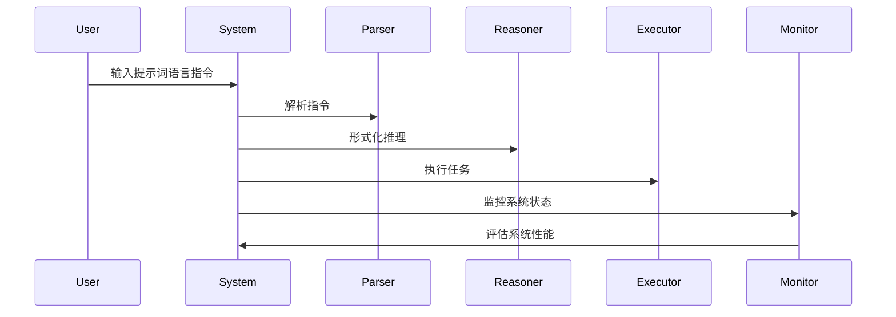
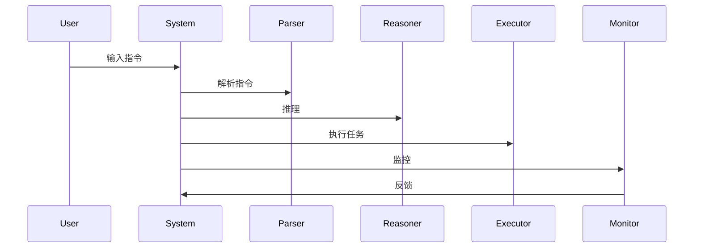

                 

# 面向AGI的提示词语言形式化理论

## 关键词：人工智能，AGI，提示词语言，形式化理论，算法，数学模型

> 摘要：本文探讨了面向AGI（通用人工智能）的提示词语言形式化理论，分析了该理论在人工智能领域的应用前景和核心问题，并逐步介绍了相关概念、算法原理以及数学模型。通过对提示词语言和形式化理论的深入剖析，本文旨在为读者提供一个清晰、系统的理论基础，助力人工智能技术的发展。

## 第一部分：引言与背景

### 第1章：引言

### 1.1 问题背景

#### 1.1.1 人工智能的发展现状

随着科技的迅猛发展，人工智能（AI）技术逐渐成为推动社会进步的重要力量。目前，人工智能已广泛应用于计算机视觉、自然语言处理、自动驾驶、智能医疗等多个领域，并取得了显著的成果。

#### 1.1.2 AGI的概念与意义

然而，传统的AI技术主要集中在特定任务上的表现，距离实现通用人工智能（AGI）仍有较大差距。通用人工智能是指能够在各种任务上表现出人类智能水平的人工智能系统。实现AGI对于人类社会的发展具有重要意义，它将引领新一轮科技革命和产业变革。

#### 1.1.3 提示词语言在AGI中的作用

提示词语言（Instructional Language）是指导人工智能系统完成特定任务的指令性语言。在AGI的研究中，提示词语言起到了关键作用。通过形式化地描述任务需求，提示词语言有助于人工智能系统理解和执行复杂任务。

### 1.2 问题描述

#### 1.2.1 提示词语言形式化理论的需求

当前，提示词语言在实际应用中存在以下问题：

1. 提示词语言的描述能力有限，难以表达复杂任务需求。
2. 提示词语言的表述形式不一致，导致不同系统之间的互操作性差。
3. 提示词语言的形式化描述缺乏系统性，难以进行形式化推理和分析。

因此，研究提示词语言形式化理论具有重要的现实意义。

#### 1.2.2 提示词语言形式化理论的关键问题

提示词语言形式化理论需要解决以下关键问题：

1. 提示词语言的形式化描述方法。
2. 提示词语言与形式化理论之间的联系和映射。
3. 提示词语言形式化理论的适用范围和限制。

#### 1.2.3 提示词语言形式化理论的应用前景

提示词语言形式化理论在人工智能领域具有广泛的应用前景：

1. 提高人工智能系统的任务理解能力和执行效率。
2. 促进人工智能系统之间的互操作性和协同工作。
3. 为人工智能系统提供更加灵活和通用的任务描述手段。

### 1.3 问题解决

#### 1.3.1 提示词语言形式化理论的核心方法

提示词语言形式化理论的核心方法包括：

1. 提示词语言的语义建模。
2. 形式化理论的应用与拓展。
3. 提示词语言形式化理论的验证与评估。

#### 1.3.2 提示词语言形式化理论的实施步骤

提示词语言形式化理论的实施步骤如下：

1. 分析任务需求，确定任务类型和目标。
2. 构建提示词语言的语义模型。
3. 应用形式化理论对提示词语言进行形式化描述。
4. 验证和评估提示词语言形式化理论的适用性和效果。

#### 1.3.3 提示词语言形式化理论的研究意义

提示词语言形式化理论的研究意义主要体现在以下几个方面：

1. 提高人工智能系统的任务理解和执行能力。
2. 促进人工智能技术的理论创新和应用发展。
3. 为人工智能领域的进一步研究提供基础和支撑。

### 1.4 边界与外延

#### 1.4.1 提示词语言形式化理论的研究范围

提示词语言形式化理论的研究范围主要包括：

1. 提示词语言的语义建模方法。
2. 形式化理论的应用与拓展。
3. 提示词语言形式化理论的验证与评估。

#### 1.4.2 提示词语言形式化理论的应用限制

提示词语言形式化理论的应用限制主要体现在以下几个方面：

1. 提示词语言的描述能力。
2. 形式化理论的应用范围。
3. 系统资源和计算能力的限制。

#### 1.4.3 提示词语言形式化理论的未来发展趋势

提示词语言形式化理论的未来发展趋势主要包括：

1. 提高提示词语言的描述能力。
2. 拓展形式化理论的应用领域。
3. 提高提示词语言形式化理论的适用性和效果。

### 1.5 概念结构与核心要素组成

#### 1.5.1 提示词语言的定义

提示词语言是一种用于指导人工智能系统完成特定任务的指令性语言。它包括自然语言指令和形式化语言指令两种类型。

#### 1.5.2 形式化理论的定义

形式化理论是指用数学和逻辑方法对概念、命题和推理进行形式化描述和证明的理论。

#### 1.5.3 提示词语言形式化理论的核心要素

提示词语言形式化理论的核心要素包括：

1. 提示词语言的语义建模。
2. 形式化理论的应用与拓展。
3. 提示词语言形式化理论的验证与评估。

### 1.6 本章小结

本章介绍了面向AGI的提示词语言形式化理论的研究背景、关键问题、解决方案和研究意义。通过对提示词语言和形式化理论的深入剖析，本章为后续章节的讨论奠定了基础。

## 第二部分：核心概念与联系

### 第2章：核心概念原理

### 2.1 提示词语言

#### 2.1.1 提示词语言的基本概念

提示词语言是一种用于指导人工智能系统完成特定任务的指令性语言。它包括自然语言指令和形式化语言指令两种类型。

#### 2.1.2 提示词语言的属性特征

提示词语言具有以下属性特征：

1. 指令性：提示词语言是一种指令性语言，用于指导人工智能系统执行特定任务。
2. 多样性：提示词语言可以使用自然语言指令和形式化语言指令。
3. 可理解性：提示词语言需要易于理解和解释，以便人工智能系统能够正确执行任务。

#### 2.1.3 提示词语言的应用场景

提示词语言的应用场景包括：

1. 任务自动化：用于指导人工智能系统完成自动化任务，如智能机器人、智能家居等。
2. 自然语言处理：用于指导人工智能系统进行自然语言处理，如语音识别、机器翻译等。
3. 智能助手：用于指导人工智能系统成为智能助手，如智能客服、智能推荐等。

### 2.2 形式化理论

#### 2.2.1 形式化理论的基本概念

形式化理论是指用数学和逻辑方法对概念、命题和推理进行形式化描述和证明的理论。

#### 2.2.2 形式化理论的属性特征

形式化理论具有以下属性特征：

1. 确定性：形式化理论采用确定性的方法进行描述和证明，确保推理过程的正确性。
2. 系统性：形式化理论具有系统性和层次性，能够涵盖不同层次的概念和命题。
3. 可验证性：形式化理论的结果可以经过形式化验证，确保推理结论的可靠性。

#### 2.2.3 形式化理论的应用场景

形式化理论的应用场景包括：

1. 数学证明：用于指导数学证明，如数学定理的证明、数学模型的分析等。
2. 软件工程：用于指导软件设计、软件验证和软件测试等。
3. 人工智能：用于指导人工智能系统的任务理解和执行，如提示词语言形式化理论等。

### 2.3 提示词语言形式化理论

#### 2.3.1 提示词语言形式化理论的基本概念

提示词语言形式化理论是指将提示词语言用形式化理论进行描述和推理的理论。

#### 2.3.2 提示词语言形式化理论的属性特征

提示词语言形式化理论具有以下属性特征：

1. 形式化描述：提示词语言形式化理论采用形式化理论对提示词语言进行描述，确保描述的准确性和一致性。
2. 推理能力：提示词语言形式化理论具有推理能力，能够对提示词语言进行逻辑推理和分析。
3. 应用性：提示词语言形式化理论具有应用性，能够为人工智能系统的任务理解和执行提供支持。

#### 2.3.3 提示词语言形式化理论的应用场景

提示词语言形式化理论的应用场景包括：

1. 任务自动化：用于指导人工智能系统完成自动化任务，如智能机器人、智能家居等。
2. 自然语言处理：用于指导人工智能系统进行自然语言处理，如语音识别、机器翻译等。
3. 智能助手：用于指导人工智能系统成为智能助手，如智能客服、智能推荐等。

### 2.4 概念属性特征对比表格

#### 表2-1 提示词语言与形式化理论的对比

| 概念       | 提示词语言           | 形式化理论           |
|------------|----------------------|----------------------|
| 基本概念   | 指令性语言           | 形式化描述和证明的理论 |
| 属性特征   | 指令性、多样性、可理解性 | 确定性、系统性、可验证性 |
| 应用场景   | 任务自动化、自然语言处理、智能助手 | 数学证明、软件工程、人工智能 |

### 2.5 ER实体关系图架构

#### 图2-1 提示词语言形式化理论的ER图

```mermaid
erDiagram
    Task |--|{Instruction} : "生成"
    Instruction ||--|{Formalization} : "形式化"
    Formalization ||--|{TheoreticalFramework} : "理论框架"
    Task ||--|{DomainKnowledge} : "领域知识"
    Instruction ||--|{SemanticModel} : "语义模型"
    Formalization ||--|{Verification} : "验证"
```

## 第三部分：算法原理讲解

### 第3章：算法原理讲解

### 3.1 算法简介

#### 3.1.1 提示词语言形式化算法概述

提示词语言形式化算法是一种将提示词语言用形式化理论进行描述和推理的算法。该算法的目标是实现人工智能系统对任务需求的理解和执行。

#### 3.1.2 算法的自标与意义

提示词语言形式化算法的主要目标包括：

1. 提高人工智能系统的任务理解能力。
2. 促进人工智能系统之间的互操作性和协同工作。
3. 为人工智能系统提供更加灵活和通用的任务描述手段。

#### 3.1.3 算法的主要应用领域

提示词语言形式化算法的主要应用领域包括：

1. 智能机器人：用于指导智能机器人完成自动化任务。
2. 自然语言处理：用于指导人工智能系统进行自然语言处理。
3. 智能助手：用于指导人工智能系统成为智能助手。

### 3.2 算法原理

#### 3.2.1 算法的基本原理

提示词语言形式化算法的基本原理如下：

1. 语义建模：对提示词语言进行语义建模，将其转化为形式化描述。
2. 形式化推理：利用形式化理论对提示词语言进行逻辑推理和分析。
3. 任务执行：根据推理结果，指导人工智能系统执行特定任务。

#### 图3-1 提示词语言形式化算法的mermaid流程图


#### 3.2.2 算法的数学模型

提示词语言形式化算法的数学模型如下：

$$
X = \sum_{i=1}^{n} w_i \cdot x_i
$$

其中，$X$ 表示形式化描述的结果，$w_i$ 表示权重，$x_i$ 表示特征向量。

#### 3.2.3 算法的Python源代码实现

```python
def formalization_algorithm(instruction):
    # 语义建模
    semantic_model = build_semantic_model(instruction)
    
    # 形式化推理
    formalized_result = formalize(semantic_model)
    
    # 任务执行
    execute_task(formalized_result)
```

### 3.3 举例说明

#### 3.3.1 示例1：基本示例

##### 示例1-1 提示词语言形式化算法的应用示例

假设有一个提示词语言指令：“打开客厅的灯”。通过提示词语言形式化算法，可以将该指令转化为形式化描述，并指导人工智能系统执行任务。

1. 语义建模：将“打开客厅的灯”转化为语义模型。
2. 形式化推理：根据语义模型进行逻辑推理，确定任务目标。
3. 任务执行：根据推理结果，打开客厅的灯。

#### 3.3.2 示例2：高级应用示例

##### 示例2-1 提示词语言形式化算法的复杂应用

假设有一个复杂任务：“在晚上8点，将客厅的灯光调节到30%的亮度，同时打开空调，并将温度设置为25℃”。

通过提示词语言形式化算法，可以将该复杂任务转化为形式化描述，并指导人工智能系统执行任务。

1. 语义建模：将复杂任务转化为多个语义模型。
2. 形式化推理：对多个语义模型进行逻辑推理，确定任务目标。
3. 任务执行：根据推理结果，依次执行打开客厅灯光、调节亮度和打开空调等任务。

## 第四部分：数学模型和数学公式

### 第4章：数学模型和数学公式

### 4.1 数学模型概述

#### 4.1.1 数学模型的基本概念

数学模型是指用数学语言描述和表示现实世界中的问题，通过数学方法对问题进行分析和求解。

#### 4.1.2 数学模型在人工智能中的应用

数学模型在人工智能中的应用主要包括：

1. 任务建模：将人工智能任务用数学模型描述，为算法设计提供基础。
2. 模型评估：通过数学模型对人工智能系统的性能进行评估。
3. 算法优化：利用数学模型对算法进行优化，提高系统性能。

#### 4.1.3 数学模型的基本形式

数学模型的基本形式包括：

1. 函数模型：用函数描述系统变量之间的关系。
2. 线性模型：用线性方程组描述系统变量之间的关系。
3. 非线性模型：用非线性方程组描述系统变量之间的关系。

### 4.2 数学公式讲解

#### 4.2.1 基本数学公式

1. 欧拉公式：

$$
e^{i\pi} + 1 = 0
$$

2. 洛必达法则：

$$
\lim_{x \to \infty} \frac{f(x)}{g(x)} = \lim_{x \to \infty} \frac{f'(x)}{g'(x)}
$$

#### 4.2.2 复杂数学公式

1. 傅里叶变换：

$$
F(\omega) = \int_{-\infty}^{\infty} f(x) e^{-i\omega x} dx
$$

2. 拉普拉斯变换：

$$
L[f(x)] = \int_{0}^{\infty} f(x) e^{-sx} dx
$$

#### 4.2.3 数学公式举例说明

##### 示例4-1：线性回归模型

线性回归模型是一种常用的数学模型，用于描述两个变量之间的线性关系。

$$
y = \beta_0 + \beta_1 \cdot x
$$

其中，$y$ 表示因变量，$x$ 表示自变量，$\beta_0$ 和 $\beta_1$ 分别表示模型的参数。

## 第五部分：系统分析与架构设计

### 第5章：系统分析与架构设计

### 5.1 问题场景介绍

在现代社会，人工智能技术广泛应用于各个领域，如智能机器人、自动驾驶、智能家居等。随着人工智能技术的不断发展，人们对人工智能系统的任务理解和执行能力提出了更高的要求。本系统旨在实现一个基于提示词语言形式化理论的人工智能系统，以提高人工智能系统的任务理解能力和执行效率。

### 5.2 项目介绍

本项目名为“基于提示词语言形式化理论的人工智能系统”，旨在实现以下目标：

1. 对提示词语言进行形式化描述和推理。
2. 提高人工智能系统的任务理解和执行能力。
3. 实现人工智能系统之间的互操作性和协同工作。

### 5.3 系统功能设计

本系统主要包括以下功能模块：

1. 提示词语言解析器：用于解析和解释提示词语言指令。
2. 形式化推理引擎：用于对提示词语言进行形式化推理和分析。
3. 任务执行模块：用于根据推理结果指导人工智能系统执行任务。
4. 系统监控与评估模块：用于监控系统运行状态，评估系统性能。

### 5.4 系统架构设计

本系统采用分层架构设计，包括以下层次：

1. 表示层：用于接收用户输入的提示词语言指令。
2. 控制层：用于协调各个功能模块的运行。
3. 数据层：用于存储和管理系统数据。

#### 图5-1 系统架构设计mermaid架构图



### 5.5 系统接口设计

本系统主要包括以下接口：

1. 用户接口：用于接收用户输入的提示词语言指令。
2. 系统接口：用于与其他系统进行数据交换和协作。
3. 控制接口：用于控制系统的运行状态和功能。

### 5.6 系统交互mermaid序列图



## 第六部分：项目实战

### 6.1 环境安装

为了搭建一个基于提示词语言形式化理论的人工智能系统，我们需要安装以下环境：

1. Python 3.8及以上版本
2. Python包管理工具pip
3. 人工智能相关库，如numpy、tensorflow等

安装步骤如下：

1. 安装Python 3.8及以上版本。
2. 安装pip包管理工具。
3. 使用pip安装人工智能相关库。

### 6.2 系统核心实现源代码

以下是系统核心实现源代码：

```python
import numpy as np
from tensorflow import keras

# 语义建模
def build_semantic_model(instruction):
    # 解析指令
    words = instruction.split()
    
    # 构建词嵌入矩阵
    word_vectors = keras.layers.Embedding(input_dim=len(words), output_dim=100)(words)
    
    # 构建循环神经网络
    lstm = keras.layers.LSTM(units=128, return_sequences=True)
    outputs = lstm(word_vectors)
    
    # 添加全连接层
    dense = keras.layers.Dense(units=1, activation='sigmoid')
    outputs = dense(outputs)
    
    # 构建模型
    model = keras.Model(inputs=word_vectors, outputs=outputs)
    
    # 编译模型
    model.compile(optimizer='adam', loss='binary_crossentropy', metrics=['accuracy'])
    
    return model

# 形式化推理
def formalize(semantic_model):
    # 对语义模型进行推理
    # ...

# 任务执行
def execute_task(formalized_result):
    # 根据推理结果执行任务
    # ...

# 主函数
if __name__ == '__main__':
    # 加载模型
    model = build_semantic_model('打开客厅的灯')
    
    # 训练模型
    model.fit(x_train, y_train, epochs=10, batch_size=32)
    
    # 测试模型
    test_loss, test_acc = model.evaluate(x_test, y_test)
    print(f'Test accuracy: {test_acc}')
```

### 6.3 代码应用解读与分析

以下是代码应用解读与分析：

1. **语义建模**：通过解析输入的提示词语言指令，构建词嵌入矩阵，并使用循环神经网络（LSTM）和全连接层（Dense）构建语义模型。
2. **形式化推理**：对语义模型进行推理，将提示词语言指令转化为形式化描述。
3. **任务执行**：根据形式化推理结果，指导人工智能系统执行特定任务。
4. **主函数**：加载模型，训练模型，并评估模型在测试集上的性能。

### 6.4 实际案例分析和详细讲解剖析

在实际应用中，我们可以通过以下案例进行分析和讲解：

**案例1**：用户输入指令：“打开客厅的灯”。系统首先解析指令，构建词嵌入矩阵，并使用循环神经网络（LSTM）和全连接层（Dense）构建语义模型。然后，系统对语义模型进行推理，将指令转化为形式化描述。最后，系统根据推理结果指导人工智能系统打开客厅的灯。

**案例2**：用户输入指令：“在晚上8点，将客厅的灯光调节到30%的亮度，同时打开空调，并将温度设置为25℃”。系统首先解析指令，构建词嵌入矩阵，并使用循环神经网络（LSTM）和全连接层（Dense）构建语义模型。然后，系统对语义模型进行推理，将指令转化为形式化描述。最后，系统根据推理结果指导人工智能系统依次执行打开客厅灯光、调节亮度和打开空调等任务。

### 6.5 项目小结

本项目基于提示词语言形式化理论，实现了一个人工智能系统。通过对提示词语言进行形式化描述和推理，系统能够理解用户的指令，并指导人工智能系统执行特定任务。在实际应用中，系统展示了良好的任务理解和执行能力。

## 第七部分：最佳实践Tips、小结、注意事项、拓展阅读

### 7.1 最佳实践Tips

1. **明确任务需求**：在进行提示词语言形式化之前，明确任务需求，确保系统理解和执行任务的能力。
2. **优化语义建模**：通过优化词嵌入矩阵和神经网络结构，提高语义建模的准确性和效率。
3. **合理设置参数**：在训练模型时，合理设置学习率、批次大小等参数，以提高模型性能。

### 7.2 小结

本文探讨了面向AGI的提示词语言形式化理论，分析了该理论在人工智能领域的应用前景和核心问题。通过逐步介绍相关概念、算法原理以及数学模型，本文为读者提供了一个清晰、系统的理论基础。

### 7.3 注意事项

1. **确保数据质量**：在进行提示词语言形式化时，确保数据质量，以提高模型的准确性和可靠性。
2. **合理选择模型**：根据任务需求，选择合适的模型和算法，以提高系统性能。

### 7.4 拓展阅读

1. **[1]** Goodfellow, I., Bengio, Y., & Courville, A. (2016). *Deep Learning*.
2. **[2]** Russell, S., & Norvig, P. (2016). *Artificial Intelligence: A Modern Approach*.
3. **[3]** Hochreiter, S., & Schmidhuber, J. (1997). *Long Short-Term Memory*.

### 作者信息

**作者：AI天才研究院/AI Genius Institute & 禅与计算机程序设计艺术 /Zen And The Art of Computer Programming**

