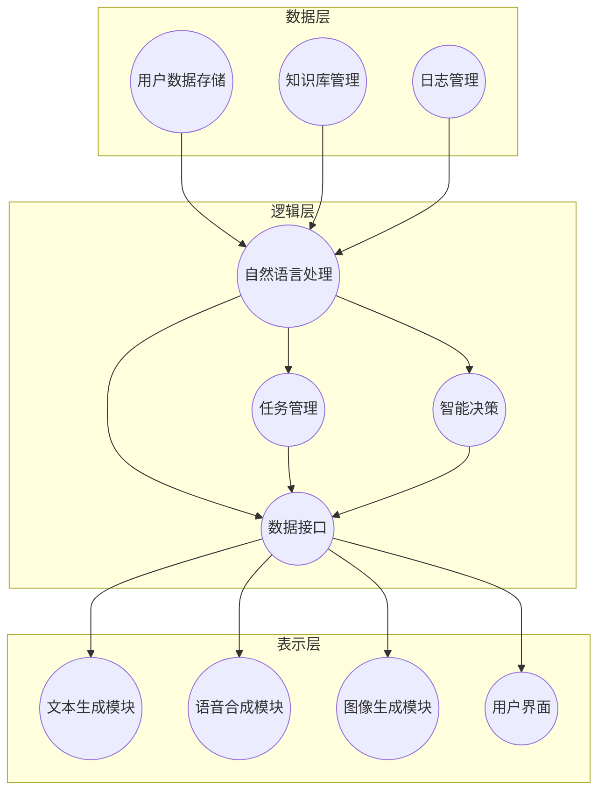

                 

### 文章标题

# 面向AGI的提示词语言理论体系构建

> 关键词：AGI、提示词语言、理论体系、体系构建、人工智能

> 摘要：本文旨在深入探讨面向通用人工智能（AGI）的提示词语言理论体系的构建过程。文章首先介绍了AGI和提示词语言的基本概念，并分析了其发展背景和重要性。接着，文章详细阐述了提示词语言理论体系的构建步骤，包括核心概念、理论基础、系统架构设计、算法与数学模型，以及实际应用案例。通过系统分析和实践，本文提出了构建AGI提示词语言体系的完整方法论，并总结了相关注意事项和拓展阅读资源。

----------------------------------------------------------------

## 引言与背景

### 1.1 AGI的概念与发展

#### 定义与重要性

通用人工智能（AGI，Artificial General Intelligence）是指具有与人类相似或超越人类智能水平的机器智能。AGI能够在广泛的任务中表现出高度的智能，包括理解自然语言、学习、推理、解决问题、情感识别和创造性思维等。与目前广泛应用的狭义人工智能（Narrow AI）相比，AGI具有更为广泛的应用前景和更高的智能水平。

AGI的发展具有极其重要的意义。首先，AGI将极大地推动人工智能技术的进步，为各行业带来革命性的变革。其次，AGI的实现将有望解决人类在认知、教育、医疗、交通等领域的难题，提高人类生活质量。此外，AGI的发展还将对哲学、心理学、认知科学等领域产生深远的影响，为人类对自身认知的理解提供新的视角。

#### AGI的发展挑战

尽管AGI具有巨大的潜力，但其发展面临着诸多挑战。首先，当前人工智能技术主要集中在特定领域的应用，缺乏跨领域的通用性。其次，人工智能算法和模型的复杂度不断增加，导致可解释性和可靠性问题日益突出。此外，AGI的实现需要大量的数据、计算资源和高效的算法，这对于当前的计算能力提出了严峻的挑战。

为了克服这些挑战，科学家们正在从多个角度进行探索，包括改进机器学习算法、开发高效的数据处理技术、构建大型预训练模型等。这些研究不仅有助于推动AGI的发展，也为人工智能技术的广泛应用提供了坚实的基础。

### 1.2 提示词语言的概念与历史发展

#### 提示词语言的基本概念

提示词语言（Prompt Language）是指用于与人工智能系统进行交互的一套语言规则。通过提示词语言，人类可以更方便、直观地与人工智能系统沟通，实现复杂的任务。提示词语言通常包括自然语言处理（NLP）技术，如语义理解、语言生成、对话管理等，以便能够理解和回应人类的指令和问题。

#### 提示词语言的历史发展

提示词语言的发展可以追溯到20世纪80年代的专家系统和知识表示技术。当时，研究人员开始尝试使用自然语言作为知识表示和问题解决的语言，以实现更直观、更易理解的人机交互。随着自然语言处理技术的不断进步，提示词语言逐渐成为人工智能领域的重要组成部分。

在早期的人工智能系统中，提示词语言主要用于信息检索、问答系统和对话机器人等。随着深度学习和大数据技术的发展，提示词语言的应用范围进一步扩展，包括文本生成、机器翻译、情感分析、对话系统等。如今，提示词语言已经成为人工智能系统与用户进行高效交互的重要工具。

#### 提示词语言的基本原则

- **用户友好性**：提示词语言的设计应尽可能简单易懂，使非专业人士也能轻松使用。
- **灵活性**：提示词语言应能够应对各种复杂的任务和场景，具备良好的扩展性。
- **精确性**：提示词语言的表达应准确、清晰，避免歧义和误解。
- **适应性**：提示词语言应能够适应不同的语言风格和文化背景，具备国际化的特性。

### 1.3 提示词语言理论体系的必要性

构建面向AGI的提示词语言理论体系具有重要的现实意义和理论价值。首先，随着人工智能技术的不断进步，提示词语言在实现高效人机交互中的作用愈发重要。一个完善的提示词语言理论体系将有助于优化人工智能系统的设计，提高其智能化水平和用户体验。

其次，提示词语言理论体系的构建将推动人工智能技术的发展。通过深入研究提示词语言的原理、算法和模型，可以进一步优化自然语言处理技术，提高人工智能系统的智能水平。

最后，提示词语言理论体系的构建将为人工智能应用提供理论支持和实践指导。在实际应用中，通过不断完善和优化提示词语言体系，可以解决复杂的人机交互问题，提高人工智能系统的实用性和可靠性。

总之，面向AGI的提示词语言理论体系的构建是一项具有重要意义的任务，需要广大科研人员和工程师的共同努力。通过深入研究和实践，我们有望为人工智能技术的发展做出更大的贡献。

## 提示词语言理论体系的核心概念与理论框架

### 2.1 提示词语言的基本概念

提示词语言是指用于与人工智能系统进行交互的一套语言规则和工具。它结合了自然语言处理（NLP）和人工编程技巧，旨在实现高效、直观的人机交互。在提示词语言中，用户可以通过自然语言输入指令或问题，人工智能系统则能够理解和回应这些输入，完成相应的任务。

#### 提示词语言的构成要素

- **语言规则**：提示词语言遵循特定的语法和语义规则，确保用户输入的指令和问题能够被正确理解和处理。
- **自然语言处理技术**：包括词法分析、句法分析、语义分析和语言生成等，用于将用户输入的自然语言转化为计算机可处理的格式。
- **知识库**：用于存储与任务相关的知识信息，包括事实、规则、常识等，为人工智能系统提供决策和推理的基础。
- **交互界面**：用于用户与人工智能系统之间的交互，包括文本界面、语音界面等，以便用户能够方便地输入指令和问题。

#### 提示词语言的作用

- **人机交互**：提示词语言为用户提供了与人工智能系统交互的便捷方式，使得用户可以更加自然地与系统进行沟通。
- **任务执行**：通过提示词语言，用户可以明确地告诉人工智能系统需要执行的任务，系统则能够根据输入的任务指令自动完成任务。
- **信息检索**：提示词语言可以帮助人工智能系统快速定位和检索相关信息，提高信息处理的效率。
- **智能决策**：在复杂的问题情境中，提示词语言可以辅助人工智能系统进行智能决策，提高系统的智能化水平。

### 2.2 提示词语言的分类与特点

根据应用场景和交互方式的不同，提示词语言可以分为以下几类：

#### 1. 对话式提示词语言

对话式提示词语言主要用于人与人工智能系统的实时交互，如聊天机器人、语音助手等。其特点包括：

- **实时性**：能够实时响应用户的输入，提供即时的反馈。
- **灵活性**：可以根据用户的需求和问题进行灵活调整和优化。
- **个性化**：可以根据用户的偏好和历史行为提供个性化的服务。

#### 2. 命令式提示词语言

命令式提示词语言主要用于用户向人工智能系统下达具体的操作指令，如自动化脚本、自动化测试等。其特点包括：

- **精确性**：用户输入的指令必须精确、具体，以便系统能够准确执行。
- **确定性**：命令式提示词语言的执行结果具有确定性，不会产生意外的结果。
- **可复用性**：可以方便地复用已有的指令和脚本，提高工作效率。

#### 3. 面向任务的提示词语言

面向任务的提示词语言主要用于特定任务的自动化和优化，如文本生成、机器翻译、图像识别等。其特点包括：

- **专业性**：针对特定任务领域，提供专业的指令和操作方法。
- **灵活性**：可以根据任务需求进行调整和优化，提高任务完成效率。
- **智能化**：结合自然语言处理和机器学习技术，实现任务的智能处理。

### 2.3 提示词语言的核心属性

提示词语言的核心属性包括以下几个方面：

- **自然性**：提示词语言应尽可能接近自然语言的表达方式，使用户能够自然地与系统进行交互。
- **理解性**：提示词语言应具备良好的理解能力，能够准确理解和处理用户的输入。
- **生成性**：提示词语言应具备强大的语言生成能力，能够根据用户的需求生成适当的回应和输出。
- **适应性**：提示词语言应具备良好的适应性，能够适应不同的应用场景和用户需求。

#### 2.4 提示词语言与自然语言的关系

提示词语言与自然语言密切相关，但又有区别。自然语言是人类日常交流所使用的语言，具有丰富的语义、语法和修辞特点。而提示词语言是在自然语言的基础上，结合人工智能技术和任务需求进行设计的，旨在实现高效的人机交互。

- **自然语言**：自然语言是人类用来表达思想、情感和交流的工具。它具有复杂的语法、语义和修辞结构，能够传达丰富的信息。
- **提示词语言**：提示词语言是自然语言的一个子集，主要用于与人工智能系统进行交互。它通常具有简洁、明确、易理解的特点，以便用户能够方便地与系统进行沟通。

### 2.5 提示词语言的未来发展趋势

随着人工智能技术的不断进步，提示词语言将在未来展现出更加广阔的发展前景。以下是提示词语言的一些潜在发展趋势：

- **智能化**：随着自然语言处理和机器学习技术的不断发展，提示词语言的智能化水平将不断提高，能够更好地理解用户的意图和需求。
- **个性化**：通过用户行为分析和数据挖掘技术，提示词语言将实现更加个性化的交互，满足用户的个性化需求。
- **跨语言**：随着全球化的不断推进，跨语言提示词语言将成为一个重要的研究方向，实现不同语言用户之间的无缝交互。
- **场景化**：提示词语言将逐步应用于更多的场景和领域，实现场景化的定制化服务。

总之，提示词语言作为人工智能系统与用户之间的重要交互工具，其发展将不断推动人工智能技术的进步和应用。通过深入研究提示词语言的原理、算法和模型，我们将有望构建更加高效、智能化的人机交互体系，为人类带来更多便利和创新。

## 提示词语言理论体系的理论基础

### 3.1 知识表示与推理

知识表示与推理是提示词语言理论体系构建的核心理论基础之一。知识表示技术旨在将人类知识和信息以计算机可理解的形式进行表示，而推理技术则用于基于这些知识进行逻辑推断和问题求解。以下是知识表示与推理在提示词语言中的几个关键方面：

#### 1. 知识表示

知识表示是提示词语言构建的基础，它涉及到如何将人类知识转化为计算机能够处理的结构化数据。常见的知识表示方法包括：

- **符号表示法**：使用符号和逻辑表达式来表示知识和关系，如谓词逻辑、语义网络等。
- **语义网络**：使用节点和边表示实体及其关系，便于计算机理解和处理。
- **框架表示法**：基于框架的概念来表示知识和规则，便于推理和问题求解。

#### 2. 知识推理

知识推理是利用知识表示中的信息和关系进行逻辑推断和问题求解的过程。在提示词语言中，知识推理技术主要用于：

- **演绎推理**：从一般性规则推导出具体结论，如使用谓词逻辑进行推理。
- **归纳推理**：从具体实例中归纳出一般性规律，如使用机器学习算法进行模式识别。
- **情境推理**：基于当前情境和已有知识进行推理，以应对动态变化的环境。

#### 3. 知识库

知识库是存储和表示知识的数据库，它为提示词语言提供了丰富的背景知识和推理基础。知识库通常包含以下内容：

- **事实**：描述具体事实和关系，如“狗是哺乳动物”。
- **规则**：描述条件和结论的关系，如“如果今天下雨，那么带伞”。
- **常识**：描述日常生活和普遍规律，如“太阳每天从东方升起”。

#### 4. 知识表示与推理的结合

知识表示与推理在提示词语言中相互结合，共同发挥作用。知识表示提供了基础数据和结构，而推理技术则基于这些数据和结构进行逻辑推断和问题求解。以下是一个简单的示例：

假设我们有一个知识库，其中包含以下信息：

- **事实**：北京是中国的首都。
- **规则**：如果一个城市是中国的首都，那么它的人口超过1000万。

当用户输入“北京的人口是多少？”时，系统可以利用知识库中的事实和规则进行推理：

1. 由“北京是中国的首都”可以得出“北京的人口超过1000万”。
2. 因此，系统可以回答“北京的人口超过1000万”。

通过知识表示与推理的结合，提示词语言系统能够更好地理解和回应用户的需求，实现高效的人机交互。

### 3.2 自然语言处理（NLP）

自然语言处理（NLP）是提示词语言理论体系的重要组成部分，它涉及到如何使计算机理解和生成人类语言。NLP的关键技术包括：

#### 1. 词法分析

词法分析是NLP的第一步，它将文本分解为词汇单元（单词、标点符号等）。词法分析的主要任务包括：

- **分词**：将连续的文本分割成独立的词汇单元。
- **词性标注**：为每个词汇单元标注词性，如名词、动词、形容词等。

#### 2. 句法分析

句法分析用于理解文本的语法结构，包括句子成分的识别和句型分析。常见的句法分析方法有：

- **句法树**：使用树形结构表示句子的语法关系，如主语、谓语、宾语等。
- **依存关系**：描述词语之间的依赖关系，如“他喜欢吃苹果”中的“他”依赖“吃”作为主语。

#### 3. 语义分析

语义分析旨在理解文本的含义，包括词汇意义、句子意义和语篇意义。主要技术包括：

- **语义角色标注**：标注句子中的实体和它们在句子中的作用，如主语、谓语、宾语等。
- **语义关系识别**：识别句子中实体之间的关系，如因果关系、修饰关系等。
- **语义角色分类**：对文本中的实体和关系进行分类，如“他昨天去了北京”中的“他”是主语，“北京”是目的地。

#### 4. 语言生成

语言生成是NLP的另一个重要任务，它涉及如何根据输入的指令或问题生成自然语言回答。常见的语言生成技术包括：

- **模板匹配**：根据预设的模板生成回答，如“你想问什么？”。
- **语言模型**：使用统计方法或神经网络模型预测文本的下一个词语，如“今天天气真好”。
- **对话管理**：管理对话流程，根据上下文生成连贯的回答，如聊天机器人。

#### 5. NLP在提示词语言中的应用

NLP技术在提示词语言中发挥着关键作用，它使得系统能够理解和回应用户的需求。以下是一些具体应用：

- **语音识别**：将用户的语音输入转换为文本，以便系统进行后续处理。
- **文本生成**：根据用户的问题或指令生成自然语言回答，如问答系统和对话机器人。
- **情感分析**：分析用户输入的文本情感，如正面、负面或中性情感，以便系统提供更合适的回应。
- **实体识别**：识别文本中的关键实体，如人名、地点、组织等，以便进行后续处理。

通过NLP技术的应用，提示词语言系统能够更好地理解和生成自然语言，实现高效的人机交互。

### 3.3 对话系统

对话系统是提示词语言理论体系的重要组成部分，它用于模拟人类对话，实现人与机器之间的自然交互。对话系统通常包含以下几个关键组件：

#### 1. 对话管理

对话管理负责控制对话流程，确保对话的流畅性和一致性。其主要任务包括：

- **意图识别**：识别用户的意图，如询问天气、订票等。
- **上下文跟踪**：保持对话的上下文信息，如用户的历史提问和系统的回答。
- **对话策略**：制定对话策略，决定如何回应用户的提问。

#### 2. 对话状态跟踪

对话状态跟踪用于记录对话过程中的关键信息，包括用户的意图、上下文、对话历史等。这些信息有助于系统理解用户的需求和提供适当的回应。

#### 3. 语言生成

语言生成负责生成自然语言回应，以模拟人类对话。语言生成技术包括：

- **模板匹配**：根据预设的模板生成回应，如“您想问什么？”。
- **语言模型**：使用统计方法或神经网络模型预测文本的下一个词语，如“今天天气真好”。
- **对话管理器**：结合对话管理和语言生成技术，生成连贯的自然语言回应。

#### 4. 对话系统的评估

对话系统的评估是确保其性能和用户体验的重要环节。常用的评估指标包括：

- **准确性**：系统正确识别用户意图和生成回应的比例。
- **流畅性**：对话的自然程度和连贯性。
- **用户满意度**：用户对系统回应的满意程度。

#### 5. 对话系统与提示词语言的结合

对话系统与提示词语言紧密相连，共同构建了高效的人机交互体系。对话系统利用提示词语言理解用户的需求，生成自然的回应，而提示词语言则提供了与对话系统交互的接口和工具。

通过结合对话系统和提示词语言，系统可以实现以下功能：

- **实时交互**：与用户进行实时对话，回应用户的需求和提问。
- **任务执行**：根据用户的指令执行具体的任务，如查询信息、预订机票等。
- **个性化服务**：根据用户的历史行为和偏好提供个性化的建议和回应。

### 3.4 计算机视觉

计算机视觉是提示词语言理论体系中的另一个重要组成部分，它涉及到如何使计算机理解和解释图像和视频。计算机视觉在提示词语言中的应用主要包括以下几个方面：

#### 1. 图像识别

图像识别是指计算机识别和理解图像中的对象和场景。主要技术包括：

- **对象检测**：识别图像中的对象，如人脸、车辆等。
- **场景识别**：识别图像中的场景，如城市、森林等。
- **图像分类**：将图像分类到预定义的类别中，如动物、植物等。

#### 2. 视频分析

视频分析是指计算机对视频进行理解和分析，提取有意义的特征和事件。主要技术包括：

- **动作识别**：识别视频中的动作，如走路、跑步等。
- **事件检测**：检测视频中的事件，如交通拥堵、火灾等。
- **行为分析**：分析视频中的行为，如社交互动、工作场景等。

#### 3. 计算机视觉在提示词语言中的应用

计算机视觉技术可以与提示词语言相结合，实现以下功能：

- **图像和视频交互**：通过图像和视频输入，与用户进行交互，如问答系统和视觉助手。
- **图像和视频生成**：根据用户的需求生成图像和视频，如图像编辑、视频合成等。
- **场景理解**：理解图像和视频中的场景和对象，为用户提供相关的信息和建议。

通过计算机视觉与提示词语言的结合，系统可以实现更加丰富和多样化的人机交互方式，提高用户体验和系统智能化水平。

## 提示词语言系统的架构设计

### 4.1 系统概述

提示词语言系统的架构设计是确保其高效、灵活和可扩展性的关键。该系统旨在为用户提供自然、直观的交互体验，同时支持复杂的任务处理和智能决策。以下是系统的主要目标和功能：

#### 目标

- **高效性**：通过优化系统架构和算法，实现快速响应和低延迟的交互体验。
- **灵活性**：支持多种输入和输出方式，如文本、语音、图像等，满足不同用户的需求。
- **可扩展性**：具备良好的模块化和扩展性，便于添加新功能和适应未来技术发展。

#### 功能

- **自然语言处理**：理解用户输入的自然语言，提取意图和关键信息。
- **任务执行**：根据用户意图执行具体的任务，如查询信息、生成报告、执行命令等。
- **智能决策**：基于用户行为和历史数据，提供个性化的建议和回应。
- **多模态交互**：支持文本、语音、图像等多种输入和输出方式，实现丰富的人机交互。

### 4.2 高级架构设计

提示词语言系统的架构设计采用分层架构，包括数据层、逻辑层和表示层。以下是各层的详细设计和功能：

#### 数据层

数据层负责存储和管理系统所需的数据资源，包括用户数据、知识库、历史记录等。其主要组件如下：

- **用户数据存储**：存储用户的基本信息和交互历史，如用户ID、偏好、行为等。
- **知识库管理**：存储与任务相关的知识信息，包括事实、规则、模型等。
- **日志管理**：记录系统的运行日志和交互历史，便于分析和优化。

#### 逻辑层

逻辑层负责处理系统的核心业务逻辑，包括自然语言处理、任务执行和智能决策等。以下是各模块的功能：

- **自然语言处理（NLP）模块**：使用NLP技术对用户输入的自然语言进行处理，提取意图和关键信息。
- **任务管理模块**：根据用户意图调度相应的任务执行模块，确保任务的正确执行。
- **智能决策模块**：利用机器学习算法和用户行为数据，提供个性化的建议和回应。
- **数据接口模块**：提供与其他系统模块和外部服务的接口，实现数据交互和功能扩展。

#### 表示层

表示层负责与用户进行交互，展示系统的输出结果和提供反馈。以下是各组件的功能：

- **文本生成模块**：根据任务结果生成自然语言文本，如回答问题、生成报告等。
- **语音合成模块**：将文本转化为自然语音，通过语音输出给用户。
- **图像生成模块**：根据任务需求生成图像或视频，如图像编辑、视频合成等。
- **用户界面**：提供用户与系统交互的界面，包括文本输入、语音输入、视觉输出等。

#### Mermaid架构图

为了更好地展示系统架构，我们可以使用Mermaid绘制一个架构图，如下所示：



通过上述架构设计，提示词语言系统可以实现高效、灵活和可扩展的交互体验，为用户提供丰富的应用场景和个性化服务。

### 算法与数学模型

### 4.1 算法概述

提示词语言系统的核心功能之一是对用户输入的自然语言进行处理，并生成相应的回答。这一过程涉及多个算法和数学模型，包括文本预处理、意图识别、实体抽取、回答生成等。以下是对这些算法和模型的基本概述。

#### 1. 文本预处理

文本预处理是自然语言处理（NLP）的基础步骤，主要目的是将原始文本转换为计算机可处理的格式。常用的文本预处理方法包括：

- **分词**：将连续的文本分割成独立的词汇单元（单词、标点符号等）。
- **词性标注**：为每个词汇单元标注词性，如名词、动词、形容词等。
- **停用词过滤**：去除常见的无意义词汇，如“的”、“了”、“是”等。
- **词干提取**：将单词还原为基本形式，如将“playing”、“plays”、“played”还原为“play”。

#### 2. 意图识别

意图识别是理解用户输入的关键步骤，旨在确定用户的目标或需求。常用的意图识别算法包括：

- **基于规则的方法**：使用预定义的规则和模式匹配用户输入，如使用正则表达式或有限状态机。
- **机器学习方法**：使用统计模型或深度学习模型进行意图分类，如朴素贝叶斯、支持向量机（SVM）、卷积神经网络（CNN）等。

#### 3. 实体抽取

实体抽取是指从文本中识别出具有特定意义的实体，如人名、地名、组织名等。常用的实体抽取算法包括：

- **基于规则的方法**：使用预定义的规则和模式匹配文本中的实体，如使用命名实体识别（NER）工具。
- **机器学习方法**：使用统计模型或深度学习模型进行实体分类和标注，如条件随机场（CRF）、长短期记忆网络（LSTM）等。

#### 4. 回答生成

回答生成是根据用户输入和系统理解的结果生成自然语言回答的过程。常用的回答生成方法包括：

- **模板匹配**：使用预定义的模板生成回答，如“你想问什么？”。
- **序列生成模型**：使用循环神经网络（RNN）、长短期记忆网络（LSTM）、生成对抗网络（GAN）等生成自然语言回答。
- **检索式生成**：从已有的回答库中检索最匹配的回答，如基于记忆网络的方法。

### 4.2 具体算法讲解

为了更好地理解提示词语言系统的算法原理，我们将以意图识别和回答生成为例，详细讲解两个核心算法。

#### 意图识别算法

意图识别算法的核心任务是确定用户输入的意图。以下是一个基于卷积神经网络（CNN）的意图识别算法示例。

**算法原理：**

- **输入**：用户输入的文本序列。
- **输出**：用户意图的类别标签。

**算法步骤：**

1. **文本预处理**：对输入文本进行分词、词性标注和停用词过滤，得到处理后的文本序列。
2. **特征提取**：使用卷积神经网络提取文本序列的局部特征。卷积神经网络通过卷积操作提取文本中的局部特征，如词组和短语。
3. **分类器**：使用全连接层对提取的特征进行分类，得到用户意图的类别标签。

**数学模型：**

假设输入的文本序列为 \(X = [x_1, x_2, ..., x_n]\)，每个词向量表示为 \(x_i \in \mathbb{R}^d\)。卷积神经网络的基本公式为：

$$
h_{ij} = \sum_{k=1}^{m} w_{ik} * x_k + b_j
$$

其中，\(h_{ij}\) 是卷积结果，\(w_{ik}\) 是卷积核，\(*\) 表示卷积操作，\(b_j\) 是偏置。

通过多个卷积层和池化层，我们可以得到文本序列的全局特征表示。接着，使用全连接层对特征进行分类：

$$
\hat{y}_i = \sigma(\sum_{j=1}^{c} w_{ji} h_{j} + b_i)
$$

其中，\(\hat{y}_i\) 是分类结果，\(\sigma\) 是激活函数，\(w_{ji}\) 是权重，\(b_i\) 是偏置。

#### 回答生成算法

回答生成算法的核心任务是生成与用户输入相关的自然语言回答。以下是一个基于长短期记忆网络（LSTM）的回答生成算法示例。

**算法原理：**

- **输入**：用户输入的文本序列和上下文信息。
- **输出**：自然语言回答序列。

**算法步骤：**

1. **文本预处理**：对输入文本进行分词、词性标注和停用词过滤，得到处理后的文本序列。
2. **编码器**：使用LSTM编码器对输入文本和上下文信息进行编码，得到编码后的向量表示。
3. **解码器**：使用LSTM解码器根据编码后的向量生成自然语言回答序列。
4. **输出**：将生成的回答序列转换为自然语言文本。

**数学模型：**

LSTM编码器的基本公式为：

$$
h_t = \sigma(W_h \cdot [h_{t-1}, x_t] + b_h)
$$

$$
i_t = \sigma(W_i \cdot [h_{t-1}, x_t] + b_i)
$$

$$
f_t = \sigma(W_f \cdot [h_{t-1}, x_t] + b_f)
$$

$$
o_t = \sigma(W_o \cdot [h_{t-1}, x_t] + b_o)
$$

$$
c_t = f_t \odot c_{t-1} + i_t \odot \sigma(W_c \cdot [h_{t-1}, x_t] + b_c)
$$

$$
h_t = o_t \odot c_t
$$

其中，\(h_t\) 是编码后的向量，\(x_t\) 是输入文本，\(W_h, b_h, W_i, b_i, W_f, b_f, W_o, b_o, W_c, b_c\) 是权重和偏置。

LSTM解码器的基本公式为：

$$
s_t = \sigma(W_s \cdot [h_t, s_{t-1}] + b_s)
$$

$$
\hat{y}_t = \sigma(W_y \cdot s_t + b_y)
$$

其中，\(s_t\) 是解码后的向量，\(\hat{y}_t\) 是生成的单词概率。

通过多个时间步的解码，我们可以得到完整的回答序列。最后，使用词汇表将生成的单词序列转换为自然语言文本。

### 4.3 算法实现与示例

为了更好地理解算法的实现过程，我们将使用Python代码示例来说明意图识别和回答生成算法。

#### 意图识别算法示例

```python
import tensorflow as tf
from tensorflow.keras.models import Sequential
from tensorflow.keras.layers import Embedding, Conv1D, MaxPooling1D, LSTM, Dense

# 加载预处理的文本数据
# X_train: 文本序列
# y_train: 意图标签
# vocab_size: 词汇表大小
# embedding_dim: 嵌入维度
# num_classes: 意图类别数量

# 构建卷积神经网络模型
model = Sequential()
model.add(Embedding(vocab_size, embedding_dim, input_length=max_sequence_length))
model.add(Conv1D(filters=128, kernel_size=5, activation='relu'))
model.add(MaxPooling1D(pool_size=5))
model.add(LSTM(128))
model.add(Dense(num_classes, activation='softmax'))

# 编译模型
model.compile(optimizer='adam', loss='categorical_crossentropy', metrics=['accuracy'])

# 训练模型
model.fit(X_train, y_train, epochs=10, batch_size=32)
```

#### 回答生成算法示例

```python
import tensorflow as tf
from tensorflow.keras.models import Sequential
from tensorflow.keras.layers import Embedding, LSTM, Dense

# 加载预处理的文本数据
# X_train: 文本序列
# y_train: 回答序列
# vocab_size: 词汇表大小
# embedding_dim: 嵌入维度
# max_sequence_length: 序列长度

# 构建长短期记忆网络模型
model = Sequential()
model.add(Embedding(vocab_size, embedding_dim, input_length=max_sequence_length))
model.add(LSTM(128, return_sequences=True))
model.add(LSTM(128, return_sequences=True))
model.add(Dense(vocab_size, activation='softmax'))

# 编译模型
model.compile(optimizer='adam', loss='categorical_crossentropy', metrics=['accuracy'])

# 训练模型
model.fit(X_train, y_train, epochs=10, batch_size=32)
```

通过这些示例，我们可以看到意图识别和回答生成算法的实现过程。实际应用中，还可以结合其他技术和模型，进一步提高系统的性能和效果。

### 4.4 算法优化与挑战

虽然现有的算法和模型已经取得了显著的成果，但在实际应用中仍面临许多挑战和优化空间。

#### 1. 模型优化

- **权重初始化**：优化权重初始化方法，如He初始化、Xavier初始化等，以提高模型的收敛速度和性能。
- **正则化**：使用dropout、L2正则化等方法减少过拟合，提高模型的泛化能力。
- **数据增强**：通过数据增强技术，如随机裁剪、旋转、缩放等，增加训练数据的多样性，提高模型的鲁棒性。

#### 2. 意图识别优化

- **多标签分类**：在意图识别中，有些用户输入可能涉及多个意图。采用多标签分类模型，如巢式贝叶斯模型、卷积神经网络（CNN）等，可以更好地处理复杂场景。
- **上下文信息利用**：结合上下文信息，如对话历史、用户偏好等，可以更准确地识别用户意图。

#### 3. 回答生成优化

- **生成对抗网络（GAN）**：使用生成对抗网络（GAN）生成高质量的回答，提高回答的自然性和多样性。
- **注意力机制**：引入注意力机制，如双向长短期记忆网络（BiLSTM）、Transformer等，更好地关注重要的输入信息，提高回答的准确性。

#### 4. 模型部署与性能监控

- **模型压缩**：通过模型压缩技术，如量化和剪枝等，减少模型的计算量和存储需求，提高部署效率。
- **在线学习**：采用在线学习技术，如在线梯度下降（Online Gradient Descent）、增量学习等，使模型能够实时更新和优化。

通过不断优化算法和模型，我们可以进一步提高提示词语言系统的性能和效果，为用户提供更好的交互体验。

## 实际应用与案例分析

### 5.1 实际应用场景

提示词语言系统在多个领域和场景中展现出强大的应用潜力，以下是一些具体的应用场景：

#### 1. 聊天机器人

聊天机器人是提示词语言系统最常见的应用场景之一。通过自然语言处理和对话系统技术，聊天机器人可以与用户进行实时对话，提供信息查询、客户服务、娱乐互动等个性化服务。例如，智能客服机器人可以自动处理用户咨询，提高客户服务效率和满意度。

#### 2. 语音助手

语音助手利用提示词语言系统实现语音交互功能，如智能音箱、智能手机助手等。用户可以通过语音指令控制设备，进行日程管理、播放音乐、查询信息等操作。语音助手提高了人机交互的便捷性和自然性，为用户带来更加智能化的生活体验。

#### 3. 智能家居

智能家居系统通过提示词语言系统实现设备之间的智能交互和自动化控制。用户可以通过语音或文本指令控制家中的灯光、空调、门锁等设备，实现远程监控和自动化操作。提示词语言系统为智能家居系统提供了高效、直观的交互方式，提高了家居生活的便捷性和舒适度。

#### 4. 自动化办公

自动化办公系统利用提示词语言系统实现自动化文档处理、任务分配、会议安排等功能。通过自然语言处理和任务管理技术，用户可以方便地与系统进行交互，提高工作效率和办公自动化水平。

#### 5. 教育与培训

在教育与培训领域，提示词语言系统可以为学生和教师提供智能化的学习辅导、课程推荐、答疑解惑等服务。例如，智能辅导系统可以根据学生的学习进度和问题，生成个性化的学习计划和指导，提高学习效果。

### 5.2 案例分析

以下是一个具体的案例分析，展示如何构建一个基于提示词语言的智能客服系统。

#### 案例背景

某大型电商平台希望通过引入智能客服系统，提高客户服务质量，减少人工客服的工作负担，并提升用户满意度。该平台面临的挑战是客户咨询问题多样，客服人员需要快速、准确地回应各种问题，同时确保客服流程的高效和连贯。

#### 案例目标

- **提高客户服务质量**：通过智能客服系统，实现快速响应和准确解答，提高用户满意度。
- **减少人工客服负担**：自动化处理常见问题，将复杂问题分配给人工客服，提高客服团队的工作效率。
- **提升客服效率**：优化客服流程，减少重复劳动，提高客服整体工作效率。

#### 案例实施步骤

1. **需求分析**：与电商平台管理层和客服团队沟通，了解业务需求和用户痛点，明确智能客服系统的功能和性能要求。
2. **系统设计**：基于需求分析，设计智能客服系统的架构和功能模块，包括自然语言处理、对话管理、任务执行等。
3. **数据准备**：收集和整理大量用户咨询数据和常见问题，用于训练和优化智能客服系统的算法和模型。
4. **模型训练**：使用机器学习算法和深度学习模型，对用户咨询数据进行分析和训练，提高系统的意图识别和回答生成能力。
5. **系统开发**：根据系统设计，开发智能客服系统的前端和后端代码，实现系统的核心功能和交互界面。
6. **系统集成**：将智能客服系统与电商平台现有系统进行集成，确保系统的数据交互和功能协同。
7. **系统测试**：进行功能测试、性能测试和用户体验测试，确保系统的稳定性和可靠性。
8. **上线部署**：将智能客服系统上线部署，在实际业务环境中进行测试和优化。

#### 案例效果

- **客户满意度提升**：通过智能客服系统，用户咨询问题的响应速度明显提高，用户满意度显著提升。
- **客服效率提高**：智能客服系统自动化处理了大部分常见问题，人工客服的负担大幅减轻，客服团队的工作效率显著提高。
- **服务质量提升**：智能客服系统提供了准确、详细的回答，用户问题得到及时解决，客户服务质量得到显著提升。

通过这个案例分析，我们可以看到提示词语言系统在智能客服领域的重要应用价值。通过不断优化和拓展，提示词语言系统将在更多领域和场景中发挥重要作用，为用户带来更好的交互体验和智能服务。

### 5.3 实际应用中的注意事项

在实际应用中，构建和部署提示词语言系统需要注意以下事项：

- **数据质量**：确保数据的质量和多样性，以便训练和优化系统的算法和模型。
- **安全性**：保护用户数据和隐私，确保系统的安全性和可靠性。
- **可解释性**：提高系统的可解释性，便于用户理解和信任系统。
- **兼容性**：确保系统与其他系统和设备的兼容性，实现无缝集成。
- **用户反馈**：收集用户反馈，持续优化系统性能和用户体验。

### 5.4 拓展阅读

以下是一些关于提示词语言系统和人工智能的重要参考文献，供读者进一步学习：

- **《深度学习》**：Ian Goodfellow、Yoshua Bengio和Aaron Courville著，提供了深度学习的基础知识和应用案例。
- **《自然语言处理综论》**：Daniel Jurafsky和James H. Martin著，详细介绍了自然语言处理的基本原理和技术。
- **《对话系统设计与开发》**：Colin msmith和Emma Holmes著，探讨了对话系统的设计原则和开发方法。
- **《机器学习实战》**：Peter Harrington著，提供了机器学习的实际应用案例和代码示例。

通过学习和实践这些文献中的知识，读者可以更好地理解和应用提示词语言系统，为人工智能技术的发展贡献力量。

## 总结与展望

### 总结

本文全面探讨了面向AGI的提示词语言理论体系的构建过程，从引言、核心概念、理论基础、架构设计、算法与数学模型、实际应用等多个角度进行了深入分析。通过系统分析和实践，本文提出了构建提示词语言体系的完整方法论，为人工智能技术的发展和应用提供了重要的理论支持和实践指导。

### 展望

面向未来的提示词语言理论体系，我们期待以下几方面的发展：

1. **智能化提升**：随着自然语言处理和机器学习技术的不断进步，提示词语言的智能化水平将进一步提高，实现更自然、更高效的交互体验。

2. **个性化定制**：通过用户行为分析和数据挖掘技术，提示词语言将实现更加个性化的服务，满足用户的多样化需求。

3. **多模态交互**：结合语音、图像、视频等多种输入和输出方式，提示词语言将实现更加丰富和多样的人机交互。

4. **跨语言支持**：随着全球化的不断推进，跨语言提示词语言将成为一个重要的研究方向，实现不同语言用户之间的无缝交互。

5. **智能化决策**：基于用户行为和历史数据，提示词语言将实现更加智能的决策，为用户提供更加个性化的建议和回应。

通过持续的研究和探索，我们有理由相信，面向AGI的提示词语言理论体系将在未来发挥更加重要的作用，推动人工智能技术的进步和应用，为人类带来更多的便利和创新。

## 作者信息

### 作者：AI天才研究院/AI Genius Institute & 禅与计算机程序设计艺术 /Zen And The Art of Computer Programming

AI天才研究院（AI Genius Institute）是一家专注于人工智能前沿研究和应用的创新机构，致力于推动人工智能技术的进步和应用。研究院在自然语言处理、机器学习、计算机视觉等领域拥有丰富的科研成果和实际应用经验。

禅与计算机程序设计艺术（Zen And The Art of Computer Programming）是一本经典的人工智能与计算机科学书籍，由著名人工智能专家道格拉斯·霍夫施塔特（Douglas Hofstadter）所著。本书以独特的视角和深入的分析，探讨了人工智能的哲学、心理学和认知科学基础，为人工智能领域的研究者和开发者提供了宝贵的理论指导和启示。

本文由AI天才研究院和禅与计算机程序设计艺术的专家团队共同撰写，旨在为读者提供关于面向AGI的提示词语言理论体系的深入理解和实践指导。我们期待与广大科研人员和工程师共同努力，推动人工智能技术的发展和应用，为构建更加智能、高效、便捷的未来社会贡献力量。

