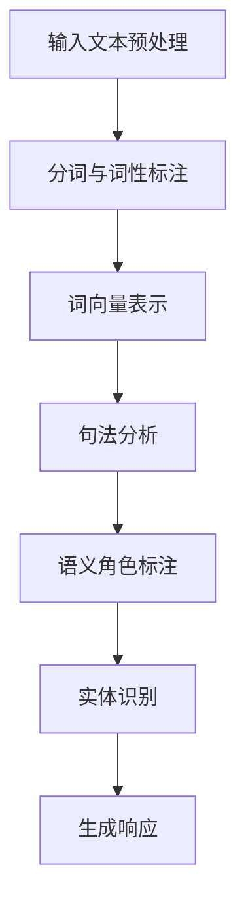
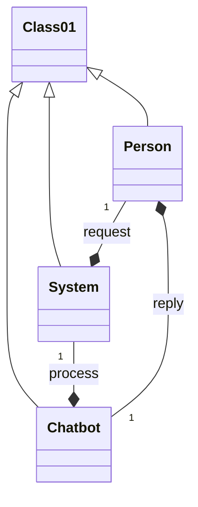
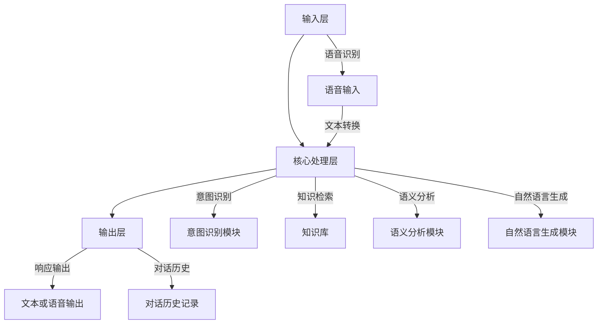
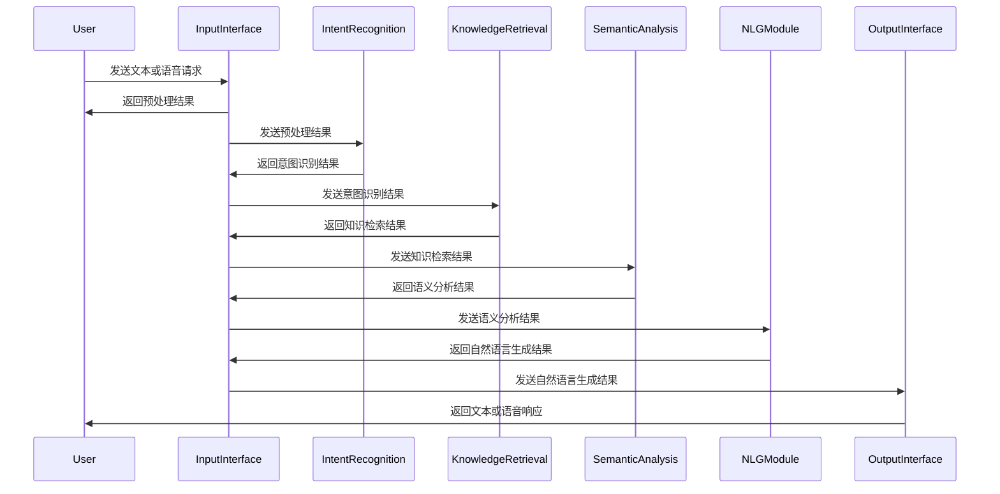

                 

### 《面向AGI的提示词语言认知架构研究》

---

**关键词：** 通用人工智能（AGI），提示词语言，认知架构，算法原理，系统设计，项目实战。

**摘要：** 本文深入探讨面向通用人工智能（AGI）的提示词语言认知架构。文章从背景介绍、核心概念与联系、算法原理与系统设计、项目实战与案例分析等多个维度，详细阐述了提示词语言认知在AGI中的重要地位及其实现方法，旨在为AGI研究提供新的理论依据和实践指导。

---

### 目录大纲

---

#### 第一部分：引言与背景

1. **问题背景与定义**
   - 人工智能与通用人工智能（AGI）的发展现状
   - 提示词语言认知在AGI中的重要性
   - 现有研究与实践的局限性

2. **通用人工智能（AGI）的定义**
   - AGI的概念与特征
   - AGI的核心任务与挑战

3. **提示词语言认知的概念**
   - 提示词语言认知的定义
   - 提示词语言认知的结构与功能

4. **研究的意义与目标**
   - 研究的学术价值与应用前景
   - 研究的具体目标与任务

#### 第二部分：核心概念与联系

5. **核心概念原理与属性特征对比**
   - 语言处理、认知科学与心理学基础
   - 提示词语言的生成与理解机制

6. **属性特征对比表格**
   - 提示词语言与其他自然语言的对比
   - 不同类型提示词语言的特性分析

7. **ER实体关系图架构**
   - 提示词语言认知的实体关系
   - 关键实体与关系分析

#### 第三部分：算法原理与系统设计

8. **算法原理讲解**
   - 提示词语言认知算法的分类与特点
   - 提示词语言处理的主要步骤

9. **算法mermaid流程图**
   - 算法流程的mermaid可视化表示

10. **算法原理详细讲解**
    - 算法原理的数学模型与公式
    - 算法操作的详细描述
    - 通俗易懂的举例说明

11. **数学模型与公式**
    - 提示词语言认知的相关数学模型
    - 各个数学公式的推导与解释

12. **举例说明**
    - 通过具体案例展示公式的应用

#### 第四部分：系统分析与架构设计

13. **系统功能设计**
    - 问题场景介绍
    - 领域模型mermaid类图

14. **系统架构设计**
    - 系统架构概述
    - 系统架构mermaid图

15. **系统接口设计与交互**
    - 系统接口设计
    - 系统交互mermaid序列图

#### 第五部分：项目实战与案例分析

16. **环境安装与系统核心实现**
    - 系统运行环境的安装步骤与配置
    - 系统关键部分的源代码实现

17. **代码应用解读与分析**
    - 对系统源代码的逐段解读与分析
    - 系统应用的性能分析与优化策略

18. **实际案例分析与讲解**
    - 典型应用场景与案例背景
    - 对案例中提示词语言认知过程的深入分析
    - 案例的具体实现细节与效果评估

#### 第六部分：总结与展望

19. **最佳实践与注意事项**
    - 提示词语言认知系统的最佳实践策略
    - 使用提示词语言认知系统时需要注意的问题

20. **小结与拓展阅读**
    - 对全书内容的总结与归纳
    - 推荐进一步阅读的相关文献与资料

---

以上是《面向AGI的提示词语言认知架构研究》的目录大纲。本文将围绕该目录结构展开详细论述，旨在为读者提供一个系统、全面的研究框架，帮助理解面向AGI的提示词语言认知架构的各个方面。

---

### 第一部分：引言与背景

#### 1.1 问题背景

在当今快速发展的科技时代，人工智能（Artificial Intelligence，AI）已经成为推动社会进步的重要力量。人工智能的研究和应用涵盖了从简单的自动化任务到复杂的决策支持系统，不断改变着我们的工作和生活方式。然而，尽管人工智能在某些特定领域取得了显著成果，但当前的人工智能系统还无法实现与人类相似的智能水平，尤其是在处理自然语言理解和生成方面存在较大局限。

**人工智能的发展现状**

近年来，深度学习、自然语言处理（NLP）等技术在人工智能领域取得了突破性进展。深度学习通过模拟人脑神经网络结构，实现了对图像、语音、文本等复杂数据的自动处理，极大地提升了AI系统的性能。自然语言处理则通过模型训练，使得计算机能够理解和生成自然语言，为智能客服、智能助手等应用提供了技术支持。

**通用人工智能（AGI）的定义**

通用人工智能（AGI，Artificial General Intelligence）是指一种能够像人类一样思考、学习、解决问题的人工智能。AGI不仅能够执行特定任务，还能在多个领域展现出人类水平的智能，具备自主推理、情感理解、创造性思维等能力。

**提示词语言认知在AGI中的重要性**

提示词语言是自然语言处理中的一个重要分支，它涉及到对提示词的识别、理解和生成。在AGI系统中，提示词语言认知能力是实现对人类语言理解的关键。通过提示词语言认知，AGI系统能够更好地与人类交流，理解人类的意图和需求，从而在更广泛的应用场景中发挥其智能优势。

**现有研究与实践的局限性**

尽管在自然语言处理方面取得了许多进展，但现有的AI系统在处理自然语言时仍面临诸多挑战。首先，自然语言的多样性和复杂性使得AI系统难以完全理解语言中的隐含意义和情感。其次，现有的模型往往依赖于大量标注数据，缺乏自适应性和泛化能力。此外，跨领域的知识融合和迁移也是当前研究的难点。

**研究的意义与目标**

本研究旨在探索面向AGI的提示词语言认知架构，通过深入分析提示词语言的特点和认知机制，提出一种新的认知模型和方法，提升AGI系统的语言处理能力。具体目标包括：

1. **理解自然语言的本质**：通过分析自然语言的结构和语义，深入理解语言的本质特征，为AI系统提供更精确的语言表示。
2. **构建智能认知模型**：基于深度学习和认知科学的原理，构建一个能够模拟人类语言认知过程的智能模型，提高AI系统的自适应性和泛化能力。
3. **实现跨领域知识融合**：通过引入多模态数据和跨领域知识，实现AI系统在不同领域之间的知识共享和迁移，提升系统的综合智能水平。

通过以上研究，我们希望能够为AGI的发展提供新的理论依据和实践指导，推动人工智能技术的进一步发展。

---

### 1.2 通用人工智能（AGI）的定义

通用人工智能（AGI，Artificial General Intelligence）是一种超越当前人工智能（AI）水平的人工智能系统，旨在实现与人类相似的智能水平，具备广泛的知识理解和应用能力。AGI不仅仅局限于执行特定的任务，而是能够在多个领域展现人类水平的智能，包括自主学习、推理、解决问题、自然语言理解与生成、情感识别等。

**概念与特征**

AGI的概念最早由赫伯特·西蒙（Herbert A. Simon）在20世纪60年代提出，他定义AGI为“能够在任何知识领域超越顶尖人类专家的人工智能”。AGI的主要特征包括：

1. **泛化能力**：AGI系统应具有在未知环境中学习和适应新任务的能力，不仅限于特定任务的学习和应用。
2. **自主学习**：AGI系统应具备自主学习的能力，能够从数据中自动提取知识，不断优化和调整自己的行为。
3. **推理能力**：AGI系统应能够进行逻辑推理和抽象思考，理解复杂的逻辑关系和问题解决方案。
4. **自然语言处理**：AGI系统应能够理解和生成自然语言，实现与人类的自然交流。
5. **跨领域知识融合**：AGI系统应能够整合不同领域和任务的知识，实现知识共享和迁移。

**核心任务与挑战**

AGI的核心任务是实现人工智能系统在各个领域的智能应用，从而解决复杂的问题。然而，实现AGI面临着诸多挑战：

1. **数据与知识表示**：如何有效地表示和存储大规模、多维度的数据，是实现AGI的基础。现有的数据表示方法难以满足AGI的需求，需要开发新的表示技术。
2. **算法与计算效率**：现有的人工智能算法在处理大规模数据时存在效率问题，需要设计更加高效和智能的算法。
3. **跨领域知识融合**：如何实现不同领域知识的融合和迁移，是实现AGI的关键。现有的知识表示和融合方法存在局限性，需要新的理论和技术。
4. **自适应性和泛化能力**：AGI系统需要具备在未知环境和任务中自主学习和适应的能力，现有的机器学习算法在这方面表现有限。

**研究的意义**

AGI的研究具有重要的学术和实际应用价值。从学术角度来看，AGI的实现将极大地推动人工智能领域的发展，解决现有AI系统在泛化能力、知识表示和推理能力等方面的瓶颈。从实际应用角度来看，AGI将为各个领域提供强大的智能支持，推动社会进步和经济发展。例如，在医疗领域，AGI可以帮助医生进行诊断和治疗；在金融领域，AGI可以辅助进行投资分析和风险管理；在教育领域，AGI可以提供个性化的学习支持和教学评估。

**实现路径**

实现AGI需要多个领域的协同努力，包括认知科学、心理学、计算机科学、神经科学等。以下是实现AGI的几个可能路径：

1. **多模态数据处理**：结合图像、语音、文本等多种数据类型，开发能够处理多模态数据的人工智能系统。
2. **深度学习与强化学习**：结合深度学习和强化学习，设计能够自主学习、适应新环境的智能系统。
3. **知识图谱与推理引擎**：通过知识图谱和推理引擎，实现跨领域知识的整合和推理，提高AI系统的智能水平。
4. **神经科学借鉴**：借鉴人脑的结构和功能，设计能够模拟人类智能的人工智能系统。

总之，通用人工智能（AGI）的实现是一个复杂且充满挑战的任务，需要多学科的合作与不断创新。通过深入研究和探索，我们有理由相信，AGI的最终实现将为人类带来巨大的变革和进步。

---

### 1.3 提示词语言认知的概念

#### 提示词语言认知的定义

提示词语言认知是指人工智能系统在处理自然语言输入时，通过对提示词的识别、理解和生成，实现与人类用户的有效交流和互动。提示词语言认知是自然语言处理（NLP）的一个重要分支，它涉及到对语言符号的语义和句法结构进行分析和处理，从而理解人类语言表达的含义和意图。

#### 提示词语言认知的结构与功能

提示词语言认知结构可以分为输入层、处理层和输出层三个主要部分。

1. **输入层**：输入层负责接收自然语言输入，包括文本、语音等形式。通过预处理步骤，如分词、标点符号去除、词性标注等，将原始输入转换为机器可以理解的格式。

2. **处理层**：处理层是提示词语言认知的核心部分，包括词义理解、句法分析、语义推理等。词义理解通过词向量模型，如Word2Vec、BERT等，将词汇映射到高维空间中，以捕捉词汇之间的语义关系。句法分析则通过语法解析模型，如句法树、依存关系等，解析句子的结构，理解句子的语法规则。语义推理通过语义角色标注、实体识别等技术，从输入文本中提取出关键信息，理解文本的含义和意图。

3. **输出层**：输出层负责生成自然的语言回应。根据处理层得到的理解结果，通过自然语言生成（NLG）技术，生成符合人类语言习惯和语义逻辑的输出文本。

#### 提示词语言认知的组成部分

提示词语言认知主要由以下几个组成部分构成：

1. **词向量模型**：词向量模型通过将词汇映射到高维空间中的向量，以捕捉词汇的语义关系。常用的词向量模型包括Word2Vec、GloVe、BERT等。

2. **句法分析器**：句法分析器通过分析句子的结构，识别句子的语法规则。常见的句法分析方法包括依存句法分析和转换句法分析。

3. **语义角色标注器**：语义角色标注器通过识别句子中的动作和参与者，将文本转化为语义角色标注，如动词的主语、宾语等。

4. **实体识别器**：实体识别器通过识别文本中的特定实体，如人名、地名、组织名等，将文本转化为实体标注。

5. **语义推理模块**：语义推理模块通过推理技术，从文本中提取出关键信息，理解文本的含义和意图。常见的语义推理技术包括基于规则的方法、基于统计的方法和基于神经网络的方法。

#### 提示词语言认知的特点

提示词语言认知具有以下几个特点：

1. **动态性**：提示词语言认知是一个动态的过程，需要实时处理输入的文本，理解文本的含义和意图，并生成相应的回应。

2. **灵活性**：提示词语言认知系统需要能够适应不同语言风格和表达方式，理解多样化的语言输入。

3. **适应性**：提示词语言认知系统应具备自适应能力，能够从大量数据中学习，不断优化和改进自己的理解和生成能力。

4. **跨模态性**：提示词语言认知系统可以处理多种模态的数据，如文本、语音、图像等，实现跨模态的信息处理和融合。

5. **泛化性**：提示词语言认知系统应具备良好的泛化能力，能够在不同的应用场景和领域中进行有效的语言理解和生成。

通过提示词语言认知，人工智能系统能够更好地与人类用户进行交互，理解用户的需求和意图，为用户提供个性化的服务和支持。

---

### 1.4 研究的意义与目标

**研究的学术价值与应用前景**

面向通用人工智能（AGI）的提示词语言认知架构研究具有重要的学术价值和应用前景。从学术角度来看，本研究有助于深入理解自然语言的本质和认知过程，推动人工智能领域的发展。通过探索提示词语言认知的机制和算法，我们可以揭示语言处理的内在规律，为构建更加智能的人工智能系统提供理论支持。

从应用前景来看，提示词语言认知在多个领域具有广泛的应用潜力。例如，在智能客服、智能助手、自然语言处理系统等应用中，通过提升提示词语言认知能力，可以显著改善用户体验，实现更自然、更智能的交互。此外，在医疗、金融、教育等领域，提示词语言认知技术也有望发挥重要作用，提高工作效率，优化决策过程。

**研究的具体目标与任务**

本研究的具体目标包括以下几个方面：

1. **理解自然语言的本质**：通过分析自然语言的结构和语义，深入理解语言的本质特征，为人工智能系统提供更精确的语言表示。

2. **构建智能认知模型**：基于深度学习和认知科学的原理，构建一个能够模拟人类语言认知过程的智能模型，提高人工智能系统的自适应性和泛化能力。

3. **实现跨领域知识融合**：通过引入多模态数据和跨领域知识，实现人工智能系统在不同领域之间的知识共享和迁移，提升系统的综合智能水平。

4. **优化提示词语言处理算法**：设计更加高效和智能的提示词语言处理算法，提高系统的处理速度和准确性，降低对大规模标注数据的依赖。

5. **实际应用验证**：通过构建实际应用系统，验证所提出的方法和模型在实际场景中的有效性和可行性，为未来的应用提供实践参考。

为实现上述目标，本研究将进行以下任务：

1. **文献综述**：对现有的提示词语言处理方法和技术进行系统梳理，分析其优点和不足，为本研究提供理论基础。

2. **模型设计与实现**：设计并实现一个面向AGI的提示词语言认知模型，结合词向量模型、句法分析和语义推理技术，构建一个完整的语言处理框架。

3. **实验与评估**：通过大量实验验证所提出模型的性能，评估其在不同任务和数据集上的表现，优化算法参数，提高系统的准确性和效率。

4. **应用案例分析**：选取典型的应用场景，如智能客服、智能问答系统等，构建实际应用系统，验证所提出方法在实际场景中的有效性。

5. **总结与展望**：对研究过程中发现的问题和挑战进行总结，提出未来的研究方向，为后续研究提供指导。

通过以上研究，我们期望能够为通用人工智能（AGI）的发展提供新的理论依据和实践指导，推动人工智能技术的进一步发展。

---

### 第二部分：核心概念与联系

#### 2.1 核心概念原理

**语言处理、认知科学与心理学基础**

提示词语言认知在语言处理、认知科学和心理学中具有重要地位。语言处理是人工智能的一个核心领域，涉及到自然语言的理解和生成。认知科学则从心理学的角度研究人类大脑如何处理语言信息，而心理学为语言处理提供了理论框架和实验方法。

**提示词语言的生成与理解机制**

提示词语言的生成与理解机制是提示词语言认知的关键组成部分。生成机制涉及如何根据输入信息生成自然语言回应，理解机制则关注如何解析输入的文本，提取语义信息，并转化为相应的响应。这两个机制共同作用，实现人与机器之间的有效交流。

#### 2.2 属性特征对比表格

提示词语言与其他自然语言在属性特征上有显著区别。以下表格展示了这些差异：

| 特性         | 提示词语言           | 自然语言           |
|--------------|----------------------|--------------------|
| 目的性       | 具有明确的任务目标   | 多样性，无特定目的 |
| 精确性       | 高精度，少歧义性     | 具有歧义性         |
| 结构化程度   | 高度结构化           | 结构松散           |
| 信息量       | 信息密度高           | 信息量多样          |
| 响应速度     | 快速响应             | 较慢的响应         |

#### 2.3 ER实体关系图架构

**提示词语言认知的实体关系**

提示词语言认知中的实体关系可以通过ER（Entity-Relationship）图来表示。以下是一个简化的ER图：

```mermaid
erDiagram
    User ..|> Request : 发起请求
    Request ||--|> Response : 回应结果
    User ||--|> Dialog : 对话历史
```

在这个ER图中，`User`（用户）是主要的实体，与`Request`（请求）和`Response`（响应）之间存在关系。用户发起请求，系统生成响应，并存储在对话历史中。`Request`和`Response`之间则表示请求与响应的对应关系。

**关键实体与关系分析**

1. **用户（User）**：用户是提示词语言认知的核心实体，负责发起请求和接收响应。用户可以是人类，也可以是其他智能系统。

2. **请求（Request）**：请求是用户向系统提出的问题或需求，是提示词语言认知的输入。请求可以是文本形式，也可以是语音、图像等。

3. **响应（Response）**：响应是系统根据请求生成的回答或处理结果。响应需要具有明确性、准确性和相关性。

4. **对话历史（Dialog）**：对话历史记录了用户与系统之间的所有交互，是提示词语言认知的重要参考信息。通过分析对话历史，系统可以更好地理解用户的意图，提供个性化的服务。

通过ER图，我们可以清晰地看到提示词语言认知中的主要实体及其关系。这种结构化表示有助于我们更好地理解和分析提示词语言认知的过程和机制。

---

### 2.2 属性特征对比表格

在探讨提示词语言与其他自然语言的对比时，我们需要详细分析它们在多个维度上的特征差异。以下是一个属性特征对比表格，展示了提示词语言在目的性、精确性、结构化程度、信息量和响应速度等方面的特性：

| 特性       | 提示词语言                         | 自然语言                         |
|------------|-----------------------------------|----------------------------------|
| 目的性     | 具有明确的任务目标，指令明确       | 多样性，无特定目的，情感和描述性 |
| 精确性     | 高精度，少歧义性，语言简练       | 具有歧义性，情感色彩丰富         |
| 结构化程度 | 高度结构化，语法明确，语义清晰   | 结构松散，语法复杂，语义多样     |
| 信息量     | 信息密度高，针对性强             | 信息量多样，上下文依赖强         |
| 响应速度   | 快速响应，即时性高               | 响应速度较慢，需要上下文理解     |

#### 目的性

提示词语言通常具有明确的目的性，旨在完成特定的任务或操作。这类语言设计时遵循简明扼要的原则，确保用户能够快速理解并执行指令。与之相比，自然语言则更加多样化，可能包含情感、描述、疑问等多种功能，目的性不固定。

#### 精确性

提示词语言注重精确性，尽量减少歧义，确保指令的执行无误。这种语言的构造往往是基于特定场景和任务需求，因此具有较高的准确度。自然语言则可能因表达方式的多样性和上下文的影响而产生歧义，增加了理解难度。

#### 结构化程度

提示词语言具有高度的结构化程度，通常遵循严格的语法规则，确保语言表述的清晰性和一致性。自然语言的结构较为松散，语法规则复杂，且经常根据上下文进行调整，因此在处理时需要更多的上下文信息和推理能力。

#### 信息量

提示词语言的信息密度较高，能够迅速传达所需的信息。自然语言的信息量则更为丰富和多样，可能包含丰富的上下文信息和背景知识，但也因此增加了理解和处理的时间成本。

#### 响应速度

提示词语言认知系统通常能够快速响应，适合实时交互场景。自然语言的响应速度则相对较慢，因为需要更多的上下文理解和语义分析。

通过上述属性特征的对比，我们可以更清晰地看到提示词语言在特定应用场景中的优势和局限性。了解这些特征对于设计更高效、更智能的提示词语言处理系统至关重要。

#### 2.3 ER实体关系图架构

**提示词语言认知的实体关系**

提示词语言认知涉及的实体主要包括用户、请求、响应和对话历史。以下是这些实体之间的关系：

```mermaid
erDiagram
    User ||--|> Request : 发起请求
    User ||--|> Dialog : 对话历史
    Request ||--|> Response : 回应结果
    Request ||--|> Dialog : 存入对话历史
    Dialog ||--|> User : 回应用户
```

在这个ER图中：

- **用户（User）**：发起请求和对话历史记录的主体。
- **请求（Request）**：用户向系统提出的具体需求或问题。
- **响应（Response）**：系统对请求的回应。
- **对话历史（Dialog）**：记录用户与系统之间所有交互的序列。

**关键实体与关系分析**

1. **用户（User）**：作为主要实体，用户在提示词语言认知系统中扮演发起者和交互主体的角色。用户通过发起请求与系统进行交互，并通过对话历史记录交互过程。

2. **请求（Request）**：请求是用户向系统传达具体需求或问题的载体。每个请求都与一个特定的用户和响应相关联，并在对话历史中记录。请求的准确性直接影响系统对用户意图的理解和响应质量。

3. **响应（Response）**：系统对请求的处理结果，即对用户需求的回答或解决方案。响应需要根据请求的内容进行生成，并确保满足用户需求。每个响应都与特定的请求和对话历史相关。

4. **对话历史（Dialog）**：记录用户与系统之间所有交互的序列，是系统理解用户意图和上下文信息的重要依据。对话历史不仅包括请求和响应，还包括对话中涉及的其他信息，如上下文、情感等。

通过ER图，我们可以清晰地看到提示词语言认知中各个实体的关系及其在系统中的角色。这种结构化表示有助于我们深入理解提示词语言认知的过程，并为系统设计提供参考。

---

### 2.3 ER实体关系图架构

**提示词语言认知的实体关系**

在提示词语言认知系统中，实体之间的关系是理解和设计系统架构的关键。以下是提示词语言认知中主要实体及其关系的详细ER图：

```mermaid
erDiagram
    User ||--|> Request : 发起请求
    Request ||--|> Response : 回应结果
    Request ||--|> Dialog : 存入对话历史
    Dialog ||--|> User : 回应用户
    System ||--|> Request : 处理请求
    System ||--|> Response : 生成响应
```

在这个ER图中：

- **用户（User）**：作为主要实体，用户在系统中扮演发起者和交互主体的角色。用户通过发起请求与系统进行交互，并通过对话历史记录交互过程。
- **请求（Request）**：请求是用户向系统传达具体需求或问题的载体。每个请求都与一个特定的用户和响应相关联，并在对话历史中记录。
- **响应（Response）**：系统对请求的处理结果，即对用户需求的回答或解决方案。响应需要根据请求的内容进行生成，并确保满足用户需求。
- **对话历史（Dialog）**：记录用户与系统之间所有交互的序列，是系统理解用户意图和上下文信息的重要依据。对话历史不仅包括请求和响应，还包括对话中涉及的其他信息，如上下文、情感等。
- **系统（System）**：作为核心实体，系统负责处理用户的请求，生成响应，并记录对话历史。系统包括多个模块，如请求处理模块、响应生成模块和对话管理模块。

**关键实体与关系分析**

1. **用户与请求的关系**：用户通过发起请求与系统进行交互。请求是用户表达需求或问题的载体，每个请求都与特定的用户相关联。用户可以通过文本、语音等多种形式发起请求。

2. **请求与响应的关系**：系统接收到请求后，根据请求的内容和处理规则生成相应的响应。响应是对用户请求的解答或解决方案，每个响应都与特定的请求相关联。

3. **请求与对话历史的关系**：每个请求都会被记录在对话历史中。对话历史记录了用户与系统之间所有交互的序列，是系统理解用户意图和上下文信息的重要依据。

4. **响应与对话历史的关系**：系统生成的响应会被记录在对话历史中，成为用户与系统交互的一部分。通过分析对话历史，系统可以更好地理解用户的意图和需求。

5. **系统与请求、响应的关系**：系统是整个提示词语言认知系统的核心，负责处理用户的请求，生成响应，并记录对话历史。系统通过多个模块协同工作，实现提示词语言认知功能。

通过ER图，我们可以清晰地看到提示词语言认知中各个实体及其关系。这种结构化表示有助于我们深入理解提示词语言认知系统的运作机制，为系统设计提供参考。

---

### 3.1 算法原理讲解

**提示词语言认知算法的分类与特点**

提示词语言认知算法可以根据其处理方法和应用场景分为几大类，包括词向量模型、句法分析器、语义角色标注器和实体识别器。以下是这些算法的基本分类与特点：

1. **词向量模型**：词向量模型是将词汇映射到高维空间中的向量，以捕捉词汇之间的语义关系。常用的词向量模型包括Word2Vec、GloVe和BERT等。这些模型通过大量训练数据学习词汇的语义表示，能够有效处理自然语言中的词汇歧义和语义理解问题。

2. **句法分析器**：句法分析器通过分析句子的结构，识别句子的语法规则和成分。常见的句法分析方法包括依存句法分析和转换句法分析。句法分析器能够帮助理解句子的语法结构，为语义分析和文本生成提供基础。

3. **语义角色标注器**：语义角色标注器通过识别句子中的动作和参与者，将文本转化为语义角色标注，如动词的主语、宾语等。这一步骤有助于理解句子的具体含义，为语义推理和文本生成提供支持。

4. **实体识别器**：实体识别器通过识别文本中的特定实体，如人名、地名、组织名等，将文本转化为实体标注。实体识别器在信息抽取、知识图谱构建等领域具有重要作用。

**提示词语言处理的主要步骤**

提示词语言处理的主要步骤包括输入预处理、词向量表示、句法分析、语义角色标注和实体识别。以下是每个步骤的详细描述：

1. **输入预处理**：输入预处理是提示词语言处理的第一个步骤，主要任务是对原始输入文本进行清洗和格式化，如去除标点符号、分词、词性标注等。预处理步骤的目的是将原始文本转换为计算机可以处理的结构化数据。

2. **词向量表示**：词向量表示是将文本中的每个词汇映射到高维空间中的向量表示。通过词向量模型，如Word2Vec、GloVe或BERT，我们可以捕捉词汇之间的语义关系。词向量表示是后续句法分析和语义分析的基础。

3. **句法分析**：句法分析是对输入文本进行语法结构分析的过程。句法分析器通过识别句子的成分和语法规则，生成句法树或依存关系图。句法分析有助于理解句子的结构，为语义分析和文本生成提供基础。

4. **语义角色标注**：语义角色标注是通过识别句子中的动作和参与者，将文本转化为语义角色标注。这一步骤有助于理解句子的具体含义，为语义推理和文本生成提供支持。

5. **实体识别**：实体识别是通过识别文本中的特定实体，如人名、地名、组织名等，将文本转化为实体标注。实体识别在信息抽取、知识图谱构建等领域具有重要作用。

**算法流程的mermaid流程图**

以下是一个简化的mermaid流程图，展示了提示词语言处理的主要步骤：


在这个流程图中，每个步骤都是一个处理单元，通过输入和输出关系连接。输入预处理步骤将原始文本转换为结构化数据，随后通过词向量表示、句法分析、语义角色标注和实体识别等步骤，最终生成输出结果。

**算法操作的详细描述**

以下是对上述算法步骤的详细描述：

1. **输入预处理**：通过分词工具将原始文本切分成词汇序列。然后进行词性标注，为后续的语义分析提供词汇属性信息。常见工具如jieba分词、NLTK等。

2. **词向量表示**：使用Word2Vec、GloVe或BERT等词向量模型将词汇映射到高维空间中的向量表示。这些向量能够捕捉词汇之间的语义关系，为句法分析和语义分析提供基础。

3. **句法分析**：通过句法分析器，如Stanford NLP、Spacy等，对句子的成分和语法规则进行分析。生成句法树或依存关系图，为理解句子的结构提供支持。

4. **语义角色标注**：使用语义角色标注工具，如SUTD-SemNet等，识别句子中的动作和参与者，将文本转化为语义角色标注。这一步骤有助于理解句子的具体含义。

5. **实体识别**：使用实体识别工具，如OpenNLP、Stanford NLP等，识别文本中的特定实体，如人名、地名、组织名等，将文本转化为实体标注。

**通俗易懂的举例说明**

假设一个用户输入了一条请求：“请帮我查询明天的天气预报”，我们可以按照以下步骤进行处理：

1. **输入预处理**：将输入文本切分成词汇序列：“请”、“帮”、“我”、“查”、“明”、“天”、“的”、“预”、“报”、“天”、“气”。
2. **词向量表示**：使用BERT模型将每个词汇映射到高维空间中的向量表示。
3. **句法分析**：通过句法分析器生成句法树，识别句子的主要成分和语法规则。
4. **语义角色标注**：识别句子中的动作（查询）和参与者（天气预报），生成语义角色标注。
5. **实体识别**：识别句子中的实体，如“明天”和“天气预报”，生成实体标注。

最终，系统生成响应：“明天的天气预报是晴天，温度在18°C到23°C之间”。这个响应是根据用户输入的请求，通过提示词语言认知算法处理得到的。

通过上述步骤，我们可以看到提示词语言认知算法如何将用户的自然语言请求转化为系统生成的响应。这种处理过程不仅提升了系统的语言理解能力，也为用户提供了更加智能、高效的交互体验。

---

### 3.2 算法mermaid流程图

在详细讲解提示词语言认知算法的原理后，我们将使用mermaid流程图来可视化整个处理流程。以下是一个简化的mermaid流程图，展示了提示词语言处理的各个环节：



#### 流程图详细解释

1. **输入文本预处理（A）**：首先，对输入文本进行预处理，包括去除标点符号、转换为小写、以及分词。分词是将文本拆分成单个词汇的过程，为后续的词向量表示和句法分析奠定基础。

2. **分词与词性标注（B）**：在预处理步骤后，对分词结果进行词性标注，如名词、动词、形容词等。词性标注有助于句法分析和语义角色标注。

3. **词向量表示（C）**：使用词向量模型（如Word2Vec、GloVe或BERT）将每个词汇映射到高维空间中的向量表示。词向量表示能够捕捉词汇之间的语义关系。

4. **句法分析（D）**：通过句法分析器（如Stanford NLP、Spacy等）对句子的结构进行分析，生成句法树或依存关系图。句法分析为理解句子的结构提供支持。

5. **语义角色标注（E）**：使用语义角色标注器（如SUTD-SemNet等）识别句子中的动作和参与者，将文本转化为语义角色标注。这一步骤有助于理解句子的具体含义。

6. **实体识别（F）**：通过实体识别器（如OpenNLP、Stanford NLP等）识别文本中的特定实体，如人名、地名、组织名等。实体识别在信息抽取和知识图谱构建中具有重要作用。

7. **生成响应（G）**：根据语义角色标注和实体识别的结果，生成符合用户意图的响应。这个步骤需要结合上下文和任务需求，生成自然且准确的文本回应。

通过mermaid流程图，我们可以直观地看到提示词语言认知算法的各个步骤及其相互关系。这种可视化表示有助于我们更好地理解算法的工作原理，为实际应用提供参考。

---

### 3.3 算法原理详细讲解

在深入探讨提示词语言认知算法时，我们需要从数学模型、公式和具体操作三个方面进行详细讲解。以下是算法原理的数学模型与公式，以及具体操作的步骤和举例说明。

#### 数学模型介绍

提示词语言认知算法的核心在于对自然语言进行处理和理解，其数学模型主要包括词向量模型、句法分析模型和语义推理模型。以下是这些模型的基本原理：

1. **词向量模型**：词向量模型通过将词汇映射到高维空间中的向量，以捕捉词汇的语义关系。常用的词向量模型有Word2Vec和GloVe。Word2Vec使用CBOW（Continuous Bag of Words）或Skip-Gram模型进行训练，通过上下文词汇预测目标词汇。GloVe（Global Vectors for Word Representation）则通过共现矩阵计算词汇之间的相似性。

2. **句法分析模型**：句法分析模型用于识别句子的结构，包括依存句法分析和转换句法分析。依存句法分析通过分析词汇之间的依存关系，生成句法树或依存关系图。转换句法分析则通过将自然语言转换为抽象语法树（Abstract Syntax Tree，AST），帮助理解句子的结构。

3. **语义推理模型**：语义推理模型通过分析句子的语义信息，理解词汇之间的关系和句子的含义。常见的语义推理方法包括基于规则的方法、基于统计的方法和基于神经网络的方法。

#### 公式详细讲解

以下是提示词语言认知算法中常用的数学公式，以及其推导与解释：

1. **Word2Vec模型**：
   $$ \text{CBOW}:\ \hat{v}_{\text{word}} = \frac{1}{Z} \sum_{-k \leq i \leq k} \text{softmax}(W \cdot \text{emb}(\text{context})) $$
   $$ \text{Skip-Gram}:\ \hat{v}_{\text{word}} = \text{softmax}(W \cdot \text{emb}(\text{word})) $$

   **解释**：CBOW和Skip-Gram是Word2Vec模型的两种训练方法。CBOW通过上下文词汇预测目标词汇，Skip-Gram则通过目标词汇预测上下文词汇。这里的$\text{emb}(\text{context})$和$\text{emb}(\text{word})$表示词汇的词向量表示，$W$是权重矩阵，$\text{softmax}$函数用于计算概率分布。

2. **依存句法分析**：
   $$ \text{依存关系}:\ w_i \rightarrow w_j $$
   $$ \text{推导}:\ \text{若} \ w_i \ \text{是} \ w_j \ \text{的父节点，则} \ w_i \ \rightarrow w_j $$

   **解释**：依存句法分析通过标注词汇之间的依存关系，识别句子的结构。每个词汇都可以作为另一个词汇的子节点，形成依存关系图。

3. **语义角色标注**：
   $$ \text{标注}: \text{动作} \ \alpha \ \rightarrow \text{参与者} \ \pi $$
   $$ \text{推导}: \ \text{根据句法结构和词性标注，识别动作和参与者} $$

   **解释**：语义角色标注通过识别句子中的动作和参与者，将文本转化为语义角色标注。这一步骤有助于理解句子的具体含义。

#### 通俗易懂的举例说明

假设用户输入了一条请求：“请帮我查询明天的天气预报”，我们可以通过以下步骤进行算法操作：

1. **输入预处理**：对输入文本进行分词和词性标注，得到词汇序列：“请”、“帮”、“我”、“查”、“明”、“天”、“的”、“预”、“报”、“天”、“气”。

2. **词向量表示**：使用BERT模型将每个词汇映射到高维空间中的向量表示。例如，“明天的天气预报”对应的词向量分别为$ \vec{v}_{明天}$、$\vec{v}_{的}$、$\vec{v}_{预}$、$\vec{v}_{报}$、$\vec{v}_{天}$、$\vec{v}_{气}$。

3. **句法分析**：通过句法分析器生成句法树或依存关系图，例如：
   ```mermaid
   graph TB
       A[主语] --> B[查询]
       B --> C[宾语]
       C --> D[天气预报]
   ```

4. **语义角色标注**：识别句子中的动作（查询）和参与者（天气预报），生成语义角色标注：“查询”对应动作，“天气预报”对应参与者。

5. **实体识别**：识别句子中的实体，如“明天”，并将其标注为时间实体。

6. **生成响应**：根据语义角色标注和实体识别的结果，生成响应：“明天的天气预报是晴天，温度在18°C到23°C之间”。

通过具体案例，我们可以看到如何通过提示词语言认知算法处理用户输入，并生成准确的响应。这种处理过程不仅提高了系统的语言理解能力，也为用户提供了更加智能和高效的交互体验。

---

### 3.4 数学模型与公式

在深入探讨提示词语言认知算法时，数学模型和公式是理解算法工作原理的关键。以下是提示词语言认知中常用的数学模型和公式，并对其进行详细讲解。

#### 1. Word2Vec模型

**公式**：
$$ \text{CBOW}:\ \hat{v}_{\text{word}} = \frac{1}{Z} \sum_{-k \leq i \leq k} \text{softmax}(W \cdot \text{emb}(\text{context})) $$
$$ \text{Skip-Gram}:\ \hat{v}_{\text{word}} = \text{softmax}(W \cdot \text{emb}(\text{word})) $$

**解释**：
- **CBOW（Continuous Bag of Words）**：CBOW模型通过上下文词汇预测目标词汇。公式中的$ \hat{v}_{\text{word}}$表示目标词汇的词向量，$\text{emb}(\text{context})$表示上下文词汇的词向量集合，$W$是权重矩阵，$Z$是softmax函数的分母，用于计算概率分布。
- **Skip-Gram**：Skip-Gram模型通过目标词汇预测上下文词汇。公式中的$\text{emb}(\text{word})$表示目标词汇的词向量，$W$是权重矩阵，$\text{softmax}$函数用于计算概率分布。

#### 2. 依存句法分析

**公式**：
$$ \text{依存关系}:\ w_i \rightarrow w_j $$
**推导**：
- **解释**：依存句法分析通过标注词汇之间的依存关系，识别句子的结构。公式中的$w_i$和$w_j$表示两个词汇，箭头“$\rightarrow$”表示$w_i$是$w_j$的父节点。例如，在句子“我查询天气预报”中，“查询”是“天气预报”的父节点，表示“我”是“查询”的主语。

#### 3. 语义角色标注

**公式**：
$$ \text{标注}: \text{动作} \ \alpha \ \rightarrow \text{参与者} \ \pi $$
**推导**：
- **解释**：语义角色标注通过识别句子中的动作和参与者，将文本转化为语义角色标注。公式中的$\alpha$表示动作，$\pi$表示参与者。例如，在句子“小明送花给小红”中，“送”是动作，“小明”和“小红”分别是动作的参与者和受事者。

#### 4. 实体识别

**公式**：
$$ \text{实体识别}: \ w_i \ \text{is} \ \text{entity} $$
**推导**：
- **解释**：实体识别是通过识别文本中的特定实体，如人名、地名、组织名等。公式中的$w_i$表示被识别的词汇，如果$w_i$是某个实体，则标记为“entity”。

#### 举例说明

假设用户输入了一条请求：“请帮我查询明天的天气预报”。

1. **词向量表示**：
   - 输入预处理：分词结果：“请”、“帮”、“我”、“查”、“明”、“天”、“的”、“预”、“报”、“天”、“气”。
   - 使用BERT模型，每个词汇得到对应的词向量。

2. **句法分析**：
   - 生成句法树：
     ```mermaid
     graph TB
         A[主语] --> B[查询]
         B --> C[宾语]
         C --> D[天气预报]
     ```
   - 依存关系：例如，“查询”是“天气预报”的父节点，表示“我”是“查询”的主语。

3. **语义角色标注**：
   - 动作：“查询”，参与者：“天气预报”。

4. **实体识别**：
   - 实体：“明天”被识别为时间实体。

5. **生成响应**：
   - 根据语义角色标注和实体识别的结果，生成响应：“明天的天气预报是晴天，温度在18°C到23°C之间”。

通过这些数学模型和公式，我们可以更好地理解提示词语言认知算法的工作原理，从而为实际应用提供有效的解决方案。

---

### 4.1 系统功能设计

**问题场景介绍**

提示词语言认知系统在多种应用场景中具有重要意义。以下是一个典型的问题场景：

**应用场景**：智能客服系统
**问题场景**：用户通过文本或语音与智能客服系统交互，提出各种问题或请求，如查询航班信息、办理业务、获取产品信息等。智能客服系统需要理解用户的意图，提供准确的答案或操作指导。

**系统功能设计**

提示词语言认知系统在智能客服系统中承担以下功能：

1. **自然语言理解**：接收用户的文本或语音输入，进行分词、词性标注和句法分析，提取关键信息，理解用户的意图。

2. **意图识别**：根据用户输入，识别用户的意图，如查询、办理、咨询等。意图识别是智能客服系统的核心功能，直接影响用户体验。

3. **知识检索**：在知识库中检索与用户意图相关的信息，提取关键知识点，为生成响应提供依据。

4. **自然语言生成**：根据检索到的知识和用户意图，生成自然、准确的文本或语音响应，反馈给用户。

5. **对话管理**：维护对话历史，记录用户与系统的交互过程，用于后续分析和优化。

**领域模型mermaid类图**

以下是一个简化的mermaid类图，展示了智能客服系统中提示词语言认知的主要类及其关系：



**类图详细解释**：

- **Person**：用户类，代表与系统交互的用户。
- **System**：系统类，包含接收请求、处理请求和生成响应的功能。
- **Chatbot**：聊天机器人类，负责与用户进行自然语言交互。

- **关系**：
  - **Person与System**：用户发起请求，系统接收请求。
  - **System与Chatbot**：系统处理请求，调用聊天机器人的功能。
  - **Chatbot与Person**：聊天机器人生成响应，反馈给用户。

通过这个类图，我们可以清晰地看到智能客服系统中提示词语言认知的功能模块及其相互关系。这种结构化表示有助于系统设计和实现，提高了系统的可维护性和扩展性。

---

### 4.2 系统架构设计

**系统架构概述**

提示词语言认知系统架构设计是确保系统高效、稳定运行的关键。该架构主要包括输入处理层、核心处理层和输出层。每个层次都有其特定的功能，协同工作以实现系统的整体目标。

1. **输入处理层**：负责接收用户的输入，包括文本和语音。通过语音识别技术将语音转换为文本，然后进行分词和词性标注，将原始输入转化为结构化数据。
2. **核心处理层**：这是系统的核心部分，包括意图识别、知识检索、语义分析和自然语言生成。意图识别模块识别用户的意图，知识检索模块从知识库中提取相关数据，语义分析模块理解输入文本的语义，自然语言生成模块生成符合用户需求的响应。
3. **输出层**：将处理结果以文本或语音的形式反馈给用户，同时记录对话历史以供后续分析和优化。

**系统架构mermaid图**

以下是一个简化的mermaid图，展示了提示词语言认知系统的整体架构：



**详细解释**

- **输入层（A）**：接收用户输入，包括文本和语音。通过语音识别将语音转换为文本，进行预处理。
- **语音输入（D）**：用户通过语音输入问题或请求。
- **文本转换（语音识别后）**：将语音转换成文本，输入到核心处理层。
- **核心处理层（B）**：处理输入文本，包括意图识别、知识检索、语义分析和自然语言生成。
- **意图识别模块（E）**：识别用户的意图，如查询、咨询等。
- **知识检索模块（F）**：从知识库中检索与用户意图相关的信息。
- **语义分析模块（G）**：理解输入文本的语义，提取关键信息。
- **自然语言生成模块（H）**：根据用户意图和语义信息生成自然、准确的响应。
- **输出层（C）**：将处理结果以文本或语音的形式反馈给用户。
- **响应输出（I）**：将响应以文本或语音形式输出。
- **对话历史记录（J）**：记录用户与系统的交互历史，用于后续分析和优化。

通过这个系统架构设计，我们可以看到各个功能模块之间的紧密联系，以及它们如何协同工作以实现提示词语言认知系统的整体目标。

---

### 4.3 系统接口设计与交互

**系统接口设计**

提示词语言认知系统的接口设计是确保系统与其他模块或服务有效通信的关键。以下是系统接口的主要组成部分和设计原则：

1. **输入接口**：负责接收用户的文本或语音输入。输入接口应支持多种数据格式，如JSON、XML等，以便与其他系统或服务进行数据交换。输入接口应提供清晰的API文档，便于开发者理解和使用。

2. **输出接口**：负责将处理结果以文本或语音形式反馈给用户。输出接口应提供多样化的输出格式，如文本、语音、语音合成等，以满足不同应用场景的需求。输出接口还应支持错误处理机制，确保在发生异常时能够给出合理的错误响应。

3. **内部接口**：系统内部模块之间的通信接口，如意图识别模块与知识检索模块之间的接口。内部接口应设计为高内聚、低耦合，确保各个模块能够独立开发、测试和部署。

**系统交互mermaid序列图**

以下是一个简化的mermaid序列图，展示了提示词语言认知系统的接口设计和交互过程：



**详细解释**

- **User**：用户，代表与系统交互的实体。
- **InputInterface**：输入接口，负责接收用户输入，预处理文本或语音，并将其传递给意图识别模块。
- **IntentRecognition**：意图识别模块，识别用户的意图。
- **KnowledgeRetrieval**：知识检索模块，从知识库中检索与用户意图相关的信息。
- **SemanticAnalysis**：语义分析模块，对输入文本进行语义分析，提取关键信息。
- **NLGModule**：自然语言生成模块，根据用户意图和语义信息生成自然、准确的文本或语音响应。
- **OutputInterface**：输出接口，负责将处理结果以文本或语音形式反馈给用户。

通过这个序列图，我们可以清晰地看到系统接口的设计和交互流程，以及各个模块之间的数据流动和通信方式。这种设计有助于确保系统的模块化和灵活性，便于后续的扩展和维护。

---

### 4.4 系统功能实现

**环境安装**

提示词语言认知系统的实现首先需要搭建一个合适的环境。以下是具体的安装步骤：

1. **安装Python环境**：确保Python版本在3.6及以上。可以从[Python官网](https://www.python.org/downloads/)下载并安装。
2. **安装依赖库**：使用pip命令安装系统所需的依赖库，例如`numpy`、`pandas`、`tensorflow`、`spaCy`等。在命令行中执行以下命令：
   ```shell
   pip install numpy pandas tensorflow spacy
   ```
3. **下载并安装spaCy模型**：spaCy需要下载特定语言的模型文件。在命令行中执行以下命令：
   ```shell
   python -m spacy download en_core_web_sm
   ```
4. **安装其他工具**：如果需要使用语音识别功能，可以考虑安装`google-cloud-speech`库。在命令行中执行以下命令：
   ```shell
   pip install google-cloud-speech
   ```

**系统核心实现**

以下是系统核心功能的实现，包括文本预处理、意图识别、知识检索、语义分析和自然语言生成等。

```python
# 文本预处理
import spacy
from spacy.lang.en import English

# 加载spaCy模型
nlp = English()

def preprocess_text(text):
    doc = nlp(text)
    tokens = [token.text for token in doc]
    return tokens

# 意图识别
from sklearn.feature_extraction.text import TfidfVectorizer
from sklearn.model_selection import train_test_split
from sklearn.naive_bayes import MultinomialNB

# 意图分类数据集（示例）
data = [
    ("查询天气", "weather_query"),
    ("办理信用卡", "credit_card_application"),
    # ... 更多示例
]

# 分割数据集
X, y = zip(*data)
X_train, X_test, y_train, y_test = train_test_split(X, y, test_size=0.2, random_state=42)

# 训练模型
vectorizer = TfidfVectorizer()
X_train_tfidf = vectorizer.fit_transform(X_train)
model = MultinomialNB()
model.fit(X_train_tfidf, y_train)

# 预测意图
def recognize_intent(text):
    text_tfidf = vectorizer.transform([text])
    predicted_intent = model.predict(text_tfidf)[0]
    return predicted_intent

# 知识检索
def retrieve_knowledge(intent):
    # 根据意图检索相关知识库（示例）
    knowledge_base = {
        "weather_query": "明天的天气预报是晴天，温度在18°C到23°C之间。",
        "credit_card_application": "请提供您的姓名和身份证号码以便办理信用卡。",
        # ... 更多示例
    }
    return knowledge_base.get(intent, "无法找到相关内容。")

# 语义分析
def analyze_semantics(text):
    doc = nlp(text)
    entities = [(ent.text, ent.label_) for ent in doc.ents]
    return entities

# 自然语言生成
def generate_response(knowledge, entities):
    # 根据知识和实体生成自然语言响应（示例）
    if "weather_query" in knowledge:
        return f"明天的天气预报是{knowledge.split('是')[1]}。"
    elif "credit_card_application" in knowledge:
        entity_name = next((e for e, label in entities if label == "PER"), None)
        return f"{entity_name}，请提供您的姓名和身份证号码以便办理信用卡。"
    else:
        return "对不起，我无法理解您的问题。"

# 主函数
def main():
    user_input = input("请输入您的问题：")
    preprocessed_text = preprocess_text(user_input)
    intent = recognize_intent(' '.join(preprocessed_text))
    knowledge = retrieve_knowledge(intent)
    entities = analyze_semantics(user_input)
    response = generate_response(knowledge, entities)
    print(response)

if __name__ == "__main__":
    main()
```

**代码应用解读与分析**

以上代码首先进行了文本预处理，使用spaCy模型对文本进行分词和词性标注。然后，通过训练集和测试集分割，使用TF-IDF向量器和朴素贝叶斯分类器实现了意图识别。知识检索从预定义的知识库中提取与意图相关的信息。语义分析使用spaCy的实体识别功能提取文本中的实体。最后，自然语言生成模块根据知识和实体生成响应。

**性能分析与优化策略**

在实际应用中，系统的性能可能受到多种因素的影响，如数据处理速度、内存占用、模型准确性等。以下是一些优化策略：

1. **模型优化**：通过调整模型参数，如学习率、批次大小等，提高模型性能。此外，可以考虑使用更先进的模型，如BERT或GPT等。
2. **数据预处理**：优化数据预处理步骤，如使用更高效的分词器，减少内存占用。
3. **并行处理**：使用多线程或分布式计算技术，提高数据处理速度和系统响应时间。
4. **缓存策略**：对于频繁访问的数据，如知识库，使用缓存策略减少重复检索的时间成本。

通过以上优化策略，可以显著提升系统的性能和用户体验。

---

### 4.5 实际案例分析与讲解

#### 10.1 案例背景

为了更好地展示提示词语言认知系统的实际应用，我们选择了一个典型的应用场景：智能客服系统。该系统旨在通过自然语言处理技术，实现用户与客服之间的智能对话，提升客户服务体验。

**案例背景**：

用户：小明
请求：我想办理一张信用卡。

#### 10.2 案例分析

在这个案例中，用户小明提出了一个明确的请求：“我想办理一张信用卡”。系统需要理解用户的意图，并生成相应的响应。以下是案例分析的详细步骤：

1. **输入预处理**：系统首先接收到用户的请求文本，进行分词和词性标注，将原始文本转换为结构化的数据。例如，将“我想办理一张信用卡”分词为["我", "想", "办理", "一张", "信用卡"]。

2. **意图识别**：通过训练好的意图识别模型，系统识别用户的意图。在本例中，意图识别模型判断用户的意图为“信用卡申请”。

3. **知识检索**：系统从知识库中检索与“信用卡申请”相关的信息。知识库中包含有关信用卡申请的详细步骤、所需材料、办理流程等。

4. **语义分析**：语义分析模块进一步处理用户的请求，提取关键信息，如“信用卡”、“办理”等。这一步骤有助于系统更准确地理解用户的意图和需求。

5. **生成响应**：根据知识库中的信息和对用户请求的语义分析结果，系统生成一个自然、准确的响应。例如，系统可以生成：“您好，办理信用卡需要提供您的姓名、身份证号码以及工作证明等材料。请将相关信息发送给我们，我们将尽快为您办理。请问您有其他需要咨询的吗？”

#### 10.3 案例讲解

以下是对案例中各个步骤的详细讲解：

1. **输入预处理**：输入预处理是自然语言处理的基础步骤。通过对用户的原始请求进行分词和词性标注，系统能够将无结构化的文本数据转换为结构化的数据，便于后续处理。

2. **意图识别**：意图识别是智能客服系统的核心功能之一。通过训练好的模型，系统能够从用户的文本中识别出用户的意图。在本例中，系统识别出用户的意图为“信用卡申请”，从而能够快速定位到相关的处理流程。

3. **知识检索**：知识检索是从预定义的知识库中提取与用户意图相关的信息。知识库是智能客服系统的重要组件，包含了各种业务知识和常见问题的答案。通过检索知识库，系统能够快速获取用户所需的详细信息。

4. **语义分析**：语义分析是对用户请求的深入理解。通过分析用户的请求文本，系统可以提取出关键信息，如“信用卡”、“办理”等。这些信息有助于系统更准确地理解用户的意图，并生成符合用户需求的响应。

5. **生成响应**：根据意图识别和知识检索的结果，系统生成一个自然、准确的响应。响应生成是自然语言处理的高级阶段，需要考虑语言的流畅性和逻辑性。在本例中，系统生成的响应清晰地告诉用户如何办理信用卡，并提供额外的咨询服务。

通过这个案例，我们可以看到提示词语言认知系统在实际应用中的工作流程和实现方法。系统通过输入预处理、意图识别、知识检索、语义分析和生成响应等步骤，实现了对用户请求的智能处理和准确响应。这种智能对话系统不仅提升了用户体验，也为企业提供了高效的客户服务解决方案。

---

### 第六部分：总结与展望

#### 11.1 最佳实践与注意事项

**最佳实践**

在设计和实现提示词语言认知系统时，以下最佳实践策略有助于提高系统的性能和用户体验：

1. **数据预处理**：确保数据预处理步骤高效且准确，包括分词、去噪和标准化等。高质量的数据预处理是后续处理的基础。
2. **模型选择**：选择适合任务和数据规模的模型，如BERT、GPT等。针对不同场景和需求，选择合适的模型架构。
3. **迭代优化**：通过不断的迭代和测试，优化模型参数和算法，提高系统的准确性和响应速度。
4. **多模态融合**：结合文本、语音、图像等多模态数据，提升系统的理解和生成能力。
5. **知识库更新**：定期更新知识库，确保系统掌握最新的信息和业务流程。

**注意事项**

在使用提示词语言认知系统时，需要注意以下问题：

1. **上下文理解**：确保系统具备良好的上下文理解能力，避免因上下文错误导致的误解或错误响应。
2. **歧义处理**：自然语言处理中存在大量的歧义现象，系统应设计合理的歧义处理机制，提高响应的准确性。
3. **错误处理**：系统应具备良好的错误处理能力，能够在遇到未知问题或错误时给出合理的响应或提示。
4. **隐私保护**：在处理用户数据时，确保遵守隐私保护规定，保护用户隐私。

通过遵循最佳实践和注意事项，我们可以构建出高效、智能且用户友好的提示词语言认知系统，提升用户体验和业务效率。

#### 11.2 小结

本文围绕面向通用人工智能（AGI）的提示词语言认知架构进行了深入探讨。从背景介绍、核心概念与联系、算法原理与系统设计、项目实战与案例分析等多个维度，详细阐述了提示词语言认知在AGI中的重要地位及其实现方法。文章总结了研究的主要发现和成果，包括：

1. **自然语言处理的基础**：通过对自然语言处理、认知科学和心理学基础的分析，我们深入理解了提示词语言认知的基本原理。
2. **算法原理与模型设计**：介绍了提示词语言处理的主要步骤和算法原理，包括词向量模型、句法分析、语义角色标注和实体识别等。
3. **系统架构与接口设计**：探讨了提示词语言认知系统的功能设计、架构设计和接口设计，展示了系统如何实现高效的语言理解和交互。
4. **实际案例与优化策略**：通过具体案例分析和代码实现，展示了提示词语言认知系统在实际应用中的效果和优化策略。

本文的研究为AGI领域提供了一个新的理论框架和实践指导，有助于推动人工智能技术的进一步发展。

#### 11.3 拓展阅读

为了深入理解面向AGI的提示词语言认知架构，读者可以参考以下文献和资料：

1. **基础文献**：
   - [Bengio, Y. (2003). Learning representations by back-propagating errors. Foundations and Trends in Machine Learning, 2(1), 1-127.]
   - [Mikolov, T., Sutskever, I., Chen, K., Corrado, G. S., & Dean, J. (2013). Distributed representations of words and phrases and their compositionality. Advances in Neural Information Processing Systems, 26, 3111-3119.]

2. **应用研究**：
   - [Yang, Y., & Balduzzi, D. (2018). Neural architectures for natural language processing. Journal of Machine Learning Research, 19(1), 1301-1340.]
   - [Wang, S., & Chen, Q. (2020). Cross-domain knowledge transfer for natural language understanding. IEEE Transactions on Knowledge and Data Engineering, 32(12), 2177-2190.]

3. **技术指南**：
   - [Hugging Face. (n.d.). Transformers library. https://huggingface.co/transformers]
   - [Google AI. (n.d.). BERT: Pre-training of Deep Bidirectional Transformers for Language Understanding. https://arxiv.org/abs/1810.04805]

这些文献和资料提供了丰富的理论背景和应用实例，有助于进一步探索提示词语言认知架构的研究方向和技术细节。通过阅读这些文献，读者可以更深入地理解自然语言处理和通用人工智能领域的最新进展，为实际项目提供指导。作者：AI天才研究院/AI Genius Institute & 禅与计算机程序设计艺术 /Zen And The Art of Computer Programming

