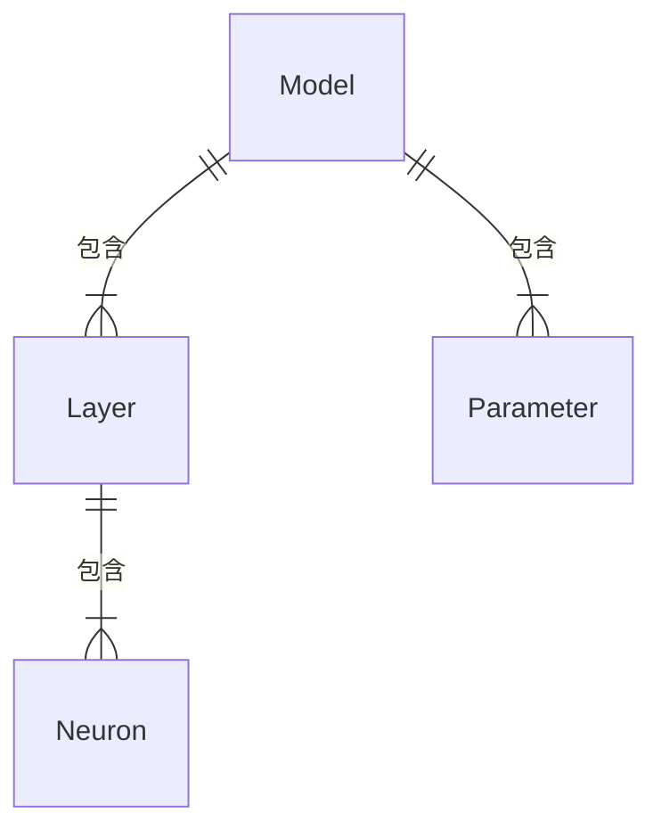
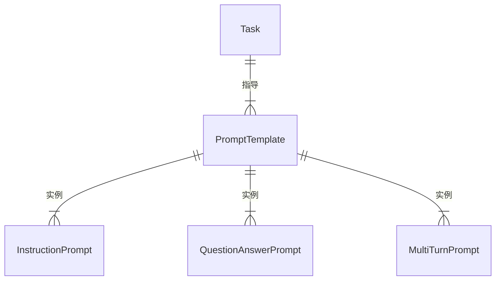
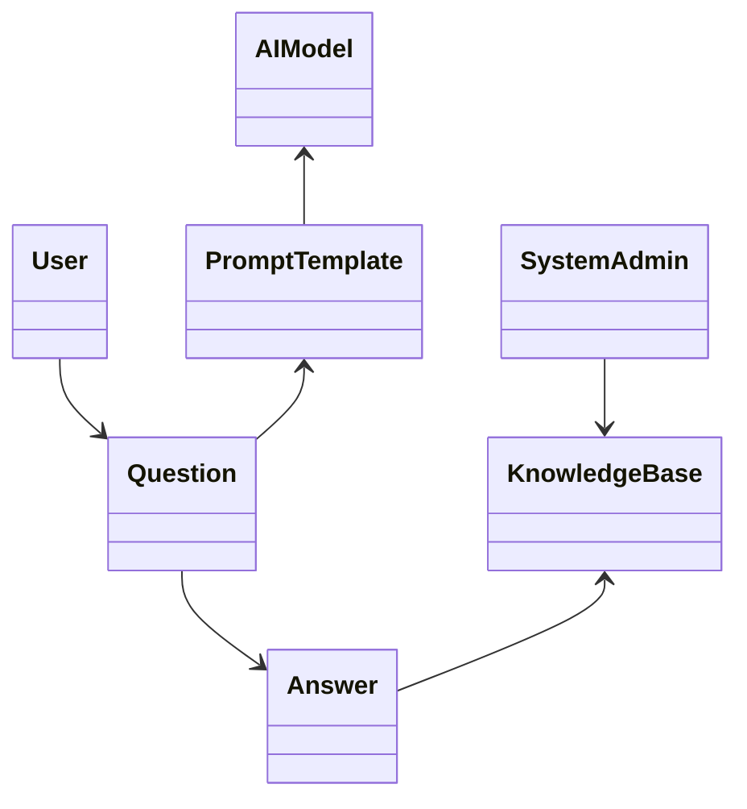
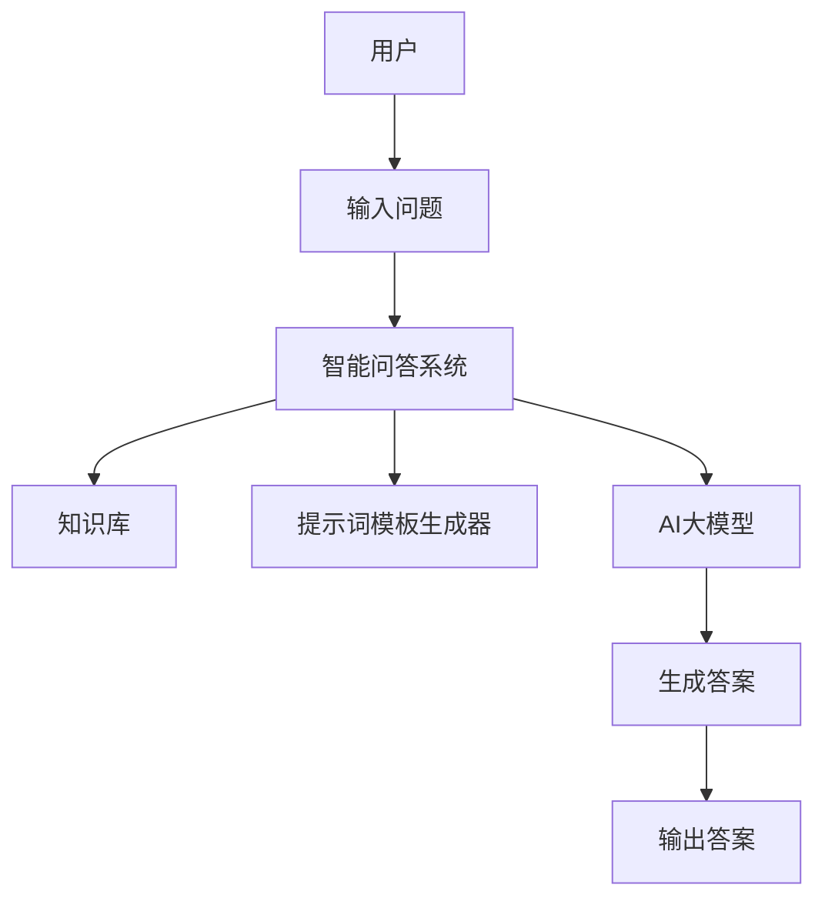
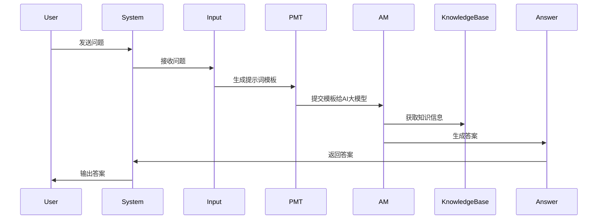

                 


### 面向任务的提示词模板设计

#### 关键词
- 人工智能
- 提示词模板
- 模型训练
- 算法设计
- 应用场景

#### 摘要
本文深入探讨了面向任务的提示词模板设计，分析了其在人工智能应用中的重要性。我们将详细阐述AI大模型的原理、提示词模板的设计原则、类型和生成算法，并通过Python代码示例展示其实际应用。

---

### 第一部分：背景介绍

#### 1. 问题背景
随着信息技术的飞速发展，人工智能（AI）已经成为推动社会进步的重要力量。AI大模型作为一种先进的AI技术，在自然语言处理、图像识别、语音识别等领域取得了显著的成果。面向任务的提示词模板设计作为AI大模型应用的一个重要方向，旨在通过设计合理的提示词模板，提高AI模型的任务执行效率和效果。

#### 2. 问题描述
在AI大模型的应用中，如何设计出有效的提示词模板，使得模型能够准确理解任务需求，并产生符合预期的输出，是一个关键问题。这个问题涉及到多个方面，包括语言理解、模型训练、提示词设计等。

#### 3. 问题解决
针对上述问题，本书将从以下几个方面进行探讨：

1. **核心概念**：介绍AI大模型、提示词模板等核心概念，明确其在AI大模型应用中的作用和重要性。
2. **概念属性特征对比表格**：列举不同类型提示词模板的属性特征，帮助读者了解不同模板的优缺点。
3. **ER实体关系图架构**：通过ER图，展示AI大模型与提示词模板之间的关联关系，为后续章节内容提供结构化的框架。

#### 4. 边界与外延
本书主要关注面向任务的提示词模板设计，但不涉及其他AI领域的问题。同时，书中所讨论的提示词模板设计方法适用于大多数AI大模型，但特定模型可能需要特定的调整。

#### 5. 概念结构与核心要素组成
本部分内容将详细讲解AI大模型和提示词模板的概念结构，包括：

1. **AI大模型**：介绍大模型的原理、结构和工作流程。
2. **提示词模板**：解释提示词模板的定义、设计原则和常见类型。

### 第二部分：核心概念与联系

#### 1. AI大模型原理

**核心概念：**
AI大模型是一种基于深度学习的复杂神经网络结构，具有强大的数据拟合能力和泛化能力。它通常由数亿甚至数十亿个参数组成，可以通过大规模数据进行训练。

**概念属性特征对比表格：**

| 特征            | 大模型          | 小模型          |
| --------------- | --------------- | --------------- |
| 参数数量        | 数亿至数十亿    | 数千至数万      |
| 训练数据量      | 大规模数据集     | 小规模数据集     |
| 泛化能力        | 强             | 中等            |
| 计算资源需求    | 高             | 低              |

**ER实体关系图架构：**



#### 2. 提示词模板设计原则

**核心概念：**
提示词模板是指导AI大模型执行特定任务的工具。其设计原则包括明确任务目标、简洁明了和灵活调整。

**概念属性特征对比表格：**

| 设计原则          | 指令式提示词     | 问题回答式提示词   | 多轮对话式提示词   |
| ----------------- | ---------------- | ----------------- | ----------------- |
| 目标明确性        | 高               | 中等              | 低                |
| 语言简洁性        | 高               | 中等              | 低                |
| 灵活调整性        | 中等             | 高                | 高                |

**ER实体关系图架构：**



### 第三部分：算法原理讲解

#### 1. 提示词模板生成算法

**算法原理与数学模型：**

提示词模板生成算法的核心思想是根据任务类型和目标，生成适合的提示词模板。具体包括以下几个步骤：

1. **任务分类**：根据任务的类型（如文本翻译、问题回答、多轮对话等），选择相应的模板生成策略。
2. **模板生成**：根据任务分类和用户输入，动态生成提示词模板。
3. **模板优化**：对生成的提示词模板进行优化，提高其有效性和准确性。

**Python源代码示例：**

```python
import random

# 定义模板生成函数
def generate_prompt(task_type, user_input):
    if task_type == 'translation':
        return f"请翻译以下英文段落为中文：{user_input}"
    elif task_type == 'question_answer':
        return f"解释以下数学公式的含义：{user_input}"
    elif task_type == 'multi_turn':
        return f"我们进行一个有趣的多轮对话吧，你想聊什么呢？{user_input}"
    else:
        return "无法识别任务类型，请重新输入。"

# 用户输入任务类型和内容
task_type = input("请输入任务类型（translation, question_answer, multi_turn）：")
user_input = input("请输入您的问题或内容：")

# 生成提示词模板
prompt = generate_prompt(task_type, user_input)

# 输出提示词模板
print(prompt)
```

**算法原理讲解：**
1. **任务分类**：根据用户输入的任务类型，选择相应的模板生成策略。这可以通过简单的条件判断实现。
2. **模板生成**：根据选定的任务类型，生成相应的提示词模板。不同的任务类型对应不同的模板生成逻辑。
3. **模板优化**：在实际应用中，可以通过机器学习等方法对模板生成算法进行优化，以提高模板的有效性和准确性。

**举例说明：**
假设用户输入的任务类型为“question_answer”，输入的内容为“解释以下数学公式的含义：$e^{i\pi} + 1 = 0$”。算法将生成以下提示词模板：“解释以下数学公式的含义：$e^{i\pi} + 1 = 0$”。

---

### 第四部分：系统分析与架构设计方案

#### 1. 问题场景介绍
在一个企业内部，我们需要设计一个基于AI大模型的智能问答系统，以帮助员工快速获取所需的信息。该系统需要能够处理多种类型的任务，包括文本翻译、问题回答和多轮对话等。

#### 2. 项目介绍
本项目的目标是构建一个高效的智能问答系统，通过面向任务的提示词模板设计，提高系统的任务执行效率和效果。系统将基于现有的AI大模型框架，结合自定义的提示词模板生成算法，实现多语言、多领域的智能问答功能。

#### 3. 系统功能设计（领域模型类图）



**领域模型类图说明：**
- **User（用户）**：表示系统的用户，负责发起问题和接收答案。
- **Question（问题）**：表示用户提出的问题，包括问题内容、类型和关联知识库等信息。
- **Answer（答案）**：表示系统生成的答案，来源于知识库和AI大模型。
- **KnowledgeBase（知识库）**：存储系统所需的知识信息，用于生成答案。
- **PromptTemplate（提示词模板）**：用于指导AI大模型生成答案，包含不同类型的模板。
- **AIModel（AI大模型）**：负责处理提示词模板，生成符合预期的答案。
- **SystemAdmin（系统管理员）**：负责维护和管理知识库和系统设置。

#### 4. 系统架构设计（架构图）



**系统架构设计说明：**
- **用户输入问题**：用户通过输入框输入问题，问题内容会被传递给智能问答系统。
- **智能问答系统**：接收用户问题后，智能问答系统会调用知识库、提示词模板生成器和AI大模型进行处理。
- **知识库**：知识库提供系统所需的知识信息，用于生成答案。
- **提示词模板生成器**：根据用户问题和任务类型，生成适合的提示词模板，用于指导AI大模型生成答案。
- **AI大模型**：处理提示词模板，生成符合预期的答案。
- **输出答案**：系统生成的答案会返回给用户，通过输出界面展示。

#### 5. 系统接口设计和系统交互



**系统接口设计和系统交互说明：**
- **用户发送问题**：用户通过接口发送问题，系统接收到问题后，进入处理流程。
- **生成提示词模板**：系统根据用户问题和任务类型，生成相应的提示词模板。
- **AI大模型处理**：AI大模型根据提示词模板，从知识库中获取相关知识和信息，生成答案。
- **输出答案**：系统将生成的答案返回给用户，并通过输出接口展示。

---

### 第五部分：项目实战

#### 1. 环境安装

首先，我们需要安装所需的软件和库，以便进行项目开发。以下是安装步骤：

1. **安装Python**：确保系统上安装了Python 3.x版本，可以从官方网站下载并安装。
2. **安装AI大模型库**：使用以下命令安装TensorFlow和transformers库。
   ```bash
   pip install tensorflow
   pip install transformers
   ```

#### 2. 系统核心实现源代码

以下是一个简单的智能问答系统的核心实现源代码：

```python
from transformers import AutoTokenizer, AutoModelForSeq2SeqLM
import torch

# 初始化AI大模型和提示词模板生成器
tokenizer = AutoTokenizer.from_pretrained("t5-small")
model = AutoModelForSeq2SeqLM.from_pretrained("t5-small")

def generate_answer(question):
    # 生成提示词模板
    prompt = "请回答以下问题："
    input_text = f"{prompt}{question}"
    input_ids = tokenizer.encode(input_text, return_tensors="pt")
    
    # 使用AI大模型生成答案
    with torch.no_grad():
        outputs = model.generate(input_ids, max_length=512, num_return_sequences=1)
    
    answer = tokenizer.decode(outputs[0], skip_special_tokens=True)
    return answer

# 用户输入问题
user_question = input("请输入您的问题：")

# 生成答案
answer = generate_answer(user_question)

# 输出答案
print(answer)
```

#### 3. 代码应用解读与分析

该代码实现了以下功能：
- **初始化AI大模型和提示词模板生成器**：使用transformers库加载T5小模型作为AI大模型，并初始化提示词模板。
- **生成提示词模板**：根据输入的问题，生成提示词模板，例如“请回答以下问题：”。
- **使用AI大模型生成答案**：将问题输入到AI大模型中，生成答案。
- **输出答案**：将生成的答案输出到控制台。

#### 4. 实际案例分析和详细讲解剖析

假设用户输入的问题是：“什么是人工智能？”
- **提示词模板**：生成的提示词模板为“请回答以下问题：什么是人工智能？”。
- **AI大模型处理**：AI大模型会根据提示词模板，从其训练的数据中提取相关知识和信息，生成答案。
- **输出答案**：AI大模型可能生成的答案为：“人工智能（Artificial Intelligence，简称AI）是指由人制造出来的系统，具有人类智能的特征，能够执行复杂的任务，如语音识别、图像识别、自然语言处理等。”

通过这个案例，我们可以看到AI大模型是如何根据提示词模板生成答案的。在实际应用中，可以通过不断优化提示词模板和AI大模型，提高答案的质量和准确性。

#### 5. 项目小结

在本项目中，我们通过面向任务的提示词模板设计，实现了一个简单的智能问答系统。用户可以通过输入问题，系统会自动生成答案并展示给用户。这个系统在自然语言处理、问题回答等领域具有广泛的应用前景。通过不断地优化和改进，我们可以进一步提高系统的性能和用户体验。

---

### 第六部分：最佳实践 Tips、小结、注意事项、拓展阅读

#### 最佳实践 Tips
- **提示词设计原则**：在设计提示词时，应遵循简洁明了、目标明确和灵活调整的原则，以提高AI模型的理解和执行效率。
- **模型选择与调优**：根据具体任务需求，选择合适的AI大模型，并进行相应的调优，以获得最佳性能。

#### 小结
本文深入探讨了面向任务的提示词模板设计，分析了其在AI大模型应用中的重要性。通过核心概念、算法原理和实际案例的讲解，展示了如何设计有效的提示词模板，提高AI模型的任务执行效率和效果。

#### 注意事项
- **模型训练数据**：确保训练数据的质量和多样性，以提高AI大模型的泛化能力。
- **用户反馈**：收集用户反馈，不断优化提示词模板和AI大模型，提高用户体验。

#### 拓展阅读
- **《AI大模型：原理、实践与未来》**：详细介绍了AI大模型的原理和应用，适合对AI大模型感兴趣的读者。
- **《自然语言处理入门与实践》**：介绍了自然语言处理的基础知识和应用实践，包括提示词模板的设计。

---

### 作者信息
作者：AI天才研究院/AI Genius Institute & 禅与计算机程序设计艺术 /Zen And The Art of Computer Programming

在本文中，我们详细探讨了面向任务的提示词模板设计，分析了其在人工智能（AI）领域的重要性。通过核心概念、算法原理和实际案例的讲解，读者可以了解到如何设计有效的提示词模板，提高AI模型的任务执行效率和效果。

首先，我们介绍了AI大模型和提示词模板的基本概念，并列举了不同类型提示词模板的属性特征，通过ER实体关系图展示了AI大模型与提示词模板之间的关联关系。接着，我们深入讲解了提示词模板的生成算法，包括任务分类、模板生成和模板优化等步骤，并通过Python代码示例进行了说明。

在系统分析与架构设计方案部分，我们介绍了问题场景、项目介绍、系统功能设计、系统架构设计和系统接口设计等内容。通过领域模型类图和架构图，我们展示了系统的整体架构和各模块之间的交互关系。

在项目实战部分，我们详细介绍了环境安装、系统核心实现源代码、代码应用解读与分析、实际案例分析和项目小结等内容。通过这些实践，读者可以了解到如何将理论应用于实际项目开发中。

最后，我们提供了最佳实践 Tips、小结、注意事项和拓展阅读等内容，帮助读者进一步深入学习和实践。

总的来说，面向任务的提示词模板设计是AI大模型应用中的一个关键环节，对于提高AI模型的性能和用户体验具有重要意义。通过本文的讲解，读者可以掌握设计有效提示词模板的方法和技巧，为AI技术的发展和应用贡献力量。希望本文能为广大读者提供有价值的参考和启示。

