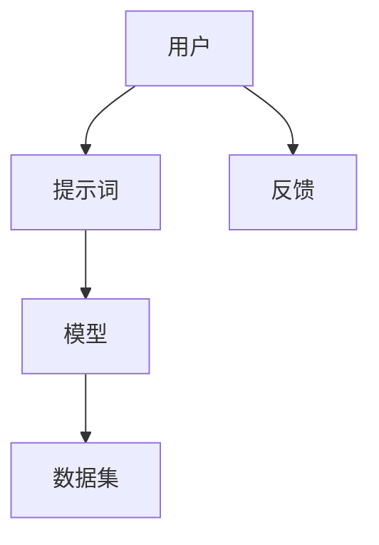
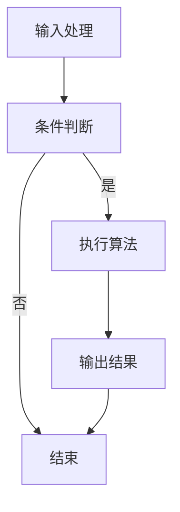
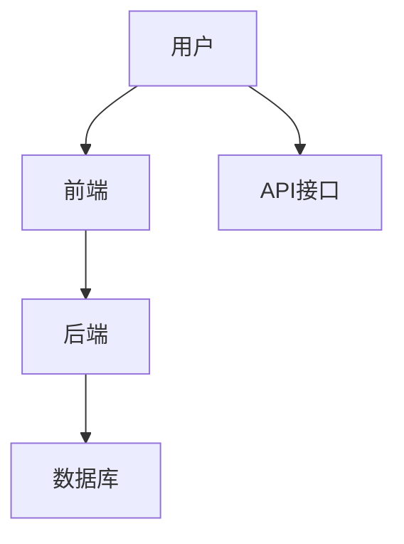
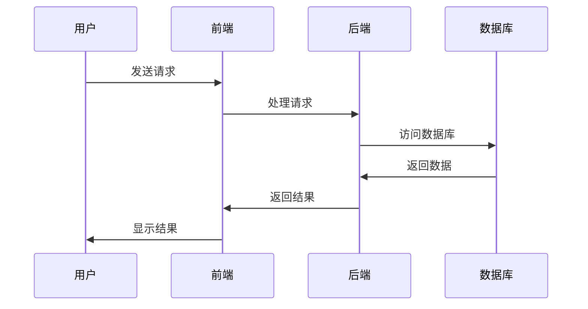

                 

# 面向特定领域的提示词优化技术

## 关键词
- 提示词优化
- 特定领域
- 自然语言处理
- 机器学习
- 人工智能

## 摘要
本文深入探讨了面向特定领域的提示词优化技术，从背景介绍、核心概念与联系、算法原理讲解、系统分析与架构设计以及项目实战等多个角度，详细阐述了如何通过优化提示词来提升人工智能在特定领域的表现。文章旨在为读者提供一套系统化的理解与应用方法，以实现更加精准、高效的提示词优化策略。

## 第一部分：背景介绍

### 1.1 问题背景

#### 1.1.1 问题描述
在人工智能与自然语言处理领域，提示词（Prompt）是用户与系统交互的重要桥梁。然而，在特定领域内，传统的通用提示词往往无法满足用户的需求，导致交互效果不佳。这一问题主要体现在以下几个方面：
- **语义理解偏差**：通用提示词在特定领域内可能无法准确捕捉用户意图。
- **信息过载**：通用提示词可能包含大量无关信息，降低了用户的有效信息获取效率。
- **用户体验差**：由于语义理解偏差和过载信息，用户在特定领域的交互体验往往较差。

#### 1.1.2 问题解决
为了解决上述问题，提示词优化技术应运而生。通过针对特定领域定制化地设计提示词，可以显著提升用户与系统的交互效果。优化目标主要包括：
- **提高语义准确性**：确保提示词能够准确捕捉用户的意图和需求。
- **减少信息冗余**：设计简洁、直接的提示词，避免无关信息的干扰。
- **提升用户体验**：优化后的提示词应能够提供更好的交互体验，满足用户在特定领域的需求。

#### 1.1.3 边界与外延
提示词优化技术不仅局限于特定领域，其应用范围还包括跨领域应用。在实际操作中，需要根据具体应用场景进行调整。例如，在医疗领域，需要关注专业术语的准确性；在法律领域，则需保证提示词的严谨性。同时，提示词优化技术还应考虑文化差异、语言习惯等因素，以确保在全球范围内的广泛应用。

### 1.2 概念结构与核心要素组成

#### 1.2.1 核心概念
- **提示词（Prompt）**：用于引导用户输入信息的短语或句子。
- **特定领域**：指明确指定的人工智能应用场景，如医疗、法律、金融等。
- **自然语言处理（NLP）**：指利用计算机技术和算法处理和理解自然语言的技术。
- **机器学习（ML）**：一种通过数据训练模型并实现预测或决策的技术。

#### 1.2.2 核心要素
- **数据集**：用于训练和测试机器学习模型的集合。
- **模型**：用于处理自然语言输入并生成提示词的算法。
- **评估指标**：用于衡量提示词优化效果的指标，如准确率、召回率、F1值等。

#### 1.2.3 结构与联系
提示词优化技术的结构包括以下几个主要组成部分：
1. **数据预处理**：对特定领域的数据进行清洗、标注和分类，为训练模型提供高质量的输入。
2. **模型训练**：使用训练数据集训练机器学习模型，使其能够生成针对特定领域的提示词。
3. **模型评估**：通过评估指标对模型生成的提示词进行评价和优化。
4. **用户反馈**：收集用户对提示词的反馈，用于进一步优化模型。

各组成部分之间的联系如下：
- 数据预处理直接影响模型训练的质量，高质量的输入数据能够提高模型的性能。
- 模型训练是整个技术的核心，训练出的模型能够生成高质量的提示词。
- 模型评估用于判断模型的性能，并为后续的优化提供指导。
- 用户反馈是持续优化模型的重要途径，通过不断调整和改进，可以实现更好的用户体验。

## 第二部分：核心概念与联系

### 2.1 核心概念原理

#### 2.1.1 概念定义
- **提示词**：一种用于引导用户输入信息的短语或句子，通常包含关键词、指令或问题。
- **特定领域**：指明确指定的人工智能应用场景，如医疗、法律、金融等，具有特定的术语、规则和需求。
- **自然语言处理（NLP）**：一种通过计算机技术和算法处理和理解自然语言的技术，包括文本分类、实体识别、情感分析等任务。
- **机器学习（ML）**：一种通过数据训练模型并实现预测或决策的技术，包括监督学习、无监督学习和强化学习等。

#### 2.1.2 原理讲解
提示词优化技术基于自然语言处理和机器学习两大核心概念，通过以下步骤实现：
1. **数据收集与预处理**：收集特定领域的语料库，并进行清洗、标注和分类，为训练模型提供高质量的输入。
2. **模型训练**：使用预处理的语料库训练机器学习模型，使其能够生成针对特定领域的提示词。常见的模型包括循环神经网络（RNN）、卷积神经网络（CNN）和变换器（Transformer）等。
3. **提示词生成**：模型根据用户输入或特定领域的需求，生成高质量的提示词。
4. **模型评估与优化**：通过评估指标对模型生成的提示词进行评价和优化，如准确率、召回率、F1值等。根据用户反馈和评估结果，不断调整模型参数，提升提示词的质量。

### 2.2 概念属性特征对比表格

| 概念       | 特征1 | 特征2 | 特征3 |
|------------|-------|-------|-------|
| 提示词     | 用于引导用户输入 | 自然语言处理 | 机器学习生成 |
| 特定领域   | 具有特定术语和规则 | 需求明确 | 领域针对性 |
| 自然语言处理 | 文本分类、实体识别、情感分析 | 语言理解与生成 | 数据处理 |
| 机器学习   | 数据训练模型 | 预测与决策 | 自适应优化 |

### 2.3 ER实体关系图架构



## 第三部分：算法原理讲解

### 3.1 算法mermaid流程图



### 3.2 算法原理详细讲解

#### 3.2.1 数学模型

$$
模型公式：Y = f(X)
$$

其中，$X$ 为用户输入或特定领域需求，$Y$ 为生成的提示词，$f(X)$ 为机器学习模型对输入 $X$ 的处理结果。

#### 3.2.2 公式解释
- $Y = f(X)$ 表示模型根据输入 $X$ 生成输出 $Y$。
- $f(X)$ 为函数 $f$ 对输入 $X$ 进行处理的结果，可能包括自然语言处理、语义理解、语言生成等步骤。

#### 3.2.3 举例说明

假设用户输入为“我想咨询心脏病治疗”，则生成的提示词 $Y$ 可能如下：

$$
Y = f(\text{"我想咨询心脏病治疗"}) = \text{"请问您有哪些具体问题关于心脏病治疗？"}
$$

其中，$f(\text{"我想咨询心脏病治疗"})$ 表示模型根据用户输入生成的具体提示词。

## 第四部分：系统分析与架构设计

### 4.1 问题场景介绍

#### 4.1.1 项目介绍
本项目旨在开发一款面向医疗领域的人工智能辅助系统，通过优化提示词提升用户在医疗咨询过程中的体验。系统功能包括：
- 用户输入医疗问题。
- 系统生成针对医疗问题的提示词。
- 用户根据提示词进一步提出具体问题。
- 系统根据用户问题生成相应的回答。

#### 4.1.2 系统功能设计
- **自然语言理解**：通过自然语言处理技术，理解用户输入的医疗问题。
- **提示词生成**：基于机器学习模型，生成针对医疗问题的专业提示词。
- **交互反馈**：收集用户对提示词的反馈，用于模型优化和系统改进。

### 4.2 系统架构设计

#### 4.2.1 mermaid架构图



#### 4.2.2 系统接口设计和系统交互

##### 4.2.2.1 mermaid序列图



## 第五部分：项目实战

### 5.1 环境安装

#### 5.1.1 环境准备
在开始项目实战之前，需要准备以下环境：
- Python 3.8+
- Anaconda 或 Miniconda
- TensorFlow 或 PyTorch

#### 5.1.2 安装依赖
```python
!pip install tensorflow
!pip install pandas
!pip install numpy
!pip install scikit-learn
```

### 5.2 系统核心实现源代码

#### 5.2.1 源代码解析
以下是系统核心实现的一个示例代码，用于生成医疗领域的提示词。

```python
import tensorflow as tf
from tensorflow.keras.models import Sequential
from tensorflow.keras.layers import Dense, LSTM, Embedding

# 数据预处理
def preprocess_data(data):
    # 数据清洗、分词、词向量化等操作
    pass

# 构建模型
def build_model(input_shape):
    model = Sequential()
    model.add(Embedding(input_shape[0], input_shape[1]))
    model.add(LSTM(128, return_sequences=True))
    model.add(Dense(1, activation='sigmoid'))

    model.compile(optimizer='adam', loss='binary_crossentropy', metrics=['accuracy'])
    return model

# 训练模型
def train_model(model, x_train, y_train, x_val, y_val):
    model.fit(x_train, y_train, epochs=10, batch_size=64, validation_data=(x_val, y_val))

# 生成提示词
def generate_prompt(model, input_text):
    processed_text = preprocess_data([input_text])
    prediction = model.predict(processed_text)
    return prediction

# 主函数
def main():
    # 加载数据
    x_train, y_train, x_val, y_val = load_data()

    # 构建模型
    model = build_model(x_train.shape[1:])

    # 训练模型
    train_model(model, x_train, y_train, x_val, y_val)

    # 生成提示词
    input_text = "我想咨询心脏病治疗"
    prompt = generate_prompt(model, input_text)
    print(prompt)

if __name__ == "__main__":
    main()
```

#### 5.2.2 代码应用解读与分析
- **数据预处理**：对输入文本进行清洗、分词和词向量化处理，为模型训练提供合适的输入。
- **模型构建**：使用 Sequential 模型，添加 Embedding 层、LSTM 层和 Dense 层，构建一个简单的序列模型。
- **模型训练**：使用 TensorFlow 的 fit 函数，对模型进行训练，包括 epochs、batch_size 和 validation_data 参数的设置。
- **提示词生成**：对预处理后的输入文本进行预测，生成提示词。

### 5.3 实际案例分析与讲解

#### 5.3.1 案例介绍
假设用户在医疗咨询系统中输入“我想咨询心脏病治疗”，系统生成的提示词为“请问您有哪些具体问题关于心脏病治疗？”。接下来，我们将分析这一案例，并讲解系统如何生成这个提示词。

#### 5.3.2 详细讲解
1. **用户输入**：用户输入“我想咨询心脏病治疗”。
2. **预处理文本**：系统对输入文本进行预处理，包括分词、去停用词、词向量化等操作，得到处理后的文本向量。
3. **模型预测**：将预处理后的文本向量输入训练好的模型，模型根据输入文本生成提示词。
4. **生成提示词**：模型输出预测结果，生成提示词“请问您有哪些具体问题关于心脏病治疗？”。

### 5.4 项目小结

#### 5.4.1 小结
本文通过介绍面向特定领域的提示词优化技术，详细阐述了从背景介绍、核心概念与联系、算法原理讲解、系统分析与架构设计到项目实战的整个过程。通过实际案例分析和讲解，展示了如何利用机器学习和自然语言处理技术，生成高质量的提示词，提升用户在特定领域的交互体验。

#### 5.4.2 注意事项
- 在项目实战中，数据预处理和模型训练是关键步骤，需要确保数据质量和模型性能。
- 提示词生成需要根据实际应用场景进行调整，确保生成的提示词满足用户需求。
- 持续优化模型和提示词，根据用户反馈和评估结果进行改进。

#### 5.4.3 拓展阅读
- [《自然语言处理入门》](https://book.douban.com/subject/27101558/)
- [《机器学习实战》](https://book.douban.com/subject/26783254/)
- [《深度学习》](https://book.douban.com/subject/26979621/)

## 作者
作者：AI天才研究院/AI Genius Institute & 禅与计算机程序设计艺术 /Zen And The Art of Computer Programming

