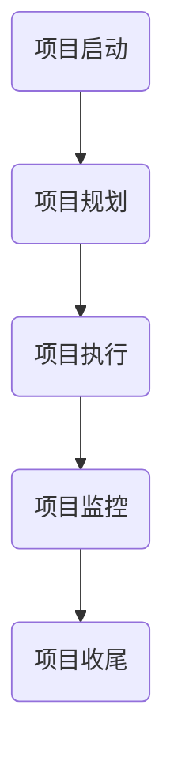

                 

### 第四部分：项目管理方法论

#### 基本原理

项目管理方法论是一种系统化的方法，用于规划、执行和监控项目。它包括了一系列工具和技术，旨在确保项目目标的实现。项目管理方法论的基本原理包括：

1. **目标导向**：项目管理的核心目标是实现项目目标，所有工作都应围绕这一目标进行。
2. **系统化**：项目管理方法论强调系统化的思维方式，通过对项目进行系统分析，确保各部分协调运作。
3. **迭代与改进**：项目管理强调不断迭代和改进，通过收集反馈和调整计划，使项目不断优化。
4. **团队协作**：项目管理强调团队协作，通过有效的沟通和协作，确保项目顺利进行。

#### 常见的项目管理方法论

1. **瀑布模型**：瀑布模型是最传统的项目管理方法论，它将项目开发过程分为多个阶段，每个阶段必须完成后再进入下一个阶段，如需求分析、设计、编码、测试等。

2. **敏捷开发**：敏捷开发是一种迭代和增量的项目管理方法论，它强调快速响应变化，通过短期迭代（如每周或每两周）来逐步实现项目目标。

3. **Scrum**：Scrum是一种敏捷开发框架，它强调团队协作、快速迭代和持续交付。Scrum的主要组成部分包括：产品待办列表、冲刺计划、每日站会、冲刺评审和回顾会议。

4. **Kanban**：Kanban是一种基于看板系统的项目管理方法论，它通过可视化的工作流程板来管理项目进度。Kanban的主要特点是限制工作项数量，以提高工作效率。

#### 方法论对比分析表格

| 方法论 | 特点 | 适用场景 |
| ---- | ---- | ---- |
| 瀑布模型 | 结构化、阶段性明确 | 传统项目、需求相对稳定 |
| 敏捷开发 | 快速响应变化、迭代改进 | 创新性项目、需求多变 |
| Scrum | 团队协作、快速迭代 | 团队协作、需求变化频繁 |
| Kanban | 可视化工作流程、限制工作项数量 | 需求稳定、工作流程优化 |

### 第五部分：项目管理流程

项目管理流程是指从项目启动到项目结束的整个过程。以下是项目管理流程的基本步骤：

1. **项目启动**：项目启动阶段主要包括项目立项、项目团队组建和项目目标确定。

2. **项目规划**：项目规划阶段主要包括项目范围定义、项目计划制定、资源分配和风险管理计划。

3. **项目执行**：项目执行阶段是项目团队按照项目计划开展工作的过程。

4. **项目监控**：项目监控阶段主要包括项目进度监控、成本监控、质量监控和风险监控。

5. **项目收尾**：项目收尾阶段主要包括项目总结、项目验收和项目文档归档。

### 项目管理流程ER图

以下是项目管理流程的ER图，展示了各个阶段之间的关系：

### 第六部分：项目管理工具与技巧

#### 常见项目管理工具

1. **Microsoft Project**：Microsoft Project是一款功能强大的项目管理工具，它可以帮助项目经理制定项目计划、分配资源、跟踪项目进度。

2. **JIRA**：JIRA是一款流行的敏捷项目管理工具，它支持Scrum和Kanban，可以帮助团队管理需求、任务、缺陷和迭代。

3. **Trello**：Trello是一款基于看板系统的项目管理工具，它通过可视化的工作流程板来管理项目进度。

4. **Asana**：Asana是一款功能全面的任务管理工具，它可以帮助团队分配任务、跟踪进度、管理项目。

#### 项目管理技巧

1. **明确项目目标**：确保项目目标明确、可衡量、可实现。

2. **合理分配资源**：根据项目需求，合理分配人力资源、物资资源和其他资源。

3. **定期项目评审**：定期进行项目评审，确保项目进度、质量和成本都在可控范围内。

4. **有效沟通**：确保团队成员之间、团队成员与项目经理之间、项目经理与 stakeholders 之间保持有效沟通。

5. **风险管理**：识别项目风险，制定风险管理计划，及时应对项目风险。

### 第七部分：实际案例分析与启示

#### 案例一：某互联网公司的产品开发项目

某互联网公司计划开发一款新产品，项目团队由产品经理、开发人员、测试人员、UI设计师等组成。项目经理在项目启动阶段明确了项目目标、项目范围和项目计划。在项目执行阶段，项目经理使用Trello进行任务分配和进度跟踪。通过定期项目评审和有效沟通，项目团队顺利完成了产品开发，并按时上线。

**启示**：明确项目目标是项目成功的关键，合理的资源分配和有效的沟通是确保项目进度和质量的重要手段。

#### 案例二：某跨国公司的全球市场营销活动

某跨国公司计划在全球范围内举办一次大型市场营销活动。项目经理需要协调不同国家和地区的团队，确保活动在全球范围内的同步进行。项目经理使用了Microsoft Project来制定项目计划，并通过JIRA来管理任务和进度。

**启示**：跨团队合作需要高效的沟通和协调，使用项目管理工具可以帮助项目经理更好地管理项目进度和资源。

### 第八部分：项目管理者的成长与提升

#### 成长路径

1. **学习项目管理知识**：通过学习项目管理理论、方法论和工具，掌握项目管理的核心知识和技能。

2. **实践经验积累**：通过实际项目管理项目的参与，积累项目管理经验，提升项目执行能力。

3. **持续学习与反思**：项目管理是一个不断发展的领域，持续学习最新的项目管理知识和技巧，并反思项目管理实践中的不足。

#### 提升方法

1. **参加项目管理认证**：如PMP（项目管理专业人士认证）、PRINCE2（受控环境下的项目管理）等，这些认证可以帮助项目管理者系统地学习项目管理知识，提升职业素养。

2. **参加项目管理培训**：参加项目管理培训课程，学习最新的项目管理实践和方法。

3. **阅读项目管理书籍**：阅读项目管理相关书籍，吸收理论知识，提升项目管理水平。

### 第九部分：最佳实践与总结

#### 最佳实践

1. **明确项目目标**：确保项目目标明确、可衡量、可实现。

2. **合理规划项目进度**：制定合理的项目计划，包括项目阶段划分、任务分配、时间安排等。

3. **有效沟通**：确保团队成员之间、团队成员与项目经理之间、项目经理与 stakeholders 之间保持有效沟通。

4. **风险管理**：识别项目风险，制定风险管理计划，及时应对项目风险。

5. **持续改进**：通过项目评审、反馈和改进，不断提升项目管理水平。

#### 总结

项目管理是现代企业运营中不可或缺的一部分。通过掌握项目管理的基本原理、方法论、工具与技巧，项目经理可以有效地应对项目管理中的各种挑战，确保项目目标的实现。持续学习与反思，不断提升项目管理能力，是项目管理者的成长之道。

### 第十部分：注意事项与拓展阅读

#### 注意事项

1. **项目目标应明确、可衡量、可实现**：确保项目目标的设定具有明确性和可实现性，避免目标模糊或过高导致项目失败。

2. **有效沟通**：确保团队成员之间、团队成员与项目经理之间、项目经理与 stakeholders 之间保持有效沟通，减少误解和冲突。

3. **风险管理**：项目风险是项目管理中不可避免的一部分，应重视风险识别、评估和应对。

4. **持续改进**：项目管理是一个不断迭代和改进的过程，应通过项目评审和反馈，持续优化项目管理流程。

#### 拓展阅读

1. **《项目管理知识体系指南（PMBOK指南）》**：这是项目管理领域的权威指南，详细介绍了项目管理的知识体系和实践方法。

2. **《敏捷开发实践指南》**：该书介绍了敏捷开发的方法论和实践技巧，适用于需求多变和创新性项目。

3. **《项目管理中的心理学》**：该书从心理学的角度探讨了项目管理中的问题，提供了有效的解决策略。

### 第十一部分：作者信息

#### 作者

作者：AI天才研究院/AI Genius Institute & 禅与计算机程序设计艺术 /Zen And The Art of Computer Programming

---

以上是《项目管理：领导者的必备技能》的技术博客文章。希望这篇文章能够帮助您更好地理解项目管理的重要性和方法，提升您的项目管理能力。感谢您的阅读！

