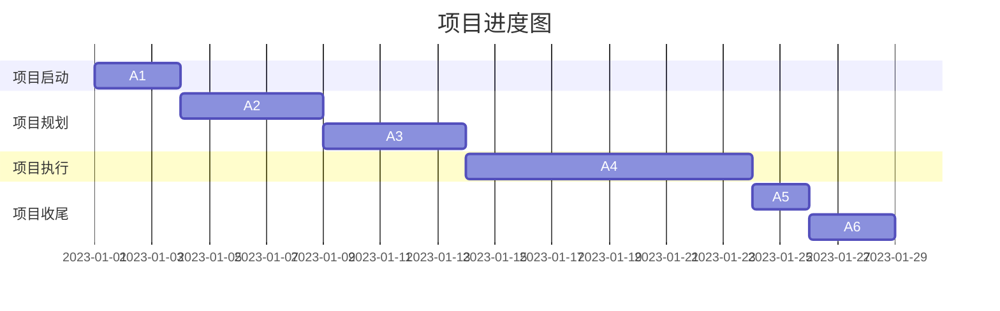
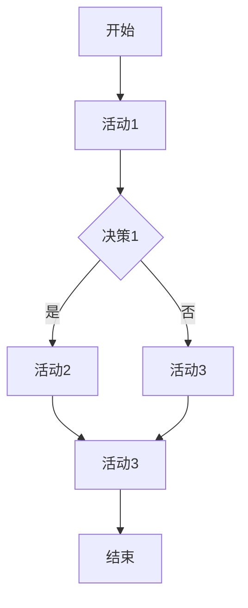
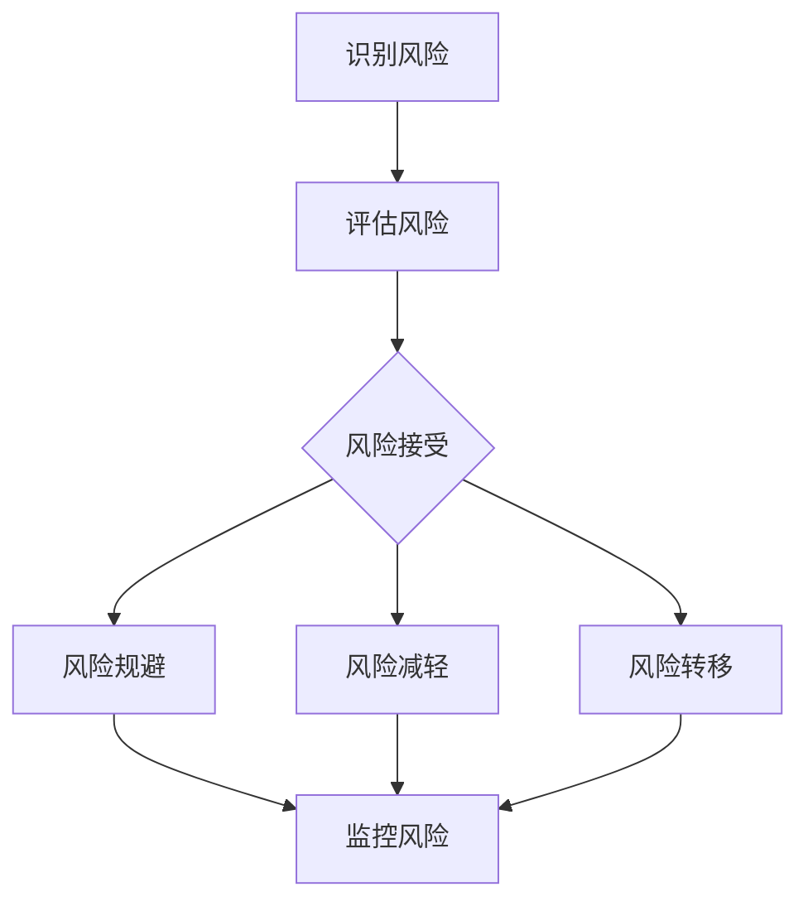

                 

### 第一部分：项目管理基础知识

#### 第1章：问题的背景与重要性

项目管理作为现代企业管理中的重要一环，其重要性随着企业规模和复杂度的增加而日益凸显。本章节将探讨项目管理的起源、发展及其在现代企业管理中的作用。

##### 1.1.1 问题背景

项目管理的历史可以追溯到20世纪初，当时美国的一些大型工程建设项目，如修建公路、桥梁和堤坝等，需要大量的人力、物力和时间资源。为了高效地管理这些项目，项目经理开始采用一系列方法和技术，如甘特图、网络图等，以确保项目按计划顺利进行。随着时间的推移，项目管理逐渐发展为一门独立的学科，并广泛应用于各个领域。

##### 1.1.2 问题描述

尽管项目管理的重要性被广泛认可，但在实际操作中，很多企业仍然面临着项目管理效率低下、资源浪费、项目延期等问题。这些问题不仅影响了企业的运营效益，还可能导致客户满意度下降，甚至影响企业的声誉。

##### 1.1.3 问题解决

为了解决这些问题，我们需要深入理解项目管理的核心概念和基本原则。首先，我们需要明确项目管理的核心概念，如项目目标、项目范围、项目进度、项目成本、项目质量等。其次，我们需要掌握项目管理的四大过程组：启动、规划、执行、收尾。最后，我们需要了解项目管理的最佳实践和方法。

##### 1.1.4 边界与外延

项目管理不仅仅局限于大型企业，中小企业、非营利组织、政府机构等都可以应用项目管理来提高工作效率和达成目标。同时，项目管理也可以应用于不同类型的项目，如研发项目、市场推广项目、基础设施建设等。

#### 第2章：项目管理核心概念与联系

##### 2.1.1 项目管理核心概念

项目管理涉及多个核心概念，包括项目目标、项目范围、项目进度、项目成本、项目质量等。在本章节中，我们将详细解释这些概念，并展示它们之间的相互联系。

##### 2.1.2 概念属性特征对比表格

为了更直观地理解这些概念，我们制作了一个概念属性特征对比表格，列出每个概念的定义、属性和特征。

| 概念       | 定义                                                         | 属性                                                         | 特征                                                         |
|------------|--------------------------------------------------------------|--------------------------------------------------------------|--------------------------------------------------------------|
| 项目目标   | 项目期望达成的结果或成果                                     | 明确、具体、可度量                                             | 指导项目规划和执行的过程                                       |
| 项目范围   | 项目包含的工作内容和边界                                      | 定义项目工作范围和限制                                         | 确保项目团队在执行项目时不会偏离目标                            |
| 项目进度   | 项目完成各项任务的预定时间表                                 | 根据项目目标分配时间和资源                                     | 监控项目进度，确保按时交付                                     |
| 项目成本   | 完成项目所需的全部费用                                       | 预算、费用控制、成本效益分析                                   | 确保项目在预算内完成                                           |
| 项目质量   | 项目交付成果满足需求和标准的程度                             | 质量标准、质量控制、持续改进                                   | 确保项目交付的高质量产品或服务                                 |

##### 2.1.3 ER实体关系图架构

为了展示项目管理中不同实体之间的关系，我们使用Mermaid绘制了一个ER实体关系图，如下所示：

```mermaid
erDiagram
    Project ||--|{ Task }|>
    Project ||--|{ Resource }|>
    Project ||--|{ TeamMember }|>

    Task ||--|{ SubTask }|>
    Task ||--|{ Dependency }|>

    Resource ||--|{ Tool }|>
    Resource ||--|{ Material }|>

    TeamMember ||--|{ Role }|>

    Project ||..|{ Cost }|..
    Project ||..|{ Schedule }|..
    Project ||..|{ Quality }|..

    Task ||..|{ Time }|..
    Task ||..|{ Cost }|..

    Resource ||..|{ Allocation }|..

    TeamMember ||..|{ Skill }|..
```

通过这个ER图，我们可以清楚地看到项目、任务、资源、团队成员等实体之间的联系，以及它们如何相互作用以实现项目目标。

### 第3章：项目管理过程组详解

#### 3.1.1 启动过程

在启动过程中，我们需要明确项目的目标、范围和可行性。这一阶段的关键活动包括项目立项、制定项目章程和组建项目团队。

##### 3.1.1.1 项目立项

项目立项是项目启动的第一步，需要确定项目是否值得投资和实施。通常，项目立项的过程包括项目建议书的编写、项目评估和项目审批等环节。

##### 3.1.1.2 制定项目章程

项目章程是项目启动的重要文档，它定义了项目的目标、范围、关键利益相关者和项目的总体管理计划。项目章程通常由项目经理或项目发起人制定。

##### 3.1.1.3 组建项目团队

项目团队是项目成功的关键，组建项目团队的过程包括确定项目团队成员、分配角色和职责，以及制定团队协作计划。

#### 3.1.2 规划过程

规划过程是项目管理的核心环节，我们需要制定详细的项目计划，包括项目范围、时间、成本、质量、人力资源等。

##### 3.1.2.1 制定项目范围

项目范围定义了项目的具体工作内容和边界，确保项目团队在执行项目时不会偏离目标。项目范围的制定过程通常包括范围说明书编写、范围确认和范围变更控制等环节。

##### 3.1.2.2 制定项目计划

项目计划是项目执行的指导性文档，它包括了项目的进度计划、成本计划、质量计划、人力资源计划等。项目计划的制定过程通常包括项目计划编制、计划评审和计划调整等环节。

##### 3.1.2.3 资源分配与规划

资源分配与规划是确保项目按时、按预算完成的关键，我们需要合理分配项目所需的人力、物力和财力资源，并制定资源使用计划。

#### 3.1.3 执行过程

执行过程是项目实际运行阶段，我们需要按照项目计划进行工作，确保项目进度、质量和成本控制。

##### 3.1.3.1 指导与监督

在执行过程中，项目经理需要指导项目团队按照项目计划开展工作，并对项目进度、质量和成本进行监控。

##### 3.1.3.2 风险管理

风险管理是项目管理的重要环节，我们需要识别项目风险、评估风险影响和制定风险应对计划。

##### 3.1.3.3 沟通与协作

项目成功的另一个关键因素是团队之间的有效沟通和协作。我们需要建立良好的沟通机制，确保项目信息传递的及时性和准确性。

#### 3.1.4 收尾过程

在收尾过程中，我们需要对项目进行总结和评估，确保项目目标的实现。关键活动包括项目验收、项目总结和项目文档归档。

##### 3.1.4.1 项目验收

项目验收是项目收尾的重要环节，我们需要确认项目交付成果符合项目要求，并得到项目发起人和利益相关者的认可。

##### 3.1.4.2 项目总结

项目总结是项目结束后的重要工作，我们需要对项目过程进行回顾和分析，总结项目成功经验和不足之处。

##### 3.1.4.3 项目文档归档

项目文档归档是项目收尾的最后一项工作，我们需要将项目文档进行整理和归档，以便日后参考和使用。

### 第4章：项目管理最佳实践

#### 4.1.1 常见项目管理方法

在本章节中，我们将介绍几种常见的项目管理方法，如瀑布模型、敏捷开发、迭代模型等，并分析它们的特点和应用场景。

##### 4.1.1.1 瀑布模型

瀑布模型是一种传统的项目管理方法，它将项目开发过程划分为多个阶段，如需求分析、设计、开发、测试和部署等。每个阶段完成后，项目才会进入下一个阶段。

- **特点**：结构清晰、易于管理
- **应用场景**：适用于需求明确、变更较少的项目

##### 4.1.1.2 敏捷开发

敏捷开发是一种以人为核心、迭代、渐进的项目管理方法，它强调持续交付有价值的软件，并具备适应变化的能力。

- **特点**：灵活、快速响应变化
- **应用场景**：适用于需求多变、风险较高的项目

##### 4.1.1.3 迭代模型

迭代模型是一种在短时间内完成项目一部分工作的方法，每个迭代周期包括需求分析、设计、开发、测试等阶段。

- **特点**：逐步完善、逐步交付
- **应用场景**：适用于需求逐步明确、风险可控的项目

#### 4.1.2 项目管理工具与技术

在本章节中，我们将介绍一些常用的项目管理工具和技术，如Gantt图、PERT图、风险管理等，并展示如何使用这些工具和技术提高项目管理效率。

##### 4.1.2.1 Gantt图

Gantt图是一种直观展示项目进度和任务的工具，它可以帮助项目经理监控项目进度，确保项目按计划进行。



##### 4.1.2.2 PERT图

PERT图是一种用于表示项目活动间依赖关系的工具，它可以帮助项目经理识别关键路径和项目风险。



##### 4.1.2.3 风险管理

风险管理是项目管理中的重要环节，它可以帮助项目经理识别项目风险、评估风险影响和制定风险应对计划。



### 第5章：项目管理案例分析

在本章节中，我们将通过两个实际案例，展示项目管理在研发项目和市场推广项目中的应用，以及项目管理中的成功经验和挑战。

#### 5.1.1 案例一：某企业的研发项目

某企业正在开发一款新产品，项目经理采用了敏捷开发方法，将项目划分为多个迭代周期。在每次迭代中，项目团队都会与产品经理和客户进行沟通，确保项目方向符合市场需求。

- **成功经验**：灵活应对需求变化、快速交付可用的产品版本
- **挑战**：团队成员沟通不畅、项目进度延误

#### 5.1.2 案例二：某市场推广项目

某企业在开展市场推广活动，项目经理采用了迭代模型，将市场推广活动分为多个阶段，每个阶段都进行评估和优化。

- **成功经验**：逐步完善市场推广策略、提高市场占有率
- **挑战**：市场环境变化、资源分配不合理

### 第6章：项目管理中的挑战与解决策略

#### 6.1.1 常见项目管理挑战

在项目管理过程中，项目经理可能会面临以下挑战：

- **项目延期**：项目进度无法按照计划进行，导致项目延期。
- **成本超支**：项目成本超出预算，影响项目的经济效益。
- **团队协作不畅**：团队成员之间的沟通和协作存在问题，影响项目进度和质量。

#### 6.1.2 解决策略

为了应对这些挑战，项目经理可以采取以下解决策略：

- **优化项目管理流程**：通过制定清晰的项目管理流程，确保项目进度、质量和成本控制在合理范围内。
- **加强团队沟通与协作**：建立有效的沟通机制，确保项目信息传递的及时性和准确性。
- **风险管理**：识别项目风险，制定风险应对计划，降低项目风险。

### 第7章：项目管理未来展望

#### 7.1.1 项目管理发展趋势

随着科技的快速发展，项目管理也在不断演变。未来，项目管理将呈现以下趋势：

- **数字化与智能化**：利用大数据、人工智能等技术，提高项目管理的效率和准确性。
- **全球化与多元化**：项目将更加全球化，涉及不同国家和地区的文化、法律和商业环境。
- **敏捷性与灵活性**：项目管理将更加注重敏捷性和灵活性，以快速适应市场变化。

#### 7.1.2 项目管理新方法

未来，项目管理将涌现出更多新方法，如：

- **敏捷项目管理**：强调团队协作、快速迭代和持续交付。
- **精益项目管理**：注重资源优化、流程简化和持续改进。

### 总结

项目管理是现代企业管理的重要组成部分，通过对项目管理的深入研究，我们可以找到有效的解决方案，提高项目管理效率，实现项目目标。在本篇技术博客中，我们介绍了项目管理的核心概念、过程组和最佳实践，并通过实际案例分析了项目管理中的挑战与解决策略。希望本文能为读者提供有益的参考和启示。

## 作者信息

作者：AI天才研究院/AI Genius Institute & 禅与计算机程序设计艺术 /Zen And The Art of Computer Programming

在本文中，我们以逻辑清晰、结构紧凑、简单易懂的专业的技术语言，系统地介绍了项目管理的核心概念、过程组和最佳实践。通过实际案例的分析，我们展示了项目管理中的挑战与解决策略。本文旨在为读者提供关于项目管理的深入理解和实用指导，帮助读者在项目管理实践中取得成功。希望本文能为读者在项目管理领域的探索和学习提供有价值的参考。同时，我们也期待读者能够结合实际项目情况，灵活运用项目管理的方法和技巧，不断提升项目管理能力，为企业创造更多价值。

## 拓展阅读

1. PMI（Project Management Institute）出版的《项目管理知识体系指南》（PMBOK指南）是项目管理领域的重要参考书籍，涵盖了项目管理的核心概念、过程组和最佳实践。

2. 《敏捷开发实践指南》（Agile Project Management with Scrum）一书详细介绍了敏捷开发方法，对于希望了解和应用敏捷项目管理的人来说是一本很好的读物。

3. 《项目管理实战》（The Project Management Workout）一书通过案例分析和实践指导，帮助项目经理提高项目管理技能和效率。

4. 《项目管理的艺术》（The Art of Project Management）一书以故事的形式，生动地阐述了项目管理的核心原则和实践方法，适合项目管理初学者阅读。

5. 《项目风险管理》（Project Risk Management: Providing a Foundation for Decision Making）一书系统地介绍了项目风险管理的方法和策略，对于希望深入了解项目风险管理的人来说是一本很好的参考书籍。

通过阅读这些拓展资料，读者可以更深入地了解项目管理的各个方面，进一步提升项目管理能力。同时，我们鼓励读者在项目管理实践中不断探索和创新，不断优化项目管理流程，为企业创造更多价值。

