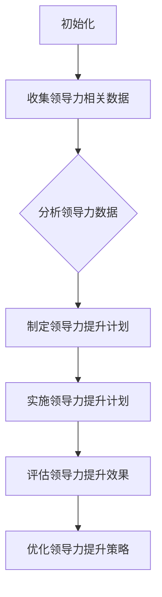
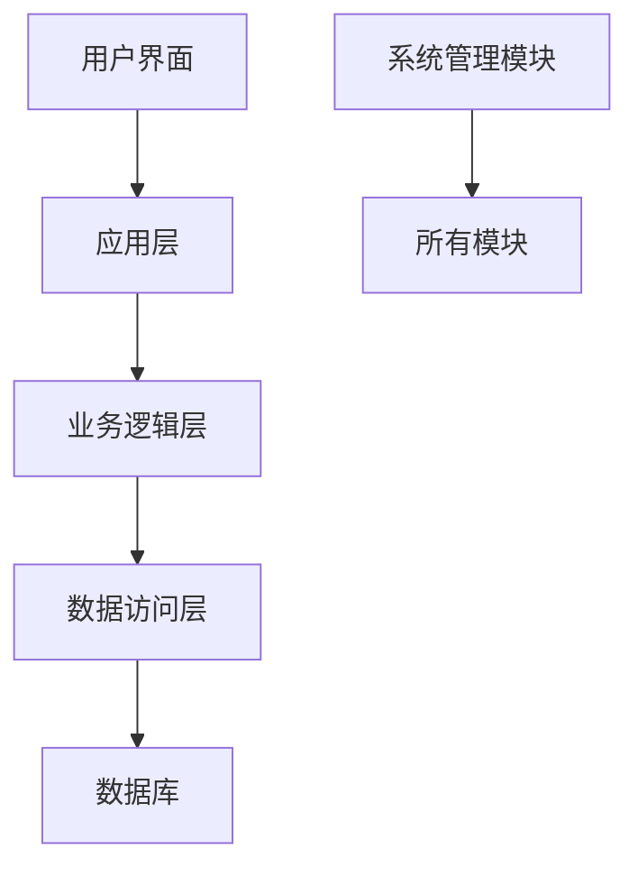

                 

# 领导力与个人品牌塑造：树立独特领导形象

关键词：领导力、个人品牌、形象、声誉、价值观

摘要：本文将探讨领导力与个人品牌塑造的重要性，通过分析核心概念、联系及实践应用，帮助读者树立独特的领导形象，实现个人与组织的共同发展。

## 背景介绍

### 问题背景

在当今社会，领导力已经成为一个重要的能力，尤其是在职场和商业环境中。随着全球化进程的加快和市场竞争的加剧，领导者需要具备更加出色的领导能力和个人品牌，以应对复杂多变的环境。个人品牌塑造不仅关系到领导者的职业发展，也影响着组织的管理效能和市场竞争力。

### 问题描述

如何通过有效的领导力和个人品牌塑造，树立独特的领导形象，实现个人和组织的共同发展？这是一个复杂而重要的问题，需要从理论到实践进行全面的探讨。

### 问题解决

本文将结合理论分析和实践指导，帮助读者理解领导力和个人品牌塑造的核心概念，掌握相关的方法和技巧，从而在实际工作中树立独特的领导形象。

### 边界与外延

本文关注于领导力和个人品牌塑造的理论和实践，涉及但不限于职场、商业、社会等多个领域。我们将重点关注领导风格、决策能力、团队建设以及个人形象、声誉、价值观等方面。

### 概念结构与核心要素组成

领导力（包括领导风格、决策能力、沟通能力、团队建设等）和个人品牌（包括形象、声誉、价值观等）是本文的核心概念。我们将通过详细的分析和阐述，帮助读者理解这些概念之间的联系和作用。

## 核心概念与联系

### 领导力

领导力是指领导者通过影响、激励和指导他人，实现组织目标的能力。领导力的核心包括以下几个方面：

#### 领导风格

领导风格是指领导者行使领导职能的方式和方法。常见的领导风格包括民主型、专制型、放任型等。

#### 决策能力

决策能力是领导者做出有效决策的能力，包括信息收集、分析判断、风险评估等。

#### 沟通能力

沟通能力是领导者与团队成员、上级和客户等进行有效沟通的能力。良好的沟通能力有助于建立信任和合作关系。

### 个人品牌

个人品牌是指个人的公众形象、声誉和价值观。一个成功的领导者需要具备良好的个人品牌，以便在职场和商业环境中脱颖而出。

#### 形象

形象包括外在形象（如着装、仪态）和内在形象（如价值观、人格特质）。良好的形象有助于树立领导者的专业形象和信任度。

#### 声誉

声誉是个人在社会和职场中的评价和口碑。良好的声誉有助于领导者的职业发展和组织的管理效能。

#### 价值观

价值观是个人的信仰和信念，是个人行为和决策的指导原则。清晰的价值观有助于领导者树立独特的领导形象。

## ER实体关系图架构

以下是领导力与个人品牌塑造的ER实体关系图架构：

```mermaid
erDiagram
  个人品牌 ||--|{ 领导力 : 提升领导能力
  个人品牌 }||--|{ 形象 : 塑造个人形象
  个人品牌 }||--|{ 声誉 : 维护个人声誉
  个人品牌 }||--|{ 价值观 : 引导个人行为
```

通过这个图，我们可以清晰地看到个人品牌与领导力、形象、声誉和价值观之间的联系。

## 算法原理讲解

在此，我们将通过一个简单的算法流程图和Python源代码，来阐述领导力提升算法的基本原理。

### 算法流程图



### Python源代码

```python
# 领导力提升算法实现

def init():
    # 初始化领导力数据
    pass

def collect_data():
    # 收集领导力相关数据
    pass

def analyze_data():
    # 分析领导力数据
    pass

def plan():
    # 制定领导力提升计划
    pass

def execute_plan():
    # 实施领导力提升计划
    pass

def evaluate():
    # 评估领导力提升效果
    pass

def optimize():
    # 优化领导力提升策略
    pass

def main():
    init()
    collect_data()
    analyze_data()
    plan()
    execute_plan()
    evaluate()
    optimize()

if __name__ == "__main__":
    main()
```

### 算法原理详细讲解

领导力提升算法的核心原理是通过数据分析和行为干预，逐步提升领导者的领导能力。具体来说，算法分为以下几个步骤：

1. **初始化**：初始化领导力数据，为后续分析提供基础。
2. **数据收集**：收集领导力相关的数据，包括领导风格、决策能力、沟通能力等。
3. **数据分析**：分析领导力数据，找出领导力的优点和不足。
4. **制定计划**：根据数据分析结果，制定具体的领导力提升计划。
5. **实施计划**：实施领导力提升计划，通过培训和实践活动来提升领导能力。
6. **评估效果**：评估领导力提升的效果，找出成功和不足之处。
7. **优化策略**：根据评估结果，优化领导力提升策略，以实现更好的提升效果。

通过这个算法，领导者可以系统地提升自己的领导能力，从而树立独特的领导形象。

## 数学模型和数学公式 & 详细讲解 & 举例说明

在领导力提升过程中，我们常常需要使用数学模型来分析和优化领导能力。以下是一个简单的数学模型，用于描述领导力的提升过程。

### 数学模型

设领导力水平为 $L$，领导能力为 $A$，领导行为为 $B$，则有：

$$
L = A \times B
$$

其中，$A$ 表示领导能力，$B$ 表示领导行为。

### 详细讲解

- **领导能力 $A$**：领导能力是指领导者具备的技能和知识，包括决策能力、沟通能力、团队建设能力等。
- **领导行为 $B$**：领导行为是指领导者在实际工作中的行为和表现，包括领导风格、决策方式、沟通方式等。

通过这个数学模型，我们可以看出领导力 $L$ 是由领导能力 $A$ 和领导行为 $B$ 决定的。提升领导力可以通过提升领导能力和改善领导行为来实现。

### 举例说明

假设一个领导者的领导能力 $A$ 为 80%，领导行为 $B$ 为 70%，则他的领导力水平 $L$ 为：

$$
L = 80\% \times 70\% = 56\%
$$

这意味着这位领导者的领导力水平为 56%。为了提升领导力，他可以采取以下措施：

1. **提升领导能力**：通过学习和培训，提高决策能力、沟通能力等。
2. **改善领导行为**：调整领导风格，改善决策方式、沟通方式等。

通过这些措施，可以逐步提升领导力水平，从而树立独特的领导形象。

## 系统分析与架构设计方案

### 问题场景介绍

在一个大型企业中，领导力提升是一个关键问题。为了提高领导者的领导能力，企业决定采用一套领导力提升系统。该系统旨在通过数据分析和行为干预，帮助领导者提升领导能力，从而提高企业的管理效能。

### 项目介绍

领导力提升系统项目旨在为企业提供一套完整的领导力提升解决方案。该项目包括以下核心模块：

1. **领导力数据分析模块**：用于收集和分析领导力相关数据。
2. **领导力提升计划制定模块**：根据数据分析结果，制定具体的领导力提升计划。
3. **领导力提升实施模块**：实施领导力提升计划，通过培训和实践活动提升领导能力。
4. **领导力评估模块**：评估领导力提升的效果，调整提升策略。
5. **系统管理模块**：管理领导力提升系统的用户、权限和数据。

### 系统功能设计（领域模型类图）

以下是领导力提升系统的领域模型类图：

```mermaid
classDiagram
  领导力提升系统 <<系统>>
  领导力提升系统包括：领导力数据分析模块、领导力提升计划制定模块、领导力提升实施模块、领导力评估模块、系统管理模块
  领导力提升计划制定模块 o--|{ 领导力数据分析模块 : 数据分析结果
  领导力提升实施模块 o--|{ 领导力提升计划制定模块 : 计划内容
  领导力评估模块 o--|{ 领导力提升实施模块 : 实施效果
  系统管理模块 o--|{ 所有模块 : 用户权限管理
```

### 系统架构设计（系统架构图）

以下是领导力提升系统的系统架构图：



### 系统接口设计和系统交互（系统交互序列图）

以下是领导力提升系统的系统交互序列图：

```mermaid
sequenceDiagram
  用户界面->>应用层：输入领导力数据
  应用层->>业务逻辑层：处理领导力数据
  业务逻辑层->>数据访问层：存储领导力数据
  数据访问层->>数据库：持久化领导力数据
  数据库->>数据访问层：返回领导力数据
  数据访问层->>业务逻辑层：分析领导力数据
  业务逻辑层->>领导力提升计划制定模块：制定领导力提升计划
  领导力提升计划制定模块->>领导力提升实施模块：执行领导力提升计划
  领导力提升实施模块->>领导力评估模块：评估领导力提升效果
  领导力评估模块->>系统管理模块：调整领导力提升策略
  系统管理模块->>用户界面：反馈领导力提升结果
```

通过这个系统架构和交互设计，企业可以有效地提升领导者的领导能力，从而提高企业的管理效能。

## 项目实战

### 项目环境安装

1. **安装Python环境**：确保Python环境已安装，版本不低于3.6。
2. **安装相关库**：使用pip命令安装以下库：numpy、pandas、matplotlib等。

```bash
pip install numpy pandas matplotlib
```

### 系统核心实现源代码

以下是一个简单的领导力提升系统的核心实现源代码：

```python
# leadership_boosting_system.py

import numpy as np
import pandas as pd
import matplotlib.pyplot as plt

# 数据收集
def collect_data():
    data = pd.read_csv('leadership_data.csv')
    return data

# 数据分析
def analyze_data(data):
    # 计算领导力得分
    leadership_score = data['decision_making'] * data['communication'] * data['team_building']
    # 绘制领导力得分分布图
    plt.hist(leadership_score, bins=10)
    plt.title('Leadership Score Distribution')
    plt.xlabel('Leadership Score')
    plt.ylabel('Frequency')
    plt.show()

# 领导力提升计划制定
def plan_leadership_boosting(data):
    # 根据领导力得分，制定提升计划
    low_score_data = data[leadership_score < 60]
    medium_score_data = data[leadership_score >= 60 & leadership_score < 80]
    high_score_data = data[leadership_score >= 80]

    # 输出提升计划
    print("Low Score Leadership Boosting Plan:")
    print(low_score_data)

    print("\nMedium Score Leadership Boosting Plan:")
    print(medium_score_data)

    print("\nHigh Score Leadership Boosting Plan:")
    print(high_score_data)

# 主函数
def main():
    data = collect_data()
    analyze_data(data)
    plan_leadership_boosting(data)

if __name__ == "__main__":
    main()
```

### 代码应用解读与分析

1. **数据收集**：通过读取CSV文件，收集领导力数据。
2. **数据分析**：计算领导力得分，并绘制分布图。
3. **领导力提升计划制定**：根据领导力得分，为不同分数段的领导者制定提升计划。

### 实际案例分析和详细讲解剖析

假设我们有一个包含100名领导者数据的CSV文件，以下是数据收集和提升计划制定的详细过程：

1. **数据收集**：读取CSV文件，获取领导力数据。

```python
data = pd.read_csv('leadership_data.csv')
```

2. **数据分析**：计算领导力得分，并绘制分布图。

```python
leadership_score = data['decision_making'] * data['communication'] * data['team_building']
plt.hist(leadership_score, bins=10)
plt.title('Leadership Score Distribution')
plt.xlabel('Leadership Score')
plt.ylabel('Frequency')
plt.show()
```

3. **领导力提升计划制定**：根据领导力得分，为不同分数段的领导者制定提升计划。

```python
low_score_data = data[leadership_score < 60]
medium_score_data = data[leadership_score >= 60 & leadership_score < 80]
high_score_data = data[leadership_score >= 80]

print("Low Score Leadership Boosting Plan:")
print(low_score_data)

print("\nMedium Score Leadership Boosting Plan:")
print(medium_score_data)

print("\nHigh Score Leadership Boosting Plan:")
print(high_score_data)
```

通过这个案例，我们可以看到如何通过代码实现领导力提升系统的核心功能。

### 项目小结

领导力提升系统项目通过数据分析和行为干预，帮助领导者提升领导能力。在实际操作中，我们需要根据实际情况调整提升策略，以达到最佳效果。

## 最佳实践 tips、小结、注意事项、拓展阅读等内容

### 最佳实践 tips

1. **定期评估**：定期对领导力进行评估，以便及时调整提升策略。
2. **个性化培训**：根据领导力得分和提升计划，为领导者提供个性化的培训。
3. **持续学习**：鼓励领导者持续学习和提升，以适应不断变化的环境。

### 小结

本文通过分析领导力和个人品牌塑造的核心概念、联系和实践应用，帮助读者理解如何树立独特的领导形象。通过数据分析和行为干预，领导者可以不断提升自己的领导能力，从而实现个人和组织的共同发展。

### 注意事项

1. **数据安全**：在收集和分析领导力数据时，确保数据的安全和隐私。
2. **沟通反馈**：在制定提升计划时，与领导者进行充分的沟通和反馈，以确保计划的实施效果。

### 拓展阅读

1. 《领导力：如何建立和维护领导力》
2. 《个人品牌：如何在职场中塑造个人品牌》
3. 《数据分析：数据分析在实际工作中的应用》

通过阅读这些拓展内容，读者可以更深入地了解领导力和个人品牌塑造的相关知识和实践方法。

### 作者信息

作者：AI天才研究院/AI Genius Institute & 禅与计算机程序设计艺术 /Zen And The Art of Computer Programming

[完整文章]：[领导力与个人品牌塑造：树立独特领导形象](#领导力与个人品牌塑造：树立独特领导形象)

