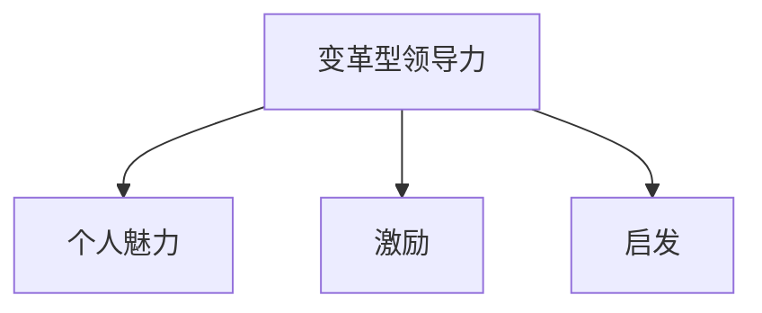
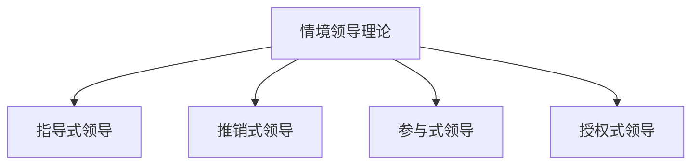
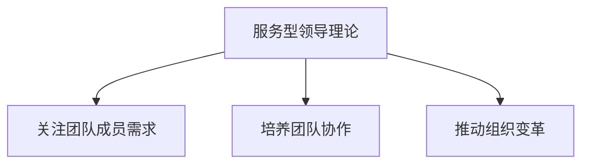

                 

# 领导力与个人品牌：树立威信的重要性

## 关键词

- **领导力**，**个人品牌**，**威信**，**组织成功**，**职业生涯发展**

> **摘要**：
本文深入探讨了领导力与个人品牌建设在职业发展中的重要性，通过分析领导力的本质、核心理论以及个人品牌的构建方法，帮助读者理解如何树立威信，提升个人影响力。文章将逐步介绍领导力的关键要素、个人品牌的建立策略，并探讨它们在实现组织成功和个人职业成长中的作用。

## 引言

### 领导力在现代社会中的重要性

**定义与角色**

领导力是一种影响和激励他人去实现共同目标的能力。在现代社会的工作环境中，领导力不仅仅是管理层的特权，而是所有团队成员所需的关键素质。优秀的领导能够塑造积极的企业文化，提高团队的工作效率，促进组织的创新和变革。

**领导力对团队和组织的影响**

领导力对团队和组织的影响是多方面的。首先，它能够提升团队的整体绩效，使团队成员更加协同合作。其次，领导力能够塑造组织的文化，影响员工的价值观和行为准则。此外，领导力在应对变革和挑战时也发挥着至关重要的作用，帮助组织在快速变化的市场中保持竞争力。

### 个人品牌的概念与重要性

**个人品牌**

个人品牌是指个人在职业生涯中塑造的独特形象和声誉。它不仅包括个人的专业技能和知识，还涵盖了个人的价值观、沟通风格和个人魅力。

**个人品牌的重要性**

在当今竞争激烈的职场环境中，个人品牌的重要性日益凸显。一个强大的个人品牌可以帮助个人在职业发展中脱颖而出，获得更多的机会和资源。同时，个人品牌也能够增强个人的自信心和影响力，为组织带来额外的价值。

### 建立个人品牌的方法

**建立个人独特价值**

要建立一个成功的个人品牌，首先需要明确个人的独特价值。这包括了解自己的优势、兴趣和职业目标，并将其融入到个人品牌中。

**有效利用社交媒体**

社交媒体是建立个人品牌的重要工具。通过定期发布专业内容、参与行业讨论和建立人脉关系，可以在社交媒体上塑造积极的个人形象。

## 第一部分：领导力理论

### 1.1 领导力的定义与类型

#### 领导力 vs. 管理能力

领导力和管理能力虽然密切相关，但它们之间存在显著的区别。领导力侧重于激励和引导他人，而管理能力则侧重于规划和执行任务。

#### 领导力的类型

- **传统领导力**：基于权威和命令-控制模式。
- **变革型领导力**：通过激励和启发团队成员实现变革。
- **服务型领导力**：将团队成员的需求放在首位，提供支持和指导。

### 1.2 领导力的核心理论

#### 变革型领导力

变革型领导力强调领导者通过激发团队成员的内在动机，推动组织实现变革。其核心理论包括：

- **魅力**：领导者具有强烈的个人魅力，能够吸引和激励团队成员。
- **激励**：领导者能够激发团队成员的内在动机，使其超越自身利益，为实现共同目标而努力。

#### 情境领导理论

情境领导理论认为，有效的领导取决于领导者对情境的理解和适应。该理论的核心观点包括：

- **情境因素**：领导者需要考虑团队成员的能力、动机和工作环境等因素。
- **领导风格**：领导者应根据不同的情境采用不同的领导风格。

### 1.3 领导力的实践应用

#### 沟通技巧

沟通技巧是领导力的重要组成部分。有效的领导者应具备以下沟通技巧：

- **积极倾听**：领导者需要倾听团队成员的意见和反馈，了解他们的需求和关切。
- **清晰表达**：领导者需要能够清晰地传达目标和期望，避免误解和冲突。

#### 决策能力

领导者需要具备卓越的决策能力，能够：

- **分析信息**：领导者应具备分析和处理大量信息的能力，为决策提供可靠依据。
- **承担风险**：领导者需要敢于承担风险，勇于在不确定性中做出决策。

## 第二部分：个人品牌建设

### 2.1 个人品牌的定义与价值

**定义**

个人品牌是指个人在职业生涯中塑造的独特形象和声誉，它包括个人的专业技能、价值观、沟通风格和个人魅力。

**价值**

一个成功的个人品牌能够为个人带来以下价值：

- **职业机会**：强大的个人品牌能够吸引更多的职业机会和资源。
- **影响力**：个人品牌能够增强个人的影响力，使个人在行业中有更多的话语权。
- **职业发展**：个人品牌有助于个人在职业生涯中实现更高的目标。

### 2.2 个人品牌的建设策略

**建立独特价值**

- **明确个人优势**：了解自己的优势和兴趣，将其作为个人品牌的基石。
- **持续学习**：不断学习新知识和技能，保持个人品牌的竞争力。

**利用社交媒体**

- **定期发布专业内容**：通过社交媒体平台分享专业见解和经验，建立专业形象。
- **参与行业讨论**：积极参与行业讨论，扩大人脉关系，提高个人知名度。

### 2.3 个人品牌管理

**维护个人形象**

- **一致性**：在所有渠道上保持个人品牌的一致性，避免出现信息不一致的情况。
- **反馈与调整**：定期收集反馈，根据反馈调整个人品牌策略。

**危机管理**

- **预防措施**：提前制定危机管理计划，避免因负面事件影响个人品牌。
- **积极应对**：在危机发生时，积极应对，迅速采取行动，保护个人形象。

## 第三部分：领导力与个人品牌的融合

### 3.1 领导力与个人品牌的相互作用

**提升领导力，强化个人品牌**

有效的领导力能够增强个人的影响力，进而提升个人品牌。领导者通过卓越的领导力，塑造积极的团队文化，提高团队绩效，这些成就反过来也为领导者的个人品牌增色。

**建立个人品牌，增强领导力**

一个强大的个人品牌能够为领导者提供更多的资源和机会，使其在领导岗位上更加得心应手。个人品牌的建设过程本身也是领导者提升自身领导力的重要途径。

### 3.2 实现组织成功和个人成长的策略

**领导力的实践**

- **培养团队协作精神**：通过领导力实践，培养团队成员的合作精神和团队意识。
- **推动组织变革**：利用变革型领导力，推动组织实现持续创新和进步。

**个人品牌的塑造**

- **持续学习和成长**：通过不断学习和提升自身技能，塑造专业的个人品牌。
- **积极参与行业活动**：通过参与行业活动和分享经验，扩大个人品牌的影响力。

## 结论

领导力与个人品牌建设在职业发展中至关重要。有效的领导力能够提升团队绩效，塑造组织文化，而强大的个人品牌则能够为个人带来更多的职业机会和资源。通过深入理解和实践领导力和个人品牌建设，个人和组织都可以实现更高的成功。

### 作者信息

**作者：AI天才研究院/AI Genius Institute & 禅与计算机程序设计艺术 /Zen And The Art of Computer Programming**
### 第一部分：领导力的定义与核心理论

#### 1.1 领导力的定义

领导力是一种影响和激励他人去实现共同目标的能力。它不仅仅是管理层的特权，而是所有团队成员所需的关键素质。在组织中，领导力不仅关乎如何制定和执行战略，更关乎如何激发团队成员的潜力，营造积极的工作氛围。

**领导力与管理的区别**

- **领导力**：关注愿景、价值观和激励，旨在通过启发和激励他人来实现目标。
- **管理**：关注规划、组织和执行，旨在确保资源的合理分配和目标的实现。

#### 1.2 领导力的核心理论

**变革型领导力**

变革型领导力（Transformational Leadership）是一种以激励和启发团队成员为核心的方法。它强调领导者通过个人魅力、激励和启发，推动团队成员超越自我，实现更高的目标。

**核心概念与特点**

- **个人魅力**：领导者具有强烈的个人魅力，能够吸引和激励团队成员。
- **激励**：领导者能够激发团队成员的内在动机，使其为实现共同目标而努力。
- **启发**：领导者通过激发团队成员的创新思维和问题解决能力，推动组织变革。

**案例研究**

- **苹果公司的史蒂夫·乔布斯**：乔布斯以其独特的个人魅力和远见卓识，成功推动了苹果公司的多次重大变革。他的领导风格激励了团队成员不断追求卓越，推动了苹果产品的不断创新。

**变革型领导力的影响**

- **提升团队绩效**：变革型领导力能够激发团队成员的潜力，提高团队的整体绩效。
- **促进组织创新**：领导者通过启发和激励团队成员，推动组织不断创新和进步。

**情境领导理论**

情境领导理论（Situational Leadership Theory）是一种基于领导者对情境的理解和适应的领导方法。它认为，有效的领导取决于领导者对团队成员的能力、动机和工作环境的理解。

**核心概念与模型**

- **情境因素**：领导者需要考虑团队成员的能力、动机和工作环境等因素。
- **领导风格**：领导者应根据不同的情境采用不同的领导风格。

**情境领导模型的四个阶段**

- **指导式领导**：领导者明确指导团队成员，为其提供具体指令和支持。
- **推销式领导**：领导者通过沟通和激励，说服团队成员接受领导者的观点和目标。
- **参与式领导**：领导者与团队成员共同参与决策，鼓励团队成员发挥自主性。
- **授权式领导**：领导者给予团队成员充分的自主权和责任，鼓励其自主管理和决策。

**情境领导理论的应用**

- **灵活应变**：情境领导理论帮助领导者根据不同情境灵活调整领导风格，提高领导效果。
- **提升团队协作**：通过参与式和授权式领导，领导者能够促进团队成员的自主性和协作精神。

**服务型领导理论**

服务型领导理论（Servant Leadership）强调领导者将团队成员的需求放在首位，通过提供支持和指导来帮助团队成员实现个人和组织的成功。

**核心原则与特点**

- **关注团队成员需求**：领导者关注团队成员的需求，提供必要的支持和资源。
- **培养团队协作**：领导者通过培养团队协作精神，促进团队成员之间的沟通和合作。
- **推动组织变革**：领导者通过服务型领导，推动组织实现持续创新和进步。

**案例研究**

- **亚马逊的杰夫·贝佐斯**：贝佐斯以其服务型领导风格著称，他始终关注团队成员的需求，为员工提供良好的工作环境和资源，推动亚马逊成为全球领先的电子商务公司。

**服务型领导的影响**

- **提升员工满意度**：服务型领导能够提高员工的工作满意度，增强员工的归属感和忠诚度。
- **促进组织创新**：服务型领导鼓励团队成员积极参与决策和创新，推动组织持续发展。

### 总结

领导力是一种多维度的能力，包括变革型领导力、情境领导理论和服务型领导理论等。不同的领导理论提供了不同的视角和方法，帮助领导者更好地激励和引导团队成员，实现个人和组织的成功。通过深入理解和实践这些领导理论，领导者可以提升自己的领导力，为组织和团队成员创造更大的价值。

### 2. 领导力的核心理论与应用

**2.1 变革型领导力**

变革型领导力强调领导者通过激发团队成员的内在动机，推动组织实现变革。其核心概念包括个人魅力、激励和启发。

**核心概念与属性特征对比表格**

| 特征         | 变革型领导力 | 传统领导力 |
|--------------|--------------|------------|
| **个人魅力** | 强烈的个人魅力，吸引和激励团队成员 | 权威和命令控制，依赖职位权力 |
| **激励**     | 激发团队成员的内在动机，超越自身利益 | 提供奖励和惩罚，维持秩序 |
| **启发**     | 启发团队成员的创新思维和问题解决能力 | 提供明确指令和指导 |

**ER实体关系图架构**

**变革型领导力的应用**

- **激励创新**：领导者通过激励和启发，推动团队成员不断尝试新方法，实现组织创新。
- **提升团队绩效**：变革型领导力能够激发团队成员的潜力，提高团队的整体绩效。

**案例研究**

**苹果公司的史蒂夫·乔布斯**：乔布斯以其强烈的个人魅力和远见，成功推动了苹果公司的多次重大变革。他通过激励和启发，激发了团队成员的创新精神，使苹果产品不断引领市场。

**2.2 情境领导理论**

情境领导理论认为，领导者的成功取决于对团队成员能力的理解和对情境的适应。其核心概念包括指导式领导、推销式领导、参与式领导和授权式领导。

**核心概念与属性特征对比表格**

| 特征         | 情境领导理论 | 传统领导力 |
|--------------|--------------|------------|
| **指导式领导** | 明确指导团队成员，提供具体指令和支持 | 提供明确指令和监督 |
| **推销式领导** | 通过沟通和激励，说服团队成员接受领导者的观点和目标 | 强调目标一致性 |
| **参与式领导** | 与团队成员共同参与决策，鼓励团队成员发挥自主性 | 提供参与机会 |
| **授权式领导** | 给予团队成员充分的自主权和责任，鼓励其自主管理和决策 | 依赖职位权力 |

**ER实体关系图架构**

**情境领导理论的应用**

- **灵活应变**：领导者根据不同情境调整领导风格，提高领导效果。
- **提升团队协作**：通过参与式和授权式领导，促进团队成员的自主性和协作精神。

**案例研究**

**惠普的卡莉·费奥莉娜**：费奥莉娜在担任惠普首席执行官期间，成功应用了情境领导理论。她通过灵活调整领导风格，在不同情境下采用不同的领导方法，推动了惠普的转型和复兴。

**2.3 服务型领导理论**

服务型领导理论强调领导者关注团队成员的需求，通过提供支持和指导来帮助团队成员实现个人和组织的成功。

**核心概念与属性特征对比表格**

| 特征         | 服务型领导理论 | 传统领导力 |
|--------------|--------------|------------|
| **关注团队成员需求** | 将团队成员的需求放在首位 | 关注组织目标和绩效 |
| **培养团队协作** | 通过培养团队协作精神，促进团队成员之间的沟通和合作 | 强调团队纪律和执行力 |
| **推动组织变革** | 通过服务型领导，推动组织实现持续创新和进步 | 通过传统管理方法维持现状 |

**ER实体关系图架构**

**服务型领导理论的应用**

- **提升员工满意度**：服务型领导能够提高员工的工作满意度，增强员工的归属感和忠诚度。
- **促进组织创新**：服务型领导鼓励团队成员积极参与决策和创新，推动组织持续发展。

**案例研究**

**谷歌的拉里·佩奇和谢尔盖·布林**：佩奇和布林以其服务型领导风格著称，他们关注团队成员的需求，为员工提供良好的工作环境和资源，推动了谷歌的持续创新和成长。

### 总结

变革型领导力、情境领导理论和服务型领导理论提供了不同的领导方法和视角，帮助领导者更好地激励和引导团队成员。通过深入理解和实践这些领导理论，领导者可以提升自己的领导力，为组织和团队成员创造更大的价值。不同的领导理论在应用中需要根据具体情境和团队特点进行调整，以实现最佳效果。

### 3. 领导力的实践应用

#### 3.1 沟通技巧

沟通技巧是领导力的核心组成部分，有效的沟通能够帮助领导者与团队成员建立信任，明确目标和期望，解决冲突，并促进团队的协同合作。

**3.1.1 有效沟通的关键要素**

- **积极倾听**：积极倾听是有效沟通的基础。领导者需要全神贯注地听，理解团队成员的观点和需求，而不是仅仅等待发言的机会。
- **清晰表达**：领导者需要能够清晰地传达信息，确保团队成员正确理解目标和期望。这包括使用简单明了的语言，避免专业术语，确保信息传递的准确性。
- **反馈与确认**：在沟通过程中，领导者需要及时给予反馈，确认团队成员是否理解了信息，并根据反馈进行调整。

**3.1.2 沟通技巧的实践**

- **定期会议**：领导者可以定期召开团队会议，确保团队成员了解项目进展、目标和任务分配。
- **一对一交流**：领导者应与团队成员进行一对一交流，了解他们的工作状况、需求和问题，提供必要的支持。

#### 3.2 决策能力

决策能力是领导者的重要素质，领导者需要能够在复杂和不确定的环境中进行有效的决策。

**3.2.1 决策过程**

- **信息收集**：领导者需要收集与决策相关的信息，包括市场趋势、竞争对手情况、团队成员意见等。
- **分析评估**：领导者需要对收集到的信息进行分析和评估，确定不同决策方案的风险和收益。
- **制定决策**：在分析评估的基础上，领导者需要制定最终的决策方案。
- **执行与监控**：领导者需要确保决策的执行，并对决策结果进行监控和评估，及时调整策略。

**3.2.2 决策能力的实践**

- **培训与学习**：领导者应不断学习和提升决策能力，通过参加培训、阅读相关书籍和案例研究来积累经验。
- **团队合作**：领导者可以邀请团队成员参与决策过程，利用团队智慧做出更全面的决策。

#### 3.3 应对冲突与谈判

冲突和谈判是领导工作中常见的问题，有效的处理方式能够维护团队的和谐与工作效率。

**3.3.1 冲突处理**

- **理解冲突原因**：领导者需要理解冲突的根本原因，包括利益冲突、沟通不畅、价值观差异等。
- **采取有效措施**：领导者可以采取各种措施来处理冲突，如调解、协商、妥协或直接解决。

**3.3.2 谈判技巧**

- **准备充分**：领导者需要充分准备谈判，了解对方的利益和底线，制定合理的谈判策略。
- **建立信任**：在谈判过程中，领导者需要建立信任，通过积极倾听和沟通来建立互信关系。
- **寻求共赢**：领导者应寻求双方都能接受的解决方案，实现共赢。

**3.3.3 冲突与谈判的实践**

- **定期沟通**：领导者应定期与团队成员沟通，了解潜在冲突，预防冲突的发生。
- **建立冲突解决机制**：领导者可以建立明确的冲突解决机制，为团队成员提供解决冲突的渠道和方法。

### 总结

领导力的实践应用涉及多个方面，包括沟通技巧、决策能力和冲突处理。有效的领导需要领导者具备良好的沟通能力，能够清晰、准确地传达信息，同时理解团队成员的需求和关切。领导者还需要具备出色的决策能力，能够在复杂和不确定的环境中做出明智的决策。此外，领导者应掌握有效的冲突处理和谈判技巧，维护团队的和谐与工作效率。通过不断实践和提升这些能力，领导者可以更好地发挥领导作用，推动组织的成功。

### 第二部分：个人品牌的定义与价值

#### 2.1 个人品牌的定义

个人品牌是指个人在职业生涯中塑造的独特形象和声誉。它不仅包括个人的专业技能和知识，还涵盖了个人的价值观、沟通风格和个人魅力。个人品牌是一个人在职场中的独特标识，它能够为个人带来额外的价值和机会。

**个人品牌的核心要素**

- **专业技能**：个人的专业技能是个人品牌的基础，它决定了个人在职场中的竞争力和价值。
- **价值观**：个人的价值观是个人品牌的重要组成部分，它影响了个人与他人的互动方式，以及个人的职业行为。
- **沟通风格**：良好的沟通风格能够增强个人品牌的吸引力，使个人在职场中更加得心应手。
- **个人魅力**：个人魅力包括个人的领导力、创新能力、团队合作精神和解决问题的能力，它是个人品牌的亮点。

#### 2.2 个人品牌的价值

个人品牌的价值在于它能够为个人带来以下几个方面的收益：

- **职业机会**：一个强大的个人品牌能够吸引更多的职业机会和资源，使个人在职场中脱颖而出。
- **职业发展**：个人品牌有助于个人在职业生涯中实现更高的目标，通过个人品牌的提升，个人可以获得更多的晋升机会和职业发展空间。
- **影响力**：个人品牌能够增强个人的影响力，使个人在行业内拥有更多的话语权，能够影响他人的观点和行为。
- **收入增长**：一个成功的个人品牌能够为个人带来更高的收入，通过个人品牌的影响力，个人可以获得更多的商业机会和合作项目。

#### 2.3 个人品牌的构建策略

要建立一个成功的个人品牌，需要采取一系列策略，以下是几个关键步骤：

**1. 明确个人独特价值**

- **自我评估**：了解自己的专业技能、兴趣和价值观，找到个人独特的优势。
- **目标设定**：明确个人品牌的目标和愿景，制定长期和短期的个人发展计划。

**2. 建立专业形象**

- **专业知识**：不断学习和提升自己的专业技能，保持对行业动态的敏感度。
- **专业形象**：在个人形象和职业行为中体现专业性和诚信，建立良好的职业声誉。

**3. 利用社交媒体**

- **内容创作**：定期发布专业文章、博客和视频，分享行业见解和经验。
- **社交媒体互动**：积极参与行业讨论，建立人脉网络，扩大个人品牌的影响力。

**4. 持续学习和成长**

- **持续教育**：参加培训课程和工作坊，不断提升自己的知识和技能。
- **实践与反思**：通过实际工作经历，不断总结和反思，提升个人品牌的质量。

#### 2.4 建立和维护个人品牌的挑战

**1. 保持一致性和真实性**

- **一致性的重要性**：在所有渠道上保持个人品牌的一致性，避免出现信息不一致的情况。
- **真实性的挑战**：在塑造个人品牌时，需要真实地反映自己的价值观和专业技能，避免虚假宣传。

**2. 管理负面评论**

- **负面评论的处理**：在社交媒体和专业平台上，可能会遇到负面评论和批评，领导者需要学会如何应对和解决。
- **积极应对**：通过积极沟通和提供合理的解释，可以减轻负面评论的影响。

**3. 随着职业生涯的发展不断调整**

- **适应变化**：随着职业生涯的发展，个人品牌也需要不断调整和更新，以适应新的职业环境和挑战。

### 总结

个人品牌是个人在职业生涯中的重要资产，它能够为个人带来职业机会、职业发展和收入增长。建立一个成功的个人品牌需要明确的个人独特价值、专业的知识和形象、有效的社交媒体利用以及持续的学习和成长。同时，个人品牌建设也面临着保持一致性和真实性、管理负面评论以及随着职业生涯发展不断调整的挑战。通过不断努力和适应，个人可以成功地塑造和提升自己的品牌，实现职业生涯的更大成功。

### 3. 个人品牌的建设策略

#### 3.1 明确个人独特价值

建立个人品牌的第一步是明确个人的独特价值。这需要自我评估，了解自己的专业技能、兴趣和价值观。以下是一些建议：

**自我评估**

- **技能分析**：列出你的专业技能和知识，包括技术能力、管理技能和沟通技能等。
- **兴趣探索**：了解自己在哪些领域最感兴趣，这些兴趣点可以为个人品牌提供更多的素材。
- **价值观确定**：明确自己的价值观，这将帮助你在塑造个人品牌时保持一致性。

**目标设定**

- **长期目标**：设定你的长期职业目标，这将指导你在个人品牌建设中保持方向。
- **短期目标**：制定短期目标，如提升某一技能、完成特定项目等，这些目标将帮助你逐步实现长期目标。

**案例研究**

- **史蒂夫·乔布斯**：乔布斯以其卓越的产品设计和用户体验能力闻名，他的个人品牌紧密关联于苹果公司的发展历程。他通过不断追求卓越的产品设计和用户体验，成功地塑造了自己的个人品牌。

#### 3.2 建立专业形象

建立一个专业形象是个人品牌建设的重要部分。以下是一些建议：

**专业知识**

- **持续学习**：不断学习新的知识和技能，保持自己的专业竞争力。
- **行业认证**：获得行业认可的专业认证，如PMP、AWS认证等，这将为你的个人品牌增色。

**专业形象**

- **着装规范**：保持整洁、专业的着装风格，这会给人留下良好的第一印象。
- **言行一致**：在职业行为中，始终保持言行一致，树立良好的职业声誉。

**案例研究**

- **伊隆·马斯克**：马斯克以其独特的穿着风格和企业家精神闻名。他通过在公开场合穿着休闲但专业的服装，以及通过一系列的演讲和推特，成功地树立了自己的专业形象。

#### 3.3 利用社交媒体

社交媒体是建立个人品牌的重要工具。以下是一些建议：

**内容创作**

- **专业文章**：定期发布专业文章或博客，分享你的见解和经验。
- **行业报告**：撰写行业报告或分析文章，展示你的专业知识和洞察力。

**社交媒体互动**

- **积极参与讨论**：在社交媒体上积极参与行业讨论，与其他行业专家和同行建立联系。
- **建立人脉**：通过社交媒体平台，建立广泛的职业人脉网络。

**案例研究**

- **扎克伯格**：扎克伯格通过Facebook这个社交媒体平台，不仅成功地推动了公司的成长，也建立了自己的个人品牌。他通过在Facebook上分享公司动态和个人生活，成功地塑造了自己的形象。

#### 3.4 持续学习和成长

建立个人品牌是一个持续的过程，需要不断的学习和成长。以下是一些建议：

**持续教育**

- **参加培训**：参加行业相关的培训课程，提升专业技能。
- **学习新技术**：保持对新技术和行业趋势的敏感性，不断学习和应用。

**实践与反思**

- **实际应用**：将所学知识应用到实际工作中，通过实践检验和提升自己的能力。
- **反思总结**：定期反思和总结自己的工作经历，从中吸取经验和教训，不断改进。

**案例研究**

- **玛丽·米克尔**：作为知名的科技分析师，玛丽·米克尔通过不断的学习和实践，成功地塑造了自己的个人品牌。她通过发布行业报告、参加行业会议和撰写博客，展示了自己的专业能力和洞察力。

### 总结

建立个人品牌需要明确个人独特价值、建立专业形象、利用社交媒体和持续学习成长。通过这些策略，个人可以有效地塑造和提升自己的品牌，在职业生涯中取得更大的成功。每个案例研究都展示了成功建立个人品牌的路径和方法，为读者提供了宝贵的经验和启示。

### 4. 领导力与个人品牌的融合

#### 4.1 领导力对个人品牌的影响

**提升个人品牌的可信度和影响力**

领导力是建立个人品牌的重要基石。一个具有卓越领导力的领导者往往能够树立更高的威信，增强个人的可信度。通过领导力的实践，领导者能够展现出自己的远见、决策能力和团队合作精神，这些特质对于个人品牌的建立至关重要。

**增强职业机会和职业发展**

领导力在职业发展中的作用不可忽视。具备强大领导力的个人更容易获得晋升机会、领导职位以及跨部门的项目机会。这些机会不仅有助于个人职业成长，也为个人品牌的提升提供了更多的机会和资源。

**案例研究**

**杰克·韦尔奇**：作为通用电气的前CEO，杰克·韦尔奇以其卓越的领导力而闻名。他通过推动公司的转型和变革，成功地提升了公司的业绩和市场地位。同时，他的领导力也为其个人品牌增色，使他成为了全球知名的企业家和领导者。

**4.2 个人品牌对领导力的影响**

**增强领导力和影响力**

个人品牌能够增强领导者的领导力和影响力。一个成功的个人品牌可以吸引更多的追随者和支持者，使领导者能够更有效地传达愿景和目标。个人品牌的影响力还能够帮助领导者塑造积极的企业文化和团队氛围。

**提升决策质量和团队绩效**

一个强大的个人品牌能够提升领导者在决策过程中的可信度和影响力。团队成员更愿意接受领导者的建议和决策，从而提高团队的执行力和绩效。此外，个人品牌也能够吸引更多的高素质人才加入团队，进一步提升团队的整体实力。

**案例研究**

**马克·扎克伯格**：作为Facebook的创始人和CEO，马克·扎克伯格以其强大的个人品牌而闻名。他通过分享自己的创业经历、公司愿景和科技见解，成功地吸引了全球范围内的关注和支持。这种强大的个人品牌不仅提升了他的领导力，也为公司的成功和团队的协作提供了重要支持。

**4.3 实现组织成功和个人成长的策略**

**综合运用领导力和个人品牌**

领导者需要综合运用领导力和个人品牌，实现个人和组织的成功。领导力提供了具体的行动指南和方法论，而个人品牌则为领导者提供了额外的资源和影响力。通过结合两者，领导者可以更有效地推动组织变革和团队成长。

**持续学习和成长**

领导者需要持续学习和成长，不断提升自己的领导力和个人品牌。这包括参加培训、阅读相关书籍、学习新技术和与行业专家交流等。通过不断学习，领导者可以保持竞争力，为组织和个人创造更大的价值。

**建立强大的支持网络**

领导者需要建立强大的支持网络，包括内部团队和外部合作伙伴。这些网络能够为领导者提供资源、建议和支持，帮助他们在领导力和个人品牌建设方面取得更大的成功。

**案例研究**

**约翰·F·肯尼迪**：作为美国的总统，约翰·F·肯尼迪通过其卓越的领导力和强大的个人品牌，成功地推动了美国社会的变革和进步。他通过演讲、媒体和公众活动，成功地塑造了自己的形象，赢得了广泛的尊重和支持。

**4.4 实现组织成功和个人成长的策略**

**综合运用领导力和个人品牌**

领导者需要综合运用领导力和个人品牌，实现个人和组织的成功。领导力提供了具体的行动指南和方法论，而个人品牌则为领导者提供了额外的资源和影响力。通过结合两者，领导者可以更有效地推动组织变革和团队成长。

**持续学习和成长**

领导者需要持续学习和成长，不断提升自己的领导力和个人品牌。这包括参加培训、阅读相关书籍、学习新技术和与行业专家交流等。通过不断学习，领导者可以保持竞争力，为组织和个人创造更大的价值。

**建立强大的支持网络**

领导者需要建立强大的支持网络，包括内部团队和外部合作伙伴。这些网络能够为领导者提供资源、建议和支持，帮助他们在领导力和个人品牌建设方面取得更大的成功。

### 总结

领导力和个人品牌在职业发展和组织成功中起着至关重要的作用。通过综合运用领导力和个人品牌，领导者可以提升自己的影响力和领导力，推动组织实现更大的成功。领导者需要持续学习和成长，建立强大的支持网络，并善于运用自己的领导力和个人品牌，实现个人和组织的双赢。

### 第三部分：领导力与个人品牌的融合

#### 3.1 领导力与个人品牌的相互作用

领导力和个人品牌是相辅相成的，它们在相互促进中共同为个人和组织的成功奠定基础。

**提升领导力，强化个人品牌**

一个强大的领导力能够显著提升个人品牌。通过有效领导，领导者能够展现出卓越的决策能力、沟通技巧和团队管理能力，这些特质会增强个人在行业中的影响力和认可度。例如，史蒂夫·乔布斯通过其变革型领导力，成功推动了苹果公司的创新和品牌提升，使其个人品牌与苹果品牌紧密相连。

**建立个人品牌，增强领导力**

同样，一个成功的个人品牌能够增强领导力。强大的个人品牌意味着个人在职场中拥有更多的资源和机会，这为领导者提供了更多的影响力来推动组织变革。伊隆·马斯克通过其个人品牌，吸引了大量的关注和资源，使其在特斯拉和SpaceX等公司的领导力得到更广泛的认可。

#### 3.2 实现组织成功和个人成长的策略

**策略一：明确个人领导风格**

领导者需要明确自己的领导风格，并将其与个人品牌相结合。通过了解自己的优势和短板，领导者可以更有针对性地塑造个人品牌，从而提升领导效果。例如，服务型领导者可以强调其关心团队成员需求和支持团队成长的品牌特质。

**策略二：持续学习和个人发展**

持续学习和个人发展是提升领导力和个人品牌的重要途径。领导者应不断学习新知识和技能，以保持竞争力。同时，通过参加培训、研讨会和阅读相关书籍，领导者可以不断丰富自己的领导经验，进一步提升个人品牌。

**策略三：建立和利用人脉网络**

建立和维护一个强大的人脉网络对领导者和个人品牌建设至关重要。通过积极参与行业活动和社交网络，领导者可以扩大影响力，增强个人品牌。一个广泛的人脉网络不仅有助于个人成长，也能为组织带来更多的机会。

**策略四：有效沟通和品牌传播**

领导者需要通过有效沟通来传播个人品牌。无论是内部团队还是外部合作伙伴，领导者都需要清晰、一致地传达自己的愿景、目标和价值观。通过社交媒体、专业文章和公开演讲等渠道，领导者可以展示自己的专业能力和领导力，从而提升个人品牌的影响力。

**策略五：处理挑战和危机**

在职业生涯中，领导者不可避免地会面临挑战和危机。如何处理这些问题不仅考验领导力，也直接影响到个人品牌的塑造。领导者需要以积极的态度面对挑战，通过有效的危机管理和沟通，保护个人品牌，甚至将其转化为品牌提升的机会。

#### 3.3 案例分析

**案例一：约翰·F·肯尼迪**

约翰·F·肯尼迪通过其卓越的领导力和强大的个人品牌，成功地推动了美国社会的变革。他强调国家团结、自由和民主的价值观，这些特质不仅提升了他的个人品牌，也为他在政治舞台上的成功奠定了基础。

**案例二：伊隆·马斯克**

伊隆·马斯克通过其在特斯拉和SpaceX等公司的领导力，成功塑造了自己的个人品牌。他以其创新精神、决心和执行力而闻名，这些特质不仅增强了他的领导力，也为他的个人品牌带来了巨大的影响力。

**案例三：梅琳达·盖茨**

梅琳达·盖茨作为比尔与梅琳达·盖茨基金会的联合创始人，通过其领导力和个人品牌，成功地推动了全球健康和教育事业的发展。她以其决心、热情和专业性而闻名，这些特质不仅提升了她的个人品牌，也为她的领导力提供了强有力的支持。

### 总结

领导力和个人品牌在实现组织成功和个人成长中起着关键作用。通过明确个人领导风格、持续学习和个人发展、建立和利用人脉网络、有效沟通和品牌传播，以及积极应对挑战和危机，领导者可以有效地提升个人品牌，增强领导力，实现个人和组织的双赢。成功的领导者不仅能够带领组织走向成功，同时也能通过个人品牌的塑造，为职业生涯带来更多的机会和资源。

### 第四部分：领导力与个人品牌的融合实践

#### 4.1 实践一：明确个人领导风格

**目标**：明确个人的领导风格，并将其与个人品牌相结合。

**步骤**：

1. **自我评估**：了解自己的领导风格，包括优点和不足。
2. **角色定位**：确定在团队中的角色和职责，如何发挥领导力。
3. **品牌传播**：在个人品牌建设中强调领导风格，使个人品牌更具特色。

**案例**：玛丽·米克尔（Mary Meeker）是一位著名的技术分析师，她在领导风格中强调数据驱动的决策和创新精神。在她的个人品牌建设中，她不断强调这一领导风格，使其在技术分析和投资领域具有很高的声誉。

#### 4.2 实践二：持续学习和个人发展

**目标**：不断提升个人技能和知识，保持专业竞争力。

**步骤**：

1. **学习计划**：制定持续学习计划，包括参加培训、阅读书籍和参加行业会议。
2. **知识分享**：通过博客、演讲和社交媒体分享学习成果，提升个人影响力。
3. **反馈与调整**：定期收集反馈，根据反馈调整学习计划。

**案例**：埃隆·马斯克（Elon Musk）以其持续学习和快速适应新技术的能力而闻名。他通过学习新知识和技能，不断推动特斯拉和SpaceX等公司的发展。同时，他通过公开演讲和社交媒体分享自己的学习过程和成果，增强了个人品牌。

#### 4.3 实践三：建立和利用人脉网络

**目标**：建立和维护一个强大的人脉网络，提升个人品牌和领导力。

**步骤**：

1. **参加活动**：积极参加行业会议、研讨会和社交活动，扩大人脉。
2. **保持联系**：定期与人脉保持联系，分享经验和资源。
3. **人脉转化**：将人脉转化为实际的合作机会和资源。

**案例**：约翰·F·肯尼迪（John F. Kennedy）通过积极参与政治活动和社会事务，建立了广泛的人脉网络。他利用这些人脉资源，推动了美国的国内外政策，并提升了个人品牌和领导力。

#### 4.4 实践四：有效沟通和品牌传播

**目标**：通过有效沟通和品牌传播，提升个人品牌影响力。

**步骤**：

1. **制定沟通策略**：明确沟通目标、受众和渠道。
2. **内容创作**：创作专业且具有影响力的内容，如博客、演讲和报告。
3. **多渠道传播**：利用社交媒体、专业平台和公共演讲等渠道传播个人品牌。

**案例**：梅琳达·盖茨（Melinda Gates）通过撰写博客、发表演讲和参与公开讨论，有效地传播了她的个人品牌。她强调全球健康和教育问题，并利用这些内容提升了她的个人品牌和影响力。

#### 4.5 实践五：积极应对挑战和危机

**目标**：通过积极应对挑战和危机，保护并提升个人品牌。

**步骤**：

1. **危机预警**：提前识别潜在的危机，制定应对策略。
2. **积极沟通**：在危机发生时，保持透明和积极沟通，避免误解和负面影响的扩大。
3. **恢复与重建**：在危机过后，迅速采取行动恢复形象，重建信任。

**案例**：瑞茜·威瑟斯彭（Reese Witherspoon）在面临公众争议时，通过积极的沟通和透明的态度，成功地保护了她的个人品牌。她通过公开道歉和接受采访，展示了她的真诚和责任感，最终赢得了公众的谅解和尊重。

### 总结

通过明确个人领导风格、持续学习和个人发展、建立和利用人脉网络、有效沟通和品牌传播，以及积极应对挑战和危机，领导者可以有效地提升个人品牌和领导力。这些实践不仅有助于个人职业生涯的成功，也为组织的持续发展提供了强有力的支持。通过具体案例的启示，领导者可以更好地理解和应用这些策略，实现个人和组织的共同成长。

### 结论

领导力与个人品牌建设在职业发展和组织成功中扮演着至关重要的角色。通过深入理解领导力的核心理论和实际应用，领导者能够有效地激励和引导团队成员，提升团队绩效和组织的整体竞争力。同时，个人品牌的建设不仅为个人带来了更多的职业机会和资源，也为组织创造了额外的价值。

### 5.1 领导力的核心要素与实际应用

领导力的核心要素包括个人魅力、激励和启发。变革型领导力强调领导者通过个人魅力和激励，推动团队成员超越自我，实现更高目标。实际应用中，领导者可以通过以下步骤提升领导力：

1. **建立个人魅力**：领导者需要展现出自信、远见和决心，吸引和激励团队成员。
2. **激励团队成员**：通过设定明确的目标、提供奖励和认可，激发团队成员的内在动机。
3. **启发创新思维**：鼓励团队成员提出新想法和解决方案，推动组织变革和创新。

### 5.2 个人品牌的定义与价值

个人品牌是指个人在职业生涯中塑造的独特形象和声誉。它包括专业技能、价值观、沟通风格和个人魅力。个人品牌的价值在于它能够提升职业机会、职业发展和收入增长。建立个人品牌的策略包括：

1. **明确个人独特价值**：通过自我评估和目标设定，找到个人独特的优势。
2. **建立专业形象**：通过持续学习和专业知识积累，塑造专业形象。
3. **利用社交媒体**：通过内容创作和社交媒体互动，提升个人品牌的影响力。
4. **持续学习和成长**：通过不断学习和实践，提升个人品牌的质量。

### 5.3 领导力与个人品牌的相互作用

领导力与个人品牌相互促进，共同为个人和组织的成功奠定基础。领导力能够提升个人品牌的可信度和影响力，而强大的个人品牌能够增强领导力。实现这一目标的方法包括：

1. **明确个人领导风格**：通过自我评估和角色定位，确定并传播个人领导风格。
2. **持续学习和个人发展**：通过学习和实践，不断提升领导力和个人品牌。
3. **建立和利用人脉网络**：通过参与活动和人脉维护，扩大个人影响力。
4. **有效沟通和品牌传播**：通过多渠道传播个人品牌，提升领导力。
5. **积极应对挑战和危机**：通过积极的态度和沟通策略，保护并提升个人品牌。

### 5.4 最佳实践与注意事项

在领导力和个人品牌建设过程中，最佳实践包括：

1. **一致性**：保持个人品牌的一致性，避免信息不一致。
2. **透明度**：在沟通和品牌传播中保持透明，增强信任。
3. **持续反馈**：定期收集反馈，根据反馈调整领导策略和个人品牌建设。

注意事项：

1. **真实与诚信**：在塑造个人品牌时，保持真实和诚信，避免虚假宣传。
2. **平衡工作与生活**：在追求职业发展的同时，注意平衡工作与个人生活，保持健康的心态。

### 5.5 拓展阅读

对于希望深入了解领导力和个人品牌建设的读者，以下书籍和资源推荐：

1. **书籍**：
   - 《领导力五项修炼》（The Five Dysfunctions of a Team）- 帕特里克·莱西奥尼
   - 《个人品牌的力量》（Personal Branding）- 艾伦·史蒂文森
   - 《变革型领导力》（Transformational Leadership）- 詹姆斯·麦克格雷格

2. **在线资源**：
   - 领英（LinkedIn）上的领导力和个人品牌专栏
   - 谷歌学术（Google Scholar）上的相关学术论文和研究报告

通过深入学习这些资源和实践最佳策略，领导者可以进一步提升自己的领导力和个人品牌，实现职业生涯的更大成功。

### 作者信息

**作者：AI天才研究院/AI Genius Institute & 禅与计算机程序设计艺术 /Zen And The Art of Computer Programming**

