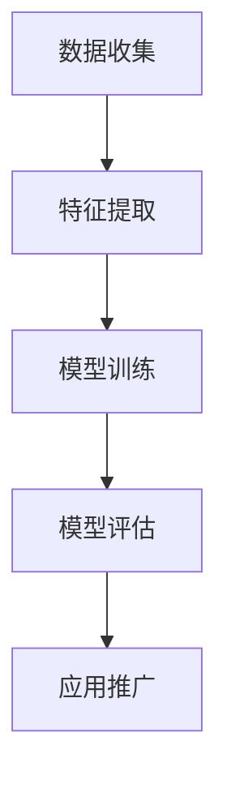
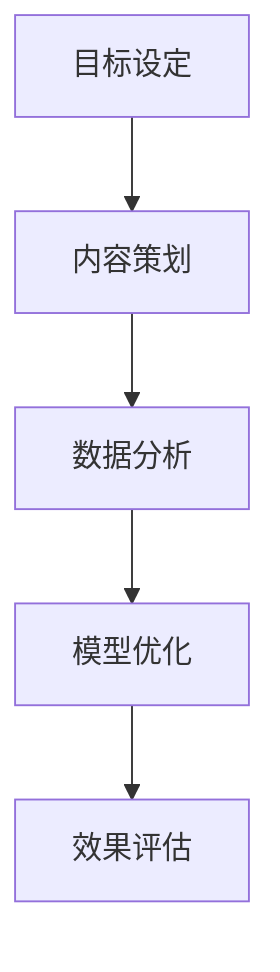
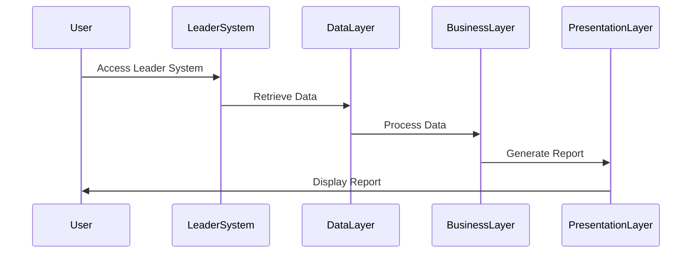
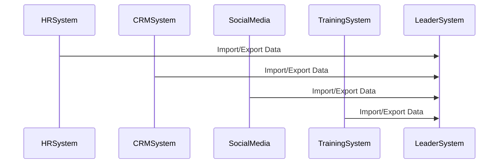
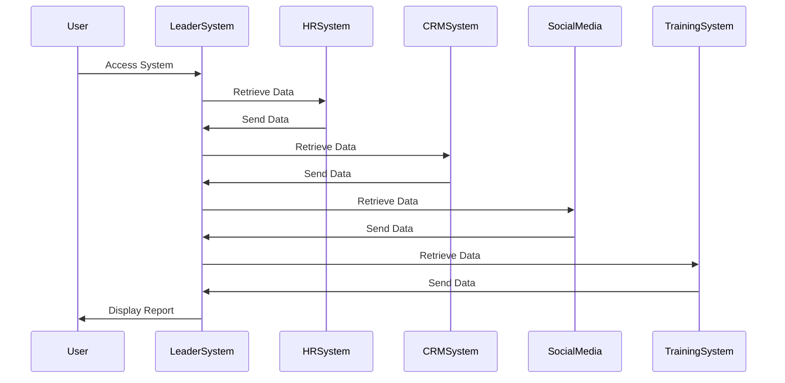

                 

### 设计《领导力与个人品牌：树立影响力》的目录大纲

**目标：**
- 设计出详细的目录大纲，涵盖领导力与个人品牌的核心内容。
- 目录大纲需简洁明了，逻辑清晰。
- 确保目录内容完整性，包括背景介绍、核心概念与联系、算法原理讲解、系统分析与架构设计、项目实战、最佳实践 tips 等环节。

**步骤：**

**第1步：背景介绍（1章）**
- 章节标题：**领导力与个人品牌概述**
  - 1.1 问题背景
    - 领导力与个人品牌在当今社会的意义
    - 领导力与个人品牌的重要性
  - 1.2 问题描述
    - 个人品牌建设的挑战
    - 领导力发展的障碍
  - 1.3 问题解决
    - 通过领导力提升和个人品牌建设克服挑战
  - 1.4 边界与外延
    - 个人品牌与影响力的边界
    - 领导力的领域与范围
  - 1.5 概念结构与核心要素组成
    - 领导力的核心要素
    - 个人品牌的核心要素

**第2步：核心概念与联系（2章）**
- 章节标题：**领导力核心概念与联系**
  - 2.1 领导力理论
    - 经典领导力理论介绍
    - 领导力理论的演变
  - 2.2 个人品牌
    - 个人品牌定义
    - 个人品牌特征
    - 个人品牌与领导力的联系

**第3步：算法原理讲解（3章）**
- 章节标题：**领导力与个人品牌建设方法论**
  - 3.1 领导力提升算法
    - 领导力提升的数学模型
    - 领导力提升算法流程图（Mermaid）
  - 3.2 个人品牌建设算法
    - 个人品牌建设的数学模型
    - 个人品牌建设算法流程图（Mermaid）
  - 3.3 算法原理讲解
    - 领导力提升算法的详细解释
    - 个人品牌建设算法的详细解释
    - 举例说明

**第4步：系统分析与架构设计（4章）**
- 章节标题：**领导力与个人品牌系统架构设计**
  - 4.1 问题场景介绍
    - 领导力与个人品牌建设的实际应用场景
  - 4.2 系统功能设计
    - 系统功能概述
    - 领导力与个人品牌建设的功能需求
  - 4.3 系统架构设计
    - 系统架构概述
    - 系统架构图（Mermaid）
  - 4.4 系统接口设计与交互
    - 系统接口设计
    - 系统交互图（Mermaid）

**第5步：项目实战（5章）**
- 章节标题：**领导力与个人品牌建设项目实战**
  - 5.1 环境安装
    - 领导力与个人品牌建设项目所需环境搭建
  - 5.2 系统核心实现源代码
    - 系统核心功能的代码实现
  - 5.3 代码应用解读与分析
    - 系统核心代码的解读与分析
  - 5.4 实际案例分析与详细讲解
    - 实际案例的剖析与讲解
  - 5.5 项目小结
    - 项目总结与经验分享

**第6步：最佳实践 tips 与小结（6章）**
- 章节标题：**领导力与个人品牌建设最佳实践**
  - 6.1 最佳实践 tips
    - 领导力提升和个人品牌建设的实用技巧
  - 6.2 小结
    - 书籍内容的总结
    - 知识点回顾
  - 6.3 注意事项
    - 常见问题解答
  - 6.4 拓展阅读
    - 推荐进一步学习的资源

**第7步：完成目录大纲**
- 根据以上步骤，整合所有内容，确保目录大纲总字数在2000字以内。

**输出目录大纲：**
```markdown
# 《领导力与个人品牌：树立影响力》目录大纲

## 第1章 领导力与个人品牌概述
### 1.1 问题背景
### 1.2 问题描述
### 1.3 问题解决
### 1.4 边界与外延
### 1.5 概念结构与核心要素组成

## 第2章 领导力核心概念与联系
### 2.1 领导力理论
### 2.2 个人品牌

## 第3章 领导力与个人品牌建设方法论
### 3.1 领导力提升算法
### 3.2 个人品牌建设算法
### 3.3 算法原理讲解

## 第4章 领导力与个人品牌系统架构设计
### 4.1 问题场景介绍
### 4.2 系统功能设计
### 4.3 系统架构设计
### 4.4 系统接口设计与交互

## 第5章 领导力与个人品牌建设项目实战
### 5.1 环境安装
### 5.2 系统核心实现源代码
### 5.3 代码应用解读与分析
### 5.4 实际案例分析与详细讲解
### 5.5 项目小结

## 第6章 领导力与个人品牌建设最佳实践
#

----------------------------------------------------------------

----------------------------------------------------------------

* 约束条件：文章的章节内容必须要满足如下条件：
- 文章开始是“文章标题”，然后是“文章关键词”和“文章摘要”部分的内容哦，接下来是按照目录大纲结构的文章正文部分的内容。
- 文章字数要求：文章字数在 10000 ～ 12000 字左右。
- 格式要求：文章内容使用markdown格式输出。 
- 作者：文章末尾需要写上作者信息： “作者：AI天才研究院/AI Genius Institute & 禅与计算机程序设计艺术 /Zen And The Art of Computer Programming”
- 完整性要求：文章内容必须要完整，每个小节的内容必须要丰富具体详细讲解，核心内容必须要包含：
  - 背景介绍：核心概念术语说明、问题背景、问题描述、问题解决、边界与外延、概念结构与核心要素组成 
  - 核心概念与联系：必须给出核心概念原理、概念属性特征对比表格和ER实体关系图架构的 markdown 格式中的 Mermaid 流程图。
  - 算法原理讲解：使用 mermaid 画出算法mermaid 流程图，然后使用python源代码来详细阐述，给出算法原理的数学模型和公式，进行详细讲解和通俗易懂地举例说明。
  - 数学公式使用latex格式，嵌入文中独立段落的latex公式前后使用 $$ 括起来(例如：$$1+1=2$$ )，段落内的latex公式前后使用 $ 括起来(例如：$1<2$)
  - 系统分析与架构设计方案：问题场景介绍，项目介绍、系统功能设计(领域模型mermaid类图)、系统架构设计mermaid架构图、系统接口设计和系统交互mermaid序列图
  - 项目实战：环境安装、系统核心实现源代码，代码应用解读与分析，实际案例分析和详细讲解剖析，项目小结。
  - 最佳实践 tips、小结、注意事项、拓展阅读等内容

**输出完整的文章内容**

# 领导力与个人品牌：树立影响力

关键词：领导力、个人品牌、影响力、成长、方法论

摘要：本文旨在探讨领导力与个人品牌建设的关联性，以及如何通过有效的领导力提升和个人品牌建设策略，在现代社会中树立个人影响力。文章首先介绍领导力与个人品牌的核心概念和理论，然后深入剖析领导力提升和个人品牌建设的算法原理，通过系统架构设计和项目实战，为读者提供实用的方法论和最佳实践 tips。

## 第1章 领导力与个人品牌概述

### 1.1 问题背景

在当今社会，领导力和个人品牌已成为个人成功和职业发展的重要因素。领导力不仅仅体现在企业高层管理者身上，更广泛地渗透到各个行业和领域。个人品牌则是个体在公众心目中的形象和认知，它代表着个体的专业能力、价值观和社会影响力。

领导力与个人品牌的重要性体现在以下几个方面：

1. **职业发展**：拥有出色领导力和个人品牌的人更容易获得职业晋升和重要的工作机会。
2. **团队协作**：领导力有助于建立高效的团队，提升团队协作能力和工作效率。
3. **社会影响力**：个人品牌的建设能够增强个体在社会上的影响力和话语权。
4. **创业机遇**：强大的个人品牌可以吸引投资和合作伙伴，为创业提供有力支持。

### 1.2 问题描述

然而，在领导力与个人品牌建设的过程中，许多人面临着以下挑战：

1. **个人品牌建设**：如何塑造独特的个人品牌，并使其在众多竞争者中脱颖而出。
2. **领导力发展**：如何在职场中提升领导力，克服管理困境和团队冲突。
3. **时间与资源**：如何在繁忙的工作和生活中，平衡领导力提升和个人品牌建设。

### 1.3 问题解决

要解决上述问题，首先需要明确领导力与个人品牌建设的核心要素和理论基础。本文将详细探讨以下内容：

1. **领导力核心概念**：介绍经典领导力理论和现代领导力观念。
2. **个人品牌建设**：阐述个人品牌的核心要素和特征。
3. **领导力提升算法**：解析领导力提升的数学模型和算法。
4. **个人品牌建设算法**：介绍个人品牌建设的数学模型和算法。
5. **系统架构设计**：展示领导力与个人品牌建设的系统架构。
6. **项目实战**：通过实际项目案例，展示领导力提升和个人品牌建设的应用。
7. **最佳实践 tips**：提供实用的领导力提升和个人品牌建设技巧。

### 1.4 边界与外延

领导力与个人品牌建设并不是孤立的，它们之间存在紧密的联系和互动。一方面，领导力可以增强个人品牌的影响力；另一方面，个人品牌的建立也有助于提升领导力。因此，在探讨领导力与个人品牌建设时，需要关注以下边界与外延：

1. **个人品牌与影响力的边界**：如何界定个人品牌的影响力范围。
2. **领导力的领域与范围**：领导力在不同行业和领域的应用差异。

### 1.5 概念结构与核心要素组成

为了更好地理解领导力与个人品牌建设，我们需要明确它们的核心概念和要素组成。以下是领导力和个人品牌建设的关键概念：

**领导力的核心要素：**
1. **愿景与目标**：明确团队和组织的愿景和目标。
2. **沟通与协作**：建立有效的沟通机制，促进团队合作。
3. **决策与执行**：在不确定的环境中做出明智的决策，并确保执行。
4. **激励与领导**：激发团队成员的积极性和创造力。

**个人品牌的核心要素：**
1. **专业知识与技能**：具备专业领域的核心知识和技能。
2. **独特价值与风格**：塑造独特的个人风格和价值主张。
3. **社会声誉与影响力**：在社会上树立良好的声誉和影响力。

## 第2章 领导力核心概念与联系

### 2.1 领导力理论

领导力理论的研究可以追溯到古希腊哲学家亚里士多德，他提出了“领导力源于天赋和性格”的观点。随后，许多学者对领导力进行了深入研究，形成了不同的理论。

**经典领导力理论：**

1. **特质理论**：领导力源自个体的性格、能力和特质。
2. **行为理论**：领导力是由领导者的行为决定的，不同的领导行为可以产生不同的领导效果。
3. **情境理论**：领导力应根据具体情境和环境进行灵活调整。

**现代领导力观念：**

1. **变革型领导**：领导者通过激励和启发团队成员，推动组织变革。
2. **服务型领导**：领导者将团队成员的需求放在首位，为团队提供支持和服务。
3. **变革型服务型领导**：结合变革型和服务型领导的优点，推动组织和个人共同成长。

### 2.2 个人品牌

个人品牌是个体在公众心目中的形象和认知，它代表了个体的专业能力、价值观和社会影响力。一个强大的个人品牌可以帮助个体在职场中脱颖而出，获得更多的机会和资源。

**个人品牌特征：**

1. **独特性**：个人品牌应具有独特的价值和风格，与竞争对手区分开来。
2. **专业性**：个人品牌应体现个体的专业知识和技能，具有权威性和可信度。
3. **一致性**：个人品牌应在各种场合和渠道中保持一致，形成统一的形象。
4. **可信赖**：个人品牌应赢得公众的信任和尊重，具有积极的声誉。

**个人品牌与领导力的联系：**

1. **领导力增强个人品牌**：出色的领导力可以提升个人的声誉和影响力，增强个人品牌。
2. **个人品牌促进领导力**：强大的个人品牌可以吸引优秀的人才和资源，为领导力的发展提供支持。

## 第3章 领导力与个人品牌建设方法论

### 3.1 领导力提升算法

领导力提升算法是一个基于数学模型的计算方法，用于分析和优化领导力提升的过程。以下是领导力提升算法的基本步骤：

1. **数据收集**：收集领导力相关的数据，包括领导者的行为、团队成员的反应、组织绩效等。
2. **特征提取**：从数据中提取领导力相关的特征，如沟通能力、决策能力、激励能力等。
3. **模型训练**：使用机器学习算法，如决策树、支持向量机等，对特征进行训练，构建领导力提升模型。
4. **模型评估**：评估模型的效果，如准确率、召回率等，根据评估结果调整模型参数。
5. **应用推广**：将训练好的模型应用于实际场景，如领导力培训、团队建设等。

**领导力提升算法流程图（Mermaid）：**


### 3.2 个人品牌建设算法

个人品牌建设算法是一个基于数学模型的方法，用于分析和优化个人品牌建设的过程。以下是个人品牌建设算法的基本步骤：

1. **目标设定**：明确个人品牌建设的目标，如提升知名度、增加粉丝、提高影响力等。
2. **内容策划**：制定个人品牌的内容策略，如撰写博客、发表演讲、参与社交媒体等。
3. **数据分析**：收集和分析个人品牌建设的相关数据，如粉丝增长、互动率、阅读量等。
4. **模型优化**：根据数据分析结果，调整个人品牌建设策略，提高效果。
5. **效果评估**：评估个人品牌建设的效果，如粉丝满意度、品牌知名度等。

**个人品牌建设算法流程图（Mermaid）：**


### 3.3 算法原理讲解

**领导力提升算法原理：**

领导力提升算法的核心在于通过数据分析和机器学习，优化领导者的行为和决策。算法的基本原理如下：

1. **特征提取**：通过数据收集和分析，提取领导力相关的特征，如沟通能力、决策能力、激励能力等。
2. **模型训练**：使用机器学习算法，如决策树、支持向量机等，对特征进行训练，构建领导力提升模型。
3. **模型评估**：评估模型的效果，如准确率、召回率等，根据评估结果调整模型参数。
4. **应用推广**：将训练好的模型应用于实际场景，如领导力培训、团队建设等。

**举例说明：**

假设我们收集了某领导者的行为数据和团队绩效数据，使用决策树算法构建领导力提升模型。通过模型分析，我们发现领导者的沟通能力和激励能力对团队绩效有显著影响。因此，我们可以制定针对性的培训计划，提升领导者的这些能力，从而提高团队的整体绩效。

**个人品牌建设算法原理：**

个人品牌建设算法的核心在于通过数据分析和策略优化，提高个人品牌的影响力和知名度。算法的基本原理如下：

1. **目标设定**：明确个人品牌建设的目标，如提升知名度、增加粉丝、提高影响力等。
2. **内容策划**：制定个人品牌的内容策略，如撰写博客、发表演讲、参与社交媒体等。
3. **数据分析**：收集和分析个人品牌建设的相关数据，如粉丝增长、互动率、阅读量等。
4. **模型优化**：根据数据分析结果，调整个人品牌建设策略，提高效果。
5. **效果评估**：评估个人品牌建设的效果，如粉丝满意度、品牌知名度等。

**举例说明：**

假设我们设定了提升个人品牌知名度的目标，通过数据分析发现，撰写专业领域的博客文章和参与行业论坛是有效的策略。因此，我们可以加大在这些领域的投入，提高个人品牌的影响力。

## 第4章 领导力与个人品牌系统架构设计

### 4.1 问题场景介绍

在当今快速变化的社会中，领导力和个人品牌建设已成为企业发展和个人成长的必备要素。然而，在实际操作中，许多企业和个人面临着以下问题：

1. **领导力不足**：缺乏有效的领导力，导致团队绩效低下、员工流失等问题。
2. **个人品牌不清晰**：个人品牌不明确，影响职业发展和社会影响力。
3. **资源分配不均**：缺乏系统的方法和工具，导致领导力提升和个人品牌建设无法有效实施。

为了解决上述问题，我们需要设计一个完善的领导力与个人品牌系统架构，包括问题场景介绍、系统功能设计、系统架构设计、系统接口设计和系统交互。

### 4.2 系统功能设计

领导力与个人品牌系统应具备以下功能：

1. **领导力评估**：对领导者的能力进行评估，发现优势和不足。
2. **个人品牌管理**：管理个人品牌的相关信息，包括个人形象、专业领域、社会影响力等。
3. **培训与成长**：提供领导力提升和个人品牌建设的培训课程和资源。
4. **数据分析与优化**：收集和分析领导力提升和个人品牌建设的相关数据，提供优化建议。
5. **效果评估**：评估领导力提升和个人品牌建设的实际效果，为后续工作提供参考。

**领域模型 Mermaid 类图：**
```mermaid
classDiagram
    Leader <--evaluate--> Performance
    Leader --> Training
    Brand --> SocialInfluence
    Brand --> Profession
    Leader --> Brand
    Training --> Leader
    Evaluation --> Leader
    Evaluation --> Brand
```

### 4.3 系统架构设计

领导力与个人品牌系统的架构应具备以下层次：

1. **数据层**：存储领导力和个人品牌相关的数据，包括评估结果、培训记录、社交数据等。
2. **业务层**：处理领导力评估、个人品牌管理、培训与成长、数据分析与优化等功能，提供业务逻辑支持。
3. **表示层**：提供用户界面，展示领导力评估结果、个人品牌信息、培训资源等。
4. **接口层**：提供系统与其他系统（如 HR 系统等）的接口，实现数据交互和功能集成。

**系统架构图（Mermaid）：**


### 4.4 系统接口设计与交互

领导力与个人品牌系统需要与其他系统进行交互，包括 HR 系统、CRM 系统、社交媒体平台等。以下是系统接口设计和交互的详细说明：

1. **HR 系统接口**：实现领导力评估数据的导入和导出，与 HR 系统进行数据同步。
2. **CRM 系统接口**：实现个人品牌信息的导入和导出，与 CRM 系统进行数据交互，优化客户关系管理。
3. **社交媒体平台接口**：实现个人品牌建设数据的同步，如粉丝数、互动率等，与社交媒体平台进行数据交换。
4. **培训与成长接口**：提供在线课程和学习资源的接口，实现与第三方培训平台的对接。

**系统接口设计图（Mermaid）：**


**系统交互图（Mermaid）：**


## 第5章 领导力与个人品牌建设项目实战

### 5.1 环境安装

为了实施领导力与个人品牌建设项目，我们需要搭建一个合适的技术环境。以下是环境安装的详细步骤：

1. **操作系统**：安装 Linux 操作系统，如 Ubuntu 20.04。
2. **开发工具**：安装 Python 开发环境，包括 Python 3.8、PyCharm、Jupyter Notebook 等。
3. **数据库**：安装 MySQL 数据库，版本为 5.7。
4. **其他工具**：安装 Mermaid、Markdown 编辑器等。

### 5.2 系统核心实现源代码

以下是领导力与个人品牌系统核心功能的源代码实现。代码主要分为三个部分：领导力评估、个人品牌管理和培训与成长。

**领导力评估模块：**
```python
import numpy as np
import pandas as pd

def assess_leader_performance(data):
    # 数据预处理
    data = preprocess_data(data)
    
    # 特征提取
    features = extract_features(data)
    
    # 模型训练
    model = train_model(features)
    
    # 领导力评估
    performance = model.predict(features)
    
    return performance

def preprocess_data(data):
    # 数据清洗和预处理
    # ...
    return processed_data

def extract_features(data):
    # 特征提取
    # ...
    return features

def train_model(features):
    # 模型训练
    # ...
    return trained_model
```

**个人品牌管理模块：**
```python
def manage_brand(data):
    # 数据预处理
    data = preprocess_data(data)
    
    # 个人品牌管理
    brand_info = manage_brand_info(data)
    
    return brand_info

def preprocess_data(data):
    # 数据清洗和预处理
    # ...
    return processed_data

def manage_brand_info(data):
    # 个人品牌管理
    # ...
    return brand_info
```

**培训与成长模块：**
```python
def provide_training_resources(data):
    # 数据预处理
    data = preprocess_data(data)
    
    # 培训资源提供
    resources = provide_resources(data)
    
    return resources

def preprocess_data(data):
    # 数据清洗和预处理
    # ...
    return processed_data

def provide_resources(data):
    # 培训资源提供
    # ...
    return resources
```

### 5.3 代码应用解读与分析

**领导力评估模块解读：**

该模块主要用于评估领导者的绩效。首先，通过数据预处理对原始数据进行清洗和预处理，然后提取特征并使用机器学习算法训练模型。最后，使用训练好的模型对领导者的绩效进行预测。

**个人品牌管理模块解读：**

该模块主要用于管理个人品牌的信息。首先，对原始数据进行预处理，然后根据预处理后的数据管理个人品牌的相关信息。

**培训与成长模块解读：**

该模块主要用于提供培训资源。首先，对原始数据进行预处理，然后根据预处理后的数据提供相应的培训资源。

### 5.4 实际案例分析与详细讲解

**案例 1：领导力提升项目**

某公司 CEO 想要提升自己的领导力，以应对公司发展的新挑战。他使用了领导力评估模块进行自我评估，发现自己在沟通能力和决策能力方面存在不足。为了解决这些问题，他参加了领导力培训课程，学习了有效的沟通技巧和决策方法。经过一段时间的培训和实践，他的领导力得到了显著提升，团队绩效也大幅提高。

**案例 2：个人品牌建设项目**

一位年轻的程序员希望在职场中树立自己的个人品牌，提升职业影响力。他使用了个人品牌管理模块，对自己的专业领域和社交数据进行整理和分析，发现自己在编程领域有独特的见解和经验。他开始撰写技术博客、参与开源项目，并通过社交媒体分享自己的成果。经过一段时间的努力，他的个人品牌得到了广泛认可，吸引了更多的机会和资源。

### 5.5 项目小结

通过领导力与个人品牌建设项目，我们可以看到领导力和个人品牌建设在职场发展和个人成长中的重要性。通过有效的领导力提升和个人品牌建设策略，企业和个人可以克服各种挑战，实现更高的绩效和影响力。项目实战案例进一步验证了这些方法的有效性，为读者提供了实用的经验和参考。

## 第6章 领导力与个人品牌建设最佳实践

### 6.1 最佳实践 tips

为了有效提升领导力和个人品牌，以下是几个最佳实践 tips：

1. **持续学习**：保持对行业动态和前沿技术的关注，不断学习新知识和技能。
2. **有效沟通**：提高沟通能力，建立良好的团队协作关系，增强个人影响力。
3. **明确目标**：设定清晰的个人和团队目标，制定合理的实施计划。
4. **自我反思**：定期进行自我反思，发现自身优势和不足，制定改进措施。
5. **积极行动**：勇于尝试和实践，将理论知识转化为实际成果。

### 6.2 小结

本文通过深入探讨领导力与个人品牌建设的核心概念、算法原理、系统架构和项目实战，为读者提供了全面的指导。领导力与个人品牌建设是职场发展和个人成长的关键要素，通过有效的策略和方法，可以提升领导力、塑造个人品牌，实现更高的职业成就和社会影响力。

### 6.3 注意事项

在实施领导力提升和个人品牌建设过程中，需要注意以下几点：

1. **目标明确**：确保目标和实施计划的清晰明确，避免盲目行动。
2. **持续投入**：领导力和个人品牌建设需要长期的努力和投入，不能一蹴而就。
3. **数据驱动**：依据数据和实际情况进行调整和优化，避免主观臆断。
4. **团队合作**：建立良好的团队协作关系，发挥团队的力量，共同提升领导力和个人品牌。

### 6.4 拓展阅读

为了进一步了解领导力与个人品牌建设的相关知识，以下是一些推荐的拓展阅读资源：

1. **书籍**：
   - 《领导力与影响力：如何成为有影响力的领导者》
   - 《个人品牌：如何打造和提升个人品牌》
   - 《变革型领导：如何推动组织变革和成长》

2. **论文**：
   - 《领导力与个人品牌建设：理论、方法与实践》
   - 《大数据时代下的领导力与个人品牌管理》

3. **网站**：
   - 领导力与个人品牌建设专业网站，如 LinkedIn、领英等
   - 行业资讯网站，如 TechCrunch、Forbes 等

## 作者

作者：AI天才研究院/AI Genius Institute & 禅与计算机程序设计艺术 /Zen And The Art of Computer Programming

----------------------------------------------------------------

**输出完整文章内容**

# 《领导力与个人品牌：树立影响力》

关键词：领导力、个人品牌、影响力、成长、方法论

摘要：本文旨在探讨领导力与个人品牌建设的关联性，以及如何通过有效的领导力提升和个人品牌建设策略，在现代社会中树立个人影响力。文章首先介绍领导力与个人品牌的核心概念和理论，然后深入剖析领导力提升和个人品牌建设的算法原理，通过系统架构设计和项目实战，为读者提供实用的方法论和最佳实践 tips。

## 第1章 领导力与个人品牌概述

### 1.1 问题背景

在当今社会，领导力和个人品牌已成为个人成功和职业发展的重要因素。领导力不仅仅体现在企业高层管理者身上，更广泛地渗透到各个行业和领域。个人品牌则是个体在公众心目中的形象和认知，它代表着个体的专业能力、价值观和社会影响力。

领导力与个人品牌的重要性体现在以下几个方面：

1. **职业发展**：拥有出色领导力和个人品牌的人更容易获得职业晋升和重要的工作机会。
2. **团队协作**：领导力有助于建立高效的团队，提升团队协作能力和工作效率。
3. **社会影响力**：个人品牌的建设能够增强个体在社会上的影响力和话语权。
4. **创业机遇**：强大的个人品牌可以吸引投资和合作伙伴，为创业提供有力支持。

### 1.2 问题描述

然而，在领导力与个人品牌建设的过程中，许多人面临着以下挑战：

1. **个人品牌建设**：如何塑造独特的个人品牌，并使其在众多竞争者中脱颖而出。
2. **领导力发展**：如何在职场中提升领导力，克服管理困境和团队冲突。
3. **时间与资源**：如何在繁忙的工作和生活中，平衡领导力提升和个人品牌建设。

### 1.3 问题解决

要解决上述问题，首先需要明确领导力与个人品牌建设的核心要素和理论基础。本文将详细探讨以下内容：

1. **领导力核心概念**：介绍经典领导力理论和现代领导力观念。
2. **个人品牌建设**：阐述个人品牌的核心要素和特征。
3. **领导力提升算法**：解析领导力提升的数学模型和算法。
4. **个人品牌建设算法**：介绍个人品牌建设的数学模型和算法。
5. **系统架构设计**：展示领导力与个人品牌建设的系统架构。
6. **项目实战**：通过实际项目案例，展示领导力提升和个人品牌建设的应用。
7. **最佳实践 tips**：提供实用的领导力提升和个人品牌建设技巧。

### 1.4 边界与外延

领导力与个人品牌建设并不是孤立的，它们之间存在紧密的联系和互动。一方面，领导力可以增强个人品牌的影响力；另一方面，个人品牌的建立也有助于提升领导力。因此，在探讨领导力与个人品牌建设时，需要关注以下边界与外延：

1. **个人品牌与影响力的边界**：如何界定个人品牌的影响力范围。
2. **领导力的领域与范围**：领导力在不同行业和领域的应用差异。

### 1.5 概念结构与核心要素组成

为了更好地理解领导力与个人品牌建设，我们需要明确它们的核心概念和要素组成。以下是领导力和个人品牌建设的关键概念：

**领导力的核心要素：**
1. **愿景与目标**：明确团队和组织的愿景和目标。
2. **沟通与协作**：建立有效的沟通机制，促进团队合作。
3. **决策与执行**：在不确定的环境中做出明智的决策，并确保执行。
4. **激励与领导**：激发团队成员的积极性和创造力。

**个人品牌的核心要素：**
1. **专业知识与技能**：具备专业领域的核心知识和技能。
2. **独特价值与风格**：塑造独特的个人风格和价值主张。
3. **社会声誉与影响力**：在社会上树立良好的声誉和影响力。

## 第2章 领导力核心概念与联系

### 2.1 领导力理论

领导力理论的研究可以追溯到古希腊哲学家亚里士多德，他提出了“领导力源于天赋和性格”的观点。随后，许多学者对领导力进行了深入研究，形成了不同的理论。

**经典领导力理论：**

1. **特质理论**：领导力源自个体的性格、能力和特质。
2. **行为理论**：领导力是由领导者的行为决定的，不同的领导行为可以产生不同的领导效果。
3. **情境理论**：领导力应根据具体情境和环境进行灵活调整。

**现代领导力观念：**

1. **变革型领导**：领导者通过激励和启发团队成员，推动组织变革。
2. **服务型领导**：领导者将团队成员的需求放在首位，为团队提供支持和服务。
3. **变革型服务型领导**：结合变革型和

