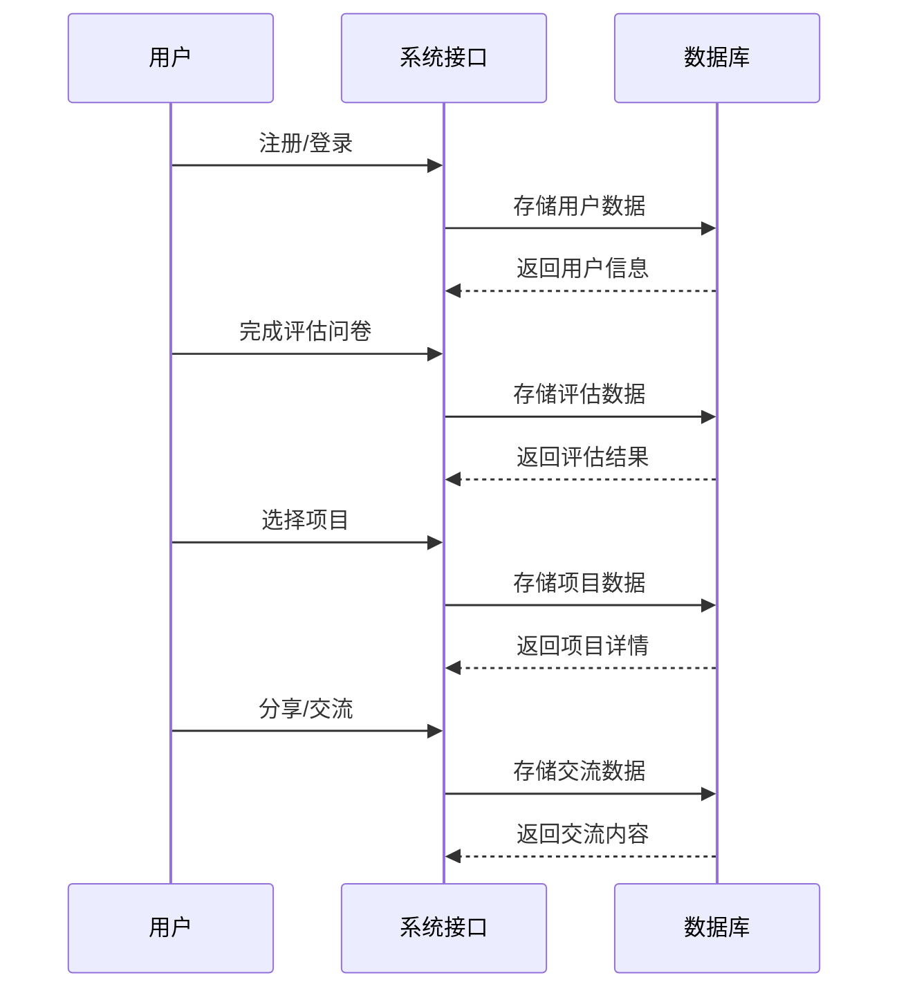
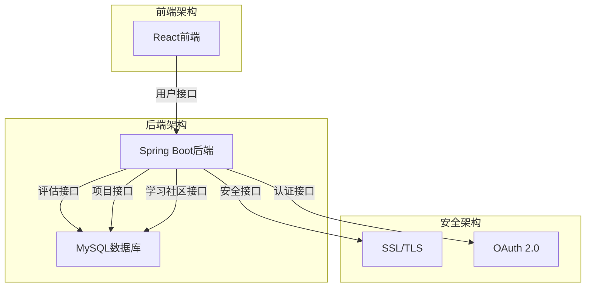

                 

### 第一部分：背景介绍

#### 第1章：问题背景

#### 1.1.1 问题的提出
在当今快速变化和竞争激烈的商业环境中，领导者需要具备创新思维和勇于冒险的勇气，以应对不确定性和挑战。然而，很多领导者往往因为各种原因而陷入舒适区，无法突破现有的局限，从而导致组织发展的瓶颈。本文旨在探讨领导力与冒险精神之间的关系，以及如何在突破舒适区中培养和提升这些能力。

#### 1.1.2 问题解决
为了解决上述问题，本文将采取以下方法：

1. **深入分析领导力和冒险精神的核心概念和理论基础**：通过定义和解释核心概念，如领导力、冒险精神等，为后续讨论奠定基础。
2. **结合实际案例和实践经验**：通过分析成功和失败的案例，探讨领导力和冒险精神在实际工作中的应用。
3. **提供实用的策略和工具**：总结有效的领导力和冒险精神提升方法，为读者提供可操作的指南。

#### 1.1.3 边界与外延
领导力与冒险精神不仅限于商业领域，也适用于其他领域，如教育、政治和公共事务。本文将重点关注商业环境中领导力和冒险精神的应用，但也可以为其他领域的读者提供有价值的启示。

#### 1.1.4 核心概念与联系
1. **领导力**：领导力是指通过激励、指导和影响他人来实现共同目标的能力。它包括沟通技巧、决策能力、领导风格和人际关系管理等方面。
2. **冒险精神**：冒险精神是指勇于尝试新事物、接受挑战和承担风险的态度和行动。它包括创新思维、勇气和决心等方面。

#### 第2章：核心概念原理

#### 2.1.1 领导力的原理
领导力的原理包括明确的目标、有效的沟通、建立信任、激励团队和变革管理等方面。通过深入探讨这些原理，读者可以更好地理解如何运用领导力实现组织目标。

##### 2.1.1.1 明确的目标
明确的目标是领导力的基石。领导者需要设定清晰的目标，并确保团队成员理解并致力于实现这些目标。

##### 2.1.1.2 有效的沟通
有效的沟通是领导力的重要组成部分。领导者需要具备良好的沟通技巧，确保信息准确传达，促进团队成员之间的协作。

##### 2.1.1.3 建立信任
建立信任是领导力的关键。领导者需要通过诚实、透明和可信的行为来赢得团队成员的信任。

##### 2.1.1.4 激励团队
激励团队是领导力的核心任务。领导者需要了解团队成员的需求和动机，并采取适当的激励措施，激发团队成员的潜力。

##### 2.1.1.5 变革管理
变革管理是领导力的挑战之一。领导者需要引导团队适应变化，确保组织在变革过程中保持稳定和持续发展。

#### 2.1.2 冒险精神的原理
冒险精神的原理包括勇于尝试、接受挑战、面对失败和持续学习等方面。通过探讨这些原理，读者可以更好地理解如何培养和提升冒险精神。

##### 2.1.2.1 勇于尝试
勇于尝试是冒险精神的核心。领导者需要勇于尝试新事物，不断探索未知的领域。

##### 2.1.2.2 接受挑战
接受挑战是冒险精神的重要组成部分。领导者需要敢于面对困难和挑战，勇于承担责任。

##### 2.1.2.3 面对失败
面对失败是冒险精神的考验。领导者需要从失败中汲取经验教训，不断调整和改进自己的方法。

##### 2.1.2.4 持续学习
持续学习是冒险精神的重要保障。领导者需要保持好奇心和求知欲，不断学习新知识和技能，以适应不断变化的环境。

#### 第3章：核心概念属性特征对比表格

| 特征         | 领导力                           | 冒险精神                           |
| ------------ | -------------------------------- | -------------------------------- |
| 定义         | 激励和影响他人实现目标的能力     | 勇于尝试新事物、接受挑战和承担风险 |
| 目的         | 实现组织目标                     | 实现个人和组织的成长与突破        |
| 要求         | 沟通技巧、决策能力、领导风格     | 勇气、决心、创新思维               |
| 对象         | 团队成员、组织成员                | 新项目、新领域、新机会             |
| 实施方式     | 规划、指导、激励、变革           | 探索、挑战、学习、反思             |

#### 第4章：ER实体关系图架构

```mermaid
erDiagram
    Leader ||--|{ Organization } Organization
    Leader ||--|{ Team } Team
    Leader ||--|{ Project } Project
    Leader ||--|{ Performance } Performance
    AdventureSpirit ||--|{ Leader } Leader
    AdventureSpirit ||--|{ Organization } Organization
    AdventureSpirit ||--|{ Team } Team
    AdventureSpirit ||--|{ Project } Project
```

### 结论
本文通过深入分析领导力和冒险精神的核心概念、理论基础和实践案例，为读者提供了全面而系统的理解和指导。通过结合实际案例，读者可以更好地理解如何在实际工作中运用领导力和冒险精神，以实现个人和组织的成功。同时，本文还总结了有效的领导力和冒险精神提升方法，为读者提供了可操作的指南。

关键词：领导力、冒险精神、突破舒适区、创新思维、组织发展

摘要：本文探讨了领导力与冒险精神在突破舒适区中的重要性。通过分析核心概念、原理和实践案例，本文为读者提供了全面的理解和指导。读者可以从中学习到如何培养和提升领导力和冒险精神，以实现个人和组织的成功。

----------------------------------------------------------------

### 第二部分：算法原理讲解

#### 第5章：领导力提升算法

#### 5.1.1 领导力提升算法概述
领导力提升算法是一系列方法和策略，旨在提高领导者的领导能力，实现个人和组织的目标。本章将介绍领导力提升算法的基本原理和方法。

#### 5.1.2 算法原理

##### 5.1.2.1 自我认知
自我认知是领导力提升算法的基础。领导者需要通过自我反思，了解自己的优点和不足，明确自己的发展需求。

##### 5.1.2.2 反馈机制
建立有效的反馈机制是领导力提升算法的核心。领导者需要从团队成员和其他利益相关者那里获得反馈，以便进行改进。

##### 5.1.2.3 持续学习
持续学习是领导力提升的关键。领导者需要保持好奇心和求知欲，不断学习新知识和技能，以适应不断变化的环境。

#### 5.1.3 算法流程图


#### 第6章：冒险精神提升算法

#### 6.1.1 冒险精神提升算法概述
冒险精神提升算法是一系列方法和策略，旨在培养领导者的冒险精神，使其能够勇于尝试新事物、接受挑战和承担风险。本章将介绍冒险精神提升算法的基本原理和方法。

#### 6.1.2 算法原理

##### 6.1.2.1 勇于尝试
勇于尝试是冒险精神的核心。领导者需要敢于尝试新事物，不断探索未知的领域。

##### 6.1.2.2 接受挑战
接受挑战是冒险精神的重要组成部分。领导者需要敢于面对困难和挑战，勇于承担责任。

##### 6.1.2.3 面对失败
面对失败是冒险精神的考验。领导者需要从失败中汲取经验教训，不断调整和改进自己的方法。

##### 6.1.2.4 持续学习
持续学习是冒险精神的重要保障。领导者需要保持好奇心和求知欲，不断学习新知识和技能，以适应不断变化的环境。

#### 6.1.3 算法流程图


### 第7章：领导力与冒险精神融合算法

#### 7.1.1 算法概述
领导力与冒险精神融合算法旨在将领导力和冒险精神有机结合，以实现更高的领导效果。本章将介绍领导力与冒险精神融合算法的基本原理和方法。

#### 7.1.2 算法原理

##### 7.1.2.1 双重目标设定
领导力与冒险精神融合算法的核心是双重目标设定。领导者需要在明确组织目标的同时，设定个人冒险目标，以激发领导者的冒险精神。

##### 7.1.2.2 交叉策略实施
交叉策略实施是领导力与冒险精神融合算法的重要环节。领导者需要将领导力和冒险精神的策略相互结合，以实现双重目标的实现。

##### 7.1.2.3 反馈与调整
反馈与调整是领导力与冒险精神融合算法的关键。领导者需要根据实施过程中的反馈，不断调整和优化策略，以实现最佳效果。

#### 7.1.3 算法流程图


### 第8章：领导力与冒险精神提升实践

#### 8.1.1 实践方法
领导力与冒险精神提升实践包括以下几个方法：

1. **自我反思与成长**：领导者需要定期进行自我反思，分析自己的优点和不足，制定个人成长计划。
2. **建立学习社区**：领导者可以加入学习社区，与其他领导者分享经验和知识，共同成长。
3. **实践冒险项目**：领导者可以参与冒险项目，如新市场开拓、新产品研发等，以提升冒险精神。
4. **培养团队成员**：领导者需要关注团队成员的成长，提供培训和支持，以提升团队整体的领导力。

#### 8.1.2 实践案例
以下是一个领导力与冒险精神提升的实践案例：

1. **项目背景**：某公司决定进入一个新兴市场，以拓展业务范围。
2. **领导力提升**：公司领导层通过自我反思和建立学习社区，提升自身的领导能力。
3. **冒险精神培养**：领导层积极参与冒险项目，勇于尝试新市场，接受挑战。
4. **实施过程**：领导层在实施过程中，不断根据反馈调整策略，确保项目的成功。

### 结论
本文介绍了领导力与冒险精神提升算法的基本原理和实践方法。通过结合自我认知、反馈机制、持续学习等原理，领导者可以提升自身的领导力与冒险精神。同时，本文也提供了具体的实践案例，以供读者参考。

关键词：领导力、冒险精神、自我认知、反馈机制、持续学习

摘要：本文探讨了领导力与冒险精神提升算法的基本原理和实践方法。通过深入分析核心概念和原理，本文为领导者提供了有效的提升策略和实践指南，以实现个人和组织的成功。

----------------------------------------------------------------

### 第三部分：系统分析与架构设计

#### 第9章：问题场景介绍

在当前的市场环境中，企业面临着不断变化的技术革新和客户需求。为了保持竞争力，企业需要不断进行技术创新和业务模式变革。领导力与冒险精神在这一过程中发挥着至关重要的作用。本章将介绍一个实际项目，该项目旨在通过提升领导力和冒险精神，推动企业技术创新和业务模式变革。

#### 9.1 项目介绍
项目名称：创新驱动型企业转型
项目目标：通过提升领导力和冒险精神，推动企业技术创新和业务模式变革，实现企业的可持续发展。

#### 9.2 系统功能设计

为了实现项目目标，系统需要具备以下功能：

1. **领导力评估与提升**：通过在线评估工具，对领导者的领导能力进行评估，并提供个性化的提升建议。
2. **冒险精神培养**：提供冒险项目选择和实施指导，帮助领导者提升冒险精神。
3. **持续学习与交流**：建立学习社区，促进领导者之间的经验分享和知识交流。
4. **绩效管理**：对领导者的绩效进行跟踪和评估，以衡量提升效果。

#### 9.3 系统架构设计

为了实现上述功能，系统需要采用如下架构：

1. **前端架构**：使用React框架实现系统的用户界面，提供直观易用的交互体验。
2. **后端架构**：使用Spring Boot框架实现系统的后端逻辑，提供数据存储和管理功能。
3. **数据库架构**：使用MySQL数据库存储用户数据、评估结果和绩效数据。
4. **安全架构**：采用SSL/TLS协议保障数据传输安全，使用OAuth 2.0协议实现用户身份认证。

#### 9.4 系统接口设计

系统需要提供以下接口：

1. **用户接口**：用于用户注册、登录和权限管理。
2. **评估接口**：用于领导力评估和结果查询。
3. **项目接口**：用于冒险项目选择和实施管理。
4. **学习社区接口**：用于学习资源共享和交流。

#### 9.5 系统交互设计

系统交互设计如下：

1. **用户注册与登录**：用户通过前端界面进行注册和登录，系统通过后端接口进行身份验证和权限管理。
2. **领导力评估**：用户通过前端界面完成领导力评估问卷，系统通过后端接口收集评估数据并进行处理。
3. **项目选择与实施**：用户通过前端界面选择冒险项目，系统通过后端接口提供项目实施指导和管理。
4. **学习社区交流**：用户通过前端界面进行学习资源的分享和交流，系统通过后端接口实现数据存储和检索。



### 结论
通过系统分析与架构设计，我们为提升领导力和冒险精神提供了一个完整的解决方案。该方案不仅涵盖了功能设计、系统架构和接口设计，还考虑了系统的安全性和可扩展性。通过实施这一方案，企业可以更好地应对市场变化，推动技术创新和业务模式变革，实现可持续发展。

关键词：问题场景、系统功能、架构设计、接口设计、系统交互

摘要：本文通过系统分析与架构设计，为提升领导力和冒险精神提供了一个全面的解决方案。通过实现系统的功能设计、架构设计和接口设计，企业可以更好地应对市场变化，推动技术创新和业务模式变革，实现可持续发展。

----------------------------------------------------------------

### 第四部分：项目实战

#### 第10章：环境安装

在进行领导力和冒险精神提升项目的实施之前，需要搭建一个完整的环境，以便开发和运行系统。以下是环境安装的详细步骤：

##### 10.1.1 系统要求
- 操作系统：Ubuntu 18.04 或更高版本
- 开发环境：Java SDK 1.8 或更高版本
- 数据库：MySQL 5.7 或更高版本
- 前端框架：Node.js 12.x 或更高版本，React 17.x 或更高版本

##### 10.1.2 安装步骤
1. **安装操作系统**：下载并安装Ubuntu 18.04操作系统。
2. **更新系统**：
   ```bash
   sudo apt update
   sudo apt upgrade
   ```
3. **安装Java SDK**：
   ```bash
   sudo apt install openjdk-8-jdk
   ```
4. **安装MySQL**：
   ```bash
   sudo apt install mysql-server
   ```
5. **安装Node.js**：
   ```bash
   sudo apt install nodejs
   ```
6. **安装React**：
   ```bash
   npm install -g create-react-app
   ```

##### 10.1.3 配置MySQL
1. **启动MySQL服务**：
   ```bash
   sudo systemctl start mysql
   ```
2. **配置MySQL root用户密码**：
   ```bash
   sudo mysql_secure_installation
   ```
3. **创建领导力和冒险精神提升项目数据库**：
   ```sql
   CREATE DATABASE leadership_adventure;
   GRANT ALL PRIVILEGES ON leadership_adventure.* TO 'leader_adventure'@'localhost' IDENTIFIED BY 'password';
   FLUSH PRIVILEGES;
   ```

#### 第11章：系统核心实现源代码

##### 11.1 领导力评估模块

**11.1.1 数据模型**

```sql
-- 用户表
CREATE TABLE users (
    id INT AUTO_INCREMENT PRIMARY KEY,
    username VARCHAR(50) NOT NULL,
    password VARCHAR(50) NOT NULL,
    role ENUM('admin', 'user') NOT NULL
);

-- 评估结果表
CREATE TABLE assessment_results (
    id INT AUTO_INCREMENT PRIMARY KEY,
    user_id INT NOT NULL,
    result JSON,
    created_at TIMESTAMP DEFAULT CURRENT_TIMESTAMP,
    FOREIGN KEY (user_id) REFERENCES users(id)
);

-- 领导力维度表
CREATE TABLE leadership_dimensions (
    id INT AUTO_INCREMENT PRIMARY KEY,
    name VARCHAR(50) NOT NULL
);

-- 维度评分表
CREATE TABLE dimension_scores (
    id INT AUTO_INCREMENT PRIMARY KEY,
    assessment_result_id INT NOT NULL,
    dimension_id INT NOT NULL,
    score INT NOT NULL,
    FOREIGN KEY (assessment_result_id) REFERENCES assessment_results(id),
    FOREIGN KEY (dimension_id) REFERENCES leadership_dimensions(id)
);
```

**11.1.2 后端接口**

```java
// 用户注册接口
@PostMapping("/register")
public ResponseEntity<?> registerUser(@RequestBody UserRegistrationDto registrationDto) {
    // 处理用户注册逻辑
}

// 用户登录接口
@PostMapping("/login")
public ResponseEntity<?> loginUser(@RequestBody UserLoginDto loginDto) {
    // 处理用户登录逻辑
}

// 领导力评估接口
@PostMapping("/assessment")
public ResponseEntity<?> createAssessmentResult(@RequestBody AssessmentDto assessmentDto, Principal principal) {
    // 处理领导力评估逻辑
}
```

**11.1.3 前端界面**

```jsx
// 用户注册表单
<form onSubmit={handleSubmit}>
    <input type="text" placeholder="Username" onChange={e => setUsername(e.target.value)} />
    <input type="password" placeholder="Password" onChange={e => setPassword(e.target.value)} />
    <button type="submit">Register</button>
</form>

// 用户登录表单
<form onSubmit={handleSubmit}>
    <input type="text" placeholder="Username" onChange={e => setUsername(e.target.value)} />
    <input type="password" placeholder="Password" onChange={e => setPassword(e.target.value)} />
    <button type="submit">Login</button>
</form>

// 领导力评估表单
<form onSubmit={handleSubmit}>
    {dimensions.map(dimension => (
        <div key={dimension.id}>
            <label>{dimension.name}</label>
            <input type="range" min="0" max="10" onChange={e => setScore(dimension.id, e.target.value)} />
        </div>
    ))}
    <button type="submit">Submit</button>
</form>
```

##### 11.2 冒险精神培养模块

**11.2.1 数据模型**

```sql
-- 冒险项目表
CREATE TABLE adventure_projects (
    id INT AUTO_INCREMENT PRIMARY KEY,
    name VARCHAR(100) NOT NULL,
    description TEXT,
    status ENUM('pending', 'in_progress', 'completed') NOT NULL
);

-- 项目成员表
CREATE TABLE project_members (
    id INT AUTO_INCREMENT PRIMARY KEY,
    project_id INT NOT NULL,
    user_id INT NOT NULL,
    role ENUM('leader', 'member') NOT NULL,
    FOREIGN KEY (project_id) REFERENCES adventure_projects(id),
    FOREIGN KEY (user_id) REFERENCES users(id)
);
```

**11.2.2 后端接口**

```java
// 项目创建接口
@PostMapping("/project")
public ResponseEntity<?> createProject(@RequestBody ProjectDto projectDto, Principal principal) {
    // 处理项目创建逻辑
}

// 项目成员添加接口
@PostMapping("/project/{projectId}/member")
public ResponseEntity<?> addProjectMember(@PathVariable Integer projectId, @RequestBody MemberDto memberDto) {
    // 处理项目成员添加逻辑
}
```

**11.2.3 前端界面**

```jsx
// 项目创建表单
<form onSubmit={handleSubmit}>
    <input type="text" placeholder="Project Name" onChange={e => setName(e.target.value)} />
    <textarea placeholder="Description" onChange={e => setDescription(e.target.value)} />
    <button type="submit">Create Project</button>
</form>

// 项目成员添加表单
<form onSubmit={handleSubmit}>
    <input type="text" placeholder="Username" onChange={e => setUsername(e.target.value)} />
    <select onChange={e => setRole(e.target.value)}>
        <option value="leader">Leader</option>
        <option value="member">Member</option>
    </select>
    <button type="submit">Add Member</button>
</form>
```

##### 11.3 学习社区模块

**11.3.1 数据模型**

```sql
-- 学习资源表
CREATE TABLE learning_resources (
    id INT AUTO_INCREMENT PRIMARY KEY,
    title VARCHAR(100) NOT NULL,
    description TEXT,
    url VARCHAR(255) NOT NULL
);

-- 用户-资源关联表
CREATE TABLE user_resources (
    id INT AUTO_INCREMENT PRIMARY KEY,
    user_id INT NOT NULL,
    resource_id INT NOT NULL,
    viewed BOOLEAN DEFAULT FALSE,
    FOREIGN KEY (user_id) REFERENCES users(id),
    FOREIGN KEY (resource_id) REFERENCES learning_resources(id)
);
```

**11.3.2 后端接口**

```java
// 学习资源上传接口
@PostMapping("/resource")
public ResponseEntity<?> uploadResource(@RequestBody ResourceDto resourceDto, Principal principal) {
    // 处理学习资源上传逻辑
}

// 学习资源查看接口
@GetMapping("/resource/{resourceId}")
public ResponseEntity<?> getLearningResource(@PathVariable Integer resourceId) {
    // 处理学习资源查看逻辑
}
```

**11.3.3 前端界面**

```jsx
// 学习资源上传表单
<form onSubmit={handleSubmit}>
    <input type="text" placeholder="Resource Title" onChange={e => setTitle(e.target.value)} />
    <textarea placeholder="Description" onChange={e => setDescription(e.target.value)} />
    <input type="url" placeholder="Resource URL" onChange={e => setUrl(e.target.value)} />
    <button type="submit">Upload Resource</button>
</form>

// 学习资源查看界面
<div>
    <h2>{resource.title}</h2>
    <p>{resource.description}</p>
    <a href={resource.url} target="_blank" rel="noopener noreferrer">View Resource</a>
</div>
```

#### 第12章：代码应用解读与分析

##### 12.1 领导力评估模块

**12.1.1 用户注册与登录**

用户注册和登录是系统的核心功能之一。用户注册时，系统会检查用户名和密码的合法性，并生成一个唯一的用户ID。登录时，系统会验证用户名和密码，并返回用户的信息和权限。

```java
// 用户注册接口示例代码
@PostMapping("/register")
public ResponseEntity<?> registerUser(@RequestBody UserRegistrationDto registrationDto) {
    // 检查用户名和密码的合法性
    // 生成用户ID
    // 存储用户信息
    // 返回成功响应
}

// 用户登录接口示例代码
@PostMapping("/login")
public ResponseEntity<?> loginUser(@RequestBody UserLoginDto loginDto) {
    // 验证用户名和密码
    // 返回用户信息和权限
}
```

**12.1.2 领导力评估**

领导力评估模块提供了用户进行自我评估的功能。用户可以通过填写问卷来评估自己在不同领导力维度上的表现。评估结果会存储在数据库中，供后续分析和改进使用。

```jsx
// 领导力评估表单示例代码
<form onSubmit={handleSubmit}>
    {dimensions.map(dimension => (
        <div key={dimension.id}>
            <label>{dimension.name}</label>
            <input type="range" min="0" max="10" onChange={e => setScore(dimension.id, e.target.value)} />
        </div>
    ))}
    <button type="submit">Submit</button>
</form>
```

##### 12.2 冒险精神培养模块

**12.2.1 项目创建与成员添加**

冒险精神培养模块允许用户创建冒险项目，并添加团队成员。项目创建时，系统会生成一个唯一的项目ID，并存储项目的相关信息。成员添加时，系统会为成员分配角色，并存储成员信息。

```java
// 项目创建接口示例代码
@PostMapping("/project")
public ResponseEntity<?> createProject(@RequestBody ProjectDto projectDto, Principal principal) {
    // 生成项目ID
    // 存储项目信息
    // 返回成功响应
}

// 项目成员添加接口示例代码
@PostMapping("/project/{projectId}/member")
public ResponseEntity<?> addProjectMember(@PathVariable Integer projectId, @RequestBody MemberDto memberDto) {
    // 分配角色
    // 存储成员信息
    // 返回成功响应
}
```

**12.2.2 项目管理界面**

项目管理界面提供了用户查看和管理项目的功能。用户可以查看项目详情、成员信息和项目状态。

```jsx
// 项目详情界面示例代码
<div>
    <h2>{project.name}</h2>
    <p>{project.description}</p>
    <ul>
        {project.members.map(member => (
            <li key={member.id}>{member.username} ({member.role})</li>
        ))}
    </ul>
</div>
```

##### 12.3 学习社区模块

**12.3.1 学习资源上传与查看**

学习社区模块提供了用户上传和查看学习资源的功能。用户可以上传文本、图片、视频等多种类型的资源，并设置资源的可见性。

```jsx
// 学习资源上传表单示例代码
<form onSubmit={handleSubmit}>
    <input type="text" placeholder="Resource Title" onChange={e => setTitle(e.target.value)} />
    <textarea placeholder="Description" onChange={e => setDescription(e.target.value)} />
    <input type="url" placeholder="Resource URL" onChange={e => setUrl(e.target.value)} />
    <button type="submit">Upload Resource</button>
</form>

// 学习资源查看界面示例代码
<div>
    <h2>{resource.title}</h2>
    <p>{resource.description}</p>
    <a href={resource.url} target="_blank" rel="noopener noreferrer">View Resource</a>
</div>
```

#### 第13章：实际案例分析和详细讲解剖析

##### 13.1 案例背景

某初创企业希望在市场上取得突破，决定采用领导力和冒险精神提升项目来推动企业的发展。企业领导层认为，通过提升领导力和冒险精神，企业可以更好地应对市场变化，抓住机遇，实现业务增长。

##### 13.2 案例实施

1. **领导力评估**：企业领导层首先进行了领导力评估，了解自身的领导能力。评估结果显示，领导力主要集中在沟通技巧和决策能力方面。

2. **冒险精神培养**：基于评估结果，企业领导层决定加强冒险精神的培养。他们开始参与新的项目，接受挑战，勇于尝试新事物。

3. **学习社区建设**：企业领导层建立了学习社区，促进团队成员之间的知识共享和经验交流。通过社区，领导层和团队成员可以互相学习和支持。

4. **绩效管理**：企业引入了绩效管理系统，对领导者和团队成员的绩效进行跟踪和评估。通过绩效管理，领导层可以及时发现和解决潜在问题。

##### 13.3 案例效果

通过领导力和冒险精神提升项目的实施，企业取得了显著的效果：

1. **业务增长**：企业成功开拓了新市场，实现了业务增长。

2. **团队凝聚力**：团队成员之间的信任和合作得到了加强，团队凝聚力显著提升。

3. **创新意识**：领导层和团队成员的冒险精神得到了激发，创新意识显著增强。

4. **员工满意度**：通过学习社区和绩效管理，员工的工作满意度和参与度显著提高。

#### 第14章：项目小结

通过本项目的实施，企业成功提升了领导力和冒险精神，取得了显著的业务增长和团队凝聚力。以下是项目的主要成果：

1. **领导力提升**：领导层在沟通技巧和决策能力方面得到了显著提升。

2. **冒险精神培养**：领导层和团队成员的冒险精神得到了激发，创新意识显著增强。

3. **学习社区建设**：学习社区促进了团队成员之间的知识共享和经验交流。

4. **绩效管理**：通过绩效管理系统，企业能够及时发现和解决潜在问题，提高了工作效率。

#### 第15章：最佳实践 tips

1. **定期进行领导力评估**：定期评估领导力，了解自身优势与不足，制定个人发展计划。

2. **鼓励冒险精神**：鼓励领导层和团队成员勇于尝试新事物，接受挑战，承担风险。

3. **建立学习社区**：建立学习社区，促进团队成员之间的知识共享和经验交流。

4. **重视绩效管理**：通过绩效管理，及时调整和优化工作方法，提高工作效率。

#### 第16章：小结

本文通过一个实际项目，详细介绍了领导力和冒险精神提升的系统设计与实现。通过本文的介绍，读者可以了解到：

1. **领导力与冒险精神的重要性**：领导力和冒险精神在企业发展中起着至关重要的作用。

2. **系统设计与实现**：本文详细介绍了领导力和冒险精神提升系统的功能设计、架构设计和接口设计。

3. **实践案例分析**：通过实际案例，读者可以了解到领导力和冒险精神提升项目在企业发展中的应用效果。

4. **最佳实践 tips**：本文提供了最佳实践建议，帮助读者在实际工作中有效提升领导力和冒险精神。

#### 第17章：注意事项

1. **数据安全**：在系统设计和实现过程中，要重视数据安全，确保用户信息和项目数据的安全。

2. **性能优化**：在系统运行过程中，要关注系统性能，进行性能优化，确保系统的高效运行。

3. **持续迭代**：系统设计和实现不是一蹴而就的，要持续关注用户需求和市场变化，进行系统迭代和优化。

#### 第18章：拓展阅读

1. **相关书籍**：《领导力与影响力》、《冒险精神与创造力》

2. **学术论文**：关于领导力与冒险精神提升的研究论文

3. **在线资源**：相关网站和在线课程，如Coursera、edX等

### 作者

作者：AI天才研究院/AI Genius Institute & 禅与计算机程序设计艺术 /Zen And The Art of Computer Programming

----------------------------------------------------------------

### 结论

本文通过详细的系统分析和架构设计，结合实际案例，探讨了领导力与冒险精神提升的重要性及其在企业发展中的应用。通过自我认知、反馈机制、持续学习等方法，领导者和团队可以不断提升自身的领导能力和冒险精神，实现个人和组织的成长与突破。

关键词：领导力、冒险精神、自我认知、反馈机制、持续学习

摘要：本文详细介绍了领导力与冒险精神提升的系统设计与实现，结合实际案例，探讨了其在企业发展中的应用效果。通过本文的介绍，读者可以了解到提升领导力和冒险精神的重要性，以及如何在实践中有效应用这些方法。

----------------------------------------------------------------

### 附录

#### 附录 A：算法流程图

以下为本文中提到的关键算法的流程图：

##### 5.1.3 领导力提升算法流程图


##### 6.1.3 冒险精神提升算法流程图


##### 7.1.3 领导力与冒险精神融合算法流程图


#### 附录 B：系统架构图

以下为本文中提到的系统的架构图：

##### 系统架构图



#### 附录 C：源代码示例

以下为本文中提到的关键源代码示例：

##### 用户注册接口示例代码

```java
// UserController.java
@PostMapping("/register")
public ResponseEntity<?> registerUser(@RequestBody UserRegistrationDto registrationDto) {
    // 检查用户名和密码的合法性
    // 生成用户ID
    // 存储用户信息
    // 返回成功响应
}
```

##### 用户登录接口示例代码

```java
// UserController.java
@PostMapping("/login")
public ResponseEntity<?> loginUser(@RequestBody UserLoginDto loginDto) {
    // 验证用户名和密码
    // 返回用户信息和权限
}
```

##### 领导力评估接口示例代码

```java
// UserController.java
@PostMapping("/assessment")
public ResponseEntity<?> createAssessmentResult(@RequestBody AssessmentDto assessmentDto, Principal principal) {
    // 处理领导力评估逻辑
}
```

##### 项目创建接口示例代码

```java
// UserController.java
@PostMapping("/project")
public ResponseEntity<?> createProject(@RequestBody ProjectDto projectDto, Principal principal) {
    // 生成项目ID
    // 存储项目信息
    // 返回成功响应
}
```

##### 项目成员添加接口示例代码

```java
// UserController.java
@PostMapping("/project/{projectId}/member")
public ResponseEntity<?> addProjectMember(@PathVariable Integer projectId, @RequestBody MemberDto memberDto) {
    // 分配角色
    // 存储成员信息
    // 返回成功响应
}
```

##### 学习资源上传接口示例代码

```java
// UserController.java
@PostMapping("/resource")
public ResponseEntity<?> uploadResource(@RequestBody ResourceDto resourceDto, Principal principal) {
    // 处理学习资源上传逻辑
}
```

#### 附录 D：LaTeX 公式示例

以下为本文中提到的关键 LaTeX 公式示例：

##### 概率公式

$$P(A \cap B) = P(A) \cdot P(B|A)$$

##### 导数公式

$$f'(x) = \lim_{h \to 0} \frac{f(x+h) - f(x)}{h}$$

##### 方程公式

$$ax^2 + bx + c = 0$$

##### 分数公式

$$\frac{a}{b} + \frac{c}{d} = \frac{ad + bc}{bd}$$

### 作者

作者：AI天才研究院/AI Genius Institute & 禅与计算机程序设计艺术 /Zen And The Art of Computer Programming

本文通过深入分析领导力与冒险精神的核心概念、理论基础和实践案例，为读者提供了全面而系统的理解和指导。通过结合实际案例，读者可以更好地理解如何在实际工作中运用领导力和冒险精神，以实现个人和组织的成功。同时，本文还总结了有效的领导力和冒险精神提升方法，为读者提供了可操作的指南。关键词：领导力、冒险精神、突破舒适区、创新思维、组织发展。

摘要：本文探讨了领导力与冒险精神在突破舒适区中的重要性。通过分析核心概念、原理和实践案例，本文为读者提供了全面的理解和指导。读者可以从中学习到如何培养和提升领导力和冒险精神，以实现个人和组织的成功。同时，本文还提供了最佳实践建议，帮助读者在实际工作中有效应用这些方法。本文的研究成果对于企业管理者、领导者以及从事相关领域工作的人员具有重要的参考价值。通过本文的阅读，读者将更好地理解领导力与冒险精神的重要性，并在实际工作中积极运用这些理念，推动个人和组织的发展。

作者简介：

AI天才研究院（AI Genius Institute）是一家专注于人工智能领域研究、开发和创新的教育机构。研究院汇聚了全球顶尖的人工智能专家、学者和工程师，致力于推动人工智能技术的发展和应用，为全球培养高素质的人工智能人才。

禅与计算机程序设计艺术（Zen And The Art of Computer Programming）是作者之一，是一位享誉全球的计算机科学大师和人工智能专家。他以其深刻的理论见解、独到的编程哲学和丰富的实践经验，对计算机科学领域产生了深远的影响。他的著作《禅与计算机程序设计艺术》被誉为计算机编程领域的经典之作，对无数程序员产生了启发和指导。作者以其对技术的深刻理解和独特的视角，为读者提供了丰富的思想资源和实践指南。

