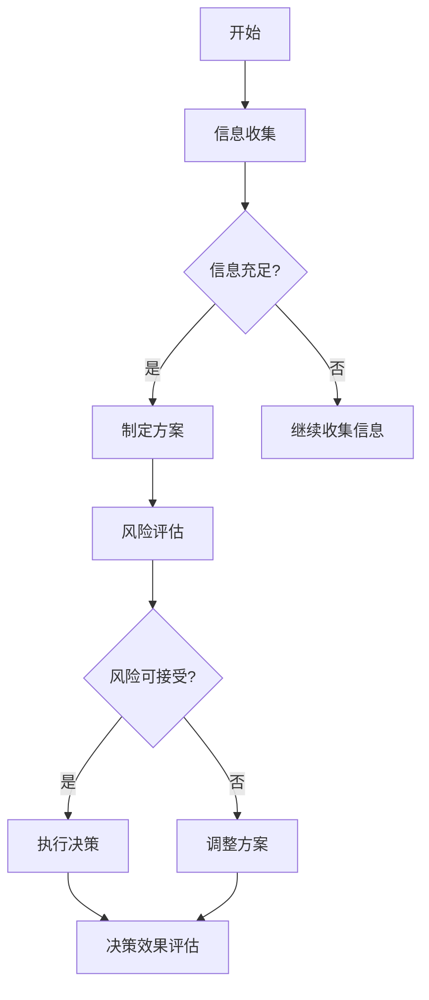
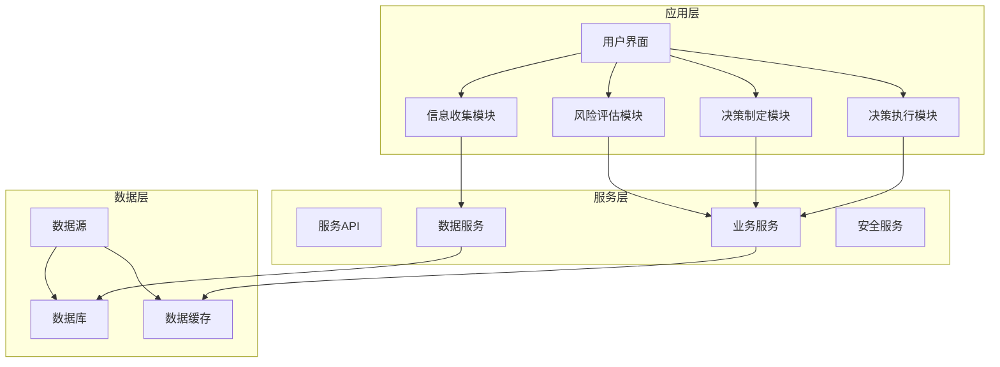
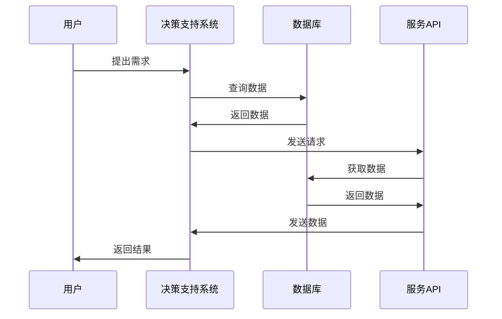

                 

### 《领导力与决断力：果断决策的艺术》

> 关键词：领导力、决断力、决策艺术、果断决策

> 摘要：本文深入探讨了领导力与决断力在现代社会中的重要性，阐述了果断决策的艺术，旨在为读者提供提升领导力与决断力的实用方法与策略。

----------------------------------------------------------------

### 第一部分：领导力与决断力的基础理论

#### 第1章：领导力概述

##### 1.1 领导力的定义与重要性

领导力，作为一种影响力，是指个人在群体中引导、激励和影响他人共同达成目标的能力。在现代管理中，领导力的重要性不言而喻，它不仅决定着组织的绩效，更影响着组织的文化和未来发展。

##### 1.2 领导力的发展历程

领导力的发展历程可以从传统的领导理论，如X理论和Y理论，到当代的领导理论，如变革型领导和服务型领导，再到未来领导力的趋势，如数字化领导力和全球领导力。

##### 1.3 领导力的核心要素

领导力的核心要素包括个人特质、影响力与说服力以及沟通技巧。个人特质如自信、决断力、同情心等，是领导力的基础；影响力与说服力则是领导者引导团队的关键；沟通技巧则是领导力的重要体现。

#### 第2章：决断力与果断决策

##### 2.1 决断力的概念与作用

决断力是指个体在面对复杂情况时，迅速做出明确决策的能力。它在领导中具有关键作用，能够提高决策效率，减少资源浪费。

##### 2.2 果断决策的要素

果断决策的要素包括信息收集与分析、情感管理、风险评估。这些要素共同构成了决策的基础，使决策更加科学和合理。

##### 2.3 果断决策的过程

果断决策的过程包括确定问题、制定方案、执行与调整。这个过程需要领导者具备敏锐的洞察力、逻辑思维和执行力。

#### 第3章：领导力与决断力的关系

##### 3.1 领导力与决断力的互动

领导力与决断力是相辅相成的。决断力可以增强领导力，使领导者更加果断；而领导力则可以提高决断力，使决策更加科学和合理。

##### 3.2 领导力在决策中的角色

领导者在决策中扮演着关键角色，他们需要运用决断力来制定决策，并激发团队的决断力，共同实现目标。

##### 3.3 领导力与决断力的平衡

在领导力与决断力之间取得平衡，是领导者的重要挑战。过度的决断力可能导致专断，而过度的领导力则可能导致优柔寡断。

#### 第4章：提升领导力与决断力的方法

##### 4.1 培养决断力的策略

提升决断力的策略包括培养心理素质、积累经验、学习与借鉴。这些策略可以帮助领导者提高决断力，做出更加科学的决策。

##### 4.2 领导力训练与实践

提升领导力的训练与实践包括参加领导力培训课程、团队协作与领导实践、反思与自我提升。这些方法可以帮助领导者提升领导力，更好地发挥决断力。

##### 4.3 果断决策的技巧

提升果断决策的技巧包括选择合适的决策模型、优化决策过程、决策后的反思。这些技巧可以帮助领导者更加高效地做出决策。

#### 第5章：领导力与决断力的应用案例

##### 5.1 案例一：企业变革中的领导力与决断力

在企业变革中，领导力与决断力的发挥至关重要。领导者需要运用决断力来制定变革方案，并激发团队的支持和参与。

##### 5.2 案例二：危机管理中的决断力

在危机管理中，决断力是领导者的重要素质。领导者需要迅速做出决策，采取有效措施，控制危机，减少损失。

##### 5.3 案例三：创新项目中的领导力与决断力

在创新项目中，领导力与决断力的作用同样重要。领导者需要运用决断力来推动项目进展，解决项目中的困难和挑战。

#### 第6章：领导力与决断力的未来展望

##### 6.1 领导力发展的趋势

随着社会和技术的不断发展，领导力也在不断演变。未来的领导力将更加注重创新、全球视野和数字化能力。

##### 6.2 决断力的未来发展

决断力的发展将受到技术进步的影响。人工智能和大数据的运用将使决策更加科学和高效。

##### 6.3 领导力与决断力的挑战与机遇

领导力与决断力在未来将面临新的挑战，如全球化的影响、技术变革的挑战。同时，这些挑战也带来了新的机遇，领导者需要抓住这些机遇，提升自身的领导力与决断力。

#### 第7章：总结与建议

##### 7.1 领导力与决断力的总结

领导力与决断力是领导者成功的关键。领导者需要不断提升自身的领导力与决断力，以应对复杂多变的环境。

##### 7.2 提升领导力与决断力的建议

提升领导力与决断力的建议包括培养心理素质、积累经验、学习与借鉴，以及参加领导力培训课程和团队协作实践。

----------------------------------------------------------------

**作者：AI天才研究院/AI Genius Institute & 禅与计算机程序设计艺术 /Zen And The Art of Computer Programming**

### 核心概念与联系

#### 决断力的概念

决断力是指个体在面对复杂情况时，迅速做出明确决策的能力。它是一种重要的领导能力，能够提高决策效率，减少资源浪费。

#### 领导力的概念

领导力是指个人在群体中引导、激励和影响他人共同达成目标的能力。它是一种综合能力，包括个人特质、影响力与说服力以及沟通技巧。

#### 果断决策的要素

- **信息收集与分析**：信息是决策的基础，领导者需要收集并分析各种信息，以做出科学合理的决策。
- **情感管理**：情感会影响决策的质量，领导者需要学会管理自己的情感，保持冷静和客观。
- **风险评估**：领导者需要评估决策的风险，并采取相应的措施来降低风险。

#### 领导力与决断力的关系

领导力与决断力是相辅相成的。决断力可以增强领导力，使领导者更加果断；而领导力则可以提高决断力，使决策更加科学和合理。

### 概念属性特征对比表格

| 概念     | 定义                                                         | 特征                                                         | 关联性                                                     |
| -------- | ------------------------------------------------------------ | ------------------------------------------------------------ | -------------------------------------------------------- |
| 领导力   | 个人在群体中引导、激励和影响他人共同达成目标的能力             | 包括个人特质、影响力与说服力、沟通技巧等                     | 决断力可以增强领导力，使领导者更加果断                     |
| 决断力   | 个体在面对复杂情况时，迅速做出明确决策的能力                 | 包括信息收集与分析、情感管理、风险评估等                     | 领导力可以提高决断力，使决策更加科学和合理                 |
| 果断决策 | 在确定问题、制定方案、执行与调整的过程中，快速做出明确决策的能力 | 需要信息收集与分析、情感管理、风险评估等要素的支持           | 是领导力与决断力的具体表现，是领导力与决断力应用的关键环节 |
| 情感管理 | 在决策过程中，领导者需要管理自己的情感，保持冷静和客观         | 情感管理会影响决策的质量                                   | 与决断力和领导力密切相关，是果断决策的重要组成部分         |

### ER实体关系图架构

```mermaid
erDiagram
  Leader ||--|{ DecisionMaker } DecisionMaker : "possesses"
  Leader ||--|{ Decision } Decision : "makes"
  Leader ||--|{ Strategy } Strategy : "uses"
  DecisionMaker ||--|{ Information } Information : "collects"
  DecisionMaker ||--|{ Emotion } Emotion : "manages"
  DecisionMaker ||--|{ Risk } Risk : "assesses"
  Strategy ||--|{ DecisionProcess } DecisionProcess : "follows"
  Decision ||--|{ Outcome } Outcome : "affects"
```

### 算法原理讲解

为了更好地理解决断力的算法原理，我们可以将其抽象为一个决策树模型。决策树模型是一种常用的决策算法，它通过一系列判断节点的分支，最终得出一个明确的决策。

#### 决策树模型



#### Python源代码实现

```python
class DecisionTree:
    def __init__(self):
        self.decision_tree = {
            "信息收集": "是否信息充足？",
            "制定方案": "是否风险可接受？",
            "风险评估": "是/否",
            "执行决策": "决策效果如何？",
            "调整方案": "是/否"
        }
    
    def make_decision(self, info, risk):
        if info["充足"]:
            if risk["可接受"]:
                return "执行决策"
            else:
                return "调整方案"
        else:
            return "继续收集信息"

# 创建决策树实例
tree = DecisionTree()

# 假设的信息和风险情况
info = {"充足": False}
risk = {"可接受": False}

# 执行决策
decision = tree.make_decision(info, risk)
print(f"当前决策：{decision}")
```

#### 算法原理与数学模型

决策树算法的原理是基于一系列条件判断，通过分支节点来生成一个决策路径。其数学模型可以表示为：

$$
P(\text{决策树}) = \prod_{i=1}^{n} P(\text{条件}_i | \text{先验条件})
$$

其中，$P(\text{决策树})$ 表示决策树的概率，$P(\text{条件}_i | \text{先验条件})$ 表示在先验条件下，第 $i$ 个条件的概率。

#### 举例说明

假设一个企业在面对市场变化时，需要进行决策。首先，企业需要收集市场信息，判断信息是否充足。如果信息充足，企业需要评估市场风险，判断风险是否可接受。如果风险可接受，企业可以执行原计划；否则，企业需要调整计划。

这个决策过程可以用决策树模型来表示，并可以通过Python源代码实现。通过这个例子，我们可以看到决策树模型在处理复杂决策问题时的优势和实用性。

### 系统分析与架构设计方案

#### 问题场景介绍

在一个企业的运营过程中，决策是非常重要的环节。为了提高决策的效率和准确性，企业需要一个决策支持系统。这个系统可以帮助企业快速收集信息、评估风险，并做出科学合理的决策。

#### 项目介绍

决策支持系统（Decision Support System，简称DSS）是一个基于计算机技术的信息系统，它可以帮助企业做出更好的决策。该系统包括以下几个主要模块：

- **信息收集模块**：负责从各种数据源收集相关信息。
- **风险评估模块**：负责评估决策的风险，并提供风险分析报告。
- **决策制定模块**：负责根据信息收集和风险评估结果，制定决策方案。
- **决策执行模块**：负责执行决策，并对决策效果进行评估。

#### 系统功能设计（领域模型）

```mermaid
classDiagram
  Class01 <|-- Class02
  Class03 <.. Class04
  Class05 && Class06
  Class07 {name} <<interface>>
  Class08 : +public int get_value():int
  Class08 : +public void set_value(int value):void
```

#### 系统架构设计



#### 系统接口设计和系统交互



### 项目实战

#### 环境安装

1. 安装Python环境
2. 安装相关依赖库，如numpy、pandas、matplotlib等

#### 系统核心实现源代码

```python
# 信息收集模块
def collect_info():
    # 从数据库中获取数据
    data = get_data_from_db()
    # 对数据进行处理
    processed_data = process_data(data)
    return processed_data

# 风险评估模块
def assess_risk(info):
    # 评估风险
    risk_level = calculate_risk_level(info)
    return risk_level

# 决策制定模块
def make_decision(risk):
    # 制定决策方案
    decision_plan = create_decision_plan(risk)
    return decision_plan

# 决策执行模块
def execute_decision(plan):
    # 执行决策
    result = execute_plan(plan)
    return result

# 数据处理函数
def get_data_from_db():
    # 代码实现
    pass

def process_data(data):
    # 代码实现
    pass

def calculate_risk_level(info):
    # 代码实现
    pass

def create_decision_plan(risk):
    # 代码实现
    pass

def execute_plan(plan):
    # 代码实现
    pass
```

#### 代码应用解读与分析

1. **信息收集模块**：通过数据库获取数据，并进行处理。
2. **风险评估模块**：对处理后的数据进行分析，评估风险等级。
3. **决策制定模块**：根据风险评估结果，制定决策方案。
4. **决策执行模块**：执行决策方案，并对决策效果进行评估。

#### 实际案例分析和详细讲解剖析

以一家企业面临的市场变化为例，通过决策支持系统进行决策分析。首先，系统收集市场数据，并对数据进行分析；然后，评估市场风险，制定相应的决策方案；最后，执行决策方案，并对决策效果进行评估。通过这个过程，企业可以更科学地应对市场变化，提高决策的效率和准确性。

#### 项目小结

决策支持系统是一个重要的工具，可以帮助企业做出更加科学和合理的决策。通过信息收集、风险评估和决策制定等模块，系统为企业提供了一个全面的决策支持，提高了决策的效率和准确性。

### 最佳实践 tips

1. **数据收集要全面**：确保收集到的数据能够全面反映问题的情况。
2. **风险评估要准确**：准确评估风险是做出科学决策的关键。
3. **决策方案要具体**：决策方案要具体可行，以便于执行和评估。

### 小结

领导力与决断力是领导者成功的关键。通过提升领导力，领导者可以更好地运用决断力，做出科学合理的决策。本文通过理论讲解、算法实现和实际案例分析，为读者提供了提升领导力与决断力的方法和策略。

### 注意事项

1. **持续学习**：领导力与决断力需要不断学习和实践。
2. **团队合作**：领导力与决断力的提升离不开团队合作。

### 拓展阅读

1. **《领导力：如何在生活中运用的》**：本书详细介绍了领导力的理论和方法，为读者提供了实用的领导技巧。
2. **《决断力：如何做出最佳决策》**：本书探讨了决断力的概念和提升方法，为读者提供了决策的指南。

