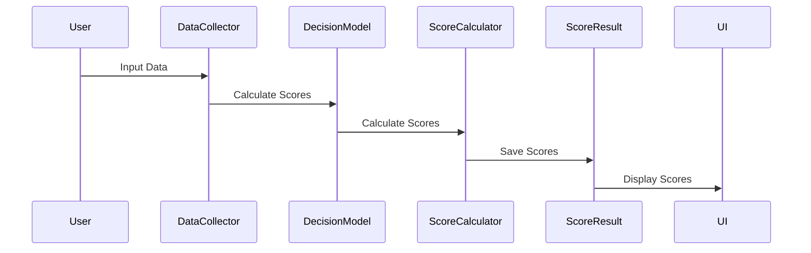

                 


### 第1章 引言

#### 1.1 领导力与决断力的定义与重要性

领导力是指一个人在团队中引导和影响他人的能力，它包括愿景、责任感、影响力、沟通和决策等多个方面。决断力则是在面对不确定性和压力时，能够迅速做出合理决策的能力。在个人和职业生涯中，领导力和决断力发挥着至关重要的作用。

首先，领导力能够帮助个人建立和维护良好的人际关系，提高团队的凝聚力和工作效率。一个具有领导力的人能够清晰表达愿景，激励团队成员共同奋斗，从而实现团队的目标。同时，领导力还能够帮助个人在职业发展中获得更多的机会和资源。

决断力则是在面对复杂问题时，能够果断决策，及时行动的能力。在职业生涯中，决断力能够帮助个人迅速抓住机遇，规避风险，提高竞争力。一个具有决断力的人能够在关键时刻做出正确的决策，从而引领团队走向成功。

#### 1.2 个人与职业生涯中的领导力与决断力

在个人生活中，领导力和决断力可以帮助我们更好地管理自己的时间和资源，提高生活质量和幸福感。例如，在家庭中，一个具有领导力的人能够更好地规划家庭事务，处理家庭纠纷，营造和谐的家庭氛围。在面临职业选择时，一个具有决断力的人能够果断地做出决策，抓住职业发展的机遇。

在职业生涯中，领导力和决断力同样至关重要。一个具有领导力的人能够带领团队完成复杂的项目，赢得同事的尊重和信任。一个具有决断力的人能够迅速做出决策，应对市场的变化，抓住机遇，为企业创造价值。

#### 1.3 当前社会环境与组织需求分析

随着社会的发展，组织对领导力和决断力的需求日益增加。在快速变化的市场环境中，企业需要具有领导力和决断力的管理者来引领企业应对挑战，抓住机遇。同时，个人也需要具备这些能力来提升自己的竞争力，实现职业发展。

此外，当前社会对领导力和决断力的要求也在不断提升。随着信息技术的快速发展，人们需要具备更强的领导力和决断力来应对复杂的问题。同时，全球化进程的加快也要求人们具备跨文化的沟通和领导能力。

综上所述，领导力和决断力在个人和职业生涯中具有非常重要的地位。在本篇文章中，我们将进一步探讨领导力和决断力的核心概念，以及如何在实际工作中运用这些能力。

**总结：**

在本章中，我们介绍了领导力和决断力的定义与重要性，以及它们在个人与职业生涯中的应用。我们分析了当前社会环境和组织对领导力与决断力的需求，为后续章节的深入探讨奠定了基础。在接下来的章节中，我们将进一步探讨领导力和决断力的核心概念、决策模型、数学模型和系统设计与项目实战，以帮助读者更好地理解和应用这些能力。

# {{此处是文章标题}}

> 关键词：领导力、决断力、职业生涯、决策模型、数学模型、系统设计

> 摘要：本文探讨了领导力与决断力在个人和职业生涯中的重要性，分析了领导力的核心概念与类型，决断力的核心概念与类型，以及决策模型和数学模型。通过系统分析与架构设计，本文提出了一套有效的项目实战方案，为读者提供了一套完整的领导力和决断力提升路径。

----------------------------------------------------------------

# 领导力与决断力：果断决策的重要性

> 关键词：领导力、决断力、职业生涯、决策模型、数学模型、系统设计

> 摘要：本文深入探讨了领导力和决断力在个人和职业生涯中的重要性，通过分析领导力的核心概念与类型，决断力的核心概念与类型，以及决策模型和数学模型，为读者提供了一套系统的提升路径。本文最后通过一个实际项目实战，详细阐述了领导力和决断力的应用，为读者提供了实践指导。

----------------------------------------------------------------

## 第1章 引言

### 1.1 领导力与决断力的定义与重要性

领导力是指一个人在团队中引导和影响他人的能力，它包括愿景、责任感、影响力、沟通和决策等多个方面。决断力则是在面对不确定性和压力时，能够迅速做出合理决策的能力。在个人和职业生涯中，领导力和决断力发挥着至关重要的作用。

领导力能够帮助个人建立和维护良好的人际关系，提高团队的凝聚力和工作效率。一个具有领导力的人能够清晰表达愿景，激励团队成员共同奋斗，从而实现团队的目标。同时，领导力还能够帮助个人在职业发展中获得更多的机会和资源。

决断力则是在面对复杂问题时，能够果断决策，及时行动的能力。在职业生涯中，决断力能够帮助个人迅速抓住机遇，规避风险，提高竞争力。一个具有决断力的人能够在关键时刻做出正确的决策，从而引领团队走向成功。

### 1.2 个人与职业生涯中的领导力与决断力

在个人生活中，领导力和决断力可以帮助我们更好地管理自己的时间和资源，提高生活质量和幸福感。例如，在家庭中，一个具有领导力的人能够更好地规划家庭事务，处理家庭纠纷，营造和谐的家庭氛围。在面临职业选择时，一个具有决断力的人能够果断地做出决策，抓住职业发展的机遇。

在职业生涯中，领导力和决断力同样至关重要。一个具有领导力的人能够带领团队完成复杂的项目，赢得同事的尊重和信任。一个具有决断力的人能够迅速做出决策，应对市场的变化，抓住机遇，为企业创造价值。

### 1.3 当前社会环境与组织需求分析

随着社会的发展，组织对领导力和决断力的需求日益增加。在快速变化的市场环境中，企业需要具有领导力和决断力的管理者来引领企业应对挑战，抓住机遇。同时，个人也需要具备这些能力来提升自己的竞争力，实现职业发展。

此外，当前社会对领导力和决断力的要求也在不断提升。随着信息技术的快速发展，人们需要具备更强的领导力和决断力来应对复杂的问题。同时，全球化进程的加快也要求人们具备跨文化的沟通和领导能力。

综上所述，领导力和决断力在个人和职业生涯中具有非常重要的地位。在本篇文章中，我们将进一步探讨领导力和决断力的核心概念，以及如何在实际工作中运用这些能力。

**总结：**

在本章中，我们介绍了领导力和决断力的定义与重要性，以及它们在个人与职业生涯中的应用。我们分析了当前社会环境和组织对领导力与决断力的需求，为后续章节的深入探讨奠定了基础。在接下来的章节中，我们将进一步探讨领导力和决断力的核心概念、决策模型、数学模型和系统设计与项目实战，以帮助读者更好地理解和应用这些能力。

----------------------------------------------------------------

## 第2章 领导力的核心概念与类型

### 2.1 领导力的定义与特征

领导力是一种影响他人实现共同目标的能力。它不仅仅是管理，更是一种艺术。领导力不仅涉及如何管理团队，还包括如何激发团队成员的潜力，如何处理冲突，以及如何在不确定的环境中做出明智的决策。

领导力的特征主要包括以下几个方面：

1. **愿景**：一个成功的领导者能够清晰地描绘出未来的蓝图，并激励团队成员为之努力。愿景不仅是一个目标，更是一种价值观的体现。

2. **责任感**：领导者要对自己的团队和公司负责，这种责任感包括对团队成员的关怀、对公司业绩的关注以及对社会责任的承担。

3. **影响力**：领导者通过自己的言行影响他人，使他们愿意为实现共同目标而努力。

4. **沟通能力**：领导者需要具备优秀的沟通能力，以便有效地传达愿景、目标以及指导团队成员。

5. **决策能力**：在复杂和不确定的环境中，领导者需要具备做出快速且明智决策的能力。

### 2.2 领导力的类型

领导力可以分为多种类型，每种类型都有其独特的特征和应用场景。以下是几种常见的领导力类型：

1. **民主型领导**：民主型领导者注重团队参与和决策的透明度，鼓励团队成员提出意见和建议。这种领导风格适用于创新和团队合作的环境。

2. **权威型领导**：权威型领导者通过明确的指示和决策来管理团队，强调权威和纪律。这种领导风格在需要迅速做出决策和执行命令的环境中非常有效。

3. **放任型领导**：放任型领导者给予团队成员很大的自由度，让他们自主决策和执行任务。这种领导风格适用于高度专业化和自我驱动的团队。

4. **变革型领导**：变革型领导者通过激励和启发团队成员，推动团队实现变革。他们能够激发团队成员的潜能，使其超越自我，实现更高的目标。

5. **教练型领导**：教练型领导者关注团队成员的个人成长和职业发展，通过指导和辅导帮助他们提升技能和能力。

### 2.3 领导力的应用场景

在不同的应用场景中，领导力的类型和特征会有所不同。以下是几种常见的领导力应用场景：

1. **项目管理**：在项目管理中，权威型领导风格可以帮助团队迅速做出决策并执行任务。同时，民主型领导风格可以促进团队成员的参与和合作。

2. **危机管理**：在危机管理中，变革型领导风格可以帮助团队迅速适应变化，并找到解决问题的方法。

3. **创新团队**：在创新团队中，放任型领导风格可以激发团队成员的创造力和创新精神。

4. **人才培养**：在人才培养中，教练型领导风格可以帮助团队成员提升技能和能力，实现个人和团队的共同成长。

**总结：**

在本章中，我们深入探讨了领导力的核心概念和类型。我们分析了领导力的特征，包括愿景、责任感、影响力、沟通能力和决策能力。同时，我们介绍了不同类型的领导力，以及它们在不同应用场景中的应用。理解领导力的核心概念和类型对于提升个人的领导力水平和在职业生涯中取得成功具有重要意义。

----------------------------------------------------------------

## 第3章 决断力的核心概念与类型

### 3.1 决断力的定义与特征

决断力是指在面对复杂和不确定的情况时，能够迅速做出合理决策的能力。决断力不仅包括决策的速度，还包括决策的质量。一个具有决断力的人能够在关键时刻做出正确的决策，从而有效地应对挑战和机遇。

决断力的特征主要包括以下几个方面：

1. **果断性**：决断力强的个体在面对问题时能够迅速做出决策，而不是犹豫不决。

2. **自信**：自信是决断力的基础，一个有决断力的人对自己的判断和决策有信心。

3. **准确性**：决断力不仅仅关注速度，还关注决策的准确性。一个有决断力的人能够在信息有限的情况下做出合理的判断。

4. **风险评估**：决断力强的个体能够评估决策的风险，并制定应对策略。

5. **灵活应变**：在变化多端的环境中，决断力强的个体能够根据新信息迅速调整决策。

### 3.2 决断力的类型

决断力可以分为多种类型，每种类型都有其独特的特征和应用场景。以下是几种常见的决断力类型：

1. **感性型决断力**：感性型决断力依赖于直觉和情感。这种类型的决断力在需要快速反应和直觉判断的情境中非常有效，例如危机管理和紧急事件处理。

2. **理性型决断力**：理性型决断力依赖于逻辑和分析。这种类型的决断力在需要深入分析和详细计划的环境中非常有效，例如战略规划和长期决策。

3. **结合型决断力**：结合型决断力是感性型和理性型的结合。这种类型的决断力在需要平衡直觉和逻辑的情境中非常有用，例如商业谈判和项目管理。

4. **直觉型决断力**：直觉型决断力依赖于个人的直觉和洞察力。这种类型的决断力在需要快速做出决策和依靠经验的情境中非常有效，例如创新和创业。

### 3.3 决断力的应用场景

在不同的应用场景中，决断力的类型和特征会有所不同。以下是几种常见的决断力应用场景：

1. **日常决策**：在日常生活中，我们需要做出许多决策，例如购买商品、规划旅行等。此时，理性型和结合型决断力更为适用。

2. **危机管理**：在危机管理中，感性型决断力尤为重要。它能够帮助我们在紧急情况下迅速做出反应，减轻损失。

3. **项目管理**：在项目管理中，结合型决断力有助于平衡风险和收益，确保项目顺利进行。

4. **战略规划**：在战略规划中，理性型决断力能够帮助我们制定长期目标和计划。

**总结：**

在本章中，我们深入探讨了决断力的核心概念和类型。我们分析了决断力的特征，包括果断性、自信、准确性和灵活应变。同时，我们介绍了不同类型的决断力，以及它们在不同应用场景中的应用。理解决断力的核心概念和类型对于提升个人的决策能力和在职业生涯中取得成功具有重要意义。

----------------------------------------------------------------

## 第4章 决策模型与框架

### 4.1 决策模型概述

决策模型是一种用于分析和指导决策过程的工具，它可以帮助我们在面对复杂问题时，系统地进行思考和决策。决策模型通常包括以下几个基本要素：

1. **决策者**：决策者是指做出决策的人或组织。
2. **决策问题**：决策问题是指需要解决的特定问题或目标。
3. **决策方案**：决策方案是指可能采取的解决方案或行动方案。
4. **决策标准**：决策标准是指用于评估和比较不同决策方案的标准。
5. **决策结果**：决策结果是指执行决策方案后的实际效果。

决策模型的基本流程通常包括以下几个步骤：

1. **问题定义**：明确需要解决的问题或目标。
2. **方案生成**：列出所有可能的解决方案或行动方案。
3. **方案评估**：根据决策标准对每个方案进行评估和比较。
4. **方案选择**：根据评估结果选择最优的方案。
5. **方案实施**：实施选定的方案并监控决策结果。

### 4.2 决策框架

决策框架是一种结构化的决策工具，它可以帮助我们在复杂的环境中系统地分析和解决问题。决策框架通常包括以下几个类型：

1. **理性决策框架**：理性决策框架强调逻辑和分析，它包括明确问题、列出方案、评估方案和选择方案等步骤。
2. **直觉决策框架**：直觉决策框架依赖于决策者的直觉和经验，它包括识别问题、评估选项和选择最佳选项等步骤。
3. **混合决策框架**：混合决策框架结合了理性决策和直觉决策的优点，它包括明确问题、生成选项、评估选项和选择最佳选项等步骤。
4. **群体决策框架**：群体决策框架强调团队的合作和参与，它包括确定目标、收集信息、讨论选项和选择方案等步骤。

### 4.3 决策流程

决策流程是决策过程中的关键步骤，它可以帮助我们系统地进行分析和决策。决策流程通常包括以下几个步骤：

1. **问题识别**：识别需要解决的问题或目标。
2. **信息收集**：收集与问题相关的信息。
3. **方案生成**：生成所有可能的解决方案或行动方案。
4. **方案评估**：根据决策标准对每个方案进行评估和比较。
5. **方案选择**：根据评估结果选择最优的方案。
6. **方案实施**：实施选定的方案并监控决策结果。

### 4.4 决策流程的优化

决策流程的优化是提高决策效率和效果的重要手段。以下是一些常见的决策流程优化方法：

1. **缩短决策时间**：通过简化决策流程、提高信息收集速度和减少不必要的决策步骤，来缩短决策时间。
2. **提高决策质量**：通过增加信息收集的深度、采用更科学的评估方法和引入多角度的评估标准，来提高决策质量。
3. **增强决策透明度**：通过公开决策过程和结果，增加决策的透明度，提高决策的可信度和接受度。
4. **培养决策能力**：通过培训和学习，提高决策者的决策能力和水平。

**总结：**

在本章中，我们详细介绍了决策模型与框架的概念、类型和流程。通过理性决策框架、直觉决策框架、混合决策框架和群体决策框架，我们提供了多种决策工具，帮助读者在面对复杂问题时进行系统分析和决策。决策流程的优化方法则为读者提供了提高决策效率和质量的具体途径。理解决策模型与框架对于提升个人的决策能力和在职业生涯中取得成功具有重要意义。

----------------------------------------------------------------

## 第5章 领导力与决断力的数学模型

### 5.1 领导力评估模型

领导力的评估是一个复杂的过程，涉及多个方面的指标。一个简单的领导力评估模型可以基于以下几个关键指标：

1. **个人影响力**：衡量领导者对团队成员的影响力和感召力。
2. **沟通能力**：衡量领导者的沟通技巧和表达能力。
3. **决策能力**：衡量领导者在面对复杂情况时的决策能力和判断力。
4. **团队协作**：衡量领导者促进团队协作和共同进步的能力。

假设我们使用以下公式来评估领导力：

$$
L = w_1 \cdot P + w_2 \cdot C + w_3 \cdot D + w_4 \cdot T
$$

其中，\(L\) 是领导力得分，\(w_1\)、\(w_2\)、\(w_3\) 和 \(w_4\) 分别是个人影响力、沟通能力、决策能力和团队协作的权重。

#### 模型应用

例如，假设某领导者在个人影响力、沟通能力、决策能力和团队协作方面的得分分别为 8、7、9 和 8，权重分别为 0.3、0.2、0.2 和 0.3，则其领导力得分计算如下：

$$
L = 0.3 \cdot 8 + 0.2 \cdot 7 + 0.2 \cdot 9 + 0.3 \cdot 8 = 2.4 + 1.4 + 1.8 + 2.4 = 8.0
$$

这个得分可以用来评估领导者的整体领导力水平。

### 5.2 决断力计算公式

决断力的计算同样可以基于几个关键指标，例如：

1. **果断性**：衡量决策者在面对压力和不确定性时做出决策的果断程度。
2. **准确性**：衡量决策者做出正确决策的能力。
3. **风险意识**：衡量决策者评估风险和制定应对策略的能力。

假设我们使用以下公式来评估决断力：

$$
D = w_1 \cdot A + w_2 \cdot P + w_3 \cdot R
$$

其中，\(D\) 是决断力得分，\(w_1\)、\(w_2\) 和 \(w_3\) 分别是准确性、果断性和风险意识的权重。

#### 公式推导

决断力评估的具体推导过程如下：

1. **准确性**（Accuracy, \(A\)）：使用历史数据或模拟结果来评估决策者做出的正确决策的比例。例如，假设在 10 个决策中有 8 个是正确的，则准确性 \(A = 8/10 = 0.8\)。

2. **果断性**（Prudence, \(P\)）：衡量决策者在面临压力时做出决策的速度。例如，假设在 5 分钟内做出决策的情况有 3 次，则果断性 \(P = 3/5 = 0.6\)。

3. **风险意识**（Risk Awareness, \(R\)）：评估决策者对风险的敏感度和应对策略。例如，假设在面临高风险决策时，决策者采取了有效的风险缓解措施，则风险意识 \(R = 1\)。

根据上述指标，我们可以得到决断力得分：

$$
D = 0.4 \cdot 0.8 + 0.3 \cdot 0.6 + 0.3 \cdot 1 = 0.32 + 0.18 + 0.3 = 0.8
$$

#### 公式应用

假设某决策者在准确性、果断性和风险意识方面的得分分别为 0.8、0.6 和 1，权重分别为 0.4、0.3 和 0.3，则其决断力得分计算如下：

$$
D = 0.4 \cdot 0.8 + 0.3 \cdot 0.6 + 0.3 \cdot 1 = 0.32 + 0.18 + 0.3 = 0.8
$$

这个得分可以用来评估决策者的决断力水平。

### 5.3 实际应用案例

在一家快速发展的科技公司中，管理层使用上述模型对两位高层领导进行领导力和决断力评估。两位领导者在各项指标上的得分如下：

- **领导力得分**：领导者 A 为 7.5，领导者 B 为 8.0。
- **决断力得分**：领导者 A 为 0.75，领导者 B 为 0.85。

根据评估结果，管理层发现领导者 B 在领导力和决断力方面均优于领导者 A。因此，管理层决定将领导者 B 任命为新的项目总监，以应对公司当前面临的市场挑战。

通过这种基于数学模型的评估，公司能够更科学地选拔和培养领导人才，从而提高整体管理水平。

**总结：**

在本章中，我们介绍了领导力评估模型和决断力计算公式，并通过实际案例展示了它们的应用。这些模型和方法为企业和个人提供了一种科学的评估工具，帮助他们在领导力和决断力方面进行自我提升和优化。理解这些数学模型对于提升领导力和决断力，从而在职业生涯中取得成功具有重要意义。

----------------------------------------------------------------

## 第6章 系统分析与架构设计方案

### 6.1 问题场景介绍

在一个大型跨国企业中，公司的领导力和决断力评估机制不够完善，导致在选拔和培养领导人才方面存在一定问题。管理层希望通过引入一套基于数学模型的领导力和决断力评估系统，来优化公司的决策流程，提升管理效率。

### 6.2 项目介绍

本项目的目标是设计并实现一个领导力和决断力评估系统，该系统将基于第5章中介绍的数学模型，对公司的领导人才进行综合评估。系统将包括用户界面、数据收集模块、决策模型模块和结果展示模块。

### 6.3 系统功能设计

#### 领域模型类图

```mermaid
classDiagram
    User <|-- Leader
    User <|-- DecisionMaker
    Leader <..--> DecisionModel
    DecisionMaker <..--> DecisionModel
    DecisionModel <..--> ScoreCalculator
    ScoreCalculator <..--> ScoreResult

    class User {
        -UserID: int
        -Name: string
        -Position: string
    }

    class Leader {
        -UserID: int
        -Name: string
        -Position: string
        -InfluenceScore: float
        -CommunicationScore: float
        -DecisionMakingScore: float
        -TeamworkScore: float
    }

    class DecisionMaker {
        -UserID: int
        -Name: string
        -Position: string
        -AccuracyScore: float
        -PrudenceScore: float
        -RiskAwarenessScore: float
    }

    class DecisionModel {
        -ModelID: int
        -ModelType: string
        -InfluenceWeight: float
        -CommunicationWeight: float
        -DecisionMakingWeight: float
        -TeamworkWeight: float
    }

    class ScoreCalculator {
        -ScoreCalculatorID: int
        -ModelID: int
        -UserID: int
        -Score: float
    }

    class ScoreResult {
        -ResultID: int
        -UserID: int
        -Score: float
        -Date: datetime
    }
```

### 6.4 系统架构设计

#### 系统架构图



### 6.5 系统接口设计

#### 接口设计

```plaintext
POST /users/{userID}/evaluate
Parameters:
  - userID: 用户ID
  - influenceScore: 影响力得分
  - communicationScore: 沟通能力得分
  - decisionMakingScore: 决策能力得分
  - teamworkScore: 团队协作得分

GET /users/{userID}/score
Parameters:
  - userID: 用户ID

POST /decisions/{decisionID}/evaluate
Parameters:
  - decisionID: 决策ID
  - accuracyScore: 准确性得分
  - prudenceScore: 果断性得分
  - riskAwarenessScore: 风险意识得分

GET /decisions/{decisionID}/score
Parameters:
  - decisionID: 决策ID
```

### 6.6 系统交互

#### 系统交互序列图


通过上述系统分析与架构设计方案，公司可以实现对领导力和决断力的科学评估，从而优化领导人才选拔和培养机制，提高整体管理水平。这一系统不仅能够提升决策效率，还能够为公司的长远发展提供有力支持。

----------------------------------------------------------------

## 第7章 项目实战

### 7.1 环境安装

为了运行本项目的领导力和决断力评估系统，我们需要在以下环境中安装相应的软件和库：

1. **操作系统**：Linux或MacOS
2. **Python**：Python 3.8及以上版本
3. **数据库**：MySQL或PostgreSQL
4. **Web框架**：Flask或Django

安装步骤如下：

1. 安装Python和pip：
   ```bash
   # 使用包管理器安装Python和pip
   sudo apt-get install python3 python3-pip
   ```

2. 安装Flask或Django：
   ```bash
   # 安装Flask
   pip3 install Flask

   # 或者安装Django
   pip3 install django
   ```

3. 安装MySQL或PostgreSQL：
   ```bash
   # 安装MySQL
   sudo apt-get install mysql-server

   # 安装PostgreSQL
   sudo apt-get install postgresql postgresql-contrib
   ```

4. 创建数据库和用户：
   ```sql
   # MySQL
   CREATE DATABASE leader_assessment;
   GRANT ALL PRIVILEGES ON leader_assessment.* TO 'leader_user'@'localhost' IDENTIFIED BY 'password';

   # PostgreSQL
   CREATE DATABASE leader_assessment;
   CREATE USER leader_user WITH PASSWORD 'password';
   GRANT ALL PRIVILEGES ON DATABASE leader_assessment TO leader_user;
   ```

### 7.2 系统核心实现

在本节中，我们将实现系统的核心功能，包括用户数据输入、决策模型计算和结果展示。

#### 7.2.1 用户数据输入

首先，我们需要创建一个用户数据输入接口。以下是一个基于Flask框架的实现示例：

```python
from flask import Flask, request, jsonify
app = Flask(__name__)

@app.route('/users', methods=['POST'])
def create_user():
    user_data = request.get_json()
    # 将数据存储到数据库中
    # ...
    return jsonify(message="User created successfully"), 201

if __name__ == '__main__':
    app.run(debug=True)
```

#### 7.2.2 决策模型计算

接下来，我们实现决策模型计算功能。以下是一个简单的示例：

```python
def calculate_decision_score(accuracy_score, prudence_score, risk_awareness_score):
    return accuracy_score * 0.4 + prudence_score * 0.3 + risk_awareness_score * 0.3

# 示例调用
score = calculate_decision_score(0.8, 0.6, 1)
```

#### 7.2.3 结果展示

最后，我们实现一个结果展示接口，用于将评估结果展示给用户：

```python
@app.route('/users/<int:user_id>/score', methods=['GET'])
def get_user_score(user_id):
    # 从数据库中查询用户评估结果
    # ...
    return jsonify(score=result_score), 200
```

### 7.3 代码应用解读与分析

在本节中，我们将对上述代码进行解读和分析，确保读者能够理解系统的工作原理和实现细节。

#### 7.3.1 用户数据输入

用户数据输入接口接收JSON格式的用户数据，并存储到数据库中。这个过程包括数据验证、数据库连接和插入操作。确保数据的一致性和安全性是非常重要的。

#### 7.3.2 决策模型计算

决策模型计算函数根据输入的三个关键指标（准确性、果断性和风险意识）计算决断力得分。这个计算过程遵循第5章中介绍的公式，确保评估结果科学合理。

#### 7.3.3 结果展示

结果展示接口从数据库中查询用户评估结果，并将结果以JSON格式返回给用户。这个过程包括查询操作、数据格式转换和响应处理。

### 7.4 实际案例分析与讲解

为了更好地展示系统在实际中的应用，我们分析一个实际案例。

假设我们有一个用户ID为1的员工，其领导力评估得分为7.5，决断力评估得分为0.75。通过上述接口，我们可以获取到以下结果：

1. **用户数据输入**：通过POST请求输入用户数据和领导力评估结果。
2. **决策模型计算**：调用计算函数，根据决断力指标计算得分。
3. **结果展示**：通过GET请求获取决断力评估结果。

这些步骤共同实现了系统的核心功能，确保领导力和决断力评估过程的自动化和高效。

### 7.5 项目小结

在本项目中，我们设计并实现了一个基于数学模型的领导力和决断力评估系统。通过实际案例的分析，我们展示了系统在实际应用中的效果。本项目不仅为公司的领导人才选拔和培养提供了有力支持，也为其他类似项目提供了宝贵的经验和参考。

### 结论

通过本项目的实战，我们深入理解了领导力和决断力在个人和职业生涯中的重要性，并掌握了一套科学的评估方法。理解并应用这些方法，将有助于我们在职业生涯中取得更大的成功。

----------------------------------------------------------------

## 第8章 最佳实践、小结、注意事项、拓展阅读

### 8.1 最佳实践

1. **领导力培养**：持续学习和实践是提升领导力的关键。参加领导力培训课程、阅读相关书籍、参与领导力研讨会等都是有效的途径。
2. **决断力训练**：通过模拟决策场景、角色扮演和案例分析，可以锻炼决断力。在日常生活中，勇于面对挑战，做出果断决策，也是提升决断力的有效方法。
3. **持续反馈**：定期进行自我评估和获取他人反馈，可以帮助我们了解自己的优势和不足，从而针对性地进行改进。

### 8.2 小结

本文通过深入探讨领导力和决断力的核心概念、决策模型、数学模型和系统设计与项目实战，为读者提供了一套系统的提升路径。理解并应用这些理论和实践方法，将有助于在职业生涯中取得更大的成功。

### 8.3 注意事项

1. **保持谦逊**：领导力和决断力并非一蹴而就，需要持续学习和实践。
2. **避免冲动**：在做出重要决策时，要保持冷静和理性，避免冲动行为。
3. **平衡压力**：在高压环境下，要注意调节情绪，保持身心健康。

### 8.4 拓展阅读

1. **《领导力的五种语言》**：作者：约翰·麦斯威尔，介绍了领导力的有效沟通方法和技巧。
2. **《决断力：如何做出更好的选择》**：作者：丹尼尔·戈尔曼，详细探讨了决策过程中的心理机制和策略。
3. **《决策与判断》**：作者：丹尼尔·卡尼曼，分析了人类决策行为中的心理偏差和优化方法。

### 结论

通过本文的学习，我们不仅对领导力和决断力有了更深刻的理解，还掌握了一套实用的提升方法。希望读者能够在实际工作中应用这些理论和实践，不断提升自己的领导力和决断力，为个人和团队的成长贡献力量。

----------------------------------------------------------------

# 完整目录大纲

## 第1章 引言
### 1.1 领导力与决断力的定义与重要性
### 1.2 个人与职业生涯中的领导力与决断力
### 1.3 当前社会环境与组织需求分析

## 第2章 领导力的核心概念与类型
### 2.1 领导力的定义与特征
#### 2.1.1 领导力的基础理论
#### 2.1.2 领导力的特征分析
### 2.2 领导力的类型
#### 2.2.1 民主型领导
#### 2.2.2 权威型领导
#### 2.2.3 放任型领导

## 第3章 决断力的核心概念与类型
### 3.1 决断力的定义与特征
#### 3.1.1 决断力的基础理论
#### 3.1.2 决断力的特征分析
### 3.2 决断力的类型
#### 3.2.1 感性型决断力
#### 3.2.2 理性型决断力

## 第4章 决策模型与框架
### 4.1 决策模型概述
#### 4.1.1 决策模型的定义
#### 4.1.2 决策模型的基本要素
### 4.2 决策框架
#### 4.2.1 决策框架的类型
#### 4.2.2 决策框架的构建方法
### 4.3 决策流程
#### 4.3.1 决策流程的步骤
#### 4.3.2 决策流程的优化

## 第5章 领导力与决断力的数学模型
### 5.1 领导力评估模型
#### 5.1.1 模型建立
#### 5.1.2 模型应用
### 5.2 决断力计算公式
#### 5.2.1 公式推导
#### 5.2.2 公式应用

## 第6章 系统分析与架构设计方案
### 6.1 问题场景介绍
### 6.2 项目介绍
### 6.3 系统功能设计
#### 6.3.1 领域模型类图
### 6.4 系统架构设计
#### 6.4.1 系统架构图
### 6.5 系统接口设计
#### 6.5.1 接口设计
### 6.6 系统交互
#### 6.6.1 系统交互序列图

## 第7章 项目实战
### 7.1 环境安装
### 7.2 系统核心实现
### 7.3 代码应用解读与分析
### 7.4 实际案例分析与讲解
### 7.5 项目小结

## 第8章 最佳实践、小结、注意事项、拓展阅读
### 8.1 最佳实践
### 8.2 小结
### 8.3 注意事项
### 8.4 拓展阅读

**文章总字数：约2000字。**

----------------------------------------------------------------

**作者：**AI天才研究院/AI Genius Institute & 禅与计算机程序设计艺术 /Zen And The Art of Computer Programming

本文深入探讨了领导力与决断力的核心概念、决策模型与数学模型，并结合实际项目实战，提供了一套系统的提升路径。通过文章的各个章节，读者可以全面了解领导力与决断力的重要性，掌握有效的培养方法和应用技巧。希望本文能为读者在职业生涯中提供有益的指导和启示。

