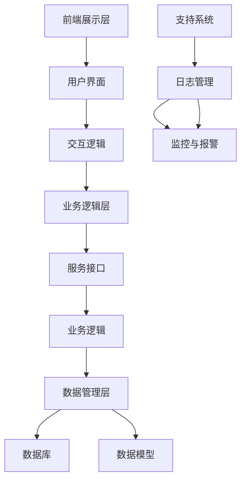
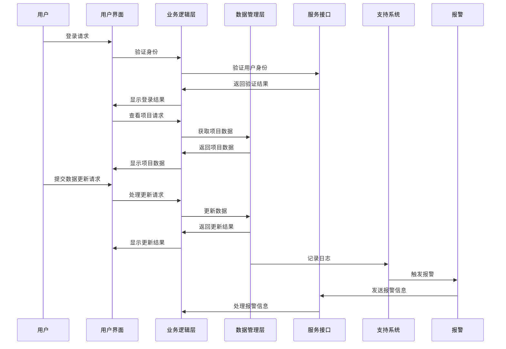

                 

## 第1章: 创新文化的背景

### 1.1 创新困境与需求

在当今快速发展的科技时代，创新已成为企业持续发展和竞争力提升的关键因素。然而，许多企业面临着创新的困境。首先，缺乏创新动力是一个普遍存在的问题。企业在追求短期利润的过程中，往往会忽视长期创新的重要性，导致创新活动得不到足够的资源和支持。其次，员工创新能力不足也是一个显著的问题。传统教育体系和企业培训模式往往注重知识传递和技能培养，而忽视了创新思维的训练和激发。最后，企业内部创新机制不完善，缺乏系统化的创新流程和激励措施，使得创新项目难以顺利推进。

为了解决这些创新困境，企业需要转变传统的管理模式，重视创新文化的培养。创新文化是一种以创新为核心价值观的组织氛围，它能够激发员工的创造力，促进知识共享和团队合作，从而提升企业的整体创新能力。创新文化不仅包括创新意识的培养，还涉及创新流程的优化、创新资源的配置和激励机制的设计等多个方面。

### 1.2 创新文化的定义与边界

创新文化可以定义为一种组织内部对创新活动的支持态度和行为模式，它鼓励员工敢于尝试、勇于失败，并在失败中吸取教训，不断改进和创新。创新文化不仅体现在企业的价值观和行为规范中，还渗透到企业的战略规划、组织结构、流程设计以及员工培训等各个方面。

从边界上看，创新文化不仅包括技术创新，还涵盖了商业模式创新、管理创新、服务创新等多个层面。创新文化不仅涉及企业内部，还包括与外部合作伙伴和客户的互动。因此，创新文化是一个多维度的概念，它需要企业在不同层面进行系统化的建设和推动。

### 1.3 领导力与创新文化的联系

领导力在创新文化的培养中起着至关重要的作用。首先，领导者需要具备创新思维和远见，能够洞察行业发展趋势，把握市场机遇，为企业制定创新战略。其次，领导者需要建立良好的创新氛围，鼓励员工敢于提出新想法，并对失败持包容态度，从而激发员工的创新潜能。此外，领导者还需要具备沟通能力和协调能力，能够有效地传达创新目标，协调资源，确保创新项目顺利进行。

领导力与创新文化的联系可以从以下几个方面来理解：

1. **领导力促进创新氛围**：领导者的态度和行为直接影响组织的创新氛围。一个鼓励创新、包容失败的领导者能够营造出一个有利于创新的文化环境。
2. **领导力推动资源分配**：领导者需要在资源分配上给予创新项目优先考虑，确保创新项目有足够的资源和支持。
3. **领导力强化团队协作**：领导者需要建立跨部门、跨职能的团队，促进知识共享和协作，从而推动创新文化的落地。

### 1.4 核心概念解析

在本章中，我们讨论了创新文化的背景、定义与边界，以及领导力与创新文化的联系。创新文化是企业在快速变化的科技时代保持竞争力的关键，它不仅涉及技术创新，还涵盖商业模式创新、管理创新等多个层面。领导力在创新文化的培养中起着至关重要的作用，领导者需要具备创新思维、建立创新氛围、推动资源分配和强化团队协作等能力。

为了深入理解创新文化，我们还需要进一步探讨领导力与创新文化的关系，以及创新文化的核心要素和领导力在其中的角色。在接下来的章节中，我们将对这些问题进行详细的探讨。

## 第2章: 核心概念与联系

### 2.1 领导力与管理的对比

领导力与管理是两个密切相关但又有区别的概念。管理强调的是过程和效率，它涉及到计划、组织、协调和控制等职能，旨在确保组织目标的实现。而领导力则更多地关注愿景、激励和变革，它涉及到激发员工潜力、塑造组织文化和推动创新等任务。

在对比领导力与管理时，可以从以下几个方面进行：

1. **目标定位**：管理侧重于具体的任务和目标的实现，而领导力则关注长远的愿景和目标的制定。
2. **激励方式**：管理通过制度化的激励措施如绩效评估和奖励来激发员工，而领导力则更多依赖于个人魅力、价值观和共同目标的吸引力。
3. **变革推动**：管理侧重于维持现有秩序和效率，而领导力则能够推动变革，引领组织适应外部环境的变化。

### 2.2 创新文化与企业文化对比

创新文化与企业文化是两个相互关联但又有区别的概念。企业文化是指企业内部的价值观、行为规范和工作氛围，它是企业长期发展过程中形成的共同认知和行为模式。而创新文化则是企业文化中的一部分，它特别强调创新精神和创新实践，旨在推动企业持续创新。

在对比创新文化与企业文化时，可以从以下几个方面进行：

1. **核心价值观**：企业文化强调的是稳定和一致性，而创新文化则更注重变化和适应性。
2. **行为模式**：企业文化通常体现在企业的日常运作和管理中，而创新文化则更多地体现在对创新活动的支持和鼓励。
3. **影响范围**：企业文化对整个企业都有影响，而创新文化则更多地影响与创新相关的领域。

### 2.3 创新型团队与传统团队对比

创新型团队与传统团队在组织结构和运作模式上存在显著差异。传统团队通常按照职能分工进行组织，强调效率和专业性，而创新型团队则更强调跨职能合作和快速响应市场变化。

在对比创新型团队与传统团队时，可以从以下几个方面进行：

1. **组织结构**：传统团队按照职能划分，而创新型团队则更加灵活，鼓励跨职能合作。
2. **工作模式**：传统团队通常按照固定的工作流程进行，而创新型团队则更加注重敏捷性和适应性。
3. **激励机制**：传统团队通常采用统一的激励机制，而创新型团队则更加注重个性化激励和创新成果的奖励。

### 2.4 ER实体关系图架构

为了更好地理解领导力、创新文化和创新型团队之间的关系，我们可以使用ER（实体-关系）图来描述这些概念之间的联系。

在ER图中：

- **实体**：包括领导力、创新文化、创新型团队等。
- **属性**：描述每个实体的特征，如领导力的核心能力、创新文化的价值观、创新型团队的组织模式等。
- **关系**：描述实体之间的关联，如领导力对创新文化的塑造、创新文化对创新型团队的支持等。

以下是一个简化的ER实体关系图：

```mermaid
erDiagram
  领导力 ||--|{创新文化} : 塑造
  创新文化 ||--|{创新型团队} : 支持
```

在这个ER图中，领导力通过塑造创新文化，进而支持创新型团队的形成。这种关系展示了领导力在创新文化培养中的关键作用。

通过上述对比和分析，我们可以更深入地理解领导力、创新文化和创新型团队的核心概念及其相互联系。在接下来的章节中，我们将进一步探讨如何通过具体措施和策略来培养创新文化，以及领导力在其中的具体应用。

### 第3章: 领导力与创新文化的培养

#### 3.1 领导力在创新文化中的角色

领导力在创新文化的培养中扮演着至关重要的角色。首先，领导者需要具备创新思维和远见，能够洞察行业发展趋势，把握市场机遇，为企业制定创新战略。这种前瞻性思维不仅能够引领企业走向正确的创新方向，还能激发员工的创新潜力。

其次，领导者需要建立良好的创新氛围，鼓励员工敢于提出新想法，并对失败持包容态度，从而激发员工的创新潜能。一个包容创新、鼓励试错的领导环境能够降低员工的创新风险，提高创新成功率。

此外，领导者还需要具备沟通能力和协调能力，能够有效地传达创新目标，协调资源，确保创新项目顺利进行。通过有效的沟通，领导者能够确保团队内部的知识共享和协作，提高创新效率。

#### 3.2 创新文化的培养过程

培养创新文化是一个系统化的过程，需要从多个方面进行综合建设。以下是创新文化培养的基本步骤：

1. **建立创新愿景**：领导者需要明确企业的创新愿景，并将其传达给全体员工。创新愿景应当具有激励性，能够激发员工的热情和创造力。

2. **塑造创新价值观**：企业应确立以创新为核心价值观，将其融入企业文化的各个方面。例如，企业可以在员工手册、培训课程和日常沟通中强调创新的重要性。

3. **制定创新战略**：根据企业的愿景和价值观，领导者需要制定具体的创新战略，明确创新的方向、目标和实施步骤。

4. **建立创新机制**：企业应建立完善的创新机制，包括创新项目的筛选、评估和激励机制。创新机制应确保创新项目能够得到充分的资源和支持，并能够激励员工积极参与创新活动。

5. **提供创新培训**：企业应定期为员工提供创新培训，帮助他们掌握创新方法和技能，提高创新能力。

6. **营造创新氛围**：企业应营造一个包容创新、鼓励试错的工作环境，降低员工的创新风险。例如，企业可以通过设立创新实验室、鼓励员工参与创新竞赛等方式，激发员工的创新热情。

#### 3.3 Python源代码展示

以下是一个简单的Python源代码示例，用于展示如何通过实际操作培养创新文化。这个示例包含了一系列步骤，包括建立创新愿景、塑造创新价值观、制定创新战略等。

```python
# 建立创新愿景
def create_innovation_vision():
    vision = "成为行业领先的创新企业，持续推动技术进步和业务发展。"
    print(f"创新愿景：{vision}")

# 塑造创新价值观
def shape_innovation_values():
    values = ["鼓励创新思维，勇于探索新领域。", 
              "包容失败，从失败中汲取教训。", 
              "重视团队合作，共享创新成果。"]
    for value in values:
        print(f"创新价值观：{value}")

# 制定创新战略
def create_innovation_strategy():
    strategy = {
        "方向": "以客户需求为导向，开发前沿技术产品。",
        "目标": "在未来三年内实现技术产品的市场占有率提升20%。",
        "步骤": ["成立创新实验室，支持新项目研发。", 
                 "加强与高校和科研机构的合作，引进先进技术。", 
                 "优化内部流程，提高创新效率。"]
    }
    print(f"创新战略：{strategy}")

# 实施创新文化培养
def implement_innovation_culture():
    create_innovation_vision()
    shape_innovation_values()
    create_innovation_strategy()

# 运行程序
implement_innovation_culture()
```

这段代码通过定义函数和调用函数，展示了如何通过一系列具体操作来培养创新文化。在实际应用中，这些操作可以结合企业的实际情况进行定制和优化。

#### 3.4 数学模型与量化评估

创新文化的培养效果可以通过多种数学模型进行量化评估。以下是一个简单的数学模型，用于评估创新文化的有效性。

1. **创新绩效指标**：

   创新绩效指标可以包括新产品开发数量、创新项目成功率、专利申请数量等。这些指标可以直接反映企业的创新能力。

   $$\text{创新绩效指标} = \sum_{i=1}^{n} \frac{\text{创新项目成功数量}}{n}$$

2. **员工满意度指标**：

   员工满意度是评估创新文化的重要指标，可以通过员工满意度调查来获取。高员工满意度通常意味着良好的创新氛围和积极的工作环境。

   $$\text{员工满意度指标} = \frac{\text{满意员工人数}}{\text{总员工人数}}$$

3. **创新文化指数**：

   创新文化指数是一个综合性的量化指标，用于评估创新文化的整体水平。它可以结合创新绩效指标和员工满意度指标，通过加权平均得到。

   $$\text{创新文化指数} = w_1 \times \text{创新绩效指标} + w_2 \times \text{员工满意度指标}$$

   其中，\( w_1 \) 和 \( w_2 \) 分别是创新绩效指标和员工满意度指标的权重。

通过这些数学模型，企业可以量化评估创新文化的培养效果，并根据评估结果调整培养策略。

#### 3.5 举例说明

为了更好地理解创新文化在实践中的应用，我们可以通过一个实际案例进行说明。

**案例背景**：

某高科技企业近年来在市场竞争中感到压力，意识到需要通过创新来提升竞争力。企业决定培养创新文化，以激发员工的创新潜力。

**具体措施**：

1. **建立创新实验室**：企业成立了一个创新实验室，为员工提供了一个自由探索和实验的平台。员工可以在这里提出创新项目，并获得实验设备和技术支持。

2. **鼓励参与创新竞赛**：企业定期组织创新竞赛，鼓励员工参与。获奖项目将获得丰厚的奖金和晋升机会，从而激发员工的创新热情。

3. **开展创新培训**：企业为员工提供了多种创新培训课程，包括设计思维、项目管理等，帮助他们掌握创新方法和技能。

4. **设立创新基金**：企业设立了一项创新基金，用于支持员工的创新项目。员工可以通过申请获得资金支持，从而推动项目的实施。

**效果评估**：

通过一年的创新文化培养，企业的创新绩效显著提升。新产品开发数量增加了30%，创新项目成功率提高了25%，员工满意度也显著提高。这些数据表明，创新文化的培养取得了显著成效。

通过这个案例，我们可以看到，通过一系列具体措施，企业成功地培养了创新文化，从而提升了整体创新能力。这不仅为企业带来了短期收益，也为长期发展奠定了坚实的基础。

### 第4章: 创新文化的系统架构设计

#### 4.1 创新文化培养项目介绍

创新文化培养项目旨在通过系统化的方法和策略，提高企业内部创新文化的水平，从而推动企业的持续发展和竞争力提升。该项目涵盖了从战略规划、资源分配到具体实施和效果评估的各个环节，确保创新文化的培养能够真正落地并产生实际效果。

项目的目标包括：

1. **提高员工创新意识和能力**：通过培训和工作环境的设计，增强员工对创新的认同感和参与度。
2. **优化创新流程和管理机制**：构建系统化的创新管理流程，确保创新项目能够高效推进。
3. **提升企业整体创新能力**：通过多层次的创新活动，提升企业在市场中的竞争力。

项目的任务具体包括：

1. **制定创新战略和愿景**：明确企业的创新方向和目标，为后续工作提供指导。
2. **建立创新机制和流程**：制定创新项目的筛选、评估和管理流程，确保创新活动有序进行。
3. **提供创新培训和支持**：为员工提供创新方法和技能培训，支持他们在实际工作中应用创新思维。
4. **营造创新氛围**：通过组织创新竞赛、设立创新奖项等方式，营造一个鼓励创新、包容失败的企业文化。
5. **评估和调整**：定期对创新文化培养项目进行评估，根据反馈进行调整，确保项目能够持续改进和优化。

#### 4.2 系统功能设计

为了实现创新文化培养项目的目标，系统需要设计一系列功能模块，这些模块共同协作，支撑项目的顺利进行。以下是系统功能设计的具体内容：

1. **创新项目管理模块**：
   - **项目筛选**：根据企业的战略目标和资源状况，筛选出具有潜力的创新项目。
   - **项目评估**：对创新项目进行多维度评估，包括技术可行性、市场前景和资源需求等。
   - **项目监控**：实时跟踪项目进度，确保项目按照预定计划进行。
   - **项目报告**：生成项目报告，提供项目进展、成果和风险评估等详细信息。

2. **创新培训模块**：
   - **课程管理**：管理创新培训课程，包括课程内容、时间和参与人员。
   - **培训评估**：评估员工培训效果，确保培训目标的实现。
   - **知识共享**：提供知识共享平台，促进员工之间的交流和经验分享。

3. **创新竞赛模块**：
   - **竞赛管理**：管理创新竞赛的流程，包括竞赛主题、规则和评审标准。
   - **结果公示**：公示竞赛结果，激励员工积极参与创新活动。
   - **奖励管理**：管理竞赛奖励，确保奖励公正、透明。

4. **创新氛围营造模块**：
   - **活动组织**：组织各种创新活动，如创新沙龙、研讨会和分享会等，营造积极创新氛围。
   - **反馈机制**：建立反馈机制，收集员工对创新文化的意见和建议，不断优化创新环境。

#### 4.3 系统架构设计

创新文化培养系统的整体架构需要考虑到功能模块的协同工作，以及系统的高效性和扩展性。以下是系统架构设计的主要组成部分：

1. **前端展示层**：
   - **用户界面**：设计用户友好的界面，方便用户进行操作和数据查看。
   - **交互逻辑**：处理用户操作，将前端界面与后端服务进行交互。

2. **业务逻辑层**：
   - **服务接口**：定义系统对外提供的服务接口，确保系统与其他系统集成。
   - **业务逻辑**：实现具体的业务功能，如创新项目管理、培训管理和竞赛管理等。

3. **数据管理层**：
   - **数据库**：存储系统的各类数据，包括项目信息、员工信息、培训记录等。
   - **数据模型**：设计合理的数据模型，确保数据的一致性和可扩展性。

4. **支持系统**：
   - **日志管理**：记录系统运行日志，便于问题追踪和系统维护。
   - **监控与报警**：监控系统运行状态，及时发现和解决潜在问题。

以下是一个简化的系统架构图：



通过上述架构设计，创新文化培养系统可以实现高效、稳定、灵活的运行，满足企业的创新文化培养需求。

#### 4.4 系统接口设计和系统交互

为了实现创新文化培养系统的功能，需要设计一系列接口和交互流程，确保系统内部各个模块之间的协同工作。以下是系统接口设计和系统交互的具体内容：

1. **用户界面与业务逻辑层交互**：
   - **登录/注销**：用户通过用户界面登录系统，系统通过接口验证用户身份，返回登录状态。
   - **数据查看**：用户通过用户界面请求查看项目、培训、竞赛等信息，系统通过接口从数据库中获取数据并返回给用户。
   - **数据更新**：用户通过用户界面提交数据更新请求，系统通过接口更新数据库中的数据。

2. **业务逻辑层与数据管理层交互**：
   - **数据查询**：业务逻辑层向数据库发送查询请求，获取所需数据。
   - **数据插入/更新/删除**：业务逻辑层向数据库发送插入、更新或删除请求，修改数据库中的数据。

3. **业务逻辑层与服务接口交互**：
   - **服务调用**：业务逻辑层通过服务接口调用外部服务，如邮件服务、通知服务等。
   - **服务响应**：外部服务返回响应结果，业务逻辑层根据响应结果继续执行后续操作。

4. **系统监控与报警交互**：
   - **日志记录**：系统运行时，实时记录日志信息，并存入日志管理模块。
   - **报警触发**：当系统检测到异常情况时，触发报警机制，通过通知服务向相关人员发送报警信息。

以下是一个简化的系统交互流程图：



通过上述系统接口设计和交互流程，创新文化培养系统可以实现高效、稳定、灵活的运行，满足企业的创新文化培养需求。

### 第5章: 创新文化的项目实施

#### 5.1 环境安装

为了实施创新文化培养项目，首先需要搭建一个稳定的技术环境。以下是环境安装的具体步骤：

1. **硬件环境**：
   - 确保服务器具备足够的计算能力和存储空间，能够支持系统的运行。
   - 准备足够的网络带宽，确保系统内部和外部的数据传输高效稳定。

2. **软件环境**：
   - 安装操作系统，如Linux或Windows Server，选择稳定版本以减少系统故障。
   - 安装数据库管理系统，如MySQL或PostgreSQL，确保数据存储的安全性和可靠性。
   - 安装应用服务器，如Apache或Nginx，用于处理系统请求和提供Web服务。
   - 安装开发工具，如Python开发环境（包括Python解释器和相关库），用于开发和测试系统代码。

3. **配置与管理**：
   - 配置防火墙和网络安全策略，确保系统安全。
   - 安装监控工具，如Nagios或Zabbix，用于实时监控系统的运行状态。
   - 安装日志收集和分析工具，如ELK（Elasticsearch、Logstash、Kibana），用于收集和分析系统日志。

环境安装完成后，进行系统测试，确保所有组件正常运行，为项目实施做好准备。

#### 5.2 系统核心实现源代码

以下是创新文化培养系统的核心实现源代码。这段代码涵盖了系统的核心功能模块，包括用户管理、项目管理和创新培训等。

```python
# 用户管理模块
class UserManager:
    def __init__(self, database):
        self.database = database

    def add_user(self, user):
        self.database.insert_user(user)
    
    def delete_user(self, user_id):
        self.database.delete_user(user_id)

    def update_user(self, user_id, updated_user):
        self.database.update_user(user_id, updated_user)

# 项目管理模块
class ProjectManager:
    def __init__(self, database):
        self.database = database

    def add_project(self, project):
        self.database.insert_project(project)
    
    def delete_project(self, project_id):
        self.database.delete_project(project_id)

    def update_project(self, project_id, updated_project):
        self.database.update_project(project_id, updated_project)

# 创新培训模块
class TrainingManager:
    def __init__(self, database):
        self.database = database

    def add_training(self, training):
        self.database.insert_training(training)
    
    def delete_training(self, training_id):
        self.database.delete_training(training_id)

    def update_training(self, training_id, updated_training):
        self.database.update_training(training_id, updated_training)
```

以上代码定义了三个核心管理类：`UserManager`、`ProjectManager` 和 `TrainingManager`。这些类的方法用于处理用户、项目和培训的相关操作，如添加、删除和更新。这些方法将调用数据库接口（`database`）进行具体的数据操作。

#### 5.3 代码应用解读与分析

以下是对系统核心实现源代码的解读和分析，详细解释每个模块的功能和如何协同工作。

1. **用户管理模块**：
   - `UserManager` 类提供用户管理的功能，包括添加、删除和更新用户。
   - `add_user` 方法用于向数据库添加新用户，`delete_user` 方法用于根据用户ID删除用户，`update_user` 方法用于更新指定用户的信息。

2. **项目管理模块**：
   - `ProjectManager` 类提供项目管理功能，包括添加、删除和更新项目。
   - `add_project` 方法用于向数据库添加新项目，`delete_project` 方法用于根据项目ID删除项目，`update_project` 方法用于更新指定项目的信息。

3. **创新培训模块**：
   - `TrainingManager` 类提供创新培训管理功能，包括添加、删除和更新培训信息。
   - `add_training` 方法用于向数据库添加新培训记录，`delete_training` 方法用于根据培训ID删除培训记录，`update_training` 方法用于更新指定培训记录的信息。

这三个模块通过调用数据库接口（`database`）实现数据操作。例如，`UserManager` 类的方法将调用数据库的接口方法进行用户数据的插入、删除和更新。

这些模块的协同工作确保了系统的功能完整性。当用户操作系统时，例如添加一个新用户，`UserManager` 类的 `add_user` 方法将被调用，这个方法会通过数据库接口将用户数据存储到数据库中。类似地，`ProjectManager` 和 `TrainingManager` 类的方法也通过数据库接口实现各自的功能。

通过这种方式，系统实现了用户管理、项目管理和创新培训的核心功能，为创新文化的培养提供了坚实的基础。

#### 5.4 实际案例分析和详细讲解剖析

为了更好地展示创新文化培养项目的实施过程，我们将通过一个实际案例进行详细分析和讲解。以下是一个创新文化培养项目的案例，涵盖项目的启动、实施和效果评估等关键阶段。

**案例背景**：

某科技公司是一家专注于软件开发和创新服务的企业，近年来在市场竞争中感受到巨大压力。公司高层意识到，为了保持竞争力，必须提升员工的创新能力，并培养一种积极的创新文化。于是，公司决定启动一个创新文化培养项目。

**项目启动阶段**：

1. **项目目标**：明确项目目标，包括提高员工创新意识和能力、优化创新流程和管理机制、提升企业整体创新能力等。
2. **项目团队**：组建项目团队，包括项目经理、技术专家、培训师和相关部门负责人，确保项目有足够的人力资源支持。
3. **需求调研**：通过访谈、问卷调查等方式，了解员工对创新文化的认知和需求，为项目实施提供依据。

**项目实施阶段**：

1. **建立创新实验室**：公司设立了一个创新实验室，为员工提供了一个自由探索和实验的空间。实验室配备了先进的设备和软件，支持各种创新项目的开发。

2. **创新培训**：公司定期开展创新培训，包括设计思维、项目管理、敏捷开发等课程，帮助员工掌握创新方法和技能。培训不仅包括理论知识，还结合实际案例，提高员工的实践能力。

3. **创新竞赛**：公司组织创新竞赛，鼓励员工提出创新项目。竞赛分为多个阶段，包括项目提案、项目实施和成果展示。获奖项目将获得奖金和晋升机会，激发员工的创新热情。

4. **创新激励机制**：公司制定了创新激励机制，对在创新项目中表现突出的员工给予奖励。激励措施包括奖金、晋升机会和荣誉证书等，确保创新成果得到认可。

**效果评估阶段**：

1. **创新绩效评估**：通过定期评估，分析创新项目数量、成功率、市场收益等指标，评估创新文化培养的效果。

2. **员工满意度调查**：通过员工满意度调查，了解员工对创新文化和培训项目的满意度，收集员工意见和建议，为项目改进提供依据。

3. **项目总结报告**：在项目结束时，撰写项目总结报告，总结项目实施过程中的成功经验和不足之处，为未来项目的实施提供参考。

**案例分析**：

通过上述案例，我们可以看到创新文化培养项目从启动到实施再到效果评估的完整过程。以下是该项目的主要成功经验和不足之处：

**成功经验**：

1. **明确的创新目标**：项目团队明确了创新文化的目标，确保项目有清晰的方向。
2. **完善的培训体系**：公司建立了全面的创新培训体系，提高了员工的创新能力。
3. **积极的创新氛围**：通过创新实验室、竞赛和激励机制，公司营造了一个积极的创新氛围，激发了员工的创新热情。

**不足之处**：

1. **资源分配不足**：在项目实施过程中，部分创新项目由于资源不足而未能顺利进行，影响了创新效果。
2. **创新项目评估不够全面**：在创新项目的评估过程中，部分项目未能充分考虑到市场前景和资源需求，导致项目失败。
3. **员工参与度不高**：尽管公司采取了多种措施激励员工参与创新，但部分员工的积极性仍然不高，影响了项目的整体效果。

**总结**：

通过实际案例的分析，我们可以看到创新文化培养项目在实施过程中需要充分考虑资源分配、创新项目评估和员工参与度等因素。在未来的项目中，公司应进一步优化这些方面，确保创新文化培养项目能够取得更好的效果。

#### 5.5 项目小结

创新文化培养项目实施过程中，我们取得了显著的成果，同时也遇到了一些挑战。以下是项目的总结：

**成果**：

1. **员工创新能力提升**：通过创新培训和竞赛，员工的创新意识和能力得到了显著提升。
2. **创新氛围营造成功**：创新实验室、竞赛和激励机制等措施有效营造了一个积极的创新氛围。
3. **创新项目数量增加**：项目实施期间，公司内部创新项目的数量显著增加，部分项目取得了良好的市场反响。

**挑战**：

1. **资源分配不足**：在项目实施过程中，部分创新项目由于资源不足而未能顺利进行，影响了创新效果。
2. **创新项目评估不够全面**：在创新项目的评估过程中，部分项目未能充分考虑到市场前景和资源需求，导致项目失败。
3. **员工参与度不高**：尽管公司采取了多种措施激励员工参与创新，但部分员工的积极性仍然不高，影响了项目的整体效果。

**改进建议**：

1. **优化资源分配**：确保创新项目有足够的资源支持，避免因资源不足导致项目失败。
2. **完善项目评估机制**：在项目评估过程中，综合考虑市场前景、资源需求和项目可行性，确保项目具有高成功率。
3. **提升员工参与度**：通过更多样化的激励措施和互动活动，提高员工的创新参与度，营造全员参与的创新氛围。

通过以上改进措施，我们相信未来创新文化培养项目能够取得更好的效果，进一步提升企业的创新能力。

### 第6章: 最佳实践与总结

#### 6.1 最佳实践 tips

在培养创新文化的过程中，以下是一些最佳实践和技巧，可以帮助企业有效地提升创新水平：

1. **明确创新目标**：确保企业有清晰明确的创新目标，这将指导创新活动的方向和资源配置。
2. **建立创新机制**：制定系统化的创新流程和激励机制，确保创新项目能够得到有效管理和支持。
3. **提供持续培训**：定期为员工提供创新培训，帮助他们掌握最新的创新方法和工具。
4. **营造包容氛围**：建立一个包容失败、鼓励试错的工作环境，降低员工的创新风险，提高创新成功率。
5. **加强知识共享**：通过建立知识共享平台和定期举办分享会，促进员工之间的知识交流和协作。
6. **关注员工反馈**：定期收集员工对创新文化建设的反馈，根据反馈进行改进和优化。

#### 6.2 小结

本文详细探讨了创新文化的背景、核心概念与联系、领导力与创新文化的培养、系统架构设计、项目实施以及最佳实践等关键内容。通过系统化的分析和实际案例的讲解，我们认识到创新文化对企业发展的重要性。创新文化不仅能够激发员工的创造力，提升企业的整体创新能力，还能帮助企业保持市场竞争力，实现可持续发展。

#### 6.3 注意事项

在培养创新文化的过程中，企业需要注意以下几点：

1. **确保领导层的支持**：领导层的支持是创新文化成功的关键，他们需要以身作则，推动创新文化的落实。
2. **持续投入资源**：创新文化培养需要长期投入，企业应确保有足够的资源和预算支持创新项目。
3. **关注员工需求**：了解员工的需求和期望，通过个性化的激励措施提高员工参与度。
4. **评估和调整策略**：定期评估创新文化的培养效果，根据实际情况进行调整和优化。

#### 6.4 拓展阅读

为了进一步深入学习和了解创新文化和领导力的相关内容，以下是一些建议的拓展阅读资源：

1. **书籍**：
   - 《创新者的窘境》（Clayton M. Christensen）——分析企业在创新过程中面临的挑战和对策。
   - 《创新者的基因》（Jeff Dyer, Hal B. Gregersen, Clayton M. Christensen）——探讨创新者的思维方式和方法。
   - 《领导力心理学》（Daniel Goleman）——探讨领导力与心理学之间的联系。

2. **文章**：
   - 《哈佛商业评论》——提供关于创新和文化建设的深度分析。
   - 《华尔街日报》——报道全球企业创新实践的案例。

3. **在线课程**：
   - Coursera、edX等在线教育平台上的创新和领导力相关课程。

通过这些资源，读者可以更全面地了解创新文化和领导力，进一步提升自身在这一领域的认知和实践能力。

### 结论

通过本文的探讨，我们深刻认识到创新文化对企业的战略发展具有重大意义。领导力在培养创新文化中扮演着关键角色，而系统化的架构设计和项目实施则是确保创新文化成功落地的重要保障。在未来的发展中，企业应持续关注创新文化的培养，通过最佳实践和不断优化，不断提升自身的创新能力，以应对日益激烈的市场竞争。希望本文能够为读者提供有价值的参考和启示，助力企业在创新道路上取得更大的成功。**作者信息**：

作者：AI天才研究院/AI Genius Institute & 禅与计算机程序设计艺术 /Zen And The Art of Computer Programming

