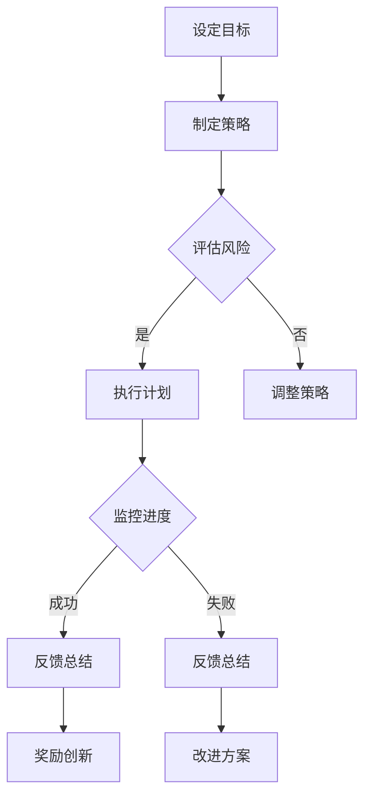

                 

### 领导力与创新文化：鼓励冒险和试错

关键词：领导力，创新文化，冒险精神，试错文化，组织发展

摘要：本文深入探讨了领导力与创新文化的关系，阐述了如何通过鼓励冒险和试错来构建具有持续发展动力的创新文化。文章首先介绍了领导力与创新文化的核心概念，通过对比分析概念属性特征，构建了ER实体关系图。接着，本文详细介绍了鼓励冒险和试错的方法，包括核心概念原理、属性特征对比表格和流程图。随后，文章讨论了领导力在构建创新文化中的关键角色，以及如何通过领导行为激励员工，营造积极的冒险和试错氛围。最后，本文通过实际案例和策略分析，为构建鼓励冒险和试错的创新文化提供了具体指导。

### 第一部分：背景介绍

在当今快速发展的商业环境中，企业面临的挑战日益复杂，技术创新成为企业保持竞争力的关键因素。然而，传统的领导模式往往强调稳定性和规范性，这在一定程度上限制了企业的创新能力。为了在激烈的市场竞争中脱颖而出，领导者必须掌握如何构建鼓励冒险和试错的创新文化，以推动企业的持续发展。

#### 问题背景

随着全球化进程的加快，市场环境的不确定性增加，企业需要具备快速响应和持续创新的能力。传统的领导模式往往依赖于经验和方法，而在这种快速变化的环境中，这种方法显得相对僵化。领导者需要从战略层面思考和行动，构建一种鼓励冒险和试错的创新文化，以激发员工的创造力和创新潜力。

#### 问题描述

在现有文献中，关于领导力与创新文化的研究较多，但如何将理论转化为实践，特别是在鼓励冒险和试错方面，仍存在诸多挑战。领导者在构建创新文化时可能会面临以下问题：

1. **员工的抵触情绪**：员工可能担心冒险和试错带来的失败和风险，从而对创新持保留态度。
2. **资源的有限性**：企业在资源和时间上可能有限，难以支持大规模的创新项目。
3. **决策的风险**：冒险和试错涉及风险，领导者需要权衡风险和收益，做出明智的决策。
4. **文化适应性**：鼓励冒险和试错可能与传统企业文化相冲突，需要逐步引导和调整。

#### 问题解决

本书旨在解决上述问题，通过深入分析领导力与创新文化的关系，提供一系列实践指南，帮助领导者构建鼓励冒险和试错的创新文化。本书将涵盖以下内容：

1. **领导力与创新文化的核心概念**：介绍领导力与创新文化的基本理论，包括它们的定义、特征和相互关系。
2. **鼓励冒险和试错的方法**：探讨如何通过组织结构、激励机制、领导行为等手段，在组织中营造鼓励冒险和试错的环境。
3. **实际案例研究**：分析成功企业的创新实践，提供具体案例，帮助读者更好地理解和应用理论。
4. **构建创新文化的策略**：提出一系列构建创新文化的策略和工具，包括领导者的角色、团队建设、文化塑造等。
5. **挑战与应对**：讨论在构建创新文化过程中可能遇到的挑战，并提供相应的解决方案。

#### 边界与外延

本书主要关注企业内部的领导力与创新文化，旨在为企业管理者提供指导。然而，本书中的许多理论和实践方法也可以应用于其他类型的组织，如非营利组织、政府机构等。此外，本书将聚焦于鼓励冒险和试错，但不排除其他创新文化要素的探讨。

### 概念结构与核心要素组成

要理解领导力与创新文化的关系，首先需要明确它们的核心概念和组成要素。

#### 领导力

领导力是指领导者通过影响、激励和引导团队成员，实现组织目标的能力。它包括以下几个方面：

1. **影响力**：领导者通过个人魅力和专业知识，影响团队成员的思维和行为。
2. **激励**：领导者通过激励措施，激发员工的积极性和创造力。
3. **决策**：领导者通过科学决策，指引团队走向正确的方向。
4. **沟通**：领导者通过有效的沟通，确保团队成员的理解和合作。

#### 创新文化

创新文化是指组织内部对创新的态度、价值观和行为规范。它包括以下几个方面：

1. **创新价值观**：组织对创新的重视程度，以及对创新行为的认可和鼓励。
2. **创新行为**：组织内部员工的创新行为，如提出新想法、尝试新方法、解决问题等。
3. **创新氛围**：组织内部对创新的包容度，以及员工在创新过程中的自由度和安全感。
4. **创新成果**：组织对创新成果的认可和奖励，以及创新成果对组织发展的影响。

#### 鼓励冒险和试错

鼓励冒险和试错是创新文化的重要组成部分。它包括以下几个方面：

1. **冒险精神**：员工在面对不确定性时，敢于尝试新事物，即使失败也愿意承担风险。
2. **试错文化**：组织内部对失败的包容态度，以及将失败视为学习机会的文化氛围。

这些概念相互关联，共同构成了构建鼓励冒险和试错的创新文化的基础。领导者需要理解这些概念，并将其应用于实践中，以推动组织的创新和发展。

### 第二部分：领导力与创新文化概述

#### 核心概念原理

领导力和创新文化是推动组织发展的两个关键因素。领导力提供了方向和指导，而创新文化则为组织注入了活力和动力。

**领导力**：领导力是一种影响力，领导者通过自己的行为和决策影响他人，共同实现目标。它包括以下几个方面：

1. **影响力**：领导者通过个人魅力和专业知识，影响团队成员的思维和行为。
2. **激励**：领导者通过激励措施，激发员工的积极性和创造力。
3. **决策**：领导者通过科学决策，指引团队走向正确的方向。
4. **沟通**：领导者通过有效的沟通，确保团队成员的理解和合作。

**创新文化**：创新文化是一种价值观，它强调对创新的重视和认可，鼓励员工尝试新事物。它包括以下几个方面：

1. **创新价值观**：组织对创新的重视程度，以及对创新行为的认可和鼓励。
2. **创新行为**：组织内部员工的创新行为，如提出新想法、尝试新方法、解决问题等。
3. **创新氛围**：组织内部对创新的包容度，以及员工在创新过程中的自由度和安全感。
4. **创新成果**：组织对创新成果的认可和奖励，以及创新成果对组织发展的影响。

#### 概念属性特征对比表格

| 特征       | 领导力                   | 创新文化                 |
| ---------- | ------------------------ | ------------------------ |
| 定义       | 领导者是影响力中心       | 创新文化是价值观体现     |
| 核心作用   | 激励团队成员，实现目标   | 鼓励创新，提升组织竞争力 |
| 影响方式   | 行为示范，决策引导       | 文化氛围，制度激励       |
| 实现路径   | 提升个人能力，改进管理方式 | 塑造组织文化，完善制度   |

#### ER实体关系图架构

```mermaid
erDiagram
    Leader ||--|{ InnovationCulture } InnovationCulture
    Leader ||--|{ Employee } Employee
    Employee ||--|{ Innovation } Innovation
```

在上述ER图中，领导力（Leader）作为核心实体，与创新文化（InnovationCulture）和员工（Employee）之间存在双向关联。领导力通过影响和激励员工，推动创新文化的形成和发展，而创新文化则为员工提供了创新的土壤和动力。员工则是创新行为的执行者，他们的创新行为最终会反作用于创新文化和领导力。

#### 领导力在构建创新文化中的角色

领导力在构建创新文化中扮演着至关重要的角色。领导者不仅需要具备创新能力，还需要具备激励和支持员工创新的能力。以下是领导力在构建创新文化中的几个关键角色：

1. **倡导者**：领导者需要积极倡导创新文化，将其作为组织发展的核心价值观。通过树立榜样和宣传，让员工认识到创新的重要性。

2. **激励者**：领导者需要通过激励机制，鼓励员工尝试新事物。这包括提供奖励、认可和晋升机会，以激发员工的创新动力。

3. **指导者**：领导者需要为员工提供创新的方向和资源支持。通过制定创新目标和提供必要的培训，帮助员工克服创新过程中的困难和挑战。

4. **沟通者**：领导者需要与员工保持有效沟通，了解他们的创新想法和需求。通过开放和透明的沟通渠道，建立信任和协作关系。

5. **支持者**：领导者需要为员工提供支持和保护，让他们在创新过程中感到安全和自信。这包括对失败持包容态度，鼓励员工从失败中学习和成长。

#### 领导行为对员工激励的影响

领导行为对员工的激励有着重要的影响。以下是一些具体的领导行为，它们能够激励员工，推动创新文化的形成：

1. **提供明确的愿景和目标**：领导者需要为团队提供清晰的愿景和目标，让员工明白自己的工作对组织的重要性。这能够激发员工的使命感和责任感。

2. **鼓励自主性和创造力**：领导者需要给予员工足够的自主权，鼓励他们发挥自己的创造力和创新能力。通过设立创新项目和工作坊，激发员工的创新潜能。

3. **提供及时的反馈和认可**：领导者需要及时给予员工反馈和认可，特别是在他们取得创新成果时。这能够增强员工的自信心和动力，让他们更加积极地投入到创新工作中。

4. **建立协作和信任的文化**：领导者需要通过建立协作和信任的文化，促进员工之间的交流和合作。这能够增强团队的凝聚力和创新力。

5. **提供必要的资源和支持**：领导者需要为员工提供必要的资源和支持，帮助他们克服创新过程中的困难和挑战。这包括资金、技术、培训等。

通过这些领导行为，领导者能够有效地激励员工，推动创新文化的形成和发展，从而促进组织的持续创新和竞争力提升。

#### 鼓励冒险和试错的核心概念原理

鼓励冒险和试错是构建创新文化的重要组成部分。以下是一些核心概念原理，它们有助于在组织中营造鼓励冒险和试错的环境：

**冒险精神**：冒险精神是指员工在面对不确定性时，敢于尝试新事物，即使失败也愿意承担风险。这种精神鼓励员工敢于挑战现状，寻找创新的解决方案。

**试错文化**：试错文化是指组织内部对失败的包容态度，以及将失败视为学习机会的文化氛围。这种文化鼓励员工从失败中吸取教训，不断改进和尝试。

**风险容忍度**：风险容忍度是指组织对风险的接受程度。高容忍度的组织更愿意承担一定的风险，以换取创新的回报。

**学习导向**：学习导向是指组织对学习和知识的重视程度。学习导向的文化鼓励员工不断学习新知识和技能，以应对不断变化的环境。

**创新激励机制**：创新激励机制是指组织通过奖励和认可，激励员工进行创新。这些激励机制包括奖金、晋升机会、荣誉称号等。

**员工参与度**：员工参与度是指员工在创新过程中的参与程度。高参与度的员工更愿意提出新想法，积极参与创新项目。

**领导支持**：领导支持是指领导者对员工创新活动的支持和鼓励。领导者的支持能够为员工提供信心和安全感，从而鼓励他们冒险和试错。

#### 概念属性特征对比表格

| 特征       | 冒险精神                  | 试错文化                 |
| ---------- | ------------------------ | ------------------------ |
| 定义       | 面对不确定性，敢于尝试   | 对失败持开放态度，积极学习 |
| 核心作用   | 激发创造力，推动创新     | 提升组织适应能力，促进学习 |
| 影响方式   | 员工个体行为激励       | 组织文化氛围营造         |
| 实现路径   | 激励制度，领导示范       | 成功与失败案例分享，反馈机制 |

通过对比分析上述概念属性特征，可以看出冒险精神和试错文化在推动创新中的作用和区别。冒险精神侧重于个人行为激励，鼓励员工敢于尝试；而试错文化则侧重于组织文化氛围，强调对失败的包容和学习的态度。

#### 鼓励冒险和试错的流程图



在这个流程图中，设定目标和制定策略是构建鼓励冒险和试错的基础。评估风险决定了是否执行计划，如果风险可控则执行计划，否则调整策略。执行计划和监控进度确保项目按照预期进行，成功或失败的反馈总结用于奖励或改进方案，从而形成一个闭环的创新过程。

通过以上流程，组织可以系统性地鼓励冒险和试错，使员工在创新过程中充满信心和动力，同时也能够从失败中学习和成长，不断提升组织的创新能力。

### 第2章：鼓励冒险和试错的方法

在构建鼓励冒险和试错的创新文化过程中，领导者需要采取一系列具体方法来营造一个安全、包容和激励的环境。以下是一些关键的方法：

#### 1. 创建透明和开放的沟通渠道

透明和开放的沟通渠道是鼓励冒险和试错的基础。领导者应该建立一个开放的氛围，让员工能够自由地分享他们的想法和观点，即使这些想法看起来很“疯狂”或者不切实际。以下是一些具体做法：

- **定期召开团队会议**：通过定期的团队会议，领导者可以了解员工的想法和进展，提供及时的反馈和支持。
- **设立匿名反馈机制**：鼓励员工匿名提出建议和反馈，这样可以避免员工因为担心批评或报复而不敢表达真实的想法。
- **公开透明的反馈**：领导者应该对员工的反馈和想法给予公开、透明的回应，让员工感受到他们的意见被重视。

#### 2. 建立支持学习的环境

一个支持学习的环境能够鼓励员工在失败中学习，并将失败视为成长的机会。以下是一些具体做法：

- **提供培训和学习资源**：为员工提供各种培训和学习资源，帮助他们提升技能和知识，增强他们在创新过程中的信心。
- **鼓励知识分享**：鼓励员工分享他们在创新过程中的经验和教训，通过知识分享会、博客或内部论坛等形式，促进团队之间的学习和交流。
- **设立学习日或创新周**：定期组织学习日或创新周，让员工有时间专注于学习和尝试新事物，不受日常工作任务的干扰。

#### 3. 制定合理的风险容忍策略

制定合理的风险容忍策略是鼓励冒险和试错的关键。以下是一些具体做法：

- **设置合理的风险预算**：为创新项目设置合理的风险预算，允许一定的失败率，这样员工在尝试新事物时不会感到过于担心。
- **实行渐进式创新**：鼓励员工从小规模的实验开始，逐步增加创新项目的规模和复杂性，这样可以降低失败的风险。
- **建立反馈和调整机制**：在创新过程中，定期评估项目的进展和风险，及时调整策略，避免因持续失败而造成重大损失。

#### 4. 奖励创新和尝试

奖励创新和尝试能够激励员工在创新过程中保持积极的态度。以下是一些具体做法：

- **设立创新奖项**：为在创新过程中表现出色的员工设立创新奖项，如最佳创新团队、最佳创新个人等，以表彰他们的努力和贡献。
- **提供晋升和职业发展机会**：为在创新中表现突出的员工提供晋升和职业发展机会，让他们看到创新带来的实际回报。
- **认可失败**：对在创新过程中失败的员工给予认可和鼓励，让他们知道失败并不可怕，重要的是从中学习和成长。

#### 5. 领导者的示范作用

领导者的示范作用对鼓励冒险和试错至关重要。以下是一些具体做法：

- **领导者带头尝试**：领导者应该主动尝试新事物，展示自己的冒险精神，为员工树立榜样。
- **承认自己的错误**：领导者应该勇于承认自己的错误，并从中学习和改进，这样能够增强员工的信任和安全感。
- **鼓励团队讨论**：领导者应该鼓励团队就创新问题进行讨论，提出不同的观点和解决方案，这样可以激发团队的创造力。

#### 6. 建立跨部门合作

跨部门合作能够促进不同部门之间的交流和学习，从而推动创新。以下是一些具体做法：

- **设立跨部门项目团队**：为解决复杂问题或推动创新项目，设立跨部门项目团队，促进不同部门之间的合作和交流。
- **定期举行跨部门会议**：通过定期举行跨部门会议，分享不同部门在创新过程中的经验和教训，促进知识的共享。
- **建立内部市场**：建立内部市场，鼓励不同部门之间的协作和创新项目的合作，从而推动整个组织的创新。

通过上述方法，领导者可以有效地在组织中营造一个鼓励冒险和试错的环境，激发员工的创新潜力，推动组织的持续发展。

### 实际案例研究：鼓励冒险和试错的实践

为了更好地理解如何在实际组织中鼓励冒险和试错，以下将分析两个成功企业的案例，探讨它们在构建鼓励冒险和试错的文化方面的具体实践。

#### 案例一：谷歌

作为全球领先的技术公司，谷歌在鼓励冒险和试错方面有着卓越的成就。谷歌的“X实验室”（X Development LLC）是一个专门负责研究前沿技术的部门，它的使命是“发明那些能改变世界的伟大事物”。以下是谷歌在鼓励冒险和试错方面的一些具体实践：

1. **资源支持**：谷歌为“X实验室”提供了充足的资源和自由，让他们可以尝试各种新颖、甚至有些疯狂的想法。这种资源支持使得员工可以无后顾之忧地投入到高风险的项目中。

2. **失败包容**：谷歌鼓励员工在创新过程中接受失败，并将失败视为学习和成长的机会。谷歌的创始人拉里·佩奇和谢尔盖·布林都经常强调，失败是创新过程中不可避免的一部分，重要的是从中吸取教训。

3. **内部创业**：谷歌推行了“内部创业”计划，允许员工利用公司资源进行自己的创新项目。如果项目成功，员工有机会将其转化为独立的业务，谷歌甚至提供资金支持。这种机制激发了员工冒险的积极性。

4. **领导支持**：谷歌的领导层积极支持员工的创新尝试，不仅提供资源，还在项目遇到困难时给予指导和支持。领导者的支持为员工提供了勇气和信心，让他们敢于冒险。

5. **跨部门合作**：谷歌鼓励跨部门合作，通过内部创新竞赛等方式，促进不同团队之间的交流和合作。这种合作不仅带来了新的想法和解决方案，也培养了员工的团队精神和创新能力。

#### 案例二：特斯拉

特斯拉（Tesla, Inc.）是另一家在鼓励冒险和试错方面取得显著成就的企业。特斯拉以其创新的电动汽车技术和可持续能源解决方案而闻名，以下是特斯拉在构建鼓励冒险和试错文化方面的实践：

1. **明确愿景**：特斯拉的创始人埃隆·马斯克（Elon Musk）为员工设定了一个清晰、宏伟的愿景，即加速世界向可持续能源的转变。这个愿景激励了员工不断尝试新的技术和方法，以实现这一目标。

2. **文化氛围**：特斯拉倡导一种开放、透明和包容的文化氛围，鼓励员工自由地提出新的想法和建议。即使在项目失败时，特斯拉也强调从中学习的重要性，并给予员工支持和鼓励。

3. **自主性**：特斯拉为员工提供很高的自主性，允许他们在各自的工作领域内进行创新。员工有权决定如何最好地完成任务，这种自主性激发了他们的创造力和冒险精神。

4. **快速迭代**：特斯拉采用了快速迭代的方法，通过不断测试和改进，迅速将创新想法转化为实际产品。这种方法降低了失败的风险，同时也培养了员工的快速学习和适应能力。

5. **领导激励**：特斯拉的领导层通过多种方式激励员工，包括提供竞争性的薪酬、股票期权和公开认可。这些激励机制不仅吸引了顶尖人才，也激励了他们在创新过程中勇于冒险。

通过以上实际案例，可以看出，构建鼓励冒险和试错的创新文化需要从多个方面入手，包括资源支持、失败包容、内部创业、领导支持、明确愿景、文化氛围、自主性和快速迭代等。这些实践不仅有助于提升组织的创新能力，也为员工的个人成长和发展提供了广阔的空间。

### 构建创新文化的策略

构建鼓励冒险和试错的创新文化需要系统性的策略和方法。以下是一些关键策略，它们可以帮助组织在构建创新文化过程中取得成功：

#### 1. 领导者的示范作用

领导者是创新文化的关键推动者，他们的行为和态度直接影响员工的创新行为。领导者应该通过以下方式发挥示范作用：

- **树立创新榜样**：领导者应该积极倡导和参与创新项目，展示自己的创新能力和勇气，为员工树立榜样。
- **鼓励尝试和失败**：领导者应该鼓励员工尝试新事物，即使失败也给予支持和认可，让员工感受到失败并不可怕，重要的是从中学到东西。
- **开放沟通**：领导者应该与员工保持开放和透明的沟通，倾听他们的想法和建议，并给予积极的反馈。

#### 2. 建立激励机制

激励机制是鼓励员工冒险和试错的重要手段。以下是一些有效的激励机制：

- **奖励创新成果**：为在创新项目中取得显著成果的员工提供奖励，如奖金、晋升机会、荣誉等。这能够激发员工的创新动力。
- **股票期权和股权激励**：为创新项目的核心成员提供股票期权或股权激励，让他们分享创新带来的收益，增加他们的参与感和忠诚度。
- **竞争性薪酬**：为创新项目的员工提供具有竞争力的薪酬，确保他们的努力得到合理的回报。

#### 3. 培养冒险精神

冒险精神是鼓励创新和试错的基础。以下是一些培养冒险精神的方法：

- **提供培训**：为员工提供创新和冒险的培训，帮助他们提升解决问题的能力，增强他们在不确定环境中的自信心。
- **设置挑战性目标**：为员工设置具有挑战性的目标，鼓励他们跳出舒适区，尝试新的方法和解决方案。
- **鼓励风险投资**：鼓励员工在创新项目中进行风险投资，即使项目失败，也给予一定的补偿和支持，让他们敢于冒险。

#### 4. 营造包容和开放的文化氛围

一个包容和开放的文化氛围能够激发员工的创新潜力。以下是一些营造这种氛围的方法：

- **建立知识共享平台**：建立内部知识共享平台，鼓励员工分享他们的经验和见解，促进团队之间的交流和学习。
- **定期举行创新会议**：定期举行创新会议，为员工提供一个交流创新想法和经验的场所。
- **鼓励员工提出建议**：建立机制，鼓励员工提出改进和创新建议，并给予积极的反馈和认可。

#### 5. 建立跨部门合作

跨部门合作能够促进创新和试错，以下是一些建立跨部门合作的方法：

- **设立跨部门项目团队**：为解决复杂问题或推动创新项目，设立跨部门项目团队，促进不同部门之间的合作和交流。
- **设立内部市场**：建立内部市场，鼓励不同部门之间的协作和创新项目的合作，从而推动整个组织的创新。
- **定期举行跨部门会议**：通过定期举行跨部门会议，分享不同部门在创新过程中的经验和教训，促进知识的共享。

#### 6. 提供资源支持

资源支持是鼓励创新和试错的重要保障。以下是一些提供资源支持的方法：

- **设立专项经费**：为创新项目设立专项经费，提供必要的资金支持。
- **提供技术支持**：为员工提供先进的技术支持，帮助他们克服创新过程中的技术难题。
- **提供培训资源**：为员工提供各种培训资源，帮助他们提升技能和知识，增强他们在创新过程中的信心。

通过以上策略，组织可以有效地构建鼓励冒险和试错的创新文化，激发员工的创新潜力，推动组织的持续发展和竞争优势。

### 挑战与应对

在构建鼓励冒险和试错的创新文化过程中，领导者可能会面临一系列挑战。以下是一些常见挑战及其应对策略：

#### 1. 员工的抵触情绪

许多员工可能担心冒险和试错带来的风险和不确定性，从而对创新持保留态度。应对策略：

- **加强沟通**：通过定期的会议、工作坊和培训，向员工解释创新的重要性以及为什么需要鼓励冒险和试错。
- **提供成功案例**：分享成功企业的创新案例，展示冒险和试错的积极结果。
- **提供支持和资源**：为员工提供必要的支持和资源，减轻他们的风险感和不确定性。

#### 2. 资源的有限性

企业往往面临资源有限的挑战，这可能会限制创新项目的规模和范围。应对策略：

- **合理分配资源**：在资源有限的情况下，优先支持那些具有高潜力和高影响力的创新项目。
- **利用外部资源**：与外部合作伙伴建立合作关系，共同推动创新项目。
- **渐进式创新**：通过小规模实验和试点项目，逐步扩大创新范围，降低资源风险。

#### 3. 决策的风险

冒险和试错涉及风险，领导者需要权衡风险和收益，做出明智的决策。应对策略：

- **建立风险评估机制**：在项目启动前，对项目的风险进行评估，制定相应的风险缓解措施。
- **设置风险预算**：为创新项目设置合理的风险预算，允许一定的失败率。
- **多元化决策团队**：建立多元化的决策团队，汇集不同领域的专业知识和经验，共同评估和决策。

#### 4. 文化适应性

鼓励冒险和试错可能与传统企业文化相冲突，需要逐步引导和调整。应对策略：

- **逐步推进**：通过逐步引导和试点项目，逐步推动企业文化的转变。
- **领导示范**：领导者通过自己的行为示范，树立冒险和试错的榜样。
- **内部沟通**：通过内部沟通，加强员工对冒险和试错文化的理解和认同。

通过应对上述挑战，领导者可以有效地在组织中构建鼓励冒险和试错的创新文化，激发员工的创新潜力，推动组织的持续发展和竞争优势。

### 第三部分：构建鼓励冒险和试错的创新文化的实践

在构建鼓励冒险和试错的创新文化过程中，组织需要采取一系列具体的实践措施。以下是一些实践方法和步骤，可以帮助组织有效地实现这一目标：

#### 1. 设定明确的目标和愿景

明确的目标和愿景是构建创新文化的基础。领导者需要明确组织的目标和愿景，并将其传达给全体员工。以下是一些具体步骤：

- **制定长期愿景**：确定组织的长期目标和愿景，确保这些目标和愿景与组织的使命和价值观相一致。
- **分解目标**：将长期目标分解为短期目标和具体项目，明确每个项目的目标和预期成果。
- **沟通和共识**：通过定期的会议、培训和内部沟通，确保全体员工对目标和愿景有清晰的理解和认同。

#### 2. 建立跨部门合作机制

跨部门合作能够促进创新和试错，增强不同部门之间的沟通和协作。以下是一些具体步骤：

- **成立跨部门团队**：为解决复杂问题或推动创新项目，成立由不同部门成员组成的跨部门团队。
- **设立项目办公室**：为跨部门团队设立一个项目办公室，提供必要的资源和支持，确保项目的顺利进行。
- **定期协调会议**：定期举行跨部门协调会议，分享项目进展、问题和解决方案，确保各部门之间的协调和配合。

#### 3. 建立创新激励机制

激励机制是鼓励员工冒险和试错的重要手段。以下是一些具体步骤：

- **设立创新奖项**：为在创新项目中取得显著成果的员工设立创新奖项，如最佳创新团队、最佳创新个人等。
- **提供奖励和福利**：为创新项目的员工提供额外的奖励和福利，如奖金、股权、休假等。
- **建立晋升机制**：将创新成果纳入员工的晋升评价体系，为在创新项目中表现突出的员工提供晋升机会。

#### 4. 提供培训和支持

提供培训和支持是培养员工创新能力和冒险精神的重要手段。以下是一些具体步骤：

- **定制培训计划**：根据员工的岗位和职责，制定个性化的培训计划，提升他们的专业技能和创新能力。
- **提供学习资源**：为员工提供各种学习资源，如在线课程、图书、研讨会等，帮助他们不断提升自己的知识和技能。
- **设立导师制度**：为员工设立导师制度，让他们在工作中得到指导和帮助，快速成长。

#### 5. 营造开放和包容的文化氛围

开放和包容的文化氛围能够激发员工的创造力和创新精神。以下是一些具体步骤：

- **鼓励知识分享**：建立知识共享平台，鼓励员工分享他们的经验和见解，促进团队之间的交流和合作。
- **设立创新论坛**：定期举行创新论坛，为员工提供一个展示创新成果和交流思想的场所。
- **建立反馈机制**：建立有效的反馈机制，让员工能够及时反馈问题和建议，促进组织的持续改进。

#### 6. 评估和调整

构建创新文化是一个持续的过程，需要不断评估和调整。以下是一些具体步骤：

- **定期评估**：定期对创新文化进行评估，了解员工的创新行为和组织的创新成果，找出存在的问题和改进点。
- **调整策略**：根据评估结果，及时调整创新文化的策略和方法，确保创新文化能够持续发展。
- **持续改进**：鼓励员工持续改进创新文化，通过内部反馈、员工调研等方式，不断优化创新环境。

通过上述实践步骤，组织可以有效地构建鼓励冒险和试错的创新文化，激发员工的创新潜力，推动组织的持续发展和竞争优势。

### 总结与展望

通过本文的深入探讨，我们可以看到领导力与创新文化之间的关系是如何推动企业实现持续发展的。鼓励冒险和试错不仅是创新文化的重要组成部分，也是组织在快速变化的市场环境中保持竞争力的关键。

首先，领导力在构建创新文化中扮演着至关重要的角色。领导者通过倡导、激励和支持，营造一个鼓励冒险和试错的环境，能够激发员工的创造力和创新精神。领导者需要通过自身的行为示范、明确的愿景和目标设定、建立激励机制等多种方式，推动组织文化的转变。

其次，鼓励冒险和试错的文化能够为员工提供安全感和信心，让他们敢于面对不确定性，勇于尝试新事物。这种文化氛围不仅能够提升组织的创新能力，还能够培养员工的适应能力和解决问题的能力。

展望未来，随着技术的不断进步和市场的快速变化，企业需要具备更强的创新能力来应对挑战。领导者需要持续关注和推动创新文化的建设，通过不断调整和优化策略，确保组织能够适应未来的发展需求。

总之，领导力与创新文化的紧密结合，以及鼓励冒险和试错的实践，将为组织带来持续的创新动力和竞争优势。让我们共同努力，构建一个充满活力和创造力的创新文化，推动企业不断向前发展。

### 注意事项与最佳实践

在构建鼓励冒险和试错的创新文化过程中，领导者需要注意以下几点，以确保创新文化的有效构建：

1. **建立明确的愿景和目标**：领导者需要明确组织的愿景和目标，并将其传达给全体员工，确保大家有共同的方向和目标。

2. **激励与支持并重**：激励措施是鼓励员工冒险和试错的重要手段，但领导者的支持同样重要。领导者需要通过行动和沟通，让员工感受到他们的支持和信任。

3. **建立风险管理机制**：鼓励冒险和试错并不意味着忽视风险。领导者需要建立有效的风险管理机制，确保创新项目在可控的风险范围内进行。

4. **培养员工的创新思维**：领导者需要通过培训和实践，培养员工的创新思维和解决问题的能力，让他们在创新过程中更加自信和高效。

5. **持续改进和反馈**：创新文化是一个持续的过程，领导者需要不断评估和调整创新策略，确保创新文化能够适应组织的发展和变化。

最佳实践包括：

- **设立创新奖项**：定期为在创新项目中表现突出的员工和团队设立创新奖项，以激励员工的创新热情。
- **建立跨部门合作机制**：鼓励不同部门之间的合作，通过设立跨部门项目团队，促进知识的共享和创新的协作。
- **提供培训和学习资源**：为员工提供各种培训和学习资源，帮助他们不断提升自己的专业技能和创新能力。

通过遵循这些注意事项和最佳实践，领导者可以更有效地构建鼓励冒险和试错的创新文化，推动组织的持续发展和竞争优势。

### 拓展阅读

为了进一步了解领导力与创新文化的关系，以下是一些推荐阅读的书籍和文章：

1. **《创新者的窘境》（The Innovator's Dilemma）** - 克里斯·登特（Clayton M. Christensen）
   这本书深入探讨了为什么即使是成功的公司也会因为无法适应市场变化而失败。书中提出了“破坏性创新”的概念，为领导者提供了宝贵的启示。

2. **《创新的基因》（The Innovator's Gene）** - 瑞恩·皮尔斯（Ryan R. Parker）
   本书通过大量案例研究，分析了成功领导者如何培养和利用创新基因，为组织注入持续创新的能力。

3. **《领导力：实践与探索》（Leadership: Theory and Practice）** - 帕特里克·兰西奥尼（Patrick Lencioni）
   这本书从理论和实践的角度，详细阐述了领导力的本质和如何通过有效的领导行为提升组织的绩效。

4. **《试错：如何通过试验创新》（Fail, Fail Again, Fail Better）** - 安德鲁·索布尔（Andrew Sobel）
   作者通过丰富的案例，展示了如何在试错过程中学习和成长，为领导者提供了构建鼓励冒险和试错文化的具体方法。

5. **《哈佛商业评论》（Harvard Business Review）** - 多个作者
   《哈佛商业评论》是商业管理领域的权威期刊，其中多篇关于领导力、创新文化和组织发展的文章，提供了深入的分析和实用的策略。

通过阅读这些书籍和文章，领导者可以更深入地理解领导力与创新文化的关系，掌握如何构建鼓励冒险和试错的创新文化，从而推动组织的持续发展和竞争优势。作者：AI天才研究院/AI Genius Institute & 禅与计算机程序设计艺术 /Zen And The Art of Computer Programming

