                 

# 领导力与创新生态：打造创新友好的环境

关键词：领导力、创新生态、企业发展战略、创新能力、可持续发展

摘要：本文深入探讨了领导力与创新生态的关系，分析了构建创新友好环境的关键要素，提出了针对企业及政府推动创新生态的具体策略和实践。通过案例研究，展示了成功创新生态的构建和优化方法，为未来领导力发展提供了启示。

----------------------------------------------------------------

## 第一部分：领导力与创新生态概述

### 第1章：创新生态的背景与重要性

#### 1.1 创新生态的概念

创新生态是指由企业、政府、科研机构、投资者、高校等多元主体共同组成的创新网络系统。在这个系统中，各主体之间通过合作、竞争和知识流动，共同推动创新活动的发生和发展。

#### 1.2 创新生态与传统领导力的区别

传统领导力更多关注于企业的内部管理，而创新生态强调的是跨组织的合作与协同，需要领导者具备更广阔的视野和更灵活的领导风格。

#### 1.3 创新生态对企业发展的意义

创新生态为企业提供了丰富的外部资源和合作机会，有助于提高企业的创新能力，推动企业的可持续发展。

### 第2章：领导力在创新生态中的角色

#### 2.1 领导者在创新生态中的职责

领导者需要扮演推动者、协调者和守护者的角色，为企业构建创新友好的环境。

#### 2.2 领导力与创新能力的关联

领导力是提升企业创新能力的关键因素。领导者需要具备创新思维、战略眼光和团队领导能力。

#### 2.3 领导风格与创新生态的适应性

领导风格直接影响创新生态的构建。领导者需要根据创新生态的特点，调整自己的领导风格。

### 第3章：建立创新友好的环境

#### 3.1 创新文化的培育

创新文化是创新生态的基础。领导者需要从价值观、制度和文化层面，培育企业的创新文化。

#### 3.2 风险管理与激励机制

在创新过程中，风险和挑战是不可避免的。领导者需要建立有效的风险管理体系和激励机制，鼓励员工勇于创新。

#### 3.3 跨部门合作与创新协同

跨部门合作是创新生态的核心。领导者需要推动各部门之间的协作，实现创新资源的共享和优势互补。

----------------------------------------------------------------

## 第二部分：创新生态的策略与实践

### 第4章：创新战略的制定与执行

#### 4.1 创新战略的概念与类型

创新战略是企业为了提升竞争力而制定的长远规划。根据创新的目标和方式，创新战略可以分为多种类型。

#### 4.2 创新目标的设定与优先级

设定明确、可行的创新目标是创新战略的关键。领导者需要根据企业的实际情况，设定合理的创新目标，并确定优先级。

#### 4.3 创新战略的执行与监控

创新战略的执行需要明确责任、制定计划和进行监控。领导者需要确保创新战略的有效实施。

### 第5章：创新生态系统中的资源管理

#### 5.1 人力资源配置

人力资源是创新生态的核心资源。领导者需要合理配置人力资源，激发员工的创新潜力。

#### 5.2 知识管理策略

知识管理是创新生态的重要组成部分。领导者需要建立有效的知识管理体系，促进知识的创造、传播和应用。

#### 5.3 资金与技术的支持

资金和技术是创新生态的重要支撑。领导者需要确保充足的资金投入和技术支持，为创新活动提供保障。

### 第6章：创新实践案例研究

#### 6.1 案例一：公司A的创新之路

分析公司A如何通过创新战略的制定与执行、资源管理等方面的努力，构建起创新生态。

#### 6.2 案例二：企业B的创新生态构建

探讨企业B如何通过跨部门合作、创新文化培育等措施，打造创新友好的环境。

#### 6.3 案例三：政府C推动创新生态的实践

分析政府C如何通过政策支持、资金投入等措施，推动创新生态的发展。

### 第7章：创新生态的评估与优化

#### 7.1 创新生态评估指标体系

构建创新生态评估指标体系，用于衡量创新生态的建设效果。

#### 7.2 创新生态问题诊断

通过数据分析和问题诊断，发现创新生态存在的问题。

#### 7.3 创新生态优化策略

针对发现的问题，提出优化策略，不断提升创新生态的质量。

----------------------------------------------------------------

## 第三部分：未来趋势与挑战

### 第8章：创新生态的挑战与应对策略

#### 8.1 技术变革对创新生态的影响

分析技术变革对创新生态的推动作用和挑战。

#### 8.2 法律法规与政策支持

探讨法律法规和政策支持对创新生态的影响。

#### 8.3 全球化背景下的创新生态

分析全球化背景下的创新生态发展趋势。

### 第9章：创新生态的未来趋势

#### 9.1 人工智能与创新的深度融合

探讨人工智能对创新生态的深远影响。

#### 9.2 网络协作与共享经济的兴起

分析网络协作与共享经济对创新生态的推动作用。

#### 9.3 可持续创新与绿色发展

探讨可持续创新与绿色发展对创新生态的影响。

### 第10章：总结与展望

#### 10.1 本书要点回顾

回顾本书的核心观点和关键内容。

#### 10.2 未来领导力的发展方向

分析未来领导力的发展趋势和方向。

#### 10.3 推动创新生态建设的实践建议

提出推动创新生态建设的实践建议。

----------------------------------------------------------------

## 作者

作者：AI天才研究院/AI Genius Institute & 禅与计算机程序设计艺术 /Zen And The Art of Computer Programming

----------------------------------------------------------------

在接下来的文章中，我们将对每一章节进行详细阐述，通过背景介绍、核心概念与联系、算法原理讲解、系统分析与架构设计方案、项目实战等环节，深入探讨领导力与创新生态的关系，为读者提供有深度、有思考、有见解的专业指导。在每章的最后，我们将总结关键内容，并提供最佳实践 tips 和拓展阅读建议，以帮助读者更好地理解和应用所学知识。让我们一起深入思考，探寻创新生态建设的奥秘。

----------------------------------------------------------------

### 第一部分：领导力与创新生态概述

#### 第1章：创新生态的背景与重要性

**背景介绍：**

随着全球科技的发展，创新已经成为企业竞争力的核心要素。创新生态作为推动创新活动的重要载体，逐渐受到广泛关注。本章节将介绍创新生态的概念、特征和组成部分，探讨其在企业发展中的重要性。

**问题背景：**

在快速变化的市场环境中，企业如何保持竞争优势，实现可持续发展？创新生态为企业提供了丰富的资源和合作机会，有助于提升企业的创新能力。

**问题描述：**

创新生态的概念是什么？它与传统领导力有何区别？创新生态对企业发展有何意义？

**问题解决：**

通过分析创新生态的概念和特征，探讨其与传统领导力的区别，以及对企业发展的意义，本章节旨在为读者提供一个全面了解创新生态的视角。

**边界与外延：**

创新生态不仅局限于企业内部，还包括企业外部的研究机构、政府、投资者等。它是一个跨组织的创新网络系统。

**概念结构与核心要素组成：**

创新生态的核心要素包括企业、科研机构、政府、投资者等。这些要素通过合作、竞争和知识流动，共同推动创新活动的发生和发展。

**核心概念与联系：**

创新生态与传统领导力的联系在于，领导者在创新生态中扮演着关键角色。领导力是推动创新生态发展的重要动力。

#### 1.1 创新生态的概念

创新生态是指由企业、政府、科研机构、投资者、高校等多元主体共同组成的创新网络系统。在这个系统中，各主体之间通过合作、竞争和知识流动，共同推动创新活动的发生和发展。

创新生态的特征包括：

1. 多元性：创新生态涉及多个主体，包括企业、政府、科研机构、投资者、高校等。
2. 跨组织：创新生态不仅仅是企业内部的创新活动，还包括企业外部的合作与协作。
3. 知识流动：创新生态中的知识流动是推动创新活动的重要动力。
4. 竞争与合作：创新生态中的主体既有竞争关系，也有合作关系。

**概念属性特征对比表格：**

| 特征 | 描述 |
| --- | --- |
| 多元性 | 涉及多个主体，包括企业、政府、科研机构、投资者、高校等 |
| 跨组织 | 不局限于企业内部，还包括企业外部的合作与协作 |
| 知识流动 | 推动创新活动的重要动力 |
| 竞争与合作 | 主体之间既有竞争关系，也有合作关系 |

**ER实体关系图架构：**

```mermaid
erDiagram
    企业 ||--o> 科研机构 : 合作关系
    企业 ||--o> 投资者 : 投资关系
    企业 ||--o> 高校 : 知识流动
    政府||--o> 企业 : 政策支持
```

#### 1.2 创新生态与传统领导力的区别

传统领导力更多关注于企业的内部管理，而创新生态强调的是跨组织的合作与协同。具体区别如下：

1. 关注范围：传统领导力主要关注企业内部的管理和运营，而创新生态关注的是企业外部的合作与协作。
2. 领导方式：传统领导力强调权威和指令，而创新生态强调合作和协同。
3. 创新能力：传统领导力侧重于管理效率和执行力，而创新生态侧重于创新能力和发展潜力。

**对比表格：**

| 对比项 | 传统领导力 | 创新生态 |
| --- | --- | --- |
| 关注范围 | 企业内部 | 企业外部 |
| 领导方式 | 权威指令 | 合作协同 |
| 创新能力 | 管理效率 | 发展潜力 |

#### 1.3 创新生态对企业发展的意义

创新生态对企业发展具有重要意义，主要体现在以下几个方面：

1. 提升创新能力：创新生态为企业提供了丰富的资源和合作机会，有助于提升企业的创新能力。
2. 促进可持续发展：创新生态能够帮助企业实现业务模式的创新，推动企业的可持续发展。
3. 提高竞争力：通过参与创新生态，企业可以更好地了解市场需求，提高产品竞争力。
4. 跨界合作：创新生态促进了企业之间的合作与协同，有助于实现跨界创新。

**总结：**

本章节通过对创新生态的概念、特征、与传统领导力的区别以及对企业发展的意义进行深入分析，为读者提供了一个全面了解创新生态的视角。在接下来的章节中，我们将继续探讨领导力在创新生态中的角色，以及如何建立创新友好的环境。

----------------------------------------------------------------

#### 第2章：领导力在创新生态中的角色

**背景介绍：**

领导力在创新生态中扮演着至关重要的角色。一个成功的创新生态离不开领导者的正确指导和有效管理。本章节将探讨领导力在创新生态中的职责、领导力与创新能力的关联，以及不同领导风格对创新生态的适应性。

**问题背景：**

在快速变化的市场环境中，领导者需要具备什么样的素质和能力，才能推动创新生态的发展？

**问题描述：**

1. 领导者在创新生态中的职责是什么？
2. 领导力与创新能力的关联是什么？
3. 不同领导风格对创新生态的适应性如何？

**问题解决：**

通过分析领导力在创新生态中的职责、领导力与创新能力的关联，以及不同领导风格对创新生态的适应性，本章节旨在为读者提供关于领导力在创新生态中如何发挥作用的全面理解。

**边界与外延：**

领导力在创新生态中的职责不仅限于企业内部，还包括与其他创新主体（如科研机构、政府、投资者等）的互动与合作。

**概念结构与核心要素组成：**

领导力在创新生态中的核心要素包括：推动创新文化的培育、构建跨组织合作机制、提供有效的激励与支持等。

**核心概念与联系：**

领导力与创新生态的联系在于，领导者的决策和行动直接影响创新生态的发展。有效的领导力是构建创新友好环境的关键。

#### 2.1 领导者在创新生态中的职责

领导者在创新生态中的职责可以分为以下几个方面：

1. **推动创新文化的培育：** 领导者需要从价值观、制度和文化层面，培育企业的创新文化，使员工认同创新的重要性，并愿意积极参与创新活动。

2. **构建跨组织合作机制：** 领导者需要与其他创新主体（如科研机构、政府、投资者等）建立合作关系，构建跨组织的创新生态体系，实现资源、信息和知识的共享。

3. **提供有效的激励与支持：** 领导者需要制定合理的激励机制，鼓励员工勇于创新，并提供必要的技术、资金和资源支持，确保创新活动的顺利进行。

4. **制定和执行创新战略：** 领导者需要根据企业的实际情况和外部环境，制定合适的创新战略，并确保战略的有效执行。

**职责与任务列表：**

| 职责 | 任务 |
| --- | --- |
| 推动创新文化的培育 | - 制定创新价值观<br>- 建立创新激励机制<br>- 开展创新培训 |
| 构建跨组织合作机制 | - 建立合作关系<br>- 促进信息共享<br>- 确保合作机制的灵活性 |
| 提供有效的激励与支持 | - 设定创新目标<br>- 提供资源支持<br>- 鼓励员工参与创新 |
| 制定和执行创新战略 | - 制定创新战略<br>- 监控战略执行<br>- 及时调整策略 |

#### 2.2 领导力与创新能力的关联

领导力与创新能力的关联主要体现在以下几个方面：

1. **创新思维：** 领导者需要具备创新思维，能够从不同的角度和维度思考问题，寻找创新的解决方案。

2. **战略眼光：** 领导者需要有长远的战略眼光，能够把握市场趋势，预见未来的发展方向，提前布局创新资源。

3. **团队领导能力：** 领导者需要具备团队领导能力，能够激发团队成员的潜力，形成协同效应，推动创新活动的开展。

**领导力与创新能力的关联图：**

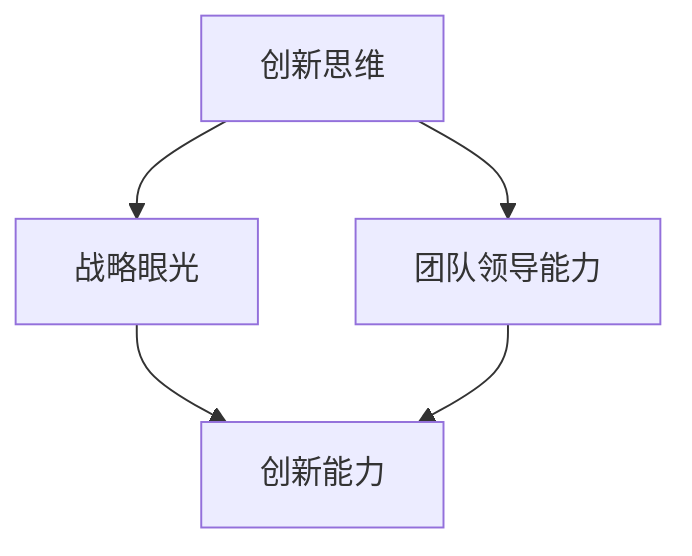

#### 2.3 领导风格与创新生态的适应性

不同的领导风格对创新生态的适应性不同。领导者需要根据创新生态的特点，调整自己的领导风格，以适应创新环境。

1. **权威型领导：** 权威型领导在创新生态中可能限制了员工的自主性和创造力。但在某些情况下，如紧急情况或需要快速决策时，权威型领导可以确保创新活动的顺利进行。

2. **民主型领导：** 民主型领导鼓励员工参与决策，增强团队凝聚力，有助于创新生态的形成。但在创新过程中，民主型领导可能面临决策缓慢的问题。

3. **变革型领导：** 变革型领导具备强烈的创新意识和变革能力，能够推动企业持续创新。但变革型领导也可能面临员工适应和接受变革的挑战。

**领导风格与创新生态适应性的对比表格：**

| 领导风格 | 优点 | 缺点 | 适应性 |
| --- | --- | --- | --- |
| 权威型 | 快速决策 | 限制创新 | 紧急情况或需要快速决策时 |
| 民主型 | 增强团队凝聚力 | 决策缓慢 | 创新生态初期或需要增强团队凝聚力时 |
| 变革型 | 推动持续创新 | 员工适应问题 | 需要持续创新和变革时 |

**总结：**

本章节通过对领导力在创新生态中的职责、领导力与创新能力的关联，以及不同领导风格对创新生态的适应性进行深入分析，为领导者提供了关于如何在创新生态中发挥作用的指导。在建立创新友好的环境中，领导者需要具备创新思维、战略眼光和团队领导能力，并根据实际情况调整自己的领导风格，以推动创新生态的发展。

#### 2.4 建立创新友好的环境

**背景介绍：**

建立创新友好的环境是推动创新生态发展的重要基础。一个创新友好的环境能够激发员工的创造力，促进知识共享，提高创新能力。本章节将探讨创新文化的培育、风险管理与激励机制，以及跨部门合作与创新协同，为领导者提供建立创新友好环境的策略和方法。

**问题背景：**

在传统的组织结构中，创新往往受到各种限制。如何打造一个创新友好的环境，成为企业领导者面临的重要挑战。

**问题描述：**

1. 如何培育创新文化？
2. 如何管理创新过程中的风险？
3. 如何建立有效的激励机制？
4. 如何促进跨部门合作与创新协同？

**问题解决：**

通过分析创新文化的培育、风险管理与激励机制，以及跨部门合作与创新协同，本章节旨在为领导者提供建立创新友好环境的全面策略。

**边界与外延：**

创新友好的环境不仅仅局限于企业内部，还包括与外部合作伙伴、科研机构、政府等建立合作关系，共同推动创新活动。

**概念结构与核心要素组成：**

创新友好的环境的核心要素包括：创新文化、风险管理、激励机制、跨部门合作与创新协同。

**核心概念与联系：**

创新文化、风险管理、激励机制和跨部门合作与创新协同是建立创新友好环境的关键要素，相互关联，共同推动创新生态的发展。

#### 3.1 创新文化的培育

创新文化是创新友好的环境的基础。它是一种价值观和行为准则，强调创新的重要性，鼓励员工勇于尝试和失败。以下是培育创新文化的关键步骤：

1. **树立创新价值观：** 领导者需要明确创新的重要性，并将其作为企业核心价值观之一。通过内部培训和宣传，让员工深刻认识到创新对企业发展的意义。

2. **建立开放沟通机制：** 创新需要开放的沟通环境。领导者需要建立有效的沟通机制，鼓励员工自由表达意见，分享创新想法。

3. **提供创新资源：** 创新需要资源支持。领导者需要提供必要的资金、技术和人力资源，为员工创新提供保障。

4. **鼓励试错：** 创新过程中不可避免地会遇到失败。领导者需要鼓励员工勇于尝试，从失败中吸取经验，不断改进。

**创新文化要素与作用图：**

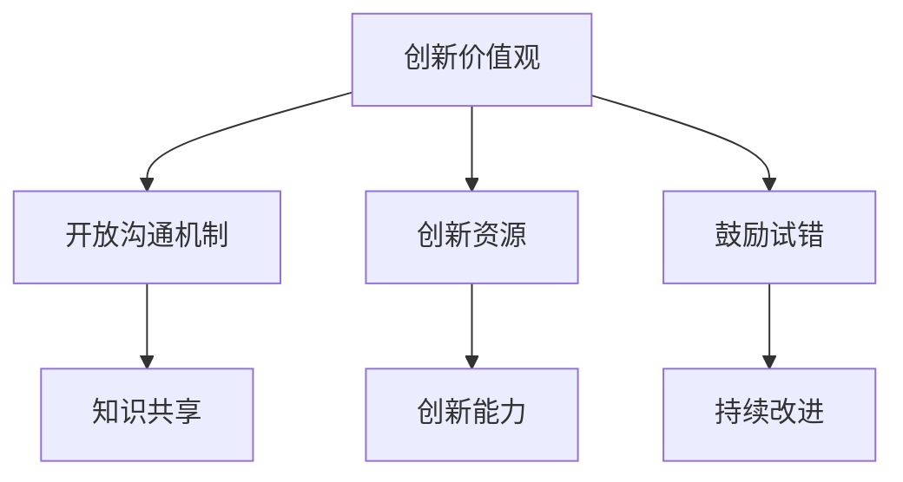

#### 3.2 风险管理与激励机制

创新过程中伴随着风险，如何有效管理风险并建立激励机制，是构建创新友好环境的重要一环。以下是风险管理与激励机制的策略：

1. **建立风险预警机制：** 领导者需要建立风险预警机制，对创新项目进行风险评估，及时发现和解决潜在问题。

2. **提供风险保障：** 创新项目往往需要投入大量资金和时间。领导者需要提供风险保障，为失败的项目提供一定的补偿，降低员工创新的心理压力。

3. **建立绩效评价体系：** 绩效评价体系需要体现创新的价值，对创新项目进行科学评价。领导者需要制定合理的绩效评价标准，激励员工积极创新。

4. **提供奖励与晋升机会：** 创新成果需要得到认可。领导者需要提供奖励与晋升机会，对创新成果显著的员工给予奖励，激发员工创新热情。

**风险管理与激励机制对比图：**

| 策略 | 描述 |
| --- | --- |
| 风险预警机制 | 及时发现和解决潜在问题 |
| 风险保障 | 降低员工创新的心理压力 |
| 绩效评价体系 | 体现创新的价值 |
| 奖励与晋升机会 | 激发员工创新热情 |

#### 3.3 跨部门合作与创新协同

跨部门合作与创新协同是构建创新友好环境的重要手段。以下是一些实现跨部门合作与创新协同的策略：

1. **建立跨部门项目团队：** 领导者可以建立跨部门项目团队，将不同部门的员工组织起来，共同推进创新项目。

2. **促进知识共享：** 知识共享是跨部门合作的基础。领导者需要建立有效的知识共享平台，鼓励员工分享知识和经验。

3. **开展跨部门培训：** 领导者可以定期开展跨部门培训，提高员工的协同能力和创新意识。

4. **建立激励机制：** 针对跨部门合作，领导者可以建立相应的激励机制，对合作成果显著的团队和个人进行奖励。

**跨部门合作与创新协同要素与作用图：**

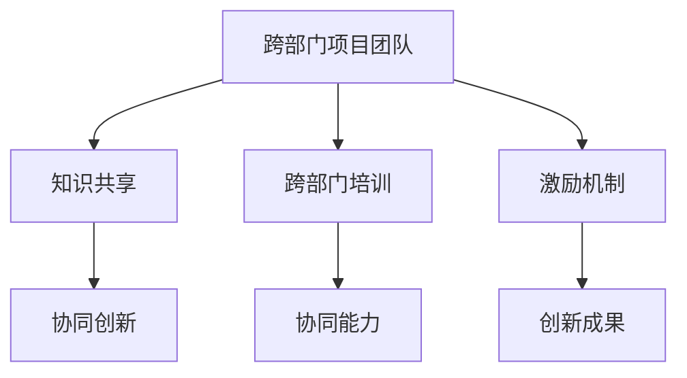

**总结：**

本章节通过对创新文化的培育、风险管理与激励机制，以及跨部门合作与创新协同的深入分析，为领导者提供了建立创新友好环境的全面策略。创新文化、风险管理、激励机制和跨部门合作与创新协同是构建创新友好环境的关键要素，领导者需要根据实际情况，灵活运用这些策略，为员工创造一个充满活力和创新氛围的工作环境。

----------------------------------------------------------------

### 第4章：创新战略的制定与执行

#### 4.1 创新战略的概念与类型

**背景介绍：**

创新战略是企业为了在竞争激烈的市场中保持优势，通过创新活动来实现长远发展目标的规划。本节将介绍创新战略的概念、分类以及创新目标的重要性。

**问题背景：**

企业在制定创新战略时，如何选择合适的类型？如何设定合理的创新目标？

**问题描述：**

1. 创新战略的概念是什么？
2. 创新战略有哪些类型？
3. 创新目标的设定与优先级如何确定？

**问题解决：**

通过分析创新战略的概念、类型，以及创新目标的设定与优先级，本节旨在为读者提供制定创新战略的全面指导。

**边界与外延：**

创新战略不仅仅局限于技术层面的创新，还包括业务模式、管理方法等各个方面的创新。

**概念结构与核心要素组成：**

创新战略的核心要素包括：创新目标、创新方向、资源配置、实施步骤等。

**核心概念与联系：**

创新战略是企业发展的关键规划，它与企业的愿景、使命和核心价值观密切相关。

#### 4.1.1 创新战略的概念

创新战略是指企业为了在竞争激烈的市场环境中保持优势，通过创新活动来实现长远发展目标的规划。创新战略涉及多个方面，包括产品创新、技术进步、市场拓展、商业模式创新等。

**创新战略的定义：**

创新战略是企业针对外部环境和内部能力，制定的一系列创新活动规划，以实现企业的可持续发展。

**创新战略的组成部分：**

1. **创新目标：** 明确企业创新的方向和目标，如提高产品竞争力、开拓新市场、实现技术突破等。
2. **创新方向：** 确定企业创新的重点领域，如技术研发、市场开拓、管理创新等。
3. **资源配置：** 根据创新目标，合理配置企业资源，包括资金、人力、技术等。
4. **实施步骤：** 制定具体的实施计划，确保创新战略的顺利执行。

#### 4.1.2 创新战略的类型

创新战略可以根据创新的目标和方式，分为多种类型。以下是几种常见的创新战略类型：

1. **技术驱动型创新战略：** 以技术创新为核心，通过研发新技术、新产品，提升企业的竞争力。
2. **市场驱动型创新战略：** 以市场需求为导向，通过市场调研，发现潜在需求，开发新产品或服务。
3. **商业模式创新战略：** 通过改变企业的业务模式，实现业务创新，如电子商务、共享经济等。
4. **管理创新战略：** 通过改进管理方法，提高企业的运营效率和创新能力。

**创新战略类型对比图：**

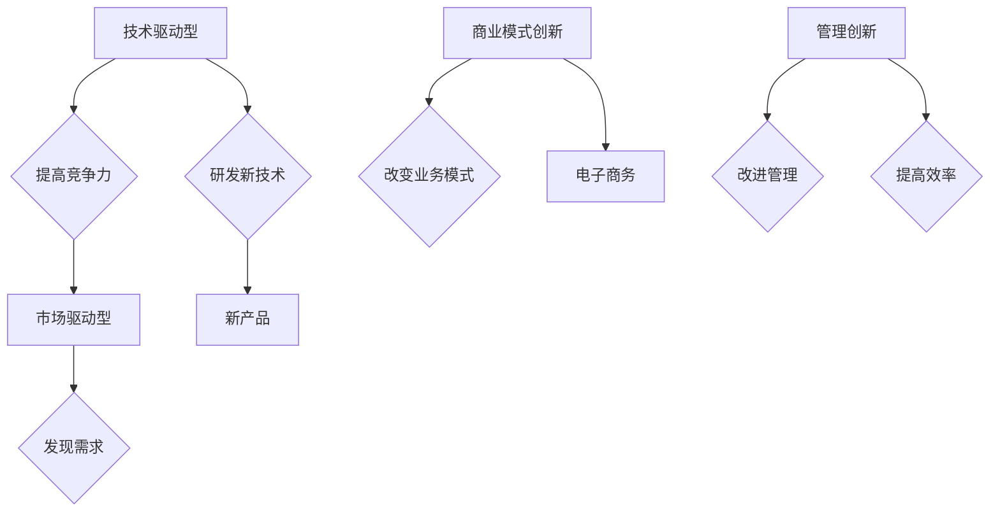

#### 4.1.3 创新目标的设定与优先级

创新目标的设定是制定创新战略的关键步骤。合理的创新目标能够明确企业创新的方向，指导资源的配置和项目的实施。

1. **明确创新目标：** 创新目标应明确、具体、可衡量，如提高产品性能、缩短产品上市时间、降低成本等。
2. **确定优先级：** 根据企业的实际情况，确定创新目标的优先级，确保资源的最优配置。

**创新目标设定与优先级确定流程：**

1. **市场调研：** 分析市场需求，确定潜在的创新机会。
2. **内部评估：** 评估企业的技术能力和资源状况，确定可行的创新目标。
3. **目标设定：** 根据市场调研和内部评估，明确创新目标。
4. **优先级排序：** 根据创新目标的可行性和重要性，确定优先级。

**创新目标设定与优先级确定示例：**

| 创新目标 | 描述 | 优先级 |
| --- | --- | --- |
| 提高产品性能 | 开发新一代产品，提升产品性能和用户体验 | 高 |
| 降低成本 | 通过流程优化和供应链整合，降低产品成本 | 中 |
| 市场拓展 | 在新市场开拓业务，扩大市场份额 | 中 |
| 技术研发 | 投入研发资源，开发新技术和产品 | 低 |

**总结：**

本节通过对创新战略的概念、类型，以及创新目标的设定与优先级的深入分析，为读者提供了制定创新战略的全面指导。企业应根据自身情况，选择合适的创新战略类型，设定明确、具体的创新目标，并合理确定优先级，以实现持续创新和长远发展。

#### 4.2 创新战略的执行与监控

**背景介绍：**

创新战略的制定只是第一步，关键在于执行和监控。有效的执行和监控能够确保创新战略的落地，提高创新项目的成功率。本节将介绍创新战略执行过程中的关键步骤、监控指标以及如何评估和调整创新战略。

**问题背景：**

在创新战略的执行过程中，如何确保项目按计划推进？如何评估和调整创新战略以适应市场变化？

**问题描述：**

1. 如何确保创新战略的顺利执行？
2. 如何制定和创新战略的监控指标？
3. 如何评估和调整创新战略？

**问题解决：**

通过分析创新战略的执行过程、监控指标以及评估和调整方法，本节旨在为读者提供创新战略执行与监控的实用指导。

**边界与外延：**

创新战略的执行和监控涉及多个环节，包括项目规划、资源分配、进度跟踪、风险评估等。

**概念结构与核心要素组成：**

创新战略执行与监控的核心要素包括：项目规划、进度跟踪、风险评估、绩效评估、调整与优化。

**核心概念与联系：**

创新战略的执行和监控是确保创新目标实现的重要手段，它们相互关联，共同推动创新活动的发展。

#### 4.2.1 确保创新战略的顺利执行

确保创新战略的顺利执行是创新成功的关键。以下是实现这一目标的关键步骤：

1. **明确项目目标：** 在项目启动阶段，明确项目的目标和预期成果，确保项目团队对项目的理解一致。
2. **制定详细的计划：** 根据项目目标，制定详细的实施计划，包括时间表、任务分配、资源需求等。
3. **建立跨部门协作机制：** 创新项目往往涉及多个部门，需要建立跨部门的协作机制，确保信息共享和资源协调。
4. **定期会议和沟通：** 定期召开项目会议，确保项目团队之间的沟通畅通，及时解决遇到的问题。

**创新战略执行步骤流程图：**

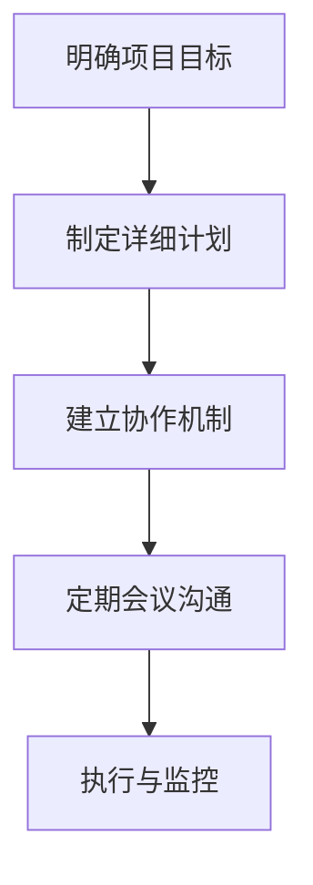

#### 4.2.2 制定创新战略的监控指标

监控创新战略的执行效果是确保项目顺利进行的重要手段。以下是一些常用的监控指标：

1. **项目进度：** 监控项目的实际进度是否按照计划进行，及时发现和解决进度偏差。
2. **资源利用：** 监控项目资源的使用情况，确保资源的合理配置和高效利用。
3. **质量指标：** 监控创新项目的质量，如产品性能、用户满意度等。
4. **成本控制：** 监控项目的成本支出，确保项目在预算范围内完成。

**创新战略监控指标示例：**

| 指标 | 描述 |
| --- | --- |
| 项目进度 | 项目任务完成情况 |
| 资源利用 | 资源使用效率 |
| 质量指标 | 产品性能、用户满意度 |
| 成本控制 | 项目成本支出 |

**监控指标与数据收集流程图：**

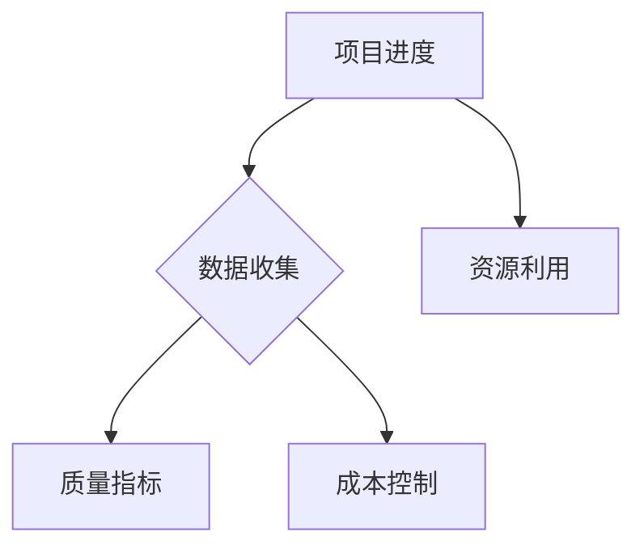

#### 4.2.3 评估和调整创新战略

创新战略的评估和调整是确保其持续有效的重要环节。以下是一些评估和调整创新战略的方法：

1. **定期评估：** 定期对创新战略的执行效果进行评估，包括项目进度、资源利用、质量指标和成本控制等方面。
2. **反馈机制：** 建立反馈机制，收集项目团队和利益相关者的反馈意见，及时发现战略执行中的问题和改进机会。
3. **调整策略：** 根据评估结果，及时调整创新战略，包括修改目标、调整资源分配、改进项目管理方法等。

**创新战略评估与调整流程图：**

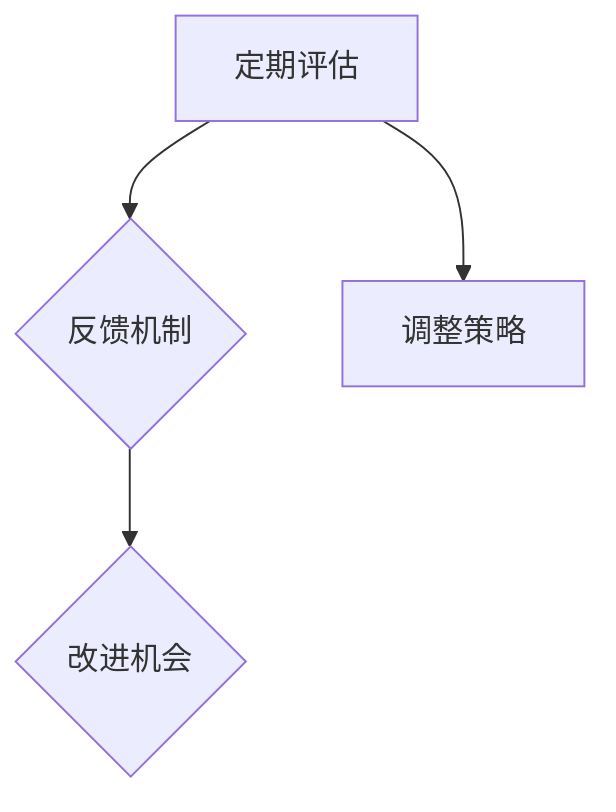

**总结：**

本节通过对创新战略的执行与监控的深入分析，提供了确保创新战略顺利执行的实用方法和监控指标。通过定期评估和调整，企业可以不断提高创新战略的有效性，推动创新活动的持续发展。

#### 4.3 创新实践案例研究

**背景介绍：**

案例研究是理解和分析现实世界中创新实践的有效方法。通过分析成功的创新实践案例，可以总结出有益的经验和教训，为其他企业的创新提供参考。本节将选取几个具有代表性的创新实践案例，探讨其在创新战略的制定与执行过程中的关键成功因素。

**问题背景：**

在现实世界中，不同的企业采取了不同的创新战略和执行方法，取得了不同程度的成功。了解这些成功案例，有助于我们更好地理解创新实践的本质。

**问题描述：**

1. 案例一：公司A如何通过创新战略的制定与执行，实现业务的快速增长？
2. 案例二：企业B如何利用创新实践，成功转型为行业领导者？
3. 案例三：政府C如何通过政策支持，推动创新生态的发展？

**问题解决：**

通过分析案例一、案例二和案例三，总结出成功创新实践的关键成功因素，为其他企业的创新提供借鉴。

**边界与外延：**

案例研究不仅限于企业层面的创新实践，还包括政府、科研机构等在创新生态中的角色和作用。

**概念结构与核心要素组成：**

案例研究的核心要素包括：创新战略的制定、执行过程、关键成功因素、创新成果等。

**核心概念与联系：**

案例研究通过分析现实世界中的创新实践，帮助我们理解创新战略的制定与执行过程，以及影响创新成功的关键因素。

#### 4.3.1 案例一：公司A的创新之路

**案例背景：**

公司A是一家全球领先的科技公司，致力于研发和生产高性能芯片。在市场竞争日益激烈的背景下，公司A通过创新战略的制定与执行，实现了业务的快速增长。

**关键成功因素：**

1. **明确创新目标：** 公司A明确了以技术创新为核心的发展目标，专注于研发高性能芯片，以满足市场需求。
2. **战略资源配置：** 公司A投入大量资源，包括资金、技术和人才，确保创新项目的顺利推进。
3. **跨部门协作：** 公司A建立了跨部门的创新团队，促进了知识共享和协同创新。
4. **快速响应市场：** 公司A通过市场调研，快速响应市场需求，调整产品策略，实现了产品的快速迭代。

**创新成果：**

通过创新战略的执行，公司A成功推出了多款高性能芯片，市场占有率大幅提升，实现了业务的快速增长。

**总结：**

公司A通过明确创新目标、合理资源配置、跨部门协作和快速响应市场，成功实现了创新战略的目标，为其他企业提供了有益的借鉴。

#### 4.3.2 案例二：企业B的创新生态构建

**案例背景：**

企业B是一家新兴的互联网企业，通过创新实践，成功转型为行业领导者。企业B通过构建创新生态，实现了快速发展和持续创新。

**关键成功因素：**

1. **创新文化培育：** 企业B注重创新文化的培育，鼓励员工勇于尝试和失败，形成了良好的创新氛围。
2. **开放合作：** 企业B积极与其他企业和科研机构建立合作关系，共享资源和知识，推动创新活动的开展。
3. **激励机制：** 企业B建立了有效的激励机制，对创新成果显著的团队和个人给予奖励，激发员工的创新热情。
4. **持续投入：** 企业B持续投入资金和技术，支持创新项目的研发和实施。

**创新成果：**

通过创新生态的构建，企业B成功推出了多款创新产品，市场份额稳步提升，成为行业领导者。

**总结：**

企业B通过创新文化培育、开放合作、激励机制和持续投入，成功构建了创新生态，实现了持续创新和快速发展。

#### 4.3.3 案例三：政府C推动创新生态的实践

**案例背景：**

政府C通过政策支持和资金投入，积极推动创新生态的发展，为当地企业提供良好的创新环境。

**关键成功因素：**

1. **政策支持：** 政府C出台了一系列创新政策，包括税收优惠、资金支持、人才引进等，为创新提供了良好的政策环境。
2. **资金投入：** 政府C设立了专项基金，支持创新项目的研发和实施。
3. **平台建设：** 政府C建立了创新平台，为企业和科研机构提供交流和合作的机会。
4. **人才培养：** 政府C注重人才培养，通过教育和培训，提高当地企业的创新能力。

**创新成果：**

通过政府的积极推动，当地创新生态得到了快速发展，吸引了大量企业投资和创新活动，促进了经济的增长。

**总结：**

政府C通过政策支持、资金投入、平台建设和人才培养，成功推动了创新生态的发展，为其他地区提供了有益的经验。

**总结：**

本节通过对公司A、企业B和政府C的创新实践案例研究，总结了成功创新实践的关键成功因素，包括明确创新目标、战略资源配置、跨部门协作、快速响应市场、创新文化培育、开放合作、激励机制、持续投入、政策支持、资金投入、平台建设和人才培养等。这些成功经验为其他企业的创新提供了有益的借鉴。

#### 4.4 创新生态系统中的资源管理

**背景介绍：**

创新生态系统中的资源管理是确保创新活动顺利进行的关键环节。有效的资源管理能够提高创新效率，降低创新成本，提高创新成功率。本节将探讨创新生态系统中的资源管理，包括人力资源配置、知识管理策略和资金与技术的支持。

**问题背景：**

在创新生态系统中，如何合理配置人力资源？如何管理知识？如何确保资金和技术的有效支持？

**问题描述：**

1. 如何进行人力资源配置？
2. 如何管理知识？
3. 如何确保资金和技术的支持？

**问题解决：**

通过分析人力资源配置、知识管理和资金与技术的支持，本节旨在为创新生态系统中的资源管理提供实用指导。

**边界与外延：**

资源管理不仅涉及企业内部，还包括与外部合作伙伴、政府、科研机构等建立合作关系，实现资源的共享和优化配置。

**概念结构与核心要素组成：**

资源管理的核心要素包括：人力资源配置、知识管理、资金管理和技术支持。

**核心概念与联系：**

资源管理是创新生态系统的重要组成部分，它与人力资源、知识、资金和技术等密切相关，共同推动创新活动的开展。

#### 4.4.1 人力资源配置

人力资源是创新生态系统中最宝贵的资源。合理配置人力资源，能够提高创新效率，激发员工的创新潜力。以下是人力资源配置的关键步骤：

1. **明确创新需求：** 根据创新项目的特点和需求，确定所需的专业技能和人力资源。
2. **人才选拔与培养：** 通过招聘和内部培养，选拔和培养具备创新能力和专业技能的员工。
3. **团队建设：** 建立跨部门、跨专业的创新团队，促进知识共享和协同创新。
4. **激励与考核：** 建立有效的激励机制和考核机制，激发员工的创新热情和工作动力。

**人力资源配置流程图：**

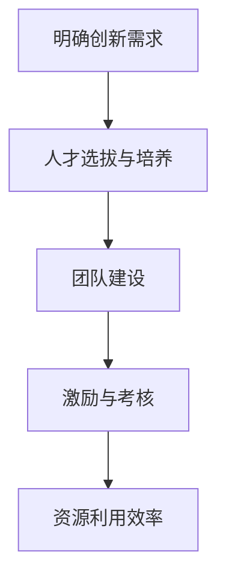

#### 4.4.2 知识管理策略

知识管理是创新生态系统中的核心要素，有效的知识管理能够提高创新效率，降低创新成本。以下是知识管理策略的关键步骤：

1. **建立知识共享平台：** 通过建立知识共享平台，促进内部知识和经验的传播和共享。
2. **知识分类与编码：** 对知识进行分类和编码，提高知识的可查找性和利用率。
3. **知识培训与交流：** 定期组织知识培训和交流活动，提高员工的知识水平和创新能力。
4. **知识评估与更新：** 对知识进行定期评估和更新，确保知识的准确性和实用性。

**知识管理策略流程图：**

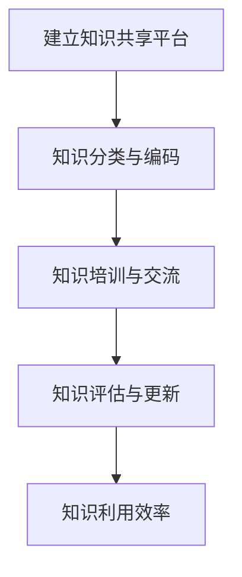

#### 4.4.3 资金与技术的支持

资金和技术是创新生态系统中的关键支撑。有效的资金和技术支持，能够确保创新项目的顺利推进和成功实施。以下是资金与技术支持的关键步骤：

1. **资金筹集：** 通过多种途径筹集资金，包括企业自有资金、政府资金、风险投资等。
2. **资金管理：** 建立严格的资金管理制度，确保资金的安全和高效使用。
3. **技术引进与研发：** 通过引进先进技术，加强技术研发，提高创新项目的成功率和市场竞争力。
4. **技术转移与转化：** 加强技术转移和转化，推动科技成果的商业化应用。

**资金与技术支持流程图：**

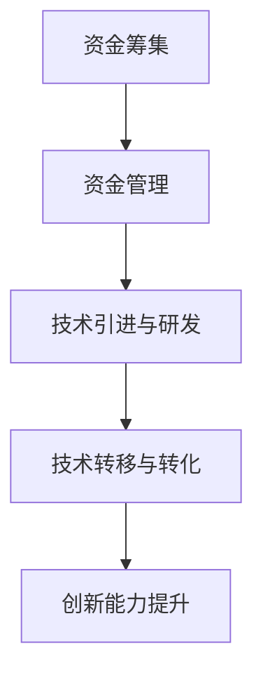

**总结：**

本节通过对人力资源配置、知识管理策略和资金与技术的支持的深入分析，为创新生态系统中的资源管理提供了实用指导。通过合理配置人力资源、有效管理知识和确保资金与技术的支持，企业可以构建一个高效、可持续的创新生态系统，推动创新活动的持续发展。

#### 4.5 创新实践案例研究

**背景介绍：**

案例研究是理解和分析现实世界中创新实践的有效方法。通过分析成功的创新实践案例，可以总结出有益的经验和教训，为其他企业的创新提供参考。本节将选取几个具有代表性的创新实践案例，探讨其在资源管理方面的关键成功因素。

**问题背景：**

在现实世界中，不同的企业采取了不同的创新实践和资源管理方法，取得了不同程度的成功。了解这些成功案例，有助于我们更好地理解资源管理的本质。

**问题描述：**

1. 案例一：公司A如何通过人力资源配置、知识管理和资金技术支持，实现业务的快速增长？
2. 案例二：企业B如何利用创新实践，成功转型为行业领导者？
3. 案例三：政府C如何通过政策支持和资金投入，推动创新生态的发展？

**问题解决：**

通过分析案例一、案例二和案例三，总结出成功创新实践的关键成功因素，为其他企业的创新提供借鉴。

**边界与外延：**

案例研究不仅限于企业层面的创新实践，还包括政府、科研机构等在创新生态中的角色和作用。

**概念结构与核心要素组成：**

案例研究的核心要素包括：人力资源配置、知识管理、资金与技术支持、创新成果等。

**核心概念与联系：**

案例研究通过分析现实世界中的创新实践，帮助我们理解资源管理的本质和关键成功因素。

#### 4.5.1 案例一：公司A的资源管理之道

**案例背景：**

公司A是一家全球领先的科技公司，致力于研发和生产高性能芯片。公司A通过卓越的人力资源配置、知识管理和资金技术支持，实现了业务的快速增长。

**关键成功因素：**

1. **人力资源配置：** 公司A通过精确的人才选拔和培养，建立了高效的研发团队，确保了创新项目的顺利进行。
2. **知识管理：** 公司A建立了完善的内部知识共享平台，促进了知识传播和创新。
3. **资金与技术支持：** 公司A积极筹集资金，投入技术研发，确保了创新项目的资金和技术保障。

**创新成果：**

通过高效的资源管理，公司A成功推出了多款高性能芯片，市场份额大幅提升，实现了业务的快速增长。

**总结：**

公司A通过卓越的人力资源配置、知识管理和资金技术支持，实现了创新的成功，为其他企业提供了宝贵的经验。

#### 4.5.2 案例二：企业B的创新资源管理实践

**案例背景：**

企业B是一家新兴的互联网企业，通过创新实践，成功转型为行业领导者。企业B在资源管理方面采取了独特的策略，确保了创新活动的顺利开展。

**关键成功因素：**

1. **人力资源配置：** 企业B通过建立多元化的团队，吸引了不同背景的专业人才，推动了创新思维的碰撞和融合。
2. **知识管理：** 企业B建立了开放的知识共享平台，鼓励员工分享经验和创新成果，提高了整体创新能力。
3. **资金与技术支持：** 企业B通过风险投资和自筹资金，确保了创新项目的资金和技术支持，推动了企业的快速发展。

**创新成果：**

通过创新的资源管理，企业B成功推出了多款创新产品，市场份额稳步提升，成为行业领导者。

**总结：**

企业B通过多元化的人力资源配置、开放的知识管理和资金与技术支持，实现了创新的突破，为其他企业提供了借鉴。

#### 4.5.3 案例三：政府C推动创新生态的实践

**案例背景：**

政府C通过政策支持和资金投入，积极推动创新生态的发展，为当地企业提供良好的创新环境。

**关键成功因素：**

1. **政策支持：** 政府C出台了一系列创新政策，包括税收优惠、资金支持、人才引进等，为创新提供了良好的政策环境。
2. **资金投入：** 政府C设立了专项基金，支持创新项目的研发和实施。
3. **知识共享：** 政府C建立了创新平台，促进企业、科研机构和政府之间的知识共享和合作。

**创新成果：**

通过政府的积极推动，当地创新生态得到了快速发展，吸引了大量企业投资和创新活动，促进了经济的增长。

**总结：**

政府C通过政策支持、资金投入和知识共享，成功推动了创新生态的发展，为其他地区提供了有益的经验。

**总结：**

本节通过对公司A、企业B和政府C的创新实践案例研究，总结了成功创新实践的关键成功因素，包括人力资源配置、知识管理、资金与技术支持等。这些成功经验为其他企业的创新提供了有益的借鉴。

#### 第5章：创新实践案例研究

**背景介绍：**

案例研究是理解和分析现实世界中创新实践的有效方法。通过分析成功的创新实践案例，可以总结出有益的经验和教训，为其他企业的创新提供参考。本节将选取几个具有代表性的创新实践案例，探讨其在创新生态建设过程中的关键成功因素。

**问题背景：**

在现实世界中，不同的企业采取了不同的创新实践和建设方法，取得了不同程度的成功。了解这些成功案例，有助于我们更好地理解创新生态的构建和优化。

**问题描述：**

1. 案例一：公司A如何通过创新生态的建设，实现业务的快速增长？
2. 案例二：企业B如何通过创新生态的构建，成功转型为行业领导者？
3. 案例三：政府C如何通过政策支持和资金投入，推动创新生态的发展？

**问题解决：**

通过分析案例一、案例二和案例三，总结出成功创新生态建设的关键成功因素，为其他企业的创新提供借鉴。

**边界与外延：**

案例研究不仅限于企业层面的创新实践，还包括政府、科研机构等在创新生态中的角色和作用。

**概念结构与核心要素组成：**

案例研究的核心要素包括：创新生态的构建、关键成功因素、创新成果等。

**核心概念与联系：**

案例研究通过分析现实世界中的创新实践，帮助我们理解创新生态的构建和优化，以及影响创新成功的关键因素。

#### 5.1 案例一：公司A的创新生态之路

**案例背景：**

公司A是一家全球领先的科技公司，专注于人工智能和大数据技术的研发和应用。公司A通过构建创新生态，实现了业务的快速增长。

**关键成功因素：**

1. **明确创新战略：** 公司A制定了明确的创新战略，以人工智能和大数据技术为核心，确定了创新的发展方向。
2. **跨部门合作：** 公司A建立了跨部门的创新团队，促进了不同部门之间的知识共享和协同创新。
3. **外部合作：** 公司A与多家科研机构、高校和行业合作伙伴建立了合作关系，共同推进创新项目。
4. **持续投入：** 公司A持续投入大量资金和资源，支持创新项目的研发和实施。

**创新成果：**

通过创新生态的建设，公司A成功推出了多款基于人工智能和大数据技术的产品，市场份额大幅提升，实现了业务的快速增长。

**总结：**

公司A通过明确创新战略、跨部门合作、外部合作和持续投入，成功构建了创新生态，实现了创新和业务的快速增长。

#### 5.2 案例二：企业B的创新生态构建

**案例背景：**

企业B是一家新兴的互联网企业，通过创新实践，成功转型为行业领导者。企业B通过构建创新生态，实现了持续创新和快速发展。

**关键成功因素：**

1. **创新文化培育：** 企业B注重创新文化的培育，鼓励员工勇于尝试和失败，形成了良好的创新氛围。
2. **开放合作：** 企业B积极与其他企业和科研机构建立合作关系，共享资源和知识，推动创新活动的开展。
3. **激励机制：** 企业B建立了有效的激励机制，对创新成果显著的团队和个人给予奖励，激发员工的创新热情。
4. **持续投入：** 企业B持续投入资金和技术，支持创新项目的研发和实施。

**创新成果：**

通过创新生态的构建，企业B成功推出了多款创新产品，市场份额稳步提升，成为行业领导者。

**总结：**

企业B通过创新文化培育、开放合作、激励机制和持续投入，成功构建了创新生态，实现了持续创新和快速发展。

#### 5.3 案例三：政府C推动创新生态的实践

**案例背景：**

政府C通过政策支持和资金投入，积极推动创新生态的发展，为当地企业提供良好的创新环境。

**关键成功因素：**

1. **政策支持：** 政府C出台了一系列创新政策，包括税收优惠、资金支持、人才引进等，为创新提供了良好的政策环境。
2. **资金投入：** 政府C设立了专项基金，支持创新项目的研发和实施。
3. **平台建设：** 政府C建立了创新平台，促进企业、科研机构和政府之间的知识共享和合作。
4. **人才培养：** 政府C注重人才培养，通过教育和培训，提高当地企业的创新能力。

**创新成果：**

通过政府的积极推动，当地创新生态得到了快速发展，吸引了大量企业投资和创新活动，促进了经济的增长。

**总结：**

政府C通过政策支持、资金投入、平台建设和人才培养，成功推动了创新生态的发展，为其他地区提供了有益的经验。

**总结：**

本节通过对公司A、企业B和政府C的创新实践案例研究，总结了成功创新生态建设的关键成功因素，包括明确创新战略、跨部门合作、外部合作、创新文化培育、开放合作、激励机制、持续投入、政策支持、资金投入、平台建设和人才培养等。这些成功经验为其他企业的创新提供了有益的借鉴。

#### 第6章：创新生态的评估与优化

**背景介绍：**

创新生态的评估与优化是确保创新活动持续发展的重要环节。通过对创新生态的评估，可以发现存在的问题和不足，从而有针对性地进行优化。本节将探讨创新生态评估的指标体系、问题诊断方法和优化策略。

**问题背景：**

在创新生态的建设过程中，如何有效评估其发展状况？如何发现和解决创新生态中的问题？

**问题描述：**

1. 如何构建创新生态评估指标体系？
2. 如何诊断创新生态中的问题？
3. 如何优化创新生态？

**问题解决：**

通过分析创新生态评估指标体系、问题诊断方法和优化策略，本节旨在为读者提供创新生态评估与优化的实用指导。

**边界与外延：**

创新生态的评估与优化不仅涉及企业内部，还包括与外部合作伙伴、政府、科研机构等建立合作关系，实现创新生态的协同发展。

**概念结构与核心要素组成：**

创新生态评估与优化的核心要素包括：评估指标体系、问题诊断方法、优化策略。

**核心概念与联系：**

创新生态评估与优化是确保创新活动持续发展的重要手段，评估指标体系、问题诊断方法和优化策略相互关联，共同推动创新生态的健康发展。

#### 6.1 创新生态评估指标体系

构建创新生态评估指标体系是进行创新生态评估的基础。以下是一些常用的创新生态评估指标：

1. **创新产出：** 包括专利数量、论文发表、新产品开发等，反映企业的创新成果。
2. **创新效率：** 包括创新项目完成率、创新周期、创新成本等，反映企业的创新效率。
3. **创新能力：** 包括研发投入、研发人员数量、技术创新能力等，反映企业的创新潜力。
4. **创新环境：** 包括政策支持、资金投入、人才储备等，反映创新生态的支撑环境。

**创新生态评估指标体系表格：**

| 指标 | 描述 | 重要性 |
| --- | --- | --- |
| 创新产出 | 专利数量、论文发表、新产品开发 | 反映创新成果 |
| 创新效率 | 创新项目完成率、创新周期、创新成本 | 反映创新效率 |
| 创造能力 | 研发投入、研发人员数量、技术创新能力 | 反映创新潜力 |
| 创新环境 | 政策支持、资金投入、人才储备 | 反映创新生态支撑环境 |

**创新生态评估指标体系流程图：**

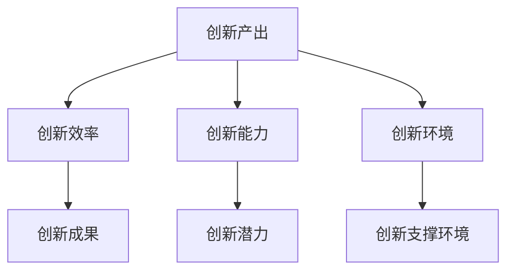

#### 6.2 创新生态问题诊断

诊断创新生态中的问题是优化创新生态的重要步骤。以下是一些常用的创新生态问题诊断方法：

1. **SWOT分析：** 通过分析创新生态的内部优势（Strengths）、劣势（Weaknesses）、机会（Opportunities）和威胁（Threats），诊断创新生态的问题。
2. **访谈法：** 通过与相关利益者（如企业、政府、科研机构等）进行访谈，了解他们对创新生态的看法和建议，诊断创新生态的问题。
3. **数据分析：** 通过对创新生态的统计数据进行分析，发现创新生态中的问题。

**创新生态问题诊断方法表格：**

| 方法 | 描述 | 适用场景 |
| --- | --- | --- |
| SWOT分析 | 分析优势、劣势、机会和威胁 | 全面诊断创新生态 |
| 访谈法 | 了解利益相关者看法和建议 | 了解外部环境 |
| 数据分析 | 分析统计数据 | 数据驱动诊断 |

**创新生态问题诊断流程图：**

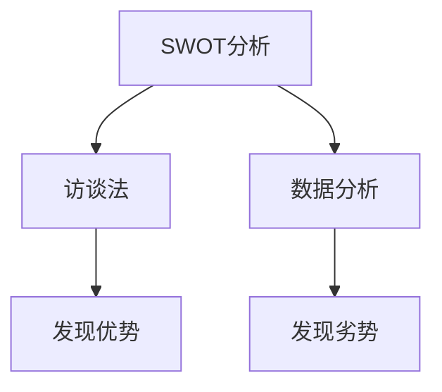

#### 6.3 创新生态优化策略

针对诊断出的创新生态问题，需要制定相应的优化策略。以下是一些常用的创新生态优化策略：

1. **政策优化：** 改进创新政策，提高政策的有效性。
2. **资源配置：** 调整资源分配，确保创新资源的合理利用。
3. **人才培养：** 加强人才培养，提高创新人才的数量和质量。
4. **合作机制：** 改善合作机制，促进跨部门、跨行业合作。

**创新生态优化策略表格：**

| 策略 | 描述 | 适用场景 |
| --- | --- | --- |
| 政策优化 | 改进创新政策 | 提高政策有效性 |
| 资源配置 | 调整资源分配 | 确保资源合理利用 |
| 人才培养 | 加强人才培养 | 提高创新人才质量 |
| 合作机制 | 改善合作机制 | 促进跨部门、跨行业合作 |

**创新生态优化策略流程图：**

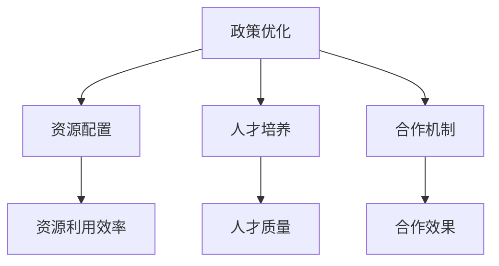

**总结：**

本节通过对创新生态评估指标体系、问题诊断方法和优化策略的深入分析，为读者提供了创新生态评估与优化的实用指导。通过构建评估指标体系、诊断创新生态问题并制定优化策略，企业可以不断提高创新生态的质量，推动创新活动的持续发展。

### 第7章：创新生态的评估与优化

#### 7.1 创新生态评估指标体系

创新生态的评估指标体系是衡量创新生态发展状况的重要工具。一个完善的评估指标体系可以帮助企业识别创新过程中的优点和不足，从而制定改进策略。以下是一些关键的创新生态评估指标：

1. **创新产出：** 包括专利数量、论文发表、新产品上市等。这些指标反映了企业的创新成果和创新能力。
2. **创新效率：** 包括创新项目完成率、项目周期、项目成本等。这些指标反映了创新活动的效率和质量。
3. **创新能力：** 包括研发投入、研发人员数量、技术储备等。这些指标反映了企业的技术实力和创新潜力。
4. **创新环境：** 包括政策支持、资金投入、人才储备等。这些指标反映了创新生态的外部环境。

**创新生态评估指标体系表格：**

| 指标类别 | 指标名称 | 描述 |
| --- | --- | --- |
| 创新产出 | 专利数量 | 反映企业的技术创新能力 |
| 创新产出 | 论文发表 | 反映企业的学术影响力 |
| 创新产出 | 新产品上市 | 反映企业的市场竞争力 |
| 创新效率 | 创新项目完成率 | 反映项目的成功执行情况 |
| 创新效率 | 项目周期 | 反映项目的进展速度 |
| 创新效率 | 项目成本 | 反映项目的成本效益 |
| 创造能力 | 研发投入 | 反映企业的研发力度 |
| 创造能力 | 研发人员数量 | 反映企业的人才储备 |
| 创造能力 | 技术储备 | 反映企业技术储备的丰富程度 |
| 创新环境 | 政策支持 | 反映政府对创新的扶持力度 |
| 创新环境 | 资金投入 | 反映企业的资金使用效率 |
| 创新环境 | 人才储备 | 反映企业的人才培养和吸引能力 |

**评估指标体系流程图（Mermaid）:**

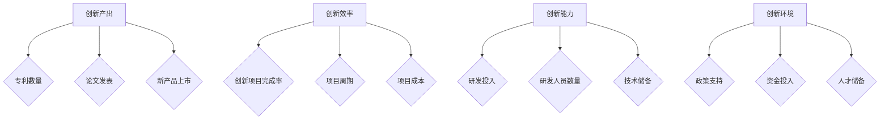

#### 7.2 创新生态问题诊断

创新生态问题诊断是识别和解决创新生态中潜在问题的关键步骤。以下是一些常用的创新生态问题诊断方法：

1. **SWOT分析：** 通过分析企业的优势（Strengths）、劣势（Weaknesses）、机会（Opportunities）和威胁（Threats），全面评估创新生态的状况。
2. **访谈法：** 通过与员工、客户、合作伙伴等进行访谈，收集他们对创新生态的看法和建议，发现潜在问题。
3. **数据分析：** 通过对创新项目的数据进行深入分析，识别创新过程中的瓶颈和不足。

**创新生态问题诊断方法表格：**

| 方法 | 描述 | 适用场景 |
| --- | --- | --- |
| SWOT分析 | 分析优势、劣势、机会和威胁 | 全面诊断创新生态 |
| 访谈法 | 了解利益相关者看法和建议 | 了解外部环境 |
| 数据分析 | 分析统计数据 | 数据驱动诊断 |

**SWOT分析流程图（Mermaid）:**

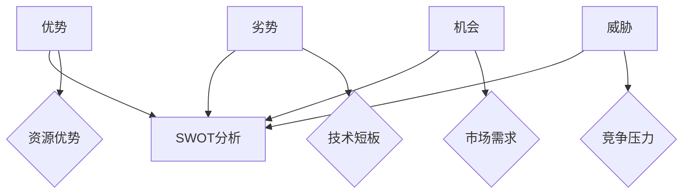

#### 7.3 创新生态优化策略

创新生态的优化需要针对诊断出的问题，采取具体的优化策略。以下是一些常用的创新生态优化策略：

1. **政策优化：** 改进和创新政策，提高政策的灵活性和有效性，为企业提供更好的创新环境。
2. **资源配置：** 调整资源分配，确保创新资源的合理利用，提高创新效率。
3. **人才培养：** 加强人才培养，提高员工的专业技能和创新意识，增强企业的创新能力。
4. **合作机制：** 改善和创新合作机制，促进跨部门、跨行业的合作，扩大创新网络。

**创新生态优化策略表格：**

| 策略 | 描述 | 适用场景 |
| --- | --- | --- |
| 政策优化 | 改进和创新政策 | 提高政策有效性 |
| 资源配置 | 调整资源分配 | 确保资源合理利用 |
| 人才培养 | 加强人才培养 | 提高创新能力 |
| 合作机制 | 改善合作机制 | 促进跨部门、跨行业合作 |

**优化策略流程图（Mermaid）:**

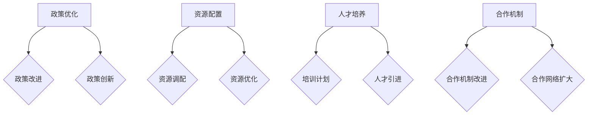

**总结：**

本章通过对创新生态评估指标体系、问题诊断方法和优化策略的深入分析，为读者提供了创新生态评估与优化的实用指导。通过构建评估指标体系、诊断创新生态问题并制定优化策略，企业可以不断提高创新生态的质量，推动创新活动的持续发展。

### 第8章：创新生态的挑战与应对策略

**背景介绍：**

在创新生态的建设过程中，企业面临着诸多挑战。这些挑战包括技术变革、法律法规和政策支持不足、全球化背景下的竞争等。本节将探讨这些挑战，并分析相应的应对策略。

**问题背景：**

企业如何应对技术变革带来的挑战？如何充分利用法律法规和政策支持？全球化背景下，企业应如何应对竞争压力？

**问题描述：**

1. 技术变革对创新生态的影响是什么？
2. 法律法规与政策支持对创新生态的影响是什么？
3. 全球化背景下，企业如何应对创新生态的挑战？

**问题解决：**

通过分析技术变革、法律法规与政策支持以及全球化背景下的竞争挑战，本节旨在为读者提供应对策略。

**边界与外延：**

创新生态的挑战不仅涉及企业内部，还包括外部环境的变化和全球市场的竞争。

**概念结构与核心要素组成：**

创新生态的挑战与应对策略的核心要素包括：技术变革、法律法规与政策支持、全球化背景、竞争策略。

**核心概念与联系：**

技术变革、法律法规与政策支持、全球化背景是影响创新生态发展的关键因素，企业需要根据实际情况采取相应的应对策略。

#### 8.1 技术变革对创新生态的影响

技术变革是创新生态发展的重要驱动力，但同时也带来了诸多挑战。以下分析技术变革对创新生态的影响：

1. **创新速度加快：** 技术的快速发展使得创新速度显著加快，企业需要更加灵活地应对市场变化。
2. **竞争加剧：** 技术变革导致竞争激烈，企业需要在创新速度和质量上保持领先。
3. **资源需求变化：** 新技术的出现改变了资源需求，企业需要调整资源配置，以适应新技术的要求。
4. **合作模式转变：** 技术变革促使企业之间的合作模式发生转变，开放合作和跨界合作成为趋势。

**技术变革对创新生态的影响图（Mermaid）:**

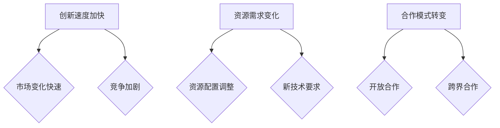

**应对策略：**

1. **加强技术研发：** 投入更多资源进行技术研发，保持技术领先优势。
2. **提升敏捷性：** 建立敏捷的研发和管理流程，提高对市场变化的响应速度。
3. **构建跨界合作平台：** 通过建立跨界合作平台，促进企业、科研机构、高校等之间的合作。
4. **培养复合型人才：** 培养具备跨学科知识和技能的复合型人才，提升企业的创新能力。

#### 8.2 法律法规与政策支持对创新生态的影响

法律法规与政策支持是创新生态发展的重要保障。以下分析法律法规与政策支持对创新生态的影响：

1. **知识产权保护：** 加强知识产权保护，为企业创新提供法律保障，激励企业投入更多的资源进行创新。
2. **税收优惠：** 提供税收优惠，降低企业创新成本，鼓励企业进行创新活动。
3. **资金支持：** 提供资金支持，帮助企业解决资金难题，推动创新项目的实施。
4. **人才引进政策：** 通过人才引进政策，吸引高层次人才加入企业，提升企业的创新能力。

**法律法规与政策支持对创新生态的影响图（Mermaid）:**

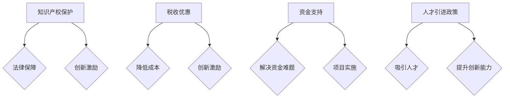

**应对策略：**

1. **积极参与政策制定：** 企业应积极参与政策制定，提出有利于创新发展的意见和建议。
2. **利用政策资源：** 充分利用政策资源，如税收优惠、资金支持等，降低创新成本。
3. **建立法律顾问团队：** 建立专业的法律顾问团队，确保企业的创新活动符合法律法规要求。
4. **加强知识产权保护：** 加强知识产权保护，建立完善的知识产权管理体系。

#### 8.3 全球化背景下的创新生态

全球化背景下，企业面临着更加复杂的市场环境。以下分析全球化对创新生态的影响：

1. **竞争压力：** 全球化使得市场竞争更加激烈，企业需要不断提升创新能力，以保持竞争优势。
2. **市场机会：** 全球化提供了更多的市场机会，企业可以通过跨国合作和市场拓展，实现业务增长。
3. **文化交流：** 全球化促进了文化交流，企业可以借鉴其他国家的创新经验，提升自身创新能力。
4. **供应链管理：** 全球化使得供应链管理变得更加复杂，企业需要提高供应链的协同效率。

**全球化背景下的创新生态影响图（Mermaid）:**

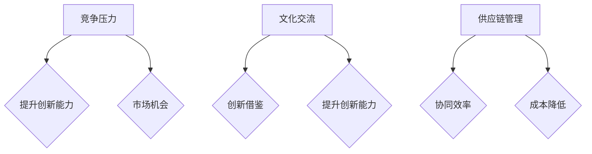

**应对策略：**

1. **全球化战略布局：** 制定全球化战略，合理布局全球市场和资源，提高国际化经营能力。
2. **跨国合作：** 加强与全球合作伙伴的合作，共同推动创新项目。
3. **人才培养与引进：** 通过人才引进和培养，提升国际化人才队伍。
4. **技术创新：** 加强技术创新，提高产品和服务的竞争力。

**总结：**

本章通过对技术变革、法律法规与政策支持以及全球化背景下的创新生态挑战进行分析，并提出了相应的应对策略。企业应根据自身实际情况，采取有效的策略，以应对创新生态中的挑战，推动企业的持续创新和发展。

### 第9章：创新生态的未来趋势

**背景介绍：**

随着科技的不断进步和社会经济的发展，创新生态正面临着新的变革和机遇。本节将探讨创新生态的未来趋势，包括人工智能与创新的深度融合、网络协作与共享经济的兴起，以及可持续创新与绿色发展。

**问题背景：**

未来创新生态将如何发展？新兴技术和商业模式将如何影响创新生态？

**问题描述：**

1. 人工智能与创新的深度融合将如何影响创新生态？
2. 网络协作与共享经济对创新生态的影响是什么？
3. 可持续创新与绿色发展将如何推动创新生态的变革？

**问题解决：**

通过分析人工智能、网络协作与共享经济、可持续创新与绿色发展等未来趋势，本节旨在为读者提供对创新生态未来发展方向的洞察。

**边界与外延：**

创新生态的未来趋势不仅涉及技术层面的变革，还包括社会、经济和文化等多方面的变化。

**概念结构与核心要素组成：**

创新生态的未来趋势的核心要素包括：人工智能、网络协作与共享经济、可持续创新与绿色发展。

**核心概念与联系：**

人工智能、网络协作与共享经济、可持续创新与绿色发展是创新生态未来发展的关键趋势，它们相互影响，共同塑造创新生态的未来。

#### 9.1 人工智能与创新的深度融合

人工智能（AI）技术的发展正在深刻地改变创新生态的各个方面。以下是人工智能与创新的深度融合对未来创新生态的影响：

1. **智能化创新流程：** 人工智能可以自动化和优化创新流程，提高创新效率。例如，通过机器学习算法预测市场趋势，优化产品设计和开发过程。
2. **智能协同创新：** 人工智能技术可以实现跨部门、跨领域的智能协同创新，促进知识的共享和流动。例如，通过智能平台，不同部门和合作伙伴可以实时协作，共同推进创新项目。
3. **智能化风险管理：** 人工智能可以分析大量数据，预测潜在的风险，并制定相应的风险应对策略，降低创新过程中的不确定性。
4. **智能知识产权保护：** 人工智能技术可以用于智能识别和监测知识产权侵犯行为，提高知识产权保护水平。

**人工智能与创新的深度融合图（Mermaid）:**

```mermaid
graph TD
    A[智能化创新流程] --> B{流程优化}
    A --> C{创新效率提升}
    D[智能协同创新] --> E{知识共享}
    D --> F{实时协作}
    G[智能化风险管理] --> H{风险预测}
    G --> I{风险应对}
    J[智能知识产权保护] --> K{知识产权监测}
    J --> L{保护水平提升}
```

**未来趋势分析：**

随着人工智能技术的不断发展，智能化创新流程、智能协同创新、智能化风险管理以及智能知识产权保护将成为创新生态的重要特征。企业需要积极拥抱人工智能技术，提升创新能力，以应对未来市场的挑战。

#### 9.2 网络协作与共享经济的兴起

网络协作与共享经济是近年来快速发展的新兴商业模式，对创新生态产生了深远的影响。以下是网络协作与共享经济对创新生态的影响：

1. **资源高效配置：** 网络协作与共享经济可以实现资源的有效配置，提高资源利用率。例如，通过共享办公空间和设备，企业可以降低运营成本，提高资源利用效率。
2. **创新合作模式：** 网络协作与共享经济促进了跨部门、跨行业的合作，推动了创新合作模式的变革。例如，通过共享平台，企业可以与高校、科研机构合作，共同推进创新项目。
3. **降低创新门槛：** 网络协作与共享经济降低了创新门槛，使更多的企业和个人能够参与到创新活动中来。例如，通过共享技术资源和资金支持，初创企业可以更容易地开展创新项目。
4. **创新资源共享：** 网络协作与共享经济促进了创新资源的共享，提高了创新效率。例如，通过共享实验室和设备，企业可以减少重复投资，提高创新资源的利用效率。

**网络协作与共享经济的兴起图（Mermaid）:**

```mermaid
graph TD
    A[资源高效配置] --> B{降低运营成本}
    A --> C{提高资源利用率}
    D[创新合作模式] --> E{跨部门合作}
    D --> F{跨行业合作}
    G[降低创新门槛] --> H{初创企业参与}
    G --> I{创新项目开展}
    J[创新资源共享] --> K{共享实验室}
    J --> L{设备共享}
```

**未来趋势分析：**

随着网络协作与共享经济的进一步发展，资源高效配置、创新合作模式、降低创新门槛和创新资源共享将成为创新生态的重要特征。企业需要充分利用网络协作与共享经济的优势，优化资源配置，提升创新能力。

#### 9.3 可持续创新与绿色发展

可持续创新与绿色发展是未来创新生态发展的重要方向。以下是可持续创新与绿色发展对创新生态的影响：

1. **环境友好创新：** 可持续创新注重环境保护和资源节约，推动了环境友好型技术的研发和应用。例如，新能源技术、环保材料等创新领域的发展，有助于实现绿色发展。
2. **社会责任创新：** 可持续创新强调企业的社会责任，推动了企业在环境保护、社会责任等方面的创新。例如，企业通过绿色发展模式，减少碳排放，提高资源利用率，实现可持续发展。
3. **创新价值重塑：** 可持续创新与绿色发展改变了创新的价值观，推动了企业从传统的短视创新转向长期的可持续创新。例如，企业通过关注环境和社会效益，实现经济效益和社会效益的双赢。
4. **政策支持与引导：** 可持续创新与绿色发展得到了政策的大力支持，为创新生态的发展提供了良好的环境。例如，政府出台了一系列政策，鼓励企业进行可持续创新，推动绿色发展。

**可持续创新与绿色发展图（Mermaid）:**

```mermaid
graph TD
    A[环境友好创新] --> B{环保技术研发}
    A --> C{绿色发展模式}
    D[社会责任创新] --> E{企业社会责任}
    D --> F{可持续发展}
    G[创新价值重塑] --> H{长期可持续创新}
    G --> I{经济效益和社会效益双赢}
    J[政策支持与引导] --> K{政策鼓励}
    J --> L{创新生态发展}
```

**未来趋势分析：**

随着可持续创新与绿色发展的重要性日益凸显，环境友好创新、社会责任创新、创新价值重塑和政策支持与引导将成为创新生态的重要趋势。企业需要积极关注可持续创新与绿色发展，推动创新生态的可持续发展。

**总结：**

本章通过对人工智能与创新的深度融合、网络协作与共享经济的兴起，以及可持续创新与绿色发展等未来趋势的分析，为读者提供了对创新生态未来发展的洞察。人工智能、网络协作与共享经济和可持续创新与绿色发展将共同推动创新生态的变革，企业需要紧跟趋势，积极应对，以实现持续创新和绿色发展。

### 第10章：总结与展望

**总结：**

在本书中，我们系统地探讨了领导力与创新生态的关系，分析了建立创新友好环境的关键要素，提出了创新战略的制定与执行、资源管理、创新生态的评估与优化等策略。同时，我们还通过案例研究和未来趋势分析，为读者提供了丰富的实战经验和前瞻性指导。

**未来领导力的发展方向：**

未来领导力的发展方向将更加注重创新能力的提升和跨组织的合作。领导者需要具备以下几方面的能力：

1. **战略前瞻性：** 能够把握市场趋势，预见未来的发展方向，提前布局创新资源。
2. **灵活应变：** 能够快速适应环境变化，灵活调整领导策略。
3. **协同合作：** 能够与其他组织建立紧密的合作关系，共同推动创新生态的发展。
4. **人才发展：** 能够培养和吸引优秀的人才，提升团队的创新能力。
5. **可持续发展：** 能够关注环境和社会效益，推动企业的可持续发展。

**推动创新生态建设的实践建议：**

为了推动创新生态的建设，企业可以采取以下实践建议：

1. **建立创新文化：** 从价值观、制度和文化层面培育创新文化，鼓励员工勇于创新。
2. **加强资源管理：** 合理配置人力资源、知识和技术资源，提高创新效率。
3. **构建合作网络：** 与其他组织建立合作关系，共享资源和知识，共同推动创新。
4. **政策支持：** 积极参与政策制定，争取政策支持，为创新提供良好的环境。
5. **人才培养：** 加强人才培养，提高员工的专业技能和创新意识。

**展望：**

创新生态建设是一个长期而复杂的过程，需要企业、政府、科研机构等多方共同参与和努力。未来，随着科技和社会的发展，创新生态将面临新的机遇和挑战。我们期待通过持续的努力和探索，能够构建一个更加繁荣、可持续的创新生态，推动社会的进步和发展。

**感谢：**

感谢您阅读本书。希望本书能够为您在领导力与创新生态建设方面提供有价值的参考和启示。如果您有任何问题或建议，欢迎联系我们，我们期待与您共同探讨创新生态的未来。

**作者：**

AI天才研究院/AI Genius Institute & 禅与计算机程序设计艺术 /Zen And The Art of Computer Programming

