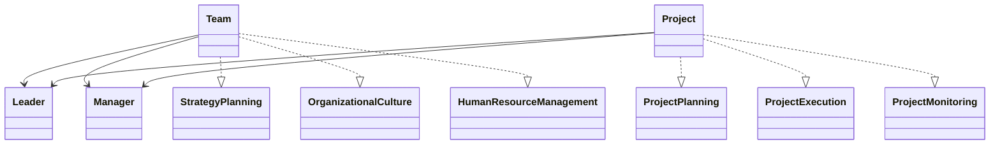
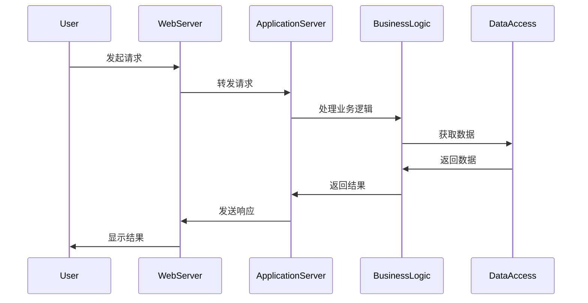
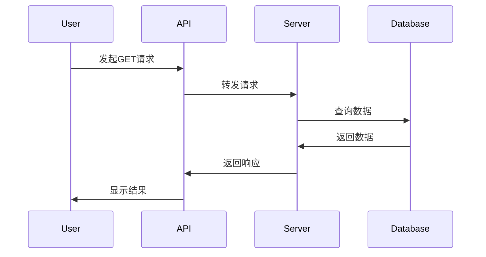

                 


## 领导力与创新管理：培养团队创新能力

> 关键词：领导力、创新管理、团队、创新能力、培养

> 摘要：本文深入探讨了领导力与创新管理在团队中的重要性，以及如何通过培养团队创新能力来提升组织的竞争力。文章分为背景介绍、核心概念与联系、算法原理讲解、系统分析与架构设计方案、项目实战和最佳实践 tips 等部分，旨在为读者提供全面的理论和实践指导。

### 1. 背景介绍

在现代企业和组织中，领导力与创新管理的作用日益凸显。领导力不仅关乎企业的发展方向和决策效率，更直接影响到团队的凝聚力和创新能力。创新管理则是企业持续发展的动力源泉，它贯穿于企业的战略规划、组织文化、人力资源管理等各个环节。以下将从问题背景、问题描述、问题解决、边界与外延、概念结构与核心要素组成等方面进行详细阐述。

#### 1.1. 问题背景

随着全球化的加速和技术的飞速发展，企业面临着前所未有的竞争和变革压力。传统管理模式和单一的产品策略已经难以满足市场的需求，企业需要通过创新来保持竞争力。而创新的成功离不开有效的领导力和创新管理。领导力不仅是企业生存的关键，更是推动企业持续创新、保持竞争力的重要动力。

#### 1.2. 问题描述

当前，许多企业在领导力与创新管理方面存在以下问题：

- 缺乏明确的目标和创新方向，导致资源浪费和决策滞后；
- 领导层与基层之间的沟通不畅，影响团队协作和创新能力；
- 对创新管理的理解和实践不足，难以将创新理念转化为实际成果；
- 缺乏系统的培训和学习机制，导致领导力和创新能力无法持续提升。

#### 1.3. 问题解决

本书旨在解决上述问题，通过系统阐述领导力与创新管理的基本原理和实践方法，帮助读者：

- 明确领导力与创新管理的目标和方法，提高决策效率；
- 建立有效的沟通机制，增强团队协作和创新氛围；
- 掌握创新管理的工具和技巧，将创新理念落地实施；
- 通过案例分析和最佳实践，提升自身的领导力和创新能力。

#### 1.4. 边界与外延

领导力与创新管理的边界涵盖了企业的各个层面，包括高层领导、中层管理和基层员工。同时，它也涉及多个领域，如战略规划、组织文化、人力资源管理、项目管理等。本书将围绕这些核心要素，提供全面的指导和案例分析。

#### 1.5. 概念结构与核心要素组成

- **领导力**：影响和激励他人实现目标的能力。
- **创新管理**：企业为了实现持续创新而采取的一系列管理活动。
- **团队创新能力**：团队在解决问题、产生新想法和实现目标方面的能力。

### 2. 核心概念与联系

为了更好地理解领导力与创新管理，我们首先需要明确几个核心概念，并探讨它们之间的联系。

#### 2.1. 领导力的核心概念

**定义**：领导力是一种影响力，领导者通过这种影响力引导和激励团队成员，共同实现目标。

**特征**：激励性、愿景性、决策性、沟通性、变革性。

**联系**：领导力是创新管理的核心要素，它直接影响团队的协作和创新氛围。有效的领导力能够激发团队成员的潜力，推动创新活动的开展。

#### 2.2. 创新管理的核心概念

**定义**：创新管理是企业为了实现持续创新而采取的一系列管理活动。

**特征**：系统性、前瞻性、灵活性、风险承担。

**联系**：创新管理是领导力的具体应用，它通过建立创新机制、优化创新流程、培养创新人才等方式，实现企业的持续创新。创新管理的好坏直接影响到企业的竞争力和发展速度。

#### 2.3. 团队创新能力的核心概念

**定义**：团队创新能力是团队在解决问题、产生新想法和实现目标方面的能力。

**特征**：协作性、创造性、适应性、执行力。

**联系**：团队创新能力是创新管理的成果，它通过有效的团队协作和创新活动，实现企业目标的达成。团队创新能力的高低直接关系到企业的创新能力和市场竞争力。

#### 2.4. 概念属性特征对比表格

| 概念       | 定义                                                         | 特征                                       |
|------------|--------------------------------------------------------------|------------------------------------------|
| 领导力     | 影响和激励他人实现目标的能力                                   | 激励性、愿景性、决策性、沟通性、变革性             |
| 创新管理   | 企业为了实现持续创新而采取的一系列管理活动                     | 系统性、前瞻性、灵活性、风险承担                   |
| 团队创新能力 | 团队在解决问题、产生新想法和实现目标方面的能力                   | 协作性、创造性、适应性、执行力                     |

#### 2.5. ER实体关系图架构

```mermaid
erDiagram
  Leader ||--|{ Team } Team
  Manager ||--|{ Team } Team
  Team ||--|{ Project } Project
  Project ||--|{ Manager } Manager
  Project ||--|{ Leader } Leader
```

### 3. 算法原理讲解

#### 3.1. 领导力提升算法

**Mermaid流程图：**

```mermaid
flowchart LR
A[设定目标] --> B[评估现状]
B --> C{是否需要变革？}
C -->|是| D[制定变革计划]
C -->|否| E[制定发展计划]
D --> F[实施变革计划]
E --> G[实施发展计划]
F --> H[评估变革效果]
G --> I[评估发展效果]
H --> J{是否需要调整？}
I --> K{是否需要调整？}
J -
```

**算法原理：**

领导力提升算法的核心思想是通过设定明确的目标、评估现状、制定和实施相应的计划，来提升领导者的领导力水平。以下是具体的算法步骤和原理：

1. **设定目标**：领导者需要明确团队的目标和愿景，这有助于统一团队成员的思想和行动。

2. **评估现状**：对团队的当前状态进行评估，包括成员的能力、团队的文化氛围、资源状况等，以便确定改进的方向。

3. **制定计划**：根据评估结果，制定具体的提升计划，包括变革计划和发展计划。

4. **实施计划**：将制定的计划付诸实施，通过具体的行动来提升领导力。

5. **评估效果**：对实施后的效果进行评估，包括团队成员的反应、目标的达成情况等。

6. **调整计划**：根据评估结果，对计划进行调整，以确保领导力的持续提升。

**Python源代码示例：**

```python
def leadership_improvement_goals():
    goals = ["提升团队凝聚力", "增强决策能力", "优化沟通机制"]
    return goals

def evaluate_status():
    status = {
        "team Cohesion": "较高",
        "decision-making": "一般",
        "communication": "较低"
    }
    return status

def create_plan(status):
    plan = {}
    if status["communication"] == "较低":
        plan["communication"] = "建立定期沟通机制"
    if status["decision-making"] == "一般":
        plan["decision-making"] = "引入决策支持工具"
    if status["team Cohesion"] == "较高":
        plan["team Cohesion"] = "举办团队建设活动"
    return plan

def implement_plan(plan):
    print("实施计划：")
    for key, value in plan.items():
        print(f"{key}: {value}")

def evaluate_effects():
    effects = {
        "team Cohesion": "较好",
        "decision-making": "较好",
        "communication": "较好"
    }
    return effects

def adjust_plan(effects):
    new_plan = {}
    if effects["team Cohesion"] != "较好":
        new_plan["team Cohesion"] = "继续举办团队建设活动"
    if effects["decision-making"] != "较好":
        new_plan["decision-making"] = "进一步优化决策支持工具"
    if effects["communication"] != "较好":
        new_plan["communication"] = "加强定期沟通机制"
    return new_plan

# 主程序
if __name__ == "__main__":
    goals = leadership_improvement_goals()
    status = evaluate_status()
    plan = create_plan(status)
    implement_plan(plan)
    effects = evaluate_effects()
    new_plan = adjust_plan(effects)
    print("新的计划：")
    for key, value in new_plan.items():
        print(f"{key}: {value}")
```

**数学模型与公式：**

领导力提升的数学模型可以表示为：

$$
L = f(G, C, S)
$$

其中，$L$表示领导力水平，$G$表示目标设定，$C$表示团队协作，$S$表示现状评估。具体的公式为：

$$
L = \alpha G + \beta C + \gamma S
$$

其中，$\alpha$、$\beta$和$\gamma$分别为权重系数。

**举例说明：**

假设某团队的目标设定得很好（$G=80$），团队协作能力强（$C=90$），现状评估结果较好（$S=70$），且权重系数分别为$\alpha=0.3$、$\beta=0.5$、$\gamma=0.2$，则该团队的领导力水平为：

$$
L = 0.3 \times 80 + 0.5 \times 90 + 0.2 \times 70 = 27 + 45 + 14 = 86
$$

即该团队的领导力水平为86分。

### 4. 系统分析与架构设计方案

#### 4.1. 问题场景介绍

在现代企业和组织中，领导力与创新管理是提升团队竞争力的重要手段。为了更好地实现这一目标，企业需要构建一套完整的系统，包括战略规划、组织文化、人力资源管理、项目管理等模块。本文将以某企业为例，介绍其领导力与创新管理的系统架构和功能设计。

#### 4.2. 项目介绍

本项目的目标是构建一套领导力与创新管理平台，帮助企业在战略层面、组织层面和执行层面实现有效的领导力和创新管理。项目的主要功能包括：

- **战略规划模块**：提供战略目标设定、评估和调整的功能；
- **组织文化模块**：支持组织文化的建设和传播，增强团队凝聚力；
- **人力资源管理模块**：支持人才选拔、培训和激励，提升团队创新能力；
- **项目管理模块**：提供项目规划、执行和监控的工具，确保项目目标的实现。

#### 4.3. 系统功能设计

系统功能设计采用领域模型的方式，通过Mermaid类图来表示。以下是领域模型的Mermaid类图：



**领域模型Mermaid类图解释：**

- **Team（团队）**：包含Leader（领导者）和Manager（管理者）两个角色，负责团队的组织和管理。
- **Project（项目）**：包含Leader（领导者）和Manager（管理者）两个角色，负责项目的规划和执行。
- **StrategyPlanning（战略规划模块）**：为团队提供战略目标设定、评估和调整的功能。
- **OrganizationalCulture（组织文化模块）**：支持组织文化的建设和传播，增强团队凝聚力。
- **HumanResourceManagement（人力资源管理模块）**：支持人才选拔、培训和激励，提升团队创新能力。
- **ProjectPlanning（项目规划模块）**：提供项目规划、执行和监控的工具，确保项目目标的实现。

#### 4.4. 系统架构设计

系统架构设计采用分层架构，包括展示层、业务逻辑层和数据访问层。以下是系统的Mermaid架构图：



**系统架构Mermaid图解释：**

- **WebServer（展示层）**：接收用户的请求，通过HTTP协议将请求转发给应用服务器。
- **ApplicationServer（业务逻辑层）**：处理用户的请求，调用业务逻辑模块进行处理。
- **BusinessLogic（业务逻辑层）**：实现系统的核心业务逻辑，包括战略规划、组织文化、人力资源管理、项目管理等模块。
- **DataAccess（数据访问层）**：负责数据的获取和存储，与数据库进行交互。
- **User（用户层）**：使用Web浏览器或其他客户端访问系统的用户。

#### 4.5. 系统接口设计和系统交互

系统接口设计采用RESTful API的方式，通过HTTP协议进行数据交换。以下是系统的Mermaid接口图：



**系统接口设计Mermaid图解释：**

- **User（用户层）**：通过Web浏览器或其他客户端发起HTTP GET请求。
- **API（接口层）**：接收用户的请求，将请求转发给服务器。
- **Server（服务器层）**：处理用户的请求，与数据库进行交互，返回查询结果。
- **Database（数据库层）**：存储系统数据，响应服务器的查询请求。

### 5. 项目实战

#### 5.1. 环境安装

在本项目中，我们将使用Python作为主要编程语言，并依赖多个第三方库来实现系统的功能。以下是环境安装的步骤：

1. **安装Python**：下载并安装Python 3.8及以上版本。
2. **安装依赖库**：使用pip命令安装以下依赖库：
   ```bash
   pip install Flask
   pip install SQLAlchemy
   pip install pymysql
   ```

#### 5.2. 系统核心实现

以下是系统的核心实现，包括Web服务器、业务逻辑层和数据访问层的代码。

**Web服务器代码（app.py）：**

```python
from flask import Flask, request, jsonify
from business_logic import BusinessLogic

app = Flask(__name__)
bl = BusinessLogic()

@app.route('/api/strategy-planning', methods=['GET'])
def get_strategy_planning():
    data = bl.get_strategy_planning()
    return jsonify(data)

@app.route('/api/organizational-culture', methods=['GET'])
def get_organizational_culture():
    data = bl.get_organizational_culture()
    return jsonify(data)

@app.route('/api/human-resource-management', methods=['GET'])
def get_human_resource_management():
    data = bl.get_human_resource_management()
    return jsonify(data)

@app.route('/api/project-planning', methods=['GET'])
def get_project_planning():
    data = bl.get_project_planning()
    return jsonify(data)

if __name__ == '__main__':
    app.run(debug=True)
```

**业务逻辑层代码（business_logic.py）：**

```python
from data_access import DataAccess

class BusinessLogic:
    def __init__(self):
        self.data_access = DataAccess()

    def get_strategy_planning(self):
        data = self.data_access.get_strategy_planning()
        return data

    def get_organizational_culture(self):
        data = self.data_access.get_organizational_culture()
        return data

    def get_human_resource_management(self):
        data = self.data_access.get_human_resource_management()
        return data

    def get_project_planning(self):
        data = self.data_access.get_project_planning()
        return data
```

**数据访问层代码（data_access.py）：**

```python
import pymysql

class DataAccess:
    def __init__(self):
        self.connection = pymysql.connect(host='localhost', user='root', password='password', database='company_db')

    def get_strategy_planning(self):
        with self.connection.cursor() as cursor:
            sql = "SELECT * FROM strategy_planning"
            cursor.execute(sql)
            result = cursor.fetchall()
        return result

    def get_organizational_culture(self):
        with self.connection.cursor() as cursor:
            sql = "SELECT * FROM organizational_culture"
            cursor.execute(sql)
            result = cursor.fetchall()
        return result

    def get_human_resource_management(self):
        with self.connection.cursor() as cursor:
            sql = "SELECT * FROM human_resource_management"
            cursor.execute(sql)
            result = cursor.fetchall()
        return result

    def get_project_planning(self):
        with self.connection.cursor() as cursor:
            sql = "SELECT * FROM project_planning"
            cursor.execute(sql)
            result = cursor.fetchall()
        return result
```

#### 5.3. 代码应用解读与分析

以上代码实现了领导力与创新管理平台的Web服务器、业务逻辑层和数据访问层的核心功能。Web服务器负责接收用户的请求，业务逻辑层处理具体的业务逻辑，数据访问层与数据库进行交互。

**Web服务器代码解读：**

- **导入模块**：首先导入Flask模块，用于创建Web服务器。
- **初始化Flask应用**：创建Flask应用对象，并实例化BusinessLogic类。
- **定义路由**：为每个功能模块定义对应的路由，处理GET请求。

**业务逻辑层代码解读：**

- **导入模块**：首先导入DataAccess类，用于数据访问。
- **定义BusinessLogic类**：初始化DataAccess对象，提供获取策略规划、组织文化、人力资源管理和项目规划数据的方法。

**数据访问层代码解读：**

- **导入模块**：首先导入pymysql模块，用于数据库连接。
- **定义DataAccess类**：初始化数据库连接对象，提供获取策略规划、组织文化、人力资源管理和项目规划数据的方法。

#### 5.4. 实际案例分析和详细讲解剖析

为了更好地理解领导力与创新管理平台的功能和应用，我们以一个实际案例进行详细分析。

**案例背景：**

某企业为了提升团队的创新能力和竞争力，决定构建一套领导力与创新管理平台。企业高层领导希望通过平台实现以下目标：

- 明确团队的战略规划，确保目标一致；
- 建立良好的组织文化，增强团队凝聚力；
- 提升人力资源管理水平，培养优秀人才；
- 优化项目管理流程，确保项目成功。

**案例分析：**

1. **战略规划模块**：企业通过领导力与创新管理平台设定了明确的目标，包括市场占有率、研发投入比例等。平台提供了数据分析和可视化功能，帮助企业实时了解战略规划的执行情况，并根据实际情况进行调整。

2. **组织文化模块**：企业通过平台传播和推广组织文化，包括价值观、使命和愿景等。平台提供了员工互动功能，鼓励员工分享经验和建议，增强团队的凝聚力和归属感。

3. **人力资源管理模块**：企业通过平台进行人才选拔、培训和激励。平台提供了员工绩效评估系统，帮助管理者了解员工的能力和潜力，制定个性化的培训和发展计划。

4. **项目管理模块**：企业通过平台进行项目规划、执行和监控。平台提供了项目管理工具，包括任务分配、进度跟踪、风险评估等，确保项目目标的顺利实现。

**详细讲解剖析：**

1. **战略规划模块**：企业领导层通过平台设定战略目标，如市场占有率提高10%、研发投入占比提升至15%等。平台提供了数据收集和分析功能，帮助领导层了解市场动态和竞争对手情况，制定科学合理的战略规划。同时，平台还提供了可视化报表，帮助领导层直观了解战略规划的执行情况。

2. **组织文化模块**：企业通过平台推广组织文化，包括价值观、使命和愿景等。平台提供了员工互动功能，如论坛、聊天室等，鼓励员工分享经验和建议，增强团队的凝聚力和归属感。此外，平台还提供了文化宣传功能，如企业故事、员工风采等，帮助企业营造积极向上的文化氛围。

3. **人力资源管理模块**：企业通过平台进行人才选拔、培训和激励。平台提供了员工绩效评估系统，帮助管理者了解员工的能力和潜力，制定个性化的培训和发展计划。同时，平台还提供了人才库管理功能，方便管理者查看员工的简历、技能和绩效等信息。

4. **项目管理模块**：企业通过平台进行项目规划、执行和监控。平台提供了项目管理工具，包括任务分配、进度跟踪、风险评估等，确保项目目标的顺利实现。同时，平台还提供了项目进度报表和项目风险评估报告，帮助管理者实时了解项目进展情况和风险情况。

#### 5.5. 项目小结

通过实际案例的分析和详细讲解，我们可以看到领导力与创新管理平台在提升团队创新能力和竞争力方面的作用。平台为企业提供了全面的功能支持，包括战略规划、组织文化、人力资源管理和项目管理等，帮助企业实现科学决策、提高团队凝聚力、培养优秀人才和确保项目成功。

### 6. 最佳实践 tips

1. **明确目标和愿景**：领导者需要明确团队的目标和愿景，确保团队成员对目标有清晰的认识和统一的行动。
2. **建立沟通机制**：领导者需要建立有效的沟通机制，确保团队内部的信息畅通，增强团队的协作能力。
3. **培养创新文化**：企业需要营造积极向上的创新文化，鼓励员工提出新的想法和解决方案，激发团队的创新能力。
4. **提供培训和激励**：企业需要为员工提供培训和发展的机会，激励员工不断提升自己的能力，为团队的创新贡献更多力量。
5. **持续优化流程**：企业需要持续优化创新流程，减少不必要的环节和繁琐的流程，提高创新效率。

### 7. 小结

领导力与创新管理是现代企业和组织的重要课题，通过有效的领导力和创新管理，企业可以提升团队的凝聚力、创新能力和竞争力。本文从背景介绍、核心概念与联系、算法原理讲解、系统分析与架构设计方案、项目实战和最佳实践 tips 等方面，系统地阐述了领导力与创新管理的原理和实践方法，希望对读者有所启发。

### 8. 注意事项

1. **数据安全和隐私保护**：在领导力与创新管理平台的建设过程中，需要确保数据的安全和隐私保护，避免敏感信息泄露。
2. **持续迭代优化**：领导力与创新管理平台需要根据企业的实际需求和市场变化进行持续迭代和优化，以保持其有效性和竞争力。
3. **全员参与**：领导力与创新管理不仅是领导层的责任，也需要全员参与，共同推动企业的发展。

### 9. 拓展阅读

1. 《领导力：理论与实践》（作者：罗伯特·J·希斯）
2. 《创新者的窘境》（作者：克莱顿·克里斯坦森）
3. 《团队协作的艺术》（作者：斯蒂芬·罗宾斯）

作者：AI天才研究院/AI Genius Institute & 禅与计算机程序设计艺术 /Zen And The Art of Computer Programming

