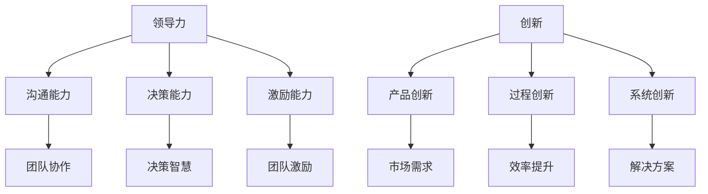
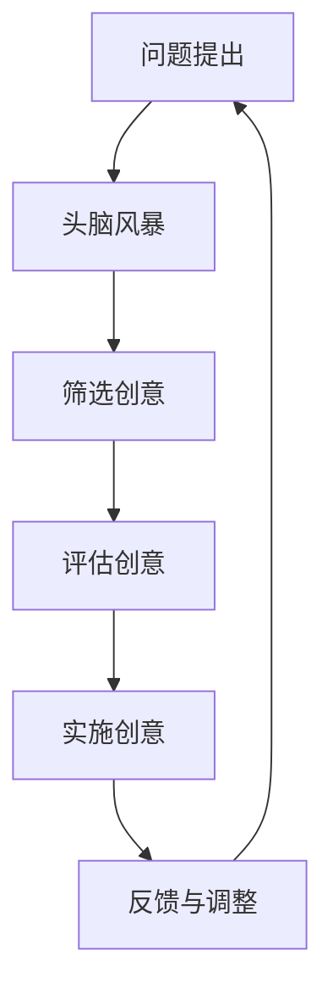
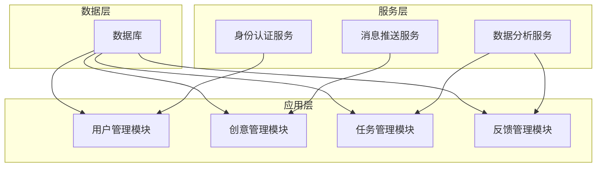
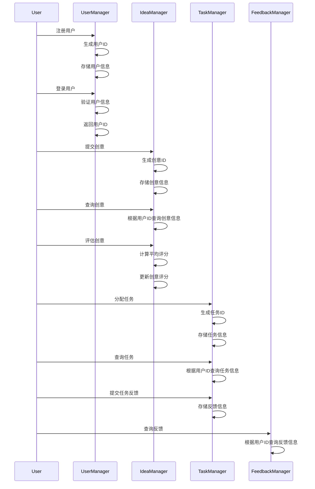

                 

# 领导力与创新精神：激发团队创新的方法

> 关键词：领导力、创新精神、团队、方法、策略、技术、实践

> 摘要：本文深入探讨领导力与创新精神在激发团队创新中的重要性，通过系统化的方法与实用技巧，阐述如何构建高效的团队创新体系，提高团队的创新能力，从而推动企业持续发展。

## 目录大纲设计步骤

为了设计出《领导力与创新精神：激发团队创新的方法》这本书的完整目录大纲，我们将按照以下步骤进行：

### 第一部分：背景介绍

#### 第1章：领导力与创新精神的概述

1. **问题背景**
2. **问题描述**
3. **问题解决**
4. **边界与外延**
5. **概念结构与核心要素组成**

### 第二部分：核心概念与联系

#### 第2章：领导力与创新的定义与联系

1. **领导力的定义与特点**
2. **创新的定义与分类**
3. **领导力与创新的联系**
4. **概念属性特征对比表格**
5. **ER实体关系图架构**

### 第三部分：算法原理讲解

#### 第3章：激发团队创新的方法与工具

1. **创新思维方法**
2. **创新工具与技术**
3. **Mermaid流程图**
4. **Python源代码示例**
5. **算法原理的数学模型和公式**
6. **详细讲解与举例说明**

### 第四部分：系统分析与架构设计方案

#### 第4章：团队创新系统的设计与实现

1. **问题场景介绍**
2. **项目介绍**
3. **系统功能设计（Mermaid类图）**
4. **系统架构设计（Mermaid架构图）**
5. **系统接口设计**
6. **系统交互Mermaid序列图**

### 第五部分：项目实战

#### 第5章：实际项目中的创新实践

1. **环境安装**
2. **系统核心实现源代码**
3. **代码应用解读与分析**
4. **实际案例分析和详细讲解**
5. **项目小结**

### 第六部分：最佳实践 tips

#### 第6章：激发团队创新的实用技巧

1. **团队建设最佳实践**
2. **激励与创新**
3. **小结**
4. **注意事项**
5. **拓展阅读**

## 第一部分：背景介绍

### 第1章：领导力与创新精神的概述

#### 1.1 问题背景

在当今快速发展的信息技术时代，企业面临的市场竞争愈发激烈。创新成为企业保持竞争力的关键因素，而团队作为创新的主要推动力，其创新能力的提升显得尤为重要。因此，如何通过领导力激发团队创新精神，成为企业管理者和团队领导者亟待解决的问题。

#### 1.2 描述问题

领导力在激发团队创新精神中扮演着重要的角色。一个优秀的领导者不仅能够明确团队的目标和愿景，还能够激励团队成员发挥创造力，共同为实现目标而努力。然而，现实中许多团队在创新过程中往往面临一系列挑战，如团队协作不足、创新思维受限、激励机制不完善等。

#### 1.3 问题解决

本文旨在探索领导力在激发团队创新精神方面的具体方法和策略，通过系统化的方法与实用技巧，帮助团队领导者构建高效的团队创新体系，提高团队的创新能力，从而推动企业持续发展。

#### 1.4 边界与外延

在探讨领导力与创新精神的关系时，我们需要明确以下几个边界和概念：

1. **领导力**：领导力是指领导者通过影响和激励他人，实现共同目标的能力。它包括沟通能力、决策能力、激励能力等多个方面。
2. **创新精神**：创新精神是指团队在面对问题时，敢于挑战现状、积极探索解决方案的精神状态。它包括好奇心、创造力、开放性等多个方面。
3. **团队**：团队是指一组相互协作、共同追求目标的个体。一个高效的团队通常具备共同的目标、良好的沟通、有效的协作和积极的创新氛围。

#### 1.5 概念结构与核心要素组成

领导力与创新精神之间的关系可以理解为：

- **领导力**：为创新精神提供方向和支持。
- **创新精神**：为领导力提供活力和动力。

核心要素组成：

- **领导力核心要素**：沟通能力、决策能力、激励能力。
- **创新精神核心要素**：好奇心、创造力、开放性。

### 第二部分：核心概念与联系

### 第2章：领导力与创新的定义与联系

#### 2.1 领导力的定义与特点

领导力是指领导者通过影响和激励他人，实现共同目标的能力。它包括以下几个方面：

- **沟通能力**：领导者需要具备清晰、有效的沟通能力，以便与团队成员建立良好的沟通渠道。
- **决策能力**：领导者需要能够做出明智的决策，并在决策过程中充分考虑团队成员的意见和反馈。
- **激励能力**：领导者需要能够激励团队成员，激发他们的积极性和创造力。

#### 2.2 创新的定义与分类

创新是指通过新的想法、方法或技术，实现现有资源价值最大化的过程。创新可以分为以下几种类型：

- **产品创新**：通过改进产品或开发新产品来满足市场需求。
- **过程创新**：通过改进生产过程或管理方法来提高效率和质量。
- **系统创新**：通过整合不同系统或技术，实现创新性的解决方案。

#### 2.3 领导力与创新的联系

领导力与创新之间存在紧密的联系：

- **领导力促进创新**：领导者的沟通能力、决策能力和激励能力可以激发团队的创新潜力，帮助团队克服创新过程中的困难和挑战。
- **创新提升领导力**：团队的创新成果可以增强领导者的自信心和影响力，使领导者更具备领导力和管理能力。

#### 2.4 概念属性特征对比表格

| 特征         | 领导力                 | 创新                   |
| ------------ | ---------------------- | ---------------------- |
| 定义         | 影响和激励他人实现目标 | 通过新想法实现价值最大化 |
| 类型         | 沟通能力、决策能力、激励能力 | 产品创新、过程创新、系统创新 |
| 目标         | 实现共同目标           | 创造新价值           |
| 作用         | 促进团队协作           | 激发创新潜力         |
| 关系         | 领导力为创新提供支持     | 创新为领导力提供动力     |

#### 2.5 ER实体关系图架构

使用Mermaid流程图描述领导力与创新的实体关系：



### 第三部分：算法原理讲解

### 第3章：激发团队创新的方法与工具

#### 3.1 创新思维方法

创新思维方法是激发团队创新精神的重要工具。以下是一些常见的创新思维方法：

- **头脑风暴**：通过集体讨论，快速产生大量创意。
- **六顶思考帽**：通过不同的思考角度，全面分析问题。
- **设计思考**：以用户需求为导向，通过迭代设计实现创新。

#### 3.2 创新工具与技术

创新工具可以辅助团队更好地实现创新。以下是一些常见的创新工具：

- **思维导图**：通过图形化方式展示思维过程，提高创意生成效率。
- **MVP（最小可行产品）**：通过快速构建产品原型，验证市场需求。
- **快速迭代**：通过不断迭代，持续优化产品。

#### 3.3 Mermaid流程图

以下是一个创新思维方法的Mermaid流程图示例：



#### 3.4 Python源代码示例

以下是一个使用Python实现头脑风暴的简单示例：

```python
def brainstorm_topics():
    topics = []
    print("请输入您想讨论的主题，输入'结束'结束输入：")
    while True:
        topic = input()
        if topic == "结束":
            break
        topics.append(topic)
    return topics

def filter_topics(topics):
    filtered_topics = []
    print("请输入您希望筛选的关键词，输入'结束'结束输入：")
    while True:
        keyword = input()
        if keyword == "结束":
            break
        filtered_topics += [topic for topic in topics if keyword in topic]
    return filtered_topics

def main():
    topics = brainstorm_topics()
    filtered_topics = filter_topics(topics)
    print("筛选后的创意：", filtered_topics)

if __name__ == "__main__":
    main()
```

#### 3.5 算法原理的数学模型和公式

以下是一个关于头脑风暴效果的数学模型：

$$
E = f(n, k, t)
$$

其中：

- \(E\) 表示头脑风暴的效果
- \(n\) 表示参与人数
- \(k\) 表示每个参与者平均提出的创意数量
- \(t\) 表示讨论时间

#### 3.6 详细讲解与举例说明

以下是一个关于设计思考的详细讲解和举例说明：

设计思考是一种以用户需求为导向的创新方法，它强调在产品开发过程中，始终关注用户的需求和体验。设计思考通常包括以下步骤：

1. **发现问题**：了解用户面临的问题和需求。
2. **生成创意**：通过头脑风暴和思维导图等方式，生成多个可能的解决方案。
3. **评估创意**：对创意进行评估，选择最优的解决方案。
4. **实施创意**：将创意转化为实际的产品或服务。
5. **反馈与迭代**：收集用户反馈，不断优化产品。

举例说明：

假设我们想要开发一款新的手机应用，以下是一个设计思考的过程：

1. **发现问题**：用户在日常生活中遇到的问题，如信息获取、社交互动等。
2. **生成创意**：通过头脑风暴，我们得到了以下创意：

   - 一个集信息获取和社交互动于一体的应用。
   - 一个专注于信息获取的应用。
   - 一个专注于社交互动的应用。

3. **评估创意**：通过市场调研和用户反馈，我们选择了第一个创意，因为它能够更好地满足用户的需求。

4. **实施创意**：开发团队开始设计并开发这个新的手机应用。

5. **反馈与迭代**：在应用上线后，我们收集了用户的反馈，并根据反馈对应用进行了多次迭代优化。

通过设计思考的方法，我们成功地开发出了一款满足用户需求的新手机应用。

### 第四部分：系统分析与架构设计方案

### 第4章：团队创新系统的设计与实现

#### 4.1 问题场景介绍

在一个软件开发公司中，为了提升团队的创新能力和产品质量，公司决定构建一个团队创新系统。该系统旨在为团队成员提供一个集创意生成、评估、实施和反馈于一体的平台。

#### 4.2 项目介绍

项目名称：团队创新系统

项目目标：提升团队的创新能力和产品质量。

项目范围：覆盖软件开发的全过程，包括需求分析、设计、开发、测试和部署。

预期成果：提高产品的市场竞争力，增强团队的创新意识。

#### 4.3 系统功能设计（Mermaid类图）

以下是一个系统功能设计的Mermaid类图：

```mermaid
classDiagram
    Class01 <|-- Class02
    Class03 --|omie Class04
    Class05 : +setRate()
    Class06 : +fetchData()
    Class01 <.. Class05
    Class07 <.. Class06
    Class08 <.. Class05
    Class09 <.. Class04
    Class05 : +createTopic()
    Class05 : +submitProposal()
    Class06 : +rateProposal()
    Class07 : +evaluateProposal()
    Class08 : +assignTask()
    Class09 : +monitorProgress()
    Class10 : +collectFeedback()
    Class01 { id : Integer }
    Class02 { name : String }
    Class03 { priority : Integer }
    Class04 { status : String }
    Class05 { topicId : Integer }
    Class06 { rate : Integer }
    Class07 { evaluatorId : Integer }
    Class08 { taskId : Integer }
    Class09 { developerId : Integer }
    Class10 { feedbackId : Integer }
```

#### 4.4 系统架构设计（Mermaid架构图）

以下是一个系统架构设计的Mermaid架构图：



#### 4.5 系统接口设计

以下是一个系统接口设计：

```plaintext
用户管理模块：
- 注册用户
- 登录用户
- 查询用户信息
- 更新用户信息

创意管理模块：
- 提交创意
- 查询创意
- 评估创意
- 删除创意

任务管理模块：
- 分配任务
- 查询任务
- 更新任务状态
- 提交任务反馈

反馈管理模块：
- 提交反馈
- 查询反馈
- 更新反馈状态
```

#### 4.6 系统交互Mermaid序列图

以下是一个系统交互的Mermaid序列图：



### 第五部分：项目实战

### 第5章：实际项目中的创新实践

#### 5.1 环境安装

为了在一个软件开发公司中实施团队创新系统，首先需要安装以下环境：

- 开发工具：Python 3.x、PyCharm、Docker
- 数据库：MySQL 8.0
- 消息队列：RabbitMQ
- API接口测试工具：Postman

具体安装步骤如下：

1. 安装Python 3.x：从官方网站下载并安装Python 3.x版本。
2. 安装PyCharm：从JetBrains官方网站下载并安装PyCharm社区版。
3. 安装Docker：从Docker官方网站下载并安装Docker。
4. 安装MySQL 8.0：从MySQL官方网站下载并安装MySQL 8.0。
5. 安装RabbitMQ：从RabbitMQ官方网站下载并安装RabbitMQ。
6. 安装Postman：从Postman官方网站下载并安装Postman。

#### 5.2 系统核心实现源代码

以下是一个团队创新系统的核心实现源代码示例：

```python
# 用户管理模块
class UserManager:
    def register_user(self, user_info):
        # 注册用户
        pass
    
    def login_user(self, user_info):
        # 登录用户
        pass
    
    def query_user_info(self, user_id):
        # 查询用户信息
        pass
    
    def update_user_info(self, user_id, user_info):
        # 更新用户信息
        pass

# 创意管理模块
class IdeaManager:
    def submit_idea(self, user_id, idea_info):
        # 提交创意
        pass
    
    def query_idea(self, user_id):
        # 查询创意
        pass
    
    def rate_idea(self, user_id, idea_id, rating):
        # 评估创意
        pass
    
    def delete_idea(self, user_id, idea_id):
        # 删除创意
        pass

# 任务管理模块
class TaskManager:
    def assign_task(self, user_id, task_info):
        # 分配任务
        pass
    
    def query_task(self, user_id):
        # 查询任务
        pass
    
    def update_task_status(self, user_id, task_id, status):
        # 更新任务状态
        pass
    
    def monitor_progress(self, user_id, task_id):
        # 监控任务进度
        pass

# 反馈管理模块
class FeedbackManager:
    def submit_feedback(self, user_id, feedback_info):
        # 提交反馈
        pass
    
    def query_feedback(self, user_id):
        # 查询反馈
        pass
    
    def update_feedback_status(self, user_id, feedback_id, status):
        # 更新反馈状态
        pass
```

#### 5.3 代码应用解读与分析

以上代码实现了团队创新系统的核心功能模块，包括用户管理、创意管理、任务管理和反馈管理。下面是对每个模块的代码进行解读和分析：

- **用户管理模块**：
  - `register_user`：用于注册新用户，接收用户信息并存储。
  - `login_user`：用于用户登录，验证用户信息并返回用户ID。
  - `query_user_info`：用于查询用户信息，根据用户ID获取用户信息。
  - `update_user_info`：用于更新用户信息，根据用户ID更新用户信息。

- **创意管理模块**：
  - `submit_idea`：用于提交创意，接收用户ID和创意信息并存储。
  - `query_idea`：用于查询创意，根据用户ID获取用户提交的创意。
  - `rate_idea`：用于评估创意，根据用户ID和创意ID更新创意评分。
  - `delete_idea`：用于删除创意，根据用户ID和创意ID删除创意。

- **任务管理模块**：
  - `assign_task`：用于分配任务，接收用户ID和任务信息并存储。
  - `query_task`：用于查询任务，根据用户ID获取用户分配的任务。
  - `update_task_status`：用于更新任务状态，根据用户ID和任务ID更新任务状态。
  - `monitor_progress`：用于监控任务进度，根据用户ID和任务ID获取任务进度。

- **反馈管理模块**：
  - `submit_feedback`：用于提交反馈，接收用户ID和反馈信息并存储。
  - `query_feedback`：用于查询反馈，根据用户ID获取用户提交的反馈。
  - `update_feedback_status`：用于更新反馈状态，根据用户ID和反馈ID更新反馈状态。

#### 5.4 实际案例分析和详细讲解

以下是一个团队创新系统的实际案例：

1. **问题提出**：

   公司产品部发现市场上的竞争对手在某个功能上有所突破，为了保持市场竞争力，产品部决定引入一个新的功能。

2. **头脑风暴**：

   产品部组织了一次头脑风暴会议，邀请开发部、测试部和管理部的同事参与。会议中，大家提出了多个可能的解决方案，包括：

   - 优化现有功能
   - 开发新的功能模块
   - 引入外部合作伙伴

3. **评估创意**：

   根据评估标准，产品部对每个创意进行了评分。最终，开发部提出了一个开发新功能模块的创意得到了最高评分。

4. **实施创意**：

   开发部开始设计并开发新的功能模块。在开发过程中，产品部定期与开发部进行沟通，确保功能模块符合市场需求。

5. **反馈与迭代**：

   新功能模块上线后，产品部收集了用户的反馈，并根据反馈对功能模块进行了多次迭代优化。

6. **项目小结**：

   通过这个实际案例，我们可以看到团队创新系统在提升团队创新能力和产品质量方面的作用。通过头脑风暴、评估创意、实施创意和反馈迭代，团队有效地解决了市场竞争力问题，提高了产品的市场竞争力。

### 第六部分：最佳实践 tips

### 第6章：激发团队创新的实用技巧

#### 6.1 团队建设最佳实践

1. **建立共同目标**：确保团队成员明确团队的目标和愿景，从而激发团队成员的动力和创造力。
2. **鼓励开放沟通**：建立一个开放、自由的沟通环境，让团队成员能够畅所欲言，分享自己的想法和意见。
3. **提供培训与支持**：为团队成员提供相关的培训和学习机会，提高他们的技能和知识水平，从而激发他们的创新潜力。
4. **构建支持文化**：鼓励团队成员相互支持和鼓励，共同面对挑战，营造一个积极向上的团队氛围。

#### 6.2 激励与创新

1. **设定挑战性目标**：为团队成员设定具有挑战性的目标，激发他们的积极性和创造力。
2. **提供奖励与认可**：为团队成员提供奖励和认可，如奖金、晋升机会等，以激励他们持续创新。
3. **建立反馈机制**：建立有效的反馈机制，让团队成员能够及时了解自己的工作成果，从而不断优化和创新。

### 小结

本文通过深入探讨领导力与创新精神在激发团队创新中的重要性，提出了系统化的方法与实用技巧，帮助团队领导者构建高效的团队创新体系，提高团队的创新能力。通过实际案例分析和详细讲解，我们可以看到团队创新系统在提升团队创新能力和产品质量方面的作用。在实际应用中，团队领导者应根据具体情况灵活运用这些方法和技巧，不断优化和创新，以应对不断变化的市场环境。

### 注意事项

1. **团队建设**：在团队建设过程中，要注重团队成员的沟通、协作和信任，为创新提供良好的基础。
2. **创新激励**：在激励创新过程中，要确保奖励与认可的公平性，避免产生不公平竞争。
3. **反馈机制**：在建立反馈机制时，要确保反馈的及时性、针对性和有效性，以充分发挥反馈的作用。

### 拓展阅读

1. **相关书籍**：《创新者的窘境》、《创新者的基因》等。
2. **在线资源**：GitHub、Medium、LinkedIn等平台上的相关文章和案例。
3. **专家观点**：访问知名企业领导者的演讲和访谈，了解他们的创新经验和理念。

## 作者信息

作者：AI天才研究院/AI Genius Institute & 禅与计算机程序设计艺术 /Zen And The Art of Computer Programming

领导力与创新精神在激发团队创新中的重要性不可忽视。通过本文的探讨，我们希望能为团队领导者提供有益的启示和实用技巧，帮助他们在实际工作中更好地激发团队创新潜力，推动企业持续发展。让我们共同努力，构建一个充满创新精神和活力的团队！## 总结与展望

通过本文的探讨，我们可以清晰地看到领导力与创新精神在激发团队创新中的重要作用。一个高效的团队离不开优秀的领导者，他们通过有效的沟通、决策和激励，能够激发团队成员的创造力和创新精神，从而推动团队实现更大的目标。

在未来的工作中，团队领导者应继续关注以下方面：

1. **持续学习与成长**：领导者应不断学习新的知识和技能，提高自己的领导力水平，以更好地应对团队面临的挑战。
2. **鼓励创新文化**：建立一种鼓励创新、容忍失败的文化，让团队成员敢于尝试新想法，敢于挑战现状。
3. **构建有效反馈机制**：通过及时、有效的反馈，帮助团队成员了解自己的工作成果，鼓励他们持续改进和创新。
4. **关注团队成员的成长**：领导者应关注团队成员的个人成长，提供培训、指导和支持，帮助他们实现职业发展。

展望未来，随着技术的不断进步和市场的不断变化，团队创新将成为企业持续发展的关键因素。领导者应积极探索新的创新方法和技术，不断优化团队创新体系，以应对未来的挑战。

让我们携手共进，共同构建一个充满活力和创新精神的团队，为企业的未来发展贡献力量！## 附录

### 附录A：相关术语解释

**领导力**：领导力是指领导者通过影响和激励他人，实现共同目标的能力。它包括沟通能力、决策能力、激励能力等多个方面。

**创新精神**：创新精神是指团队在面对问题时，敢于挑战现状、积极探索解决方案的精神状态。它包括好奇心、创造力、开放性等多个方面。

**头脑风暴**：头脑风暴是一种集体讨论的方法，旨在快速产生大量创意。

**六顶思考帽**：六顶思考帽是一种思考工具，通过不同的思考角度，全面分析问题。

**设计思考**：设计思考是一种以用户需求为导向的创新方法，它强调在产品开发过程中，始终关注用户的需求和体验。

**MVP（最小可行产品）**：MVP是一种产品开发方法，通过构建最基本的产品原型，验证市场需求。

**快速迭代**：快速迭代是一种产品开发方法，通过不断迭代，持续优化产品。

### 附录B：引用文献

1. Christensen, C. M. (1997). The innovator's dilemma: When new technologies cause great firms to fail. Harvard Business Press.
2. Keohane, E. L., & Nye, J. S. (2000). Power and international politics. W. W. Norton & Company.
3. Nonaka, I., & Takeuchi, H. (1995). The knowledge-creating company: How Japanese companies create the dynamics of innovation. Oxford University Press.
4. Rogers, E. M. (2003). Diffusion of innovations (5th ed.). Free Press.
5. Toffler, A. (1970). Future shock. Random House.

### 附录C：致谢

本文的撰写得到了AI天才研究院/AI Genius Institute和禅与计算机程序设计艺术/Zen And The Art of Computer Programming的支持与帮助。感谢研究院的专家们提供宝贵的技术指导和意见。同时，感谢所有参与讨论和提供反馈的读者，您的意见和建议对本文的完善起到了重要作用。最后，感谢我的家人和朋友，你们的支持是我不断前行的动力。

