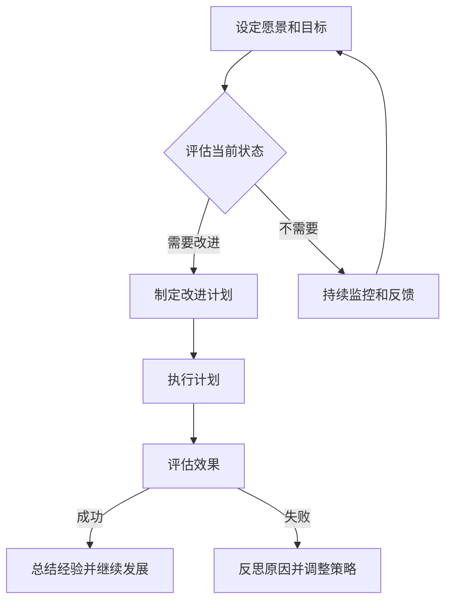

                 

### 引言

在当今快速发展的信息技术时代，领导力与创新成为企业和社会进步的核心驱动力。随着全球化的加剧和科技的迅猛发展，企业面临的竞争环境日益复杂多变。在这个背景下，领导者不仅需要具备传统管理能力，更需要拥有引领变革、推动创新的能力。本文将深入探讨领导力与创新的关系，旨在为读者提供系统、实用的指导，帮助他们在复杂多变的环境中把握机遇，实现组织目标。

本文将按照以下结构展开：

1. **领导力概述**：介绍领导力的核心概念、属性和要素，探讨领导力的不同类型和风格。
2. **创新与变革**：解释创新的定义、类型和驱动因素，分析创新的过程和类型。
3. **领导力与创新的结合**：探讨领导力如何促进创新，创新如何提升领导力，以及实现领导力与创新的策略。
4. **实践案例分析**：通过实际案例展示领导力与创新的成功实践，为读者提供具体的操作指南。
5. **领导力发展**：讨论领导力的培养与发展方法，包括实践经验、培训和教育。
6. **结论与展望**：总结领导力与创新的重要观点，展望未来发展的趋势和方向。

通过本文的阅读，读者将能够全面理解领导力与创新的核心概念，掌握结合领导力与创新的实践方法，从而提升自身在复杂多变环境中的领导能力和创新能力。

### 领导力概述

领导力是组织成功的关键要素之一，它不仅影响企业的日常运营，还决定着企业的长远发展。在本文的第一部分，我们将对领导力进行详细探讨，包括其核心概念、属性、要素以及不同类型和风格。

#### 核心概念

领导力是一种通过影响他人实现共同目标的能力。这种能力不仅包括技术和管理技能，还涵盖个人品质和人际关系技巧。领导力的核心概念可以概括为以下几个方面：

- **影响能力**：领导者通过言行影响和激励团队成员，使其为实现共同目标而努力。
- **目标设定**：领导者明确组织的目标和愿景，并制定具体的行动计划，引导团队朝着目标前进。
- **沟通技巧**：有效的沟通是领导力的关键，领导者需要具备良好的沟通能力，确保信息准确传达并建立良好的团队氛围。
- **决策能力**：在复杂多变的环境中，领导者需要做出明智的决策，并对决策后果负责。

#### 属性

领导力具有多个属性，这些属性共同决定了领导力的有效性和适应性。以下是领导力的一些关键属性：

- **动态性**：领导力不是一成不变的，它需要随着环境和情境的变化而调整。有效的领导者能够灵活应对变化，调整领导风格和方法。
- **情境性**：不同的情境需要不同的领导风格。领导者需要根据具体情境选择合适的领导策略，以达到最佳效果。
- **社会性**：领导力不仅仅是个人能力，它还涉及与他人的互动和合作。领导者需要建立和维护良好的社会关系，以实现团队目标。
- **可持续性**：领导力需要长期培养和持续改进。领导者需要不断提升自己的能力和素质，以适应不断变化的环境。

#### 要素

领导力由多个要素组成，这些要素共同作用，决定了领导者的能力和效果。以下是领导力的一些关键要素：

- **个人特质**：领导者的个人特质对其领导力至关重要。这些特质包括自信、决断力、同理心、自我驱动力等。
- **行为能力**：领导者的行为能力是指其在具体情境中采取的行动和决策能力。有效的领导者能够通过行动和决策影响他人和团队。
- **知识与技能**：领导者的知识和技能是其领导力的基础。这些知识和技能包括技术知识、管理知识、沟通技巧等。

#### 分类

领导力可以按照不同的标准进行分类，以下是几种常见的领导力分类方法：

- **领导风格**：根据领导者与团队成员的互动方式，领导风格可以分为权威型、民主型、参与型等。每种领导风格都有其适用的情境和优点。
- **领导类型**：根据领导者在组织中的角色和职责，领导类型可以分为转型型领导、变革型领导、交易型领导等。每种领导类型都有其独特的领导方式和目标。

#### 比较表格

为了更好地理解不同领导力类型的特征和适用性，我们可以通过一个比较表格来展示它们的主要差异：

| 领导类型 | 特征 | 适用情境 |
| --- | --- | --- |
| 权威型领导 | 严格管理、指令性强 | 紧急情况、需要迅速决策 |
| 民主型领导 | 参与决策、合作性高 | 团队合作、需要集体智慧 |
| 参与型领导 | 高度参与、鼓励创新 | 创新团队、需要激发创意 |
| 变革型领导 | 领导变革、激励创新 | 企业转型、需要推动变革 |
| 交易型领导 | 交易式管理、结果导向 | 稳定运营、追求绩效 |

通过上述对领导力的概述，我们可以看到领导力是一个复杂而多维的概念，它涉及多个方面和要素。有效的领导力不仅能够推动组织的发展，还能够激发团队成员的潜力和创造力。在接下来的部分，我们将进一步探讨创新的概念与类型，以及领导力与创新之间的深刻联系。

### 创新与变革

在现代社会，创新与变革成为推动企业持续发展和竞争力的关键因素。创新不仅指技术层面的突破，还涵盖管理、商业模式、组织文化等多个方面的变革。本文的第二部分将详细探讨创新的概念与类型，分析其驱动因素，并介绍创新的过程。

#### 创新的定义

创新是指通过引入新思路、新方法、新技术或新产品，从而产生新的价值或解决问题的过程。创新不仅仅局限于科技领域，它也可以应用于管理、商业模式、组织文化等方面。以下是对创新的一些基本定义：

- **技术创新**：通过引入新的技术或改进现有技术，从而提高产品或服务的性能、效率或用户体验。
- **管理创新**：通过引入新的管理方法或改进现有管理方法，从而提高组织的运营效率、管理水平和员工满意度。
- **商业模式创新**：通过引入新的商业模式或改进现有商业模式，从而改变企业的盈利方式、市场定位或竞争策略。
- **文化创新**：通过引入新的组织文化或改进现有组织文化，从而增强企业的凝聚力和创新氛围。

#### 创新的类型

创新可以按照不同的标准进行分类。以下是一些常见的创新类型：

- **渐进式创新**：通过逐步改进现有产品或服务，实现持续的改进和优化。这种创新通常成本低、风险小，适合在稳定的市场环境中实施。
- **颠覆式创新**：通过引入全新的产品或服务，彻底改变现有市场格局，颠覆传统商业模式。这种创新通常具有高风险、高回报的特点，适合在竞争激烈的市场环境中实施。
- **组合式创新**：通过将不同领域的知识、技术或方法进行整合，产生新的产品或服务。这种创新通常具有较高的创新性和商业潜力，适合在多元化市场环境中实施。
- **激进式创新**：通过引入高风险、高回报的新产品或服务，寻求在市场上获得突破性优势。这种创新通常需要大量的资源和时间投入，适合在新兴市场环境中实施。

#### 创新的驱动因素

创新的发生受到多种因素的驱动。以下是一些主要的创新驱动因素：

- **技术进步**：技术的不断进步为创新提供了新的可能性。新的技术可以带来新的产品或服务，改变现有市场的格局。
- **市场需求**：市场需求是创新的直接驱动因素。满足市场需求的新产品或服务可以带来巨大的商业机会。
- **竞争压力**：在竞争激烈的市场环境中，企业需要通过创新来保持竞争优势。竞争压力可以激发企业的创新潜力。
- **政策环境**：政府的政策支持可以促进创新。政策环境可以提供资金、税收优惠、知识产权保护等方面的支持。
- **文化氛围**：创新文化可以激发员工的创新意识和创新能力。在一个鼓励创新的组织中，员工更容易产生创新的思路和想法。

#### 创新的过程

创新是一个复杂的过程，通常包括以下几个阶段：

- **创意产生**：创意产生是创新过程的起点。在这一阶段，企业或团队需要寻找新的思路和想法，通过头脑风暴、思维导图等方法激发创意。
- **创意筛选**：创意筛选是对创意进行评估和筛选的过程。在这一阶段，企业需要根据市场需求、技术可行性、商业潜力等因素评估每个创意的可行性，选择最有潜力的创意进行进一步开发。
- **概念验证**：概念验证是通过构建原型或模拟实验验证创意的可行性。在这一阶段，企业需要通过实验或测试验证创意的实际效果，进一步优化和改进创意。
- **产品开发**：产品开发是将创意转化为实际产品或服务的过程。在这一阶段，企业需要投入资源和时间进行产品设计和开发，确保产品的质量和功能符合预期。
- **市场推广**：市场推广是将新产品或服务推向市场的过程。在这一阶段，企业需要制定营销策略、推广活动，确保新产品或服务能够被市场和消费者接受。

通过上述对创新与变革的探讨，我们可以看到创新是一个复杂而多维的过程，它涉及到多个方面和环节。有效的创新不仅能够推动企业的发展，还能够提升企业的竞争力。在接下来的部分，我们将进一步探讨领导力与创新之间的联系，以及领导力如何促进创新。

### 领导力与创新的结合

在当今快速发展的商业环境中，领导力与创新已成为企业取得成功的关键要素。有效的领导力能够激发创新，推动变革，从而在激烈的市场竞争中保持优势。本文的第三部分将探讨领导力与创新之间的结合，分析领导力如何促进创新，创新如何提升领导力，并介绍实现领导力与创新的策略。

#### 领导力如何促进创新

领导力在创新过程中发挥着至关重要的作用。以下是一些具体的方面，说明领导力如何促进创新：

1. **愿景与目标的设定**：领导者的愿景和目标为创新提供了方向。一个清晰、有吸引力的愿景能够激发团队成员的创新动力，使他们朝着共同的目标努力。领导者需要明确表达愿景，并将其转化为具体的目标和行动计划。

2. **鼓励风险承担**：创新往往伴随着风险。领导者需要鼓励团队成员勇于尝试新事物，并对其失败的风险给予包容。这种开放的文化有助于降低创新过程中的心理障碍，使员工更加愿意提出新的想法和解决方案。

3. **资源分配**：领导者在资源分配方面起到关键作用。为了支持创新，领导者需要确保团队拥有必要的资源，包括资金、人力和技术支持。合理分配资源可以确保创新项目能够顺利推进。

4. **构建支持性团队**：领导者的角色不仅仅是管理，更是团队的建设者。领导者需要建立一支多元化的团队，鼓励不同背景和观点的员工合作。这种多元化的团队能够带来更多的创新思维和解决方案。

5. **沟通与反馈**：领导者需要保持与团队成员的沟通，确保信息的透明和畅通。领导者还应该建立有效的反馈机制，使员工能够及时了解项目的进展和改进方向。这种开放和透明的沟通有助于激发员工的创新潜力。

#### 创新如何提升领导力

创新不仅能够推动企业的发展，也能够提升领导者的能力。以下是一些创新如何提升领导力的方面：

1. **适应能力**：在不断变化的环境中，领导者需要具备快速适应和应对变化的能力。通过参与创新项目，领导者可以不断学习和掌握新的知识和技能，提高自己的适应能力。

2. **决策能力**：创新过程往往需要领导者做出快速而准确的决策。通过参与创新，领导者可以锻炼自己的决策能力，学会如何在不同情境下做出最优选择。

3. **影响力**：创新项目通常需要领导者的支持与推动。通过成功推动创新项目，领导者可以增强自己在团队中的影响力，建立更加牢固的领导地位。

4. **领导风格**：创新过程中，领导者需要不断调整自己的领导风格，以适应不同的情境和团队需求。这种灵活的领导风格有助于提升领导者的综合能力。

#### 实现领导力与创新的策略

为了实现领导力与创新的有机结合，企业可以采取以下策略：

1. **建立创新文化**：创新文化是企业实现领导力与创新结合的基础。企业需要建立一种鼓励创新、容忍失败的文化，使员工愿意提出新的想法和解决方案。

2. **设立创新机制**：企业可以设立专门的创新部门或创新委员会，负责推动创新项目。通过设立创新机制，企业可以确保创新活动得到充分的支持和资源。

3. **提供培训与支持**：企业可以通过培训和支持帮助员工提升创新能力和领导力。例如，提供创新管理课程、技术培训、跨部门交流等。

4. **激励创新行为**：企业可以通过奖励机制激励员工的创新行为。例如，设立创新奖、股权激励等，使员工更加愿意参与创新项目。

5. **建立开放沟通渠道**：企业需要建立开放、透明的沟通渠道，使员工能够自由表达自己的想法和建议。通过有效的沟通，企业可以及时了解员工的创新思路和需求。

通过上述策略，企业可以有效地实现领导力与创新的结合，推动组织的持续发展和竞争力的提升。在接下来的部分，我们将通过实践案例分析，进一步探讨领导力与创新在现实中的应用。

### 实践案例分析

在探讨领导力与创新的过程中，实际案例研究为我们提供了宝贵的经验和洞见。以下将分析几个具有代表性的企业案例，展示领导力与创新如何在实际操作中发挥作用。

#### 案例一：谷歌的创新文化

谷歌（Google）以其独特的企业文化和对创新的高度重视而著称。谷歌的创始人拉里·佩奇和谢尔盖·布林（Larry Page 和 Sergey Brin）从公司成立之初就致力于创造一种鼓励创新的环境。

1. **领导力愿景**：佩奇和布林设定了“不作恶”（Don't Be Evil）的愿景，并以此指导公司的发展。这一愿景不仅为公司确定了道德底线，也为员工提供了创新的方向。

2. **创新机制**：谷歌设立了“20%时间政策”，允许员工将20%的工作时间用于探索自己的创意项目。这一政策激发了员工创新的积极性，产生了许多成功的产品，如Gmail和Google News。

3. **资源支持**：谷歌为创新项目提供了充足的资源，包括资金、技术支持和团队支持。这种资源保障使创新项目能够顺利推进，减少了失败的风险。

4. **反馈机制**：谷歌建立了透明的反馈机制，鼓励员工提出改进意见和反馈。这种开放的文化有助于不断优化产品和服务，提升创新效果。

#### 案例二：苹果的创新之路

苹果公司（Apple）在史蒂夫·乔布斯（Steve Jobs）的领导下，成为创新的代名词。乔布斯对设计的极致追求和对用户体验的重视，使苹果公司不断推出革命性的产品。

1. **领导力风格**：乔布斯采用了强势的领导风格，他坚信自己的直觉和设计理念，并通过严格的控制确保产品的质量和创新性。

2. **创新过程**：苹果公司建立了严密的项目管理流程，从创意产生、产品设计到市场推广，每个环节都经过严格的审查和优化。这种流程确保了创新项目的高效和高质量。

3. **用户体验**：苹果公司高度重视用户体验，从产品设计到市场营销，都围绕用户的实际需求进行。这种以用户为中心的创新理念，使苹果产品广受欢迎。

4. **持续创新**：苹果公司始终保持对创新的热情和投入，不断推出新的产品和服务，如iPhone、iPad和MacBook等。这种持续的创新能力，使苹果在竞争激烈的市场中始终保持领先地位。

#### 案例三：腾讯的变革之路

腾讯（Tencent）是中国最大的互联网公司之一，其成功的变革之路展示了领导力与创新如何帮助企业在快速变化的市场环境中保持竞争力。

1. **领导力转型**：随着互联网行业的快速发展，腾讯的领导层意识到需要从传统的互联网服务提供商转型为综合性互联网企业。这种领导力的转型使腾讯能够迅速抓住市场机遇。

2. **多元化战略**：腾讯通过多元化战略，将业务扩展到游戏、社交、金融科技等多个领域。这种战略不仅分散了风险，也为公司带来了新的增长点。

3. **创新投入**：腾讯每年在研发上的投入占其总收入的15%以上，这种高额的投入确保了公司在技术创新上的领先地位。腾讯的AI实验室和云计算部门就是创新的典范。

4. **用户体验优先**：腾讯始终将用户体验放在首位，通过不断优化产品和服务的质量，提升用户的满意度。这种用户体验优先的理念，使腾讯在竞争激烈的市场中赢得了大量用户。

#### 案例四：阿里巴巴的商业创新

阿里巴巴（Alibaba）通过商业模式的不断创新，成为全球领先的电商平台。阿里巴巴的成功经验为其他企业提供了宝贵的启示。

1. **领导力愿景**：阿里巴巴的创始人马云（Jack Ma）始终强调“让天下没有难做的生意”。这一愿景不仅为阿里巴巴确定了发展方向，也激发了员工的创新动力。

2. **平台化战略**：阿里巴巴通过构建电子商务平台，将供应商、买家和支付系统整合在一起，形成了一个完整的商业生态系统。这种平台化战略不仅提升了用户体验，也为商家提供了更多的机会。

3. **技术创新**：阿里巴巴在技术创新方面投入巨大，通过大数据、云计算和人工智能等技术，提升平台的运营效率和用户体验。例如，阿里云为全球企业提供云计算服务，菜鸟网络则通过物流技术提升了电商配送速度。

4. **国际化布局**：阿里巴巴通过国际化布局，将业务扩展到全球市场。这种全球化战略不仅提升了公司的国际竞争力，也为全球消费者提供了更多选择。

通过以上案例，我们可以看到，领导力与创新在现实中的成功应用。有效的领导力能够激发创新，推动变革，使企业在复杂多变的市场环境中保持竞争优势。在接下来的部分，我们将进一步探讨领导力的培养与发展方法。

### 领导力发展：培养与提升

领导力的培养与发展是任何组织成功的关键。有效的领导力不仅能够推动组织的日常运营，还能够引领组织在复杂多变的环境中实现持续发展。本文的第六部分将讨论领导力的培养与发展方法，包括实践经验、培训和教育，以及如何通过持续学习和反思来提升领导力。

#### 领导力发展的原则

领导力的发展需要遵循一些基本原则，这些原则有助于确保领导力培养的全面性和有效性。以下是几个关键原则：

1. **自我认知**：自我认知是领导力发展的基础。领导者需要深入了解自己的性格、优势、弱点以及价值观。通过自我认知，领导者可以更好地理解自己的行为模式，并找到提升领导力的方法。

2. **持续学习**：领导力不是一成不变的，它需要通过持续学习来不断提升。领导者需要保持对新知识、新技能和新思想的开放态度，不断更新自己的知识储备和思维方式。

3. **实践与反馈**：理论知识需要通过实践来验证和提升。领导者应该积极参与实际工作，通过实践来应用所学知识，并在实践中不断接受反馈，从而不断改进自己的领导方法。

4. **情感智能**：情感智能是指领导者理解和管理自己及他人情感的能力。高情感智能的领导者能够更好地处理人际关系，提高团队凝聚力和工作效率。

#### 领导力发展的方法

要提升领导力，领导者可以采取多种方法，包括实践经验、培训和教育等。以下是几种有效的方法：

1. **实践经验**：实践经验是培养领导力的最佳途径之一。领导者可以通过实际的工作经历、项目管理和团队领导来提升自己的领导能力。在实践中，领导者可以面对各种挑战，从而学会如何应对复杂的问题和情境。

2. **领导力培训**：参加专门的领导力培训课程可以帮助领导者提升专业知识和技能。这些课程通常涵盖领导力理论、管理技巧、团队建设等内容。通过系统学习，领导者可以了解最新的领导力理论和实践方法。

3. **工作坊与研讨会**：工作坊和研讨会提供了互动式学习的机会，使领导者能够通过实际操作和讨论来提升领导力。这些活动通常由经验丰富的导师带领，参与者可以在实践中学习，并通过讨论分享经验。

4. **导师辅导**：找到一位经验丰富的导师可以大大加速领导力的发展。导师可以提供个性化的指导和建议，帮助领导者克服挑战，提升领导能力。

5. **阅读与反思**：阅读相关书籍和文章，反思自己的行为和决策，是提升领导力的有效方法。领导者可以通过阅读来了解不同的领导风格和理论，并通过反思来理解自己的行为对团队和组织的长远影响。

#### 创新思维的培养

创新思维是领导力的重要组成部分。领导者需要具备创新思维，以应对快速变化的市场环境和挑战。以下是一些培养创新思维的方法：

1. **思维训练**：通过特定的思维训练，如头脑风暴、设计思维等，领导者可以提升自己的创新思维。这些训练帮助领导者学会从不同角度看待问题，提出创造性的解决方案。

2. **跨界学习**：跨界学习是培养创新思维的有效途径。领导者可以通过学习其他领域的知识和技术，拓宽自己的视野，从而激发新的创意和想法。

3. **建立创新团队**：领导者可以组建一个多元化、具有不同背景和技能的创新团队。这种团队能够带来更多的观点和想法，有助于实现创新目标。

4. **鼓励试错**：领导者需要建立一种包容失败的文化，鼓励团队成员勇于尝试新的想法和方法。通过试错，领导者可以学会如何从失败中吸取教训，并找到成功的路径。

#### 反思与持续提升

领导力是一个持续提升的过程。领导者需要不断反思自己的行为和决策，以找到提升的空间。以下是一些反思和持续提升的方法：

1. **定期回顾**：领导者可以定期回顾自己的工作，包括成功的经验和失败的原因。通过总结经验教训，领导者可以不断提升自己的领导能力。

2. **接受反馈**：领导者需要接受来自团队成员和同事的反馈。通过反馈，领导者可以了解自己的优点和不足，从而找到改进的方向。

3. **持续学习**：领导者需要保持对新知识和技能的学习，通过参加培训、阅读书籍、参与研讨会等方式，不断提升自己的专业素养。

4. **保持开放心态**：领导者需要保持开放的心态，接受新的观点和思想。通过不断学习，领导者可以保持思维的活力和创新的能力。

通过上述方法，领导者可以不断提升自己的领导力，从而在复杂多变的环境中实现组织的长期发展。在接下来的部分，我们将总结本文的主要观点，并展望领导力与创新的未来发展。

### 结论与展望

在本文的最后一部分，我们将对领导力与创新的核心观点进行总结，并展望其未来的发展趋势和方向。

首先，本文探讨了领导力的核心概念、属性和要素，强调了领导力在组织发展中的关键作用。我们指出，有效的领导力不仅能够推动组织的日常运营，还能够引领组织在复杂多变的环境中实现持续发展。领导力的发展需要遵循自我认知、持续学习、实践与反馈等基本原则。

其次，我们深入分析了创新的概念、类型和驱动因素，探讨了创新在组织发展中的重要性。创新不仅指技术层面的突破，还涵盖管理、商业模式、组织文化等多个方面。有效的创新能够提高组织的竞争力，推动组织的长期发展。

接着，本文重点探讨了领导力与创新之间的结合。有效的领导力能够激发创新，推动变革，使组织在激烈的市场竞争中保持优势。同时，创新也能够提升领导力，增强领导者的适应能力、决策能力和影响力。实现领导力与创新的双赢，需要建立创新文化、设立创新机制、提供培训与支持，并建立开放沟通渠道。

在实践案例分析部分，我们通过谷歌、苹果、腾讯和阿里巴巴等企业的成功实践，展示了领导力与创新如何在实际操作中发挥作用。这些案例表明，领导力与创新的有效结合，能够帮助企业在复杂多变的市场环境中实现持续发展和竞争优势。

最后，本文提出了领导力发展的具体方法和策略，包括实践经验、领导力培训、工作坊与研讨会、导师辅导等。通过这些方法，领导者可以不断提升自己的领导力，从而在组织中发挥更大的作用。

展望未来，领导力与创新将继续在组织发展中扮演重要角色。随着全球化和科技的迅猛发展，企业将面临更加复杂多变的环境和挑战。为了应对这些挑战，领导者需要不断提升自己的领导力和创新能力，以适应快速变化的环境。

未来的领导力将更加注重情感智能和跨界能力。领导者需要具备高情感智能，能够理解和管理自己及他人的情感，从而建立更加和谐的团队关系。同时，领导者需要具备跨界能力，能够整合不同领域的知识和技能，推动创新和变革。

创新将继续成为企业发展的驱动力。随着人工智能、大数据、云计算等新兴技术的快速发展，企业将面临更多的创新机会和挑战。领导者需要具备敏锐的洞察力和前瞻性思维，能够把握创新趋势，引领组织实现创新目标。

在未来的发展中，领导力与创新将继续相互促进，共同推动组织的发展。有效的领导力能够激发创新，推动变革，而创新则能够提升领导力，增强组织的竞争力。为了实现这一目标，领导者需要不断学习和实践，提升自身的领导力和创新能力。

总之，领导力与创新是组织发展的核心驱动力。有效的领导力能够激发创新，推动变革，使组织在复杂多变的环境中保持竞争优势。通过本文的探讨，我们希望能够为读者提供有价值的指导，帮助他们在实际工作中不断提升领导力和创新能力，实现组织的长期发展。

### 附录

为了更好地理解本文中的核心概念和理论，我们提供了以下附录：

#### 附录 A：核心概念解释

1. **领导力**：领导力是一种通过影响他人实现共同目标的能力，它不仅包括技术和管理技能，还涵盖个人品质和人际关系技巧。
2. **创新**：创新是指通过引入新思路、新方法、新技术或新产品，从而产生新的价值或解决问题的过程。
3. **愿景**：愿景是领导者对组织未来状态的期望和描述，它为组织的未来发展提供方向。
4. **情感智能**：情感智能是指领导者理解和管理自己及他人情感的能力。
5. **跨界能力**：跨界能力是指领导者整合不同领域的知识和技能，推动创新和变革的能力。

#### 附录 B：概念对比表格

| 概念       | 定义                                                         | 关联性                                     |
| ---------- | ------------------------------------------------------------ | ---------------------------------------- |
| 领导力     | 通过影响他人实现共同目标的能力                               | 与管理密切相关，但涵盖更广泛的领域           |
| 创新       | 通过引入新思路、新方法、新技术或新产品，从而产生新的价值或解决问题的过程 | 是组织发展的驱动力                         |
| 愿景       | 领导者对组织未来状态的期望和描述                             | 为组织提供方向和目标                       |
| 情感智能   | 领导者理解和管理自己及他人情感的能力                         | 对建立和谐的团队关系至关重要                 |
| 跨界能力   | 领导者整合不同领域的知识和技能，推动创新和变革的能力           | 增强组织的创新能力                           |

#### 附录 C：算法流程图

以下是一个简化的算法流程图，展示了领导力发展的一般步骤：

#### 附录 D：相关公式与模型

以下是一些与领导力发展相关的公式和模型：

1. **领导力发展模型**：

$$
领导力发展 = (个人特质 \times 行为能力) + (知识与技能 \times 情感智能)
$$

2. **创新驱动因素模型**：

$$
创新驱动因素 = (技术进步 \times 市场需求) + (竞争压力 \times 政策环境) + (文化氛围 \times 创新文化)
$$

这些附录内容有助于读者更好地理解本文中的核心概念和理论，为实际应用提供参考。

### 作者信息

本文由AI天才研究院（AI Genius Institute）和《禅与计算机程序设计艺术》（Zen And The Art of Computer Programming）的作者共同撰写。AI天才研究院专注于人工智能技术的研发与应用，致力于推动人工智能技术的普及和创新。《禅与计算机程序设计艺术》是一部经典的计算机科学著作，对计算机编程和算法设计有着深远的影响。作者在计算机科学和人工智能领域拥有丰富的经验，为读者提供了深入浅出的专业知识和实用技巧。

感谢您的阅读，希望本文能对您的领导力发展与创新实践有所启发。如果您有任何疑问或建议，欢迎在评论区留言，我们期待与您交流。祝您在领导力与创新的道路上取得更多成就！

