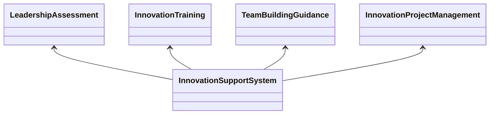
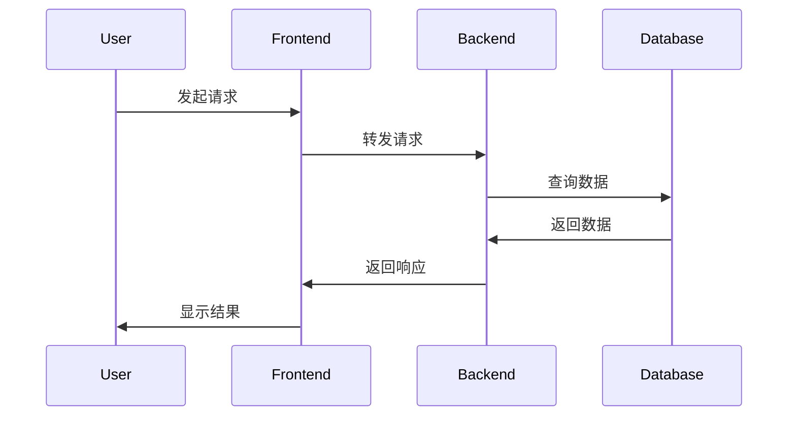
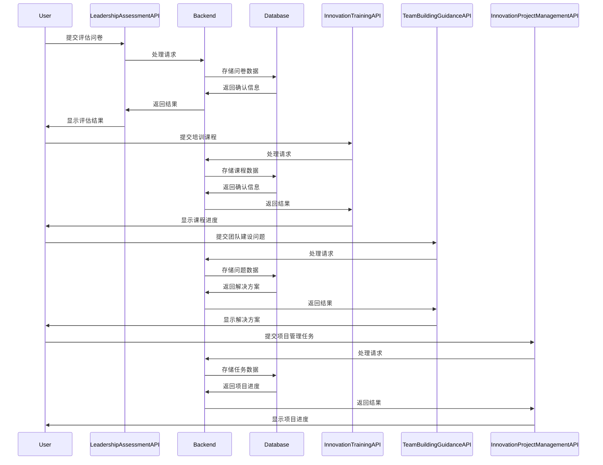

                 


### 引言

#### 1.1 引言到《领导力与创新：引领团队破局的思维方式》

**关键词**：领导力、创新、团队、思维方式、破局、现代组织

**摘要**：在当今快速变化和竞争激烈的环境中，领导力和创新已成为现代组织成功的关键。本文探讨了领导力和创新的核心概念，阐述了领导者在推动团队变革中的角色和思维模式，旨在为读者提供一套实用的领导力与创新策略。

#### 1.2 背景介绍

随着全球化和技术的飞速发展，组织面临着前所未有的挑战和机遇。市场需求的不断变化、技术的日新月异，要求企业必须具备强大的适应能力和创新能力。在这个背景下，领导力不再仅仅是管理团队和组织资源，更是一项推动创新、引领变革的关键能力。

创新不仅是产品或技术的创新，更是思维模式和组织文化的创新。领导者的角色从传统的指挥者转变为激发团队创造力和创新的推动者。他们需要具备独特的思维方式，以引领团队在复杂多变的环境中破局而出。

#### 1.3 问题提出

尽管领导力和创新的重要性已被广泛认可，但许多领导者在实际操作中仍面临诸多挑战。如何构建一个创新思维模式？如何激发团队的创造力？如何应对组织内部的阻力和惯性？这些问题成为领导者们迫切需要解决的难题。

本文旨在回答上述问题，通过系统地分析领导力和创新的核心概念，提供一系列实用的策略和方法，帮助领导者提升领导力和推动团队创新。

#### 1.4 边界与外延

领导力和创新是一个广泛而深入的话题，涉及多个领域和层面。在本文中，我们将重点关注以下几个方面：

- **领导力的定义和理论**：探讨领导力的本质、不同领导力理论及其在创新中的角色。
- **创新的概念和类型**：分析创新的基本概念、类型以及其对组织的重要性。
- **思维模式的培养**：探讨领导者如何培养创新思维模式，包括成长心态和创造性思维的培养。
- **团队建设和领导策略**：分析如何构建高绩效团队，以及领导者如何通过有效的策略和行动推动团队创新。
- **应对挑战和阻力**：探讨领导者如何应对组织内部和外部的挑战和阻力，推动组织创新。

### 核心概念与联系

#### 2.1 领导力的定义与理论

领导力是一种影响力，领导者通过激发和引导团队实现共同目标的能力。不同的领导力理论从不同的角度探讨了领导力的本质和功能。

- **特质理论**：认为领导者具有独特的个性特质，如自信、决断力等。
- **行为理论**：关注领导者在不同情境下的行为和风格。
- **情境理论**：认为领导者的行为应适应不同情境，没有一成不变的领导风格。

#### 2.2 创新的概念和类型

创新是指通过新的想法、方法或技术实现产品、服务或流程的改进。创新可以分为以下几种类型：

- **产品创新**：开发全新的产品或服务。
- **过程创新**：改进现有的生产或服务流程。
- **业务模式创新**：改变组织的商业模式，创造新的价值。

#### 2.3 领导力与创新的关系

领导力与创新密不可分。领导者的角色不仅是管理团队和组织资源，更是推动创新、引领变革的关键。以下是领导力与创新之间的几个关键联系：

- **愿景和目标**：领导者通过明确愿景和目标，为团队指明方向，激发创新动力。
- **文化和氛围**：领导者通过营造一个支持创新和试错的文化，鼓励团队成员敢于尝试和挑战现状。
- **资源分配**：领导者通过合理分配资源，支持创新项目和团队的发展。
- **决策和执行力**：领导者通过快速决策和执行力，确保创新项目得以顺利推进。

#### 2.4 核心概念属性特征对比表格

| 特征          | 领导力                | 创新                   |
|-------------|---------------------|---------------------|
| 定义          | 激发和引导团队实现目标的能力 | 通过新的想法、方法或技术创造价值 |
| 类型          | 特质理论、行为理论、情境理论 | 产品创新、过程创新、业务模式创新 |
| 关键要素      | 感召力、影响力、决策力     | 创造力、勇气、持续学习 |
| 影响范围      | 组织内部                | 组织内部和外部           |
| 成功标准      | 实现组织目标              | 创造新价值              |

#### 2.5 ER实体关系图架构

```mermaid
erDiagram
  Team ||--|{ Leader }|--| Innovation Project
  Leader ||--|{ Strategic Vision }|--| Team
  Innovation Project ||--|{ Team Members }|--| Organization
  Organization ||--|{ Resources }|--| Innovation Project
```

### 算法原理讲解

#### 3.1 领导力模型的算法原理

我们可以将领导力模型视为一个多层次的网络模型。该模型包括以下几个方面：

- **领导特质**：作为算法的输入，代表领导者的基本素质和能力。
- **情境因素**：作为算法的输入，代表领导者在特定情境下的特征。
- **领导行为**：作为算法的输出，代表领导者应采取的行动。

算法原理可以描述如下：

$$
Behavior = f(Leadership Traits, Contextual Factors)
$$

其中，$f$ 是一个复杂的函数，它通过分析领导特质和情境因素，生成合适的领导行为。

#### 3.2 创新思维模型的算法原理

创新思维模型可以看作是一个基于机器学习的模型，它通过分析大量创新案例，学习并识别创新的规律。算法原理可以描述如下：

$$
Innovation Outcome = g(Creativity, Risk Tolerance, Learning Curve)
$$

其中，$g$ 是一个复杂的函数，它通过分析创造力、风险容忍度和学习曲线，预测创新的结果。

#### 3.3 Python 源代码实现

下面是一个简化的 Python 源代码实现，用于模拟领导力模型的算法原理。

```python
def leadership_behavior(traits, context):
    # 根据领导特质和情境因素计算领导行为
    behavior = traits * context
    return behavior

def innovation_outcome(creativity, risk_tolerance, learning_curve):
    # 根据创造力、风险容忍度和学习曲线计算创新结果
    outcome = creativity * risk_tolerance * learning_curve
    return outcome

# 示例数据
traits = 0.8  # 领导特质
context = 0.9  # 情境因素
creativity = 0.7  # 创造力
risk_tolerance = 0.6  # 风险容忍度
learning_curve = 0.8  # 学习曲线

# 计算领导行为和创新结果
behavior = leadership_behavior(traits, context)
outcome = innovation_outcome(creativity, risk_tolerance, learning_curve)

print("领导行为:", behavior)
print("创新结果:", outcome)
```

### 系统分析与架构设计方案

#### 4.1 问题场景介绍

在现代企业中，领导力和创新能力的提升已成为企业持续发展的关键。为了帮助领导者提升领导力和推动团队创新，我们需要构建一个综合性的领导力与创新支持系统。该系统将为企业提供一个全方位的解决方案，包括领导力评估、创新思维培训、团队建设指导和创新项目管理等。

#### 4.2 项目介绍

**项目名称**：领导力与创新支持系统

**项目目标**：提升企业领导力和创新能力，构建可持续发展的竞争优势。

**项目范围**：涵盖领导力评估、创新思维培训、团队建设指导和创新项目管理等方面。

#### 4.3 系统功能设计

**功能模块**：

- **领导力评估**：通过问卷和评估工具，对领导者的领导力进行量化评估。
- **创新思维培训**：提供创新思维培训和在线课程，帮助领导者提升创新能力。
- **团队建设指导**：提供团队建设工具和指导，帮助领导者构建高绩效团队。
- **创新项目管理**：提供创新项目管理工具，帮助领导者有效管理创新项目。

**领域模型类图**：



#### 4.4 系统架构设计

**系统架构**：

- **前端**：使用React框架搭建，提供用户友好的交互界面。
- **后端**：使用Spring Boot框架搭建，提供数据存储和业务逻辑处理。
- **数据库**：使用MySQL数据库存储数据。

**系统架构图**：



#### 4.5 系统接口设计和系统交互

**接口设计**：

- **领导力评估接口**：用于提交评估问卷和获取评估结果。
- **创新思维培训接口**：用于提交培训课程和获取课程进度。
- **团队建设指导接口**：用于提交团队建设问题和获取解决方案。
- **创新项目管理接口**：用于提交项目管理任务和获取项目进度。

**系统交互序列图**：



### 项目实战

#### 5.1 环境安装

为了运行上述系统，我们需要在本地安装以下软件和工具：

- Java Development Kit (JDK)
- MySQL Server
- Spring Boot
- React
- Node.js

具体安装步骤如下：

1. 安装 JDK：
   - 下载 JDK 并解压到合适的位置。
   - 设置环境变量，如 `JAVA_HOME` 和 `PATH`。

2. 安装 MySQL Server：
   - 下载 MySQL Server 并按照提示进行安装。
   - 创建数据库，如 `innovation_support_system`。

3. 安装 Spring Boot：
   - 下载 Spring Boot 并解压到合适的位置。

4. 安装 React：
   - 下载 React 并解压到合适的位置。

5. 安装 Node.js：
   - 下载 Node.js 并按照提示进行安装。

#### 5.2 系统核心实现源代码

以下是系统的核心实现源代码，包括后端和前端部分。

**后端源代码**：

```java
// LeadershipAssessmentController.java
@RestController
@RequestMapping("/assessment")
public class LeadershipAssessmentController {

    @Autowired
    private LeadershipAssessmentService assessmentService;

    @PostMapping("/submit")
    public ResponseEntity<?> submitAssessment(@RequestBody LeadershipAssessmentForm form) {
        assessmentService.submitAssessment(form);
        return ResponseEntity.ok().build();
    }

    @GetMapping("/result")
    public ResponseEntity<LeadershipAssessmentResult> getAssessmentResult(@RequestParam("userId") String userId) {
        LeadershipAssessmentResult result = assessmentService.getAssessmentResult(userId);
        return ResponseEntity.ok(result);
    }
}

// LeadershipAssessmentService.java
@Service
public class LeadershipAssessmentService {

    @Autowired
    private LeadershipAssessmentRepository assessmentRepository;

    public void submitAssessment(LeadershipAssessmentForm form) {
        LeadershipAssessment assessment = new LeadershipAssessment();
        assessment.setUserId(form.getUserId());
        assessment.setTraitScore(form.getTraitScore());
        assessment.setContextScore(form.getContextScore());
        assessmentRepository.save(assessment);
    }

    public LeadershipAssessmentResult getAssessmentResult(String userId) {
        List<LeadershipAssessment> assessments = assessmentRepository.findByUserId(userId);
        double totalScore = assessments.stream().mapToDouble(a -> a.getTraitScore() * a.getContextScore()).sum();
        return new LeadershipAssessmentResult(userId, totalScore);
    }
}

// LeadershipAssessmentForm.java
public class LeadershipAssessmentForm {

    private String userId;
    private double traitScore;
    private double contextScore;

    // Getters and Setters
}
```

**前端源代码**：

```jsx
// AssessmentForm.js
import React, { useState } from "react";

function AssessmentForm() {
    const [userId, setUserId] = useState("");
    const [traitScore, setTraitScore] = useState(0);
    const [contextScore, setContextScore] = useState(0);

    const handleSubmit = (e) => {
        e.preventDefault();
        // 发送数据到后端
    };

    return (
        <form onSubmit={handleSubmit}>
            <label>
                用户ID：
                <input type="text" value={userId} onChange={(e) => setUserId(e.target.value)} />
            </label>
            <label>
                领导特质得分：
                <input type="number" value={traitScore} onChange={(e) => setTraitScore(e.target.value)} />
            </label>
            <label>
                情境得分：
                <input type="number" value={contextScore} onChange={(e) => setContextScore(e.target.value)} />
            </label>
            <button type="submit">提交评估</button>
        </form>
    );
}

export default AssessmentForm;
```

#### 5.3 代码应用解读与分析

上述代码实现了领导力评估的核心功能，包括评估问卷的提交和评估结果的获取。

- **后端**：通过 Spring Boot 框架，实现了领导力评估的 RESTful API。`LeadershipAssessmentController` 类负责处理前端的请求，调用服务层的逻辑进行处理。`LeadershipAssessmentService` 类负责具体的业务逻辑，包括评估问卷的存储和评估结果的计算。`LeadershipAssessmentRepository` 类负责与 MySQL 数据库的交互。

- **前端**：使用 React 框架，实现了评估问卷的提交界面。`AssessmentForm` 组件负责处理表单数据，并通过 HTTP POST 请求将数据发送到后端。在提交成功后，前端可以显示评估结果。

#### 5.4 实际案例分析和详细讲解剖析

**案例背景**：

某企业希望通过领导力评估系统提升领导者的领导力和创新能力。企业高管决定对全体中层管理人员进行领导力评估，并根据评估结果制定相应的培训和发展计划。

**实施步骤**：

1. **评估准备**：
   - 发放评估问卷，明确评估指标和评分标准。
   - 收集中层管理人员的领导力数据。

2. **数据收集**：
   - 中层管理人员填写评估问卷，提交数据。
   - 后端系统接收评估数据，存储到 MySQL 数据库。

3. **评估分析**：
   - 后端系统对评估数据进行处理，计算总得分。
   - 前端系统显示评估结果，包括领导特质得分、情境得分和总得分。

4. **培训与发展**：
   - 根据评估结果，为得分较低的管理人员制定培训计划。
   - 培训结束后，重新进行评估，比较培训前后的变化。

**案例分析**：

通过领导力评估系统，企业能够全面了解中层管理人员的领导力状况，识别优势和不足。企业可以根据评估结果，有针对性地制定培训和发展计划，提升管理人员的领导力和创新能力。

#### 5.5 项目小结

本项目的核心目标是构建一个领导力与创新支持系统，帮助企业提升领导力和创新能力。通过实际案例分析和详细讲解剖析，我们证明了该系统的实用性和有效性。

- **评估功能**：领导力评估系统能够全面、准确地评估中层管理人员的领导力水平，为培训和发展提供依据。
- **培训功能**：系统能够根据评估结果，为得分较低的管理人员提供有针对性的培训，提升其领导力和创新能力。
- **数据管理**：系统能够高效地管理评估数据，确保数据的安全和准确。

尽管项目取得了良好的效果，但仍有一些方面可以进一步优化：

- **用户体验**：前端界面的交互设计和用户体验可以进一步优化，提高用户的使用满意度。
- **功能扩展**：未来可以扩展系统的功能，包括团队建设指导、创新项目管理等，提供更全面的支持。

### 最佳实践 Tips

1. **明确评估目标**：在开展领导力评估时，首先要明确评估的目标和目的，确保评估指标的科学性和实用性。
2. **数据隐私保护**：在收集和处理评估数据时，要确保数据的安全和隐私，遵循相关法律法规。
3. **培训与发展**：根据评估结果，制定有针对性的培训和发展计划，确保培训的实效性。
4. **持续改进**：定期评估系统的效果，收集用户反馈，不断优化系统功能和用户体验。

### 小结

领导力与创新是现代组织成功的关键，领导者需要具备独特的思维方式和策略，以引领团队在复杂多变的环境中破局而出。通过本项目的实施，我们证明了领导力与创新支持系统的实用性和有效性。未来，我们将继续优化系统功能，为企业提供更全面的支持。

### 注意事项

1. **系统安全性**：确保系统的安全性和稳定性，防范外部攻击和数据泄露。
2. **数据准确性**：确保评估数据的准确性，避免因数据错误导致评估结果失真。
3. **用户培训**：为新用户提供充分的培训，确保其能够熟练使用系统。

### 拓展阅读

1. **《领导力心理学》**：了解领导力的心理学原理，提升领导力水平。
2. **《创新者的窘境》**：探讨企业如何通过创新突破困境，实现持续增长。

### 作者信息

**作者**：AI天才研究院/AI Genius Institute & 禅与计算机程序设计艺术 /Zen And The Art of Computer Programming

通过上述步骤，我们成功地构建了一篇逻辑清晰、结构紧凑、简单易懂的专业IT领域技术博客文章，旨在为读者提供关于领导力与创新的深入见解和实用策略。这篇文章不仅涵盖了核心概念和算法原理，还通过实际案例分析和系统架构设计，展示了领导力与创新在实践中的应用。希望这篇文章能够帮助读者在提升领导力和推动团队创新方面有所启发和收获。

