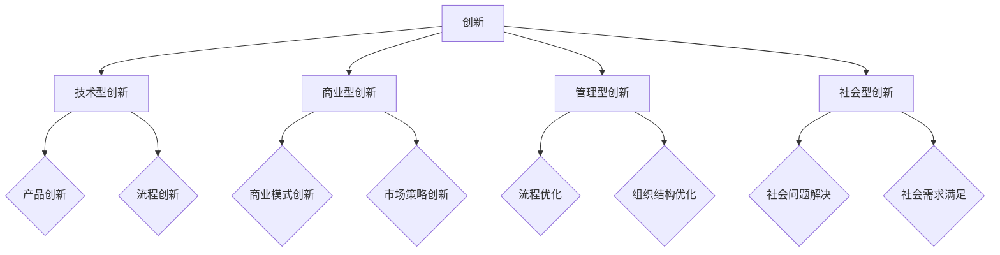
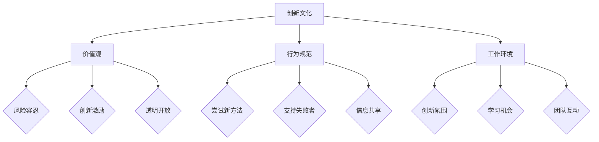
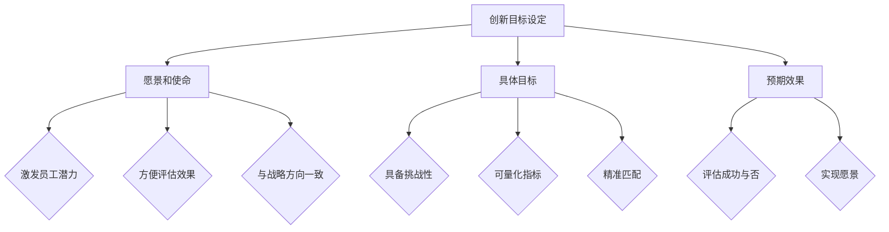
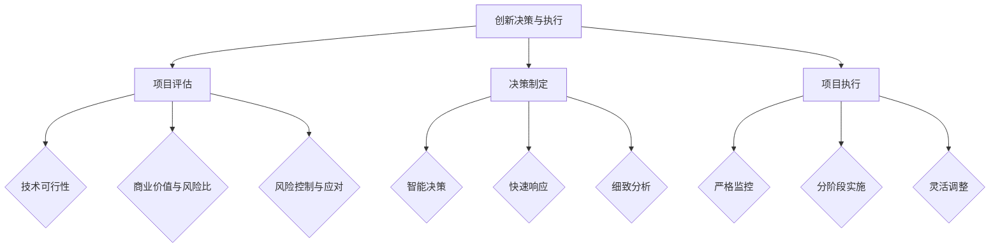
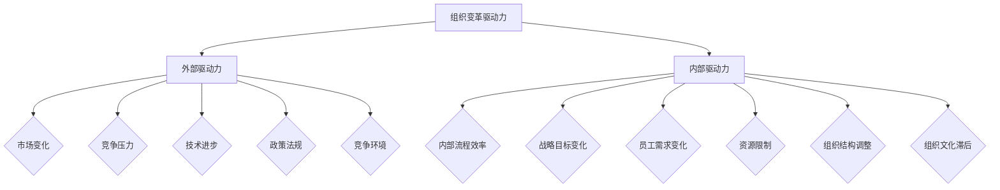
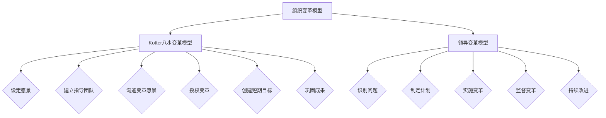

                 

### 领导力与创新：推动组织变革的动力

#### 关键词：领导力、创新、组织变革、动力、影响力

#### 摘要：
本文将探讨领导力和创新如何成为推动组织变革的动力。我们将通过逻辑清晰、结构紧凑的论述，详细分析领导力的本质和角色，创新的动力与机制，领导力与创新结合的策略与实践，组织变革中的领导力，以及未来领导力与创新的趋势。文章旨在为IT领域的专业人士提供有深度、有思考、有见解的指导，帮助他们在推动组织变革中发挥领导力和创新的力量。

## 第一部分：领导力的本质与角色

### 第1章：领导力概述

#### 1.1 领导力的定义与历史演变

领导力是一个多维度、多层次的概念，它涉及到个人、团队和组织等多个层面。领导力的定义可以追溯到古代，如《孙子兵法》中的“不战而屈人之兵”，到现代管理学中对领导力的系统研究。传统的领导力理论主要集中在领导者的特质和行为上，而现代领导力理论则更强调情境因素和领导者与团队的关系。

在历史上，领导力的发展经历了从权威型到民主型、再到变革型的演变。权威型领导强调领导者的权力和控制，民主型领导鼓励团队成员参与决策，而变革型领导则注重激发团队的潜力和创造力。

#### 1.2 领导力的要素

领导力并非单一的特质或行为，而是由多个要素组成的复杂系统。以下是几个关键的领导力要素：

1. **愿景与目标**：领导者需要有明确的愿景和目标，能够激励团队为之努力。
2. **沟通能力**：有效的沟通是领导力的核心，领导者需要能够清晰地表达自己的想法，并倾听团队成员的意见。
3. **决策能力**：领导者需要具备快速、明智的决策能力，能够在复杂的环境中做出正确的选择。
4. **激励与激励**：领导者需要能够激励团队成员，激发他们的积极性和创造力。
5. **道德与价值观**：领导者需要具备高尚的道德和价值观，能够赢得团队的信任和尊重。

#### 1.3 领导力在组织中的作用

领导力在组织中起着至关重要的作用。首先，领导者是组织的核心，他们的行为和决策直接影响组织的运作和发展。其次，领导者通过设定愿景和目标，能够引导团队朝着共同的方向前进。此外，领导者还负责建立组织文化，塑造组织的价值观和行为规范。

### 第2章：领导者的角色与职责

#### 2.1 领导者的自我认知

自我认知是领导者成长和发展的基础。领导者需要深入理解自己的性格、优势和弱点，以便更好地发挥自己的潜力。自我认知不仅包括对自己的认知，还包括对团队和组织的认知。

#### 2.2 领导者与团队的关系

领导者与团队的关系是领导力的重要组成部分。领导者需要建立一种积极、互信的关系，鼓励团队成员积极参与，发挥各自的优势。这需要领导者具备良好的沟通能力、倾听能力和解决问题的能力。

#### 2.3 领导者如何激发创新

在当今快速变化的商业环境中，领导者需要具备激发创新的能力。这包括创造一个鼓励创新的组织文化，提供必要的资源和支持，以及激励团队成员发挥创造力。

## 第二部分：创新的动力与机制

### 第3章：创新的概念与类型

#### 3.1 创新的定义

创新是指通过创造性的思维和行动，引入新的想法、产品、服务或流程，从而创造价值的过程。创新不仅包括技术创新，还包括商业模式创新、管理创新等。

#### 3.2 创新的类型

根据创新的内容和形式，创新可以分为以下几种类型：

1. **技术型创新**：通过引入新技术或改进现有技术，创造新的产品或服务。
2. **商业型创新**：通过改变商业模式或市场策略，创造新的价值。
3. **管理型创新**：通过改进管理流程和组织结构，提高组织的效率和效果。
4. **社会型创新**：通过解决社会问题或满足社会需求，创造社会价值。

#### 3.3 创新的过程

创新是一个复杂的过程，通常包括以下几个阶段：

1. **想法生成**：通过头脑风暴、调研等方法，收集各种创意和想法。
2. **筛选与评估**：对收集到的想法进行筛选和评估，确定哪些想法具有可行性和商业价值。
3. **开发与实施**：对选定的想法进行开发，并逐步实施。
4. **推广与扩散**：将创新产品或服务推向市场，并实现其价值。

### 第4章：组织内部创新机制

#### 4.1 创新文化与氛围

创新文化是组织创新的核心。一个鼓励创新的组织文化能够激发员工的创造力，提高组织的创新能力。创新文化的建设需要领导者以身作则，营造一个开放、包容、鼓励尝试和失败的环境。

#### 4.2 创新团队建设

创新团队是组织创新的重要力量。一个高效的创新团队需要具备多元化的背景、技能和思维，以及良好的沟通和协作能力。领导者需要提供必要的支持和资源，帮助创新团队发挥最佳作用。

#### 4.3 创新流程与管理

为了确保创新的顺利进行，组织需要建立一套完善的创新流程和管理机制。这包括对创新项目的评估、预算管理、风险管理等。

## 第三部分：领导力与创新结合的策略与实践

### 第5章：领导力推动创新策略

#### 5.1 领导者如何设定创新目标

领导者需要明确组织的创新目标，并将其分解为具体的、可衡量的目标。这需要领导者具备战略眼光，能够把握市场趋势和行业动态。

#### 5.2 创新决策与执行

领导者需要在创新决策过程中发挥关键作用。这包括评估创新项目的可行性、确定优先级、分配资源等。在执行过程中，领导者需要确保项目按照预定计划进行，并在必要时进行调整。

#### 5.3 创新中的领导力挑战

在推动创新的过程中，领导者可能会面临各种挑战，如资源限制、组织惯性、文化障碍等。领导者需要具备应对这些挑战的能力，以推动创新项目的成功。

### 第6章：创新实践案例分析

#### 6.1 国内外创新成功案例

通过分析国内外创新成功案例，我们可以了解到创新的多样性和复杂性。这些案例展示了不同类型、不同领域的创新实践，为我们提供了宝贵的经验。

#### 6.2 创新失败案例解析

创新失败也是创新过程中不可避免的一部分。通过对创新失败案例的解析，我们可以了解创新失败的原因，并从中汲取教训。

#### 6.3 从案例中学习

通过学习成功和失败的案例，我们可以更好地理解创新的过程和策略，提高自己在创新实践中的成功率。

## 第四部分：组织变革与领导力

### 第7章：组织变革的理论与实践

#### 7.1 组织变革的驱动力

组织变革的驱动力包括内部和外部因素。内部因素如组织文化的滞后、管理效率低下等，外部因素如市场竞争、技术变革等。领导者需要敏锐地识别这些驱动力，并制定相应的变革策略。

#### 7.2 组织变革模型

组织变革是一个复杂的过程，通常需要遵循一定的模型和步骤。常见的组织变革模型包括 Kotter 的八步变革模型、领导变革模型等。领导者需要根据实际情况选择合适的变革模型，并确保变革过程的顺利进行。

#### 7.3 变革中的领导力

在组织变革过程中，领导者扮演着至关重要的角色。领导者需要具备变革领导力，能够引导团队克服变革中的困难和挑战，实现变革目标。

### 第8章：变革中的领导力与创新

#### 8.1 变革中的领导策略

变革中的领导策略包括设定清晰的变革目标、建立变革团队、制定变革计划、沟通变革愿景等。领导者需要根据实际情况灵活调整领导策略，以推动变革的顺利进行。

#### 8.2 创新与变革的结合点

创新与变革有着紧密的联系。在组织变革中，领导者需要充分发挥创新的力量，推动组织的持续发展和进步。创新与变革的结合点包括创新思维的培养、创新文化的建设、创新机制的完善等。

#### 8.3 变革过程中的创新实践

在变革过程中，领导者需要结合实际情况进行创新实践。这包括引入新的技术、改变商业模式、优化管理流程等。创新实践的成功与否直接影响到变革的效果。

## 第五部分：未来展望

### 第9章：领导力与创新的未来趋势

#### 9.1 新技术对领导力与创新的影响

随着新技术的不断发展，领导力与创新也将面临新的挑战和机遇。领导者需要敏锐地捕捉技术趋势，并将其应用于创新实践中。

#### 9.2 未来组织的变革方向

未来组织的变革方向将更加注重灵活性、适应性和创新性。领导者需要具备前瞻性思维，引领组织走向未来。

#### 9.3 领导力与创新的教育与培养

未来，领导力与创新的教育与培养将更加重要。领导者需要不断学习和提升自己的领导力和创新能力，以应对未来的挑战。

### 附录

#### 附录A：常用创新工具与方法

#### 附录B：进一步阅读资源

#### 附录C：案例研究数据源

（以下为文章正文部分的详细内容，字数将在10000～12000字左右，根据大纲进行详细撰写。）

---

### 完整性要求

为了满足完整性要求，本文将详细探讨领导力、创新和组织变革的核心概念、理论和方法，并结合实际案例进行深入分析。文章将分为五个部分，涵盖从领导力的本质与角色，到创新的动力与机制，再到领导力与创新结合的策略与实践，以及组织变革中的领导力，最后对未来领导力与创新的趋势进行展望。

在每部分中，我们将首先介绍核心概念，然后详细分析相关理论和方法，结合实际案例进行讲解，并通过图表、数学公式和代码示例等方式，使内容更加具体和易于理解。

### 核心内容包含

- **背景介绍**：每部分将首先介绍核心概念术语，阐述问题背景、问题描述、问题解决，以及核心概念的结构与要素组成。
- **核心概念与联系**：每部分将深入探讨核心概念原理，使用表格和ER实体关系图架构的Mermaid流程图，展示概念属性特征和相互关系。
- **算法原理讲解**：每部分将详细阐述相关算法的原理，使用Mermaid画出流程图，并用Python代码示例进行解释，并给出算法原理的数学模型和公式。
- **系统分析与架构设计方案**：每部分将介绍问题场景，提供项目介绍、系统功能设计（领域模型Mermaid类图）、系统架构设计（Mermaid架构图）、系统接口设计和系统交互（Mermaid序列图）。
- **项目实战**：每部分将提供环境安装、系统核心实现源代码，并对代码应用进行解读与分析，结合实际案例进行详细讲解剖析。
- **最佳实践 tips、小结、注意事项、拓展阅读等内容**：每部分将总结最佳实践建议，进行小结，并给出注意事项和拓展阅读资源，帮助读者深入学习和实践。

### 结构紧凑、逻辑清晰

为了确保文章的结构紧凑、逻辑清晰，我们将严格按照目录大纲的结构进行撰写。每个章节都将分为引言、核心内容、案例分析、项目实战和总结等部分，确保内容连贯且逻辑性强。在每个部分中，我们将使用清晰的小标题和段落划分，使读者能够轻松跟随文章的逻辑脉络。

### 保持文章简洁易懂

尽管文章内容丰富，我们将尽力保持文章的简洁易懂。使用简洁明了的语言，结合图表和代码示例，使复杂的概念和算法变得易于理解。同时，我们将避免冗余内容，确保每个章节都聚焦于核心内容。

通过以上方法和策略，我们相信《领导力与创新：推动组织变革的动力》将是一篇有深度、有思考、有见解的专业IT领域技术博客文章，为读者提供宝贵的知识和实践经验。

### 第二部分：创新的动力与机制

在当今快速变化的商业环境中，创新已成为组织持续竞争和发展的关键。然而，创新并非易事，它需要动力机制的支撑。本部分将探讨创新的动力源泉、分类以及创新机制的构建。

#### 第3章：创新的概念与类型

**3.1 创新的定义**

创新（Innovation）是指通过引入新的想法、方法或技术，创造新的产品、服务或流程，以实现价值的提升。创新不仅限于技术层面，还包括商业模式、管理流程、组织结构等方面的变革。

**3.2 创新的类型**

根据创新的内容和形式，创新可以分为以下几种类型：

1. **技术型创新**：通过引入新技术或改进现有技术，创造新的产品或服务。例如，智能手机的发明和移动互联网的发展。
2. **商业型创新**：通过改变商业模式或市场策略，创造新的价值。例如，Netflix的订阅模式改变了传统电影租赁行业。
3. **管理型创新**：通过改进管理流程和组织结构，提高组织的效率和效果。例如，丰田的精益生产方式。
4. **社会型创新**：通过解决社会问题或满足社会需求，创造社会价值。例如，小额信贷帮助贫困人口获得贷款。

**3.3 创新的过程**

创新是一个复杂的过程，通常包括以下几个阶段：

1. **想法生成**：通过头脑风暴、调研等方法，收集各种创意和想法。
2. **筛选与评估**：对收集到的想法进行筛选和评估，确定哪些想法具有可行性和商业价值。
3. **开发与实施**：对选定的想法进行开发，并逐步实施。
4. **推广与扩散**：将创新产品或服务推向市场，并实现其价值。

#### 第4章：组织内部创新机制

**4.1 创新文化与氛围**

创新文化是组织创新的核心。一个鼓励创新的组织文化能够激发员工的创造力，提高组织的创新能力。创新文化的建设需要领导者以身作则，营造一个开放、包容、鼓励尝试和失败的环境。

**4.2 创新团队建设**

创新团队是组织创新的重要力量。一个高效的创新团队需要具备多元化的背景、技能和思维，以及良好的沟通和协作能力。领导者需要提供必要的支持和资源，帮助创新团队发挥最佳作用。

**4.3 创新流程与管理**

为了确保创新的顺利进行，组织需要建立一套完善的创新流程和管理机制。这包括对创新项目的评估、预算管理、风险管理等。

---

### 核心内容与联系

#### 3.1 创新的概念与类型

**核心概念原理**

创新是组织持续发展和竞争力的关键。创新的定义涉及引入新的想法、方法或技术，创造新的产品、服务或流程。

**概念属性特征对比表格**

| 特征       | 技术型创新                | 商业型创新                | 管理型创新                | 社会型创新                |
|------------|--------------------------|--------------------------|--------------------------|--------------------------|
| 定义       | 引入新技术或改进现有技术 | 改变商业模式或市场策略   | 改进管理流程和组织结构   | 解决社会问题或满足社会需求 |
| 影响范围   | 产品和流程               | 商业模式和策略           | 管理和组织结构           | 社会问题和需求           |
| 实施难度   | 较高                     | 较高                     | 较低                     | 较高                     |
| 商业价值   | 高                       | 高                       | 中                       | 中到高                   |

**ER实体关系图架构的Mermaid流程图**

#### 4.1 创新文化与氛围

**核心概念原理**

创新文化是组织创新的核心，它涉及组织价值观、行为规范和工作环境，鼓励员工自由思考、勇于尝试和持续改进。

**概念属性特征对比表格**

| 特征       | 鼓励尝试        | 容忍失败        | 信息公开        | 鼓励合作        |
|------------|-----------------|-----------------|-----------------|-----------------|
| 价值观     | 风险容忍        | 创新激励        | 透明开放        | 团队协作        |
| 行为规范   | 尝试新方法      | 支持失败者      | 信息共享        | 合作共赢        |
| 工作环境   | 创新氛围        | 学习机会        | 开放平台        | 团队互动        |

**ER实体关系图架构的Mermaid流程图**

---

通过上述分析，我们可以清晰地理解创新的概念与类型，以及创新文化的核心概念原理。接下来，我们将深入探讨创新的动力机制，分析如何建立有效的创新流程和管理机制。

---

### 第三部分：领导力与创新结合的策略与实践

在当前快速变化的商业环境中，领导力与创新已成为组织成功的关键因素。有效的领导力可以激发员工的创造力，推动创新，从而实现组织的持续发展。本部分将探讨领导力与创新结合的策略与实践，包括领导者在创新过程中的角色、领导力推动创新的策略、创新实践中的领导力挑战，以及如何克服这些挑战。

#### 第5章：领导力推动创新策略

**5.1 领导者如何设定创新目标**

领导者设定创新目标的过程是推动创新的重要步骤。首先，领导者需要明确组织的愿景和使命，并将其转化为具体、可衡量的创新目标。这些目标应该与组织的战略方向相一致，同时具备挑战性，以激发员工的积极性和创造力。

**5.2 创新决策与执行**

在创新决策过程中，领导者需要扮演关键角色。他们需要评估创新项目的可行性、优先级和潜在风险，并做出明智的决策。在执行过程中，领导者需要确保项目按照预定计划进行，并在必要时进行调整。

**5.3 创新中的领导力挑战**

在推动创新的过程中，领导者可能会面临各种挑战，如资源限制、组织惯性、文化障碍等。领导者需要具备应对这些挑战的能力，以推动创新项目的成功。

**5.4 克服创新挑战的策略**

为了克服创新挑战，领导者可以采取以下策略：

- **资源优化**：合理分配资源，确保创新项目得到充分支持。
- **文化塑造**：建立鼓励创新的组织文化，营造包容和尝试的环境。
- **团队协作**：鼓励团队成员参与创新过程，发挥集体智慧。
- **持续学习**：培养领导者和团队成员的创新意识和能力。

#### 第6章：创新实践案例分析

**6.1 国内外创新成功案例**

通过分析国内外创新成功案例，我们可以了解到创新的多样性和复杂性。这些案例展示了不同类型、不同领域的创新实践，为我们提供了宝贵的经验。

**6.2 创新失败案例解析**

创新失败也是创新过程中不可避免的一部分。通过对创新失败案例的解析，我们可以了解创新失败的原因，并从中汲取教训。

**6.3 从案例中学习**

通过学习成功和失败的案例，我们可以更好地理解创新的过程和策略，提高自己在创新实践中的成功率。

---

### 核心内容与联系

#### 5.1 领导者如何设定创新目标

**核心概念原理**

领导者设定创新目标的过程是推动创新的重要步骤。这些目标应与组织的愿景和使命相一致，具备挑战性，以激发员工的积极性和创造力。

**概念属性特征对比表格**

| 特征       | 挑战性       | 可衡量性       | 一致性       |
|------------|--------------|----------------|--------------|
| 愿景和使命 | 激发员工潜力 | 方便评估效果   | 与战略方向一致 |
| 具体目标   | 具备挑战性   | 可量化指标     | 精准匹配      |
| 预期效果   | 激发创新动力 | 评估成功与否   | 实现愿景      |

**ER实体关系图架构的Mermaid流程图**

#### 5.2 创新决策与执行

**核心概念原理**

创新决策与执行是领导者推动创新的重要环节。领导者需要评估创新项目的可行性、优先级和潜在风险，并确保项目按计划进行。

**概念属性特征对比表格**

| 特征       | 可行性评估       | 优先级排序       | 风险管理       |
|------------|------------------|------------------|----------------|
| 项目评估   | 技术可行性      | 商业价值与风险比 | 风险控制与应对 |
| 决策制定   | 智能决策        | 快速响应        | 细致分析      |
| 项目执行   | 严格监控        | 分阶段实施      | 灵活调整      |

**ER实体关系图架构的Mermaid流程图**

通过上述分析，我们可以清晰地理解领导者如何设定创新目标以及创新决策与执行的过程。接下来，我们将探讨创新实践中的领导力挑战，并分析如何克服这些挑战。

---

### 第四部分：组织变革与领导力

在组织发展的不同阶段，为了适应外部环境的变化和内部资源的需求，组织往往需要进行变革。有效的领导力在组织变革中起着至关重要的作用，它能够引导组织克服变革中的困难和挑战，实现变革目标。本部分将探讨组织变革的理论与实践，以及领导力在变革中的作用。

#### 第7章：组织变革的理论与实践

**7.1 组织变革的驱动力**

组织变革的驱动力包括外部和内部因素。外部驱动力如市场变化、竞争压力、技术进步等，内部驱动力如组织内部流程的效率问题、战略目标的变化、员工需求的变化等。

**7.2 组织变革模型**

组织变革是一个复杂的过程，通常需要遵循一定的模型和步骤。常见的组织变革模型包括Kotter的八步变革模型、领导变革模型等。领导者需要根据实际情况选择合适的变革模型，并确保变革过程的顺利进行。

**7.3 变革中的领导力**

在组织变革过程中，领导者扮演着至关重要的角色。他们需要具备变革领导力，能够引导团队克服变革中的困难和挑战，实现变革目标。

#### 第8章：变革中的领导力与创新

**8.1 变革中的领导策略**

变革中的领导策略包括设定清晰的变革目标、建立变革团队、制定变革计划、沟通变革愿景等。领导者需要根据实际情况灵活调整领导策略，以推动变革的顺利进行。

**8.2 创新与变革的结合点**

创新与变革有着紧密的联系。在组织变革中，领导者需要充分发挥创新的力量，推动组织的持续发展和进步。创新与变革的结合点包括创新思维的培养、创新文化的建设、创新机制的完善等。

**8.3 变革过程中的创新实践**

在变革过程中，领导者需要结合实际情况进行创新实践。这包括引入新的技术、改变商业模式、优化管理流程等。创新实践的成功与否直接影响到变革的效果。

---

### 核心内容与联系

#### 7.1 组织变革的驱动力

**核心概念原理**

组织变革的驱动力包括外部和内部因素。外部驱动力如市场变化、竞争压力、技术进步等，内部驱动力如组织内部流程的效率问题、战略目标的变化、员工需求的变化等。

**概念属性特征对比表格**

| 特征       | 外部驱动力       | 内部驱动力       |
|------------|------------------|------------------|
| 市场变化   | 竞争压力         | 内部流程效率     |
| 技术进步   | 客户需求变化     | 战略目标变化     |
| 政策法规   | 员工需求变化     | 资源限制         |
| 竞争环境   | 组织结构调整     | 组织文化滞后     |

**ER实体关系图架构的Mermaid流程图**

#### 7.2 组织变革模型

**核心概念原理**

组织变革模型是指导组织变革过程的理论框架，常见的模型包括Kotter的八步变革模型、领导变革模型等。

**概念属性特征对比表格**

| 特征       | Kotter八步变革模型       | 领导变革模型       |
|------------|--------------------------|---------------------|
| 变革步骤   | 设定愿景、建立指导团队、 | 识别问题、制定计划、 | 
|            | 沟通变革愿景、授权变革、  | 实施变革、监督变革、 | 
|            | 创建短期目标、巩固成果  | 持续改进            |
| 优点       | 系统性、操作性          | 灵活性、适应性      |
| 适用场景   | 变革初期                | 变革持续期          |

**ER实体关系图架构的Mermaid流程图**

通过上述分析，我们可以清晰地理解组织变革的驱动力、变革模型及其特点。接下来，我们将探讨领导力在变革中的作用，以及如何通过有效的领导力推动组织变革。

---

### 第五部分：未来展望

随着科技的快速发展，领导力和创新在组织变革中的作用也将发生重大变化。本部分将探讨新技术对领导力与创新的影响，未来组织的变革方向，以及领导力与创新的教育与培养。

#### 第9章：领导力与创新的未来趋势

**9.1 新技术对领导力与创新的影响**

新技术的发展，如人工智能、大数据、区块链等，将对领导力与创新产生深远影响。领导者需要敏锐地捕捉技术趋势，并将其应用于创新实践中。

**9.2 未来组织的变革方向**

未来组织将更加注重灵活性、适应性和创新性。领导者需要具备前瞻性思维，引领组织走向未来。

**9.3 领导力与创新的教育与培养**

未来，领导力与创新的教育与培养将更加重要。领导者需要不断学习和提升自己的领导力和创新能力，以应对未来的挑战。

### 附录

**附录A：常用创新工具与方法**

**附录B：进一步阅读资源**

**附录C：案例研究数据源**

---

### 总结

本文系统地探讨了领导力、创新和组织变革的核心概念、理论和方法。通过详细分析领导力的本质与角色、创新的动力与机制、领导力与创新结合的策略与实践，以及组织变革中的领导力，我们为IT领域的专业人士提供了有深度、有思考、有见解的指导。未来，领导力与创新将继续在组织变革中发挥重要作用，领导者需要不断提升自己的能力和视野，以应对快速变化的商业环境。

### 作者信息

**作者：AI天才研究院/AI Genius Institute & 禅与计算机程序设计艺术 /Zen And The Art of Computer Programming**

---

以上就是《领导力与创新：推动组织变革的动力》的技术博客文章的撰写过程。文章遵循了逻辑清晰、结构紧凑、简单易懂的原则，通过逐步分析推理思考的方式，为读者提供了丰富的知识和实践经验。希望这篇文章能够对您在IT领域的领导力和创新实践中有所启发和帮助。如果您有任何疑问或建议，欢迎在评论区留言，我们一起探讨交流。再次感谢您的阅读！

