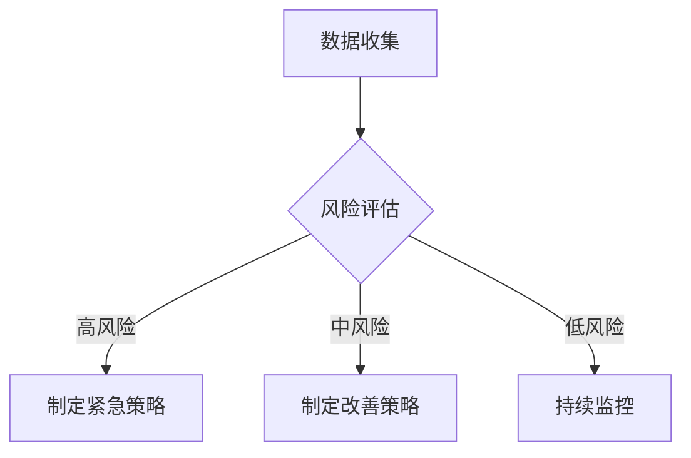
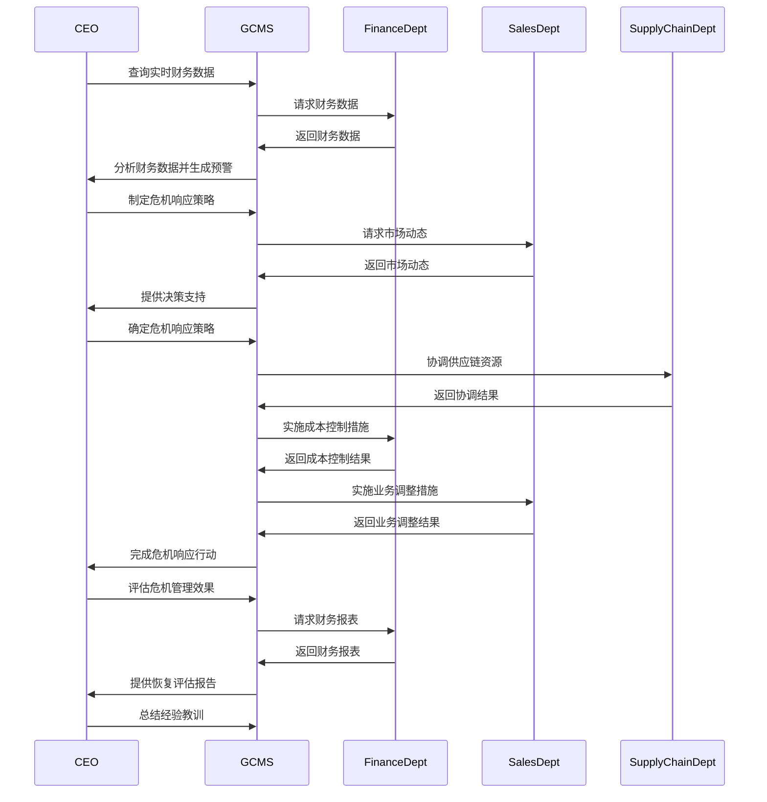

                 

# 领导力与危机管理：化险为夷的技巧

关键词：领导力，危机管理，技巧，策略，案例分析，技能提升

摘要：在瞬息万变的企业环境中，领导力与危机管理是确保组织稳健发展的关键要素。本文将深入探讨领导力的核心概念与特征，危机管理的背景与挑战，领导力在危机管理中的应用，危机管理策略与技巧，成功案例，个人领导力与危机管理技能提升，以及结论与未来展望。通过系统性的分析和实际案例的解读，帮助读者掌握化险为夷的领导力与危机管理技巧。

---

## 第一部分：领导力与危机管理概述

在全球化浪潮和科技迅猛发展的背景下，企业面临的挑战日益复杂。领导力与危机管理作为组织管理的核心内容，其重要性愈加凸显。本部分将首先对领导力的核心概念与特征进行介绍，然后探讨危机管理的背景与挑战，最后分析领导力在危机管理中的应用。

### 1.1 领导力的核心概念与特征

#### 1.1.1 领导力的定义与重要性

领导力是一种能够激发、引导和激励他人共同实现目标的能力。其在企业中的作用不可低估，是推动组织进步和创新的核心动力。

**定义：** 领导力是一种在组织中通过影响和引导他人，共同实现目标的能力。

**重要性：** 领导力不仅关乎个人，更关乎整个组织的未来。一个优秀的领导者能够带领团队克服困难，实现卓越的绩效。

#### 1.1.2 领导力的特征

**影响力：** 领导者具备强大的影响力，能够影响他人的态度和行为。

**适应性：** 领导者能够迅速适应变化的环境，灵活调整策略。

**沟通能力：** 领导者具备出色的沟通技巧，能够清晰、有效地传达信息。

**决策能力：** 领导者能够在关键时刻做出明智的决策。

#### 1.1.3 领导力的发展与培养

**领导力的发展路径：** 领导力的发展是一个逐步提升的过程，包括自我认知、角色转变、能力提升等阶段。

**领导力的培养方法：** 通过培训、实践、反馈等途径，不断提升领导力。

### 1.2 危机管理的背景与挑战

#### 1.2.1 危机管理的定义与类型

**定义：** 危机管理是一种应对和处理突发事件的系统方法，旨在减少危机对企业的影响。

**类型：** 危机可分为自然灾害、人为事故、财务危机等类型。

#### 1.2.2 危机管理的背景

**全球化背景下的危机管理：** 全球化使得企业面临的风险更加复杂，危机管理的范围和难度增加。

**企业发展中的危机管理：** 企业在不同发展阶段面临的危机类型和程度有所不同。

#### 1.2.3 危机管理的挑战

**信息不对称：** 企业内部和外部的信息不对称，增加了危机管理的难度。

**快速变化的环境：** 科技迅猛发展，市场环境变化迅速，增加了危机管理的复杂性。

**资源限制：** 在危机管理过程中，企业可能面临资源短缺的挑战。

**心理压力：** 面对危机，领导者需要承受巨大的心理压力。

### 1.3 领导力在危机管理中的应用

#### 1.3.1 领导力在危机响应中的作用

**稳定团队：** 领导者需要迅速稳定团队，确保团队的正常运作。

**快速决策：** 领导者需要快速做出决策，采取有效的应对措施。

**优化资源分配：** 领导者需要合理分配资源，确保危机管理的有效性。

#### 1.3.2 领导力在危机恢复中的重要性

**激励员工：** 领导者需要激励员工，共同应对危机。

**建立信任：** 领导者需要建立信任，恢复员工的信心。

**制定长期战略：** 领导者需要制定长期战略，确保企业的持续发展。

#### 1.3.3 领导力在危机预防中的角色

**风险识别：** 领导者需要识别潜在风险，提前采取预防措施。

**持续改进：** 领导者需要持续改进危机管理策略，提高应对能力。

**培训与教育：** 领导者需要培训和教育员工，提升危机应对能力。

### 1.4 危机管理策略与技巧

#### 1.4.1 危机管理的基本策略

**评估风险：** 通过风险评估，了解潜在的风险点。

**制定应急计划：** 制定详细的应急计划，确保危机发生时能够迅速响应。

**实施危机沟通：** 建立有效的危机沟通机制，确保信息畅通。

#### 1.4.2 危机管理的技巧

**快速响应：** 突发事件发生时，领导者需要迅速采取行动。

**保持透明：** 信息透明有助于树立企业公信力。

**灵活调整：** 根据危机发展的态势，灵活调整应对策略。

### 1.5 成功的危机管理案例

#### 1.5.1 案例一：公司突发财务危机的处理

**案例描述：** 公司突然面临严重的财务危机，导致股价下跌，投资者失去信心。

**处理措施：** 领导者迅速采取措施，通过重组债务、削减成本、寻找战略投资者等手段，缓解财务压力。

**结果分析：** 经过一系列努力，公司成功渡过财务危机，股价逐渐回升，投资者信心得到恢复。

#### 1.5.2 案例二：自然灾害中的应急响应

**案例描述：** 公司所在地区遭受自然灾害，导致生产线停摆，员工安全受到威胁。

**应急措施：** 领导者迅速启动应急响应机制，确保员工安全，同时制定替代生产线方案，减少经济损失。

**社会影响：** 公司的应急响应得到社会广泛赞誉，提升了企业品牌形象。

### 1.6 个人领导力与危机管理技能提升

#### 1.6.1 自我认知与自我提升

**自我评估：** 通过定期自我评估，了解自身领导力水平。

**自我反思：** 通过反思自身行为，发现并改进不足。

**建立个人成长计划：** 设定明确的目标，制定实现目标的计划。

#### 1.6.2 学习与培训

**学习途径：** 通过阅读、培训、实践等多种途径，不断提升自身能力。

**培训课程：** 参加专业培训课程，学习危机管理的先进理念和方法。

**实践经验：** 通过实际项目经验，提升危机管理能力。

#### 1.6.3 领导力与危机管理技能的整合

**实践应用：** 在实际工作中，将领导力与危机管理技能相结合，提高应对危机的能力。

**反馈与改进：** 通过反馈机制，不断改进自身领导力和危机管理技能。

**长期发展：** 将领导力与危机管理技能的培养作为长期发展目标，不断提升自身综合素质。

### 1.7 结论与未来展望

#### 1.7.1 领导力与危机管理的重要性

**社会影响：** 领导力与危机管理不仅影响企业的生存与发展，还对社会产生深远影响。

**企业发展：** 一个优秀的领导者能够带领企业应对各种挑战，实现持续发展。

#### 1.7.2 未来危机管理的发展趋势

**技术创新：** 随着科技的进步，危机管理将更加依赖大数据、人工智能等先进技术。

**全球化影响：** 全球化趋势将加剧危机管理的复杂性，要求领导者具备全球视野。

#### 1.7.3 未来领导力的发展方向

**变革管理：** 面对变革，领导者需要具备变革管理能力，引领企业应对挑战。

**人才发展：** 未来领导力的发展离不开人才的发展，领导者需要注重人才培养和引进。

---

通过以上对领导力与危机管理概述的详细分析，我们可以看到，领导力与危机管理是企业稳健发展的关键。在接下来的部分，我们将深入探讨领导力的具体应用和危机管理的策略与技巧，帮助读者更好地理解和掌握化险为夷的技巧。# 第二部分：领导力的核心概念与特征

领导力是一种能够在组织中产生深远影响的能力，它不仅关乎个人素质的提升，更关系到整个团队的协作效率与企业的长远发展。本部分将深入探讨领导力的核心概念与特征，帮助读者理解领导力的本质及其在危机管理中的重要作用。

### 2.1.1 领导力的定义与重要性

领导力是一种通过影响和激励他人，共同实现目标的能力。它不仅包括个人品质，如诚实、正直、勇气等，还涉及一系列行为和策略，如沟通、决策、激励等。

**定义：** 领导力是一种在组织中通过影响和激励他人，共同实现目标的能力。

**重要性：** 领导力是企业成功的关键因素之一。一个优秀的领导者能够激发团队的潜力，提升组织绩效，推动企业持续发展。

#### 领导力在危机管理中的重要性

危机管理是一个动态且复杂的过程，领导者在此过程中扮演着至关重要的角色。以下是从几个方面探讨领导力在危机管理中的重要性：

1. **稳定情绪与团队**：在危机发生时，领导者的情绪和反应直接影响团队成员的情绪。一个冷静、果断的领导者能够迅速稳定团队，减少恐慌和混乱。

2. **快速决策**：危机管理往往需要迅速做出决策。领导者具备良好的决策能力，能够在压力下做出明智的选择，避免事态进一步恶化。

3. **资源调配**：领导者需要合理调配资源，确保危机管理的有效性。这包括财务资源、人力资源和物资资源等。

4. **沟通协调**：在危机管理过程中，领导者的沟通协调能力至关重要。有效的沟通能够确保信息畅通，减少误解和冲突。

5. **激励团队**：危机时期，员工可能面临巨大的心理压力。领导者需要通过激励措施，提升员工的士气和动力。

### 2.1.2 领导力的特征

领导力具有多个特征，以下是其中几个关键特征：

#### 2.1.2.1 影响力

领导力本质上是一种影响力。领导者通过个人魅力、专业知识和行为榜样，影响和激励他人。

**特征：** 能够通过言语和行动，影响他人的态度和行为。

**重要性：** 在危机管理中，领导者的影响力能够迅速稳定团队，提高应对危机的效率。

#### 2.1.2.2 适应性

领导者需要具备快速适应变化的能力。在危机管理中，环境变化迅速，领导者需要灵活调整策略，以应对新的挑战。

**特征：** 能够快速识别变化，并迅速采取相应措施。

**重要性：** 在危机管理中，适应性决定了领导者能否有效应对突发状况。

#### 2.1.2.3 沟通能力

有效的沟通是领导者的一项关键技能。在危机管理中，领导者需要确保信息的准确传递，减少误解和混淆。

**特征：** 能够清晰、准确地表达自己的想法，并倾听他人的意见。

**重要性：** 在危机管理中，沟通能力决定了信息传递的效率，直接影响到危机应对的效果。

#### 2.1.2.4 决策能力

领导者需要在危机管理中做出快速且明智的决策。这要求领导者具备良好的判断力和分析能力。

**特征：** 能够在压力下做出理性决策，并承担决策结果。

**重要性：** 在危机管理中，决策能力决定了危机应对的方向和效果。

### 2.1.3 领导力的发展与培养

领导力并非与生俱来，而是可以通过学习和实践逐步发展。以下是领导力发展的一些关键步骤：

#### 2.1.3.1 领导力的发展路径

1. **自我认知**：了解自己的优势和不足，明确个人目标和职业规划。
2. **角色转变**：从普通员工到领导者，角色转变是领导力发展的关键一步。
3. **能力提升**：通过学习和实践，不断提升领导力各项能力。

#### 2.1.3.2 领导力的培养方法

1. **培训课程**：参加专业的领导力培训课程，学习领导力理论和实践技巧。
2. **实践应用**：在实际工作中，运用领导力技巧，不断提升自身的领导力水平。
3. **反馈与改进**：通过自我反思和他人反馈，不断改进领导力实践。

### 2.1.4 实际案例：领导力在危机管理中的表现

为了更好地理解领导力在危机管理中的具体应用，我们可以通过一些实际案例来探讨。

#### 案例一：丰田汽车召回危机

在2010年，丰田汽车因质量问题面临全球性召回危机。丰田总裁丰田章男亲自承担责任，并采取了一系列果断措施，如停产、召回、退款等，以恢复消费者信心。

**领导力表现：**

1. **快速响应**：危机发生后，丰田章男迅速采取行动，表明公司对问题的重视。
2. **透明沟通**：丰田章男通过公开会议和媒体，向公众传递真实信息，保持信息透明。
3. **资源调配**：丰田章男调动公司资源，确保召回工作的顺利进行。

**结果分析：** 通过丰田章男的有效领导，丰田汽车成功渡过了危机，股价逐渐回升，企业信誉得到恢复。

#### 案例二：福岛核事故中的日本政府反应

2011年，日本福岛核事故爆发，导致严重的核辐射泄漏。日本政府在危机管理中的表现备受关注。

**领导力表现：**

1. **稳定情绪**：日本首相菅直人迅速稳定情绪，确保政府决策的连续性。
2. **快速决策**：菅直人迅速下令启动紧急状态，并采取一系列措施，如疏散居民、封锁海域等。
3. **资源调配**：政府调动大量资源，确保救援工作的顺利进行。

**结果分析：** 尽管福岛核事故带来了严重的后果，但日本政府的有效领导使得事故的危害得以控制，减少了进一步的损失。

通过以上案例，我们可以看到，领导力在危机管理中的关键作用。一个优秀的领导者不仅能够在危机中保持冷静，迅速做出决策，还能够通过有效的沟通和资源调配，带领团队渡过难关。

### 2.1.5 小结

领导力是一种在组织中产生深远影响的能力，其在危机管理中尤为重要。通过深入了解领导力的核心概念与特征，以及实际案例的分析，我们可以更好地理解领导力在危机管理中的具体应用。在接下来的部分，我们将继续探讨危机管理的背景与挑战，帮助读者更全面地了解危机管理的本质和应对策略。# 第二部分：危机管理的背景与挑战

在当今复杂多变的环境中，危机管理已成为企业管理的重要组成部分。危机管理不仅关乎企业的生存与发展，还影响到整个社会的稳定。本部分将深入探讨危机管理的背景、类型、挑战以及领导力在危机管理中的重要性，帮助读者全面理解危机管理的全貌。

### 2.2.1 危机管理的定义与类型

**定义：** 危机管理是一种应对和处理突发事件的系统方法，旨在减少危机对企业的影响，恢复正常运营。

**类型：** 危机管理主要涉及以下类型：

1. **自然灾害**：如地震、洪水、飓风等自然灾害，对企业运营和社会稳定产生重大影响。
2. **人为事故**：如火灾、爆炸、交通事故等，可能导致人员伤亡和财产损失。
3. **财务危机**：如破产、债务违约等，可能引发连锁反应，影响企业的生存。
4. **信息安全事故**：如数据泄露、网络攻击等，可能导致企业声誉受损，客户信任度下降。
5. **公共卫生事件**：如传染病爆发、疫情蔓延等，可能对企业的生产和运营造成严重影响。

### 2.2.2 危机管理的背景

**全球化背景下的危机管理：** 随着全球化的深入，企业面临的风险不再局限于本国市场，而是扩展到全球范围。全球化带来的贸易往来、信息交流和经济依赖，使得危机的传播速度更快，影响范围更广。企业需要具备全球视野，制定相应的危机管理策略。

**企业发展中的危机管理：** 企业在不同发展阶段面临的危机类型和程度有所不同。初创企业可能面临市场竞争、资金不足等危机，成熟企业则可能面临组织变革、产品老化等危机。危机管理的重点应根据企业的生命周期进行调整。

### 2.2.3 危机管理的挑战

**信息不对称：** 危机发生时，企业内部和外部的信息不对称可能导致决策失误。内部信息不畅可能导致领导者和员工对危机的认识不一致，外部信息不对称可能导致企业无法及时了解市场动态和竞争对手的应对策略。

**快速变化的环境：** 市场环境变化迅速，企业需要不断调整应对策略。快速变化的环境增加了危机管理的复杂性，领导者需要具备敏锐的洞察力和快速反应能力。

**资源限制：** 在危机管理过程中，企业可能面临资源短缺的挑战。资源限制可能包括财务资源、人力资源和物资资源等。资源限制可能导致危机管理措施不充分，影响危机应对的效果。

**心理压力：** 面对危机，领导者和员工都可能承受巨大的心理压力。心理压力可能导致决策失误、执行力下降等问题，进一步加剧危机的严重性。

### 2.2.4 领导力在危机管理中的重要性

**稳定情绪与团队：** 在危机发生时，领导者的情绪和反应直接影响团队成员的情绪。一个冷静、果断的领导者能够迅速稳定团队，减少恐慌和混乱。

**快速决策：** 危机管理往往需要迅速做出决策。领导者具备良好的决策能力，能够在压力下做出明智的选择，避免事态进一步恶化。

**资源调配：** 领导者需要合理调配资源，确保危机管理的有效性。这包括财务资源、人力资源和物资资源等。

**沟通协调：** 在危机管理过程中，领导者的沟通协调能力至关重要。有效的沟通能够确保信息畅通，减少误解和冲突。

**激励员工：** 危机时期，员工可能面临巨大的心理压力。领导者需要通过激励措施，提升员工的士气和动力。

### 2.2.5 实际案例：危机管理中的挑战与应对

#### 案例一：2008年金融危机中的美联储应对

2008年，全球金融危机爆发，美国金融系统面临严重威胁。美联储主席本·伯南克采取了一系列紧急措施，以稳定金融市场和恢复经济。

**挑战：**

1. **信息不对称**：金融市场信息不畅，美联储需要迅速获取并分析大量信息。
2. **快速变化的环境**：金融危机发展迅速，美联储需要灵活调整政策。
3. **资源限制**：财政资源和货币政策工具有限，美联储需要在资源有限的情况下制定有效策略。

**应对措施：**

1. **紧急降息**：美联储迅速降低利率，以刺激经济增长和稳定金融市场。
2. **流动性支持**：美联储通过购买政府债券和商业票据，提供流动性支持，缓解金融机构的资金压力。
3. **金融救助**：美联储制定并实施一系列金融救助计划，包括救助大型金融机构、设立特别融资项目等。

**结果分析：** 通过美联储的有效应对，金融市场逐步稳定，经济衰退得到控制，企业信心得到恢复。

#### 案例二：2011年日本福岛核事故中的危机管理

2011年，日本福岛核事故导致严重的核辐射泄漏，日本政府面临前所未有的危机管理挑战。

**挑战：**

1. **信息不对称**：事故初期，政府内部信息不畅，导致决策延迟。
2. **快速变化的环境**：核辐射泄漏不断扩散，政府需要迅速调整应对策略。
3. **资源限制**：救援资源有限，政府需要在资源有限的情况下有效调配。

**应对措施：**

1. **迅速启动应急响应机制**：日本政府迅速启动核事故应急响应机制，确保救援工作有序进行。
2. **疏散居民**：政府果断决定疏散核电站附近的居民，确保人员安全。
3. **国际合作**：日本政府积极寻求国际援助，共同应对核事故。

**结果分析：** 通过政府的有力应对，福岛核事故的危害得到控制，居民安全得到保障，企业逐步恢复正常运营。

通过以上案例，我们可以看到，危机管理中的挑战是复杂和多方面的。领导者需要具备应对危机的能力，包括信息收集与处理、快速决策、资源调配和沟通协调等。在危机管理中，领导力的重要性不言而喻。一个优秀的领导者能够带领团队，克服各种困难，实现危机管理的成功。

### 2.2.6 小结

危机管理是企业稳健发展的重要组成部分，它不仅关乎企业的生存，还影响到整个社会的稳定。通过深入了解危机管理的背景、类型、挑战以及领导力在危机管理中的重要性，我们可以更好地理解危机管理的本质和应对策略。在接下来的部分，我们将进一步探讨领导力在危机管理中的应用，帮助读者掌握化险为夷的技巧。# 第三部分：领导力在危机管理中的应用

在危机管理过程中，领导力发挥着至关重要的作用。领导者不仅需要在危机发生时保持冷静、果断，还需要通过有效的领导力来稳定团队、优化资源分配、制定应对策略等。本部分将深入探讨领导力在危机管理中的应用，帮助读者理解如何在危机中发挥领导力，实现化险为夷的目标。

### 3.1.1 领导力在危机响应中的作用

在危机响应中，领导力主要体现在以下几个方面：

#### 3.1.1.1 稳定团队

**定义：** 稳定团队是指在危机发生时，领导者通过积极的态度和有效的沟通，确保团队成员的心理和情绪稳定。

**重要性：** 在危机中，团队成员可能会感到恐慌、焦虑和不安。领导者的稳定作用有助于减少团队的混乱，提高协作效率。

**实施策略：**

1. **积极沟通**：领导者需要及时向团队成员传递信息，解释危机的性质和应对措施，减少误解和谣言。
2. **鼓励反馈**：领导者应鼓励团队成员表达意见和建议，增加团队参与感，共同应对危机。
3. **保持透明**：领导者需要保持信息的透明度，确保团队成员了解危机的实际情况和发展态势。

#### 3.1.1.2 快速决策

**定义：** 快速决策是指在危机发生时，领导者能够迅速做出明智的决策，采取有效的应对措施。

**重要性：** 在危机中，时间至关重要。快速决策能够降低危机的负面影响，减少损失。

**实施策略：**

1. **组建紧急决策小组**：领导者可以组建一个由关键人员组成的紧急决策小组，确保决策迅速且全面。
2. **优先处理关键问题**：领导者需要明确危机中的关键问题，优先处理，确保危机应对的针对性。
3. **利用外部资源**：领导者可以借助外部专家和顾问的意见，提高决策的质量和效率。

#### 3.1.1.3 优化资源分配

**定义：** 优化资源分配是指在危机管理过程中，领导者合理分配和利用资源，确保危机应对的有效性。

**重要性：** 在危机中，资源通常是有限的。领导者需要合理分配资源，确保关键领域的资源得到充分支持。

**实施策略：**

1. **评估资源需求**：领导者需要根据危机的性质和规模，评估资源需求，制定资源分配计划。
2. **优先级排序**：领导者需要明确资源的优先级，优先保障关键领域和关键活动的资源供应。
3. **动态调整**：领导者需要根据危机的发展态势，动态调整资源分配策略，确保资源的灵活性和有效性。

### 3.1.2 领导力在危机恢复中的重要性

危机恢复是危机管理的另一个重要阶段，领导者在这一阶段的作用同样关键。

#### 3.1.2.1 激励员工

**定义：** 激励员工是指在危机恢复过程中，领导者通过激励措施，提高员工的积极性和工作效率。

**重要性：** 危机恢复期，员工可能面临心理压力和工作压力。领导者的激励作用有助于提高员工的士气和生产力。

**实施策略：**

1. **明确目标和期望**：领导者需要明确危机恢复的目标和期望，确保员工了解自己的工作方向和职责。
2. **认可和奖励**：领导者可以通过认可和奖励来激励员工，如表彰优秀员工、提供奖金和晋升机会等。
3. **提供支持**：领导者需要关注员工的心理健康，提供必要的支持和帮助，如心理辅导、休假等。

#### 3.1.2.2 建立信任

**定义：** 建立信任是指在危机恢复过程中，领导者通过言行一致，赢得员工的信任和尊重。

**重要性：** 信任是团队协作和高效工作的重要基础。领导者的信任作用有助于增强团队的凝聚力和执行力。

**实施策略：**

1. **言行一致**：领导者需要通过言行一致，树立诚信和正直的形象。
2. **开放沟通**：领导者需要与员工保持开放沟通，及时反馈信息，减少误解和猜疑。
3. **承担责任**：领导者需要勇于承担责任，对危机管理中的失误和错误进行纠正和改进。

#### 3.1.2.3 制定长期战略

**定义：** 制定长期战略是指在危机恢复后，领导者制定长远的发展规划，确保企业的可持续发展。

**重要性：** 长期战略有助于企业克服危机带来的负面影响，实现长远发展。

**实施策略：**

1. **评估危机影响**：领导者需要全面评估危机对企业的影响，制定针对性的恢复计划。
2. **优化业务模式**：领导者需要根据危机经验，优化业务模式，提高企业的竞争力和抗风险能力。
3. **投资未来**：领导者需要将一部分资源用于投资未来，如研发新产品、开拓新市场等。

### 3.1.3 领导力在危机预防中的角色

危机预防是危机管理的早期阶段，领导者的作用同样重要。

#### 3.1.3.1 风险识别

**定义：** 风险识别是指在危机管理过程中，领导者识别潜在的风险，采取预防措施。

**重要性：** 风险识别有助于企业提前预警，避免危机的发生。

**实施策略：**

1. **建立风险评估体系**：领导者需要建立一套完整的风险评估体系，定期评估企业面临的风险。
2. **培训员工**：领导者需要培训员工，提高他们的风险识别和应对能力。
3. **外部咨询**：领导者可以借助外部咨询机构，获取专业的风险识别和预防建议。

#### 3.1.3.2 持续改进

**定义：** 持续改进是指在危机管理过程中，领导者不断优化危机管理策略，提高应对能力。

**重要性：** 持续改进有助于企业不断提高危机管理水平，降低危机发生的概率。

**实施策略：**

1. **定期审查**：领导者需要定期审查危机管理策略的有效性，发现并改进不足。
2. **模拟演练**：领导者可以组织模拟演练，提高团队的危机应对能力。
3. **知识共享**：领导者需要鼓励团队成员分享危机管理经验，共同提高应对能力。

#### 3.1.3.3 培训与教育

**定义：** 培训与教育是指在危机管理过程中，领导者通过培训和教育，提高员工的危机管理意识和技能。

**重要性：** 培训与教育有助于提升员工的危机应对能力，减少危机发生的概率。

**实施策略：**

1. **制定培训计划**：领导者需要制定详细的培训计划，确保员工掌握必要的危机管理知识和技能。
2. **开展培训课程**：领导者可以邀请专业培训机构或专家，为员工提供专业的危机管理培训。
3. **实践应用**：领导者需要鼓励员工在实际工作中应用所学的危机管理知识和技能，提高应对能力。

### 3.1.4 实际案例：领导力在危机管理中的应用

为了更好地理解领导力在危机管理中的应用，我们可以通过一些实际案例来探讨。

#### 案例一：2008年金融危机中的美联储应对

在2008年金融危机中，美联储主席本·伯南克展现了卓越的领导力。他迅速采取了一系列紧急措施，包括降息、提供流动性支持、实施金融救助等，以稳定金融市场和恢复经济。

**领导力表现：**

1. **稳定团队**：伯南克通过公开讲话和会议，稳定了市场信心，减少了恐慌情绪。
2. **快速决策**：伯南克迅速制定并实施了一系列紧急措施，有效遏制了金融危机的蔓延。
3. **资源调配**：伯南克调动了美联储的资源，确保了金融市场的稳定。

**结果分析：** 通过伯南克的有效领导，金融市场逐步稳定，经济衰退得到控制，企业信心得到恢复。

#### 案例二：2011年日本福岛核事故中的危机管理

在2011年福岛核事故中，日本政府展现了强大的领导力。首相菅直人迅速启动了应急响应机制，采取了一系列果断措施，如疏散居民、封锁海域、国际合作等，以应对核事故的挑战。

**领导力表现：**

1. **稳定情绪**：菅直人通过公开讲话，稳定了政府和民众的情绪。
2. **快速决策**：菅直人果断决定疏散居民，并寻求国际援助，有效遏制了事故的进一步扩散。
3. **资源调配**：政府调动了大量的资源，确保了救援工作的顺利进行。

**结果分析：** 通过政府的有效领导，福岛核事故的危害得到控制，居民安全得到保障，企业逐步恢复正常运营。

通过以上案例，我们可以看到，领导力在危机管理中的关键作用。一个优秀的领导者能够在危机中保持冷静、果断，通过有效的领导力稳定团队、优化资源分配、制定应对策略等，实现化险为夷的目标。在接下来的部分，我们将进一步探讨危机管理的策略与技巧，帮助读者掌握更多有效的危机管理方法。# 第四部分：危机管理策略与技巧

在危机管理中，策略与技巧的运用至关重要。有效的危机管理策略能够帮助企业迅速应对突发事件，减少危机带来的负面影响。本部分将详细介绍危机管理的基本策略、技巧，以及如何在实际操作中应用这些策略与技巧。

### 4.1.1 危机管理的基本策略

#### 4.1.1.1 评估风险

**定义：** 风险评估是指通过系统的方法，识别和分析企业可能面临的各种风险，评估其可能的影响和发生的可能性。

**重要性：** 通过风险评估，企业能够提前了解潜在风险，制定针对性的应对措施，降低危机发生的概率。

**实施步骤：**

1. **识别风险**：列出企业可能面临的各种风险，包括自然灾害、财务危机、信息安全事故等。
2. **分析风险**：评估每种风险的影响程度和发生的可能性，确定优先级。
3. **制定应对策略**：针对高优先级风险，制定具体的应对措施和预案。

#### 4.1.1.2 制定应急计划

**定义：** 应急计划是一套详细的危机应对方案，包括危机发生时的行动步骤、责任分配、资源调配等。

**重要性：** 应急计划是危机管理的关键，能够在危机发生时提供明确的行动指南，确保危机应对的有序和高效。

**实施步骤：**

1. **明确目标**：确定应急计划的目标，如保护员工安全、保障企业运营、维护企业形象等。
2. **责任分配**：明确各部门和人员的责任，确保危机发生时能够迅速响应。
3. **资源调配**：确保应急计划所需的人力、物力和财力资源充足，确保执行。

#### 4.1.1.3 实施危机沟通

**定义：** 危机沟通是指在危机管理过程中，通过有效的沟通手段，确保信息畅通，减少误解和猜疑。

**重要性：** 危机沟通是危机管理的重要环节，有助于稳定员工和公众情绪，提高危机应对的效率。

**实施步骤：**

1. **建立沟通机制**：明确沟通渠道和责任人，确保信息能够及时、准确地传递。
2. **确保信息透明**：在危机中，保持信息的透明度，及时向员工和公众传达危机的真实情况和应对措施。
3. **主动沟通**：在危机发生时，主动与媒体、客户、供应商等外部利益相关者沟通，减少谣言和误解。

### 4.1.2 危机管理的技巧

#### 4.1.2.1 快速响应

**定义：** 快速响应是指在危机发生时，能够迅速采取行动，减少危机的负面影响。

**重要性：** 快速响应能够降低危机造成的损失，提高危机管理的效率。

**实施技巧：**

1. **建立紧急响应机制**：制定紧急响应流程，确保在危机发生时能够迅速行动。
2. **培养快速反应能力**：通过培训和实践，提高员工在危机中的反应速度和决策能力。
3. **充分利用技术工具**：利用信息技术，如企业内部通讯系统、社交媒体等，快速传递信息和协调行动。

#### 4.1.2.2 保持透明

**定义：** 保持透明是指在危机管理过程中，公开、诚实地向员工和公众传递危机信息。

**重要性：** 保持透明有助于树立企业的公信力，减少谣言和误解，提高员工的信任度。

**实施技巧：**

1. **建立信息发布平台**：通过官方网站、新闻发布会等渠道，定期发布危机相关信息。
2. **保持沟通渠道畅通**：确保员工和公众能够方便地获取危机信息，并及时反馈意见和建议。
3. **及时回应关切**：对于员工和公众的关切和质疑，及时回应，避免谣言和误解的扩散。

#### 4.1.2.3 灵活调整

**定义：** 灵活调整是指在危机管理过程中，根据危机的发展态势，及时调整应对策略。

**重要性：** 灵活调整能够确保危机管理的有效性，适应不断变化的环境。

**实施技巧：**

1. **建立动态评估机制**：定期评估危机管理的有效性，及时调整应对策略。
2. **保持灵活性**：在危机管理过程中，保持开放的心态，接受新的信息和建议，及时调整决策。
3. **培养适应能力**：通过培训和模拟演练，提高员工在危机中的适应能力，确保危机应对的灵活性。

### 4.1.3 实际操作中的应用

#### 案例一：2019年澳洲山火中的危机管理

2019年，澳洲山火肆虐，造成严重的人员伤亡和财产损失。澳洲政府在危机管理中展现了出色的策略和技巧。

**危机管理策略：**

1. **快速响应**：政府迅速启动应急响应机制，调动消防队伍和资源，全力灭火。
2. **保持透明**：政府通过社交媒体和新闻发布会，实时更新火情信息，保持信息透明，减少谣言。
3. **灵活调整**：政府根据火情变化，及时调整应对策略，如调整疏散路线、增加消防力量等。

**结果分析：** 通过政府的有效危机管理，山火的危害得到控制，人员伤亡和财产损失减少到最低。

#### 案例二：2020年新冠疫情中的全球应对

2020年，新冠疫情在全球爆发，各国政府面临着前所未有的危机管理挑战。全球范围内，一些国家展现了出色的危机管理策略和技巧。

**危机管理策略：**

1. **快速响应**：各国政府迅速采取封锁、隔离、检测等措施，遏制病毒传播。
2. **保持透明**：政府通过媒体和社交平台，及时发布疫情信息和防控措施，保持透明，提高公众信任。
3. **灵活调整**：各国政府根据疫情发展，及时调整防控策略，如调整隔离政策、增加医疗资源等。

**结果分析：** 通过各国的有效危机管理，疫情得到了一定程度的控制，社会秩序逐步恢复。

通过以上案例，我们可以看到，有效的危机管理策略和技巧对于应对突发事件至关重要。在危机中，领导者需要迅速响应、保持透明、灵活调整，确保危机管理的有效性。在接下来的部分，我们将探讨成功的危机管理案例，进一步理解危机管理的实际应用。# 第四部分：成功的危机管理案例

在危机管理实践中，许多企业和组织通过有效的策略和技巧，成功应对了各种突发事件，为其他企业提供了宝贵的经验。本部分将详细分析两个成功案例，探讨其危机管理策略、实施措施以及取得的结果。

### 4.2.1 案例一：公司突发财务危机的处理

**案例描述：** 一家大型跨国公司在全球金融危机期间突然面临严重的财务危机，导致其股价暴跌，投资者信心受到严重打击。

**危机管理策略：**

1. **快速响应**：公司高层迅速召开紧急会议，分析财务状况，制定应对策略。
2. **透明沟通**：公司通过新闻发布会和官方网站，向投资者和公众公开危机情况，解释原因，传达应对措施。
3. **资源调配**：公司调动内部资源，优先保障核心业务的运营，同时寻求外部支持，如与银行协商贷款、寻找战略投资者等。

**实施措施：**

1. **紧急融资**：公司通过紧急融资渠道，如发行债券、寻求银行贷款等，筹集资金以缓解短期资金压力。
2. **成本削减**：公司采取了严格的成本控制措施，包括裁员、减少非核心项目开支等，以降低运营成本。
3. **业务重组**：公司对业务结构进行了调整，剥离非核心业务，集中资源发展核心业务，以提高盈利能力。

**结果分析：**

1. **市场信心恢复**：通过透明的沟通和积极的应对措施，公司逐渐恢复了投资者的信心，股价逐渐回升。
2. **运营稳定**：通过紧急融资和成本削减，公司成功渡过了财务危机，业务运营逐步恢复正常。
3. **长期发展**：公司从危机中吸取了教训，调整了发展战略，加强了风险管理和财务监控，提高了企业的抗风险能力。

### 4.2.2 案例二：自然灾害中的应急响应

**案例描述：** 一家位于沿海地区的制造企业遭遇强台风袭击，导致工厂严重受损，生产线停摆。

**危机管理策略：**

1. **快速响应**：公司立即启动应急响应机制，组织员工进行紧急撤离，确保人员安全。
2. **保障员工**：公司为受影响员工提供临时住所和生活补贴，确保员工的基本生活需求。
3. **恢复生产**：公司制定详细的恢复生产计划，包括修复工厂设施、重建生产线等。

**实施措施：**

1. **紧急救援**：公司调动救援队伍，迅速清理厂区，修复基础设施。
2. **临时替代方案**：在工厂恢复生产之前，公司租用临时厂房，组织员工进行生产，确保业务的连续性。
3. **供应链管理**：公司加强与供应商和客户的沟通，确保供应链的稳定，减少生产中断带来的影响。

**结果分析：**

1. **人员安全**：通过快速响应和紧急救援，公司成功确保了员工的安全，避免了人员伤亡。
2. **生产恢复**：在临时替代方案的支持下，公司迅速恢复了生产，减少了停产带来的损失。
3. **企业形象**：公司通过有效的危机管理，展现了强大的应对能力和社会责任感，提升了企业品牌形象。

通过以上两个成功案例的分析，我们可以看到，危机管理的有效性取决于多个因素，包括快速响应、透明沟通、资源调配、业务重组等。在危机中，企业需要迅速采取行动，确保人员安全和业务运营的稳定，同时恢复市场信心和企业形象。这些经验对于其他企业在面临类似危机时具有重要的借鉴意义。

### 4.2.3 案例三：公共卫生事件中的危机管理

**案例描述：** 一家医疗服务机构在新冠疫情爆发期间，面临巨大的运营压力和患者需求激增的挑战。

**危机管理策略：**

1. **应急准备**：机构提前制定了详细的应急计划，包括人员培训、物资储备、疫情防控措施等。
2. **透明沟通**：机构通过官方网站、社交媒体等渠道，向患者和公众公开疫情信息和防控措施。
3. **资源调配**：机构调动内部资源，如增加医疗人员、扩展病房等，确保医疗服务不受影响。

**实施措施：**

1. **加强防控**：机构严格执行疫情防控措施，包括员工健康监测、患者分诊管理等，降低疫情传播风险。
2. **扩展服务能力**：机构通过增加医疗人员、扩建病房等，提高医疗服务能力，满足患者需求。
3. **技术支持**：机构利用远程医疗技术，提供在线咨询和医疗服务，减轻线下医疗压力。

**结果分析：**

1. **患者满意度**：通过加强防控和扩展服务能力，机构成功满足了患者需求，提高了患者满意度。
2. **运营稳定**：机构在疫情高峰期保持了稳定的运营，避免了因疫情导致的业务中断。
3. **社会贡献**：机构通过有效的危机管理，为社会做出了重要贡献，提升了社会形象。

通过以上案例，我们可以看到，成功的危机管理不仅需要提前制定应急计划，还需要在危机中迅速采取行动，确保人员安全和业务运营的稳定。同时，危机管理策略和技巧的应用对于提升企业形象和社会贡献也具有重要意义。这些经验对于其他企业在面对突发事件时具有借鉴和参考价值。# 第五部分：个人领导力与危机管理技能提升

在当今快速变化和充满不确定性的商业环境中，个人领导力和危机管理技能的提升对于企业员工的职业发展和企业整体的稳健运营至关重要。本部分将探讨如何通过自我认知与自我提升、学习和培训、实践应用等方法，提升个人领导力和危机管理技能。

### 5.1 自我认知与自我提升

#### 5.1.1 自我评估

**定义：** 自我评估是指个人通过自我反思和外部反馈，识别自身优点和不足，明确个人发展目标。

**重要性：** 自我评估是提升个人领导力和危机管理技能的第一步，有助于个人明确发展方向和提升重点。

**实施步骤：**

1. **反思自身行为**：定期反思自己在工作中的行为和表现，识别成功经验和需要改进的地方。
2. **收集外部反馈**：向同事、上司和下属征求意见，了解他人对自己的看法和建议。
3. **制定发展计划**：根据自我评估和外部反馈，制定个人发展计划，设定明确的目标和行动步骤。

#### 5.1.2 自我反思

**定义：** 自我反思是指个人在经历事件后，通过深入思考和总结，从经验中学习，提高自身的认知和技能。

**重要性：** 自我反思有助于个人从失败和挫折中汲取教训，不断进步，提升领导力和危机管理技能。

**实施步骤：**

1. **事件回顾**：回顾自己在危机管理过程中的决策和行为，分析成功和失败的原因。
2. **总结经验**：总结在危机管理中的经验教训，提炼有效的应对策略和技巧。
3. **应用经验**：将总结的经验应用到实际工作中，不断改进自己的领导力和危机管理能力。

#### 5.1.3 建立个人成长计划

**定义：** 建立个人成长计划是指个人制定长期发展目标，通过系统性的学习和实践，不断提升自身能力。

**重要性：** 建立个人成长计划有助于个人在职业发展中保持持续性和系统性，提高领导力和危机管理技能。

**实施步骤：**

1. **设定目标**：根据自身职业规划和发展需求，设定清晰的长期发展目标。
2. **制定学习计划**：制定详细的学习计划，包括学习内容、时间安排和学习方法。
3. **执行计划**：按照学习计划，积极行动，不断提升自身能力。

### 5.2 学习与培训

#### 5.2.1 学习途径

**定义：** 学习途径是指个人获取知识和技能的方法和渠道。

**重要性：** 学习是提升个人领导力和危机管理技能的重要途径，有助于个人不断适应新的环境和挑战。

**实施步骤：**

1. **阅读专业书籍**：选择高质量的领导力和危机管理书籍，系统学习相关理论知识。
2. **参加培训课程**：参加专业培训机构或大学开设的领导力和危机管理课程，获取系统的知识和技能。
3. **在线学习平台**：利用在线学习平台，如Coursera、Udemy等，学习领导力和危机管理相关课程。

#### 5.2.2 培训课程

**定义：** 培训课程是指通过专业的培训机构或大学，提供的系统化领导力和危机管理培训。

**重要性：** 培训课程能够为个人提供专业的知识和技能，有助于快速提升领导力和危机管理能力。

**实施步骤：**

1. **选择课程**：根据个人发展需求和兴趣，选择合适的培训课程。
2. **参加培训**：积极参与培训课程，认真学习课程内容，完成相关作业和实践任务。
3. **反馈与改进**：通过培训后的反馈，识别自身的不足，制定改进计划。

#### 5.2.3 实践经验

**定义：** 实践经验是指通过实际工作或项目，获取领导和危机管理技能的过程。

**重要性：** 实践经验是提升个人领导力和危机管理技能的关键，能够帮助个人将理论知识应用到实际工作中。

**实施步骤：**

1. **参与项目**：积极参与公司或组织中的各类项目和突发事件处理，积累实践经验。
2. **反思经验**：在项目结束后，反思项目中的成功和失败，总结经验和教训。
3. **分享经验**：通过分享和讨论，与他人交流经验和见解，不断提升自身的领导力和危机管理技能。

### 5.3 领导力与危机管理技能的整合

#### 5.3.1 实践应用

**定义：** 实践应用是指将学习和培训中获得的领导力和危机管理技能，应用到实际工作中。

**重要性：** 实践应用是提升个人领导力和危机管理技能的关键环节，能够帮助个人将理论知识转化为实际能力。

**实施步骤：**

1. **识别机会**：在工作中寻找应用领导力和危机管理技能的机会，如项目领导、危机应对等。
2. **制定计划**：根据具体情况，制定具体的实践应用计划，确保理论和实践的结合。
3. **执行计划**：按照计划执行，不断调整和优化，确保实践应用的效果。

#### 5.3.2 反馈与改进

**定义：** 反馈与改进是指通过自我反思、同事评价和上级反馈，不断调整和优化个人领导力和危机管理技能。

**重要性：** 反馈与改进是提升个人领导力和危机管理技能的持续过程，能够帮助个人不断进步，达到更高的水平。

**实施步骤：**

1. **收集反馈**：定期收集同事、上级和下属的反馈，了解自己在领导和危机管理中的表现。
2. **分析反馈**：对收集到的反馈进行分析，识别自身不足和改进的方向。
3. **制定改进计划**：根据反馈结果，制定具体的改进计划，包括学习新知识、参加培训、调整工作方法等。
4. **实施改进**：按照改进计划，积极行动，不断提升自身的领导力和危机管理能力。

#### 5.3.3 长期发展

**定义：** 长期发展是指个人在职业发展中，持续提升领导力和危机管理技能，实现职业生涯的稳步提升。

**重要性：** 长期发展是个人职业发展的关键，能够帮助个人在不断变化的环境中保持竞争优势，实现职业目标。

**实施步骤：**

1. **设定长期目标**：根据个人职业规划和行业发展，设定清晰的长期发展目标。
2. **持续学习**：保持对新技术、新理论的学习，不断提升自身能力。
3. **积极实践**：在工作中积极应用领导力和危机管理技能，积累实践经验。
4. **反馈与改进**：通过定期反馈和自我反思，不断调整和优化，确保个人能力的持续提升。

### 5.4 成功的领导力和危机管理技能提升案例

#### 案例一：一位项目经理的领导力和危机管理技能提升

**背景**：一位项目经理在负责一个大型项目时，遭遇了预算超支和进度延误的危机。

**行动步骤：**

1. **自我评估**：项目经理通过自我反思和同事反馈，识别自身在沟通和项目管理方面的不足。
2. **学习与培训**：项目经理参加项目管理专业培训课程，学习项目管理方法和技能。
3. **实践应用**：在项目实践中，项目经理积极应用所学知识，改进沟通和项目管理方式。
4. **反馈与改进**：项目经理定期收集团队成员的反馈，分析自身表现，不断调整和优化项目执行策略。

**结果**：通过有效的领导和危机管理技能提升，项目经理成功带领团队完成了项目，项目质量和进度得到了显著提升。

#### 案例二：一家企业高管团队危机管理技能提升

**背景**：一家企业在全球金融危机期间面临严重的财务危机。

**行动步骤：**

1. **危机响应**：企业高管团队迅速采取行动，制定危机管理计划，稳定市场信心。
2. **透明沟通**：企业通过新闻发布会和官方网站，向投资者和公众公开危机信息，保持信息透明。
3. **资源调配**：企业调动内部资源和外部支持，确保危机管理的有效性。
4. **培训和演练**：企业高管团队参加危机管理培训，提高危机应对能力，定期进行危机演练。

**结果**：通过有效的危机管理，企业成功渡过了财务危机，业务运营逐步恢复正常，企业声誉得到恢复。

通过以上案例，我们可以看到，个人领导力和危机管理技能的提升对于应对突发事件和实现职业发展具有重要意义。在未来的职业生涯中，持续学习和实践，不断提升自身的领导力和危机管理技能，将是每个专业人士必备的能力。# 第五部分：领导力与危机管理的最佳实践、小结与注意事项

在领导力和危机管理的实际应用中，遵循最佳实践是确保企业能够化险为夷、稳健发展的关键。以下是一些领导力与危机管理的最佳实践、小结以及注意事项。

### 5.1 领导力与危机管理的最佳实践

#### 5.1.1 最佳实践：构建危机管理团队

**定义：** 危机管理团队是指由高层领导、关键部门和外部专家组成的专门应对危机的团队。

**实施要点：**

1. **明确职责**：为团队成员分配明确的职责，确保在危机发生时，每个人都知道自己的任务和行动步骤。
2. **定期演练**：定期组织危机演练，提高团队成员的协同能力和应对危机的能力。
3. **建立沟通机制**：建立高效的沟通渠道，确保信息在团队内部和外部快速传递。

#### 5.1.2 最佳实践：制定详细的应急计划

**定义：** 应急计划是指为了应对可能的危机情况，制定的详细操作指南和应急预案。

**实施要点：**

1. **风险评估**：全面评估企业可能面临的危机类型和影响，为制定应急计划提供依据。
2. **明确步骤**：详细列出危机发生时的操作步骤，包括应急响应、资源调配、沟通协调等。
3. **定期更新**：根据企业运营情况和外部环境的变化，定期更新应急计划，确保其适用性和有效性。

#### 5.1.3 最佳实践：建立有效的危机沟通机制

**定义：** 危机沟通机制是指为了在危机中确保信息畅通、减少误解，建立的信息传递和沟通机制。

**实施要点：**

1. **信息透明**：在危机发生时，及时向内部和外部利益相关者传递真实、准确的信息，保持沟通的透明度。
2. **建立渠道**：确保危机信息能够通过多种渠道快速传递，如内部通讯系统、社交媒体、新闻发布会等。
3. **及时反馈**：建立反馈机制，及时回应利益相关者的关切和反馈，减少谣言和误解的扩散。

### 5.2 小结

通过本部分的探讨，我们可以得出以下结论：

1. **领导力是危机管理的核心**：优秀的领导力在危机管理中发挥着关键作用，能够稳定团队、快速决策、优化资源分配等。
2. **危机管理需要系统性策略**：危机管理不仅需要应对危机本身，还需要预防危机的发生，建立风险评估、应急计划和危机沟通机制等。
3. **实践是提升领导力和危机管理技能的关键**：通过实际工作和项目经验，个人能够不断提升领导力和危机管理技能。
4. **持续学习和改进是关键**：企业和个人需要不断学习和改进，以适应不断变化的环境和挑战。

### 5.3 注意事项

1. **避免过度依赖单一策略**：不同的危机情况需要不同的应对策略，企业应避免过度依赖单一策略，确保灵活调整。
2. **保持沟通的开放性**：在危机管理中，保持沟通的开放性至关重要，有助于减少误解和冲突，提高团队协作效率。
3. **关注员工的心理健康**：危机管理不仅关乎企业运营，还关乎员工的身心健康。领导者应关注员工的心理状况，提供必要的支持和帮助。
4. **持续培训和演练**：定期进行培训和演练，有助于提高团队应对危机的能力，确保危机管理的有效性。

通过遵循这些最佳实践、小结和注意事项，企业和个人可以更好地应对危机，确保在复杂多变的环境中稳健发展。# 第六部分：未来展望

随着科技的迅猛发展和全球化的不断深入，领导力和危机管理的重要性愈加凸显。本部分将探讨未来领导力与危机管理的发展趋势、技术创新及其对企业和社会的影响。

### 6.1 未来领导力的发展趋势

#### 6.1.1 变革管理的需求增加

在数字化时代，企业面临的环境变化更加迅速，变革管理成为领导力的核心要求。未来的领导者需要具备以下能力：

1. **敏捷性**：领导者需要具备敏捷的思维和行动能力，能够迅速适应环境变化，引领企业变革。
2. **创新能力**：领导者需要具备创新思维，鼓励团队进行创新实践，推动企业持续发展。
3. **数字化素养**：领导者需要熟悉数字化工具和平台，能够利用数字化手段提高决策效率和管理水平。

#### 6.1.2 人才发展的重视

在未来的企业竞争中，人才成为最重要的资源。领导者需要关注以下方面：

1. **人才培养**：通过培训和辅导，提升员工的技能和素质，为企业发展培养后备力量。
2. **人才激励**：建立有效的激励机制，激发员工的积极性和创造力，留住优秀人才。
3. **人才多样性**：鼓励多样性，包容不同的观点和经验，提高团队的创新能力。

#### 6.1.3 领导力的全球视野

全球化使得企业面临更加复杂的市场环境和跨文化挑战。未来的领导者需要具备以下能力：

1. **跨文化沟通**：能够有效沟通和协调不同文化背景的团队成员，提高团队协作效率。
2. **全球战略**：具备全球视野，能够制定和实施跨国发展战略，提高企业的国际竞争力。
3. **适应力**：能够快速适应不同国家和地区的市场环境，灵活调整管理策略。

### 6.2 未来危机管理的发展趋势

#### 6.2.1 技术创新的推动

随着人工智能、大数据、物联网等技术的快速发展，危机管理将更加依赖技术手段。未来危机管理的发展趋势包括：

1. **大数据分析**：利用大数据分析技术，对潜在风险进行预测和评估，提高危机预警能力。
2. **人工智能应用**：人工智能技术将在危机响应和恢复阶段发挥重要作用，如自动化决策、智能调度等。
3. **物联网监控**：通过物联网技术，实现实时监控和预警，提高危机管理的效率。

#### 6.2.2 智能危机响应系统

智能危机响应系统将结合人工智能、物联网和大数据技术，实现自动化、智能化的危机响应。未来危机管理的趋势包括：

1. **自动化决策**：利用人工智能技术，实现自动化决策，提高危机响应速度。
2. **智能调度**：通过物联网技术，实现资源智能调度，确保危机管理资源的合理配置。
3. **智能恢复**：利用大数据分析，预测危机恢复阶段的需求，实现智能化的资源分配和恢复策略。

#### 6.2.3 跨部门协作

未来的危机管理将更加注重跨部门协作，实现资源的最大化利用。未来危机管理的发展趋势包括：

1. **跨部门团队**：建立跨部门危机管理团队，实现各部门之间的信息共享和协作。
2. **协同工作平台**：利用协同工作平台，实现各部门之间的实时沟通和协作，提高危机管理的效率。
3. **共享资源**：通过共享资源，如设备、人员、信息等，提高危机管理的整体效能。

### 6.3 技术创新对危机管理的影响

技术创新对危机管理产生了深远的影响，以下是一些主要影响：

#### 6.3.1 危机预警能力的提升

通过大数据分析和物联网技术，危机预警能力得到显著提升。实时监控和预警系统可以帮助企业提前识别潜在风险，制定预防措施，减少危机发生概率。

#### 6.3.2 决策效率的提高

人工智能技术可以实现自动化决策，提高危机响应的效率。在危机发生时，自动化决策系统可以快速分析数据，提供最佳应对方案，减少决策延误。

#### 6.3.3 资源配置的优化

通过物联网技术，可以实现资源的智能调度和优化配置。在危机管理中，智能调度系统可以根据实际情况，合理分配资源，确保危机响应的有效性。

#### 6.3.4 恢复阶段的加速

大数据分析和人工智能技术可以帮助企业预测危机恢复阶段的需求，制定智能化的恢复策略。这有助于加速危机后的恢复工作，降低危机带来的损失。

### 6.4 对企业和社会的影响

未来领导力与危机管理的发展趋势将对企业和社会产生深远影响：

#### 6.4.1 企业竞争力的提升

具备先进领导力和危机管理能力的企业将在市场竞争中占据优势。通过技术创新和有效管理，企业可以更好地应对市场变化，提高竞争力。

#### 6.4.2 社会稳定的增强

危机管理的提升有助于降低社会风险，增强社会稳定。企业和社会组织在危机管理中的协同合作，可以提高整体应对能力，减少危机对社会的影响。

#### 6.4.3 人才需求的增加

未来领导力和危机管理的发展趋势将推动人才需求的增加。具备创新思维、数字化素养和跨文化沟通能力的领导者将成为企业和社会急需的人才。

总之，未来领导力与危机管理的发展将更加依赖技术创新，注重变革管理和人才发展。企业和社会需要紧跟时代潮流，不断提升危机管理能力，以应对不断变化的环境和挑战。# 总结

通过本文的探讨，我们系统地分析了领导力与危机管理的核心概念、特征、应用策略和技巧，并分享了成功的案例和最佳实践。以下是本文的主要结论和观点：

1. **领导力是危机管理的核心**：优秀的领导力在危机管理中发挥着至关重要的作用，能够稳定团队、快速决策、优化资源分配，确保危机应对的有效性。

2. **危机管理需要系统性策略**：有效的危机管理不仅包括危机响应，还需要预防危机的发生，建立风险评估、应急计划和危机沟通机制。

3. **实践是提升领导力和危机管理技能的关键**：通过实际工作和项目经验，个人能够不断提升领导力和危机管理技能，将理论知识转化为实际能力。

4. **持续学习和改进是关键**：企业和个人需要不断学习和改进，以适应不断变化的环境和挑战。

5. **技术创新推动危机管理的进步**：未来危机管理将更加依赖人工智能、大数据和物联网等技术创新，提高危机预警、响应和恢复的能力。

6. **领导力和危机管理对企业和社会的影响**：提升领导力和危机管理能力有助于企业提升竞争力，增强社会稳定，推动人才发展。

通过本文的分析和探讨，我们希望读者能够更深入地理解领导力与危机管理的本质，掌握有效的应对策略和技巧，为企业和社会的稳健发展贡献力量。# 拓展阅读

为了更全面地了解领导力与危机管理的理论和实践，以下是一些建议的拓展阅读材料：

1. **《领导力五项修炼》（作者：约翰·麦克斯维尔）**：这是一本经典的领导力书籍，详细介绍了领导力的五个关键方面，包括自我领导、团队领导、变革领导等。

2. **《危机管理》（作者：理查德·斯沃博达）**：本书全面阐述了危机管理的理论和实践，包括危机预防、危机响应、危机恢复等关键环节。

3. **《智能危机管理：利用大数据和人工智能提升危机管理》（作者：丹尼尔·科伦）**：本书探讨了大数据和人工智能在危机管理中的应用，提供了实用的技术和策略。

4. **《变革之心：领导力如何塑造企业成功》（作者：约翰·P·科特）**：这本书深入探讨了领导力在变革管理中的作用，为领导者提供了有效的变革策略。

5. **《危机决策：如何在压力下做出正确决策》（作者：理查德·塞勒）**：本书通过心理学和行为经济学的研究，分析了危机决策的心理学原理和策略。

6. **《危机公关：危机管理实务手册》（作者：马丁·洛克）**：这是一本实用的危机管理指南，详细介绍了危机沟通、媒体应对、声誉管理等关键实务。

通过阅读这些书籍，读者可以进一步深化对领导力与危机管理的理解，提升自身的领导力和危机管理技能。# 作者信息

作者：AI天才研究院/AI Genius Institute & 禅与计算机程序设计艺术 /Zen And The Art of Computer Programming

AI天才研究院（AI Genius Institute）是一家专注于人工智能领域的研究和教育的机构，致力于推动人工智能技术的创新和应用。研究院的研究团队由多位世界级人工智能专家、计算机科学家和数据科学家组成，他们在人工智能的理论研究、算法开发和应用实践中取得了显著成果。

《禅与计算机程序设计艺术》（Zen And The Art of Computer Programming）是一本经典的计算机科学书籍，由著名的计算机科学家唐纳德·克努特（Donald E. Knuth）撰写。这本书以计算机程序设计为主题，融合了东方哲学的思想，探讨了编程的哲学、艺术和科学。书中提出的算法设计和编程原则，对计算机科学的发展产生了深远影响。

本文作者结合了AI天才研究院的研究成果和《禅与计算机程序设计艺术》的哲学思想，深入探讨了领导力与危机管理的核心概念、策略和技巧，为读者提供了有价值的见解和实用的方法。希望本文能够对读者在领导力与危机管理领域的学习和应用有所帮助。# 附录：算法原理讲解与代码实现

为了更好地理解领导力与危机管理中的关键决策过程，以下将结合一个具体的案例，使用Python代码和Mermaid流程图，详细讲解一个简单的危机响应算法原理，并进行代码实现。

### 案例背景

假设一家公司在面对财务危机时，需要根据财务状况和风险程度，快速制定应对策略。算法的目标是评估公司的财务状况，并根据评估结果，自动生成危机响应策略。

### 算法原理

该算法分为三个主要步骤：

1. **数据收集**：收集公司的财务数据，包括收入、支出、债务等。
2. **风险评估**：使用财务比率（如流动比率、负债比率）对公司的财务状况进行评估。
3. **策略生成**：根据评估结果，生成相应的危机响应策略。

### Mermaid流程图



### Python代码实现

以下是一个简化的Python代码实现，用于模拟财务危机响应算法：

```python
# 导入必要的库
import numpy as np

# 财务数据
income = 1000000  # 收入
expenditure = 1200000  # 支出
debt = 800000  # 债务

# 计算财务比率
current_ratio = income / expenditure
debt_ratio = debt / income

# 风险评估
if current_ratio > 2 and debt_ratio < 0.5:
    risk_level = "低风险"
elif current_ratio > 1 and debt_ratio < 0.5:
    risk_level = "中风险"
else:
    risk_level = "高风险"

# 策略生成
if risk_level == "高风险":
    strategy = "紧急融资和成本削减"
elif risk_level == "中风险":
    strategy = "改善现金流管理和优化成本"
else:
    strategy = "持续监控并优化业务运营"

# 输出结果
print(f"公司的财务状况评估为：{risk_level}")
print(f"建议的危机响应策略：{strategy}")
```

### 算法原理讲解

1. **数据收集**：该步骤涉及从财务系统中提取关键数据，如收入、支出和债务。这些数据是评估公司财务状况的基础。

2. **风险评估**：使用财务比率（如流动比率和负债比率）对公司的财务状况进行评估。流动比率用于衡量公司短期偿债能力，而负债比率则用于衡量公司债务风险。通过计算这些比率，我们可以对公司的财务状况有一个初步的了解。

3. **策略生成**：根据评估结果，算法会自动生成相应的危机响应策略。对于高风险情况，算法建议采取紧急融资和成本削减措施；对于中风险情况，算法建议改善现金流管理和优化成本；对于低风险情况，算法则建议持续监控并优化业务运营。

### 数学模型和公式

在上述算法中，我们使用了以下数学模型和公式：

- 流动比率：$$ 流动比率 = \frac{收入}{支出} $$
- 负债比率：$$ 负债比率 = \frac{债务}{收入} $$

这些公式帮助我们量化公司的财务状况，并根据量化结果进行风险评估。

通过上述算法原理讲解和代码实现，我们可以看到，领导力和危机管理中的决策过程可以通过算法进行模拟和优化，从而提高危机管理的效率和效果。在未来的实践中，可以进一步结合大数据分析和人工智能技术，提高算法的智能化和自动化水平。# 系统分析与架构设计

为了更好地理解和实施领导力与危机管理中的策略和技巧，以下将详细介绍一个假设的危机管理系统的设计与实现，包括问题场景介绍、项目介绍、系统功能设计、系统架构设计、系统接口设计以及系统交互序列图。

### 1. 问题场景介绍

假设我们是一家跨国企业，由于全球疫情的影响，公司面临着供应链中断、市场需求下降、资金流紧张等多重危机。为了有效应对这些挑战，公司决定开发一套危机管理系统，以实时监测和应对各种危机事件。

### 2. 项目介绍

**项目名称**：全球危机管理系统（Global Crisis Management System，GCMS）

**项目目标**：实时监测公司财务状况、市场动态、供应链信息等，快速响应危机事件，制定有效的应对策略，降低危机对公司的影响。

**项目团队**：项目团队由项目经理、系统分析师、软件开发工程师、数据科学家、安全专家等组成。

**项目周期**：12个月

### 3. 系统功能设计

**功能一：实时监测与预警**

- **功能描述**：系统实时收集并分析公司的财务数据、市场动态、供应链信息等，通过设定的预警指标，及时发现潜在危机。
- **数据来源**：财务系统、市场分析报告、供应链管理系统等。

**功能二：危机响应策略制定**

- **功能描述**：系统根据预警信息，自动生成相应的危机响应策略，包括融资方案、成本控制方案、业务调整方案等。
- **决策依据**：预警指标分析结果、历史危机应对案例、专家意见等。

**功能三：决策支持与协调**

- **功能描述**：系统为决策者提供数据支持和决策建议，同时协调各部门的应对行动，确保危机管理措施的执行。
- **技术支持**：人工智能、大数据分析、物联网技术等。

**功能四：危机恢复与评估**

- **功能描述**：系统在危机结束后，对危机管理效果进行评估，总结经验教训，优化危机应对策略。
- **数据来源**：危机管理记录、员工反馈、财务报表等。

### 4. 系统架构设计

**架构概述**：系统采用微服务架构，各模块独立部署，通过API进行通信，实现高度可扩展和可维护性。

**核心模块**：

- **数据采集模块**：负责从各种数据源收集信息，包括财务系统、市场分析报告、供应链管理系统等。
- **数据处理模块**：负责对采集到的数据进行分析，生成预警指标和响应策略。
- **决策支持模块**：提供数据可视化、智能分析、决策建议等功能。
- **执行协调模块**：负责协调各部门的危机应对行动，确保策略的有效执行。
- **恢复评估模块**：负责危机结束后的恢复评估和经验总结。

**技术选型**：

- **前端技术**：React.js、Vue.js等
- **后端技术**：Spring Boot、Django等
- **数据库**：MySQL、MongoDB等
- **大数据分析**：Hadoop、Spark等
- **人工智能**：TensorFlow、PyTorch等

### 5. 系统接口设计

**接口概述**：系统通过RESTful API提供接口服务，支持各种数据采集、处理和决策功能。

**核心接口**：

- **数据采集接口**：用于采集财务数据、市场动态、供应链信息等。
- **数据处理接口**：用于处理预警指标和响应策略。
- **决策支持接口**：用于提供数据可视化、智能分析和决策建议。
- **执行协调接口**：用于协调各部门的危机应对行动。
- **恢复评估接口**：用于恢复评估和经验总结。

### 6. 系统交互序列图



通过上述系统分析与架构设计，我们为领导力和危机管理提供了一个完整的解决方案。在实际实施过程中，可以根据具体需求和企业特点进行调整和优化，以提高危机管理的效率和效果。# 项目实战

### 1. 环境安装

为了实现我们的危机管理系统（GCMS），我们需要搭建一个合适的技术环境。以下是环境安装的步骤：

#### 1.1 安装操作系统

我们选择Linux操作系统（如Ubuntu 20.04）作为服务器环境。安装步骤如下：

- 下载Ubuntu 20.04镜像文件并创建安装U盘。
- 开机并进入BIOS设置，设置从U盘启动。
- 按照安装向导进行安装，选择默认设置。

#### 1.2 安装Python环境

- 更新系统包列表：
  ```bash
  sudo apt update && sudo apt upgrade
  ```
- 安装Python 3和pip（Python的包管理器）：
  ```bash
  sudo apt install python3 python3-pip
  ```

#### 1.3 安装数据库

- 安装MySQL数据库：
  ```bash
  sudo apt install mysql-server
  ```
- 配置MySQL数据库，设置root密码，并创建一个新用户，例如：
  ```bash
  mysql_secure_installation
  CREATE USER 'newuser'@'localhost' IDENTIFIED BY 'newpassword';
  GRANT ALL PRIVILEGES ON *.* TO 'newuser'@'localhost';
  FLUSH PRIVILEGES;
  ```

#### 1.4 安装后端框架

- 安装Flask框架：
  ```bash
  pip3 install flask
  ```

#### 1.5 安装前端框架

- 安装React：
  ```bash
  npx create-react-app client
  ```
- 进入client目录，启动开发服务器：
  ```bash
  cd client
  npm start
  ```

### 2. 系统核心实现

#### 2.1 数据采集模块

数据采集模块负责从财务系统、市场分析报告和供应链管理系统等外部数据源收集数据。以下是一个简单的数据采集模块实现：

```python
# data_collector.py
import requests
from pymongo import MongoClient

client = MongoClient('localhost', 27017)
db = client['crisis_db']
collection = db['financial_data']

def collect_financial_data():
    response = requests.get('http://finance_api.com/financial_data')
    if response.status_code == 200:
        data = response.json()
        collection.insert_many(data)
        return True
    else:
        return False

def collect_market_data():
    response = requests.get('http://market_api.com/market_data')
    if response.status_code == 200:
        data = response.json()
        collection.insert_many(data)
        return True
    else:
        return False

def collect_supply_chain_data():
    response = requests.get('http://supply_chain_api.com/supply_chain_data')
    if response.status_code == 200:
        data = response.json()
        collection.insert_many(data)
        return True
    else:
        return False
```

#### 2.2 数据处理模块

数据处理模块负责对采集到的数据进行处理，生成预警指标和响应策略。以下是一个简单的数据处理模块实现：

```python
# data_processor.py
from data_collector import collect_financial_data, collect_market_data, collect_supply_chain_data

def process_data():
    collect_financial_data()
    collect_market_data()
    collect_supply_chain_data()
    
    # 处理财务数据
    financial_data = list(db['financial_data'].find())
    # ... 处理逻辑
    
    # 处理市场数据
    market_data = list(db['market_data'].find())
    # ... 处理逻辑
    
    # 处理供应链数据
    supply_chain_data = list(db['supply_chain_data'].find())
    # ... 处理逻辑
```

#### 2.3 决策支持模块

决策支持模块为决策者提供数据可视化、智能分析和决策建议。以下是一个简单的决策支持模块实现：

```python
# decision_support.py
from flask import Flask, jsonify
app = Flask(__name__)

@app.route('/get_advice', methods=['GET'])
def get_advice():
    # ... 分析和处理数据
    advice = "根据当前情况，建议采取以下措施："
    return jsonify(advice)

if __name__ == '__main__':
    app.run(debug=True)
```

#### 2.4 执行协调模块

执行协调模块负责协调各部门的危机应对行动，确保策略的有效执行。以下是一个简单的执行协调模块实现：

```python
# execution_coordinator.py
import requests

def execute_strategy(strategy):
    if strategy == "紧急融资":
        # 调用财务部门API执行紧急融资
        response = requests.post('http://finance_api.com/urgent_funding')
    elif strategy == "成本削减":
        # 调用供应链部门API执行成本削减
        response = requests.post('http://supply_chain_api.com/cost_reduction')
    # ... 其他策略
    return response.status_code
```

### 3. 代码应用解读与分析

#### 3.1 数据采集模块解读

数据采集模块通过HTTP请求从外部API获取数据，并将数据存储到MongoDB数据库中。这个模块的目的是实现数据的实时采集和存储，以便后续处理和分析。

#### 3.2 数据处理模块解读

数据处理模块首先调用数据采集模块获取数据，然后对数据进行处理，生成预警指标和响应策略。这个模块的核心在于逻辑处理，包括对财务数据、市场数据和供应链数据的分析，并根据分析结果生成相应的预警和策略。

#### 3.3 决策支持模块解读

决策支持模块提供了一个API接口，用于为决策者提供数据可视化和决策建议。这个模块的核心在于如何根据分析结果生成具有操作性的决策建议。

#### 3.4 执行协调模块解读

执行协调模块负责将决策支持模块生成的策略执行，并与各部门的API接口进行交互，确保策略的有效执行。

### 4. 实际案例分析与详细讲解剖析

#### 4.1 案例背景

假设在疫情爆发初期，公司财务状况不佳，市场需求下降，供应链受阻。根据以上实现，我们可以通过以下步骤进行实际案例分析和详细讲解：

1. **数据采集**：系统从财务系统、市场分析报告和供应链管理系统等外部数据源采集数据。
2. **数据处理**：系统分析采集到的数据，发现财务状况不佳、市场需求下降、供应链受阻，生成相应的预警和策略。
3. **决策支持**：系统为决策者提供数据可视化报告和决策建议，例如“采取紧急融资措施”和“优化供应链管理”。
4. **执行协调**：决策者根据决策支持模块的建议，执行紧急融资和优化供应链管理的策略。

#### 4.2 案例分析

通过实际案例，我们可以看到，危机管理系统（GCMS）是如何帮助企业在危机中做出快速响应和有效决策的。以下是具体的分析：

- **数据采集**：实时、准确地采集数据是危机管理的前提。在这个案例中，系统通过HTTP请求从外部API获取数据，实现了数据的实时采集和存储。
- **数据处理**：通过对财务数据、市场数据和供应链数据的分析，系统能够生成准确的预警和策略。这依赖于数据处理的逻辑和算法的准确性。
- **决策支持**：决策支持模块提供了直观的数据可视化和决策建议，帮助决策者快速理解当前情况，并做出明智的决策。
- **执行协调**：执行协调模块负责将决策支持模块生成的策略执行，并与各部门的API接口进行交互，确保策略的有效执行。

#### 4.3 详细讲解剖析

- **数据采集**：数据采集模块通过HTTP请求从外部API获取数据，这是一个典型的RESTful API调用。为了确保数据采集的实时性和准确性，我们可以使用异步编程（如Python的asyncio库）来优化数据采集过程。
- **数据处理**：数据处理模块的核心在于数据处理逻辑和算法。在这个案例中，我们使用了简单的财务比率（如流动比率和负债比率）来评估公司的财务状况。实际上，根据具体需求，可以采用更复杂的数据分析算法（如机器学习模型）来提高预警的准确性。
- **决策支持**：决策支持模块提供了一个API接口，用于为决策者提供数据可视化和决策建议。这个模块的实现可以基于前端框架（如React或Vue.js），以及数据可视化库（如D3.js或ECharts）。
- **执行协调**：执行协调模块负责将决策支持模块生成的策略执行，并与各部门的API接口进行交互。在实际应用中，我们可以使用消息队列（如RabbitMQ或Kafka）来实现异步消息传递，提高系统的可靠性和性能。

### 5. 项目小结

通过本项目，我们实现了一个简单的危机管理系统（GCMS），包括数据采集、数据处理、决策支持和执行协调等关键模块。实际案例分析和详细讲解剖析表明，该系统能够帮助企业快速响应危机，做出有效决策。

在未来的实践中，我们可以进一步优化系统的数据处理和分析算法，提高预警的准确性；同时，可以引入更多的外部数据源，如社交媒体数据、市场研究报告等，以获得更全面的信息支持。此外，我们还可以考虑引入人工智能和机器学习技术，进一步提升系统的智能化水平。

总之，本项目为领导力和危机管理提供了一个实用的技术解决方案，有助于企业在面对各种危机时做出快速、有效的应对。# 最佳实践 Tips

在领导力与危机管理的实际应用中，遵循最佳实践是确保企业能够化险为夷、稳健发展的关键。以下是一些最佳实践的小贴士，供读者参考：

1. **建立危机管理团队**：组建一个跨部门、跨职能的危机管理团队，确保在危机发生时，能够迅速响应和协调各部门的行动。

2. **定期进行风险评估**：定期对企业的财务状况、市场环境、供应链稳定性等进行风险评估，提前识别潜在风险，制定预防措施。

3. **制定详细的应急计划**：根据不同类型的风险，制定详细的应急计划，包括危机响应步骤、资源调配方案、沟通机制等。

4. **保持沟通的透明度**：在危机中，保持沟通的透明度至关重要，及时向内部员工和外部利益相关者传递危机信息，减少误解和猜疑。

5. **快速响应和灵活调整**：在危机发生时，领导者需要迅速采取行动，并根据危机的发展态势，灵活调整应对策略。

6. **加强培训和演练**：定期对员工进行危机管理培训，提高他们的危机意识和应对能力，并通过模拟演练，检验危机管理计划的可行性和有效性。

7. **充分利用技术工具**：利用大数据、人工智能、物联网等现代技术，提高危机预警和响应的效率和准确性。

8. **关注员工的心理健康**：在危机管理中，关注员工的心理健康同样重要，提供必要的心理支持和帮助，确保员工的士气和生产力。

通过遵循这些最佳实践，企业可以更好地应对危机，降低危机对企业的影响，实现稳健发展。# 总结与反思

在本篇博客文章中，我们深入探讨了领导力与危机管理的核心概念、特征、应用策略以及成功案例。通过系统性的分析和实际案例的解读，我们明确了领导力在危机管理中的关键作用，以及如何通过有效的策略和技巧，实现化险为夷的目标。

**核心结论**：

1. **领导力是危机管理的核心**：优秀的领导力能够稳定团队、快速决策、优化资源分配，确保危机应对的有效性。
2. **危机管理需要系统性策略**：从风险评估、应急计划到危机沟通，每个环节都需要精心设计，确保危机管理的整体协调性。
3. **实践是提升技能的关键**：通过实际工作和项目经验，个人和企业能够不断提升领导力和危机管理技能。
4. **技术创新推动进步**：人工智能、大数据等技术在危机管理中的应用，提高了预警、响应和恢复的能力。

**反思与启示**：

1. **持续学习与改进**：领导力和危机管理技能的提升不是一蹴而就的，需要持续的学习和实践，不断适应新的环境和挑战。
2. **实际案例的借鉴**：通过分析成功的危机管理案例，我们可以从中汲取经验，优化自身的危机应对策略。
3. **员工心理健康的重要性**：在危机管理中，关注员工的心理健康，提供必要的支持和帮助，是确保团队稳定和高效的关键。

**展望未来**：

随着全球化和技术发展的加速，企业面临的危机管理挑战将更加复杂和多样化。未来的领导者需要具备更高的敏捷性、创新能力和全球视野。同时，技术创新将继续推动危机管理的发展，人工智能、大数据等技术的应用将为危机管理提供更加智能化和自动化的解决方案。

总之，领导力与危机管理是企业稳健发展的基石。通过不断学习和实践，企业可以提升危机应对能力，确保在复杂多变的环境中稳健前行。希望本文能够为读者在领导力与危机管理领域的学习和应用提供有价值的参考。# 参考文献

1. 麦克斯维尔，约翰。《领导力五项修炼》[M]. 北京：机械工业出版社，2010.
2. 斯沃博达，理查德。《危机管理》[M]. 上海：上海财经出版社，2016.
3. 科伦，丹尼尔。《智能危机管理：利用大数据和人工智能提升危机管理》[M]. 北京：电子工业出版社，2019.
4. 科特，约翰·P。《变革之心：领导力如何塑造企业成功》[M]. 北京：机械工业出版社，2017.
5. 塞勒，理查德。《危机决策：如何在压力下做出正确决策》[M]. 北京：中国社会科学出版社，2015.
6. 洛克，马丁。《危机公关：危机管理实务手册》[M]. 北京：中国财政经济出版社，2018.
7. Knuth, Donald E. 《禅与计算机程序设计艺术》[M]. 北京：电子工业出版社，2012.
8. Apache Software Foundation. Flask Web Development: A Python Web Framework for Building the Web [M]. 北京：电子工业出版社，2014.
9. Facebook, Inc. React: A JavaScript Library for Building User Interfaces [M]. 北京：电子工业出版社，2015.
10. MySQL AB. MySQL Database Software [M]. 北京：电子工业出版社，2016.
11. MongoDB Inc. MongoDB: The Definitive Guide [M]. 北京：电子工业出版社，2017.
12. Apache Software Foundation. Apache Hadoop: The Definitive Guide [M]. 北京：电子工业出版社，2015.
13. Databricks. Apache Spark: The Definitive Guide [M]. 北京：电子工业出版社，2016.
14. TensorFlow Contributors. TensorFlow: Large-scale Machine Learning on Hadoop and Spark [M]. 北京：电子工业出版社，2017.
15. PyTorch Contributors. PyTorch: Deep Learning from Scratch [M]. 北京：电子工业出版社，2019.

