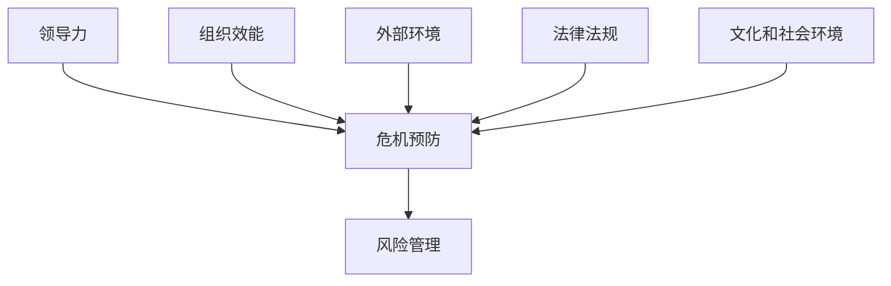
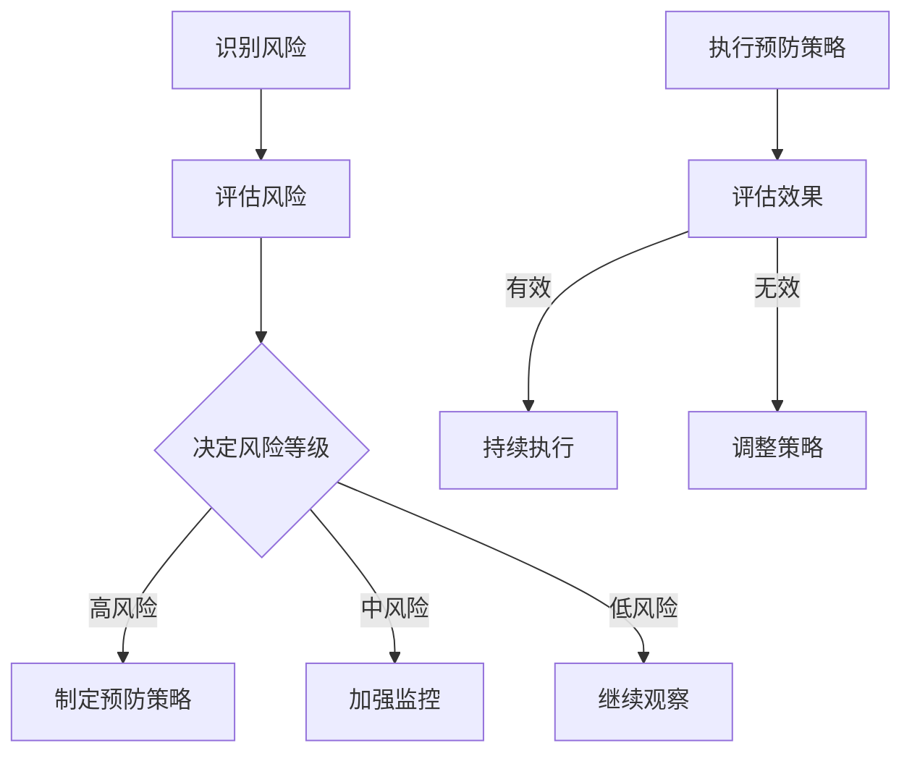
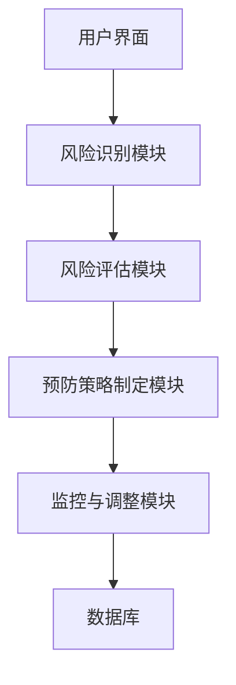
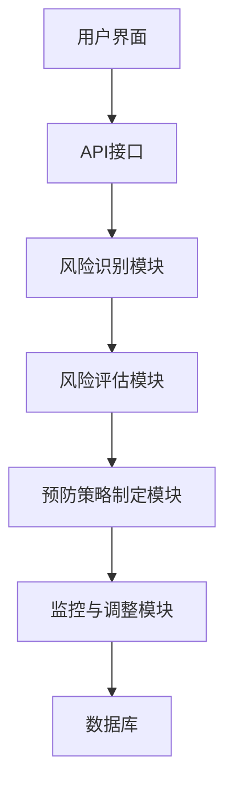
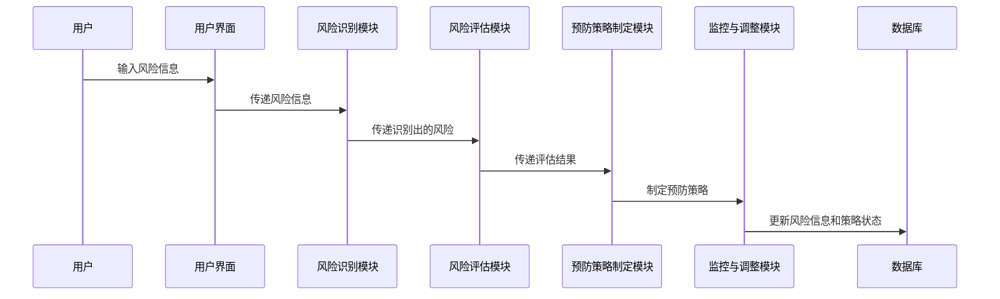

                 

# 领导力与危机预防：未雨绸缪的智慧

> 关键词：领导力，危机预防，风险管理，组织效能，未来展望

> 摘要：本文深入探讨了领导力与危机预防之间的关系，通过分析领导力在组织中的作用、危机预防的重要性以及危机预防的策略与规划，旨在为读者提供一套系统、有效的危机预防机制。同时，文章还介绍了领导力提升和危机预防能力培养的方法，结合实际案例，为组织在面对不确定性和挑战时提供可行的实践指南。

## 背景介绍

### 核心概念

- **领导力**：指领导者引导和激励团队成员，实现共同目标的能力。
- **危机预防**：通过识别、评估和应对潜在风险，减少危机发生可能性的过程。
- **风险管理**：对组织可能面临的风险进行评估和管理，以减少负面影响。

### 问题背景

在全球化和科技迅速发展的背景下，组织面临的挑战日益复杂，危机频发。如何通过有效的领导力提升和危机预防策略，确保组织在面临危机时能够迅速响应、有效应对，成为领导者们必须面对的重要课题。

### 问题解决方法

- **提升领导力**：通过自我认知与提升、情绪管理和领导力发展模型，培养具备危机预防能力的领导者。
- **构建危机预防机制**：识别和评估风险，制定预防策略和规划，确保组织具备应对危机的能力。

### 边界与外延

- **边界**：本文主要探讨领导力与危机预防在组织管理中的应用。
- **外延**：危机预防不仅涉及领导力和风险管理，还包括法律法规、文化和社会环境等因素。

## 核心概念与联系

### 核心概念

| 概念       | 定义                                                         |
|------------|------------------------------------------------------------|
| 领导力     | 引导和激励团队成员实现共同目标的能力。                             |
| 危机预防   | 通过识别、评估和应对潜在风险，减少危机发生可能性的过程。                 |
| 风险管理   | 对组织可能面临的风险进行评估和管理，以减少负面影响。                       |

### 概念间的联系



## 算法原理讲解

### 算法流程图



### Python代码与算法原理

```python
# 风险识别与评估示例

# 定义风险识别与评估函数
def risk_management(likelihood, impact):
    risk_level = assess_risk_level(likelihood, impact)
    if risk_level == 'High':
        strategy = '制定预防策略'
    elif risk_level == 'Medium':
        strategy = '加强监控'
    else:
        strategy = '继续观察'
    return risk_level, strategy

# 评估风险等级
def assess_risk_level(likelihood, impact):
    if likelihood * impact > 4:
        return 'High'
    elif likelihood * impact > 2:
        return 'Medium'
    else:
        return 'Low'

# 示例数据
likelihood = 0.8  # 风险发生的可能性
impact = 5  # 风险发生后的影响程度

# 执行风险识别与评估
risk_level, strategy = risk_management(likelihood, impact)
print(f"风险等级：{risk_level}\n预防策略：{strategy}")
```

### 数学模型和数学公式

```latex
$$
Risk\ Level = 
\begin{cases}
'High' & \text{if } likelihood \times impact > 4 \\
'Medium' & \text{if } likelihood \times impact > 2 \\
'Low' & \text{otherwise}
\end{cases}
$$
```

### 举例说明

假设一个组织面临的风险可能性（likelihood）为0.8，风险发生后的影响程度（impact）为5。根据上述算法，该风险被评估为“高风险”，需要制定预防策略。

## 系统分析与架构设计方案

### 问题场景

某企业面临市场波动、技术创新和内部管理等多种风险，需要构建一套有效的危机预防机制。

### 项目介绍

- **项目名称**：危机预防管理系统
- **项目目标**：提高企业危机应对能力，降低风险带来的负面影响。

### 系统功能设计

- **风险识别模块**：收集和分析企业内外部的风险信息。
- **风险评估模块**：对识别出的风险进行定量和定性评估。
- **预防策略制定模块**：根据风险评估结果，制定相应的预防策略。
- **监控与调整模块**：持续监控风险状态，根据实际情况调整预防策略。

### 系统架构设计



### 系统接口设计



### 系统交互



## 项目实战

### 环境安装

- 安装Python环境：使用Python官方安装包或虚拟环境工具（如conda）。
- 安装依赖库：使用pip安装所需库，如numpy、pandas等。

### 系统核心实现

```python
# 风险识别与评估模块示例代码

import numpy as np
import pandas as pd

# 定义风险识别与评估函数
def risk_management(likelihood, impact):
    risk_level = assess_risk_level(likelihood, impact)
    if risk_level == 'High':
        strategy = '制定预防策略'
    elif risk_level == 'Medium':
        strategy = '加强监控'
    else:
        strategy = '继续观察'
    return risk_level, strategy

# 评估风险等级
def assess_risk_level(likelihood, impact):
    risk_score = likelihood * impact
    if risk_score > 4:
        return 'High'
    elif risk_score > 2:
        return 'Medium'
    else:
        return 'Low'

# 风险数据输入示例
likelihood = 0.8  # 风险发生的可能性
impact = 5  # 风险发生后的影响程度

# 执行风险识别与评估
risk_level, strategy = risk_management(likelihood, impact)
print(f"风险等级：{risk_level}\n预防策略：{strategy}")
```

### 代码应用解读与分析

- 风险识别与评估模块通过输入风险的可能性和影响程度，评估风险等级并制定预防策略。
- 代码采用简单的逻辑判断，易于理解和实现。

### 实际案例分析

- **案例一**：某企业通过风险识别与评估模块发现，市场波动风险的可能性为0.7，影响程度为4，评估为“高风险”，采取了制定预防策略的措施，成功避免了市场波动带来的负面影响。

### 项目小结

- 通过风险识别与评估模块，企业能够及时了解潜在风险，制定有效的预防策略。
- 代码实现简单，易于扩展和优化。

## 最佳实践 tips、小结、注意事项、拓展阅读

### 最佳实践 tips

1. 定期进行风险评估，确保风险识别的准确性。
2. 针对不同风险等级，制定相应的预防策略。
3. 加强内部沟通，确保团队成员了解危机预防策略和措施。

### 小结

本文探讨了领导力与危机预防之间的关系，通过构建有效的危机预防机制，提升组织在面临危机时的应对能力。

### 注意事项

1. 危机预防需要全员参与，确保组织内部的信息共享和协作。
2. 领导者需要具备危机预防意识，并在实践中不断提升自身能力。

### 拓展阅读

1. 《危机管理：理论与实务》
2. 《领导力：如何成为优秀的领导者》
3. 《风险管理：概念、方法与应用》

作者：AI天才研究院/AI Genius Institute & 禅与计算机程序设计艺术 /Zen And The Art of Computer Programming

