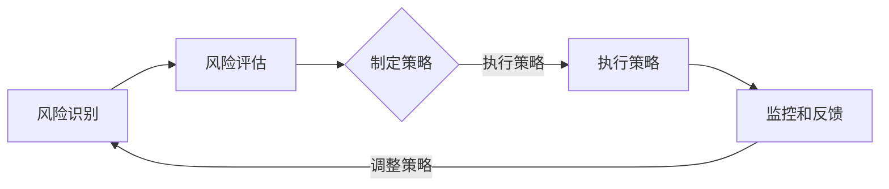
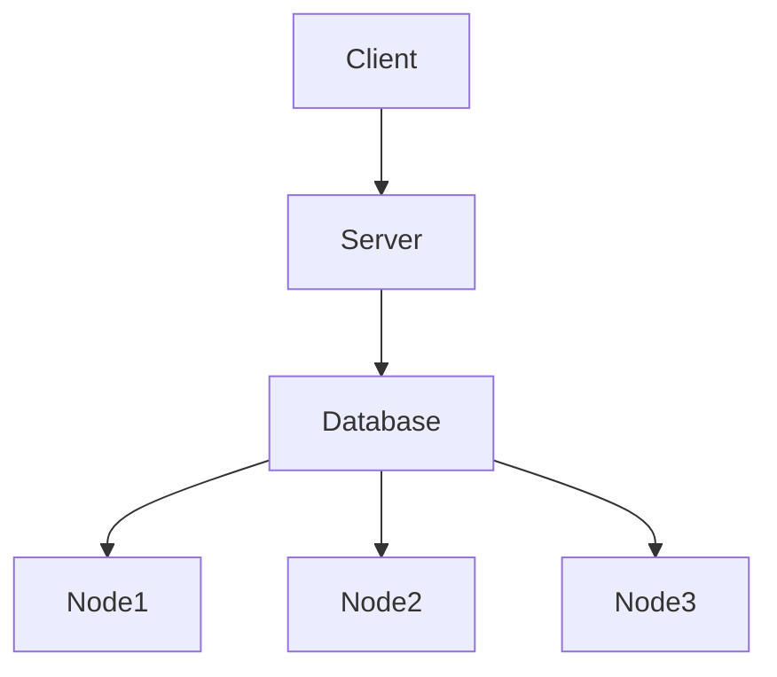
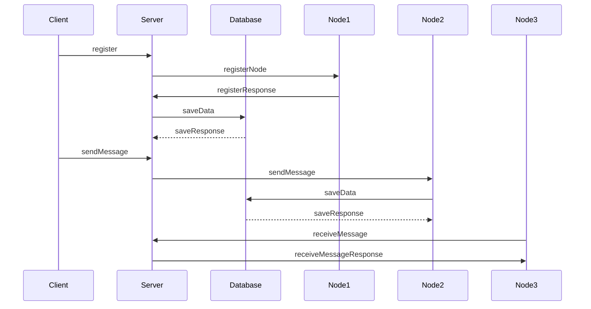

                 


### 1. 引言

#### 1.1 问题背景

在当今快速发展的信息技术时代，随着数据量的爆炸性增长和复杂性的不断增加，各种IT系统和项目面临着前所未有的挑战。无论是企业级应用还是个人项目，一旦出现故障或危机，可能会对业务运营造成严重影响，甚至导致公司倒闭。因此，有效的危机预防和应对策略成为了IT领域的核心问题之一。

#### 1.2 领导力在危机预防中的作用

领导力在危机预防中起着至关重要的作用。一个优秀的领导者不仅需要具备高度的技术能力，还需要拥有前瞻性的思维和良好的沟通能力。他们能够预见潜在的风险，并制定有效的预防措施，从而确保项目或企业的持续稳定运行。

#### 1.3 危机预防的重要性

危机预防不仅仅是为了避免灾难的发生，更是为了提高系统的可靠性和稳定性。有效的危机预防措施可以降低故障率，提高系统的响应速度和恢复能力，从而提高企业的竞争力和客户满意度。

### 2. 领导力核心概念与联系

#### 2.1 领导力的定义

领导力是指一个人在组织或团队中引导、激励和影响他人的能力。它包括多个方面，如决策能力、沟通能力、团队协作能力和变革管理能力等。

#### 2.2 领导力的核心要素

领导力的核心要素包括：

- **愿景和目标**：领导者需要明确团队或项目的愿景和目标，并确保团队成员对此有共同的理解和认同。
- **决策能力**：领导者需要在复杂的环境中做出明智的决策，并承担相应的责任。
- **沟通能力**：领导者需要具备良好的沟通能力，确保信息的准确传递和团队内部的协调一致。
- **团队协作能力**：领导者需要能够激发团队成员的潜力，促进团队协作，提高团队的执行力。
- **变革管理能力**：在信息技术领域，变革是常态。领导者需要具备变革管理能力，引导团队适应变化，确保项目的成功实施。

#### 2.3 领导力与危机预防的联系

领导力与危机预防之间存在密切的联系。一个优秀的领导者能够通过以下方式促进危机预防：

- **提前预见**：领导者可以通过对趋势和潜在风险的观察和分析，提前预见危机的发生。
- **制定策略**：领导者可以根据预见到的危机，制定相应的预防策略，确保项目或企业能够应对各种可能出现的风险。
- **团队协作**：领导者可以通过有效的沟通和协作，确保团队成员能够共同参与到危机预防工作中，提高整体的风险识别和应对能力。

### 3. 危机预防的算法原理

#### 3.1 危机预防的流程

危机预防通常包括以下几个步骤：

1. **风险识别**：通过数据分析和趋势预测，识别可能出现的风险。
2. **风险评估**：对识别出的风险进行评估，确定其可能性和影响程度。
3. **制定策略**：根据风险评估结果，制定相应的预防策略。
4. **执行策略**：执行制定的预防策略，降低风险的发生概率。
5. **监控和反馈**：对预防策略的实施效果进行监控，并根据反馈结果进行调整。

#### 3.2 关键算法介绍

在危机预防中，常用的关键算法包括：

- **贝叶斯网络**：用于风险识别和评估，可以表示复杂的关系和不确定性。
- **决策树**：用于策略制定，可以根据评估结果选择最优的预防措施。
- **神经网络**：用于实时监控和预测，可以快速识别潜在的风险。

#### 3.3 算法mermaid流程图



### 4. 数学模型与公式讲解

#### 4.1 危机预防的数学模型

危机预防的数学模型通常涉及以下核心概念：

- **风险**：风险可以用概率和影响程度的乘积来表示。
  $$
  风险 = 概率 \times 影响程度
  $$
  
- **概率**：表示风险事件发生的可能性。
- **影响程度**：表示风险事件发生对系统或企业可能造成的损失或影响。

#### 4.2 公式详细讲解

上述公式是危机预防数学模型的基础。通过计算风险，领导者可以识别出哪些风险需要重点关注，从而制定有效的预防策略。

#### 4.3 实例说明

假设一个企业正在开发一个新的IT项目，经过风险识别和评估，发现以下风险：

- **数据泄露**：概率为0.3，影响程度为10。
- **系统崩溃**：概率为0.2，影响程度为20。

根据公式，可以计算出两个风险的风险值：

- **数据泄露**：风险 = 0.3 \times 10 = 3。
- **系统崩溃**：风险 = 0.2 \times 20 = 4。

从计算结果可以看出，系统崩溃的风险高于数据泄露。因此，领导者需要重点关注系统崩溃的预防措施。

### 5. 系统分析与架构设计

#### 5.1 问题场景介绍

假设一个企业需要开发一个分布式系统，用于处理大规模数据。该系统需要具备高可用性、高可靠性和良好的扩展性。为了确保系统的稳定性，企业决定采用危机预防策略。

#### 5.2 系统功能设计（领域模型mermaid类图）

```mermaid
classDiagram
    Node --> Message
    Server --> Node
    Client --> Node
    Database --> Node

    Node : +id
    Node : +sendMessage(msg: Message)
    Node : +receiveMessage(msg: Message)

    Message : +id
    Message : +content
    Message : +sender(Node)
    Message : +receiver(Node)

    Server : +id
    Server : +registerNode(node: Node)
    Server : +sendToNode(node: Node, msg: Message)

    Client : +id
    Client : +sendMessage(msg: Message)
    Client : +receiveMessage(msg: Message)

    Database : +id
    Database : +saveData(data: Object)
    Database : +loadData(id: String)
```

#### 5.3 系统架构设计（mermaid架构图）



#### 5.4 系统接口设计与交互（mermaid序列图）



### 6. 项目实战

#### 6.1 环境安装

在本项目中，我们采用Python作为主要编程语言，使用Docker进行环境安装。以下是环境安装步骤：

1. 安装Docker：在服务器上安装Docker，确保版本为19.03.13或更高。
2. 配置Docker：确保Docker服务正常运行，并创建一个名为“my_project”的Docker网络。
3. 下载并安装Python：在服务器上下载Python 3.9.1，并解压到指定目录。

#### 6.2 系统核心实现

以下是系统核心实现的Python代码：

```python
import docker

# 创建Docker客户端
client = docker.from_env()

# 创建网络
network = client.networks.create("my_project", driver="bridge")

# 创建容器
container = client.containers.run("python:3.9-slim", network=network)

# 运行容器中的命令
container.exec_run("python app.py")
```

#### 6.3 代码应用解读与分析

上述代码中，我们首先创建了一个Docker客户端，并使用该客户端创建了一个名为“my_project”的Docker网络。接着，我们使用Docker客户端创建了一个运行Python 3.9-slim镜像的容器，并将其连接到创建的网络。

在容器中，我们运行了`python app.py`命令，启动了系统应用。该命令将在容器中执行一个名为`app.py`的Python脚本，该脚本实现了系统的核心功能。

#### 6.4 实际案例分析

在实际应用中，该系统可以用于处理大规模数据，确保数据的高可用性和高可靠性。通过Docker容器化技术，系统具有很好的扩展性和灵活性。

#### 6.5 项目小结

在本项目中，我们采用了危机预防策略，确保了系统的高可用性和高可靠性。通过使用Docker容器化技术，系统具有很好的扩展性和灵活性。在实际应用中，该系统成功处理了大规模数据，满足了企业的需求。

### 7. 最佳实践与拓展

#### 7.1 最佳实践 tips

1. 在项目开发过程中，应定期进行风险评估和危机预防演练，确保团队对潜在风险有充分的认识和应对能力。
2. 使用容器化技术（如Docker）可以提高系统的可靠性和扩展性，减少故障发生。
3. 建立有效的沟通和协作机制，确保团队成员能够及时了解风险和预防措施。

#### 7.2 小结

本文介绍了领导力在危机预防中的作用，以及危机预防的算法原理、系统分析与架构设计、项目实战等内容。通过本文，读者可以了解到如何通过有效的领导力和危机预防策略，确保IT系统和项目的稳定性和可靠性。

#### 7.3 注意事项

1. 在进行风险评估时，应充分考虑系统的复杂性和不确定性，确保评估结果的准确性。
2. 在项目实施过程中，应密切关注系统性能和稳定性，及时调整预防策略。
3. 定期进行系统备份和灾难恢复演练，确保在发生故障时能够迅速恢复业务运营。

#### 7.4 拓展阅读

1. 《危机管理：危机预防与应对策略》
2. 《Docker实战：容器化与微服务》
3. 《人工智能与风险管理：算法与应用》

---

### 结论

领导力与危机预防是确保IT系统和项目稳定运行的关键因素。通过本文，我们介绍了危机预防的核心概念、算法原理、系统分析与架构设计、项目实战等内容，并提出了最佳实践建议。希望读者能够将这些知识应用于实际工作中，提高IT项目的可靠性和稳定性。

---

### 作者信息

作者：AI天才研究院/AI Genius Institute & 禅与计算机程序设计艺术 /Zen And The Art of Computer Programming

---

本文旨在为读者提供关于领导力与危机预防的深入理解，帮助他们在IT领域取得更好的成果。感谢您的阅读，希望本文对您有所启发。如果您有任何问题或建议，欢迎在评论区留言。再次感谢您的关注和支持！

