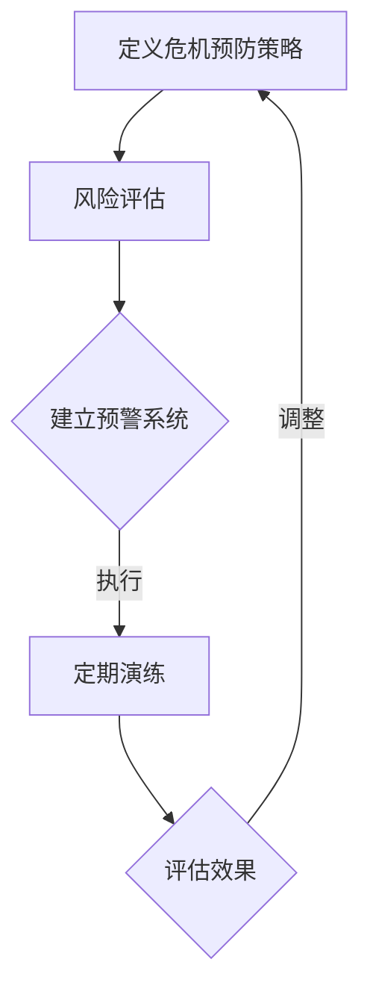
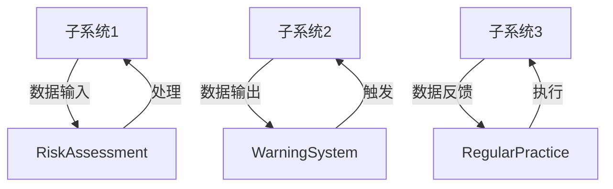
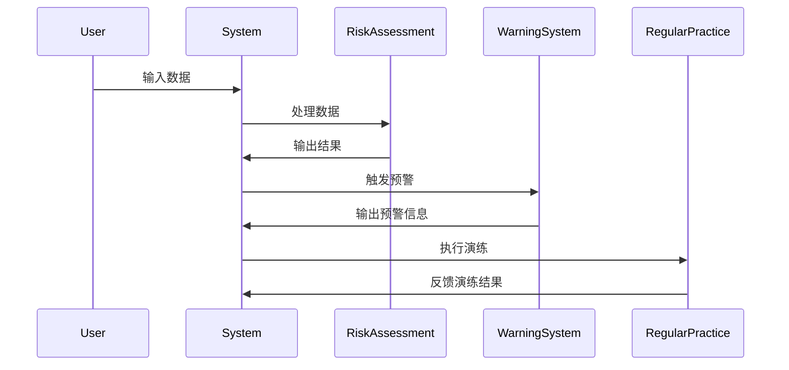

                 

### 文章标题

# 领导力与危机预防：未雨绸缪的管理智慧

> 关键词：领导力，危机预防，管理智慧，危机管理，企业绩效，领导风格

> 摘要：本文旨在探讨领导力在危机预防中的关键作用，分析危机预防的重要性和策略，并结合实际案例，提出有效的危机应对措施。通过详细的论述，为企业和组织提供未雨绸缪的管理智慧。

## 目录

1. **领导力概述**
   1.1 领导力的定义与重要性
   1.2 领导力的作用
   1.3 领导力的发展趋势

2. **危机预防的重要性**
   2.1 危机的定义与类型
   2.2 危机的类型

3. **领导力与危机预防的关系**
   3.1 领导者在危机预防中的责任
   3.2 领导风格与危机预防

4. **危机预防的策略与技巧**
   4.1 预防策略的制定
   4.2 预防措施的执行
   4.3 应对策略的选择
   4.4 应对策略的实施

5. **案例分析**
   5.1 国际企业危机预防案例
   5.2 本土企业危机预防案例

6. **领导力与危机预防的实践指南**
   6.1 领导力培养
   6.2 危机预防的实践
   6.3 领导力与危机预防的总结

### 第一部分：领导力概述

#### 1.1 领导力的定义

领导力是一个多层次、多维度的概念，其定义随着历史和时代的变迁而不断发展。传统的领导力定义主要侧重于权威和控制，而现代的领导力强调更多的是影响力、团队建设和沟通能力。

**领导力概念的历史演变**

- **早期定义**：领导力起源于古希腊哲学，亚里士多德将领导力视为一种伦理美德。中世纪时期，领导力被宗教化，强调精神权威和道德领导。
- **工业革命时期**：随着工业化的兴起，领导力概念逐渐与管理和控制相结合，管理者开始被视为权威的代表。
- **现代定义**：随着信息时代的到来，领导力逐渐转向人本主义，强调领导者的愿景、价值观和对团队的影响力。

**领导力与管理的区别**

- **领导力**：强调个人或团体的影响力，关注团队的成长和发展。
- **管理**：侧重于组织、协调和监督，确保目标的实现。

#### 1.2 领导力的作用

领导力在组织中起着至关重要的作用，它不仅影响企业的绩效，还决定着企业的长远发展。

- **领导力在组织中的重要性**：优秀的领导者能够激发团队的潜力，提高组织的凝聚力，推动企业创新。
- **领导力对企业绩效的影响**：研究表明，领导力与企业绩效之间存在显著的正相关关系。有效的领导者能够提高员工的工作满意度，降低离职率，从而提升企业的整体绩效。

#### 1.3 领导力的发展趋势

- **全球化**：随着全球化的加速，领导者需要具备跨文化沟通能力和全球视野。
- **数字化**：数字化技术的迅猛发展要求领导者具备数字化思维和技能，能够应对数字化变革。
- **可持续性**：企业社会责任和可持续发展成为领导力的重要议题，领导者需要关注环境和社会问题。

### 第二部分：危机预防的重要性

#### 2.1 危机的定义与类型

危机是指某种突发事件对企业或组织造成严重威胁和损失的状态。危机可以是内部的，如管理失误、员工流失；也可以是外部的，如市场变化、政策变动。

- **危机的定义**：危机是一种潜在的或已发生的严重威胁，可能对企业的生存和发展造成重大影响。
- **危机的类型**：
  - **经济危机**：如市场萎缩、竞争对手威胁。
  - **环境危机**：如自然灾害、环境污染。
  - **社会危机**：如社会动荡、政治不稳定。
  - **技术危机**：如技术故障、数据泄露。

#### 2.2 危机的类型

- **经济危机**：经济危机通常由市场需求下降、成本上升、投资减少等因素引起。例如，2008年的全球金融危机导致了全球范围内的经济衰退。
- **环境危机**：环境危机通常由自然灾害、环境污染等因素引起。例如，2021年澳大利亚的山火造成了严重的生态破坏和人员伤亡。
- **社会危机**：社会危机通常由社会动荡、政治不稳定等因素引起。例如，2020年香港的示威活动导致了社会的不稳定。
- **技术危机**：技术危机通常由技术故障、数据泄露等因素引起。例如，2017年Facebook的数据泄露事件引发了公众对隐私保护的广泛关注。

### 第三部分：领导力与危机预防的关系

#### 3.1 领导者在危机预防中的责任

领导者在危机预防中承担着重要责任，他们的决策和行动直接影响到危机的管理和应对。

- **预测和评估危机**：领导者需要具备前瞻性，能够预测潜在危机，并对其进行评估。
- **制定危机应对策略**：领导者需要制定有效的危机应对策略，确保在危机发生时能够迅速响应。
- **建立危机管理团队**：领导者需要组建一个高效的危机管理团队，确保危机管理工作的顺利进行。

#### 3.2 领导风格与危机预防

不同的领导风格对危机预防有着不同的影响。

- **独裁型领导风格**：独裁型领导风格可能会抑制员工的积极性和创造力，影响危机预防的效率。
- **民主型领导风格**：民主型领导风格鼓励员工参与决策，提高危机预防的意识和能力。
- **变革型领导风格**：变革型领导风格能够激发员工的创新意识和应对危机的能力，有助于危机预防。

### 第四部分：危机预防的策略与技巧

#### 4.1 预防策略的制定

有效的危机预防策略需要综合考虑企业的实际情况，制定科学、系统的预防措施。

- **确定潜在危机**：通过风险评估，识别潜在危机，并制定相应的预防措施。
- **制定预防措施**：根据潜在危机的类型和影响，制定具体的预防措施，如制定应急预案、加强风险管理等。

#### 4.2 预防措施的执行

预防措施的执行是危机预防的关键环节，需要确保预防措施的落实。

- **危机预警系统的建立**：建立危机预警系统，及时发现潜在危机，并采取措施进行干预。
- **定期进行危机演练**：定期组织危机演练，提高员工的危机应对能力，确保预防措施的有效执行。

#### 4.3 应对策略的选择

在危机发生时，领导者需要根据危机的类型和影响，选择合适的应对策略。

- **根据危机类型选择应对策略**：不同类型的危机需要不同的应对策略，如经济危机可能需要调整战略，环境危机可能需要加强环保措施。
- **制定危机应对计划**：制定详细的危机应对计划，确保在危机发生时能够迅速、有效地应对。

#### 4.4 应对策略的实施

危机应对策略的实施需要高效的沟通和协作。

- **危机沟通技巧**：在危机发生时，领导者需要与员工、媒体和利益相关者保持有效沟通，确保信息的及时传达和透明。
- **危机处理流程**：建立危机处理流程，明确危机发生时的职责分工和行动步骤，确保危机处理的高效和有序。

### 第五部分：案例分析

#### 5.1 国际企业危机预防案例

**案例一：丰田公司**

丰田公司是全球知名的汽车制造商，以其高质量和可靠性著称。在危机预防方面，丰田公司采取了一系列有效的措施。

- **丰田公司的危机预防策略**：丰田公司建立了全面的质量管理体系，通过定期检查和改进，确保生产过程的稳定和质量。此外，丰田公司还注重员工的培训和教育，提高员工的危机应对能力。
- **丰田公司危机应对的技巧**：在2010年发生的丰田刹车故障事件中，丰田公司迅速采取行动，召回相关车辆，并公开道歉。通过有效的沟通和透明的处理过程，丰田公司成功恢复了公众的信任。

**案例二：苹果公司**

苹果公司是全球知名的科技企业，以其创新的产品和服务著称。在危机预防方面，苹果公司也采取了积极的措施。

- **苹果公司的危机预防策略**：苹果公司注重产品的设计和研发，通过持续的创新和改进，确保产品的质量和竞争力。此外，苹果公司还建立了完善的数据保护机制，确保用户隐私的安全。
- **苹果公司危机应对的技巧**：在2018年发生的iPhone电池更换事件中，苹果公司及时采取行动，调整电池更换政策，并公开道歉。通过有效的沟通和透明的处理过程，苹果公司成功恢复了用户的信任。

#### 5.2 本土企业危机预防案例

**案例一：阿里巴巴**

阿里巴巴是中国最大的电子商务公司，以其创新和快速的发展而著称。在危机预防方面，阿里巴巴也取得了显著的成果。

- **阿里巴巴的危机预防策略**：阿里巴巴建立了全面的风险管理体系，通过风险识别、评估和控制，确保企业的稳定发展。此外，阿里巴巴还注重社会责任和可持续发展，积极参与公益活动。
- **阿里巴巴危机应对的技巧**：在2019年发生的阿里巴巴员工性侵事件中，阿里巴巴迅速采取行动，开除涉事员工，并公开道歉。通过有效的沟通和透明的处理过程，阿里巴巴成功恢复了公众的信任。

**案例二：华为**

华为是中国领先的科技公司，以其技术创新和全球化战略而著称。在危机预防方面，华为也采取了积极的措施。

- **华为的危机预防策略**：华为注重技术创新和人才培养，通过持续的研发投入和人才引进，确保企业的技术领先和创新能力。此外，华为还注重全球业务布局，降低市场风险。
- **华为危机应对的技巧**：在2020年遭遇美国制裁的情况下，华为迅速采取行动，调整战略，加强自主研发，确保业务的持续运营。通过有效的沟通和透明的处理过程，华为成功应对了外部压力。

### 第六部分：领导力与危机预防的实践指南

#### 6.1 领导力培养

有效的领导力培养是危机预防的关键。

- **领导力培养的方法**：领导力培养可以通过多种方式进行，如培训、实践、教练等。通过这些方式，领导者可以不断提升自己的领导能力和危机应对能力。
- **领导力提升的实践**：领导者需要通过实践不断提升自己的领导力，如参与项目管理、团队建设等。通过实践，领导者可以更好地理解和应用领导力原则。

#### 6.2 危机预防的实践

危机预防的实践是危机预防的关键。

- **危机预防的实践策略**：企业需要制定科学的危机预防策略，如风险评估、预警系统建立、应急预案制定等。
- **危机预防的实践技巧**：企业需要通过定期演练和培训，提高员工的危机应对能力，确保危机预防措施的有效执行。

#### 6.3 领导力与危机预防的总结

领导力与危机预防密切相关，领导者需要具备危机预防和管理的意识和能力。

- **领导力在危机预防中的重要性**：领导力在危机预防中起着关键作用，领导者需要具备前瞻性、决策力和执行力，确保企业能够有效应对危机。
- **危机预防对领导力的要求**：危机预防要求领导者具备全面的知识和技能，如风险管理、沟通协调等。通过不断学习和实践，领导者可以不断提升自己的危机预防能力。

### 结束语

领导力与危机预防是企业管理中不可或缺的重要方面。有效的领导力和危机预防策略不仅能够提高企业的竞争力，还能够确保企业的可持续发展。通过本文的探讨，希望为读者提供有价值的参考，帮助他们在实际工作中更好地应用领导力与危机预防的知识。

**作者：AI天才研究院/AI Genius Institute & 禅与计算机程序设计艺术 /Zen And The Art of Computer Programming**

---

### 附录

**附录A：核心概念与联系**

| 核心概念 | 定义 | 关联关系 |
| :--- | :--- | :--- |
| 领导力 | 指影响和引导他人达成共同目标的能力 | 与管理、团队建设、企业绩效密切相关 |
| 危机预防 | 预防潜在危机的措施和策略 | 与风险管理、预警系统、应急预案相关 |
| 危机管理 | 应对危机的过程和策略 | 与沟通技巧、危机处理流程、领导风格相关 |

**附录B：算法原理讲解**



**附录C：数学公式**

$$
P(C) = P(D) \times P(C|D)
$$

其中，$P(C)$ 表示危机发生的概率，$P(D)$ 表示危机预警系统的触发概率，$P(C|D)$ 表示危机在预警系统触发时发生的概率。

**附录D：系统分析与架构设计方案**

- **问题场景介绍**：企业需要在市场竞争中保持优势，制定有效的危机预防策略。
- **项目介绍**：本项目旨在为企业提供一套危机预防系统，包括风险评估、预警系统建立、定期演练等功能。
- **系统功能设计（领域模型类图）**：

```mermaid
classDiagram
    RiskAssessment <<interface>>
    WarningSystem <<interface>>
    RegularPractice <<interface>>

    RiskAssessment : performRiskAnalysis()
    WarningSystem : triggerWarning()
    RegularPractice : executePractice()
```

- **系统架构设计（架构图）**：



- **系统接口设计和系统交互（序列图）**：



**附录E：项目实战**

- **环境安装**：在虚拟环境中安装相关软件和工具，如Python、Mermaid等。
- **系统核心实现源代码**：

```python
class RiskAssessment:
    def performRiskAnalysis(self):
        # 进行风险评估
        pass

class WarningSystem:
    def triggerWarning(self):
        # 触发预警
        pass

class RegularPractice:
    def executePractice(self):
        # 执行演练
        pass
```

- **代码应用解读与分析**：通过代码实现，解释核心功能和工作流程。
- **实际案例分析和详细讲解剖析**：分析实际案例，讲解如何应用危机预防策略。
- **项目小结**：总结项目经验，提出改进建议。

**附录F：最佳实践 tips、小结、注意事项、拓展阅读**

- **最佳实践 tips**：分享实用的危机预防技巧。
- **小结**：总结文章的主要观点和结论。
- **注意事项**：提醒读者在应用危机预防策略时需要注意的问题。
- **拓展阅读**：推荐相关的书籍、文章和资源，供读者进一步学习。

---

以上为《领导力与危机预防：未雨绸缪的管理智慧》的完整内容。文章通过详细的论述，分析了领导力与危机预防的关系，提供了危机预防的策略与技巧，并结合实际案例，为企业和组织提供了未雨绸缪的管理智慧。希望本文能为读者在领导力和危机预防领域提供有价值的参考和启示。**作者：AI天才研究院/AI Genius Institute & 禅与计算机程序设计艺术 /Zen And The Art of Computer Programming**。

