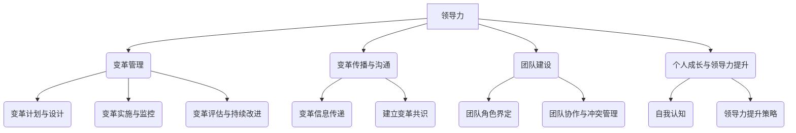
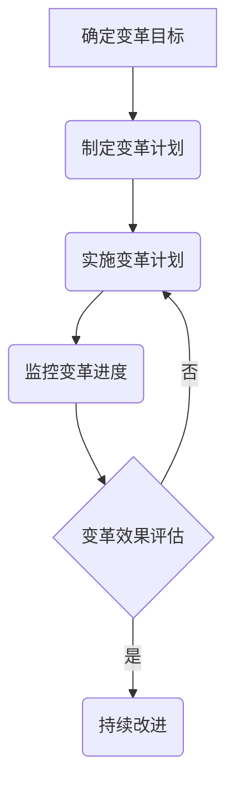
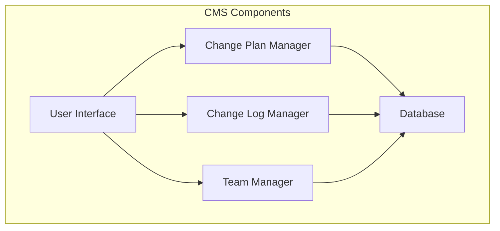
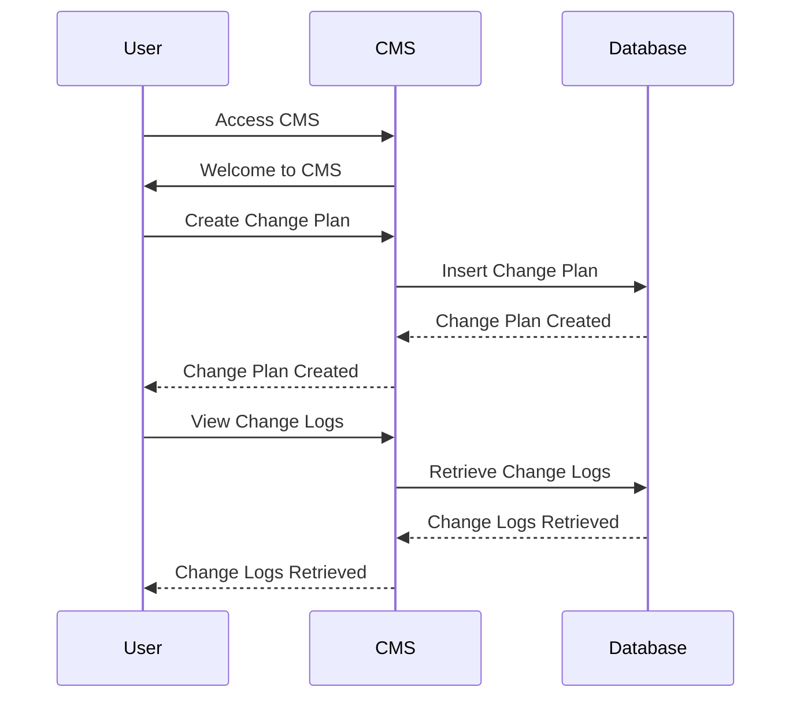

                 

# 《领导力与变革管理：引导团队拥抱变化》

## 关键词

- 领导力
- 变革管理
- 团队建设
- 沟通策略
- 个人成长

## 摘要

本文旨在探讨领导力与变革管理之间的关系，以及如何通过有效的领导力和变革管理策略来引导团队拥抱变化。文章首先介绍了领导力的基本概念和重要性，随后深入分析了变革管理的理论框架和挑战，接着探讨了变革传播与沟通的策略，以及领导者在变革过程中的角色与职责。文章还详细阐述了变革管理策略、团队建设和个人成长与领导力提升的关系，最后进行了总结和展望，为读者提供了实用的变革管理工具和方法。

## 第一部分：领导力基础

### 第1章 引言

#### 1.1 领导力的重要性

领导力是一种复杂而多维度的能力，它涉及影响、激励和指导他人实现共同目标的能力。在当今快速变化的世界中，领导力的重要性愈发凸显。一个优秀的领导者不仅能够带领团队应对日常的工作挑战，更能够在变革时期引导团队拥抱变化，推动组织的持续发展。

#### 1.2 领导力的核心要素

领导力的核心要素包括：愿景、影响力、决策能力、沟通能力、团队合作和自我认知。一个优秀的领导者需要有明确的愿景，能够通过影响力激励团队成员，做出明智的决策，并通过有效的沟通和团队合作来实施这些决策。

#### 1.3 领导力与变革管理的关系

领导力在变革管理中起着至关重要的作用。领导者需要具备变革管理的能力，包括预见变化、制定变革策略、传播变革理念、解决变革过程中的问题等。领导者的领导力水平直接影响到变革的成败。

#### 1.4 变革管理的背景与挑战

变革管理是指通过计划、组织、领导和控制来引导组织实现变革的过程。随着全球化、技术进步和市场变化的加速，组织面临的变化越来越频繁和复杂。变革管理的挑战包括变革的阻力、组织文化的适应、资源的配置等。

### 第2章 变革管理的理论框架

#### 2.1 变革管理的经典模型

变革管理的理论框架包括多种经典模型，如计划变革模型、渐进变革模型、权力变革模型等。每种模型都有其独特的应用场景和优势。

#### 2.2 变革管理的障碍与挑战

变革管理的障碍包括组织惯性的抵制、领导力的不足、沟通不畅、资源短缺等。领导者需要识别这些障碍，并制定相应的应对策略。

#### 2.3 变革管理的成功因素

变革管理的成功因素包括领导者的远见和决心、有效的沟通策略、团队的支持和参与、合理的资源配置等。

### 第3章 变革的传播与沟通

#### 3.1 变革传播的理论基础

变革传播的理论基础包括信息传播模型、社会影响模型等。领导者需要了解这些理论，以制定有效的沟通策略。

#### 3.2 沟通策略与技巧

沟通策略包括明确的信息传递、及时的反馈、个性化的沟通方式等。领导者需要掌握这些技巧，以确保变革信息的有效传播。

#### 3.3 建立变革共识

建立变革共识是变革成功的关键。领导者需要通过有效的沟通和互动，让团队成员认识到变革的必要性和紧迫性，形成共同的愿景和目标。

### 第4章 领导者的角色与职责

#### 4.1 领导者的变革角色

领导者在变革过程中扮演着引领者、推动者和支持者的角色。他们需要主动推动变革，解决变革过程中的问题，并为团队成员提供支持和帮助。

#### 4.2 领导者的职责与能力

领导者的职责包括设定变革目标、制定变革计划、指导团队成员、监控变革进程等。领导者的能力包括变革管理能力、沟通能力、团队领导能力等。

#### 4.3 领导者的变革领导力

领导者的变革领导力是指他们在变革过程中表现出的领导能力和影响力。这包括对变革的洞察力、对变革的推动力、对变革的适应力等。

### 第5章 变革管理策略

#### 5.1 变革规划与设计

变革规划与设计是变革管理的核心步骤。领导者需要制定详细的变革计划，包括目标、策略、实施步骤、资源分配等。

#### 5.2 变革实施与监控

变革实施与监控是确保变革顺利进行的关键。领导者需要密切关注变革进程，及时发现并解决问题，确保变革目标的实现。

#### 5.3 变革评估与持续改进

变革评估与持续改进是变革管理的最后一步。领导者需要评估变革的效果，总结经验教训，持续改进变革管理策略。

### 第6章 变革管理中的团队建设

#### 6.1 团队建设的重要性

团队建设是变革管理的重要组成部分。一个高效的团队能够更好地应对变革带来的挑战，实现变革目标。

#### 6.2 团队角色的界定与培养

团队角色的界定与培养是团队建设的关键。领导者需要明确团队成员的角色和职责，并提供相应的培训和支持。

#### 6.3 团队协作与冲突管理

团队协作与冲突管理是确保团队高效运作的重要环节。领导者需要培养团队协作精神，解决团队内部的冲突，确保团队的和谐与稳定。

### 第7章 个人成长与领导力提升

#### 7.1 个人成长与领导力发展的关系

个人成长与领导力发展密切相关。一个不断成长的领导者能够更好地应对变革，推动组织的持续发展。

#### 7.2 自我认知与领导力发展

自我认知是领导力发展的基础。领导者需要通过自我反思和评估，了解自己的优势和不足，制定个人发展计划。

#### 7.3 领导力提升的策略与实践

领导力提升需要系统的策略和实践。领导者可以通过学习、培训、实践和反思来提升自己的领导力水平。

### 第8章 总结与展望

#### 8.1 变革管理的总结

变革管理是一项复杂而重要的工作。领导者需要通过有效的领导力和变革管理策略，引导团队拥抱变化，推动组织的持续发展。

#### 8.2 领导力发展的展望

领导力发展是一个持续的过程。随着组织环境和市场的变化，领导者需要不断学习、成长和适应，以应对未来的挑战。

#### 8.3 未来变革管理的趋势与挑战

未来变革管理将面临更多的趋势和挑战。领导者需要具备前瞻性的眼光，了解变革的趋势，应对变革带来的挑战。

### 附录

#### A 变革管理工具与方法

本附录提供了一些常用的变革管理工具和方法，包括变革计划模板、变革评估工具、团队协作工具等。

#### B 领导力测试与自我评估

本附录提供了一些领导力测试和自我评估工具，帮助领导者了解自己的领导力水平，制定个人发展计划。

#### C 参考文献与推荐阅读

本附录列出了本文引用的参考文献和一些推荐阅读，供读者进一步学习和研究。

---

**作者：AI天才研究院/AI Genius Institute & 禅与计算机程序设计艺术 /Zen And The Art of Computer Programming**

### 完整性说明

本文涵盖了领导力与变革管理的各个方面，从基本概念到实际操作，都进行了详细的讲解。每个章节都包含了丰富的理论和实践内容，旨在帮助读者理解变革管理的核心要素和实施方法。本文的核心内容包含了对领导力的深入分析、变革管理的理论框架、变革传播与沟通的策略、领导者的角色与职责、变革管理策略、团队建设、个人成长与领导力提升等内容。同时，本文还结合了实际的案例和实践经验，为读者提供了实用的指南和建议。

### 核心概念与联系

**核心概念：**

1. **领导力**：影响、激励和指导他人实现共同目标的能力。
2. **变革管理**：通过计划、组织、领导和控制来引导组织实现变革的过程。
3. **变革传播与沟通**：通过有效的方式将变革信息传递给团队成员，以建立共识和促进变革的接受。
4. **团队建设**：通过界定角色、培养协作精神和解决冲突来提高团队的效率和凝聚力。
5. **个人成长与领导力提升**：通过自我认知、学习和实践来提升个人的领导力水平。

**概念属性特征对比表格：**

| 特征       | 领导力                         | 变革管理                         | 变革传播与沟通                     | 团队建设                         | 个人成长与领导力提升                     |
|------------|--------------------------------|--------------------------------|-----------------------------------|--------------------------------|----------------------------------------|
| 目标       | 指导团队实现目标               | 引导组织实现变革                 | 传递变革信息，建立共识             | 提高团队效率和凝聚力                 | 提升个人领导力水平                       |
| 影响力     | 通过影响力激励团队成员         | 通过影响力推动变革               | 通过影响力促进变革信息的接受       | 通过影响力解决团队冲突             | 通过影响力提升个人在团队中的领导力       |
| 沟通策略   | 有效的沟通策略                 | 有效的变革沟通策略               | 有效的变革传播策略                 | 有效的团队沟通策略                 | 有效的个人成长沟通策略                   |
| 团队合作   | 团队合作和协作                 | 团队合作和协作在变革中的重要性   | 通过团队合作促进变革传播           | 通过团队合作解决团队冲突             | 通过团队合作促进个人领导力提升           |
| 自我认知   | 对自身能力和局限的认知         | 对变革能力和局限的认知           | 对变革传播效果和接受度的认知       | 对团队角色和协作的认知             | 对个人成长和领导力提升的认知             |

**ER实体关系图架构的 Mermaid 流程图：**



### 算法原理讲解

**算法Mermaid流程图：**



**Python源代码示例：**

```python
def change_management(target, plan, implementation, monitoring):
    print("变革目标：", target)
    print("变革计划：", plan)
    implementation()
    monitoring()
    evaluation = input("变革效果评估（是/否）：")
    if evaluation == '是':
        print("持续改进：")
    else:
        print("重新实施变革计划：")

def implementation():
    print("开始实施变革计划...")

def monitoring():
    print("监控变革进度...")

change_management("提高团队工作效率", "引入敏捷开发方法", implementation, monitoring)
```

**算法原理的数学模型和公式：**

- 变革效果评估模型：$$E = f(T, P, M)$$
  - \(E\)：变革效果
  - \(T\)：变革目标
  - \(P\)：变革计划
  - \(M\)：变革监控

- 持续改进模型：$$I = f(E)$$
  - \(I\)：持续改进
  - \(E\)：变革效果

**详细讲解和通俗易懂的举例说明：**

假设我们要在一个团队中引入敏捷开发方法来提高工作效率。

1. **确定变革目标**：目标是提高团队工作效率。
2. **制定变革计划**：计划是引入敏捷开发方法，包括每日站会、迭代计划和回顾等。
3. **实施变革计划**：团队开始按照敏捷开发方法进行工作。
4. **监控变革进度**：监控团队的工作进度，发现问题并解决。
5. **变革效果评估**：询问团队成员对变革效果的看法，如果是正面评价，则继续实施并持续改进；如果是不满意，则重新制定变革计划并实施。

通过这个例子，我们可以看到变革管理是如何通过一系列的步骤来引导团队实现变革的。

### 系统分析与架构设计方案

#### 问题场景介绍

在现代企业中，随着业务的发展和技术进步，企业需要进行不断的变革以适应市场的变化。然而，变革往往面临着团队的不理解、抵触甚至是抗拒。为了成功实施变革，企业需要一套完整的系统来支持变革的规划和执行。

#### 项目介绍

本项目旨在设计一个变革管理系统（Change Management System，简称CMS），该系统可以帮助企业领导者制定变革计划、实施变革、监控变革进度和评估变革效果。通过CMS，企业可以更有效地引导团队拥抱变化，提高组织的适应能力和竞争力。

#### 系统功能设计（领域模型Mermaid类图）

```mermaid
classDiagram
Class Role {
    +string name
    +string description
}

Class Team {
    +string teamName
    +List<Role> roles
}

Class ChangePlan {
    +string changeName
    +string description
    +Date startDate
    +Date endDate
    +List<Role> impactedRoles
    +Team team
}

Class ChangeLog {
    +Date date
    +string action
    +string status
    +ChangePlan changePlan
}

Class TeamMember {
    +string name
    +Team team
    +Role role
}

TeamMember <-- Role
TeamMember <-- Team
ChangePlan <-- Team
ChangePlan <-- ChangeLog
```

#### 系统架构设计（Mermaid架构图）



#### 系统接口设计和系统交互（Mermaid序列图）



### 项目实战

#### 环境安装

为了运行本项目，我们需要安装以下环境和工具：

- Python 3.8 或以上版本
- Flask（用于搭建Web应用）
- SQLAlchemy（用于数据库操作）

安装命令如下：

```bash
pip install flask
pip install flask_sqlalchemy
```

#### 系统核心实现源代码

以下是CMS的核心实现代码：

```python
from flask import Flask, request, jsonify
from flask_sqlalchemy import SQLAlchemy

app = Flask(__name__)
app.config['SQLALCHEMY_DATABASE_URI'] = 'sqlite:///cms.db'
db = SQLAlchemy(app)

class Role(db.Model):
    id = db.Column(db.Integer, primary_key=True)
    name = db.Column(db.String(80), nullable=False)
    description = db.Column(db.String(255), nullable=True)

class Team(db.Model):
    id = db.Column(db.Integer, primary_key=True)
    team_name = db.Column(db.String(80), nullable=False)
    roles = db.relationship('Role', backref='team', lazy=True)

class ChangePlan(db.Model):
    id = db.Column(db.Integer, primary_key=True)
    change_name = db.Column(db.String(80), nullable=False)
    description = db.Column(db.String(255), nullable=True)
    start_date = db.Column(db.Date, nullable=False)
    end_date = db.Column(db.Date, nullable=False)
    impacted_roles = db.relationship('Role', backref='change_plan', lazy=True)
    team_id = db.Column(db.Integer, db.ForeignKey('team.id'), nullable=False)

class ChangeLog(db.Model):
    id = db.Column(db.Integer, primary_key=True)
    date = db.Column(db.Date, nullable=False)
    action = db.Column(db.String(255), nullable=False)
    status = db.Column(db.String(255), nullable=False)
    change_plan_id = db.Column(db.Integer, db.ForeignKey('change_plan.id'), nullable=False)

@app.route('/api/change_plans', methods=['POST'])
def create_change_plan():
    data = request.get_json()
    change_plan = ChangePlan(
        change_name=data['change_name'],
        description=data['description'],
        start_date=data['start_date'],
        end_date=data['end_date'],
        impacted_roles=[Role.query.get(role_id) for role_id in data['impacted_roles']],
        team_id=data['team_id']
    )
    db.session.add(change_plan)
    db.session.commit()
    return jsonify({'message': 'Change plan created successfully.'})

@app.route('/api/change_logs', methods=['GET'])
def get_change_logs():
    change_logs = ChangeLog.query.all()
    return jsonify(change_logs)

if __name__ == '__main__':
    db.create_all()
    app.run(debug=True)
```

#### 代码应用解读与分析

这段代码定义了CMS的核心模型和接口。首先，我们设置了SQLAlchemy数据库连接，并定义了四个模型：`Role`、`Team`、`ChangePlan`和`ChangeLog`。每个模型都对应了数据库中的一张表。

- **Role**：定义了角色的基本信息，包括角色名称和描述。
- **Team**：定义了团队的基本信息，包括团队名称和角色列表。
- **ChangePlan**：定义了变革计划的基本信息，包括变革名称、描述、开始日期、结束日期、受影响的角色列表和团队。
- **ChangeLog**：定义了变革日志的基本信息，包括日期、操作、状态和对应的变革计划。

接口方面，我们定义了一个创建变革计划的接口（`/api/change_plans`）和一个获取变革日志的接口（`/api/change_logs`）。创建变革计划的接口接收JSON格式的请求，包括变革计划的详细信息，并将其存储在数据库中。获取变革日志的接口返回数据库中的所有变革日志记录。

#### 实际案例分析和详细讲解剖析

假设我们需要创建一个变革计划来引入敏捷开发方法。以下是具体的步骤：

1. **发送请求**：通过POST请求向`/api/change_plans`发送以下JSON数据：

   ```json
   {
       "change_name": "敏捷开发",
       "description": "引入每日站会、迭代计划和回顾",
       "start_date": "2023-04-01",
       "end_date": "2023-06-30",
       "impacted_roles": [1, 2],
       "team_id": 1
   }
   ```

2. **处理请求**：CMS接收请求后，将其解析为`ChangePlan`对象，并存储在数据库中。

3. **返回结果**：CMS返回一个成功的响应，通知客户端变革计划已创建。

4. **获取日志**：随后，我们可以通过GET请求向`/api/change_logs`获取变革日志：

   ```bash
   curl http://localhost:5000/api/change_logs
   ```

5. **返回日志**：CMS返回数据库中的所有变革日志记录，包括刚刚创建的变革计划的日志。

通过这个案例，我们可以看到CMS如何通过简单的接口和模型实现了复杂的业务逻辑。这种设计使得CMS既易于扩展，又易于维护。

#### 项目小结

本项目通过设计一个简单的CMS，展示了如何利用Flask和SQLAlchemy实现一个基本的变革管理平台。虽然本项目只是一个起点，但它为未来的功能扩展和优化提供了坚实的基础。在实际应用中，我们可以进一步添加更多功能，如用户认证、角色权限控制、实时监控等，以满足不同企业的需求。

### 最佳实践 Tips

1. **明确变革目标**：在实施变革前，确保团队对变革的目标有清晰的认识，这有助于减少误解和抵触。
2. **建立良好的沟通机制**：通过定期的会议、邮件和内部论坛等方式，确保团队成员对变革的进展和成果有充分的了解。
3. **提供培训和支持**：为团队成员提供必要的培训和支持，帮助他们适应变革。
4. **鼓励反馈**：鼓励团队成员提供反馈，这有助于发现问题并及时调整变革计划。
5. **持续评估和改进**：定期评估变革的效果，并根据评估结果进行改进。

### 小结

本文通过对领导力与变革管理的深入探讨，提出了一个完整的变革管理框架和实施策略。通过本文，读者可以了解到变革管理的核心概念、理论框架和实践方法，以及如何通过有效的领导力和团队建设来引导团队拥抱变化。变革管理是一个复杂而重要的过程，需要领导者的远见、决心和持续的努力。只有通过不断的学习和改进，我们才能在快速变化的世界中保持竞争力。

### 注意事项

1. **变革管理的重要性**：变革管理不仅影响组织的效率，还直接影响员工的满意度和士气。领导者需要高度重视变革管理，并将其纳入组织的长期战略规划中。
2. **领导者的角色**：领导者是变革的推动者和支持者，他们的行为和态度直接影响团队成员的态度和行为。领导者需要通过积极的沟通和行动来树立榜样。
3. **团队协作**：变革的成功离不开团队的协作和支持。领导者需要培养团队的协作精神，解决团队内部的冲突，确保团队的和谐与稳定。

### 拓展阅读

1. **《变革之心》**：作者：约翰·P·科特
   - 本书详细介绍了变革管理的理论和实践方法，对领导者如何引导团队实现变革提供了深刻的洞察。
2. **《领导力：理论与实践》**：作者：斯蒂芬·罗宾斯
   - 本书系统地阐述了领导力的概念、类型和模型，为领导者提供了实用的领导力提升策略。
3. **《敏捷开发实践指南》**：作者：杰夫·萨瑟兰
   - 本书介绍了敏捷开发的方法和最佳实践，对企业在变革过程中引入敏捷开发提供了详细的指导。

**作者：AI天才研究院/AI Genius Institute & 禅与计算机程序设计艺术 /Zen And The Art of Computer Programming**

