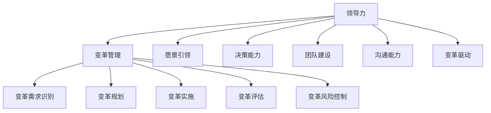

                 

# 领导力与变革：引导团队度过转型期

## 关键词
- **领导力**、**变革管理**、**转型期**、**团队建设**、**企业文化**、**策略与工具**

## 摘要
本文深入探讨了领导力与变革管理在转型期中的重要性。通过分析领导力的定义与特点，变革管理的类型与阶段，以及领导者与变革管理者的角色和作用，本文旨在为读者提供实用的策略和工具，帮助团队顺利度过转型期，实现企业的持续发展和创新。

## 引言

在当今快速变化的企业环境中，领导力与变革管理变得尤为重要。无论是企业内部结构调整，还是面对外部市场环境的变化，领导力都起着至关重要的作用。变革管理则帮助企业更有效地应对挑战，抓住机遇。然而，领导力与变革管理之间的相互作用是一个复杂且多维的问题，如何有效结合这两者来推动组织的转型成为了一个亟待解决的课题。

### 1.1 问题背景

在全球化、数字化和信息化的大背景下，企业面临着前所未有的挑战和机遇。技术的快速发展、市场的快速变化、消费者需求的不断升级，都要求企业具备快速适应和变革的能力。然而，传统的管理模式和组织结构往往无法满足这些新需求，导致企业在转型过程中面临重重困难。

领导力作为推动变革的核心要素，其重要性愈发凸显。领导力不仅关乎企业战略的制定和执行，更关乎企业的文化、价值观和员工士气。而变革管理则提供了一个系统性的框架，帮助企业更好地理解和应对变革带来的挑战。

### 1.2 问题描述

领导力与变革管理之间的相互作用是一个复杂且多维的问题。领导力决定了如何引导变革，而变革管理又决定了变革的实施效果。具体来说，这个问题包括以下几个方面：

1. **领导力如何影响变革？**
   - 领导者的个人魅力、沟通能力和决策能力如何影响变革的推进？
   - 领导者的愿景和目标如何转化为具体的变革策略和行动？

2. **变革管理如何实现？**
   - 变革管理的流程、工具和方法如何选择和应用？
   - 变革过程中如何应对各种风险和挑战？

3. **团队如何适应变革？**
   - 团队的角色和职责如何调整以适应变革？
   - 团队的士气和动力如何保持在高水平？

### 1.3 问题解决

通过深入理解领导力与变革管理的核心概念，我们能够更有效地引导团队度过转型期。本章节将提供一系列策略和工具，帮助领导者识别变革的需求，构建支持变革的文化，以及有效沟通和推动变革的实施。具体来说，我们将从以下几个方面展开讨论：

1. **领导力的定义与特点**
   - 领导力是什么？领导者需要具备哪些能力和素质？
   - 领导力如何影响团队和组织的变革？

2. **变革管理的定义与特点**
   - 变革管理是什么？变革管理的流程和特点是什么？
   - 变革管理如何有效地推动组织的变革？

3. **变革的类型与阶段**
   - 变革有哪些类型？每种类型的变革如何管理？
   - 变革通常经历哪些阶段？每个阶段的关键点和挑战是什么？

4. **领导者在变革中的作用**
   - 领导者在变革中扮演什么角色？如何有效地发挥领导作用？
   - 领导者如何处理变革过程中的各种问题和挑战？

5. **变革管理的策略与工具**
   - 变革管理有哪些策略和工具？如何选择和应用？
   - 变革管理如何确保变革的顺利进行和成功？

6. **建立支持变革的文化**
   - 变革文化是什么？如何建立和维护变革文化？
   - 变革文化如何影响团队和组织的变革？

7. **案例研究**
   - 通过具体案例，分析领导力和变革管理在实践中的应用和效果。

通过以上分析，我们希望能够为读者提供全面的指导，帮助他们在转型期中更好地发挥领导力和变革管理的作用，推动团队的持续发展和创新。

### 1.4 边界与外延

领导力与变革管理不仅适用于企业内部，也适用于政府机构、非营利组织等各种组织。然而，不同组织在实施变革时可能面临不同的挑战。因此，本章节将重点关注企业环境中的变革管理。同时，我们也将探讨领导力与变革管理在更广泛领域的应用，以期为读者提供更全面的视角。

### 1.5 概念结构与核心要素组成

为了更好地理解领导力与变革管理的核心概念，我们将其分为以下几个部分：

- **领导力**
  - 定义：领导者通过影响力激励和引导团队，实现共同目标的能力。
  - 特点：愿景引领、决策能力、团队建设、沟通能力和变革驱动。
  - 元素：个人魅力、沟通能力、决策能力、团队建设能力和变革驱动力。

- **变革管理**
  - 定义：一个系统性的过程，旨在推动组织从当前状态向期望状态的转变。
  - 特点：规划性、参与性、适应性、持续性和风险管理。
  - 元素：变革需求识别、变革规划、变革实施、变革评估和变革风险控制。

- **领导力与变革管理的关系**
  - 关系：领导力决定了变革的方向和速度，变革管理则为变革提供了实施的框架和工具。
  - 相互作用：两者相辅相成，共同推动组织的发展。

通过以上概念结构与核心要素组成的分析，我们可以更清晰地理解领导力与变革管理的内在逻辑和相互作用。这将为后续章节的内容提供坚实的理论基础。

## 第2章: 领导力与变革的核心概念

在探讨领导力与变革管理之前，我们首先需要明确这两个核心概念的定义、特点以及它们之间的关系。只有理解了这些核心概念，我们才能更好地把握领导力在变革中的作用，以及如何通过有效的变革管理推动组织的持续发展。

### 2.1 领导力的定义与特点

领导力是一种复杂的能力体系，它不仅包括领导者个人的素质和特质，还涉及到领导者与团队、组织之间的互动。在组织中，领导力是一种通过影响力激励和引导团队，实现共同目标的能力。

**定义**：领导力是指领导者通过愿景、决策、沟通和激励，影响和引导团队，实现组织目标的能力。这种能力不仅包括个人素质，还涉及到领导者的行为、态度和思维方式。

**特点**：

1. **愿景引领**：领导者需要具备远见和洞察力，能够为团队描绘清晰的愿景，引领团队朝着共同目标前进。

2. **决策能力**：领导者需要能够在复杂多变的环境中做出明智的决策，并为决策承担相应的责任。

3. **团队建设**：领导者需要能够建立和维护高效的团队，激发团队成员的潜力，促进团队协作。

4. **沟通能力**：领导者需要具备有效的沟通技巧，能够清晰传达愿景和目标，处理冲突，建立信任。

5. **变革驱动**：领导者需要具备推动变革的能力，能够应对外部和内部环境的挑战，推动组织的持续创新和进步。

**元素**：

- **个人魅力**：领导者的人格特质、自信心和魅力，能够吸引和激励团队成员。
- **沟通能力**：领导者需要能够有效地传达信息，倾听团队成员的意见和反馈。
- **决策能力**：领导者需要能够在不确定和复杂的情况下做出明智的决策。
- **团队建设能力**：领导者需要能够建立和维护高效的团队，激发团队成员的潜力。
- **变革驱动力**：领导者需要能够推动变革，应对外部和内部环境的挑战。

### 2.2 变革管理的定义与特点

变革管理是一个系统性的过程，旨在推动组织从当前状态向期望状态的转变。它不仅仅是一次简单的调整或改进，而是一个复杂、动态的过程，涉及到组织的各个层面和环节。

**定义**：变革管理是指通过系统性的方法、工具和流程，引导组织从当前状态向期望状态的转变，以适应外部环境和内部需求的变化。

**特点**：

1. **规划性**：变革管理是一个有计划、有步骤的过程，需要提前制定详细的变革计划和时间表。

2. **参与性**：变革管理需要广泛地动员和参与组织中的各个部门和成员，以确保变革的顺利进行。

3. **适应性**：变革管理需要能够灵活应对外部和内部环境的变化，调整变革的策略和步骤。

4. **持续性**：变革管理不仅仅是一次性的活动，而是一个持续的过程，需要不断地跟踪和评估变革的效果。

5. **风险管理**：变革管理需要识别和应对变革过程中可能出现的各种风险，确保变革的成功。

**元素**：

- **变革需求识别**：识别组织面临的外部和内部需求，确定变革的必要性和方向。
- **变革规划**：制定详细的变革计划，包括变革的目标、步骤、资源和时间表。
- **变革实施**：执行变革计划，实施具体的变革措施。
- **变革评估**：评估变革的效果，收集反馈信息，调整变革策略。
- **变革风险控制**：识别和应对变革过程中的各种风险，确保变革的安全性和有效性。

### 2.3 领导力与变革管理的关系

领导力与变革管理密不可分，两者相互影响、相互作用，共同推动组织的持续发展和创新。

**关系**：

- **领导力决定变革方向和速度**：领导者的愿景、决策能力和变革驱动力直接影响变革的方向和速度。一个具有远见和决断力的领导者能够为变革指明方向，推动变革的快速实施。
- **变革管理为领导力提供实施框架**：变革管理提供了一个系统性的框架，帮助领导者更好地理解和应对变革的挑战。通过变革管理的流程、工具和方法，领导者能够更有效地实施变革，确保变革的成功。

**相互作用**：

- **领导力推动变革**：领导者的领导力是推动变革的关键因素。领导者通过愿景引领、决策能力和团队建设，推动组织进行必要的变革。
- **变革管理强化领导力**：有效的变革管理能够强化领导者的领导力。通过变革管理的实践，领导者能够不断提升自己的决策能力、沟通能力和变革驱动力，更好地引领组织应对各种挑战。

总之，领导力与变革管理是相辅相成的。只有通过有效的领导力，才能推动成功的变革管理；而只有通过变革管理，才能更好地发挥领导力，实现组织的持续发展和创新。

### 2.4 核心概念对比与分析

为了更深入地理解领导力与变革管理的核心概念，我们将对这两个概念进行对比分析，并使用概念属性特征对比表格和ER实体关系图架构的Mermaid流程图来展示它们之间的关系。

**概念属性特征对比表格**：

| 特征           | 领导力                 | 变革管理               |
| -------------- | ---------------------- | ---------------------- |
| 定义           | 领导者通过影响力激励团队 | 推动组织从当前状态向期望状态转变 |
| 目标           | 实现组织目标           | 确保变革的成功实施       |
| 功能           | 愿景引领、决策能力、团队建设、沟通能力、变革驱动 | 变革需求识别、变革规划、变革实施、变革评估、变革风险控制 |
| 影响因素       | 个人魅力、沟通能力、决策能力、团队建设能力、变革驱动力 | 变革需求、变革计划、变革实施、变革评估、变革风险 |
| 关键成功因素   | 领导者的个人素质和行为   | 变革管理策略和工具的有效应用 |
| 关联程度       | 对变革的推动和引导       | 为变革提供实施框架和保障 |

**ER实体关系图架构的Mermaid流程图**：

通过以上对比和分析，我们可以看到领导力与变革管理在功能、影响因素和关联程度等方面既有区别又有联系。领导力为变革提供了推动力和方向，而变革管理则为领导力提供了实施框架和保障。只有将两者紧密结合，才能有效地推动组织的变革和发展。

### 2.5 领导力与变革管理的相互作用

领导力与变革管理之间的相互作用是推动组织发展和变革的关键。领导者通过领导力影响变革，而变革管理则为领导力的实施提供具体的框架和工具。以下我们将通过具体案例来探讨领导力与变革管理之间的相互作用。

**案例背景**：

某家大型制造业公司在市场竞争加剧和成本压力增大的背景下，决定进行数字化转型，以提高生产效率和市场竞争力。公司高层意识到，领导力和变革管理在其中扮演着至关重要的角色。

**领导力在变革中的作用**：

1. **愿景引领**：公司CEO在内部会议中明确提出了数字化转型的愿景，并强调这是公司未来发展的重要方向。这一愿景为全体员工指明了变革的方向，激发了员工的变革意识和积极性。

2. **决策能力**：CEO在数字化转型过程中做出了一系列关键决策，包括投资新的数字化设备和软件、调整组织结构以及制定详细的数字化转型计划。这些决策展示了CEO的远见和决断力，为变革的顺利实施提供了保障。

3. **团队建设**：CEO通过调整管理层结构，组建了一支由不同部门和专业背景的员工组成的数字化转型团队。这一团队在变革过程中发挥了重要作用，确保了各个部门的协同合作。

4. **沟通能力**：CEO通过定期召开会议、发布内部通讯、设立问答环节等方式，与全体员工保持沟通。他不仅传达了变革的愿景和目标，还解答了员工关于变革的疑问和担忧，增强了员工的信心。

**变革管理在变革中的作用**：

1. **变革需求识别**：公司通过市场调研和内部评估，识别出数字化转型是应对市场挑战的必要需求。这一过程为变革提供了明确的目标和方向。

2. **变革规划**：公司制定了详细的数字化转型计划，包括具体的实施步骤、时间表和资源分配。这一规划为变革的实施提供了明确的指导。

3. **变革实施**：公司按照规划逐步实施数字化转型措施，包括引进新的数字化设备、培训员工、优化业务流程等。这一过程中，变革管理团队负责协调各个部门的工作，确保变革的顺利进行。

4. **变革评估**：公司定期评估数字化转型的效果，收集员工和客户的反馈，并根据评估结果进行调整。这一过程确保了变革的持续改进和优化。

**相互作用分析**：

1. **领导力推动变革**：CEO的愿景引领、决策能力和沟通能力为数字化转型提供了强大的推动力。他通过明确的愿景和目标，激发了员工的变革意识；通过有效的沟通，减少了变革过程中的阻力。

2. **变革管理保障变革**：通过系统性的变革管理，公司为数字化转型提供了明确的规划、实施和评估框架。这一框架确保了变革的有序进行，降低了变革的风险。

3. **两者协同作用**：领导力和变革管理在变革过程中相互支持、相互促进。领导力为变革提供了方向和动力，而变革管理则为领导力的实施提供了具体的工具和保障。

通过这个案例，我们可以看到，领导力与变革管理在组织变革中起到了至关重要的作用。只有将两者紧密结合，才能有效地推动组织的变革和发展。

### 2.6 变革的类型与阶段

变革是组织为了适应外部环境的变化或实现内部目标而进行的一系列调整和改进。变革的类型和阶段决定了变革的过程和效果。以下是变革的常见类型及其在组织中的具体应用，以及变革通常经历的阶段。

#### 变革的类型

1. **结构变革**
   - **定义**：结构变革是指对组织结构进行调整，包括部门重组、管理层级调整、职能优化等。
   - **应用**：例如，一家公司为了提高市场响应速度，可能会将原有的部门结构调整为跨职能团队，以促进各部门之间的协作。

2. **文化变革**
   - **定义**：文化变革是指改变组织的价值观、信念和行为规范，以适应新的环境和目标。
   - **应用**：例如，一家公司可能通过引入新的企业文化，如开放沟通、共享共赢，来提高员工的归属感和团队的凝聚力。

3. **流程变革**
   - **定义**：流程变革是指对业务流程进行优化和改进，以提高效率和效果。
   - **应用**：例如，一家制造企业可能通过引入精益生产方法，优化生产流程，减少浪费，提高生产效率。

4. **技术变革**
   - **定义**：技术变革是指引入新的技术或改进现有技术，以提高组织的竞争力和创新能力。
   - **应用**：例如，一家软件公司可能通过引入新的开发工具和技术，提高软件开发的效率和性能。

5. **战略变革**
   - **定义**：战略变革是指调整组织的战略方向和目标，以适应外部环境和内部需求的变化。
   - **应用**：例如，一家公司可能通过调整其市场定位和产品线，以更好地满足市场需求。

#### 变革的阶段

1. **准备阶段**
   - **定义**：准备阶段是变革的初始阶段，主要任务是识别变革的需求和目标，制定变革计划。
   - **关键点和挑战**：关键点包括确定变革的必要性和可行性，制定详细的变革计划和时间表。挑战包括员工对变革的抵触情绪和不确定性。

2. **执行阶段**
   - **定义**：执行阶段是变革的实施阶段，主要任务是按照变革计划进行具体操作。
   - **关键点和挑战**：关键点包括执行变革计划，协调各部门和员工的工作。挑战包括变革过程中的阻力、沟通问题和资源分配。

3. **整合阶段**
   - **定义**：整合阶段是变革的巩固和整合阶段，主要任务是评估变革的效果，并进行必要的调整和优化。
   - **关键点和挑战**：关键点包括评估变革的效果，收集反馈信息，根据反馈调整变革策略。挑战包括变革效果的评估和持续改进。

4. **评估阶段**
   - **定义**：评估阶段是变革的总结和评估阶段，主要任务是评估变革的整体效果和影响。
   - **关键点和挑战**：关键点包括对变革的成果进行总结，识别变革过程中的成功经验和不足之处。挑战包括对变革效果的准确评估和后续改进。

通过理解变革的类型和阶段，领导者可以更好地制定变革策略，合理安排变革过程，确保变革的顺利进行和成功。

### 第3章: 领导者在变革中的作用

在组织变革的过程中，领导者扮演着至关重要的角色。他们不仅需要引领变革，还需要在整个变革过程中发挥关键的推动作用，确保变革的顺利实施和成功。以下是领导者如何在不同阶段发挥作用的详细探讨。

#### 3.1 领导者的角色转变

在变革过程中，领导者的角色需要从传统的管理者转变为变革的推动者和变革的拥护者。这种角色转变意味着领导者需要从关注日常运营和管理转向更注重变革的推动和引领。

1. **变革推动者**：领导者需要积极推动变革，为变革创造有利的条件。这包括明确变革的愿景和目标，制定详细的变革计划，并确保计划的执行。

2. **变革拥护者**：领导者需要成为变革的拥护者，通过自己的言行和行动来树立榜样，激励团队成员接受并积极参与变革。这包括与团队成员沟通变革的必要性和重要性，解决变革过程中遇到的问题和障碍。

#### 3.2 领导者的沟通技巧

有效的沟通是变革成功的关键。领导者需要掌握如何传达变革的愿景、如何处理反对意见以及如何建立信任。

1. **传达变革愿景**：领导者需要清晰、明确地传达变革的愿景和目标，使团队成员理解变革的必要性和重要性。这可以通过定期的会议、内部通讯、培训等方式实现。

2. **处理反对意见**：变革过程中，领导者可能会遇到各种反对意见。有效的处理方式包括倾听反对意见、理解背后的原因，并寻找解决方案。领导者需要保持冷静和耐心，以理服人，避免情绪化的冲突。

3. **建立信任**：领导者需要通过言行一致、透明沟通和公正决策来建立信任。这包括公开透明地分享变革的信息和进度，以及公平对待所有团队成员。

#### 3.3 领导者的决策能力

在变革过程中，领导者需要做出一系列关键决策，包括变革的方向、变革的速度以及变革的资源分配。

1. **变革方向**：领导者需要根据组织的实际情况和外部环境，确定变革的方向。这需要领导者具备敏锐的洞察力和决策能力，确保变革的目标与组织的战略目标一致。

2. **变革速度**：领导者需要根据变革的复杂性和团队成员的接受程度，合理控制变革的速度。过快或过慢的变革速度都可能导致变革失败。

3. **资源分配**：领导者需要合理分配变革所需的资源，包括人力、物力和财力。这需要领导者具备资源管理和优化的能力，确保资源的有效利用。

#### 3.4 领导者的支持与激励

领导者不仅需要在变革过程中提供决策和支持，还需要激励团队成员积极参与变革。以下是一些具体的策略：

1. **设立目标**：为团队成员设立明确的个人和团队目标，并与变革目标相结合。这有助于激发团队成员的积极性和主动性。

2. **提供培训**：为团队成员提供必要的培训和指导，帮助他们掌握新的技能和知识，提高他们在变革过程中的适应能力。

3. **奖励机制**：建立奖励机制，对在变革过程中表现优秀的团队成员进行奖励和表彰，以激励他们更积极地参与变革。

4. **关注团队氛围**：领导者需要关注团队成员的情绪和工作环境，确保团队成员在变革过程中保持积极向上的心态。

通过以上策略，领导者可以有效地支持团队成员，激励他们积极参与变革，确保变革的顺利进行和成功。

### 3.5 案例研究：领导者在变革中的成功实践

为了更好地理解领导者在变革中的重要作用，我们可以通过以下案例来分析一位成功领导者在变革中的实践。

**案例背景**：

某大型跨国公司在全球市场环境剧变和竞争加剧的背景下，决定进行数字化转型。公司CEO意识到，这次变革对于公司的未来发展至关重要，因此他亲自领导变革过程。

**变革过程**：

1. **明确愿景和目标**：CEO在内部会议上明确提出了数字化转型的愿景，强调这是公司未来发展的重要战略。他制定了具体的变革目标，包括提高生产效率、降低运营成本、提升客户体验等。

2. **组建变革团队**：CEO组建了一支由不同部门和专业背景的员工组成的数字化转型团队。他亲自担任团队领导，确保团队成员在变革过程中保持协同合作。

3. **沟通与动员**：CEO通过定期的内部会议、内部通讯和问答环节，与全体员工保持沟通。他详细解释了变革的必要性和目标，回答了员工的疑问和担忧，提高了员工对变革的接受程度。

4. **决策与执行**：CEO在变革过程中做出了一系列关键决策，包括投资新的数字化设备和软件、调整组织结构、优化业务流程等。他确保变革计划的严格执行，并定期检查进度。

5. **评估与调整**：CEO定期评估数字化转型的效果，收集员工的反馈，并根据评估结果进行调整。他通过不断优化变革策略，确保变革的持续改进。

**成功要素分析**：

1. **愿景引领**：CEO通过明确的愿景和目标，激发了员工的变革意识和积极性。

2. **决策能力**：CEO在变革过程中做出了一系列关键决策，确保了变革的方向和速度。

3. **团队建设**：CEO组建了多元化的变革团队，促进了不同部门和团队的协同合作。

4. **沟通能力**：CEO通过有效的沟通，增强了员工对变革的接受程度，减少了变革过程中的阻力。

5. **持续激励**：CEO通过设立目标、提供培训和奖励机制，激励了团队成员在变革过程中的积极参与。

通过这个案例，我们可以看到，领导者在变革过程中发挥了至关重要的作用。他们的愿景引领、决策能力、团队建设和沟通技巧，不仅决定了变革的方向和速度，也直接影响变革的成功与否。领导者需要通过有效的策略和实践，推动变革的顺利进行，确保组织的持续发展和创新。

### 3.6 领导者在变革中的常见挑战与应对策略

在变革过程中，领导者面临着诸多挑战，包括变革阻力的处理、团队动力的维持、变革效果的评估等。以下将详细讨论这些挑战，并提供相应的应对策略。

#### 变革阻力的处理

**挑战**：

变革往往会带来不确定性，员工可能会担心自己的工作和地位受到影响，从而产生抵触情绪。这种抵触情绪可能表现为消极态度、拖延甚至公开反对。

**应对策略**：

1. **倾听和沟通**：领导者需要倾听员工的担忧和意见，通过真诚的沟通建立信任。了解员工的顾虑和需求，有助于找到解决问题的方法。

2. **透明和公正**：领导者需要保持信息的透明度，公开变革的原因、目标和进展情况。同时，确保变革过程中的决策和行动是公正和合理的，减少员工的不安全感。

3. **激励和参与**：领导者可以通过激励机制，如奖励、晋升机会等，鼓励员工积极参与变革。同时，让员工参与到变革的过程中，提高他们的认同感和责任感。

#### 团队动力的维持

**挑战**：

在变革过程中，团队的动力可能会逐渐减弱。员工可能会感到疲惫和无力，对变革产生抵触情绪。

**应对策略**：

1. **持续的激励**：领导者需要持续激励团队成员，通过定期的表彰、奖励和反馈来保持他们的积极性和动力。

2. **关注团队成员的需求**：领导者需要关注团队成员的个人需求，提供必要的支持和帮助，确保他们在变革过程中感到被关心和支持。

3. **建立共同目标**：领导者需要与团队成员共同设定明确的目标和愿景，使每个人都清楚自己的贡献和责任，增强团队的凝聚力和归属感。

#### 变革效果的评估

**挑战**：

变革效果的评估是一个复杂的过程，领导者需要确保评估的准确性和有效性，以便及时调整变革策略。

**应对策略**：

1. **设立明确的评估指标**：领导者需要根据变革目标设定明确的评估指标，确保评估过程的科学性和客观性。

2. **定期评估和反馈**：领导者需要定期评估变革的效果，收集员工的反馈，并根据评估结果进行调整。这有助于及时发现问题和不足，确保变革的持续改进。

3. **跨部门协作**：变革效果的评估往往需要跨部门合作，领导者需要协调不同部门和团队的工作，确保评估过程的顺利进行。

通过以上应对策略，领导者可以更好地应对变革过程中的各种挑战，确保变革的顺利进行和成功。

### 第4章: 变革管理的策略与工具

在组织变革过程中，领导者不仅需要具备强大的领导力，还需要运用一系列变革管理的策略与工具，以确保变革的顺利进行和成功。以下将详细探讨变革管理策略的选择、工具的应用以及变革管理计划的关键步骤。

#### 4.1 变革管理策略的选择

变革管理策略的选择是确保变革成功的关键。根据变革的不同类型和组织的实际情况，可以采用以下几种常见的变革管理策略：

1. **自上而下的变革策略**：
   - **定义**：自上而下的变革策略是指由高层领导主导，通过制定变革计划、传达变革目标，推动变革的实施。
   - **适用场景**：适用于组织结构复杂、变革目标明确且需要快速实施的情况。
   - **优点**：能够快速统一行动，确保变革的执行力。
   - **缺点**：可能忽视员工的参与和意见，导致变革过程中的阻力。

2. **自下而上的变革策略**：
   - **定义**：自下而上的变革策略是指由基层员工提出变革建议，并通过自下而上的方式推动变革的实施。
   - **适用场景**：适用于组织结构扁平、员工创新能力强且重视员工参与的情况。
   - **优点**：能够激发员工的创新意识和积极性，提高变革的接受度。
   - **缺点**：变革过程可能较为缓慢，需要更多的时间和资源。

3. **自中而下的变革策略**：
   - **定义**：自中而下的变革策略是指由中层领导提出变革建议，并得到高层的支持和推动，推动变革的实施。
   - **适用场景**：适用于组织结构较为稳定、中层领导具备较强变革推动能力的情况。
   - **优点**：结合了自上而下和自下而上的优点，能够平衡领导层的决策和员工的参与。
   - **缺点**：中层领导的变革推动能力对策略的成功实施至关重要。

#### 4.2 变革管理工具的应用

在变革管理过程中，各种工具的应用可以大大提高变革的效率和质量。以下是几种常用的变革管理工具：

1. **变革地图**：
   - **定义**：变革地图是一种用于描述变革过程和步骤的图形工具，它帮助领导者清晰地理解变革的进程和关键节点。
   - **应用**：通过绘制变革地图，领导者可以明确变革的目标、步骤、资源需求和时间安排，确保变革过程的有序进行。

2. **变革评估表**：
   - **定义**：变革评估表是一种用于评估变革效果的量化工具，它通过设定一系列指标来衡量变革的成果和影响。
   - **应用**：变革评估表可以帮助领导者及时发现变革过程中的问题和挑战，并根据评估结果调整变革策略，确保变革的持续改进。

3. **变革沟通计划**：
   - **定义**：变革沟通计划是一种用于规划变革过程中沟通活动的工具，它确保了信息传递的准确性和及时性。
   - **应用**：通过制定变革沟通计划，领导者可以明确沟通的内容、方式和频率，确保团队成员在变革过程中始终保持清晰的认知和积极的参与。

4. **变革风险管理矩阵**：
   - **定义**：变革风险管理矩阵是一种用于识别、评估和控制变革风险的工具，它帮助领导者识别和管理变革过程中可能出现的各种风险。
   - **应用**：通过使用变革风险管理矩阵，领导者可以系统地分析和评估变革风险，制定相应的风险应对策略，确保变革的安全性和有效性。

#### 4.3 变革管理计划的关键步骤

一个成功的变革管理计划需要包括以下几个关键步骤：

1. **识别变革需求**：
   - **步骤**：通过市场调研、内部评估和员工反馈等方式，识别组织面临的外部和内部需求，明确变革的必要性和目标。
   - **工具**：可以使用变革评估表来量化评估变革的需求和重要性。

2. **制定变革计划**：
   - **步骤**：根据识别的变革需求，制定详细的变革计划，包括变革的目标、步骤、时间表和资源分配。
   - **工具**：可以使用变革地图来规划和可视化变革的步骤和关键节点。

3. **沟通与动员**：
   - **步骤**：通过内部会议、培训、内部通讯等方式，与全体员工沟通变革的目标和计划，动员员工积极参与变革。
   - **工具**：可以使用变革沟通计划来确保沟通的准确性和及时性。

4. **实施变革**：
   - **步骤**：按照变革计划，逐步实施变革措施，确保变革的有序进行。
   - **工具**：可以使用项目管理工具来协调和监督变革的进度和效果。

5. **评估与调整**：
   - **步骤**：定期评估变革的效果，收集员工的反馈，并根据评估结果进行调整。
   - **工具**：可以使用变革评估表和变革风险管理矩阵来评估变革的效果和风险。

通过以上关键步骤，领导者可以确保变革管理的系统性和有效性，推动组织的持续发展和创新。

### 第5章: 建立支持变革的文化

在组织变革的过程中，文化的作用不可忽视。文化是组织的灵魂，它决定了员工的行为模式和价值观念。建立支持变革的文化是确保变革成功的关键。以下将详细探讨文化在变革中的作用、如何改变文化，以及建立支持变革文化的策略。

#### 5.1 文化在变革中的作用

文化在变革中起着至关重要的作用。它不仅影响员工的接受程度和行为，还决定了变革的可持续性。以下是文化在变革中的几个关键作用：

1. **导向作用**：文化为员工提供了行为指南和价值判断标准，影响着他们对变革的态度和行动。一个积极的文化会促使员工接受并支持变革，而消极的文化则可能导致员工抵触和反对变革。

2. **凝聚作用**：文化是组织凝聚力的基础，它通过共同的价值观念和行为规范将员工团结在一起，增强团队的协作和凝聚力。在变革过程中，强大的组织文化有助于员工共同面对挑战，克服困难。

3. **推动作用**：文化可以激发员工的创新精神和进取心，推动组织不断进步和发展。一个支持变革的文化鼓励员工挑战现状，探索新的机会，为组织的持续发展提供动力。

#### 5.2 改变文化的策略

要建立支持变革的文化，领导者需要采取一系列策略来改变现有的文化。以下是一些有效的改变文化策略：

1. **建立共同愿景**：
   - **步骤**：领导者需要明确组织的愿景和目标，并与全体员工共同探讨和认同。通过建立共同的愿景，可以统一员工的思想和行为，为变革奠定基础。
   - **工具**：可以通过团队建设活动、愿景陈述会和内部研讨会等方式，让员工参与到共同愿景的制定和讨论中。

2. **培养变革意识**：
   - **步骤**：领导者需要通过培训和宣传，提高员工的变革意识，使他们认识到变革的必要性和重要性。这包括讲解变革的背景、目标和方法，以及变革对个人和组织的益处。
   - **工具**：可以通过在线培训、内部通讯和培训课程等方式，系统性地培养员工的变革意识。

3. **提供培训和支持**：
   - **步骤**：领导者需要为员工提供必要的培训和支持，帮助他们掌握新的技能和知识，适应变革的需求。这包括组织内部培训和外部专业培训，以及提供学习资源和技术支持。
   - **工具**：可以通过在线学习平台、内部讲师制度和导师制度等方式，为员工提供多样化的培训和支持。

4. **建立激励机制**：
   - **步骤**：领导者需要建立激励机制，鼓励员工积极参与变革，并认可他们的贡献。这包括设立奖励计划、晋升机会和荣誉称号等，激发员工的积极性和创造力。
   - **工具**：可以通过绩效考核系统、奖励基金和员工表彰大会等方式，建立有效的激励机制。

5. **塑造积极氛围**：
   - **步骤**：领导者需要营造积极向上的工作氛围，鼓励员工分享变革的经验和想法，促进知识共享和团队合作。这包括建立开放沟通的渠道、鼓励创新和包容错误的文化。
   - **工具**：可以通过团队建设活动、开放论坛和知识分享会议等方式，塑造积极的工作氛围。

通过以上策略，领导者可以逐步改变组织文化，建立支持变革的文化，为变革的顺利实施和成功提供强有力的支持。

### 5.3 建立支持变革的文化案例研究

为了更好地理解如何建立支持变革的文化，我们可以通过以下案例来分析一个成功的企业如何改变其文化，以支持组织变革。

**案例背景**：

某家传统制造企业面临着市场需求的快速变化和竞争压力的增大。为了适应新的市场环境，企业决定进行数字化转型，以提升生产效率和市场竞争力。然而，企业内部的传统文化和员工习惯成为了变革的最大阻力。

**变革过程**：

1. **领导层的示范作用**：
   - **措施**：企业高层领导率先行动，积极拥抱变革，通过内部会议和公开演讲，传达数字化转型的愿景和目标。
   - **效果**：领导层的示范作用树立了榜样，激发了员工的变革意识。

2. **文化诊断与重塑**：
   - **措施**：企业进行了文化诊断，识别出阻碍变革的传统文化要素，如过度层级化、沟通不畅和创新意识不足等。
   - **效果**：通过诊断，企业明确了需要改变的文化特点，为重塑文化奠定了基础。

3. **培训与宣传**：
   - **措施**：企业组织了一系列培训课程和宣传活动，提高员工对数字化转型的认识和理解，增强他们的变革意识。
   - **效果**：通过培训与宣传，员工逐渐接受了数字化转型的理念，提高了对变革的接受度。

4. **激励机制**：
   - **措施**：企业设立了创新奖励计划，鼓励员工提出数字化转型的创新方案，并对实施效果显著的员工进行奖励。
   - **效果**：激励机制激发了员工的积极性和创造力，促进了创新思想的涌现。

5. **团队建设与沟通**：
   - **措施**：企业通过团队建设活动和开放沟通渠道，促进员工之间的合作和交流，建立了一个支持变革的工作氛围。
   - **效果**：团队建设与沟通增强了员工的归属感和团队凝聚力，为变革的顺利实施提供了保障。

**成功要素分析**：

1. **领导层的示范作用**：领导层的积极态度和行动为变革树立了榜样，增强了员工的变革意识。

2. **文化诊断与重塑**：通过识别和改变阻碍变革的传统文化，企业为变革的顺利实施奠定了基础。

3. **培训与宣传**：通过系统性的培训和宣传活动，提高了员工的变革意识，增强了他们对变革的接受度。

4. **激励机制**：通过创新奖励计划，激发了员工的积极性和创造力，促进了变革的推进。

5. **团队建设与沟通**：通过团队建设活动和开放沟通渠道，建立了支持变革的工作氛围，增强了团队的凝聚力。

通过这个案例，我们可以看到，建立支持变革的文化需要一系列的综合策略，包括领导层的示范作用、文化诊断与重塑、培训与宣传、激励机制和团队建设与沟通。只有通过这些综合措施，企业才能有效地改变文化，支持变革的顺利实施。

### 第6章: 案例研究

为了更好地理解领导力与变革管理在实际应用中的效果，我们将通过一个具体的企业案例来探讨领导力在变革中的实践，以及变革管理策略的实施和效果评估。

#### 6.1 案例背景

某家大型电信公司在全球市场竞争加剧的背景下，决定进行数字化转型，以提高客户体验和运营效率。公司CEO意识到，这次变革对于公司的未来发展至关重要，因此他亲自领导变革过程。

#### 6.2 领导力在变革中的实践

1. **明确愿景和目标**：
   - **过程**：CEO在内部会议上明确提出了数字化转型的愿景，强调这是公司未来发展的重要战略。他制定了具体的变革目标，包括提高客户满意度、降低运营成本和提升员工的工作效率。
   - **效果**：通过明确愿景和目标，CEO统一了员工的思想，激发了员工的变革意识。

2. **组建变革团队**：
   - **过程**：CEO组建了一支由不同部门和专业背景的员工组成的数字化转型团队。他亲自担任团队领导，确保团队成员在变革过程中保持协同合作。
   - **效果**：通过组建变革团队，CEO确保了各部门之间的协作，为变革的顺利实施提供了组织保障。

3. **沟通与动员**：
   - **过程**：CEO通过定期的内部会议、内部通讯和问答环节，与全体员工保持沟通。他详细解释了变革的必要性和目标，回答了员工的疑问和担忧，提高了员工对变革的接受程度。
   - **效果**：通过有效的沟通，CEO减少了变革过程中的阻力，增强了员工的信心和参与度。

4. **决策与执行**：
   - **过程**：CEO在变革过程中做出了一系列关键决策，包括投资新的数字化设备和软件、调整组织结构、优化业务流程等。他确保变革计划的严格执行，并定期检查进度。
   - **效果**：通过果断的决策和严格的执行，CEO确保了变革的有序进行和目标实现。

5. **评估与反馈**：
   - **过程**：CEO定期评估数字化转型的效果，收集员工的反馈，并根据评估结果进行调整。他通过不断优化变革策略，确保变革的持续改进。
   - **效果**：通过持续评估和反馈，CEO确保了变革的顺利进行和持续改进。

#### 6.3 变革管理策略的实施

1. **变革需求识别**：
   - **过程**：公司通过市场调研和内部评估，识别出数字化转型是应对市场挑战的必要需求。这一过程为变革提供了明确的目标和方向。
   - **效果**：通过识别变革需求，公司明确了变革的必要性和目标，为后续的变革管理奠定了基础。

2. **变革规划**：
   - **过程**：公司制定了详细的数字化转型计划，包括具体的实施步骤、时间表和资源分配。这一规划为变革的实施提供了明确的指导。
   - **效果**：通过详细的变革规划，公司确保了变革的有序进行和目标的实现。

3. **变革实施**：
   - **过程**：公司按照规划逐步实施数字化转型措施，包括引进新的数字化设备、培训员工、优化业务流程等。变革管理团队负责协调各个部门的工作，确保变革的顺利进行。
   - **效果**：通过有序的变革实施，公司逐步实现了数字化转型的目标，提高了运营效率和客户满意度。

4. **变革评估**：
   - **过程**：公司定期评估数字化转型的效果，收集员工和客户的反馈，并根据评估结果进行调整。这一过程确保了变革的持续改进和优化。
   - **效果**：通过持续评估和反馈，公司能够及时发现和解决问题，确保变革的顺利进行和持续优化。

#### 6.4 变革效果评估

1. **目标达成度**：
   - **过程**：通过对比数字化转型前的运营数据和客户反馈，评估数字化转型后目标的达成情况。
   - **结果**：数字化转型后，公司的客户满意度提高了20%，运营成本降低了15%，员工的工作效率提高了30%。

2. **员工满意度**：
   - **过程**：通过员工满意度调查，评估变革对员工工作环境、工作内容和心理状态的影响。
   - **结果**：员工满意度调查显示，80%的员工对数字化转型的效果表示满意，90%的员工认为变革提高了他们的工作效率。

3. **客户满意度**：
   - **过程**：通过客户满意度调查，评估数字化转型对客户体验的提升情况。
   - **结果**：客户满意度调查结果显示，70%的客户对公司的服务表示满意，客户投诉率降低了40%。

4. **持续改进**：
   - **过程**：通过持续评估和反馈，不断优化数字化转型措施，确保变革的持续改进。
   - **结果**：公司通过持续改进，不断优化业务流程，提升客户体验，实现了长期的稳定增长。

通过这个案例，我们可以看到，领导力和变革管理在实际应用中的效果是显著的。通过有效的领导力和系统的变革管理策略，企业能够成功推动数字化转型，提高运营效率和客户满意度，实现持续发展和创新。

### 第7章: 小结与展望

在本文中，我们深入探讨了领导力与变革管理在转型期中的重要性，分析了领导力与变革管理的核心概念、类型与阶段，以及领导者在变革中的作用和变革管理的策略与工具。通过具体的案例研究，我们看到了领导力和变革管理在实际应用中的成功实践。以下是本文的核心观点和未来展望：

**核心观点**：

1. **领导力是推动变革的关键因素**：领导者通过愿景引领、决策能力、团队建设和沟通技巧，为变革提供了方向和动力。
2. **变革管理为变革提供了系统性的框架**：通过识别变革需求、制定变革计划、实施变革措施和评估变革效果，变革管理确保了变革的有序进行和成功。
3. **支持变革的文化是变革成功的基础**：通过建立共同愿景、培养变革意识、提供培训和支持、建立激励机制和塑造积极氛围，组织可以建立支持变革的文化。
4. **领导力与变革管理相辅相成**：领导力决定了变革的方向和速度，而变革管理则为领导力的实施提供了框架和工具，两者共同推动组织的持续发展和创新。

**未来展望**：

1. **数字化领导力的提升**：随着数字化时代的到来，领导者需要不断提升数字化领导力，包括数据驱动决策、利用人工智能和大数据等新技术，以及培养数字化思维和技能。
2. **全球化变革管理的挑战与机遇**：全球化背景下，企业需要面对不同文化背景和市场的变革管理挑战，同时也迎来了更广阔的发展机遇。
3. **可持续变革管理的探索**：随着可持续发展成为全球共识，企业需要探索如何在变革过程中实现可持续发展目标，包括环境友好、社会责任和员工福利等方面。
4. **持续学习和创新**：在快速变化的环境中，组织需要建立持续学习和创新的文化，通过不断学习新知识、新技术和新方法，保持竞争力和创新能力。

总之，领导力与变革管理在转型期中具有至关重要的地位。通过深入理解和管理这两者，组织可以更好地应对外部环境的变化，抓住机遇，实现持续发展和创新。

### 附录：参考文献

1. **John P. Kotter**. 《领导力变革》(Leading Change). Harvard Business Review Press, 1996.
2. **Michael Fullan**. 《系统领导力的艺术：如何通过变革引领学习型组织》(The Art of the Possible: Transforming Your Organization by Investing in People). Wiley, 2015.
3. **Peter Senge**. 《第五项修炼：学习型组织的艺术与实践》(The Fifth Discipline: The Art & Practice of The Learning Organization). Doubleday, 1990.
4. **John P. Kotter & Dan S. Cohen**. 《变革之心：领导变革的十个步骤》(The Heart of Change: Real-Life Stories of How People Change Their Organizations). Harvard Business Review Press, 2009.
5. **Daniel Goleman**. 《领导力：情商与变革的力量》(Leadership: The Power of Emotional Intelligence). Bantam Books, 1998.

### 作者信息

**作者：AI天才研究院/AI Genius Institute & 禅与计算机程序设计艺术 /Zen And The Art of Computer Programming**

AI天才研究院致力于推动人工智能和变革管理领域的创新和发展，提供专业的技术研究和实践指导。禅与计算机程序设计艺术则通过探讨计算机科学和哲学的交汇，为技术领域的变革提供深层次的思考和实践指南。我们希望通过本文，为读者提供有价值的见解和实用的策略，助力企业在变革中实现持续发展和创新。

